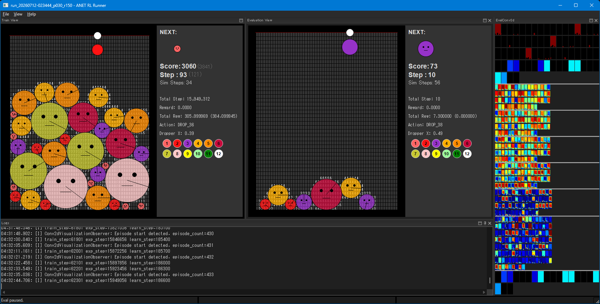

# anet-lab

## 概要

anet-labは、libtorchを基盤とするC++20の強化学習実験プロジェクトです。
Agent、Env、ニューラルネットワーク、メトリクスを設定から組み立て、
学習・評価・Runの記録と比較までを一つの環境で試せることを目指しています。

学習と評価はwxWidgets製のRunnerで実行し、記録したメトリクスは
Java/Spring製のMetrics Viewerで可視化・比較できます。
Windows 11 x64とNVIDIA CUDAを主な実行環境とする、個人の学習・実験用途のプロジェクトです。

## 主な構成

- C++20 / libtorchによるAgent、Env、学習基盤
- 設定ファイルによるニューラルネットワークと実験構成
- wxWidgets製Runnerによる学習、評価、実行状態の可視化
- Java/Spring製Metrics Viewerによるメトリクスのリアルタイム表示とRun比較
- メトリクス、動画、プロファイルを含むRun成果物の記録

## ガイド

- 開発環境とビルド・テスト手順: [開発環境構築ガイド](docs/design/040_development_environment.jp.md)
- 設定ファイルの選択とRunnerの操作: [Run実行ユーザーガイド](docs/design/020_user_guide_run.jp.md)
- メトリクスの確認とRun比較: [Run分析ユーザーガイド](docs/design/030_user_guide_analysis.jp.md)

主な実行環境はWindows/MSVC、libtorch、wxWidgets、CUDAです。
環境要件と具体的な検証コマンドは、開発環境構築ガイドを参照してください。

## ドキュメント

日本語ドキュメントの入口は[docs/design/README.jp.md](docs/design/README.jp.md)です。
フレームワーク全体像、ユーザーガイド、開発環境、機能カテゴリ別・具象Agent別の設計ガイドを参照できます。

| 場所 | 役割 |
|---|---|
| [docs/design/](docs/design/) | 現在の構成、利用方法、実装上のcontract |
| [CONTEXT.md](CONTEXT.md) | プロジェクト内で使うドメイン用語の正本 |
| [docs/adr/](docs/adr/) | 採用した設計判断と理由 |
| [docs/memo/](docs/memo/) | 未実装の要求、検討中の設計、実装計画 |
| [docs/ownership_guideline.md](docs/ownership_guideline.md) | Agent系State / Resourceの所有権規則 |

現行動作の最終的な根拠はコード、設定、テストとします。
変更前の計画は`docs/memo/`、採用後も残す判断理由は`docs/adr/`に記録します。

## ギャラリー

### Runnerによる学習・評価と可視化

### Metrics Viewerでによる分析

## AIを活用した開発

OpenAIのChatGPT / CodexとAnthropicのClaude Codeを使い分けながら、
設計、実装、レビュー、テスト、ドキュメント整備を進めています。

## ライセンス

特記のない本リポジトリのファーストパーティ部分は、[Apache License 2.0](LICENSE)で提供します。
著作権表示は[NOTICE](NOTICE)を参照してください。

`third_party/`、`licenses/`、およびファイル内で別のライセンスが明記された部分には、
それぞれのライセンス条件が適用されます。
