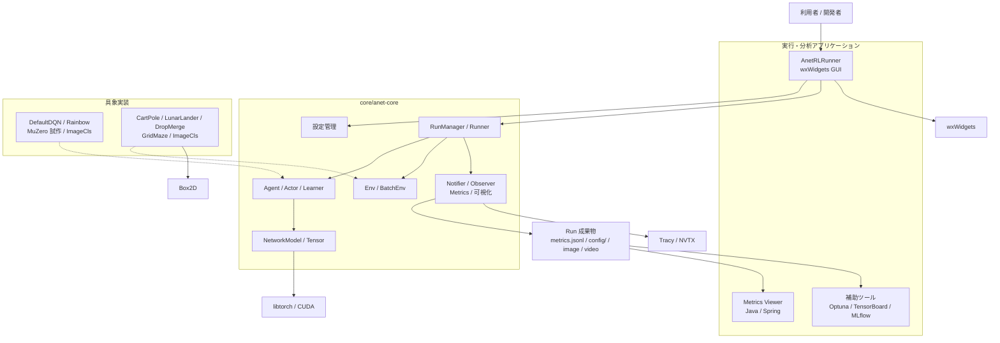
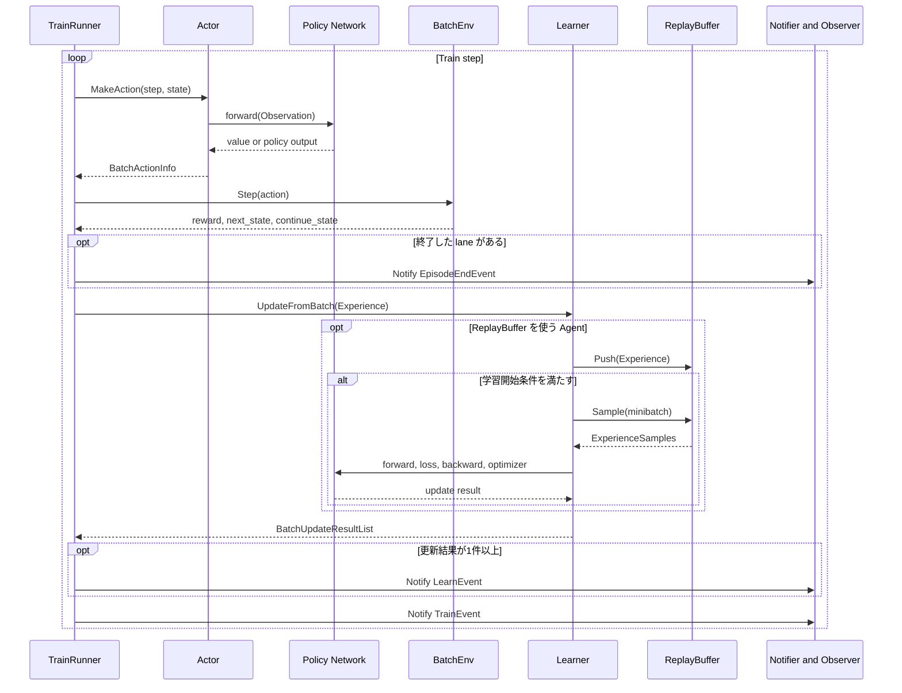
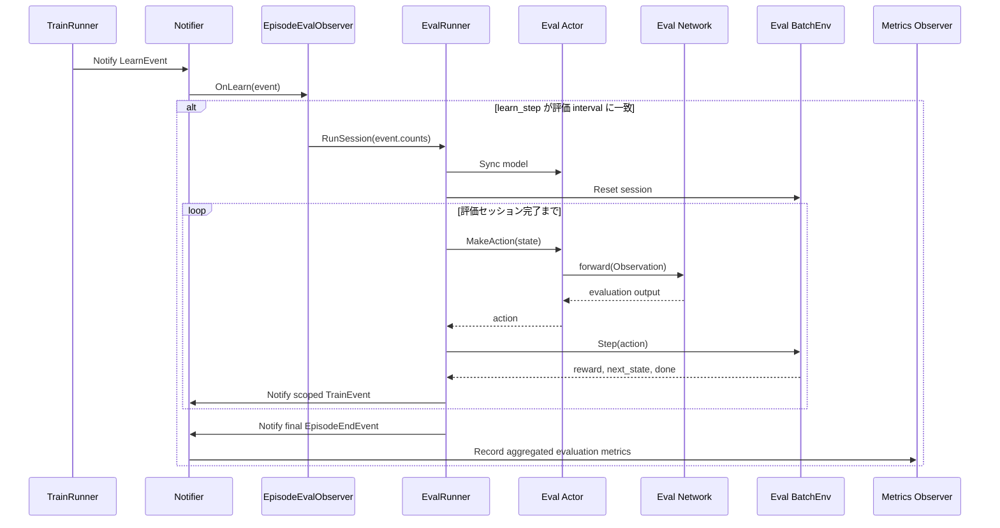

<!-- translated-from: 010_framework_overview.jp.md blob:fb9a2169fcab789aa4e91c0cdd183cc296fffcb9 date:2026-09-23 progress:done -->
# ANET Framework Overview

> Primary perspective: overall structure (organized mainly by function, with major workflows included)

## 1. Introduction

### 1.1 Purpose

This document provides a single reference for understanding ANET's basic concepts, features, software structure, and main processing flows.

### 1.2 Audience

- People using ANET for the first time
- People running or analyzing Runs
- Developers modifying the framework, Agents, Envs, or applications

### 1.3 Scope

This document covers the overall structure and representative features implemented in the current repository. Individual configuration keys, screen operations, and class-level design are covered in the relevant user or design guides. Proposals under development and unresolved questions are kept separate from this text in `docs/memo/`.

## 2. ANET Overview

### 2.1 Positioning

ANET is a framework for running and observing reinforcement learning experiments that learn policies through interaction with environments, within a single C++ application. It integrates libtorch tensor computation and neural networks, a wxWidgets GUI, and per-Run metrics recording.

The project is under continuous development as personal experimental code for evaluating learning algorithms and implementation approaches. It is not a product library with a stable public API; configuration and internal structure evolve with the experiments.

### 2.2 Runtime Environment

| Item | Current status |
|---|---|
| OS | Verified on Windows 11 x64 |
| GPU | Verified with an NVIDIA GPU and a CUDA-enabled version of libtorch |
| CUDA | The selected libtorch, NVIDIA driver, and CUDA Toolkit must be compatible |
| CPU-only | Some Agents and configurations have CPU paths, but a CPU-only configuration of the entire framework is unverified |
| Other operating systems | Linux and macOS are unverified |
| GUI | Native GUI using wxWidgets |

No single GPU model or minimum VRAM capacity is specified. Requirements depend on the Env, NetworkModel, batch size, and other configuration choices. See the [Development Environment Setup Guide](040_development_environment.en.md) for setup instructions, including development tools.

## 3. Basic Concepts

### 3.1 Reinforcement Learning and Data Concepts

| Term | Meaning in ANET |
|---|---|
| Env | An environment that receives actions and returns the next Observation, Reward, and termination state |
| State | The state of an Env at a point in time. It combines an Observation with `done`, `truncated`, and `episode_start`, represented by `SingleState` for a single Env and `BatchState` for a batch |
| Observation | Observations passed from an Env to an Agent, represented as a `TensorDict` with multiple observation keys |
| Action | An action selected by an Agent and passed to an Env. `ActionSpec` defines its discrete or continuous specification |
| Reward | A value evaluating the result of an Action |
| Episode | The interval from an Env Reset to its termination condition |
| Experience | Training data combining a State, Action, Reward, and next State |
| ReplayBuffer | A buffer that stores Experiences and samples training minibatches |

Here, State means the state exposed by the Env through the shared interface and passed between Runner and Agent. It does not mean the Env's complete internal simulation state. State in the ownership discussion in [Chapter 8](#8-basic-design-principles) is the general term for mutable state within a module, rather than being limited to this data type.

Typical Observation keys are `vector` for low-dimensional vectors, `grid` for images or grids, and `action_mask` for legal actions. Each Env defines contracts such as shape, dtype, and value range through `EnvSpec`.

### 3.2 Runtime Components

| Term | Responsibility |
|---|---|
| Agent | Creates Actors and Learners and coordinates the lifetimes of Run-level resources such as NetworkModel. Concrete implementations may place ReplayBuffer and optimizer under a Learner owned by the Agent |
| Actor | Produces Actions from Observations. Separate instances can be created for Train and Eval |
| Learner | Receives Experiences and updates ReplayBuffer and trains NetworkModel as needed |
| BatchEnv | Groups multiple Envs and performs Reset and Step in batches |
| Runner | Advances steps by invoking Actor, BatchEnv, and Learner during Train, or Actor and BatchEnv during Eval |
| RunManager | Constructs Env, Agent, TrainRunner, EvalRunner, and Observers from configuration and manages one execution |
| Notifier / Observer | Publishes and subscribes to Events such as Train, Learn, and EpisodeEnd, triggering evaluation, recording, and visualization |
| Run | A unit combining one application execution with its configuration, metrics, and artifacts |

### 3.3 Step Axes

ANET counts different amounts of processing along separate axes instead of combining them into a single step.

| Axis | What it counts |
|---|---|
| `train_step` | TrainRunner iterations |
| `exp_step` | Transitions obtained from the Env |
| `update_step` | Update operations that pass Experiences to the Learner |
| `learn_step` | Learning updates performed by the Learner |
| `episode_count` | Completed Episodes |
| `sim_step` | Internal Env simulation steps |

When comparing graphs or Runs, align axes and ranges with the same meaning.

These counters are members of individual Runners; **an axis name does not identify a globally unique coordinate**. The train runner's `exp_step` and the eval runner's `exp_step` belong to different coordinate systems. They can be compared on the same horizontal axis only when both the axis name and owning Runner match. See the step coordinate systems in [Observability](140_observability.en.md) for details.

## 4. Software Structure

### 4.1 Overall Structure

`AnetRLRunner` is the entry point that coordinates configuration and execution. Training uses concrete Agents and Envs through the abstractions and shared implementations in `anet-core`. Runner and Observers record metrics in the Run directory, which the Viewer and supporting tools read independently of the running process.

### 4.2 Code Map

| Path | Main contents |
|---|---|
| `core/anet-core/include/anet/` | Public framework headers |
| `core/anet-core/src/` | Shared infrastructure, Agents, NN, ReplayBuffer, Observers, tests |
| `core/envs/` | Env implementations for CartPole, LunarLander, DropMerge, GridMaze, and ImageCls |
| `apps/runner/` | `AnetRLRunner`, UI panels, configuration, startup and analysis scripts |
| `apps/metrics-viewer/` | Java/Spring-based Metrics Viewer |
| `viewers/metrics-tools/` | Python viewer and TensorBoard/MLflow bridges |
| `docs/design/` | Current overview, usage, and design |
| `docs/adr/` | Adopted design decisions |
| `docs/memo/` | Requirements, plans, and changes under consideration |

## 5. Feature List

Section 5.1 organizes shared framework features by function and corresponds one-to-one with the feature specifications in Sections 6.1–6.11. Sections 5.2 and 5.3 list the concrete implementations and applications using those features. The design guides by functional category group responsibilities and code that need to be checked together when making changes, so they may cover multiple categories in units different from this feature list.

### 5.1 Core Features

| Category | Main features | Specification |
|---|---|---|
| Configuration management | Properties-style key-value pairs, `$include`, configuration group merging, command-line overrides | [6.1](#61-configuration-management) |
| Shared reinforcement learning infrastructure | Contracts and shared implementations for Env, Agent, Actor, Learner, Runner, and Event | [6.2](#62-shared-reinforcement-learning-infrastructure) |
| Shared Env features | Env specifications, batching single Envs, parallel Step execution with worker threads | [6.3](#63-shared-env-features) |
| Shared Agent features | Actor/Learner creation, State/Resource ownership, observation and reward scalers, schedules, seed management | [6.4](#64-shared-agent-features) |
| ReplayBuffer | Experience storage and sampling, N-step, PER, frame stacks, prefetch and device transfer | [6.5](#65-replaybuffer) |
| Neural networks | Configuration-based construction of NetworkModel, modules and heads, initialization, optimizer | [6.6](#66-neural-networks) |
| Run management | TrainRunner, EvalRunner, serial execution, pipeline execution overlapping learning and Env processing | [6.7](#67-run-management) |
| Metrics | Per-Run recording of scalars, images, videos, GraphViz, and configuration | [6.8](#68-metrics) |
| Visualization | GUI display of Env screens, Q values, heat maps, Conv2d activations, and more | [6.9](#69-visualization) |
| Profiling | Tracy and NVTX measurement ranges and annotations for CPU/GPU performance analysis | [6.10](#610-profiling) |
| Tests | Unit and integration tests for the core and some Envs using Catch2 | [6.11](#611-tests) |

### 5.2 Agent and Env Implementations

See [6.12](#612-concrete-agent-and-env-implementations) for selecting and extending concrete implementations.

| Type | Implementation | Overview |
|---|---|---|
| Agent | `DefaultDQNAgent` | Standard implementation for DQN-based value learning |
| Agent | `RainbowAgent` | Agent implementation for Rainbow configurations |
| Agent | `MuZeroAgent` | Prototype MuZero implementation for deterministic Envs |
| Agent | `ImageClsAgent` | Supervised learning implementation for image classification |
| Env | `CartPoleEnv` | Inverted pendulum environment with vector Observations |
| Env | `LunarLanderEnv` | Lunar landing environment using Box2D |
| Env | `DropMergeEnv` | Falling and merging game environment with grid-image Observations |
| Env | `GridMazeEnv` | Partially observed grid maze environment |
| Env | `ImageClsEnv` | Native BatchEnv that assembles a Dataset directly into fixed-B Tensors and scores them |

### 5.3 Applications and Analysis

See [6.13](#613-applications-and-analysis) for the boundary between the execution process and analysis tools.

| Feature | Overview |
|---|---|
| `AnetRLRunner` | Train and Eval execution, Env display, logs, and visualization of Q values and NN internals |
| Metrics Viewer | Browser-based comparison of scalar metrics across multiple Runs and tags |
| TensorBoard bridge | Integration for inspecting `metrics.jsonl` in TensorBoard |
| MLflow bridge | Integration of Run metrics with MLflow |
| Optuna harness | Runs trials with configuration overrides to search hyperparameters |

## 6. Feature Specifications

### 6.1 Configuration Management

Configuration management resolves Properties-style files, `$include`, configuration group merges, and command-line `key=value` assignments into one `ConfigData`. Each component's `Config` reads string values into typed fields and detects invalid types, ranges, and combinations during construction. All resolved settings and the values actually interpreted by each Config object are recorded as Run artifacts.

See [Runtime Infrastructure and Configuration](100_runtime_and_configuration.en.md) for resolution order and error contracts. See Chapter 3 of the [Run Execution Guide](020_user_guide_run.en.md) for configuration syntax and authoring.

### 6.2 Shared Reinforcement Learning Infrastructure

The shared reinforcement learning infrastructure defines the interfaces for `Env`, `Agent`, `Actor`, `Learner`, `Runner`, and Events, together with the `State`, Action, Experience, and update results passed between components. Runner advances Actor and Env and passes Experiences to Learner during Train. Runner reports processing results as Events to Notifier, while Observers handle side effects such as evaluation, recording, and visualization.

See [Runtime Infrastructure and Configuration](100_runtime_and_configuration.en.md), [Agents and Learning](110_agents_and_learning.en.md), [Environments](120_environments.en.md), and [Observability](140_observability.en.md) for component internals.

### 6.3 Shared Env Features

Shared Env features declare Observations, Actions, Rewards, and termination conditions through `EnvSpec` and standardize the input/output contracts of `Reset` and `Step`. A shared wrapper can turn a single Env into a `BatchEnv`, distributing Steps across worker threads for multiple lanes according to configuration. Step results distinguish `next_state`, which preserves the terminal state for learning, from `continue_state`, which replaces completed lanes with their Reset states for the next execution.

See [Environments](120_environments.en.md) for Env implementation rules and batching.

### 6.4 Shared Agent Features

Shared Agent features provide Train/Eval Actor and Learner creation, save/restore interfaces whose supported scope is defined by each concrete Agent, seed allocation, and reusable components such as scalers and schedules. Mutable State belongs to the module that updates it. The Agent owns the lifetimes of Resources such as NetworkModel, optimizer, and ReplayBuffer, and Policy must not depend on Learner.

See [Agents and Learning](110_agents_and_learning.en.md) for ownership and shared contracts, and [DQN Agents](200_dqn_agents.en.md) for DQN-specific structure.

### 6.5 ReplayBuffer

ReplayBuffer stores Experiences passed from Runner to Learner in per-lane ring storage and samples minibatches from eligible indices. Shared components provide N-step returns, frame stacks, PER priorities and generation-aware keys, CPU/CUDA transfers, and 1-deep prefetch. Each concrete Agent decides whether to use ReplayBuffer and how to integrate it into learning updates.

See [ReplayBuffer](150_replay_buffer.en.md) for public contracts, internal structure, lifetimes, and concurrency.

### 6.6 Neural Networks

Neural network features construct `NetworkModel`, modules, heads, and optimizers from configuration and transform `TensorDict` inputs into outputs such as policies, values, and Q values. The input spec is based on Env Observations and can include inference inputs owned by the Agent. In DefaultDQN IQN, the Agent adds non-Env-derived `taus` to the input spec after Stacker adjustments when constructing the Network. Immediately before forward, Policy or Learner injects a `taus` Tensor into a shallow copy of the Observation. Shape, dtype, and device are validated at the Network boundary, and CPU Env data is transferred to the device used by Actor or Learner.

See [Neural Networks](130_neural_networks.en.md) for module structure, input/output contracts, and device handling.

### 6.7 Run Management

Run management constructs the Env, Agent, Runners, and Observers needed for one execution from configuration, coordinating iteration, evaluation, shutdown, and artifact lifetimes. Train can use the serial `SerialTrainRunner` or `PipelineTrainRunner`, which overlaps learning with Env processing. Eval uses an `EvalRunner` without a Learner.

#### 6.7.1 Run Construction

At startup, `RunnerApp` reads configuration and initializes metrics and the backend. Concrete Envs are then registered in the repository, and `RunManager` constructs seeds, `BatchEnv`, `Agent`, `TrainRunner`, `EvalRunner`, and Observers from configuration. Once construction completes, the training `RunnerThread` starts iterating.

#### 6.7.2 Training

The following diagram shows the logical flow, primarily for DQN Agents. `SerialTrainRunner` executes synchronously in this order, while `PipelineTrainRunner` overlaps learning from the previous Experience with the current Env Step. Some Agents do not use ReplayBuffer. See [Runtime Infrastructure and Configuration](100_runtime_and_configuration.en.md) for exact notification order and thread relationships in each Runner, and [DQN Agents](200_dqn_agents.en.md) for internal DQN updates.

In the standard configuration, Env Observations and Experiences are generated and stored on the CPU, and Actor and Learner transfer NN inputs to their target devices. This boundary separates CPU Env processing from GPU inference and learning.

#### 6.7.3 Evaluation

Evaluations defined in `run.eval.[tag]` and periodically driven by `interval>0` in `run.eval_schedule.[tag]` are started by `EpisodeEvalObserver` when the number of learning updates reaches the interval. Definitions without a schedule or with `interval=0` are dormant: no evaluation Env, Runner, or Observer is created. Once started, the evaluation Actor synchronizes with the model being trained and repeats action selection and Env Steps until an evaluation session consisting of N adopted episodes completes. Learner is not called during evaluation. In a Run with `learner.enabled=false`, one train step is one learn step, so `interval` directly means every N train steps.

Evaluations with `use_background` enabled run on a dedicated worker. At Run exit, following `run.eval_schedule.[tag].wait_on_exit` (default `true`), in-progress sessions are run to completion or cooperatively cancelled before the recording destinations are closed. A cancelled session emits neither a `SessionEndEvent` nor scalars; it leaves only the traces of completed episodes and a cancellation record. The GUI Eval View uses the same `EvalRunner`, but does not use the evaluation-session decorator and remains step-driven.

See [Runtime Infrastructure and Configuration](100_runtime_and_configuration.en.md) for execution modes, configuration, threads, and shutdown.

### 6.8 Metrics

Metrics Observers subscribe to Events such as Train, Learn, and EpisodeEnd and record scalars, images, videos, GraphViz, and configuration per Run. Scalars retain tags, step axes, and values in `metrics.jsonl` and remain readable by the Viewer and external tools after execution. Separating Event producers from recording avoids embedding analysis-specific processing in the learning path.

See [Observability](140_observability.en.md) for Events, Observers, and artifact formats.

### 6.9 Visualization

Visualization displays Env state, Train/Eval progress, Q values, heat maps, Conv2d activations, and more in Runner GUI panes. Env Views or Observers generate display data, allowing Train and Eval to be observed side by side while training continues. An empty display is permitted when a target cannot produce data; visualization is not a prerequisite for training.

See the [Run Execution Guide](020_user_guide_run.en.md) for screen layout and operation, and [Applications and Tools](160_applications_and_tools.en.md) for implementation boundaries.

### 6.10 Profiling

Profiling assigns stable measurement names to major boundaries such as Actor inference, Env Step, Learner updates, ReplayBuffer, device transfers, and visualization. Tracy reveals CPU threads and processing times, and NVTX-enabled environments show their correspondence with GPU processing, enabling comparisons between Serial/Pipeline modes and configurations over the same ranges.

See [AGENTS.md](../../AGENTS.md) at the repository root for rules on adding or changing instrumentation.

### 6.11 Tests

Testing includes Catch2 unit and integration tests for `anet-core` and Envs, CTest execution of registered targets, and Maven tests for Metrics Viewer. Primary targets are component-boundary contracts such as configuration, shape/dtype/device, Episode termination, and save/restore.

See the [Development Environment Setup Guide](040_development_environment.en.md) for environment setup and execution commands.

### 6.12 Concrete Agent and Env Implementations

Concrete Agents and Envs are selectable implementations of shared interfaces. A repository/factory resolves the configured class ID. An Agent provides the Actors, Learners, and NetworkModels it uses, while an Env provides `EnvSpec` and Reset/Step behavior. New implementations are registered while preserving shared infrastructure contracts, adding only their specific configuration and visualization.

See [Agents and Learning](110_agents_and_learning.en.md) for shared Agent extension contracts, [DQN Agents](200_dqn_agents.en.md) for concrete DQN configurations, and [Environments](120_environments.en.md) for Env extension points.

### 6.13 Applications and Analysis

`AnetRLRunner` handles Run construction, operation, and GUI display. Metrics Viewer, TensorBoard/MLflow bridges, and the Optuna harness integrate through Run artifacts or startup interfaces. Analysis tools do not directly reference objects inside the training process; they compare and analyze Runs through recorded configuration, metrics, images, and videos.

See the [Run Execution Guide](020_user_guide_run.en.md) for execution, the [Run Analysis Guide](030_user_guide_analysis.en.md) for analysis procedures, and [Applications and Tools](160_applications_and_tools.en.md) for implementation structure.

## 7. Configuration, Runs, and Artifacts

`AnetRLRunner` selects a workspace and overlays `<workspace>/config/_main.txt` on the executable root's `config/_main.txt`, with later values taking precedence. The shared main file uses `$include` for metrics, Agent, and NetworkModel, while the workspace configuration includes the target Env. The Run output directory is derived as `<workspace>/runs` and is checked to remain unchanged after configuration group merging and command-line `key=value` assignments. Only an explicit `--config` selects a fully self-contained mode without a workspace.

Each startup creates a Run directory under the selected workspace's `runs/`. Typical artifacts are listed below.

| Artifact | Contents |
|---|---|
| `metrics.jsonl` | Time-series metrics including scalars, configuration, and artifact references |
| `config/config_data.txt` | Complete ConfigData after includes, merges, and command-line overrides |
| `config/<tag>.txt` | Configuration injected into each Config object or Env instance |
| `<run_name>.log` | Runner text log |
| `images/` | Images produced at individual steps |
| `videos/` | Videos such as heat maps and histograms |
| Agent save files | Network, optimizer, and other state saved by Runner |

See the [Run Execution Guide](020_user_guide_run.en.md) for configuration and execution, and the [Run Analysis Guide](030_user_guide_analysis.en.md) for reading artifacts.

## 8. Basic Design Principles

- Validate contracts such as configuration values, Tensor shape/dtype/device, and EnvSpec at boundaries; do not continue processing in meaningless states.
- Mutable State belongs to the module that updates it; shared Resources such as NetworkModel, optimizer, and ReplayBuffer belong to the Agent.
- Keep Actor independent of Learner so that Train and Eval action selection can be separated.
- Make the boundaries between Env processing, NN processing, data transfer, learning, and evaluation explicit, enabling measurement across threads and devices.
- Separate execution from metrics and visualization through Events and Observers so that the same Run can be observed through both the GUI and external tools.

## 9. Related Documents

- [Document Index](README.en.md)
- [Run Execution Guide](020_user_guide_run.en.md)
- [Run Analysis Guide](030_user_guide_analysis.en.md)
- [Development Environment Setup Guide](040_development_environment.en.md)
- [Domain Glossary](../../CONTEXT.md)
- [Agent Implementation Ownership Guidelines](../ownership_guideline.md)
- [ANET Overview PDF](../anet_overview_ja.pdf)
- [Implementation Plans and Investigation Notes](../memo/)
