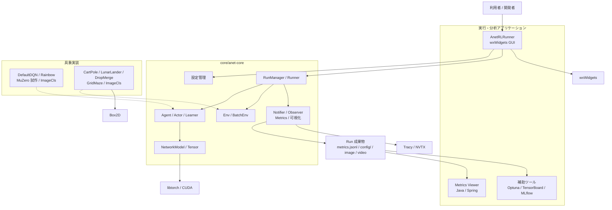
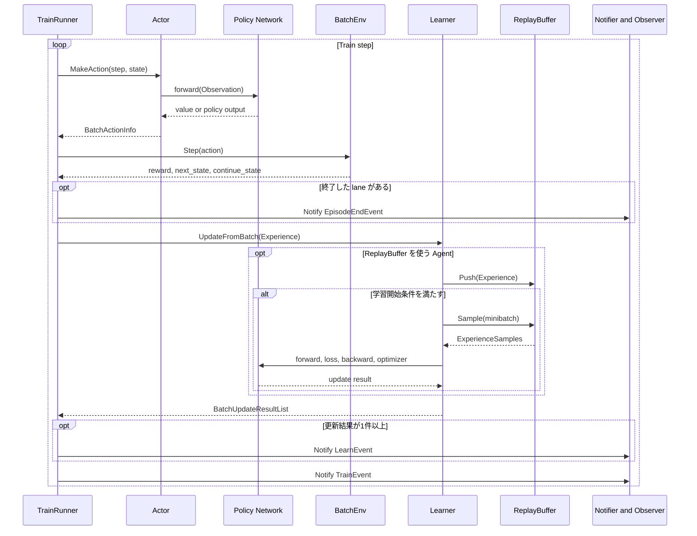
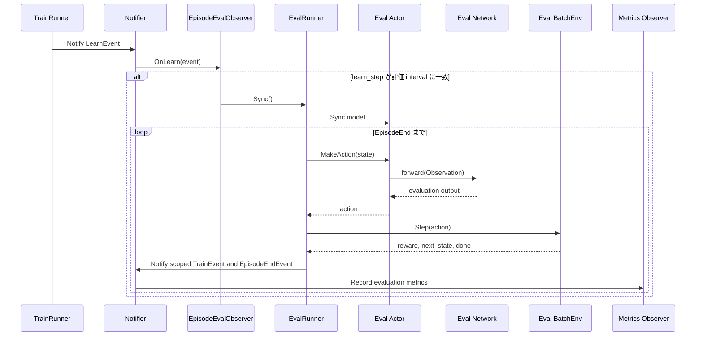

# ANET フレームワーク全体概要

> 主たる観点: 全体構成（機能単位を中心に、主要工程を併記）

## 1. はじめに

### 1.1 目的

この文書は、ANET の基本概念、機能、ソフトウェア構成、主要な処理フローを一つの資料で把握できるようにすることを目的とします。

### 1.2 対象読者

- ANET を初めて利用する人
- Run の実行や分析を行う人
- フレームワーク、Agent、Env、アプリケーションを変更する開発者

### 1.3 記載範囲

現行リポジトリに実装されている全体構成と代表的な機能を扱います。個々の設定キー、画面操作、クラス単位の設計は、関連するユーザーガイドまたは設計ガイドで扱います。開発中の案や未決事項は本文へ混在させず、`docs/memo/` を参照します。

## 2. ANET の概要

### 2.1 位置付け

ANET は、環境との相互作用から方策を学習する強化学習実験を、C++ の単一アプリケーション上で実行・観察するためのフレームワークです。libtorch によるテンソル計算とニューラルネットワーク、wxWidgets による GUI、Run 単位のメトリクス記録を統合しています。

本プロジェクトは、学習アルゴリズムや実装方式を検証する個人実験コードとして継続開発されています。安定した公開 API を提供する製品ライブラリではなく、設定や内部構造は実験に合わせて更新されます。

### 2.2 実行環境

| 項目 | 現在の扱い |
|---|---|
| OS | Windows 11 x64 で検証済み |
| GPU | NVIDIA GPU と CUDA 対応版 libtorch の組み合わせで検証済み |
| CUDA | 選択した libtorch、NVIDIA ドライバー、CUDA Toolkit の互換性が必要 |
| CPU-only | Agent や設定に CPU 経路はあるが、フレームワーク全体の CPU-only 構成は未検証 |
| その他の OS | Linux、macOS とも未検証 |
| GUI | wxWidgets を利用するネイティブ GUI |

特定 GPU の型番や最小 VRAM は一律に定めていません。必要量は Env、NetworkModel、batch size などの設定で変化します。開発用ツールを含む準備手順は[開発環境構築ガイド](040_development_environment.jp.md)を参照してください。

## 3. 基本概念

### 3.1 強化学習とデータの概念

| 用語 | ANET での意味 |
|---|---|
| Env | 行動を受け取り、次の Observation、Reward、終了状態を返す環境 |
| State | Env のある時点の状態。Observation と `done`、`truncated`、`episode_start` をまとめ、単体は `SingleState`、batch は `BatchState` で表す |
| Observation | Env が Agent へ渡す観測。複数の観測キーを持つ `TensorDict` として表現する |
| Action | Agent が選択し Env へ渡す行動。離散値または連続値の仕様を `ActionSpec` が定義する |
| Reward | Action の結果を評価する値 |
| Episode | Env の Reset から終了条件までの区間 |
| Experience | State、Action、Reward、次 State を一組にした学習用データ |
| ReplayBuffer | Experience を蓄積し、学習用 minibatch をサンプリングするバッファ |

ここでいう State は、Env が共通 interface を通じて公開し、Runner と Agent が受け渡す状態です。Env 内部の完全なシミュレーション状態を意味しません。また、[8章](#8-基本的な設計原則)で所有権を論じる State は「モジュール内部で変化する状態」という一般的な用語であり、このデータ型に限定されません。

Observation の代表的なキーは、低次元ベクトル用の `vector`、画像・格子用の `grid`、合法手を示す `action_mask` です。各 Env が `EnvSpec` を通じて shape、dtype、値域などの契約を定義します。

### 3.2 実行時コンポーネント

| 用語 | 責務 |
|---|---|
| Agent | Actor と Learner を生成し、NetworkModel など Run 単位の資源の lifetime を束ねる。具象実装では、Agent が所有する Learner の配下に ReplayBuffer や optimizer を置く場合もある |
| Actor | Observation から Action を作る。Train と Eval で別インスタンスを作成できる |
| Learner | Experience を受け取り、必要に応じて ReplayBuffer の更新と NetworkModel の学習を行う |
| BatchEnv | 複数 Env をまとめ、batch 単位で Reset と Step を実行する |
| Runner | Train では Actor、BatchEnv、Learner、Eval では Actor と BatchEnv を呼び出してステップを進める |
| RunManager | 設定から Env、Agent、TrainRunner、EvalRunner、Observer を構築し、一つの実行を管理する |
| Notifier / Observer | Train、Learn、EpisodeEnd などの Event を配信・購読し、評価、記録、可視化を起動する |
| Run | 一回のアプリケーション実行と、その設定・メトリクス・生成物をまとめた単位 |

### 3.3 ステップ軸

ANET は、異なる処理量を一つの step へ混在させず、複数の軸で数えます。

| 軸 | 数える対象 |
|---|---|
| `train_step` | TrainRunner の反復回数 |
| `exp_step` | Env から得た transition 数 |
| `update_step` | Learner へ Experience を渡した更新処理回数 |
| `learn_step` | Learner が実行した学習更新数 |
| `episode_count` | 終了した Episode 数 |
| `sim_step` | Env 内部のシミュレーション step 数 |

グラフや Run を比較するときは、同じ意味の軸と範囲を揃える必要があります。

## 4. ソフトウェア構成

### 4.1 全体構成

`AnetRLRunner` が設定と実行をまとめる入口です。学習処理は `anet-core` の抽象と共通実装を経由して具象 Agent・Env を利用します。メトリクスは Runner と Observer から Run ディレクトリへ記録され、Viewer や補助ツールが実行プロセスとは独立して読み取ります。

### 4.2 コードマップ

| パス | 主な内容 |
|---|---|
| `core/anet-core/include/anet/` | フレームワークの公開ヘッダ |
| `core/anet-core/src/` | 共通基盤、Agent、NN、ReplayBuffer、Observer、テスト |
| `core/envs/` | CartPole、LunarLander、DropMerge、GridMaze、ImageCls の Env 実装 |
| `apps/runner/` | `AnetRLRunner`、画面パネル、設定、起動・分析用スクリプト |
| `apps/metrics-viewer/` | Java/Spring 製 Metrics Viewer |
| `viewers/metrics-tools/` | Python 製 viewer、TensorBoard・MLflow bridge |
| `docs/design/` | 現行の概要、利用方法、設計 |
| `docs/adr/` | 採用した設計判断 |
| `docs/memo/` | 要求、計画、検討中の変更 |

## 5. 機能一覧

5.1 はフレームワークの共通機能を機能単位で整理した一覧であり、6.1～6.11 の機能仕様と一対一に対応します。5.2 と 5.3 は、その共通機能を利用する具象実装とアプリケーションのラインナップです。機能カテゴリ別設計ガイドは、変更時に同時に確認する責務とコードをまとめるため、機能一覧とは異なる単位で複数カテゴリを扱う場合があります。

### 5.1 コア機能

| カテゴリ | 主な機能 | 機能仕様 |
|---|---|---|
| 設定管理 | Properties 形式の key-value、`$include`、設定グループのマージ、コマンドライン上書き | [6.1](#61-設定管理) |
| 強化学習共通基盤 | Env、Agent、Actor、Learner、Runner、Event の契約と共通実装 | [6.2](#62-強化学習共通基盤) |
| Env共通 | Env の仕様表現、単体 Env の batch 化、worker thread による並列 Step | [6.3](#63-env共通) |
| Agent共通 | Actor/Learner生成、State/Resource所有権、観測・報酬のscaler、schedule、seed管理 | [6.4](#64-agent共通) |
| ReplayBuffer | Experienceの蓄積とsample、N-step、PER、frame stack、prefetchとdevice転送 | [6.5](#65-replaybuffer) |
| ニューラルネットワーク | 設定ベースの NetworkModel 構築、各種 module・head、初期化、optimizer | [6.6](#66-ニューラルネットワーク) |
| Run管理 | TrainRunner、EvalRunner、直列実行、学習と Env 処理を重ねる pipeline 実行 | [6.7](#67-run管理) |
| メトリクス | scalar、画像、動画、GraphViz、設定情報を Run 単位で記録 | [6.8](#68-メトリクス) |
| 可視化 | Env 画面、Q 値、heat map、Conv2d 活性などの GUI 表示 | [6.9](#69-可視化) |
| プロファイリング | Tracy と NVTX の計測範囲、CPU/GPU 性能分析のための情報付与 | [6.10](#610-プロファイリング) |
| テスト | Catch2 によるコアと一部 Env の単体・結合テスト | [6.11](#611-テスト) |

### 5.2 Agent と Env の実装

具象実装の選択・拡張方法は[6.12](#612-agent-と-env-の具象実装)で説明します。

| 種別 | 実装 | 概要 |
|---|---|---|
| Agent | `DefaultDQNAgent` | DQN 系の価値学習を行う標準実装 |
| Agent | `RainbowAgent` | Rainbow 系構成を扱う Agent 実装 |
| Agent | `MuZeroAgent` | 決定論的 Env を対象とする MuZero 試作実装 |
| Agent | `ImageClsAgent` | 画像分類を学習する教師あり学習実装 |
| Env | `CartPoleEnv` | ベクトル Observation の倒立振子環境 |
| Env | `LunarLanderEnv` | Box2D を利用する月面着陸環境 |
| Env | `DropMergeEnv` | 格子画像を Observation とする落下・融合ゲーム環境 |
| Env | `GridMazeEnv` | 部分観測の格子迷路環境 |
| Env | `ImageClsEnv` | Datasetを直接固定BのTensorへ組み立てて採点するnative BatchEnv |

### 5.3 アプリケーションと分析

実行プロセスと分析ツールの境界は[6.13](#613-アプリケーションと分析)で説明します。

| 機能 | 概要 |
|---|---|
| `AnetRLRunner` | Train と Eval の実行、Env 表示、ログ、Q 値や NN 内部状態の可視化 |
| Metrics Viewer | 複数 Run と複数 tag の scalar メトリクスをブラウザで比較 |
| TensorBoard bridge | `metrics.jsonl` を TensorBoard から確認するための連携 |
| MLflow bridge | Run のメトリクスを MLflow へ連携 |
| Optuna harness | 設定を上書きして trial を実行し、ハイパーパラメータを探索 |

## 6. 機能仕様

### 6.1 設定管理

設定管理は、Properties 形式のファイル、`$include`、設定グループのマージ、コマンドラインの `key=value` を一つの `ConfigData` へ解決します。各コンポーネントの `Config` は、文字列値を型付き field として読み、型・値域・組み合わせの不正を構築時に検出します。解決後の全設定と、各 Config object が実際に解釈した値は Run 成果物へ記録します。

解決順とエラー契約は[実行基盤と設定](100_runtime_and_configuration.jp.md)を参照してください。

### 6.2 強化学習共通基盤

強化学習共通基盤は、`Env`、`Agent`、`Actor`、`Learner`、`Runner`、Event の interface と、コンポーネント間で受け渡す `State`、Action、Experience、更新結果を定義します。Runner は Actor と Env を進め、Train 時は Experience を Learner へ渡します。処理結果は Runner が Event として Notifier へ通知し、Observer が評価、記録、可視化などの副作用を受け持ちます。

各コンポーネントの内部仕様は、[実行基盤と設定](100_runtime_and_configuration.jp.md)、[Agent と学習](110_agents_and_learning.jp.md)、[環境](120_environments.jp.md)、[可観測性](140_observability.jp.md)を参照してください。

### 6.3 Env共通

Env共通機能は、Observation、Action、Reward、終了条件を `EnvSpec` で宣言し、`Reset` と `Step` の入出力契約を統一します。単体 Env は共通 wrapper で `BatchEnv` 化でき、設定に応じて複数 lane の Step を worker thread へ分配します。Step 結果は、学習用の終端を保持する `next_state` と、終了 lane を Reset 済み状態へ差し替えた次回実行用の `continue_state` を区別します。

Env の実装規約と batch 化は[環境](120_environments.jp.md)を参照してください。

### 6.4 Agent共通

Agent共通機能は、Train/Eval用ActorとLearnerの生成、具象Agentごとに対応範囲を定める保存・復元interface、seedの払い出し、およびscaler、scheduleなどの再利用部品を提供します。変化するStateは更新するモジュール、NetworkModel、optimizer、ReplayBufferなどのResourceはAgentがlifetimeを所有し、PolicyからLearnerへの依存を作りません。

所有関係と共通contractは[Agent と学習](110_agents_and_learning.jp.md)、DQN固有の構成は[DQN系Agent](200_dqn_agents.jp.md)を参照してください。

### 6.5 ReplayBuffer

ReplayBufferは、RunnerからLearnerへ渡されたExperienceをlane別のring storageへ蓄積し、学習可能なindexからminibatchをsampleします。N-step return、frame stack、PERのpriorityとgeneration-aware key、CPU/CUDA間の転送、1-deep prefetchを共通部品として提供します。利用するかどうかと学習更新への組込み方は具象Agentが決めます。

公開contract、内部構造、lifetime、並行性は[ReplayBuffer](150_replay_buffer.jp.md)を参照してください。

### 6.6 ニューラルネットワーク

ニューラルネットワーク機能は、設定から `NetworkModel`、module、head、optimizer を構築し、`TensorDict` の Observation を policy、value、Q 値などの出力へ変換します。shape、dtype、device を境界で検証し、CPU 上の Env データを Actor または Learner の利用 device へ転送します。

module 構成、入出力契約、device の扱いは[ニューラルネットワーク](130_neural_networks.jp.md)を参照してください。

### 6.7 Run管理

Run管理は、一回の実行に必要な Env、Agent、Runner、Observer を設定から構築し、その反復、評価、停止、成果物の lifetime をまとめます。Train は直列の `SerialTrainRunner` または学習と Env 処理を重ねる `PipelineTrainRunner` を選択でき、Eval は Learner を持たない `EvalRunner` で進めます。

#### 6.7.1 Run の構築

起動時に `RunnerApp` が設定を読み、メトリクスと backend を初期化します。続いて具象 Env を repository へ登録し、`RunManager` が seed、`BatchEnv`、`Agent`、`TrainRunner`、`EvalRunner`、Observer を設定から構築します。構築が完了すると Train 用の `RunnerThread` が反復処理を開始します。

#### 6.7.2 学習

次の図は DQN 系を中心とした論理フローです。`SerialTrainRunner` はこの順に同期実行し、`PipelineTrainRunner` は前回 Experience の学習と現在の Env Step を重ねます。Agent によって ReplayBuffer を使用しない場合があります。Runner ごとの正確な通知順と thread 関係は[実行基盤と設定](100_runtime_and_configuration.jp.md)、DQN内部の更新は[DQN系Agent](200_dqn_agents.jp.md)を参照してください。

標準構成では、Env の Observation と Experience を CPU 側で生成・保持し、Actor と Learner が NN 入力を対象 device へ転送します。この境界により、CPU 上の Env 処理と GPU 上の推論・学習を分離します。

#### 6.7.3 評価

設定された評価は、学習更新数が interval に達したとき `EpisodeEvalObserver` から起動されます。評価用 Actor は学習中のモデルを同期し、評価 Episode が終わるまで行動選択と Env Step を繰り返します。評価中に Learner は呼び出しません。

`use_background` が有効な評価は専用 worker で実行します。GUI の Eval View から行う評価も同じ `EvalRunner` の契約を利用します。

実行方式、設定、thread、終了処理は[実行基盤と設定](100_runtime_and_configuration.jp.md)を参照してください。

### 6.8 メトリクス

メトリクス機能は、Train、Learn、EpisodeEnd などの Event を Observer が購読し、scalar、画像、動画、GraphViz、設定情報を Run 単位で記録します。scalar は `metrics.jsonl` に tag、step 軸、値を保持し、実行後も Viewer や外部ツールから読み取れます。Event の生成元と記録処理を分離することで、学習経路へ分析固有の処理を埋め込みません。

Event、Observer、成果物形式は[可観測性](140_observability.jp.md)を参照してください。

### 6.9 可視化

可視化機能は、Env の状態、Train/Eval の進行、Q 値、heat map、Conv2d 活性などを Runner GUI の pane に表示します。表示用データは Env View または Observer が生成し、学習を継続したまま Train と Eval を並べて観察できます。表示対象がデータを生成できない場合は空状態を許容し、学習処理の成立条件にはしません。

画面構成と操作は[Run 実行ガイド](020_user_guide_run.jp.md)、実装境界は[アプリケーションとツール](160_applications_and_tools.jp.md)を参照してください。

### 6.10 プロファイリング

プロファイリング機能は、Actor 推論、Env Step、Learner 更新、ReplayBuffer、device 転送、可視化などの主要境界へ安定した計測名を付与します。Tracy で CPU thread と処理時間、NVTX 対応環境で GPU 処理との対応を確認し、Serial/Pipeline や設定間の性能差を同じ範囲で比較できるようにします。

計測を追加・変更する規約はリポジトリ直下の[AGENTS.md](../../AGENTS.md)を参照してください。

### 6.11 テスト

テスト機能は、Catch2 による `anet-core` と Env の単体・結合テスト、CTest による登録済み target の実行、および Metrics Viewer の Maven test を含みます。設定、shape・dtype・device、Episode 終端、保存・復元など、コンポーネント境界の契約を主な検証対象とします。

環境準備と実行コマンドは[開発環境構築ガイド](040_development_environment.jp.md)を参照してください。

### 6.12 Agent と Env の具象実装

Agent と Env の具象実装は、共通 interface に対する選択可能な実装です。設定の class ID を repository/factory が解決し、Agent は利用する Actor、Learner、NetworkModel を、Env は `EnvSpec` と Reset/Step の挙動を提供します。新しい実装は共通基盤の契約を維持したまま登録し、固有設定と可視化だけを追加します。

Agent共通の拡張契約は[Agent と学習](110_agents_and_learning.jp.md)、DQN系の具象構成は[DQN系Agent](200_dqn_agents.jp.md)、Envの拡張箇所は[環境](120_environments.jp.md)を参照してください。

### 6.13 アプリケーションと分析

`AnetRLRunner` は Run の構築・操作と GUI 表示を担い、Metrics Viewer、TensorBoard/MLflow bridge、Optuna harness は Run 成果物または起動 interface を通じて連携します。分析ツールは学習 process の内部 object を直接参照せず、記録済みの設定、メトリクス、画像・動画を境界として Run を比較・分析します。

実行操作は[Run 実行ガイド](020_user_guide_run.jp.md)、分析手順は[Run 分析ガイド](030_user_guide_analysis.jp.md)、実装構成は[アプリケーションとツール](160_applications_and_tools.jp.md)を参照してください。

## 7. 設定、Run、成果物

`AnetRLRunner` は既定で executable root の `config/_main.txt` を読みます。現在の通常配置では `apps/runner/config/_main.txt` です。`_main.txt` から共通設定、メトリクス、Agent、NetworkModel、対象 Env の設定を `$include` し、必要に応じて設定グループのマージやコマンドラインの `key=value` で上書きします。

一回の起動につき、`app.runs_dir` 配下へ Run ディレクトリを作成します。代表的な成果物は次のとおりです。

| 成果物 | 内容 |
|---|---|
| `metrics.jsonl` | scalar、設定、成果物参照などの時系列メトリクス |
| `config/config_data.txt` | include、merge、コマンドライン上書き後の全 ConfigData |
| `config/<tag>.txt` | 各 Config object またはEnv instanceへ注入された設定 |
| `<run_name>.log` | Runner のテキストログ |
| `images/` | step ごとに出力した画像 |
| `videos/` | heat map、histogram などの動画 |
| Agent 保存ファイル | Runner が保存した Network と optimizer 等の状態 |

設定と実行方法は [Run 実行ガイド](020_user_guide_run.jp.md)、成果物の読み方は [Run 分析ガイド](030_user_guide_analysis.jp.md)を参照してください。

## 8. 基本的な設計原則

- 設定値、Tensor shape・dtype・device、EnvSpec などの契約を境界で検証し、意味のない状態で処理を継続しない。
- 変化する State は更新するモジュールが所有し、NetworkModel、optimizer、ReplayBuffer などの共有 Resource は Agent が所有する。
- Actor が Learner に依存しない方向を保ち、Train と Eval の行動選択を分離できるようにする。
- Env 処理、NN 処理、データ転送、学習、評価の境界を明示し、thread と device をまたぐ処理を計測可能にする。
- Event と Observer を介して実行処理とメトリクス・可視化を分離し、同じ Run を GUI と外部ツールの両方から観察できるようにする。

## 9. 関連文書

- [ドキュメント一覧](README.jp.md)
- [Run 実行ガイド](020_user_guide_run.jp.md)
- [Run 分析ガイド](030_user_guide_analysis.jp.md)
- [開発環境構築ガイド](040_development_environment.jp.md)
- [ドメイン用語集](../../CONTEXT.md)
- [Agent 実装の所有権ガイドライン](../ownership_guideline.md)
- [ANET 概要紹介 PDF](../anet_overview_ja.pdf)
- [実装計画・検討メモ](../memo/)
