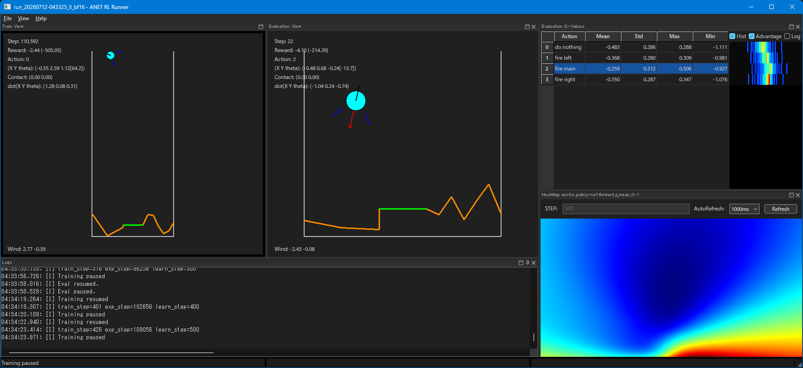
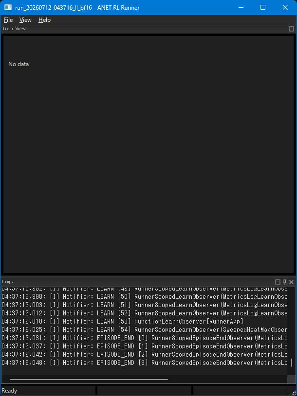

# Run実行ユーザーガイド

> 主たる観点: 行程単位（設定、起動、操作、終了、成果物確認）

## 1. はじめに

### 1.1 目的

本書は、ANET RL Runnerで1つのRunを設定し、学習・評価画面を操作し、終了後の成果物を確認するまでの基本手順を説明する。

### 1.2 対象読者

- 既存のEnvとAgentを設定してRunを実行する利用者
- Train、Eval、可視化パネルの基本操作を知りたい利用者
- Run directoryに保存されるログ、メトリクス、checkpointを確認したい利用者

### 1.3 記載範囲

現行の`AnetRLRunner`、`apps/runner/config`、標準GUI操作、Run成果物を扱う。
新しいEnv、Agent、Observerの実装方法は対象外とし、各設計文書を参照する。

> [!NOTE]
> 本書の実行経路はWindows x64とNVIDIA CUDAを使う構成で検証済みである。CPU-only、Linux、macOS、他GPU backendは未検証であり、同じ操作結果を保証しない。

## 2. 実行前の準備

### 2.1 実行要件

本書は、`apps/runner/bin/Release/AnetRLRunner.exe`がbuild済みで、runnerが必要とするDLLとconfigが配置済みであることを前提とする。検証済み構成ではWindows x64、NVIDIA driver/CUDA runtime、CUDA対応libtorchを使用する。

開発環境の準備、依存関係、CMake preset、build手順は[開発環境](040_development_environment.jp.md)を参照する。

### 2.2 設定ファイルの選択

引数を省略したrunnerは`apps/runner/config/_main.txt`をmain configとして読む。`_main.txt`は共通設定を`$include`し、CartPole、LunarLander、DropMerge、GridMaze、ImageClsのいずれか1つを有効化する入口である。

```text
$include <common.txt>
$include <metrics_scalar.txt>
$include <metrics_image.txt>
$include <agent.txt>
$include <nn.txt>

$include <LunarLander.txt>
#$include <DropMerge.txt>
```

1回のRunでは、意図したEnv設定だけを有効にする。各Env設定内の`app.$`、`metrics.scalar.$`などは、`>`の左から右へ設定群を重ねる。コマンドラインの`key=value`はmerge後にも再適用されるため、最終overrideとして扱われる。

### 2.3 最初に確認する設定

| キー | 役割 |
|---|---|
| `app.run_name` | Run名。`{t}`は起動時刻へ展開される |
| `app.runs_dir` | `apps/runner`を基準とするRun出力先。既定は`runs` |
| `app.train_auto_start` | `true`ならGUI初期化後に学習を開始する |
| `app.eval_panel.auto_start` | 手動EvalPanelを起動直後から動かすか |
| `train.seed` | Runの基準seed |
| `train.num_envs` | Train用BatchEnvのlane数 |
| `agent.class_id` | 使用するAgent実装 |
| `agent.device_type` / `agent.device_index` | AgentのCPU/CUDA device |
| `env.worker_type` / `env.worker_threads` | Env batchの実行方式とworker数 |
| `train.eval_device_type` / `train.eval_device_index` | configured evalのdevice |
| `backend.deterministic_algorithms` | 決定論的algorithmを要求するか |

`agent.device_type=1`はCUDA、`0`はCPUである。EnvをCPU、AgentとEvalをCUDAに置く構成では、device転送を含めて性能を判断する。

## 3. Runを開始する

### 3.1 標準起動

`apps/runner`から次を実行する。

```powershell
10_run.bat
```

または、リポジトリルートから実行ファイルとmain configを明示する。

```powershell
apps\runner\bin\Release\AnetRLRunner.exe `
  --config apps\runner\config\_main.txt `
  app.run_name=run_{t}_trial `
  train.seed=12345
```

起動時は概ね次の順に初期化される。

1. main configとコマンドラインoverrideを解決する。
2. Run directory、`metrics.jsonl`、標準出力ログを準備する。
3. libtorch backendと登録済みEnvを初期化する。
4. `RunManager`がEnv、Agent、Train Runner、configured Evalを構築する。
5. Train、Eval、QValue、Logの各パネルを接続する。
6. `RunnerThread`を開始する。`app.train_auto_start=false`の場合はpause状態で待機する。

起動に失敗した場合は、画面のエラーダイアログだけでなく、対象Runの`stderr.log`と`<run_name>.log`も確認する。

### 3.2 自動停止・自動pause

`app.train_exit_step`、`app.exp_exit_step`は上限到達時にRunを終了する。`app.train_pause_step`、`app.exp_pause_step`は一度だけ自動pauseする。
batch実験では、`app.$=app.batchrun`で低FPS表示と`exp_exit_step`をまとめて選ぶ構成が用意されている。

## 4. AP画面

### 4.1 基本構成

Runner画面はwxAUIのpaneで構成される。

- `Train View`: Train Runnerから受け取ったEnv固有Viewを表示する。
- `Evaluation View`: Trainとは別のEval Envを手動またはtimerで進める。初期状態では非表示である。
- `Evaluation Q-Values`: Eval Actorの出力を表示し、Actionを手動指定できる。
- `Logs`: 実行ログを表示し、Error、Warn、Info、Verboseを切り替える。
- `HeatMap` / `Conv2d`: `View`メニューから追加する補助pane。




paneを閉じたり初期化前のViewを表示した場合は、次のように描画対象が少ない状態になることがある。`View > Reset Layout`で既定配置へ戻せる。



## 5. 操作方法

### 5.1 学習のpauseと再開

Train/Eval View上で左クリックするか、`Shift`を押すとTrainをpause/resumeする。`app.train_auto_start=false`で起動した場合も同じ操作で開始できる。pause時はmetrics、stdout/stderr、text logを明示的にflushする。

### 5.2 評価と画面操作

| 操作 | 動作 |
|---|---|
| 右クリック、または`Space` | EvalPanelをpause/resumeする |
| `Ctrl` | Evalを1 step自動実行する |
| 矢印キー | LunarLander向けに`0`から`3`のActionを指定してEvalを1 step進める |
| テンキー`0`から`9` | 同じ番号のActionを指定してEvalを1 step進める |
| `View > Evaluation View` | Eval paneの表示を切り替える |
| `View > Evaluation QValue View` | Q値paneの表示を切り替える |
| `View > Log Level` | GUIへ表示するログlevelを切り替える |
| `View > Reset Layout` | pane配置とframe sizeを既定へ戻す |

Action数はEnvごとに異なる。範囲外Actionを前提にせず、QValue paneまたはEnvのActionSpecを確認する。

`app.eval_panel.model_sync.mode`は手動EvalPanelがTrain modelを参照する方法を決める。`shared`はTrain modelを共有し、`frame`、`time`、`episode`は対応するintervalでclone modelを同期する。clone modelを使うmodeではEvalのresume時にも同期する。表示中のEvalが常にTrainの最新parameterと一致するとは限らないため、比較時はmodeとintervalを記録する。

### 5.3 停止、保存、checkpointからの再開

WindowのCloseまたは`File > Exit`でRunを停止する。終了処理はTrain停止、`agent_close.anet`保存、Run出力のflush、GUI破棄の順に進む。保存中にprocessを強制終了するとcheckpoint、metrics、動画の末尾が不完全になる可能性があるため、windowが閉じるまで待つ。

checkpointから再開する場合は、新しいRunの互換設定にAgent固有の`auto_load_file`を指定する。現行例は`DefaultDQNAgent.auto_load_file`のaliasである`R.auto_load_file`、または`ImageClsAgent.auto_load_file`である。Network構成やarchive contractが異なるcheckpointは読み込めない。保存対象はAgentごとに異なり、現行DQN系ではReplayBufferの内容やsampling状態を復元しない。再開後は新しいRun directoryとstep系列を持つため、旧Runの`metrics.jsonl`へ追記する操作ではない。DQN系の保存対象は[DQN系Agent](200_dqn_agents.jp.md)を参照する。

## 6. 成果物

`app.runs_dir=runs`、`app.run_name=run_{t}`の場合、成果物は`apps/runner/runs/<run_name>/`へ保存される。

| 成果物 | 内容 |
|---|---|
| `metrics.jsonl` | scalar、JSON metadata、動画metadataを追記する主メトリクス |
| `config.txt` | 各Config objectが実際に読み取った設定の集約 |
| `config/config_data.txt` | includeとoverride解決後の全ConfigData |
| `config/*.txt`、`json/*.json` | コンポーネント別の設定・metadata dump |
| `<run_name>.log` | timestampとlevelを含むrunner text log |
| `stdout.log` / `stderr.log` | process標準出力・標準エラー |
| `agent_close.anet` | 正常なwindow close時に保存されるAgent checkpoint |
| `videos/*.mkv` | image系Observerが生成した動画 |
| `images/<tag>/*.png` | `app.metrics_logger.use_png_dump=true`時の個別frame |
| `dot/**/*.dot` | GraphViz Observerの出力 |

比較や再現では、手元の編集前ConfigではなくRun directory内の`config/config_data.txt`を正とする。グラフ分析は[分析ユーザーガイド](030_user_guide_analysis.jp.md)を参照する。

## 7. よくある確認事項

- 起動直後にTrainが進まない: `app.train_auto_start`を確認し、左クリックまたは`Shift`でresumeする。
- Evalが進まない: `Evaluation View`を表示し、`app.eval_panel.auto_start`または`Space`を確認する。
- CUDA初期化に失敗する: libtorch/CUDA/driverの組み合わせ、`agent.device_type`、eval deviceを確認する。
- 期待したEnvでない: `_main.txt`で有効なEnv includeと、Run内`config/config_data.txt`を確認する。
- Viewが空: Log paneのEnv class ID、View factory、初期化errorを確認し、`Reset Layout`も試す。

## 8. 関連文書

- [分析ユーザーガイド](030_user_guide_analysis.jp.md)
- [開発環境](040_development_environment.jp.md)
- [実行基盤と設定](100_runtime_and_configuration.jp.md)
- [Agentと学習](110_agents_and_learning.jp.md)
- [環境](120_environments.jp.md)
- [可観測性](140_observability.jp.md)
- [ReplayBuffer](150_replay_buffer.jp.md)
- [DQN系Agent](200_dqn_agents.jp.md)
- [アプリケーションとツール](160_applications_and_tools.jp.md)
