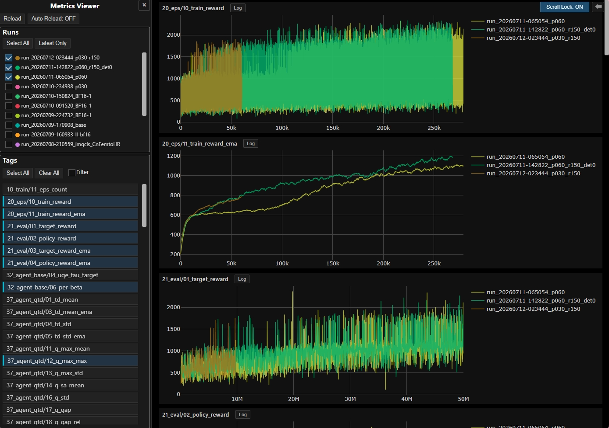

# Run分析ユーザーガイド

> 主たる観点: 行程単位（成果物確認、可視化、比較、解釈）

## 1. はじめに

### 1.1 目的

本書は、Runが出力した`metrics.jsonl`をMetrics Viewerで可視化し、複数Runを同じ条件で比較し、必要に応じてOptunaのmulti-seed集計を確認する手順を説明する。

### 1.2 対象読者

- 学習曲線、評価値、loss、性能指標を比較する利用者
- Run間の差を過大評価せず、同じstep範囲で判断したい利用者
- DropMerge Optunaのseed runとsummary studyを使い分ける利用者

### 1.3 記載範囲

現行のJava/Spring Metrics Viewer、Plotly画面、Run artifact、DropMerge Optunaの閲覧方法を扱う。
新しいmetricの実装方法やOptuna探索空間の変更は設計文書と[DropMerge Optuna利用ガイド](../optuna.md)を参照する。

## 2. Metrics Viewerを起動する

本書はMetrics Viewerのjarがbuild済みであることを前提とする。Java、Maven、jarのbuild手順は[開発環境](040_development_environment.jp.md)を参照する。

通常Runを見る場合は`apps/runner`から次を起動する。

```powershell
22_metrics_viewer_java.bat
```

- URL: `http://localhost:8082`
- runs directory: `apps/runner/runs`

Optuna seed runを見る場合は次を使う。

```powershell
22_metrics_viewer_java_optuna.bat
```

- URL: `http://localhost:8083`
- runs directory: `apps/runner/runs_optuna`

独自の場所を読む場合はjarへ`--metricsviewer.runs-dir=<path>`を渡す。Viewerは直下に
`metrics.jsonl`または`metrics.jsonl.gz`を持つdirectoryだけをRunとして認識する。
両方がある場合は`metrics.jsonl`を使う。

## 3. 画面の基本操作



| UI | 動作 |
|---|---|
| `Runs` | 行クリックで即時toggleする。同じ行を350ms以内にもう一度押すとそのRunだけを選ぶ。空選択も可能 |
| `Select All` / `Latest Only` | 全Run、または最新Runへ選択を切り替える |
| `Tags` | 表示するmetric tagを選ぶ |
| Tagsの`Filter` | 選択済みtagだけを一覧へ残す |
| Run行の背景と`%` | 選択したMetricsマスタをSQLiteへ取り込んだRun単位の進捗を示す |
| `Reload` | Run一覧、tag、現在viewportのmetric rangeを再取得して再描画する |
| `Auto Reload` | 30秒ごとにmetadataを更新し、最新を表示中のgraphだけを更新する |
| `LOD: MinMax / Mean / Band` | 右上のScroll Lock直前にある全graph共通のLOD表示mode。変更時に再取得しない |
| グラフの`Log` | 正負と0を扱えるsigned-log表示を切り替える |
| `Scroll Lock` | グラフ操作を抑え、drag/swipeを縦scrollへ使う |
| Screenshotボタン | side panelを隠し、比較画像向けの表示へ切り替える |

Plotlyのmodebarではzoom、pan、画像保存、`Reset axes`を利用できる。`Autoscale`ボタンは重複を避けるため非表示である。グラフ本体のdouble-clickはPlotlyのaxis resetを維持しつつ、ViewerのReloadも実行する。

初回表示だけ最新Runを自動選択する。以後は手動の空選択と、Run消失で空になった選択を維持する。
Reloadでは既知のOFF tagを保ち、新たに発見された可視tagだけを自動的にONへ加える。
選択tag、LOD mode、Scroll Lockはbrowserの`localStorage`へ保持される。

LODの`MinMax`は各bucketのmin、max、lastを元データの実step順に結ぶ。
`Mean`はbucket平均、`Band`はmin/max帯へ平均線を重ねる。点数が少なくL0を表示できる場合は、
どのmodeでもraw折れ線になる。グラフheaderの`Min / Max / Avg / Std`はviewportではなく、
選択Runのcommit済みraw全点に対する`TagStats`を合成した値である。

取り込み中でもRun一覧とcommit済みgraphは操作できる。Run-level errorまたはstep逆行で
隔離されたtagは`⚠`とtooltipで示し、commit済み部分は引き続き表示する。

## 4. Run比較の手順

### 4.1 比較条件を確認する

グラフを重ねる前に、各Runの次を確認する。

- `config/config_data.txt`: includeとCLI override解決後の全設定
- `config/*.txt`: コンポーネント別の注入済み設定。Envは`config/env.<Env name>.txt`
- seed、Agent/Env、Network構成、batch size、replay条件
- CPU/GPU、device index、決定論設定
- configured evalのinterval、RunMode、clone設定
- Runの停止理由と到達step

名前が似ていても設定が同じとは限らない。Run名ではなくRun artifactを正とする。

### 4.2 同じtagと同じstep軸を選ぶ

`metrics.jsonl`のscalar recordは`type`、`tag`、`step`、`value`を持つが、`step`が`train_step`、`learn_step`、`episode_step`、`exp_step`などのどれかはrecord自体に保存しない。軸はRun内のmetrics設定で決まる。

比較時は同じtag名だけでなく、`metrics.scalar.[tag]`の定義が同じstep軸を選んでいることを確認する。現行設定では、`@learn`と`@episode_end`は明示がなければ`exp_step`、`@train`は`train_step`が既定である。`$exp_step`などの明示指定があればそれを優先する。

### 4.3 matched `exp_step`範囲で比較する

到達stepが異なるRunの最終点同士をそのまま比較しない。両方にデータがある共通の`exp_step`範囲を決め、同じwindowで評価する。

例:

```text
Run A: 0 - 100M exp_step
Run B: 0 - 70M exp_step

比較window: 50M - 70M exp_step
```

同じwindowで次を分けて読む。

- 水準: window内のmean/medianや評価EMA
- 安定性: 振れ幅、急落、seed間のrange/std
- 傾向: window前半と後半の差、傾き
- 速度: 同一hardware・同一並列条件での`exp_step_per_sec`や経過時間

1つの長いRunだけから、別設定より高速・高性能と断定しない。停止点が違う場合は、まずmatched windowへ揃える。

### 4.4 表示条件による誤読を避ける

- EMAの`ema_alpha`が異なる曲線は滑らかさが違うため、そのまま分散比較しない。
- `interval`やeval頻度が違うと点密度が変わる。線の滑らかさを性能差と解釈しない。
- signed-logは0付近を広げる表示変換である。線間の見た目の距離をlinear scaleと同じ比率として読まない。
- configured evalとEvalPanelは別Runnerである。tagのrunner scopeを確認する。
- `exp_step_per_sec`は他process、動画出力、profiling、Optunaの並列jobに影響される。
- 1 seedの差はseedぶれを含む。候補選定後は複数seedで再評価する。

## 5. Optuna結果を分析する

### 5.1 Metrics ViewerとDashboardの役割

| 対象 | 使用する画面 | 正本 |
|---|---|---|
| seed runの時系列 | Metrics Viewer | `<study>_<trial>_s<seed>/metrics.jsonl` |
| 1 trialのmulti-seed結果 | Optuna Dashboard / artifact | 代表folderの`multiseed_summary.json`、`seed_runs.json` |
| 同一params groupの再評価 | summary study | `group_summary.json`とmean/range/std objective |
| runner/config失敗調査 | Run artifact | `manifest.json`、`process.json`、`stdout.log`、`stderr.log` |

代表folder`<study_name>_<trial_name>`は`metrics.jsonl`を持たないためMetrics Viewerには出ない。`_s<seed>`付きのseed runだけを時系列比較する。summary studyはDashboard閲覧用であり、Metrics ViewerのRunではない。

Optuna Dashboardは`apps/runner`から次で起動する。

```powershell
23_optuna_dashboard.bat
```

URLは`http://127.0.0.1:8088`、storageは`apps/runner/runs_optuna/optuna.db`、artifact storeは`runs_optuna/artifacts`である。

### 5.2 scoreを読む

DropMergeのtrial valueはseed別scoreのaggregateである。`score_aggregate`を確認し、`mean`、`median`、`mean-minus-std`、`min`を混同しない。

現行のprimary scoreは指定window内の次の2 tagのmeanを平均する。

```text
21_eval/03_target_reward_ema
21_eval/04_policy_reward_ema
```

late windowの`score_60_80`、`score_80_100`、`late_slope`は伸びや頭打ちを見る補助指標であり、trial valueそのものではない。最終候補はaggregate scoreだけでなく、seed別score、range/std、matched `exp_step`時系列を併せて確認する。

`run-study --n-jobs > 1`は同一GPU上でrunnerを並列起動できるが、durationとstep/secは相互干渉を受ける。その条件のthroughputを単独Runと直接比較しない。

## 6. 最小分析チェックリスト

1. 比較対象の`config/config_data.txt`を保存した。
2. 同じtag、同じstep軸、同じeval定義を確認した。
3. 共通の`exp_step`windowを決めた。
4. scoreとthroughputを分けて読んだ。
5. EMA、interval、signed-logなど表示条件を揃えた。
6. 1 seedの結果だけで最終判断していない。
7. Optunaではaggregate方式、seed別分布、trial stateを確認した。

## 7. 関連文書

- [Run実行ユーザーガイド](020_user_guide_run.jp.md)
- [開発環境](040_development_environment.jp.md)
- [可観測性](140_observability.jp.md)
- [アプリケーションとツール](160_applications_and_tools.jp.md)
- [DropMerge Optuna利用ガイド](../optuna.md)
