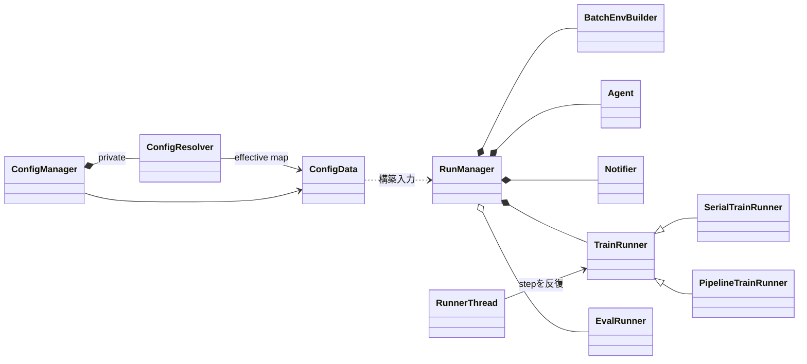
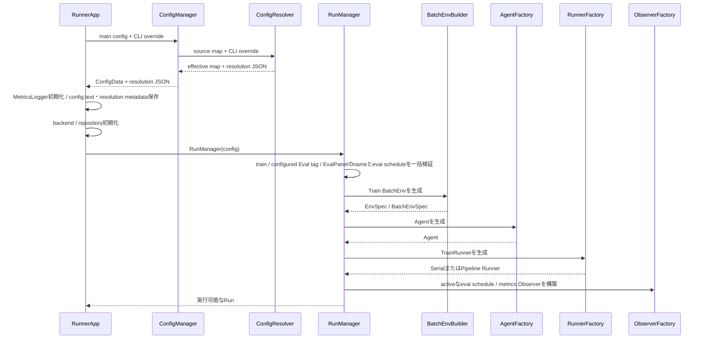
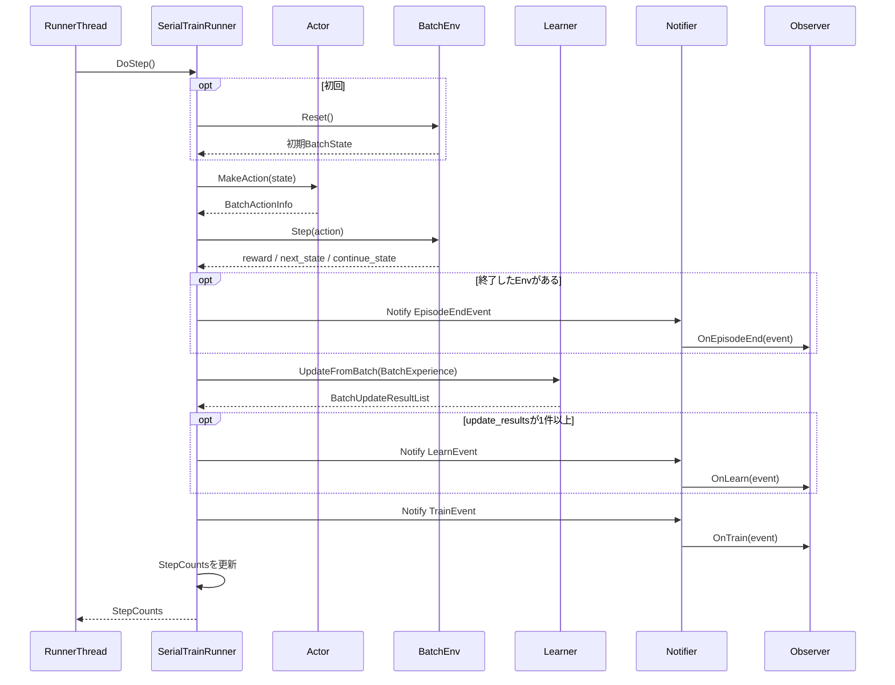
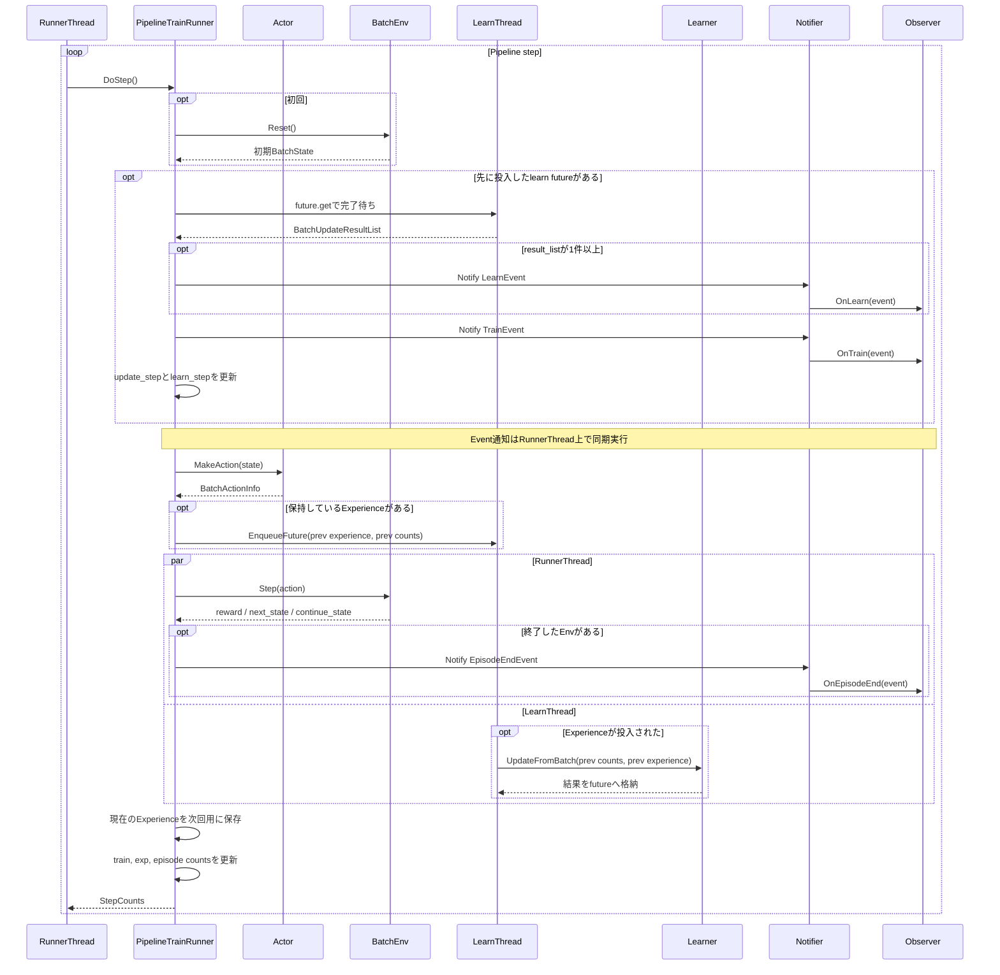

<!-- translated-from: 100_runtime_and_configuration.jp.md blob:e55f91f991cc3ff4977adbcf93255e593461087e date:2026-09-19 progress:done -->
# Runtime Infrastructure and Configuration

> Primary perspective: function (runtime infrastructure and configuration, with internal processing stages in chronological order)

## 1. Introduction

### 1.1 Purpose

This document explains the runtime infrastructure that constructs Envs, Agents, Runners, and Observers from configuration and starts and stops a Run.
It maps configuration resolution order, object ownership, and differences between Serial/Pipeline/Eval Runners to the code.

### 1.2 Audience

- Framework developers modifying Config, RunManager, or Runner
- Agent and Env developers checking Run construction order and lifetimes
- Reviewers of concurrency, evaluation, and shutdown

### 1.3 Scope

This document covers current `ConfigData`, `ConfigManager`, the private deep module `ConfigResolver`, `RunManager`, the Runner family, and `RunnerThread`.
See the [Run Execution Guide](020_user_guide_run.en.md) for GUI operations and [Observability](140_observability.en.md) for Events and Observers.

## 2. Basic Concepts and External Contracts

### 2.1 Configuration Resolution

Configuration is collected into `ConfigData`, which holds string key/value pairs.

1. `Properties` reads the shared main config and `$include` targets. Each line is split at the first `=`, removing an immediately preceding `?` as the default-leaf operator. For duplicate keys, `=` takes precedence over `?=`; later assignments win only at equal strength. Whitespace is removed from keys, and a single `:` is normalized to `.`. Multiple colons or empty segments fail fast. The old `foo: bar` syntax, where `:` separated key and value, is abolished; lines without `=` are skipped.
2. In workspace mode, Runner injects `app.runs_dir=<workspace>/runs`, then overlays the workspace's `config/_main.txt` with later values winning. Workspace includes fall back to the shared config directory.
3. `ConfigResolver` incorporates CLI assignments into resolution input and expands `run.$` before ordinary selections. Run terms supply values to the root from left to right, with later values winning and CLI assignments to the same key taking further precedence. `Env.$ = @base` inside a Run uses the destination root as its definition site.
4. Each configuration is assembled in this order: `?=` default leaves, the base from the whole `.$`, nested partial `.$` selections, and directly assigned explicit leaves. Line order between different keys does not change this precedence. Final selection values are merged left to right as differences, retaining leaves absent from the right. Leaves are not removed based on whether they were inherited or directly assigned.
5. Later changes, added keys, Run assignments, and CLI assignments to a source reach inheritors as part of that source's own final values. Dependency resolution order and override precedence are separate. CLI changes to a parent alter the parent's final values but do not unconditionally override a child's own explicit assignments.
6. Activate required profile definitions and validate dependencies at their definition sites. Unselected inner profiles remain dormant inventory. Undefined profiles, catalog items or their parts, self-supply, actual cycles, and selection depth above 10 fail fast. Empty ordinary prefixes are allowed regardless of name.
7. Expand `${full.key}` one level into final values. Undefined, chained, or unresolved value references fail fast. Return `ConfigData` excluding `.$` and definitions containing `@` segments, along with resolution JSON; each `Config` then reads typed fields. The workspace's final `app.runs_dir` must exactly match the injected string.
8. Runner saves effective configuration to `config/config_data.txt` and passes the structured resolution record to `MetricsLogger::Log("config_resolution", json)`. It is saved in `json/config_resolution.json` with a `type` / `tag` / `data` envelope, and the same record is written to the Metrics master.

**`$` supplies the base; partial selections and explicit leaves override it.** Since `A2 > A3` merges each source's completed values as differences, eps_end absent from A3 remains from A2. Even a deeply nested partial selection in A2 does not override the same key supplied by A3. Reassigning the same input key retains later-wins behavior: `Env.$ = A3` after `Env.$ = A2` selects only A3.

The convention is **`?=` for base definitions in shared files; in Env-specific files, `?=` only for defaults and generally `=` elsewhere**. The canonical rule is Configuration File Assignment Operators in `AGENTS.md`; see Section 3.6 of the [Run Execution Guide](020_user_guide_run.en.md) for explanations and examples.

Write defaults at the same location with `?=` and intentional explicit assignments with `=`. Do not add a defaults profile at the beginning of the chain. `?=` is prohibited in Run profiles, CLI assignments, and selection declarations `.$`. After adding configuration, use `check_default_leaves.py` to check for `=` remaining in shared bases/defaults and `?=` mixed into Env-specific explicit assignments. Update the checker's classification reasons when changing a setting's role.

Short `@name` resolves at the declaration's definition site. `Env.$ = @a` references Env.@a, and `Env.@a : $ = @b` references Env.@b; using `Other.$ = Env.@a` does not change it to Other.@b. Fully qualified terms are used as written. In explanations and configuration examples, `:` marks an `@` profile boundary; ordinary keys use dots, as in `Env.$`. The `.$` of Common or A2 is an ordinary dependency too; override layers are not identified by counting dots in names. A referenced selection instruction is not rerun at the copy destination.

Resolution JSON has `schema_version` 1. `selections[].key` records the declaration site literally, including `Env.@a.$` and `DefaultDQNAgent.@baseline.actor.[eval].$`. `run.$` comes first, then required dependencies are traversed in input declaration and term order; repeated references to the same definition are not duplicated. `references` records one-level value references in source-key order. `overrides` records `key` / `by` / `from` / `to` only when a final Run assignment changes the same key's final value before applying the Run leaf. Effects of Run changes to selection keys are included in that baseline. An intermediate 4→1→4 is not recorded. `to` is the Run value and may differ from the effective value after CLI assignment to the same leaf. Check `config_data.txt` for final values.

For example, these three DropMerge lines are all outside the Env-specific default-settings block and therefore use `=`.

```ini
DefaultDQNAgent.net.branch.[value_stream].structure = HeadFC1024 > SiLU
DefaultDQNAgent.net.branch.[vector_feature].structure = Embed5846_v2
app.run_name = run_{t}_dm_iqn-k32-n32-m32
```

Run and CLI assignments to the target leaf override explicit `=` leaves too. A CLI assignment to a selection key, however, replaces only the chain. A base definition using `?=` becomes an ordinary value after being resolved in its source and inherited; values on the right of `>` override those on the left.

Internally, the resolver activates required definitions and determines key sets, selects value suppliers in concrete owner/term order, and evaluates dependencies with explicit leaves taking precedence. Cycle/depth validation is separate from value caching, so declaration order or caching cannot change the depth-10 decision. See [PRD072](../memo/done/072_config_selection_final_value_10prd.md) for contracts and examples and [ADR0042](../adr/0042-config-inheritance-as-differential-base.md) for rationale.

The DefaultDQN, ImageCls, and Rainbow Agent Factories pass `GetTargetAgentClassId() + ".net"` to `NetworkConfig` as the final NN-tree read prefix. Branches, bodies, and outputs are read from Agent-owned subtrees such as `DefaultDQNAgent.net.*`, `ImageClsAgent.net.*`, and `RainbowAgent.net.*`; the block catalog `net.block.[*]` and `net.config_profile` are global shared definitions merged into Agent-local definitions. After constructing both Configs and before constructing NetworkModel, DefaultDQN Factory fails fast unless a branch bind directly includes `taus` when `DefaultDQNAgent.quantile_mode=iqn`, or excludes it for `qr` / `none`. MuZero's actual final trees `net.rep` / `net.dyn` / `net.pred` remain a separate pending structure at the root in PRD 059 Phase 1a.

Explicit `--config` selects a fully self-contained mode, skipping workspace resolution, injection, and overlay in step 2. `--config`, `--workspace`, and `--select-workspace` are mutually exclusive.

`ConfigData::Read` / `Get` use caller-supplied defaults only when a key is absent. Conversion failures for present values fail fast with `ANET_SYSTEM_ERROR` containing the key, raw value, and expected type; they never fall back to defaults. Each default-prefix and override-prefix layer is validated independently, so later overrides cannot hide malformed earlier layers. Typed readers uniformly validate surrounding whitespace, consumption of the entire value, overflow, negative unsigned values, nonfinite values, invalid booleans, and vector tokens. Explicitly empty strings and vectors are valid. Ranges, enums, and combinations are checked by construction-time validators in each Config or reusable configuration type. Structural/bounds validation after combining layers uses the logical key from the Config owner's perspective rather than guessing a physical layer for diagnostics.

### 2.2 Runs and Runners

- A Run combines one construction/execution with its artifacts.
- `RunManager` manages the main Train Env, Agent, Notifier, TrainRunner, and configured Eval Runners.
- `RunManager` determines human-facing BatchEnv names: `train` for main Train, the tag for configured Eval, and the supplied name in `CreateEvalRunner(name, ...)` for dynamic Eval, without reinterpreting it.
- BatchEnv names are unique within a Run by case-sensitive exact matching, owned by a private run-local registry in `RunManager`. Factories, Envs, and Runners hold no uniqueness state.
- `Runner` advances through `DoStep()` or `DoUpdateFrame()` and updates `StepCounts`.
- `RunnerStatus` represents uninitialized, running, or completed. GUI pause keeps Runner alive and simply stops RunnerThread from invoking steps.
- `ControlSignal` returned by pre/post callbacks requests continuation within a frame, ending the frame, or stopping Runner.

### 2.3 Runner Types

| Runner | Purpose |
|---|---|
| `SerialTrainRunner` | Executes Action selection, Env Step, Learner updates, and Event notifications sequentially on one thread |
| `PipelineTrainRunner` | Overlaps the previous Experience's Learner update with current Actor/Env processing, one deep |
| `EvalRunner` | Advances evaluation or manual operation using Actor and Env without invoking Learner |

Runner passes the Actor name, spec, device, and seed to Agent in `ActorRequest`. Agent owns clone/network selection and shared-device validation. Dormant evaluation with disabled scheduling neither creates an Actor nor resolves its reference name. EvalPanel uses the referenced tag's Actor through `CreateEvalRunner(name, config_tag)`.

## 3. Component Definitions

| Component | Definition |
|---|---|
| `Properties` | Reads Properties-like files and includes |
| `ConfigManager` | Collects main files, injected values, later-wins overlays, and CLI overrides, then exposes resolver results |
| `ConfigResolver` | Private deep module resolving selections, CLI leaves, and value references from a source map into effective ConfigData and resolution JSON |
| `Config` | Base for reading one component's typed settings using default/override prefixes |
| `RunManager` | Manages seed, Env, Agent, Notifier, and Runner construction and Run-shared objects |
| `RunnerFactory` | Selects `serial` or `pipeline` TrainRunner |
| `RunnerBase` | Shared implementation for Actor, Env, State, step counts, and episode aggregation |
| `TrainRunner` | Training base with Learner and performance metrics |
| `EvalRunner` | Handles Eval Actor synchronization and explicit Actions |
| `RunnerThread` | Iterates Runner in the background and reports exceptions to the application boundary |
| `MasterSeedManager` | Allocates purpose-specific seeds from the Run's master seed |

## 4. Code Map

| Area | Main files |
|---|---|
| Configuration interface | [config.hpp](../../core/anet-core/include/anet/config.hpp) |
| Configuration parser/management | [config.cpp](../../core/anet-core/src/config.cpp) |
| Configuration resolution | [config_impl.hpp](../../core/anet-core/src/config_impl.hpp), [config_impl.cpp](../../core/anet-core/src/config_impl.cpp) |
| Runner interfaces/Events | [rl.hpp](../../core/anet-core/include/anet/rl.hpp) |
| RunManager/Runners | [trainer.hpp](../../core/anet-core/include/anet/trainer.hpp), [trainer.cpp](../../core/anet-core/src/trainer.cpp) |
| Seed management | [random.hpp](../../core/anet-core/include/anet/random.hpp), [random.cpp](../../core/anet-core/src/random.cpp) |
| Thread infrastructure | [thread.hpp](../../core/anet-core/include/anet/thread.hpp), [thread.cpp](../../core/anet-core/src/thread.cpp) |
| Backend initialization | [init.hpp](../../core/anet-core/include/anet/init.hpp), [init.cpp](../../core/anet-core/src/init.cpp) |
| Application startup/shutdown | [RunnerApp.cpp](../../apps/runner/src/RunnerApp.cpp), [RunnerFrame.cpp](../../apps/runner/src/RunnerFrame.cpp) |
| Standard configuration | [apps/runner/config](../../apps/runner/config) |

## 5. Static Structure



TrainRunner uses the main Train Env; each EvalRunner gets its own Env and Actor. Agent and Notifier are shared within the Run.

## 6. Processing Flows

### 6.1 Run Construction



Type conversion, EnvSpec, device, class ID, Env-name collisions, and Config inconsistencies detected during construction fail before RunnerThread starts. The fixed name `train`, every configured Eval tag, and reserved name `EvalPanel` are validated together before constructing the first BatchEnv. Type-conversion failure follows the contract in [Configuration Resolution](#21-configuration-resolution).

`run.eval.[tag]` defines configured Eval; a definition alone creates nothing. Eval Env, Actor, Observer, and background worker are created only when `interval>0` in `run.eval_schedule.[tag]` periodically drives the same-named definition. Defined tags without schedules or with `interval=0` are dormant: only tag-name/schema validation and reservation occur. Metrics referencing dormant tags warn once per tag and skip; references to undeclared tags and schedules targeting undefined tags are errors. For active configured Eval, `RunManager` wraps Env in `EvalSessionEnv`, treating parallel lane count `eval_batch_size` independently from adopted episode count `eval_episodes`. ImageCls requires the standard pair `ImageClsEnv.train.*` and `ImageClsEnv.eval.*`; untagged Eval uses standard Eval configuration, while configured Eval uses a `run.eval.[tag].env.eval.*` overlay.

### 6.2 Serial Train Step

`Learner` performs learning in `UpdateFromBatch()` and returns `BatchUpdateResultList`. Learner does not emit `LearnEvent` itself: `SerialTrainRunner` constructs it from the returned results and notifies `Notifier`. Notifier-to-Observer callbacks execute synchronously on the same RunnerThread.



Events contain counts at completion of their corresponding processing; the counters themselves are advanced for the next step after notification.

### 6.3 Pipeline Train Step

`PipelineTrainRunner` clones and retains the previous Experience and submits Learner updates to one dedicated worker.
At the beginning of a later step, it collects completion or exceptions from the submitted update and emits `LearnEvent` and `TrainEvent` on RunnerThread. It then runs Actor inference, submits asynchronous learning for the retained Experience, and performs the current Env Step.
Neither Serial nor Pipeline implicitly calls `Actor::Sync()` from a Train step; synchronization requirements and timing belong to the concrete Actor's contract. DefaultDQN Train Actor handles periodic snapshot synchronization within `MakeAction()`; see [DQN Agents](200_dqn_agents.en.md).
Shutdown waits for outstanding learning, stops the pool, then shuts down Env.



The first step resets Env and submits no Learner update because no Experience is retained yet. In steady state, LearnThread's Learner update overlaps RunnerThread's Env Step, while collecting and notifying learning results is deferred to the beginning of a later `DoStep()`. RunnerThread submits learning only after Actor inference finishes, so Actor inference and Learner updates do not execute concurrently.

### 6.4 Configured Eval Session

`EpisodeEvalObserver` captures `StepCounts` at trigger time and passes them to `EvalRunner::RunSession()`. `RunSession()` synchronizes Actor, calls `EvalSessionEnv::Reset()`, and advances until N adopted episodes complete. Intermediate episode endings do not emit `EpisodeEndEvent`; after completion, one event is notified with the decorator Env, `env_index=-1`, and triggering counts. EvalPanel does not use the session decorator and retains step-driven execution, forced Actions, and its synchronization modes.

## 7. Configuration, Lifetimes, Errors, and Performance

### 7.1 Main Construction Settings

| Key | Meaning |
|---|---|
| `run.seed` | Run master seed. The actual seed for 0 is determined and recorded at runtime |
| `run.train.num_envs` | Main Train BatchEnv lane count |
| `run.train.runner_type` | `serial` or `pipeline` |
| `run.train.actor` | Actor catalog name, default `train` |
| `run.eval_device_type/index` | Configured Eval device |
| `run.eval.[tag].*` | Configured Eval RunMode, parallel lane count `eval_batch_size`, adopted count `eval_episodes` (default 1), Env overrides, and Actor name reference |
| `run.eval_schedule.[tag].*` | Required `interval` and `use_background` for periodic configured Eval |
| `env.*` | Env class, workers, device |
| `agent.*` | Agent class, device |
| `backend.*` | libtorch backend settings such as TF32, cuDNN, and determinism |

Use Config classes and each Run's `config/config_data.txt` as the basis for the complete effective-key list. Selected profiles and `${}` resolution paths are recorded in `data` within `json/config_resolution.json` or the Metrics master's `config_resolution` record. Resolution is analysis/diagnostic metadata, not input for reloading configuration.

### 7.2 Lifetimes and Shutdown

- Normal application shutdown stops and joins `RunnerThread`, stops Pipeline workers and Env through `TrainRunner::Shutdown()`, then releases `RunManager`.
- Do not use the `RunManager` destructor alone as the worker-stop entry point; preserve application shutdown order.
- `RunnerThread` shares ownership of Runner and releases it after stop/join.
- Pipeline retains the previous Experience's storage until its next asynchronous update completes.
- Process-singleton repositories retain factories, not Run-specific Agents, Envs, or Runners.
- As an exception, ImageCls `ImageDatasetManager` retains per-DatasetKey manifests/caches until process exit. Each Env's Source owns its sampler, RNG, and decode pool.
- The Env-name registry lives only as long as `RunManager`. Names registered after successful construction cannot be reused until that RunManager is destroyed; failed Env construction does not register a name. Another RunManager may reuse the same name.

### 7.3 Errors

- `ConfigData` conversion failures throw; defaults apply only to missing keys. Range, enum, and combination checks belong to each `Config` or reusable configuration type; class IDs are checked during repository resolution.
- RunnerThread exceptions are passed to the application's exception callback rather than swallowed.
- Pipeline worker exceptions are rethrown on the caller thread when retrieving the future.
- Empty Env names or duplicates within a Run fail fast with `ANET_SYSTEM_ERROR`. A duplicate neither constructs a second Env nor overwrites an existing runner. Diagnostics include the name, existing owner, requesting owner, and uniqueness requirement.
- Shutdown preserves the order of outstanding worker completion and output flushing.

### 7.4 Performance

- Serial is easier to trace; Pipeline can overlap Learner GPU work with Env CPU work.
- Pipeline entails one-step delay, cloning, and future waits; check storage lifetimes and notification counts together.
- Batch size affects the meanings of `train_step_per_sec` and `exp_step_per_sec` differently. Compare using identical settings and step axes.

## 8. Tests and Extension Checks

- [config_test.cpp](../../core/anet-core/src/config_test.cpp): conversion fail-fast, missing-key defaults, structured configuration, includes, selections, two-phase CLI handling, value references, and golden equivalence with old AutoMerge
- [metrics_logger_test.cpp](../../core/anet-core/src/metrics_logger_test.cpp): file/Metrics master output boundaries for config text and JSON resolution metadata
- [trainer_test.cpp](../../core/anet-core/src/trainer_test.cpp): delegation of Train clone policy to Agent, prohibition of implicit Pipeline synchronization, and Eval Actor/Agent device consistency
- [episode_end_test.cpp](../../core/anet-core/src/episode_end_test.cpp): Runner episode-end notifications and forced Eval Actions
- [init_test.cpp](../../core/anet-core/src/init_test.cpp): initialization and backend settings
- [app_util_test.cpp](../../core/anet-core/src/app_util_test.cpp): executable root and output paths

Current `trainer_test.cpp` does not broadly cover complete Serial/Pipeline behavior, counts, or shutdown. When changing these areas, add regression tests for matching Serial/Pipeline action/snapshot boundaries, counts for B=1 and multiple lanes, Eval scope, and worker collection on shutdown.

## 9. Related Documents

- [Framework Overview](010_framework_overview.en.md)
- [Run Execution Guide](020_user_guide_run.en.md)
- [Agents and Learning](110_agents_and_learning.en.md)
- [Environments](120_environments.en.md)
- [Observability](140_observability.en.md)
- [ReplayBuffer](150_replay_buffer.en.md)
- [DQN Agents](200_dqn_agents.en.md)
- [Deterministic Algorithms ADR](../adr/0006-deterministic-algorithms.md)
