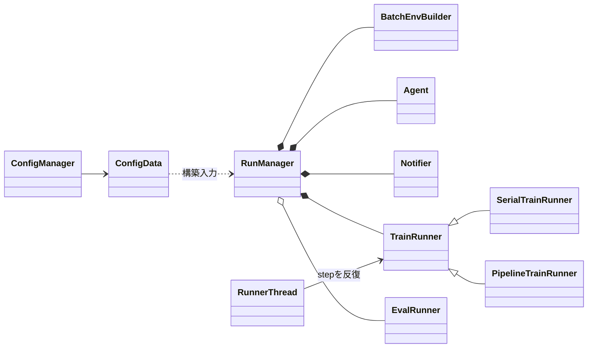
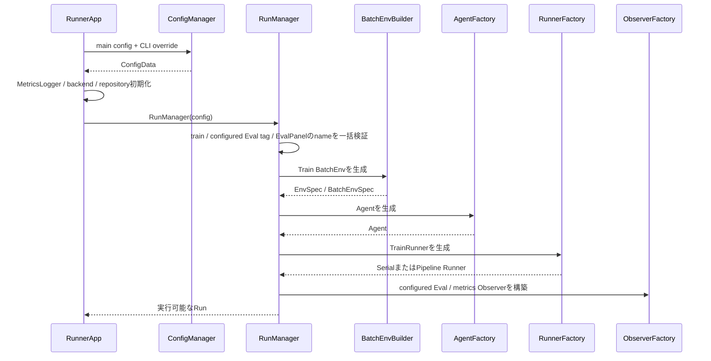
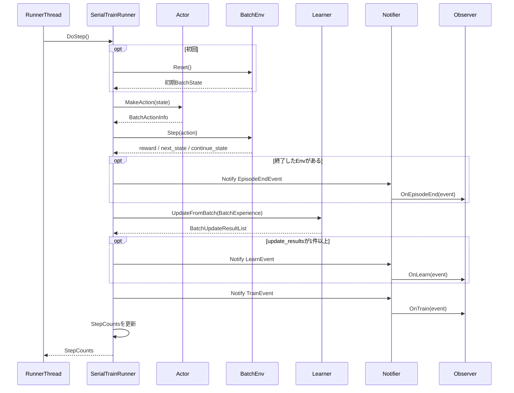
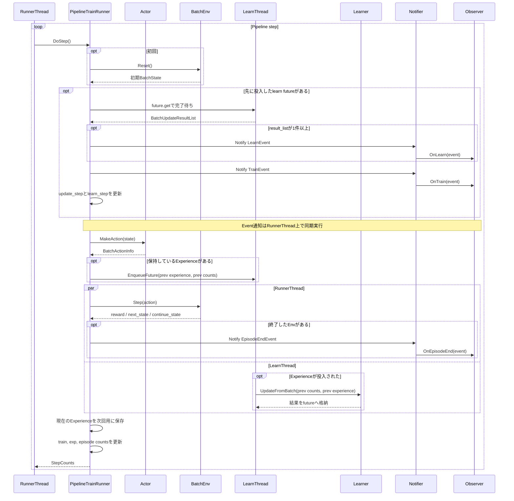

# 実行基盤と設定

> 主たる観点: 機能単位（実行基盤と設定。内部の処理工程を時系列で併記）

## 1. はじめに

### 1.1 目的

本書は、設定ファイルからEnv、Agent、Runner、Observerを構築し、Runを開始・停止するまでの実行基盤を説明する。
設定の解決順、objectの所有関係、Serial/Pipeline/Eval Runnerの違いをコードへ対応付ける。

### 1.2 対象読者

- Config、RunManager、Runnerを変更するフレームワーク開発者
- Runの構築順やlifetimeを確認するAgent・Env開発者
- 並行実行、評価、終了処理をレビューする担当者

### 1.3 記載範囲

現行の`ConfigData`、`ConfigManager`、`RunManager`、Runner群、`RunnerThread`を扱う。
GUI操作は[Run実行ガイド](020_user_guide_run.jp.md)、EventとObserverは[可観測性](140_observability.jp.md)を参照する。

## 2. 基本概念と外部contract

### 2.1 設定の解決

設定は文字列key/valueを保持する`ConfigData`へ集約される。

1. `Properties`がmain configと`$include`先を読み込む。
2. `ConfigManager`がコマンドラインの`key=value`を一度適用する。この指定は`.$`によるmerge対象の選択にも使われる。
3. `ConfigManager`が設定グループのmergeを左から右へ解決する。
4. merge結果よりコマンドライン指定を優先するため、同じ`key=value`を最終overrideとして再適用する。
5. 各`Config` classがdefault prefixとoverride prefixから型付きfieldを読み取る。
6. 読み取った値をRun directoryの設定成果物へ記録する。

`ConfigData::Read` / `Get`は、キーが存在しない場合だけ呼出側が渡した値を使う。存在する値の型変換に失敗した場合は、key、raw値、期待型を含む`ANET_SYSTEM_ERROR`でfail-fastし、既定値へ戻さない。default prefixとoverride prefixの各layerは独立して書式検証するため、後続overrideは先行layerの書式不正を隠さない。typed readerは前後空白、値全体の消費、overflow、負unsigned値、nonfinite値、不正bool、vector tokenを共通に検証する。stringとvectorの明示的な空値は有効である。値域、enum、組み合わせは各Configまたは再利用される設定型の構築時validatorが検証する。複数layerの合成後に行う構造・bounds検証は物理layerを推測せず、Config所有者から見た論理keyを診断へ使う。

### 2.2 RunとRunner

- Runは1回の構築・実行と成果物をまとめる単位である。
- `RunManager`は主Train Env、Agent、Notifier、TrainRunnerとconfigured Eval Runnerを管理する。
- `RunManager`はBatchEnvの人間向けnameを決定する。main Trainは`train`、configured Evalはtag、動的Evalは`CreateEvalRunner(name, ...)`のnameを使用し、意味を加工しない。
- BatchEnv nameはcase-sensitiveな完全一致で同一Run内一意とし、`RunManager`のprivateなrun-local registryが所有する。factory、Env、Runnerは一意性状態を持たない。
- `Runner`は`DoStep()`または`DoUpdateFrame()`で処理を進め、`StepCounts`を更新する。
- `RunnerStatus`は未初期化、実行中、完了を表す。GUIのpauseはRunnerを破棄せず、RunnerThreadからstepを呼ばないことで実現する。
- `ControlSignal`はframe内継続、frame打切り、Runner停止をpre/post callbackから返す。

### 2.3 Runnerの種類

| Runner | 用途 |
|---|---|
| `SerialTrainRunner` | Action、Env Step、Learner更新、Event通知を同じthreadで順に実行する |
| `PipelineTrainRunner` | 1つ前のExperienceのLearner更新と、現在のActor/Env処理を1-deepで重ねる |
| `EvalRunner` | Learnerを呼ばず、ActorとEnvで評価または手動操作を進める |

Train Runnerは`Agent::CreateActor()`へclone方針を指定せず`std::nullopt`を渡し、Agent固有のTrain既定へ解決を委ねる。Eval Runnerは従来どおりconfigured Evalの明示`bool`を渡す。明示的なshared指定とdevice不整合はRunner境界で早期検証し、Agentもeffective policyを解決した後に同じ不整合を検証する。

## 3. コンポーネント定義

| コンポーネント | 定義 |
|---|---|
| `Properties` | Properties類似形式のファイルとincludeを読み込む |
| `ConfigManager` | file、merge、CLI overrideから最終ConfigDataを作る |
| `Config` | default/override prefixを使い、1コンポーネントの型付き設定を読む基底 |
| `RunManager` | seed、Env、Agent、Notifier、Runnerの構築とRun内共有objectを管理する |
| `RunnerFactory` | `serial`または`pipeline`のTrainRunnerを選ぶ |
| `RunnerBase` | Actor、Env、State、step count、episode集計の共通実装 |
| `TrainRunner` | Learnerと性能metricを持つTrain用基底 |
| `EvalRunner` | Eval Actorの同期とAction指定を扱う |
| `RunnerThread` | Runnerをbackgroundで反復し、例外をapplication境界へ通知する |
| `MasterSeedManager` | Runのmaster seedから用途別seedを払い出す |

## 4. コードマップ

| 領域 | 主なファイル |
|---|---|
| 設定interface | [config.hpp](../../core/anet-core/include/anet/config.hpp) |
| 設定parser・merge | [config.cpp](../../core/anet-core/src/config.cpp) |
| Runner interface・Event | [rl.hpp](../../core/anet-core/include/anet/rl.hpp) |
| RunManager・Runner | [trainer.hpp](../../core/anet-core/include/anet/trainer.hpp)、[trainer.cpp](../../core/anet-core/src/trainer.cpp) |
| seed管理 | [random.hpp](../../core/anet-core/include/anet/random.hpp)、[random.cpp](../../core/anet-core/src/random.cpp) |
| thread基盤 | [thread.hpp](../../core/anet-core/include/anet/thread.hpp)、[thread.cpp](../../core/anet-core/src/thread.cpp) |
| backend初期化 | [init.hpp](../../core/anet-core/include/anet/init.hpp)、[init.cpp](../../core/anet-core/src/init.cpp) |
| application起動・終了 | [RunnerApp.cpp](../../apps/runner/src/RunnerApp.cpp)、[RunnerFrame.cpp](../../apps/runner/src/RunnerFrame.cpp) |
| 標準設定 | [apps/runner/config](../../apps/runner/config) |

## 5. 静的構造

主Train EnvはTrainRunnerが使用し、EvalRunnerごとに別のEnvとActorを作る。AgentとNotifierはRun内で共有される。

## 6. 処理フロー

### 6.1 Run構築

構築中に型変換、EnvSpec、device、class ID、Env name衝突、または各`Config`の不整合を検出した場合は、RunnerThread開始前に失敗する。固定名`train`、全configured Eval tag、予約名`EvalPanel`は最初のBatchEnv構築前に一括検証する。型変換失敗時の契約は[設定の解決](#21-設定の解決)のとおりである。

configured Evalの`interval=0`はdormant宣言である。tag名とschemaは検証・予約するが、Eval Env、Actor、Observer、background workerは生成しない。dormant tagを参照するmetricsはtagごとに1回WARNしてskipし、未宣言tag参照はerrorとする。ImageClsは`ImageClsEnv.train.*`と`ImageClsEnv.eval.*`を標準の組として必須化し、tagなしEvalは標準Eval設定、configured Evalは`train.eval.[tag].env.eval.*`のoverlayを使用する。

### 6.2 Serial Train step

`Learner`は`UpdateFromBatch()`で学習を実行し、`BatchUpdateResultList`を戻す。`LearnEvent`はLearner自身が発火するEventではなく、戻り値を受けた`SerialTrainRunner`が構築して`Notifier`へ通知する。`Notifier`からObserverへのcallbackも同じRunnerThread上で同期実行される。

Eventは対応する処理が完了した時点のcountを持ち、count本体は通知後に次step向けへ更新される。

### 6.3 Pipeline Train step

`PipelineTrainRunner`は前回Experienceをcloneして保持し、専用の1 workerへLearner更新を投入する。
後続stepの冒頭では、先に投入した更新の完了と例外を回収し、`LearnEvent`と`TrainEvent`をRunnerThread上で通知する。その後Actor推論、保持しているExperienceの非同期学習投入、現在のEnv Stepを進める。
Serial/PipelineともTrain stepから`Actor::Sync()`を暗黙には呼ばず、同期の要否と時点は具象Actorの契約に委ねる。DefaultDQN Train Actorの定期snapshot同期は`MakeAction()`内で処理されるため、詳細は[DQN系Agent](200_dqn_agents.jp.md)を参照する。
shutdown時は未完了学習を待ってpoolを停止してからEnvをshutdownする。

初回はEnvをResetし、保持済みExperienceがないためLearner更新を投入しない。定常状態では、LearnThreadのLearner更新とRunnerThreadのEnv Stepが並行し、学習結果の回収と通知は後続`DoStep()`の冒頭まで遅延する。RunnerThreadはActor推論を終えてから学習を投入するため、Actor推論とLearner更新は同時実行しない。

## 7. 設定・lifetime・エラー・性能特性

### 7.1 主な構築設定

| キー | 意味 |
|---|---|
| `train.seed` | Runのmaster seed。0の実seedは実行時に確定・記録される |
| `train.num_envs` | 主Train BatchEnvのlane数 |
| `train.main_runner_type` | `serial`または`pipeline` |
| `train.eval_device_type/index` | configured Evalのdevice |
| `train.eval.[tag].*` | configured Evalのinterval、RunMode、`eval_batch_size`、Env override、model clone |
| `env.*` | Env class、worker、device |
| `agent.*` | Agent class、device |
| `backend.*` | TF32、cuDNN、決定論などlibtorch backend |

完全なkey一覧はConfig classとRun内`config/config_data.txt`を基準とする。

### 7.2 lifetimeと終了

- applicationの正常終了経路は、`RunnerThread`を停止・joinし、`TrainRunner::Shutdown()`でPipeline workerとEnvを停止してから`RunManager`を解放する。
- `RunManager`のdestructor単体をworker停止の入口とはせず、application側のshutdown順序を維持する。
- `RunnerThread`はRunnerをshared ownershipし、停止・join後に解放する。
- Pipelineの前回Experienceは次の非同期更新が完了するまでstorageを保持する。
- process singleton repositoryはfactoryを保持するが、Run固有のAgent、Env、Runnerを保持しない。
- ImageClsの`ImageDatasetManager`は例外的にDatasetKey単位のmanifest/cacheをprocess終了まで保持する。Sampler、RNG、decode poolは各EnvのSourceが所有する。
- Env name registryは`RunManager`のlifetimeに限定する。生成成功後に登録したnameはそのRunManagerを破棄するまで再利用せず、Env生成失敗時は登録しない。別RunManagerでは同じnameを再利用できる。

### 7.3 エラー

- `ConfigData`の型変換失敗は例外とし、既定値はキー欠落時だけ使う。範囲・enum・組み合わせは各`Config`または再利用設定型の検証、class IDはrepository解決時の検証に従う。
- RunnerThread内の例外は握りつぶさずapplicationのexception callbackへ渡す。
- Pipeline workerの例外はfuture取得時にcaller threadへ再送出する。
- 空のEnv nameまたは同一Run内の重複nameは`ANET_SYSTEM_ERROR`でfail-fastする。重複時は第二のEnvを構築せず、既存runnerを上書きしない。診断にはname、既存owner、要求owner、一意性要件を含める。
- shutdownは未完了workerと出力flushの順序を崩さない。

### 7.4 性能

- Serialは挙動を追いやすく、PipelineはLearnerのGPU処理とEnvのCPU処理を重ねられる。
- Pipelineは1-step遅延、clone、future待機を伴うため、storage lifetimeと通知countを同時に確認する。
- `train_step_per_sec`と`exp_step_per_sec`はbatch sizeの意味が異なる。比較時は同じ設定とstep軸を使う。

## 8. テストと拡張時の確認事項

- [config_test.cpp](../../core/anet-core/src/config_test.cpp): 型変換fail-fast、キー欠落時の既定値、structured config、include、merge、CLI override
- [trainer_test.cpp](../../core/anet-core/src/trainer_test.cpp): Train clone方針のAgent委譲、Pipelineの暗黙同期禁止、Eval ActorとAgentのdevice整合性
- [episode_end_test.cpp](../../core/anet-core/src/episode_end_test.cpp): Runnerのepisode終端通知とEval強制Action
- [init_test.cpp](../../core/anet-core/src/init_test.cpp): 初期化とbackend設定
- [app_util_test.cpp](../../core/anet-core/src/app_util_test.cpp): executable rootと出力path

現行`trainer_test.cpp`はSerial/Pipeline全体、count、shutdownを広く覆うものではない。これらを変更する場合は、Serial/Pipelineのaction/snapshot境界が一致すること、B=1と複数laneのcount、Evalのscope、停止時のworker回収を対象とする回帰testを追加して確認する。

## 9. 関連文書

- [フレームワーク全体概要](010_framework_overview.jp.md)
- [Run実行ガイド](020_user_guide_run.jp.md)
- [Agentと学習](110_agents_and_learning.jp.md)
- [環境](120_environments.jp.md)
- [可観測性](140_observability.jp.md)
- [ReplayBuffer](150_replay_buffer.jp.md)
- [DQN系Agent](200_dqn_agents.jp.md)
- [決定論的algorithm ADR](../adr/0006-deterministic-algorithms.md)
