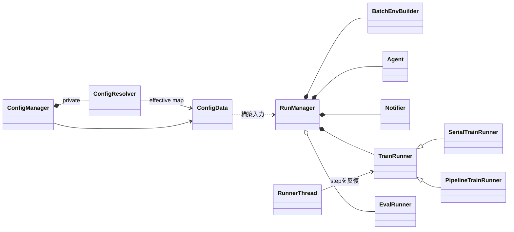
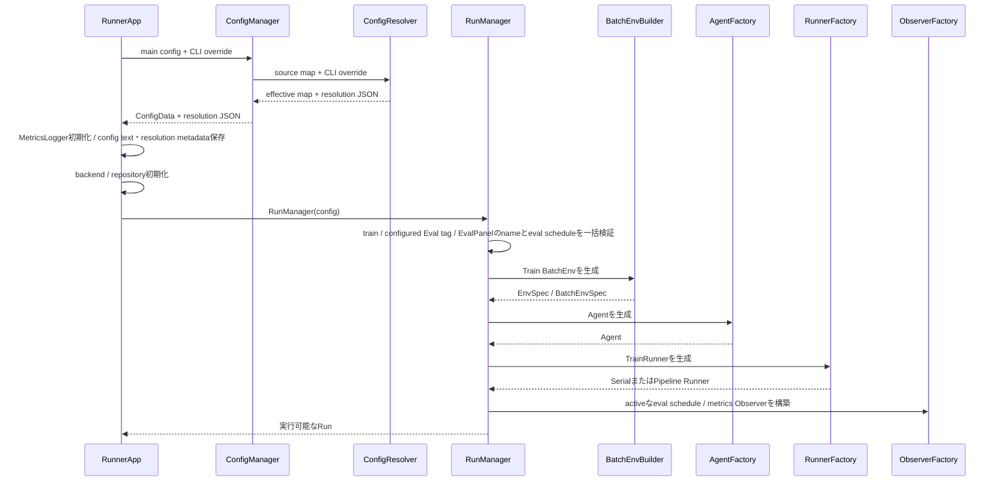
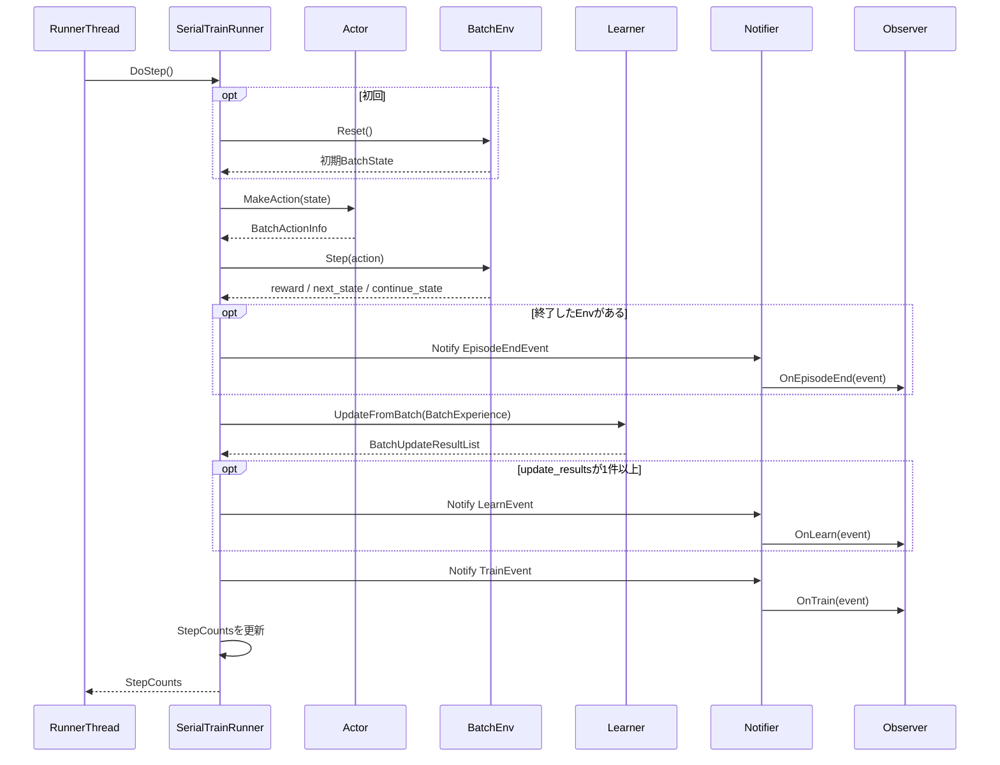
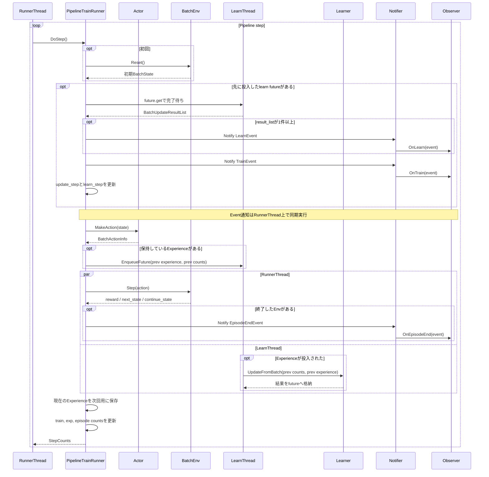

# 実行基盤と設定

> 主たる観点: 機能単位（実行基盤と設定。内部の処理工程を時系列で併記）

## 1. はじめに

### 1.1 目的

本書は、設定ファイルからEnv、Agent、Runner、Observerを構築し、Runを開始・停止するまでの実行基盤を説明する。
設定の解決順、objectの所有関係、Serial/Pipeline/Eval Runnerの違いをコードへ対応付ける。

### 1.2 対象読者

- Config、RunManager、Runnerを変更するフレームワーク開発者
- Runの構築順やlifetimeを確認するAgent・Env開発者
- 並行実行、評価、終了処理をレビューする担当者

### 1.3 記載範囲

現行の`ConfigData`、`ConfigManager`、private deep moduleの`ConfigResolver`、`RunManager`、Runner群、`RunnerThread`を扱う。
GUI操作は[Run実行ガイド](020_user_guide_run.jp.md)、EventとObserverは[可観測性](140_observability.jp.md)を参照する。

## 2. 基本概念と外部contract

### 2.1 設定の解決

設定は文字列key/valueを保持する`ConfigData`へ集約される。

1. `Properties`が共通main configと`$include`先を読み込む。各行は最初の`=`で分割し、その直前の`?`を既定葉演算子として取り除く。同じキーは`=`を`?=`より優先し、同じ強さだけ後勝ちとする。key内の空白を除去して単一の`:`を`.`へ正規化する。複数の`:`または空の区間はfail-fastする。旧parserで`:`をkey/value境界としていた`foo: bar`形式は廃止し、`=`のない行は読み飛ばす。
2. workspaceモードではRunnerが`app.runs_dir=<workspace>/runs`を注入し、workspaceの`config/_main.txt`を後勝ちで重ねる。workspace内includeは共通config directoryへfallbackして解決する。
3. `ConfigResolver`がCLIを解決入力へ反映し、`run.$`を通常selectionより先に展開する。Runの項は左から右へ後勝ちでrootへ供給し、同じキーのCLIをさらに優先する。Run内の`Env.$ = @base`は展開先rootを定義位置とする。
4. 各設定を、`?=`の既定葉、全体の`.$`によるベース、配下の部分`.$`、直接書いた個別葉の順に組み立てる。異なるキーの行順でこの優先関係を変えない。各選択元の最終値を左から右へ差分合成し、右側にない葉は残す。継承由来か直書きかで葉を削除しない。
5. 参照元への後段変更・追加キー・Run・CLIも、参照元自身の最終値として継承先へ届く。依存解決の順序と上書き順位は別である。親キーへのCLIは親の最終値を変更するが、子自身の個別指定を無条件には上書きしない。
6. 必要なプロファイル定義を有効化し、定義位置の依存を検証する。未選択の内側プロファイルは休止した在庫として保持する。未定義のプロファイル・カタログ・その部分、自己供給、実際の循環、選択深さ10超過はfail-fastする。空の通常prefixは名前によらず許容する。
7. 最終値へ`${full.key}`を1段だけ展開する。未定義・連鎖・未解決の値参照はfail-fastする。`.$`と`@` segmentを持つ定義を除いた`ConfigData`とresolution JSONを返し、各`Config`が型付きfieldを読む。workspaceの最終`app.runs_dir`は注入値との文字列完全一致を検証する。
8. Runnerは実効設定を`config/config_data.txt`へ保存し、構造化した解決記録を`MetricsLogger::Log("config_resolution", json)`へ渡す。`json/config_resolution.json`には`type` / `tag` / `data` envelope付きで保存され、同じrecordがMetrics masterにも記録される。

**`$`はベース、部分指定と個別葉はそれより強い指定**である。`A2 > A3`は各選択元の完成した値を差分合成するため、A3にないeps_endはA2から残る。A2の深い部分指定も、A3が持つ同名キーより強くしない。同じ入力キーそのものを再指定した場合は従来の後勝ちであり、`Env.$ = A2`の後の`Env.$ = A3`ではA3だけを選ぶ。

運用は、**共通ファイルのベース定義は`?=`、環境別ファイルはデフォルト設定だけ`?=`、それ以外は原則`=`**とする。規約の正本は`AGENTS.md`「設定ファイルの代入演算子」、人向けの説明と例は[Run実行ガイド](020_user_guide_run.jp.md)§3.6である。

既定値は同じ位置に`?=`で書き、意図した個別指定は`=`で書く。既定値用プロファイルをチェーン先頭へ追加しない。Runプロファイル内・CLI・選択宣言`.$`には`?=`を書けない。設定を追加したら`check_default_leaves.py`で、共通ベース・デフォルト設定に残った`=`と環境別の個別指定に紛れた`?=`を確認する。用途を変える場合は検査器の分類理由も更新する。

短い`@name`は宣言の定義元で解決する。`Env.$ = @a`はEnv.@a、`Env.@a : $ = @b`はEnv.@bを参照し、`Other.$ = Env.@a`でもOther.@bへ変わらない。完全修飾termはそのまま使う。`:`は説明・設定例では`@`プロファイルの境界に使い、通常キーは`Env.$`のように`.`で記述する。CommonやA2自身の`.$`も通常の依存であり、名前のドット数で上書き層を識別しない。参照先の選択命令をコピー先で再実行しない。

resolution JSONの`schema_version`は1。`selections[].key`は宣言の定義位置で、`Env.@a.$`や`DefaultDQNAgent.@baseline.actor.[eval].$`もそのまま記録する。`run.$`を先頭に置き、入力宣言順・term順に必要な依存を辿り、同じ定義の再参照は重複させない。`references`は1段値参照を参照元キー順に記録する。`overrides`はRunの最終指定が同じキーのRun葉適用前の最終値を変更した場合だけ、`key` / `by` / `from` / `to`で記録する。Runが選択キーを変更した効果は、その前提値にも反映する。途中の4→1→4は記録しない。`to`はRun値であり、同じ葉へのCLI指定後の実効値とは異なりうる。最終値は`config_data.txt`で確認する。

例えばDropMergeの次の3行は、いずれも環境別ファイルのデフォルト設定外なので`=`で書く。

```ini
DefaultDQNAgent.net.branch.[value_stream].structure = HeadFC1024 > SiLU
DefaultDQNAgent.net.branch.[vector_feature].structure = Embed5846_v2
app.run_name = run_{t}_dm_iqn-k32-n32-m32
```


対象の葉へのRun・CLI指定は`=`の個別葉にも勝つ。一方、選択キーへのCLIはチェーンだけを置き換える。ベース定義の`?=`も、選択元の最終値になって継承された後は通常の値であり、`>`の右側にある値が左側の値に勝つ。

内部では必要な定義の有効化とキー集合を確定し、具体的なowner・term順に値の供給元を決め、個別葉を優先して依存を評価する。循環・深さ検証は値のキャッシュと分離し、宣言順やキャッシュで深さ10の判定を変えない。契約と具体例は[PRD072](../memo/done/072_config_selection_final_value_10prd.md)、判断理由は[ADR0042](../adr/0042-config-inheritance-as-differential-base.md)を参照する。

DefaultDQN / ImageCls / Rainbowの各Agent Factoryは、`GetTargetAgentClassId() + ".net"`を最終NNツリーの読込prefixとして`NetworkConfig`へ渡す。branch・body・outputは`DefaultDQNAgent.net.*`、`ImageClsAgent.net.*`、`RainbowAgent.net.*`のようにAgent所有のサブツリーから読み、ブロックカタログ`net.block.[*]`と`net.config_profile`はグローバル共有定義としてagent-local定義へmergeする。DefaultDQN Factoryは両Config構築後かつNetworkModel構築前に、`DefaultDQNAgent.quantile_mode=iqn`ならいずれかのbranch bindが`taus`を直接含み、`qr` / `none`なら含まないことをfail-fast検証する。MuZeroの実最終ツリー`net.rep` / `net.dyn` / `net.pred`は保留中の別構造であり、PRD 059 Phase 1aではrootに維持する。

`--config`明示時は手順2のworkspace解決・注入・後読みを省略する完全自己記述モードである。`--config`、`--workspace`、`--select-workspace`は相互排他である。

`ConfigData::Read` / `Get`は、キーが存在しない場合だけ呼出側が渡した値を使う。存在する値の型変換に失敗した場合は、key、raw値、期待型を含む`ANET_SYSTEM_ERROR`でfail-fastし、既定値へ戻さない。default prefixとoverride prefixの各layerは独立して書式検証するため、後続overrideは先行layerの書式不正を隠さない。typed readerは前後空白、値全体の消費、overflow、負unsigned値、nonfinite値、不正bool、vector tokenを共通に検証する。stringとvectorの明示的な空値は有効である。値域、enum、組み合わせは各Configまたは再利用される設定型の構築時validatorが検証する。複数layerの合成後に行う構造・bounds検証は物理layerを推測せず、Config所有者から見た論理keyを診断へ使う。

### 2.2 RunとRunner

- Runは1回の構築・実行と成果物をまとめる単位である。
- `RunManager`は主Train Env、Agent、Notifier、TrainRunnerとconfigured Eval Runnerを管理する。
- `RunManager`はBatchEnvの人間向けnameを決定する。main Trainは`train`、configured Evalはtag、動的Evalは`CreateEvalRunner(name, ...)`のnameを使用し、意味を加工しない。
- BatchEnv nameはcase-sensitiveな完全一致で同一Run内一意とし、`RunManager`のprivateなrun-local registryが所有する。factory、Env、Runnerは一意性状態を持たない。
- `Runner`は`DoStep()`または`DoUpdateFrame()`で処理を進め、`StepCounts`を更新する。
- `RunnerStatus`は未初期化、実行中、完了を表す。GUIのpauseはRunnerを破棄せず、RunnerThreadからstepを呼ばないことで実現する。
- `ControlSignal`はframe内継続、frame打切り、Runner停止をpre/post callbackから返す。

### 2.3 Runnerの種類

| Runner | 用途 |
|---|---|
| `SerialTrainRunner` | Action、Env Step、Learner更新、Event通知を同じthreadで順に実行する |
| `PipelineTrainRunner` | 1つ前のExperienceのLearner更新と、現在のActor/Env処理を1-deepで重ねる |
| `EvalRunner` | Learnerを呼ばず、ActorとEnvで評価または手動操作を進める |

Runnerは`ActorRequest`にActor名・spec・device・seedをまとめてAgentへ渡す。cloneとnetworkの選択、sharedのdevice検証はAgentが所有する。スケジュールが無効なdormant評価ではActorを生成せず、参照名も解決しない。EvalPanelは`CreateEvalRunner(name, config_tag)`で参照タグのActorを使う。

## 3. コンポーネント定義

| コンポーネント | 定義 |
|---|---|
| `Properties` | Properties類似形式のファイルとincludeを読み込む |
| `ConfigManager` | main file、注入値、後勝ちoverlay、CLI overrideを収集し、resolverの結果を公開する |
| `ConfigResolver` | source mapからselection、CLI leaf、値参照を順に解決し、実効ConfigDataとresolution JSONを作るprivate deep module |
| `Config` | default/override prefixを使い、1コンポーネントの型付き設定を読む基底 |
| `RunManager` | seed、Env、Agent、Notifier、Runnerの構築とRun内共有objectを管理する |
| `RunnerFactory` | `serial`または`pipeline`のTrainRunnerを選ぶ |
| `RunnerBase` | Actor、Env、State、step count、episode集計の共通実装 |
| `TrainRunner` | Learnerと性能metricを持つTrain用基底 |
| `EvalRunner` | Eval Actorの同期とAction指定を扱う |
| `RunnerThread` | Runnerをbackgroundで反復し、例外をapplication境界へ通知する |
| `MasterSeedManager` | Runのmaster seedから用途別seedを払い出す |

## 4. コードマップ

| 領域 | 主なファイル |
|---|---|
| 設定interface | [config.hpp](../../core/anet-core/include/anet/config.hpp) |
| 設定parser・管理 | [config.cpp](../../core/anet-core/src/config.cpp) |
| 設定解決 | [config_impl.hpp](../../core/anet-core/src/config_impl.hpp)、[config_impl.cpp](../../core/anet-core/src/config_impl.cpp) |
| Runner interface・Event | [rl.hpp](../../core/anet-core/include/anet/rl.hpp) |
| RunManager・Runner | [trainer.hpp](../../core/anet-core/include/anet/trainer.hpp)、[trainer.cpp](../../core/anet-core/src/trainer.cpp) |
| seed管理 | [random.hpp](../../core/anet-core/include/anet/random.hpp)、[random.cpp](../../core/anet-core/src/random.cpp) |
| thread基盤 | [thread.hpp](../../core/anet-core/include/anet/thread.hpp)、[thread.cpp](../../core/anet-core/src/thread.cpp) |
| backend初期化 | [init.hpp](../../core/anet-core/include/anet/init.hpp)、[init.cpp](../../core/anet-core/src/init.cpp) |
| application起動・終了 | [RunnerApp.cpp](../../apps/runner/src/RunnerApp.cpp)、[RunnerFrame.cpp](../../apps/runner/src/RunnerFrame.cpp) |
| 標準設定 | [apps/runner/config](../../apps/runner/config) |

## 5. 静的構造



主Train EnvはTrainRunnerが使用し、EvalRunnerごとに別のEnvとActorを作る。AgentとNotifierはRun内で共有される。

## 6. 処理フロー

### 6.1 Run構築



構築中に型変換、EnvSpec、device、class ID、Env name衝突、または各`Config`の不整合を検出した場合は、RunnerThread開始前に失敗する。固定名`train`、全configured Eval tag、予約名`EvalPanel`は最初のBatchEnv構築前に一括検証する。型変換失敗時の契約は[設定の解決](#21-設定の解決)のとおりである。

`run.eval.[tag]`はconfigured Evalの定義であり、定義だけでは何も生成しない。`run.eval_schedule.[tag]`の`interval>0`が同名の定義を定期駆動するときだけEval Env、Actor、Observer、background workerを生成する。定義済みでscheduleが無いか`interval=0`のtagはdormantとなり、tag名とschemaの検証・予約だけを行う。dormant tagを参照するmetricsはtagごとに1回WARNしてskipし、未宣言tag参照と未定義tagを指すscheduleはerrorとする。activeなconfigured Evalでは`RunManager`がEnvを`EvalSessionEnv`で包み、`eval_batch_size`を並列lane数、`eval_episodes`を採用episode本数として独立に扱う。ImageClsは`ImageClsEnv.train.*`と`ImageClsEnv.eval.*`を標準の組として必須化し、tagなしEvalは標準Eval設定、configured Evalは`run.eval.[tag].env.eval.*`のoverlayを使用する。

### 6.2 Serial Train step

`Learner`は`UpdateFromBatch()`で学習を実行し、`BatchUpdateResultList`を戻す。`LearnEvent`はLearner自身が発火するEventではなく、戻り値を受けた`SerialTrainRunner`が構築して`Notifier`へ通知する。`Notifier`からObserverへのcallbackも同じRunnerThread上で同期実行される。



Eventは対応する処理が完了した時点のcountを持ち、count本体は通知後に次step向けへ更新される。

### 6.3 Pipeline Train step

`PipelineTrainRunner`は前回Experienceをcloneして保持し、専用の1 workerへLearner更新を投入する。
後続stepの冒頭では、先に投入した更新の完了と例外を回収し、`LearnEvent`と`TrainEvent`をRunnerThread上で通知する。その後Actor推論、保持しているExperienceの非同期学習投入、現在のEnv Stepを進める。
Serial/PipelineともTrain stepから`Actor::Sync()`を暗黙には呼ばず、同期の要否と時点は具象Actorの契約に委ねる。DefaultDQN Train Actorの定期snapshot同期は`MakeAction()`内で処理されるため、詳細は[DQN系Agent](200_dqn_agents.jp.md)を参照する。
shutdown時は未完了学習を待ってpoolを停止してからEnvをshutdownする。



初回はEnvをResetし、保持済みExperienceがないためLearner更新を投入しない。定常状態では、LearnThreadのLearner更新とRunnerThreadのEnv Stepが並行し、学習結果の回収と通知は後続`DoStep()`の冒頭まで遅延する。RunnerThreadはActor推論を終えてから学習を投入するため、Actor推論とLearner更新は同時実行しない。

### 6.4 configured Eval session

`EpisodeEvalObserver`は発火時の`StepCounts`を固定し、`EvalRunner::RunSession()`へ渡す。`RunSession()`はActorを同期して`EvalSessionEnv::Reset()`を呼び、採用episode N本が完了するまでstepを進める。途中のepisode終端では`EpisodeEndEvent`を出さず、完了後にdecorator Env、`env_index=-1`、発火元countsを持つeventを1回だけ通知する。EvalPanelはsession decoratorを使わず、従来のstep駆動、強制Action、同期方式を維持する。

## 7. 設定・lifetime・エラー・性能特性

### 7.1 主な構築設定

| キー | 意味 |
|---|---|
| `run.seed` | Runのmaster seed。0の実seedは実行時に確定・記録される |
| `run.train.num_envs` | 主Train BatchEnvのlane数 |
| `run.train.runner_type` | `serial`または`pipeline` |
| `run.train.actor` | Actorカタログ名。既定`train` |
| `run.eval_device_type/index` | configured Evalのdevice |
| `run.eval.[tag].*` | configured EvalのRunMode、並列lane数`eval_batch_size`、採用本数`eval_episodes`（既定1）、Env override、Actor名参照 |
| `run.eval_schedule.[tag].*` | configured Evalを定期駆動する必須`interval`と`use_background` |
| `env.*` | Env class、worker、device |
| `agent.*` | Agent class、device |
| `backend.*` | TF32、cuDNN、決定論などlibtorch backend |

完全な実効key一覧はConfig classとRun内`config/config_data.txt`を基準とする。選択したプロファイルと`${}`参照の解決経路は`json/config_resolution.json`またはMetrics masterの`config_resolution` recordにある`data`を基準とする。resolutionは分析・診断用metadataであり、設定の再読込には使わない。

### 7.2 lifetimeと終了

- applicationの正常終了経路は、`RunnerThread`を停止・joinし、`TrainRunner::Shutdown()`でPipeline workerとEnvを停止してから`RunManager`を解放する。
- `RunManager`のdestructor単体をworker停止の入口とはせず、application側のshutdown順序を維持する。
- `RunnerThread`はRunnerをshared ownershipし、停止・join後に解放する。
- Pipelineの前回Experienceは次の非同期更新が完了するまでstorageを保持する。
- process singleton repositoryはfactoryを保持するが、Run固有のAgent、Env、Runnerを保持しない。
- ImageClsの`ImageDatasetManager`は例外的にDatasetKey単位のmanifest/cacheをprocess終了まで保持する。Sampler、RNG、decode poolは各EnvのSourceが所有する。
- Env name registryは`RunManager`のlifetimeに限定する。生成成功後に登録したnameはそのRunManagerを破棄するまで再利用せず、Env生成失敗時は登録しない。別RunManagerでは同じnameを再利用できる。

### 7.3 エラー

- `ConfigData`の型変換失敗は例外とし、既定値はキー欠落時だけ使う。範囲・enum・組み合わせは各`Config`または再利用設定型の検証、class IDはrepository解決時の検証に従う。
- RunnerThread内の例外は握りつぶさずapplicationのexception callbackへ渡す。
- Pipeline workerの例外はfuture取得時にcaller threadへ再送出する。
- 空のEnv nameまたは同一Run内の重複nameは`ANET_SYSTEM_ERROR`でfail-fastする。重複時は第二のEnvを構築せず、既存runnerを上書きしない。診断にはname、既存owner、要求owner、一意性要件を含める。
- shutdownは未完了workerと出力flushの順序を崩さない。

### 7.4 性能

- Serialは挙動を追いやすく、PipelineはLearnerのGPU処理とEnvのCPU処理を重ねられる。
- Pipelineは1-step遅延、clone、future待機を伴うため、storage lifetimeと通知countを同時に確認する。
- `train_step_per_sec`と`exp_step_per_sec`はbatch sizeの意味が異なる。比較時は同じ設定とstep軸を使う。

## 8. テストと拡張時の確認事項

- [config_test.cpp](../../core/anet-core/src/config_test.cpp): 型変換fail-fast、キー欠落時の既定値、structured config、include、selection、CLI 2相、値参照、旧AutoMergeとのgolden同値性
- [metrics_logger_test.cpp](../../core/anet-core/src/metrics_logger_test.cpp): config textとJSON resolution metadataのfile / Metrics master出力境界
- [trainer_test.cpp](../../core/anet-core/src/trainer_test.cpp): Train clone方針のAgent委譲、Pipelineの暗黙同期禁止、Eval ActorとAgentのdevice整合性
- [episode_end_test.cpp](../../core/anet-core/src/episode_end_test.cpp): Runnerのepisode終端通知とEval強制Action
- [init_test.cpp](../../core/anet-core/src/init_test.cpp): 初期化とbackend設定
- [app_util_test.cpp](../../core/anet-core/src/app_util_test.cpp): executable rootと出力path

現行`trainer_test.cpp`はSerial/Pipeline全体、count、shutdownを広く覆うものではない。これらを変更する場合は、Serial/Pipelineのaction/snapshot境界が一致すること、B=1と複数laneのcount、Evalのscope、停止時のworker回収を対象とする回帰testを追加して確認する。

## 9. 関連文書

- [フレームワーク全体概要](010_framework_overview.jp.md)
- [Run実行ガイド](020_user_guide_run.jp.md)
- [Agentと学習](110_agents_and_learning.jp.md)
- [環境](120_environments.jp.md)
- [可観測性](140_observability.jp.md)
- [ReplayBuffer](150_replay_buffer.jp.md)
- [DQN系Agent](200_dqn_agents.jp.md)
- [決定論的algorithm ADR](../adr/0006-deterministic-algorithms.md)
