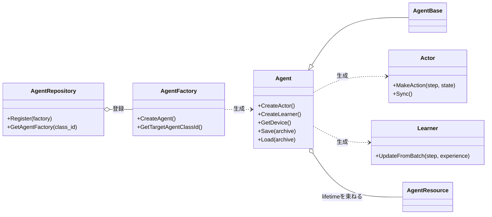
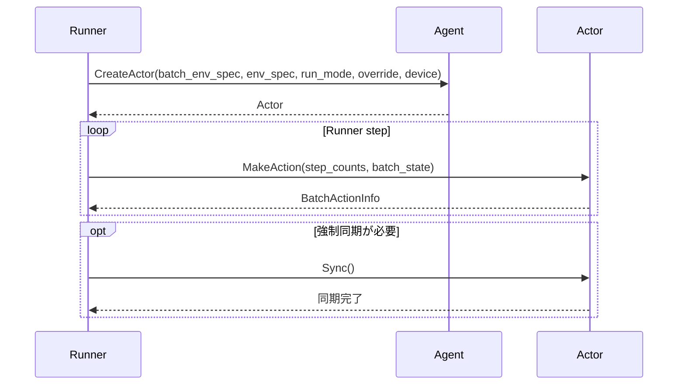
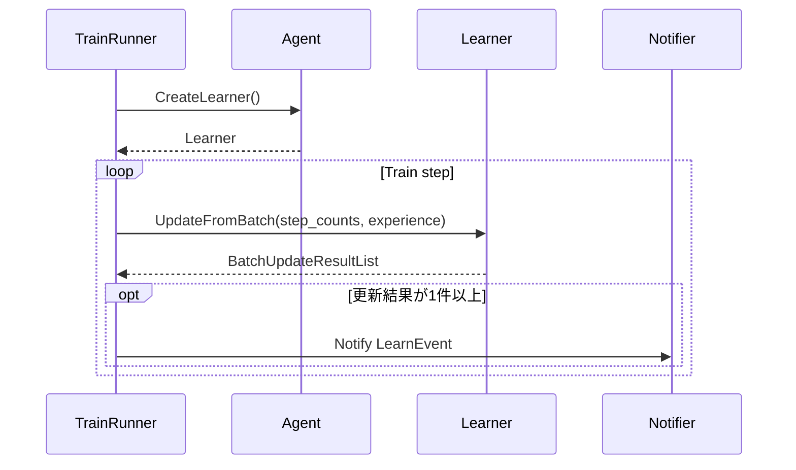

<!-- translated-from: 110_agents_and_learning.jp.md blob:c348c32de84e52b3aac7ed8a9f87bbddf9b3dde7 date:2026-09-20 progress:done -->
# Agents and Learning

> Primary perspective: function (shared Agent, Actor, and Learner contracts, with processing stages in chronological order)

## 1. Introduction

### 1.1 Purpose

This document explains the shared `Agent`, `Actor`, and `Learner` contracts and ownership rules followed by ANET Agent implementations.
Independently of concrete algorithms, it clarifies the boundaries through which a Run uses action selection and learning updates, and the extension points for new Agents.

### 1.2 Audience

- Developers adding or modifying Agent implementations
- Developers checking shared Actor creation, learning update, and model synchronization flows
- Reviewers checking ownership paths for Networks, Optimizers, ReplayBuffers, and related resources

### 1.3 Scope

This document covers current shared Agent interfaces, `AgentBase`, factories, repositories, and registered Agents.
See [DQN Agents](200_dqn_agents.en.md) for DQN-specific structures and algorithms, [ReplayBuffer](150_replay_buffer.en.md) for ReplayBuffer internals, and [Neural Networks](130_neural_networks.en.md) for Network internals.
Future designs and unimplemented proposals are not normative specifications.

## 2. Basic Concepts and External Contracts

### 2.1 Agent, Actor, and Learner

- `Agent` is the Run-facing entry point and creates Actors and Learners. It also exposes device access, save/load, and visualization functions.
- `Actor` produces `BatchActionInfo` from `StepCounts` and `BatchState`. `Sync()` forces inference Resources to synchronize from Actor-specific sources.
- Do not invoke `MakeAction()` and `Sync()` concurrently on the same Actor instance. The Runner using the Actor must provide the required serialization.
- `Agent::CreateActor(const ActorRequest&)` receives target specs, device, seed, and `actor_key`. Agent resolves the name in its typed Actor catalog read during construction and selects policy, network, and clone behavior. Undefined names, unsupported cloning, and shared-device mismatches fail fast before creation.
- `Agent::CreateActor()` receives the target Env's `BatchEnvSpec` and `EnvSpec` in the request; the concrete Agent decides whether it can create that Actor. `EnvSpec::CheckSameStateActionSpec()` is available for ordinary matching state/action contracts, but the shared layer does not impose blanket restrictions on Agents capable of handling different specs.
- `Learner` accepts `BatchExperience` and returns zero or more `BatchUpdateResult` entries as `BatchUpdateResultList`. Accepting one Experience does not necessarily update parameters.
- `AgentBase` holds runtime resources shared across Agent implementations, such as device, Env specs, and a shared mutex.

`Actor` and `Learner` separate the dependency directions of action selection and learning updates. Neither Actor nor Policy may reference Learner's internal state.

### 2.2 Actor Catalog and Creation

`run.train.actor` defaults to `train`; `run.eval.[tag].actor` defaults to the tag name. Both reference `<Agent>.actor.[key]`. EvalPanel uses the selection from its referenced evaluation tag. Actor seeds derive from `actor/<Runner name>`, giving each Actor independent random and policy state. RunMode remains only for selecting the Env's usage.

Actor is also a Module: epsilon, temperature, and similar values are available through `Runner::GetActor()` and metrics `$actor`. Policy schedules advance using the training-side counts passed to `MakeAction`. EvalRunner retains training-side counts via `Sync(source_counts)` while counting evaluation-event steps separately.

### 2.3 State and Resources

Agent-related ownership follows these principles:

- Agent is the Run-level lifetime owner of Resources such as Networks, Optimizers, ReplayBuffers, RNGs, and Configs. Agent also owns feature-specific RNGs, such as probes, from named seeds; consuming modules hold only non-owning references.
- Agent ownership does not require a direct field in the Agent class. Resources may reside beneath an Agent-owned Learner or Actor as long as their lifetimes remain within the Agent's.
- Mutable State such as epsilon, EMA, and warmup counters belongs to the component that updates it.
- Distinguish snapshot Networks used by only one Actor as Actor-owned private Resources from Networks referenced by multiple Actors and Learner as Agent-owned shared Resources.
- Policy references only Resources needed for inference, without reverse dependencies on Learner or cycles among Agent modules.

The [Agent Implementation Ownership Guidelines](../ownership_guideline.md) are authoritative for detailed decisions.

### 2.4 Registered Agents

| `agent.class_id` | Role | Details |
|---|---|---|
| `DefaultDQNAgent` | Configurable DQN Agent | [DQN Agents](200_dqn_agents.en.md) |
| `RainbowAgent` | DQN Agent with a Rainbow configuration | [DQN Agents](200_dqn_agents.en.md) |
| `MuZeroAgent` | Prototype MuZero implementation | See current code |
| `ImageClsAgent` | Image classification on the shared Run/Agent contracts | See current code |

Registration occurs in `InitRL()`, and `AgentRepository` resolves class IDs to `AgentFactory` instances.

## 3. Component Definitions

| Component | Definition |
|---|---|
| `AgentRepository` | Process-wide AgentFactory registry mapping class IDs to factories |
| `AgentFactory` | Interface constructing concrete Agents from EnvSpec, BatchEnvSpec, device, ConfigData, and seed |
| `DefaultAgentFactory` | Resolves `agent.class_id` and `agent.device_*`, then delegates construction to a registered factory |
| `Agent` | Shared interface exposing Actor/Learner creation, device, and save/load |
| `AgentBase` | Base implementation providing device, Env information, and a shared mutex |
| `Actor` | Interface producing BatchActionInfo from BatchState and synchronizing inference Resources as needed |
| `ActionContext` | Prepares state before action selection, including Observation stacking and device transfer |
| `Learner` | Interface accepting Experiences and returning zero or more update results |
| Agent Resource | Resources composed as needed by concrete Agents, such as Networks, Optimizers, and ReplayBuffers |

## 4. Code Map

| Area | Main files |
|---|---|
| Shared contracts | [rl.hpp](../../core/anet-core/include/anet/rl.hpp) |
| Agent infrastructure, repository, factories | [agent.hpp](../../core/anet-core/include/anet/agent.hpp), [agent.cpp](../../core/anet-core/src/agent.cpp) |
| DQN family | [DQN Agents](200_dqn_agents.en.md) |
| ImageCls | [image_cls_agent.hpp](../../core/anet-core/include/anet/image_cls_agent.hpp), [image_cls_agent.cpp](../../core/anet-core/src/image_cls_agent.cpp) |
| MuZero prototype | [muzero_proto_agent.hpp](../../core/anet-core/include/anet/muzero_proto_agent.hpp), [muzero_proto_agent.cpp](../../core/anet-core/src/muzero_proto_agent.cpp) |
| Initial registration | [init.cpp](../../core/anet-core/src/init.cpp) |

## 5. Static Structure

The diagram shows only shared contracts. Concrete Agents may place Resources within the Agent itself, an owned Learner, or a particular Actor. The existence and direct containment of Networks, Optimizers, and ReplayBuffers are not shared contracts.

## 6. Processing Flows

### 6.1 Actor Creation, Action Selection, and Synchronization

Observation preparation, Network forward, Policy, and snapshot synchronization inside Actor belong to concrete implementations. See [Runtime Infrastructure and Configuration](100_runtime_and_configuration.en.md) for Runner use of Actor creation and synchronization, and [Applications and Tools](160_applications_and_tools.en.md) for GUI Eval synchronization.

### 6.2 Accepting Experiences and Returning Updates

Runner, not Learner, creates `LearnEvent` after receiving update results. Concrete implementations decide whether Learner uses ReplayBuffer and how many updates occur per call.

## 7. Configuration, Lifetimes, Errors, and Performance

### 7.1 Construction Settings

- `agent.class_id` selects the concrete AgentFactory.
- `agent.device_type` selects CPU/CUDA, and `agent.device_index` selects the device.
- Factories pass EnvSpec, BatchEnvSpec, device, seed, and ConfigData to concrete Agents.
- Concrete Agent Configs read algorithm-specific settings. Shared `ConfigData` fails fast on conversion failure for present values; defaults apply only to missing keys. Enums, ranges, and combinations are validated during construction by each concrete Config or reusable configuration type.
- Actor RunMode and model cloning are resolved at the Agent creation boundary from Runner overrides and concrete Agent defaults.

The actual Config classes and [apps/runner/config](../../apps/runner/config) are authoritative for settings; this document does not duplicate every key.

### 7.2 Lifetimes and Synchronization

- Agent coordinates Resource lifetimes within a Run without adding implicit global state surviving Run completion.
- Train Actors, configured Eval Actors, and EvalPanel Actors are created for their respective uses. Distinguish shared from Actor-private Resources.
- Concrete Agents can use AgentBase's shared mutex at model-update/synchronization boundaries, but its presence does not automatically make every operation thread-safe.
- Serialize `MakeAction()` and `Sync()` on the same Actor. During shutdown, stop workers using Actors/Learners before destroying Agent.

### 7.3 Saving and Loading

`Agent` exposes archive APIs through `Serializable`, but base `Save()` and `Load()` are no-ops. Each concrete Agent must document save support, the included Networks/Optimizers/learning State, and compatibility.
When adding or changing checkpoint support, identify unsaved State and check the initial state of steps, RNGs, ReplayBuffer, and Actor-private Resources after restoration.

### 7.4 Errors and Performance

- Unregistered class IDs, EnvSpec shape/Action mismatches, unsupported devices, and incompatible settings fail fast at construction boundaries.
- Actor inference and Learner updates are high-frequency boundaries; instrument concrete operations such as Network forward, optimizer, ReplayBuffer, and device transfers.
- Model cloning and synchronization provide consistent snapshots at the cost of copy time and extra memory. Measure shared versus cloned behavior for each RunMode.

### 7.5 Scalar Metric Subscriptions

`RunManager` converts actually attached scalar metric definitions into `ScalarMetricSubscription` and passes them once to `Agent::ConfigureScalarMetricSubscriptions()` before learning begins. Subscriptions retain source key, event, optional target, interval, runner scope, and eval name. The base Agent does nothing. Concrete Agents filter only their own train-scope `LEARN` keys to determine activation and cadence of expensive capture or probes. Metric processing without subscriptions must be completely inactive.

## 8. Tests and Extension Checks

Shared factory registration and Runner integration are checked in [init_test.cpp](../../core/anet-core/src/init_test.cpp) and [trainer_test.cpp](../../core/anet-core/src/trainer_test.cpp); algorithm internals are checked by each concrete Agent's tests. The Actor catalog contract tests `[prd061]` and the comparison procedure for the configuration rename and catalog migration are described in [testdata/prd061/README.md](../../core/anet-core/testdata/prd061/README.md).

When adding or modifying an Agent, check at least the following:

1. Register its factory in `InitRL()` under a unique class ID.
2. Validate shape and action-count compatibility with EnvSpec/BatchEnvSpec during construction.
3. Define Actor sharing, cloning, and `Sync()` contracts for Train and every Eval use.
4. Ensure `UpdateFromBatch()` represents no updates with an empty list and returns multiple results in the correct order.
5. Do not introduce reverse dependencies from Actor or Policy to Learner.
6. Align State and Resource ownership with the [Agent Implementation Ownership Guidelines](../ownership_guideline.md).
7. Explicitly document and test save support, saved contents, unsaved State, and compatibility.
8. Connect metrics, visualization, errors, and instrumentation through existing Provider, Observer, and profiling boundaries rather than forcing them into shared interfaces.

## 9. Related Documents

- [Framework Overview](010_framework_overview.en.md)
- [Runtime Infrastructure and Configuration](100_runtime_and_configuration.en.md)
- [Environments](120_environments.en.md)
- [Neural Networks](130_neural_networks.en.md)
- [Observability](140_observability.en.md)
- [ReplayBuffer](150_replay_buffer.en.md)
- [Applications and Tools](160_applications_and_tools.en.md)
- [DQN Agents](200_dqn_agents.en.md)
- [Agent Implementation Ownership Guidelines](../ownership_guideline.md)
- [Glossary](../../CONTEXT.md)
- [ADR Index](../adr/)
