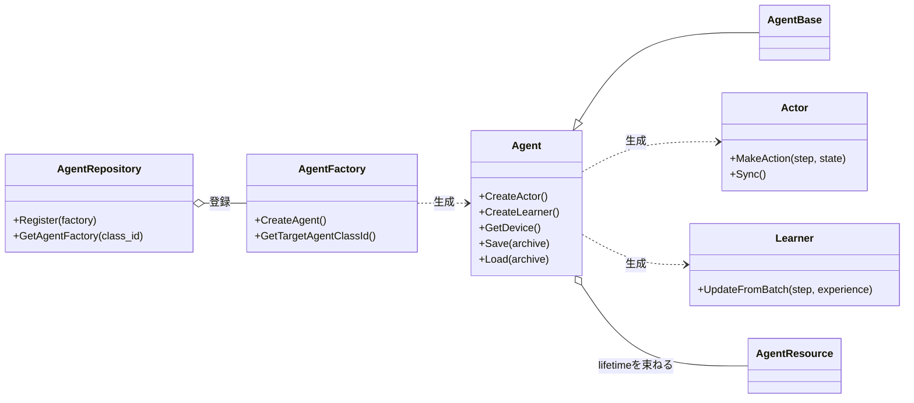
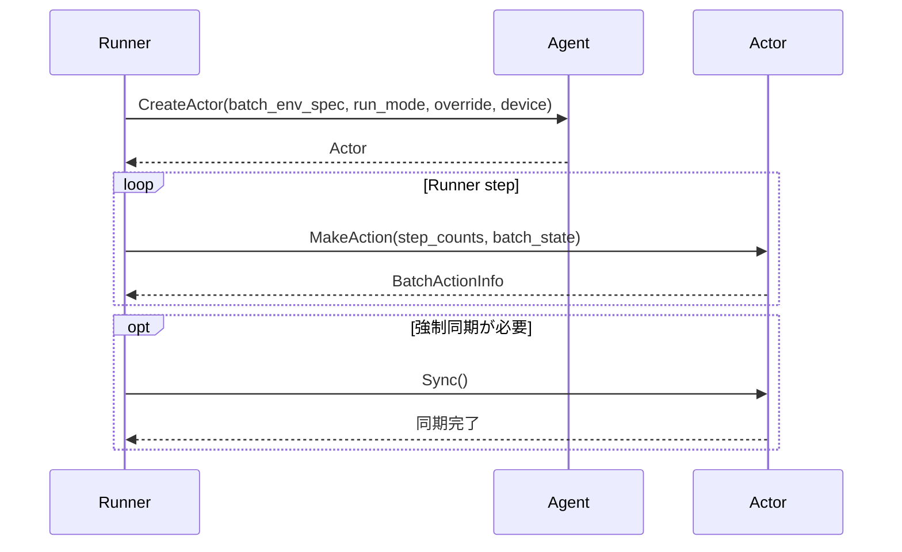
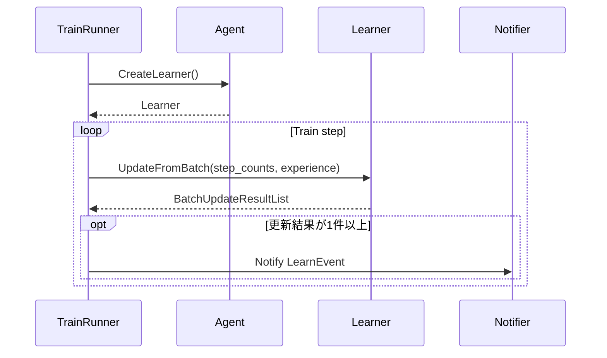

# Agentと学習

> 主たる観点: 機能単位（Agent、Actor、Learnerの共通契約。処理工程を時系列で併記）

## 1. はじめに

### 1.1 目的

本書は、ANETの各Agent実装が従う`Agent`、`Actor`、`Learner`の共通契約と所有権を説明する。
具象アルゴリズムに依存せず、Runから行動選択と学習更新を利用する境界、新しいAgentを追加する際の拡張点を明確にする。

### 1.2 対象読者

- Agent実装を追加・変更する開発者
- Actor生成、学習更新、model同期の共通フローを確認する開発者
- Network、Optimizer、ReplayBufferなどの所有経路を確認するレビュー担当者

### 1.3 記載範囲

現行のAgent共通interface、`AgentBase`、factory、repository、登録済みAgentを扱う。
DQN固有の構成と学習方式は[DQN系Agent](200_dqn_agents.jp.md)、ReplayBuffer内部は[ReplayBuffer](150_replay_buffer.jp.md)、Network内部は[ニューラルネットワーク](130_neural_networks.jp.md)を参照する。
将来設計や未実装案は規範仕様に含めない。

## 2. 基本概念と外部contract

### 2.1 Agent、Actor、Learner

- `Agent`はRunから利用する入口であり、ActorとLearnerを生成する。device取得、保存・読込、可視化用functionの公開境界でもある。
- `Actor`は`StepCounts`と`BatchState`から`BatchActionInfo`を生成する。`Sync()`はActor固有のsourceから推論Resourceを強制同期する。
- 同一Actor instanceの`MakeAction()`と`Sync()`は並行呼出ししない。必要な直列化はActorを利用するRunner側が守る。
- `Agent::CreateActor()`の`clone_model_override`はoptionalであり、`std::nullopt`はmodel複製の既定を具象Agentへ委譲する。値が指定された場合の対応可否、同期source、同期時点も具象Agentの契約である。
- `Learner`は`BatchExperience`を受け取り、0件以上の`BatchUpdateResult`を`BatchUpdateResultList`として返す。1回のExperience受入れが必ずparameter更新を発生させるとは限らない。
- `AgentBase`はdevice、Envのspec、RunMode別RNG、共有mutexなど、複数Agentに共通する実行資源を保持する。

`Actor`と`Learner`は行動選択と学習更新の依存方向を分けるinterfaceである。ActorまたはPolicyからLearnerの内部状態を参照してはならない。

### 2.2 RunModeとActor生成

`RunMode`には`Train`、`Eval`、`Eval1`、`Eval2`があり、Train Runner、設定済みEval、GUIのEvalPanelなどが用途ごとにActorを生成する。`Sync()`は強制同期の共通操作だけを定義し、定期同期や共有modelの挙動を共通層で仮定しない。

### 2.3 StateとResource

Agent系の所有権は次の原則に従う。

- Network、Optimizer、ReplayBuffer、RNG、ConfigなどのResourceは、AgentをRun単位のlifetime ownerとする。
- 「Agent所有」はAgent classの直接fieldだけを意味しない。Agentが所有するLearnerやActorの配下へ配置しても、Agentのlifetime内に閉じていればよい。
- epsilon、EMA、warmup counterなどの可変Stateは、それを更新するコンポーネントが所有する。
- 特定Actorだけが使用するsnapshot NetworkはActor所有のprivate Resource、複数ActorとLearnerが参照するNetworkはAgent所有のshared Resourceとして区別する。
- Policyは推論に必要なResourceだけを参照し、Learnerへの逆依存やAgent module間の循環依存を作らない。

詳細な判断基準は[Agent実装の所有権ガイドライン](../ownership_guideline.md)を正本とする。

### 2.4 登録済みAgent

| `agent.class_id` | 位置付け | 詳細 |
|---|---|---|
| `DefaultDQNAgent` | 設定可能なDQN系Agent | [DQN系Agent](200_dqn_agents.jp.md) |
| `RainbowAgent` | Rainbow構成を持つDQN系Agent | [DQN系Agent](200_dqn_agents.jp.md) |
| `MuZeroAgent` | MuZeroの試作実装 | 現行コードを参照 |
| `ImageClsAgent` | 共通Run/Agent contract上で画像分類を学習する実装 | 現行コードを参照 |

登録は`InitRL()`で行われ、`AgentRepository`がclass IDから`AgentFactory`を解決する。

## 3. コンポーネント定義

| コンポーネント | 定義 |
|---|---|
| `AgentRepository` | process内のAgentFactory registry。class IDをfactoryへ対応付ける |
| `AgentFactory` | EnvSpec、BatchEnvSpec、device、ConfigData、seedから具象Agentを構築するinterface |
| `DefaultAgentFactory` | `agent.class_id`と`agent.device_*`を解決し、登録済みfactoryへ構築を委譲する |
| `Agent` | Actor/Learner生成、device、保存・読込を公開する共通interface |
| `AgentBase` | device、Env情報、RunMode別RNG、共有mutexを提供する基底実装 |
| `Actor` | BatchStateからBatchActionInfoを生成し、必要に応じて推論Resourceを同期するinterface |
| `ActionContext` | Observationのstack、device転送など、行動選択前の状態加工を担当する |
| `Learner` | Experienceを受け取り、0件以上の更新結果を返すinterface |
| Agent Resource | Network、Optimizer、ReplayBufferなど、具象Agentが必要に応じて構成するResource |

## 4. コードマップ

| 領域 | 主なファイル |
|---|---|
| 共通contract | [rl.hpp](../../core/anet-core/include/anet/rl.hpp) |
| Agent基盤・repository・factory | [agent.hpp](../../core/anet-core/include/anet/agent.hpp)、[agent.cpp](../../core/anet-core/src/agent.cpp) |
| DQN系 | [DQN系Agent](200_dqn_agents.jp.md) |
| ImageCls | [image_cls_agent.hpp](../../core/anet-core/include/anet/image_cls_agent.hpp)、[image_cls_agent.cpp](../../core/anet-core/src/image_cls_agent.cpp) |
| MuZero試作 | [muzero_proto_agent.hpp](../../core/anet-core/include/anet/muzero_proto_agent.hpp)、[muzero_proto_agent.cpp](../../core/anet-core/src/muzero_proto_agent.cpp) |
| 初期登録 | [init.cpp](../../core/anet-core/src/init.cpp) |

## 5. 静的構造

図は共通contractだけを表す。具象AgentはAgent自身、所有するLearner、または特定Actorの配下へResourceを配置できる。Network、Optimizer、ReplayBufferの存在や直接の保持関係は共通contractではない。

## 6. 処理フロー

### 6.1 Actor生成、行動選択、同期

Actor内部のObservation加工、Network forward、Policy、snapshot同期は具象実装の責務である。RunnerによるActor生成と同期の利用箇所は[実行基盤と設定](100_runtime_and_configuration.jp.md)、GUI Evalの同期は[アプリケーションとツール](160_applications_and_tools.jp.md)を参照する。

### 6.2 Experience受入れと更新結果

`LearnEvent`を生成するのはLearnerではなく、更新結果を受け取ったRunnerである。LearnerがReplayBufferを使うか、1回の呼出しで何回更新するかは具象実装が決める。

## 7. 設定・lifetime・エラー・性能特性

### 7.1 構築設定

- `agent.class_id`が具象AgentFactoryを選ぶ。
- `agent.device_type`はCPU/CUDA、`agent.device_index`は対象deviceを指定する。
- EnvSpec、BatchEnvSpec、device、seed、ConfigDataはfactoryから具象Agentへ渡す。
- アルゴリズム固有設定は具象AgentのConfigが読み取る。存在する値の型変換失敗は共通`ConfigData`がfail-fastし、既定値はキー欠落時だけ使う。enum、範囲、組み合わせは各具象Configまたは再利用設定型の構築時validatorが検証する。
- ActorのRunModeとmodel複製有無は、Runnerのoverrideと具象Agentの既定をAgent生成境界で解決する。

設定一覧の正本は実際のConfig classと[apps/runner/config](../../apps/runner/config)であり、本書では全キーを複製しない。

### 7.2 lifetimeと同期

- Agentは1 Run内のResource lifetimeを束ね、Run終了後まで残る暗黙のglobal状態を増やさない。
- Train Actor、configured Eval Actor、EvalPanel Actorは用途ごとに生成される。共有ResourceとActor-private Resourceを区別する。
- AgentBaseの共有mutexは具象Agentがmodel更新・同期の境界に利用できるが、mutexの存在だけで全操作が自動的にthread-safeになるわけではない。
- 同一Actorの`MakeAction()`と`Sync()`を直列化し、shutdown時はActor/Learnerを利用するworkerを停止してからAgentを破棄する。

### 7.3 保存と読込

`Agent`は`Serializable`としてarchive APIを公開するが、基底実装の`Save()`と`Load()`はno-opである。保存対応の有無、Network・Optimizer・学習Stateなどの対象、互換性は具象Agentごとに文書化する。
checkpoint対応を追加・変更するときは、保存しないStateを明示し、復元後のstep、RNG、ReplayBuffer、Actor-private Resourceの初期状態を確認する。

### 7.4 エラーと性能

- 未登録class ID、EnvSpecとのshape・Action不整合、非対応deviceや設定組合せは構築境界でfail-fastする。
- Actor推論とLearner更新は高頻度境界であり、Network forward、optimizer、ReplayBuffer、device転送などの具象処理へ計測範囲を置く。
- model cloneと同期は一貫したsnapshotを得られる一方、copy時間と追加memoryを伴う。共有か複製かをRunModeごとに実測する。

## 8. テストと拡張時の確認事項

共通のfactory登録とRunner連携は[init_test.cpp](../../core/anet-core/src/init_test.cpp)と[trainer_test.cpp](../../core/anet-core/src/trainer_test.cpp)、アルゴリズム内部は各具象Agentのtestで確認する。

Agentを追加・変更する場合は、少なくとも次を確認する。

1. factoryを一意なclass IDで`InitRL()`へ登録する。
2. EnvSpec/BatchEnvSpecとのshape・action数の整合を構築時に検証する。
3. Trainと各Eval用途について、Actorの共有・複製・`Sync()`契約を定義する。
4. `UpdateFromBatch()`が更新なしを空listで表し、1件以上の結果を正しい順序で返す。
5. ActorまたはPolicyからLearnerへの逆依存を作らない。
6. StateとResourceの所有者を[Agent実装の所有権ガイドライン](../ownership_guideline.md)に合わせる。
7. 保存対応の有無、保存対象、非保存State、互換性を明示してtestする。
8. metric、可視化、error、性能計測を共通interfaceへ無理に混在させず、既存のProvider・Observer・profile境界へ接続する。

## 9. 関連文書

- [フレームワーク全体概要](010_framework_overview.jp.md)
- [実行基盤と設定](100_runtime_and_configuration.jp.md)
- [環境](120_environments.jp.md)
- [ニューラルネットワーク](130_neural_networks.jp.md)
- [可観測性](140_observability.jp.md)
- [ReplayBuffer](150_replay_buffer.jp.md)
- [アプリケーションとツール](160_applications_and_tools.jp.md)
- [DQN系Agent](200_dqn_agents.jp.md)
- [Agent実装の所有権ガイドライン](../ownership_guideline.md)
- [用語集](../../CONTEXT.md)
- [ADR一覧](../adr/)
