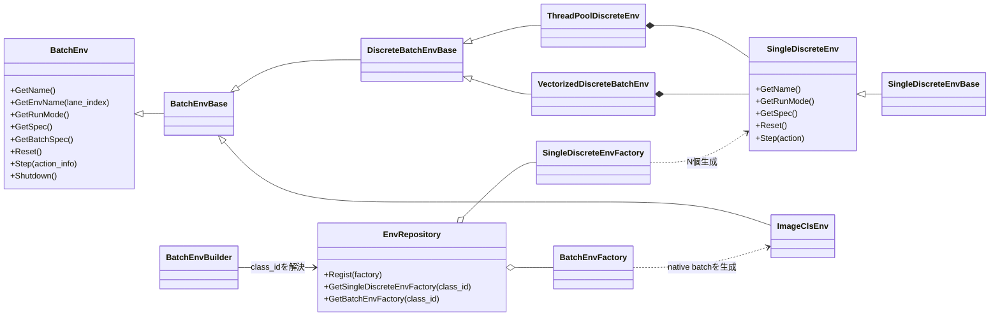
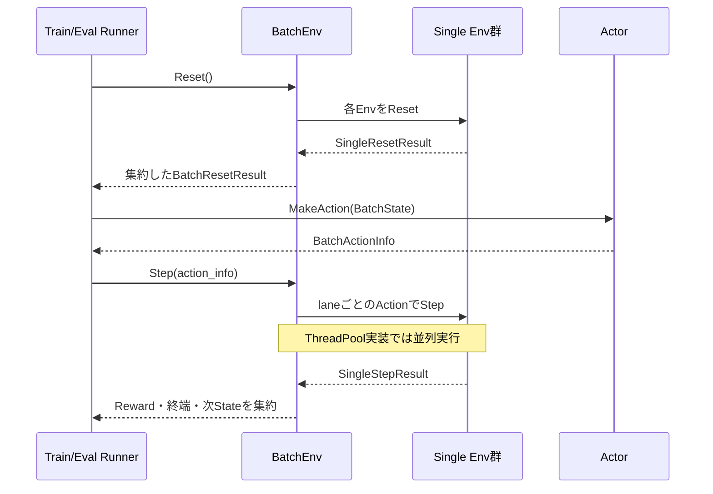

<!-- translated-from: 120_environments.jp.md blob:5a3b3596c5b599ce7ed5460781ce36438c8c9c7e date:2026-09-19 progress:done -->
# Environments

> Primary perspective: function (Env, with internal processing stages in chronological order)

## 1. Introduction

### 1.1 Purpose

This document explains ANET's shared Env contracts, the mechanism for executing single Envs in batches, and the physical layout of concrete Envs.
It clarifies how Runner and Agent can use the same State, Action, Reset, and Step flow without depending on environment-specific implementations.

### 1.2 Audience

- Developers adding or modifying Envs
- Developers checking Observation, Action, Reward, and episode-termination contracts
- Reviewers checking parallel Env execution and seed/device configuration

### 1.3 Scope

This document covers current `SingleDiscreteEnv`, `BatchEnv`, batch wrappers, native batch Envs, factories/repositories, and registered Envs.

## 2. Basic Concepts and External Contracts

### 2.1 EnvSpec

`EnvSpec` is the shared specification connecting Env and Agent.

- `StateSpec`: keys, shapes, dtypes, and ranges of the TensorDict forming an Observation
- `ActionSpec`: discrete Action labels or continuous Action dimensions
- `reward_range`: expected range of Rewards returned by Env
- `info`: additional Env-specific metadata

Standard Observation keys are `vector`, `grid`, and `action_mask`. `action_mask` is legal-action metadata and is treated separately from ordinary Network inputs.

`BatchEnvSpec` contains `num_envs`, `num_threads`, and `episode_scope`. With `episode_scope=PER_LANE`, each lane is one episode group; with `SHARED`, the entire batch is one episode group. JSON uses `per_lane` / `shared`.

### 2.2 Reset and Step

- Env fixes `RunMode` at creation and exposes it through `GetRunMode()`.
- `Reset()` starts an episode and returns its initial State.
- `Step(Action)` applies an Action and returns the next State, Reward, and termination information.
- Reset sets `episode_start` to true for all episode groups. Step keeps `done`, `truncated`, and `continue_state.episode_start` consistent within each group, satisfying `continue_state.episode_start == (done || truncated)` and `n_episode_end == number of completed groups`. `done && truncated` is allowed.
- Train/Eval-specific randomness, augmentation, and termination are separated by the creation-time `RunMode`. There is no path to pass a different mode per call.
- Some wrapper BatchEnvs still reuse result buffers; callers retaining results across later Steps must check each implementation's contract. Native ImageCls returns fresh Tensors on every Reset/Step and transfers ownership to the caller.

### 2.3 Single and Batch

`SingleDiscreteEnv` represents one environment with one discrete Action.
`BatchEnv` groups multiple environments for Runner.

Ordinary concrete Envs inherit `SingleDiscreteEnvBase`; `BatchEnvBuilder` batches them using one of these:

- `VectorizedDiscreteBatchEnv`: executes multiple Envs sequentially on the calling thread.
- `ThreadPoolDiscreteEnv`: executes multiple Envs in parallel through a thread pool.

ImageCls is a native batch Env directly inheriting `BatchEnvBase`. `ImageDataSource` constructs fixed-B Tensors from a Dataset without creating N single Envs or using wrapper collation. Train uses `PER_LANE`; Eval uses `SHARED`. At an eval-window boundary, it sets every lane's `done` and `continue_state.episode_start` and returns `n_episode_end=1`.

ImageCls configuration requires standard Train/Eval Sources as a pair. Train uses `ImageClsEnv.train.dataset_key` and `ImageClsEnv.train.augment.*`; Eval uses `ImageClsEnv.eval.dataset_key` and `ImageClsEnv.eval.eval_window.mode` / `eval_window.rotating_size`. Untagged Eval uses standard Eval configuration; configured Eval overlays only required fields through `run.eval.[tag].env.eval.*`. Factory validates both manifests during Env construction, but image decoding and cache preparation are deferred until the selected Source is used.

### 2.4 Env Names

`SingleDiscreteEnv` and `BatchEnv` are interfaces without constructors or state, exposing pure virtual name accessors. `SingleDiscreteEnvBase` and `BatchEnvBase` hold immutable, human-facing `name` values and implement the accessors as `final override`. `BatchEnvBase::GetName()` returns the batch name; `GetEnvName(lane_index)` returns `<name>[0..N-1]` strings generated once at construction. Concrete Envs inherit the corresponding Base rather than implementing name accessors themselves.

A name is an opaque display string, not a substitute for Env class ID, RunMode, config prefix, seed, RNG, DatasetKey, or metrics tag. Env does not parse names or change Reset, Step, Reward, or termination behavior based on them. Empty names, nonpositive lane counts, and out-of-range lane indices always fail fast through `ANET_CHECK_MSG`.

Both Bases also hold protected `anet::log::Logger log`, constructing the prefix `<name>: ` once when the name is established. Active text logging in concrete Envs uses `log.info()`, `log.verbose()`, `log.warn()`, and `log.error()` instead of concatenating `GetName()` on every line. Debug logging uses `ANET_LOG_DEBUG_PREFIXED`, preserving the guards and build-time elimination behavior of ordinary `ANET_LOG_DEBUG`.

## 3. Component Definitions

| Component | Definition |
|---|---|
| `SingleDiscreteEnv` | Shared interface for one discrete-Action Env |
| `SingleDiscreteEnvBase` | Base holding a single Env's name and implementing shared name accessors |
| `SingleDiscreteEnvFactory` | Creates concrete single Envs from config, device, a completed lane name, and seed |
| `BatchEnv` | Exposes batched Reset/Step, specs, device, and shutdown |
| `BatchEnvBase` | Base holding BatchEnv and all lane names and implementing shared name accessors |
| `DiscreteBatchEnvBase` | Base providing spec validation, aggregation, and common metrics for multiple single Envs |
| `VectorizedDiscreteBatchEnv` | Batch implementation driving single Envs on one thread |
| `ThreadPoolDiscreteEnv` | Batch implementation driving single Envs through a thread pool |
| `BatchEnvFactory` | Per-Env-class factory interface creating native batch Envs |
| `EnvRepository` | Process registry holding either a single factory or a batch factory for each class ID |
| `BatchEnvBuilder` | Resolves factories through the repository and either creates native batches directly or batches single Envs with wrappers |
| `ImageDatasetManager` | ImageCls-specific singleton sharing DatasetKey, manifest, and pre-augmentation cache within the process |
| Env View | Optional View implementation displaying Env-specific State in Runner GUI |

## 4. Code Map

### 4.1 Shared Infrastructure

| Area | Main files |
|---|---|
| State/Action/Env interfaces | [rl.hpp](../../core/anet-core/include/anet/rl.hpp), [rl.cpp](../../core/anet-core/src/rl.cpp) |
| Batch wrappers/repository | [env.hpp](../../core/anet-core/include/anet/env.hpp), [env.cpp](../../core/anet-core/src/env.cpp) |
| View interfaces/repository and AUI layout base Frame (`AuiLayoutFrame`) | [gui.hpp](../../core/anet-core/include/anet/gui.hpp), [gui.cpp](../../core/anet-core/src/gui.cpp) |

### 4.2 Concrete Envs

| Env | Implementation | Main Observation characteristics |
|---|---|---|
| CartPole | [core/envs/cartpole2](../../core/envs/cartpole2) | Vector |
| LunarLander | [core/envs/lunarlander1](../../core/envs/lunarlander1) | Vector, Box2D physical state |
| DropMerge | [core/envs/dropmerge1](../../core/envs/dropmerge1) | Grid and vector, Box2D physical state |
| GridMaze | [core/envs/gridmaze1](../../core/envs/gridmaze1) | Primarily vector-based maze state |
| ImageCls | [core/envs/imagecls1](../../core/envs/imagecls1) | Image grid and classification target |
| Atari | [core/envs/atari1](../../core/envs/atari1) | Single-frame uint8 grid from ALE |

Each Env directory groups the Env implementation, factory, and optional View and tests by function.

## 5. Static Structure

Shared infrastructure handles batch execution of single Envs. ImageCls, where batch generation itself is domain processing, is implemented as a native `BatchEnv`.

## 6. Processing Flows

### 6.1 Reset and Step

Batch-wrapper and Runner contracts determine when completed episode groups are reset and how `episode_start` is handled. `EpisodeStatsAccumulator` finalizes episode return and episode_steps together as `CompletedEpisodeResult`. Return is per lane for `PER_LANE`, or the sum of rewards across all lanes and steps for `SHARED`. episode_steps counts `Step()` calls including the terminal one; it is not multiplied by lane count even for `SHARED`. Configured Eval's `EvalSessionEnv` uses dynamic grants to adopt exactly N episodes and reuses the preceding `continue_state` as the next session's Reset result only when all groups are fresh. Concrete Envs focus on state transitions and Reward calculation within one episode.

### 6.2 Construction

1. `EnvRepository` resolves a concrete single or batch factory from `env.class_id`.
2. The caller supplies BatchEnv name, RunMode, and config prefix; `BatchEnvBuilder` establishes num_envs, device, seed, and worker settings.
3. A batch factory directly creates a native `BatchEnv`. For a single factory, the wrapper forms `<name>[lane_index]` and creates one single Env per lane.
4. The single path stores Envs in a vectorized or thread-pool wrapper according to worker mode. Native ImageCls applies the same worker settings to Source sample processing, performing decode/cache lookup through augmentation in one work item.
5. Runner construction passes EnvSpec and BatchEnvSpec to Agent.

## 7. Configuration, Lifetimes, Errors, and Performance

### 7.1 Shared Settings

| Key | Meaning |
|---|---|
| `env.class_id` | Concrete Env factory class ID |
| `env.worker_type` | Selects `AUTO`, single-thread, or thread-pool |
| `env.worker_threads` | Thread-pool worker count. Negative values select predefined automatic resolution modes |
| `env.device_type` | CPU/CUDA device type used by Env |
| `env.device_index` | CUDA device index; negative means current device |
| `run.train.num_envs` | Main Train Env batch size |

Each factory reads Env-specific settings from the same ConfigData. Unknown class IDs, invalid worker settings, and inconsistent specs fail rather than being silently corrected.

### 7.2 Lifetimes and Shutdown

- Wrapper BatchEnvs own their single Envs and pools. Native ImageCls owns an Env-local Source and sample worker pool.
- Runner shutdown stops workers through `BatchEnv::Shutdown()`.
- Mutable Env state and RNGs are isolated per Env instance. Only ImageCls immutable Dataset/manifest/cache data is shared process-wide by DatasetKey.
- Treat EnvSpec as the post-construction connection contract; do not change shapes or Action counts during a Run.

### 7.3 Performance

- With small `num_envs` or lightweight Env Steps, thread-pool synchronization costs may outweigh benefits.
- Measure parallelism benefits when each lane performs expensive work such as Box2D or image decoding.
- Env Reset/Step are major profiling boundaries; compare worker counts together with `exp_step_per_sec`.
- Different Env and Agent devices incur transfer costs. Check supported devices in both configuration and each Env's implementation.

## 8. Tests and Extension Checks

When adding or modifying an Env, check the following:

1. `EnvSpec` shapes, dtypes, Actions, and Reward ranges match actual data.
2. The reproducibility contract for identical seeds and settings is explicit.
3. State flags are validated immediately after Reset, on ordinary Steps, and for terminated/truncated states.
4. Batch wrappers aggregate correctly for both B=1 and multiple lanes.
5. Semantics remain identical between `VectorizedDiscreteBatchEnv` and `ThreadPoolDiscreteEnv`.
6. An added View's Env class ID matches its `ViewRepository` registration.
7. Frequently called Reset/Step operations have meaningful profiling ranges.

These Envs have dedicated tests:

- [LunarLanderEnv_test.cpp](../../core/envs/lunarlander1/src/LunarLanderEnv_test.cpp)
- [ImageClsEnv_test.cpp](../../core/envs/imagecls1/src/ImageClsEnv_test.cpp)
- [AtariEnv_test.cpp](../../core/envs/atari1/src/AtariEnv_test.cpp)

Concrete single-Env tests also include paths through `VectorizedDiscreteBatchEnv`. ImageCls tests directly validate native batches, Dataset catalogs/caches, eval windows, and worker modes. When changing an Env or wrapper, add regression tests explicitly selecting the required worker modes.

## 9. Related Documents

- [Framework Overview](010_framework_overview.en.md)
- [Runtime Infrastructure and Configuration](100_runtime_and_configuration.en.md)
- [Agents and Learning](110_agents_and_learning.en.md)
- [ReplayBuffer](150_replay_buffer.en.md)
- [Applications and Tools](160_applications_and_tools.en.md)
- [Glossary](../../CONTEXT.md)
- [ImageCls Batch Input PRD](../memo/done/034_imagecls_batch_input_10prd.md)
- [ImageCls Batch Env Seam ADR](../adr/0009-imagecls-batch-env-seam.md)
