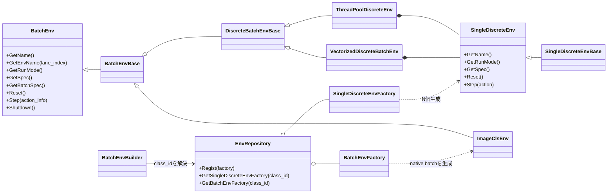
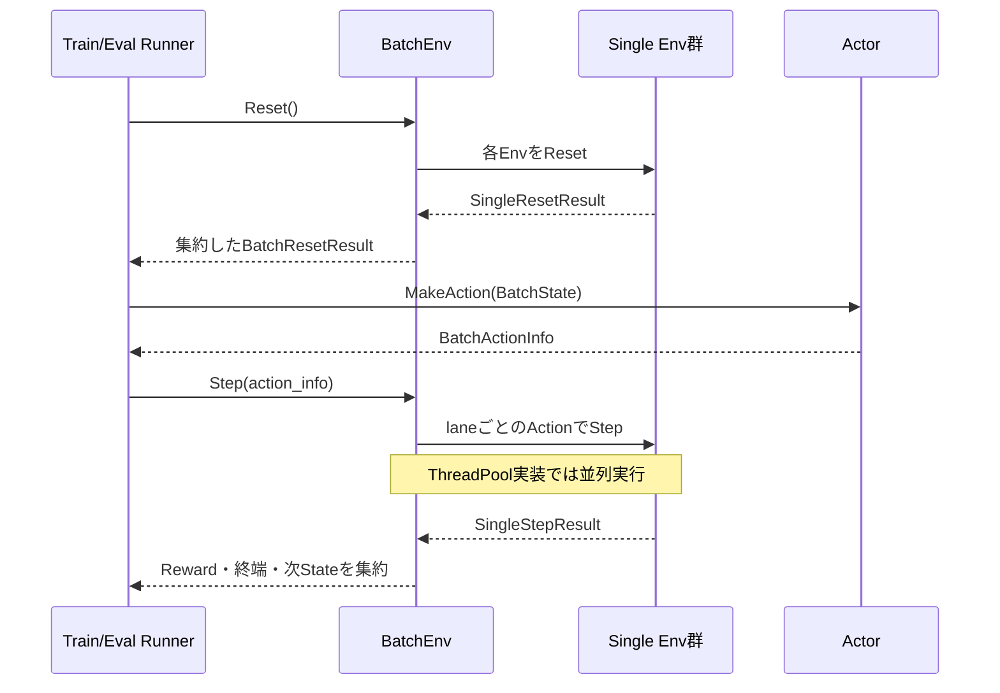

# 環境

> 主たる観点: 機能単位（Env。内部の処理工程を時系列で併記）

## 1. はじめに

### 1.1 目的

本書は、ANETにおけるEnvの共通contract、single Envをbatch実行する仕組み、具象Envの物理配置を説明する。
RunnerとAgentが環境固有実装へ依存せず、同じState、Action、Reset、Stepの流れで実行できる理由を明確にする。

### 1.2 対象読者

- Envを追加・変更する開発者
- Observation、Action、Reward、episode終端のcontractを確認する開発者
- 並列Env実行とseed/device設定を確認するレビュー担当者

### 1.3 記載範囲

現行の`SingleDiscreteEnv`、`BatchEnv`、batch wrapper、native batch Env、factory/repository、登録済みEnvを扱う。

## 2. 基本概念と外部contract

### 2.1 EnvSpec

`EnvSpec`はEnvとAgentを接続する共通仕様である。

- `StateSpec`: Observationを構成するTensorDictのキー、shape、dtype、範囲
- `ActionSpec`: 離散Actionのラベル、または連続Actionの各次元
- `reward_range`: Envが返すRewardの想定範囲
- `info`: Env固有の追加メタデータ

標準Observationキーは`vector`、`grid`、`action_mask`である。`action_mask`は合法手を表すメタデータであり、通常のNetwork入力とは分けて扱う。

`BatchEnvSpec`は`num_envs`と`num_threads`を持ち、batch側の並列度をAgentへ伝える。

### 2.2 ResetとStep

- Envは生成時に`RunMode`を固定し、`GetRunMode()`で公開する。
- `Reset()`はepisodeを開始し、初期Stateを返す。
- `Step(Action)`はActionを適用し、次State、Reward、終端情報を返す。
- Train/Eval固有の乱数、augmentation、終端は生成時の`RunMode`で分ける。呼出し時に異なるmodeを渡す経路はない。
- wrapper系BatchEnvには一部Result buffer再利用が残るため、呼び出し側が後続Stepを越えて保持する場合は各実装契約を確認する。native ImageClsはReset/Stepごとにfresh Tensorを返し、呼出し側へ所有権を渡す。

### 2.3 SingleとBatch

`SingleDiscreteEnv`は1環境・1離散Actionを表す。
`BatchEnv`は複数環境をまとめてRunnerへ公開する。

通常の具象Envは`SingleDiscreteEnvBase`を継承し、`BatchEnvBuilder`が次のいずれかでbatch化する。

- `VectorizedDiscreteBatchEnv`: 呼び出しthread上で複数Envを順に実行する。
- `ThreadPoolDiscreteEnv`: thread poolを使って複数Envを並列実行する。

ImageClsは`BatchEnvBase`を直接継承するnative batch Envである。`ImageDataSource`がDatasetから固定BのTensorを生成し、single EnvのN個生成やwrapper collateを経由しない。

ImageCls設定は標準Train/Eval Sourceを必須の組として持つ。`ImageClsEnv.train.dataset_key`と`ImageClsEnv.train.augment.*`がTrain側、`ImageClsEnv.eval.dataset_key`と`ImageClsEnv.eval.eval_window.mode` / `eval_window.rotating_size`がEval側である。tagなしEvalは標準Eval設定を使い、configured Evalは`train.eval.[tag].env.eval.*`で必要な項目だけをoverlayする。Factoryは両manifestをEnv構築時に検証するが、画像decodeとcache準備は選択Sourceの使用時まで遅延する。

### 2.4 Env name

`SingleDiscreteEnv`と`BatchEnv`はconstructorや状態を持たないinterfaceであり、name accessorをpure virtualで公開する。`SingleDiscreteEnvBase`と`BatchEnvBase`が人間向けのimmutableな`name`を保持し、accessorを`final override`する。`BatchEnvBase::GetName()`はbatch名を返し、`GetEnvName(lane_index)`は構築時に一度だけ生成した`<name>[0..N-1]`を返す。具象Envは対応するBaseを継承し、name accessorを独自実装しない。

nameは不透明な表示文字列であり、Env class ID、RunMode、config prefix、seed、RNG、DatasetKey、metrics tagの代替ではない。Envはnameを解析せず、nameの違いでReset、Step、Reward、終端を分岐しない。空name、非正のlane数、範囲外lane indexは`ANET_CHECK_MSG`で常時fail-fastする。

両Baseはprotectedな`anet::log::Logger log`も保持し、name確定時にprefixを`<name>: `として一度だけ構築する。具象Envのactiveなtext logは`log.info()`、`log.verbose()`、`log.warn()`、`log.error()`を使用し、`GetName()`を各行で連結しない。debug logは`ANET_LOG_DEBUG_PREFIXED`を使用し、通常の`ANET_LOG_DEBUG`と同じguard・ビルド消去特性を維持する。

## 3. コンポーネント定義

| コンポーネント | 定義 |
|---|---|
| `SingleDiscreteEnv` | 1つの離散Action Envの共通interface |
| `SingleDiscreteEnvBase` | single Envのnameを保持し、interfaceのname accessorを共通実装する基底 |
| `SingleDiscreteEnvFactory` | config、device、完成済みlane name、seedから具象single Envを生成する |
| `BatchEnv` | batch化されたReset/Stepとspec、device、shutdownを公開する |
| `BatchEnvBase` | BatchEnv nameと全lane nameを保持し、interfaceのname accessorを共通実装する基底 |
| `DiscreteBatchEnvBase` | 複数single Envのspec検証、集約、共通metricsを提供する基底 |
| `VectorizedDiscreteBatchEnv` | single-threadでsingle Env群を駆動するbatch実装 |
| `ThreadPoolDiscreteEnv` | thread poolでsingle Env群を駆動するbatch実装 |
| `BatchEnvFactory` | native batch Envを生成するEnvクラス単位のfactory interface |
| `EnvRepository` | class IDごとにsingle factoryまたはbatch factoryのどちらか一方を保持するprocess registry |
| `BatchEnvBuilder` | repositoryからfactoryを解決し、native batchを直接生成するかsingle Env群をwrapperでbatch化する |
| `ImageDatasetManager` | DatasetKey、manifest、pre-augment cacheをprocess内で共有するImageCls専用singleton |
| Env View | Env固有のStateをRunner GUIへ表示する任意のView実装 |

## 4. コードマップ

### 4.1 共通基盤

| 領域 | 主なファイル |
|---|---|
| State/Action/Env interface | [rl.hpp](../../core/anet-core/include/anet/rl.hpp)、[rl.cpp](../../core/anet-core/src/rl.cpp) |
| batch wrapper・repository | [env.hpp](../../core/anet-core/include/anet/env.hpp)、[env.cpp](../../core/anet-core/src/env.cpp) |
| View interface・repository | [gui.hpp](../../core/anet-core/include/anet/gui.hpp)、[gui.cpp](../../core/anet-core/src/gui.cpp) |

### 4.2 具象Env

| Env | 実装場所 | Observationの主な性質 |
|---|---|---|
| CartPole | [core/envs/cartpole2](../../core/envs/cartpole2) | vector |
| LunarLander | [core/envs/lunarlander1](../../core/envs/lunarlander1) | vector、Box2D物理状態 |
| DropMerge | [core/envs/dropmerge1](../../core/envs/dropmerge1) | gridとvector、Box2D物理状態 |
| GridMaze | [core/envs/gridmaze1](../../core/envs/gridmaze1) | vector中心の迷路状態 |
| ImageCls | [core/envs/imagecls1](../../core/envs/imagecls1) | 画像gridと分類target |

各Env directoryは、Env本体、factory、必要に応じてViewとtestを機能グループとしてまとめる。

## 5. 静的構造

single Envのbatch実行方法は共通基盤が担当する。batch生成自体がドメイン処理であるImageClsはnative `BatchEnv`として実装する。

## 6. 処理フロー

### 6.1 ResetとStep

episode終了laneのReset時期や`episode_start`の扱いはbatch wrapperとRunnerのcontractで決まる。具象Envは、自身の1 episode内の状態遷移とReward計算に集中する。

### 6.2 構築

1. `env.class_id`から`EnvRepository`がsingle/batchいずれかの具象factoryを解決する。
2. 呼出側がBatchEnv name、RunMode、config prefixを渡し、`BatchEnvBuilder`がnum_envs、device、seed、worker設定を確定する。
3. batch factoryならnative `BatchEnv`を直接生成する。single factoryならwrapperが`<name>[lane_index]`を完成させ、laneごとにsingle Envを生成する。
4. single経路はworker方式に応じてvectorizedまたはthread-pool wrapperへ格納する。native ImageClsでは同じworker設定をSource内sample処理へ適用し、decode/cache lookupからaugmentationまでを同一workで実行する。
5. Runner構築時にEnvSpecとBatchEnvSpecをAgentへ渡す。

## 7. 設定・lifetime・エラー・性能特性

### 7.1 共通設定

| キー | 意味 |
|---|---|
| `env.class_id` | 具象Env factoryのclass ID |
| `env.worker_type` | `AUTO`、single-thread、thread-poolの選択 |
| `env.worker_threads` | thread-poolのworker数。負値は定義済みの自動解決方式 |
| `env.device_type` | Envが使用するCPU/CUDA device種別 |
| `env.device_index` | CUDA device index。負値はcurrent device |
| `train.num_envs` | 主Train Envのbatch size |

Env固有設定は各factoryが同じConfigDataから読み取る。未知のclass ID、不正なworker設定、矛盾したspecは暗黙に補正せず失敗させる。

### 7.2 lifetimeとshutdown

- wrapper BatchEnvはsingle Env群とpoolを所有する。native ImageClsはEnv-local Sourceとsample worker poolを所有する。
- Runner終了時は`BatchEnv::Shutdown()`を経由してworkerを停止する。
- Envのmutable stateとRNGはEnv instanceごとに分離する。ImageClsのimmutable Dataset/manifest/cacheだけはDatasetKey単位でprocess共有する。
- EnvSpecは構築後の接続contractとして扱い、Run中にshapeやAction数を変更しない。

### 7.3 性能

- `num_envs`が小さい、またはEnv Stepが軽量な場合、thread-poolの同期costが利益を上回ることがある。
- Box2Dや画像decodeのようにlaneごとの処理が重い場合、並列化の効果を実測する。
- EnvのReset/Stepは主要なprofiling境界であり、worker数と`exp_step_per_sec`を併せて比較する。
- Env deviceとAgent deviceが異なる場合は転送costが発生する。Envごとの対応deviceを設定と実装の両方で確認する。

## 8. テストと拡張時の確認事項

Envを追加・変更する場合は次を確認する。

1. `EnvSpec`のshape、dtype、Action、Reward範囲が実データと一致する。
2. 同じseedと設定に対する再現性contractを明確にする。
3. Reset直後、通常Step、terminated、truncatedのState flagを検証する。
4. B=1と複数laneの両方でbatch wrapperが正しく集約する。
5. `VectorizedDiscreteBatchEnv`と`ThreadPoolDiscreteEnv`で意味が変わらない。
6. Viewを追加する場合はEnv class IDと`ViewRepository`登録を一致させる。
7. 頻繁に呼ばれるReset/Stepへ意味のあるprofile rangeを置く。

専用testがあるEnvは次のとおりである。

- [LunarLanderEnv_test.cpp](../../core/envs/lunarlander1/src/LunarLanderEnv_test.cpp)
- [ImageClsEnv_test.cpp](../../core/envs/imagecls1/src/ImageClsEnv_test.cpp)

single具象Env testは`VectorizedDiscreteBatchEnv`を通る経路も含む。ImageCls testはnative batch、Dataset catalog/cache、eval window、worker方式を直接検証する。Envまたはwrapperを変更する場合は、必要なworker方式を明示して回帰testを追加する。

## 9. 関連文書

- [フレームワーク全体概要](010_framework_overview.jp.md)
- [実行基盤と設定](100_runtime_and_configuration.jp.md)
- [Agentと学習](110_agents_and_learning.jp.md)
- [ReplayBuffer](150_replay_buffer.jp.md)
- [アプリケーションとツール](160_applications_and_tools.jp.md)
- [用語集](../../CONTEXT.md)
- [ImageCls batch入力PRD](../memo/034_imagecls_batch_input_10prd.md)
- [ImageCls batch Env seam ADR](../adr/0009-imagecls-batch-env-seam.md)
