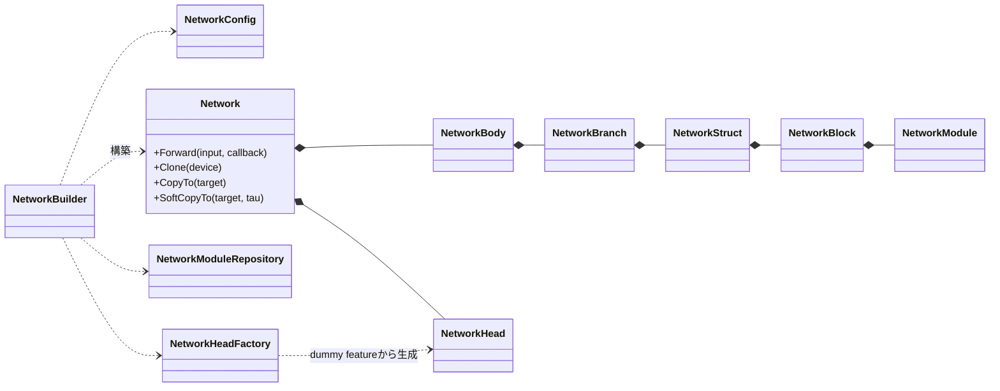
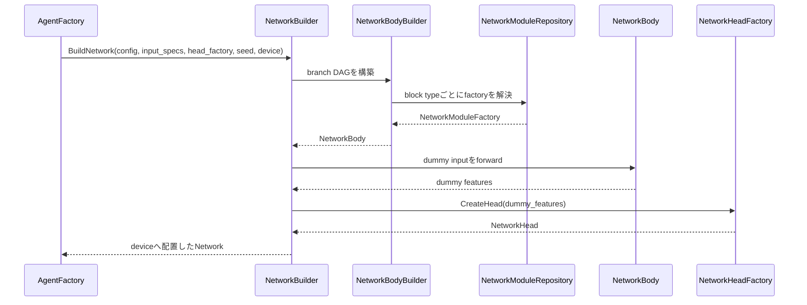
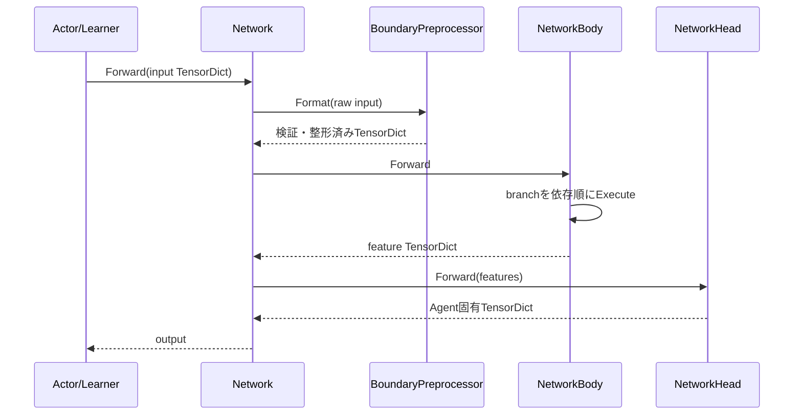

<!-- translated-from: 130_neural_networks.jp.md blob:eaee7b1aefe9c9e0b9a93ef8d1fa6e8f006d32e1 date:2026-09-19 progress:done -->
# Neural Networks

> Primary perspective: function (Networks and modules, with internal processing stages in chronological order)

## 1. Introduction

### 1.1 Purpose

This document explains ANET's neural network infrastructure, which constructs Networks from configuration and passes TensorDicts through Network Bodies and Heads.
It connects module layout, construction-time validation, forward execution, clone/sync, and visualization boundaries into one view.

### 1.2 Audience

- Developers adding or modifying Network structures and modules
- Developers checking boundaries between Agent-specific Heads and shared Backbones
- Reviewers of shapes, dtypes, devices, initialization, and performance

### 1.3 Scope

This document covers current `NetworkConfig`, `NetworkBuilder`, Body/Branch/Block/Module, Heads, forward execution, and visualization.
See [Agents and Learning](110_agents_and_learning.en.md) for shared Agent ownership and [DQN Agents](200_dqn_agents.en.md) for DQN-specific losses and Network structures.

## 2. Basic Concepts and External Contracts

### 2.1 TensorDict and TensorSpec

Network inputs and outputs use `TensorDict`, a map from string keys to Tensors.
`TensorSpecMap` specifies each input key's shape, dtype, and value range. It starts with Observation specs inherited from EnvSpec; Agent-owned additional input specs can be added to the same map before Network construction. For DefaultDQN IQN, Agent adds `taus`, which is not an Env Observation, and Actor/Learner injects it into a copy of the input TensorDict immediately before forward.

At the Network Body entrance, `NetworkBoundaryPreprocessor`:

- Checks required input keys and their specs.
- Validates shapes including the batch dimension.
- Converts inputs not marked raw into Network input format.
- Builds the forward TensorDict without modifying the original Observation.

### 2.2 Frame-Stack Input Axis Contract

With `DefaultDQNAgent`, `use_stacker=true`, and `stack_count=S>1`, each stacked key's Network input spec becomes `[S, *original_shape]`, adding a leading stack axis to EnvSpec's `original_shape`. Both construction-time dummy inputs and real Actor/Learner inputs add a batch axis, yielding `[B, S, *original_shape]`. Keys outside `stack_keys` receive no stack axis. GraphViz input-spec displays follow this contract too.

Network configurations explicitly select modules for their intended use rather than implicitly restoring a stack axis.

| Input and use | Module structure | Network shape |
|---|---|---|
| Vector stack into MLP | `Flatten` | `[B,S,F]` to `[B,S*F]` |
| Continuous Grid stack into Conv2d | `StackMerge` | `[B,S,C,H,W]` to `[B,S*C,H,W]` |
| Vector stack into temporal Conv1d | `Permute(0,2,1)` followed by `Conv1d` | `[B,S,F]` to `[B,F,S]` |

`Reshape` is available for general shape transformations but is not required to restore the stack-axis contract.

Discrete Grids retain `[S,1,H,W]` in the raw Network spec, but `NetworkBoundaryPreprocessor` merges stack and class into channels during one-hot conversion. Branch inputs therefore remain `[B,S*C,H,W]` and connect to Conv2d without `StackMerge`. Continuous Grids do not pass through this one-hot boundary and retain `[B,S,C,H,W]` at branch inputs.

### 2.3 Body and Head

- Network Body executes the configured branch DAG and produces a feature TensorDict.
- Network Head converts features into Agent-specific outputs, such as DQN Q values, quantiles, or ImageCls class logits.
- `Network` combines Body and Head and exposes one `Forward(TensorDict)`.

This separation allows multiple Agent-specific Heads to use a shared Backbone.

### 2.4 Configuration Syntax

`NetworkConfig` primarily resolves:

- `net.block.[name].type`: reusable block definitions
- `net.body.[name].structure`: serial structures connecting blocks with `>`
- Branch bind terms, `bind_concat_dim`, raw keys, and output keys
- Per-block/per-branch config profiles

`bind` accepts comma-separated terms. Within each term, `*`-separated factors form a feature-last elementwise product. `*` has precedence over `,`; rank differences are aligned by inserting singleton dimensions immediately after the lower-rank factor's batch axis. Multiple terms concatenate along the branch's `bind_concat_dim` (default 1; negative values allowed), but concatenation along batch dimension 0 is prohibited.

The current configuration JSON and `ToJson()` schema uses `bind_terms` and `bind_concat_dim`; old `bind_keys` is outside the current contract.

```properties
net.branch.[fusion].bind = main_feature * tau_embedding
net.branch.[merged].bind = fusion, context
net.branch.[merged].bind_concat_dim = -1
```

`(raw)` may be written on a factor, but its meaning is key-global. Referencing the same key from another branch still treats it as raw throughout the Network. Structures can express output tags, input-tag references, and block repetition. See [apps/runner/config/nn.txt](../../apps/runner/config/nn.txt) and individual Run configurations for examples.

## 3. Component Definitions

| Component | Definition |
|---|---|
| `NetworkConfig` | Immutable construction information containing block catalog, branches, output keys, and config profiles |
| `NetworkBuilder` | Entry point constructing a complete Network from Config, input specs, HeadFactory, and device |
| `NetworkBodyBuilder` | Analyzes and validates branch dependencies and builds a Body with a fixed execution order |
| `NetworkBody` | Formats inputs and executes branches sequentially to produce a feature TensorDict |
| `NetworkBranch` | DAG node that multiplies bind factors, concatenates terms, feeds one NetworkStruct, and registers the result |
| `NetworkStruct` | Executes an ordered sequence of NetworkBlocks |
| `NetworkBlock` | Combines a name and one NetworkModule |
| `NetworkModule` | Polymorphic NN module taking and returning a Tensor |
| `NetworkModuleRepository` | Process registry resolving type names to NetworkModuleFactories |
| `NetworkHeadFactory` | Constructs an Agent-specific Head from dummy features |
| `NetworkHead` | Converts Body features into Agent-specific outputs |
| `Network` | Owns Body and Head and exposes forward, clone, hard/soft copy, and GraphViz |

## 4. Code Map

| Area | Main files |
|---|---|
| Public Config, Network, Builder | [nn.hpp](../../core/anet-core/include/anet/nn.hpp) |
| Body/Branch/Block/Repository | [nn_impl.hpp](../../core/anet-core/src/nn_impl.hpp), [nn_impl.cpp](../../core/anet-core/src/nn_impl.cpp) |
| Module implementations and registration | [nn_modules.cpp](../../core/anet-core/src/nn_modules.cpp) |
| Agent Heads | [nn_heads.hpp](../../core/anet-core/src/nn_heads.hpp), [nn_heads.cpp](../../core/anet-core/src/nn_heads.cpp) |
| DQN Heads | [dqn_based_heads.hpp](../../core/anet-core/src/dqn_based_heads.hpp), [dqn_based_heads.cpp](../../core/anet-core/src/dqn_based_heads.cpp) |
| Shared TensorDict operations | [common.hpp](../../core/anet-core/include/anet/common.hpp), [common.cpp](../../core/anet-core/src/common.cpp) |
| Tensor utilities | [tensor_util.hpp](../../core/anet-core/include/anet/tensor_util.hpp), [tensor_check.hpp](../../core/anet-core/include/anet/tensor_check.hpp) |
| Configuration examples | [nn.txt](../../apps/runner/config/nn.txt), [nn_cnx.txt](../../apps/runner/config/nn_cnx.txt) |
| Unit tests | [nn_test.cpp](../../core/anet-core/src/nn_test.cpp) |

### 4.1 Registered Module Categories

Current `InitNN()` registers these types in `NetworkModuleRepository`.

| Category | Example types |
|---|---|
| Shape/routing | `Flatten`, `Permute`, `Reshape`, `StackMerge`, `Dropout` |
| Activation | `ReLU`, `GELU`, `SiLU`, `Mish`, `LeakyReLU` |
| Normalization/pooling | `GroupNorm`, `LayerNorm`, `LayerNorm2d`, `BatchNorm2d`, `GAP1D`, `GAP2D`, `MaxPool2d` |
| Embedding | `CosineEmbedding`, `HybridSpatialEmbedder`, `SpatialEmbedder`, `SpatialPositionalEmbedding2D` |
| Layer | `Linear`, `Conv1d`, `Conv2d`, `ResBlock`, `CNBlock`, `TransformerEncoder` |
| Token | `ClsAppend`, `ClsExtract` |

This table follows actual `InitNN()` registrations, not Config comments.

`CosineEmbedding` uses `cos.num_basis` (default 64) to transform taus `(B,K)` into the `cos(πiτ)` basis `(B,K,n)`. Subsequent projections and activations are configured by connecting existing `Linear`, `ReLU`, `SiLU`, or similar modules.

## 5. Static Structure



Repositories manage factories, not training module instances or parameters. Actual Networks and parameters are owned as Agent-side Resources.

## 6. Processing Flows

### 6.1 Network Construction



Dummy forward determines optional input/output dimensions from actual Tensor shapes and validates Head input shapes during construction.

The `seed` is retained as Network construction information and reused by `Clone()`. Module-specific randomness is created lazily by purpose name from one `ModuleRandomSource` per Network. Spectral normalization uses only the `"spectral_norm"` stream and does not consume the global torch RNG used for parameter initialization. DefaultDQN, Rainbow, and ImageCls derive `"network"` from the Agent seed; MuZero derives `"network.rep"`, `"network.dyn"`, and `"network.pred"`.

### 6.2 Forward



Passing a `TraceCallback` enables collection of intermediate module/branch Tensors for visualization and diagnostics.

## 7. Configuration, Lifetimes, Errors, and Performance

### 7.1 Construction-Time Validation

- Unregistered module types, missing blocks, unresolvable bind keys, and cyclic branches fail during construction.
- If an input-spec key is referenced by neither any bind factor nor a direct `net.body.output` mapping, warn once per key per build. This only identifies possible omissions; it does not guarantee reachability or semantic contribution to final outputs.
- Bind products validate batch sizes across factors. Concatenating multiple terms normalizes `bind_concat_dim` using the first term's rank and explicitly validates its range, exclusion of the batch axis, and matching term batch sizes. Other broadcast/concatenation shape mismatches are libtorch errors.
- Input-spec versus actual TensorDict shape/dtype mismatches are detected at the Network boundary.
- IQN Head validates rank 3 `(B,K,D)`; IQN Dueling Head validates matching value/advantage B/K as local input contracts during dummy forward. This does not prove that `taus` contributes semantically to the final output.
- Weight initialization accepts `default`, `xavier`, `he`, `orthogonal`, `constant`, and `trunc_normal`; unknown values fail fast.
- `weight_norm.mode` for `Linear`, `Conv1d`, `Conv2d`, `ResBlock`, `CNBlock`, and `TransformerEncoder` accepts only `none`, `spectral`, and `spectral_cap`. Unknown values fail fast with the key, supplied value, and allowed values.
- `spectral` rejects zero-initialized weights at construction. For residual blocks retaining zero initialization, specify something such as `init2.mode=he`, or use `spectral_cap`.
- SN in TransformerEncoder requires `tf.use_sdpa=true`.
- Config profiles expand values in block occurrence order. Invalid profile names or interpolation settings are not silently ignored.

### 7.2 Cloning and Model Synchronization

- `Clone(device)` creates a separate Network instance with the same construction information and parameters.
- `CopyTo` performs hard updates; `SoftCopyTo` performs tau-based soft updates.
- For Networks containing SN, `SoftCopyTo` validates `tau` before changing source or target, allowing only `0 <= tau <= 0.1` or `tau=1`. After lerping buffers, it restores target u/v to unit norm. Existing tau contracts for Networks without SN are unchanged.
- Concrete Agents determine Policy/Target Network update timing and ownership.
- Eval clones provide consistent snapshots at the cost of copy time and additional memory.

### 7.3 Dtype and Device

- Networks are placed on the specified device after construction.
- AMP/BF16 use depends on both Actor/Learner execution contexts and module settings.
- Some modules, including BatchNorm and LayerNorm, support FP32 execution for numerical stability.
- Conversions such as `uint8` Observations to floating point belong to the BoundaryPreprocessor contract.

### 7.4 Spectral Normalization

SN applies only to module-owned weights, excluding Heads, embeddings, biases, normalization affine parameters, layerscale, and cls tokens. ResBlock handles `conv1`, `conv2`, and `downsample` independently; CNBlock handles `dwconv`, `pwconv1`, and `pwconv2`; TransformerEncoder handles each layer's Q, K, V, `out_proj`, `linear1`, and `linear2`.

u/v are named buffers initialized using the dedicated RNG, followed by 15 power iterations. SN computation uses FP32 with autocast OFF; u/v update only during forwards in train mode with GradMode enabled. Sigma is recomputed from weights on every forward without detaching weight gradients. Effective weights are `W / sigma` for `spectral` and `W / max(1, abs(sigma))` for `spectral_cap`.

`NetworkModule::GetSpectralNormEntries()` is empty by default; participating modules expose weight, mode, and u/v. Network assigns full layer names by walking branches/blocks. Parameter norms return raw L2, effective L2 replacing only SN-weight contributions with effective weights, maximum sigma separately for feature/readout, and an invalid-count device scalar. Without SN layers, effective L2 equals raw L2 and sigma is `NaN`.

### 7.5 Visualization and Performance

- `MakeGraphViz` outputs branches, per-factor dependency edges, blocks, shapes, and parameter information from construction metadata. Enabling branch configuration details also displays `bind_concat_dim`.
- `GetTensorDictFunction` and TraceCallback provide access to Network internals for Conv2d visualization and probes.
- Forward, attention, and major blocks are profiled; measure costs by shape/batch size when adding modules.
- Excessively fine profiling ranges introduce measurement noise; choose meaningful processing boundaries.

### 7.6 Branch Capture and Partial Forward

`Network::Forward` accepts optional `NetworkBranchCapture`, returning detached internal tensors after the ordinary branch loop but before `output_keys` conversion. Existing forwards without capture, TraceCallback, and Actor paths are unchanged.

`ForwardUpTo(input, branch_key)` uses formatted input to execute only the target branch's ancestor closure in the existing topological order, then returns that state. `ComputeDependencyClosure` centralizes closure computation. If a bind factor matches both an input-spec key and a branch name, dependency traversal stops at the input key, matching builder precedence. Unknown branches fail fast with the supplied name and `GetBranchNames()` list.

Plasticity statistics accept rank-2 `(N,D)` features and a requested metric set, compute only requested statistics from detached FP32 CPU features, and are cached by the caller. Steps without srank requests perform no SVD. Simultaneous requests for δ=0.01 / 0.05 / 0.20 share one `svdvals` and cumsum. Each result is optional, preventing uncomputed fields from being read as valid values. Unqualified srank means δ=0.01.

`ComputeParameterNormSplit(feature_key)` uses the same dependency closure, grouping trainable parameters in closure branches as feature and parameters in other branches and Head as readout. It returns each group's raw L2, effective L2, and maximum sigma as FP32 device scalars. It uses neither forward nor RNG and excludes parameters with `requires_grad=false` from norms.

## 8. Tests and Extension Checks

When changing Networks, check the following:

1. Test valid construction from Config and fail-fast behavior for invalid settings.
2. Ensure shapes/dtypes/devices match between dummy and real forwards.
3. Check parameters and outputs after clone, hard copy, and soft copy.
4. Verify Dropout, Normalization, and DropPath semantics in train/eval modes.
5. Check AMP/BF16 and FP32 paths through corresponding Agent tests.
6. Register new module types in `InitNN()` and match their names to configuration examples.
7. Preserve GraphViz/Trace and expose visualization support where needed.
8. When extending bind, validate parsing, dependency order, cycles, runtime shapes, ToJson, GraphViz, and unused-input warnings under the same term/factor contract.

Main unit tests are in [nn_test.cpp](../../core/anet-core/src/nn_test.cpp); DQN/ImageCls tests also validate Agent integration.

## 9. Related Documents

- [Framework Overview](010_framework_overview.en.md)
- [Agents and Learning](110_agents_and_learning.en.md)
- [Observability](140_observability.en.md)
- [ReplayBuffer](150_replay_buffer.en.md)
- [DQN Agents](200_dqn_agents.en.md)
- [Configuration Example: nn.txt](../../apps/runner/config/nn.txt)
- [TensorDict Unification ADR](../adr/0002-tensordict-function-unify.md)
- [SDPA ADR](../adr/0004-sdpa-attention-via-aten.md)
- [Dropout Configuration ADR](../adr/0007-nn-dropout-config-semantics.md)
- [WeightInit ADR](../adr/0008-weight-init-mode-string.md)
- [IQN Bind-Product DAG ADR](../adr/0018-iqn-via-bind-product-dag.md)
