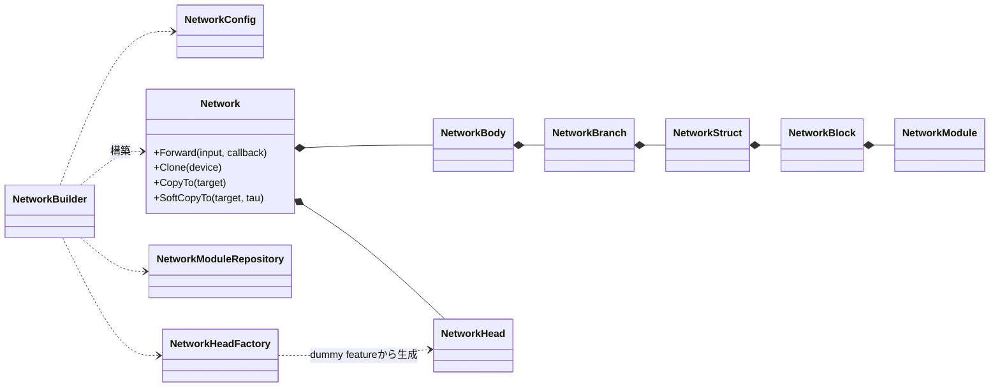
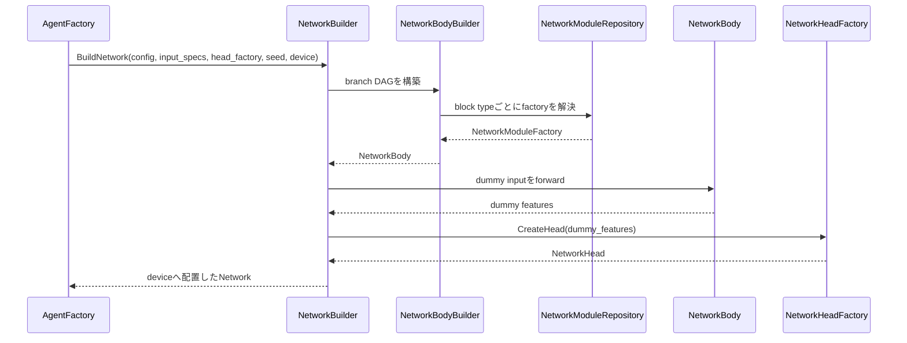
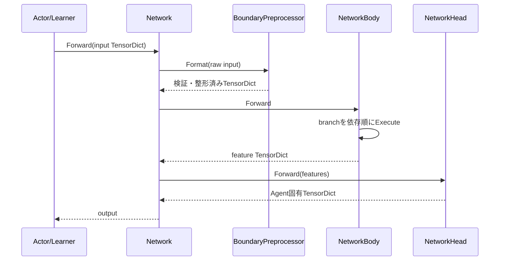

# ニューラルネットワーク

> 主たる観点: 機能単位（Networkとmodule。内部の処理工程を時系列で併記）

## 1. はじめに

### 1.1 目的

本書は、設定からNetworkを構築し、TensorDictをNetwork BodyとHeadへ流すANETのニューラルネットワーク基盤を説明する。
moduleの物理配置、構築時の検証、forward、clone/sync、可視化の境界を一続きで理解できることを目的とする。

### 1.2 対象読者

- Network構成やmoduleを追加・変更する開発者
- Agent固有Headと共通Backboneの境界を確認する開発者
- shape、dtype、device、初期化、性能特性をレビューする担当者

### 1.3 記載範囲

現行の`NetworkConfig`、`NetworkBuilder`、Body/Branch/Block/Module、Head、forwardと可視化を扱う。
Agent共通の所有権は[Agentと学習](110_agents_and_learning.jp.md)、DQN固有のlossとNetwork構成は[DQN系Agent](200_dqn_agents.jp.md)を参照する。

## 2. 基本概念と外部contract

### 2.1 TensorDictとTensorSpec

Networkの入力と出力は、文字列キーからTensorへのmapである`TensorDict`で受け渡す。
`TensorSpecMap`は各入力キーのshape、dtype、値域を表す。EnvSpecから引き継いだObservation specを基礎とし、Agentが所有する追加入力specもNetwork構築前に同じmapへ加えられる。DefaultDQNのIQNでは、EnvのObservationではない`taus`をAgentが追加し、Actor/Learnerがforward直前に入力TensorDictのcopyへ注入する。

`NetworkBoundaryPreprocessor`はNetwork Bodyの入口で、次を担当する。

- 必要な入力キーの存在とspecを確認する。
- batch dimensionを含むshapeを検証する。
- raw指定されていない入力をNetwork向けの形式へ変換する。
- 元のObservationを変更せず、forward用TensorDictを作る。

### 2.2 frame stack入力の軸contract

`DefaultDQNAgent`で`use_stacker=true`かつ`stack_count=S>1`の場合、stack対象キーのNetwork入力specは、EnvSpecの`original_shape`に先頭のstack軸を加えた`[S, *original_shape]`になる。Network構築時のdummy inputとActor／Learnerの実入力は、いずれもbatch軸を加えた`[B, S, *original_shape]`を使う。`stack_keys`対象外のキーにはstack軸を追加しない。GraphVizのinput spec表示もこのcontractを反映する。

Network構成では、stack軸を暗黙に復元せず、目的に応じて次のmoduleを明示する。

| 入力と用途 | module構成 | Network上のshape |
|---|---|---|
| Vector stackをMLPへ入力 | `Flatten` | `[B,S,F]`から`[B,S*F]` |
| 連続Grid stackをConv2dへ入力 | `StackMerge` | `[B,S,C,H,W]`から`[B,S*C,H,W]` |
| Vector stackを時間方向Conv1dへ入力 | `Permute(0,2,1)`の後に`Conv1d` | `[B,S,F]`から`[B,F,S]` |

`Reshape`は任意shape変換の汎用moduleとして利用できるが、stack軸contractを復元するための必須処理ではない。

離散GridはNetworkへのraw specでは`[S,1,H,W]`を保持する一方、`NetworkBoundaryPreprocessor`がone-hot化するときにstackとclassをchannelへ統合する。したがってbranch入口は従来どおり`[B,S*C,H,W]`となり、`StackMerge`を追加せずConv2dへ接続する。連続Gridはこのone-hot境界を通らないため、branch入口でも`[B,S,C,H,W]`を保持する。

### 2.3 BodyとHead

- Network Bodyは設定で定義されたbranch DAGを実行し、特徴量TensorDictを生成する。
- Network HeadはAgent固有の出力へ変換する。DQNのQ値、分位数、ImageClsのclass logitsなどが該当する。
- `Network`はBodyとHeadをまとめ、単一の`Forward(TensorDict)`を公開する。

この分離により、共通Backboneを複数のAgent固有Headから利用できる。

### 2.4 設定記法

`NetworkConfig`は主に次の情報を解決する。

- `net.block.[name].type`: 再利用可能なblock定義
- `net.body.[name].structure`: blockを`>`で接続する直列構造
- branchのbind term、`bind_concat_dim`、raw key、出力key
- block/branch単位のconfig profile

`bind`は`,`区切りのtermを入力し、各termでは`*`区切りのfactorをfeature-last elementwise productする。`*`は`,`より優先し、rank差は低rank側のbatch直後へsingleton次元を挿入して揃える。複数termはbranch単位の`bind_concat_dim`（既定1、負値可）で連結するが、batch次元0への連結は禁止する。

設定のJSON表現と`ToJson()`は`bind_terms`と`bind_concat_dim`を現行schemaとし、旧`bind_keys`は現行契約に含めない。

```properties
net.branch.[fusion].bind = main_feature * tau_embedding
net.branch.[merged].bind = fusion, context
net.branch.[merged].bind_concat_dim = -1
```

`(raw)`はfactorへ記述できるが、意味はkey-globalである。同じkeyを別branchから参照してもNetwork全体でraw扱いになる。structureでは、出力tag、入力tag参照、block反復などを表せる。実際の使用例は[apps/runner/config/nn.txt](../../apps/runner/config/nn.txt)と各Run設定を参照する。

## 3. コンポーネント定義

| コンポーネント | 定義 |
|---|---|
| `NetworkConfig` | block catalog、branch、出力key、config profileを保持するimmutableな構築情報 |
| `NetworkBuilder` | Config、入力spec、HeadFactory、deviceから完成したNetworkを構築する入口 |
| `NetworkBodyBuilder` | branch依存を解析・検証し、実行順を確定したBodyを構築する |
| `NetworkBody` | 入力整形後、branchを順に実行して特徴量TensorDictを作る |
| `NetworkBranch` | bind termのfactor積とterm連結を行い、1本のNetworkStructへ入力して結果を登録するDAG node |
| `NetworkStruct` | orderedなNetworkBlock列を実行する |
| `NetworkBlock` | 名前と1つのNetworkModuleを束ねる |
| `NetworkModule` | Tensorを受け取りTensorを返す多態的なNN module |
| `NetworkModuleRepository` | type名からNetworkModuleFactoryを解決するprocess registry |
| `NetworkHeadFactory` | dummy featureからAgent固有Headを構築する |
| `NetworkHead` | Body featureをAgent固有出力へ変換する |
| `Network` | BodyとHeadを所有し、forward、clone、hard/soft copy、GraphVizを公開する |

## 4. コードマップ

| 領域 | 主なファイル |
|---|---|
| 公開Config・Network・Builder | [nn.hpp](../../core/anet-core/include/anet/nn.hpp) |
| Body/Branch/Block/Repository | [nn_impl.hpp](../../core/anet-core/src/nn_impl.hpp)、[nn_impl.cpp](../../core/anet-core/src/nn_impl.cpp) |
| module実装と登録 | [nn_modules.cpp](../../core/anet-core/src/nn_modules.cpp) |
| Agent向けHead | [nn_heads.hpp](../../core/anet-core/src/nn_heads.hpp)、[nn_heads.cpp](../../core/anet-core/src/nn_heads.cpp) |
| DQN系Head | [dqn_based_heads.hpp](../../core/anet-core/src/dqn_based_heads.hpp)、[dqn_based_heads.cpp](../../core/anet-core/src/dqn_based_heads.cpp) |
| TensorDict共通処理 | [common.hpp](../../core/anet-core/include/anet/common.hpp)、[common.cpp](../../core/anet-core/src/common.cpp) |
| Tensor補助処理 | [tensor_util.hpp](../../core/anet-core/include/anet/tensor_util.hpp)、[tensor_check.hpp](../../core/anet-core/include/anet/tensor_check.hpp) |
| 設定例 | [nn.txt](../../apps/runner/config/nn.txt)、[nn_cnx.txt](../../apps/runner/config/nn_cnx.txt) |
| unit test | [nn_test.cpp](../../core/anet-core/src/nn_test.cpp) |

### 4.1 登録済みmoduleの分類

現行`InitNN()`は次の種類を`NetworkModuleRepository`へ登録する。

| 分類 | type例 |
|---|---|
| 形状・routing | `Flatten`、`Permute`、`Reshape`、`StackMerge`、`Dropout` |
| 活性化 | `ReLU`、`GELU`、`SiLU`、`Mish`、`LeakyReLU` |
| 正規化・pooling | `GroupNorm`、`LayerNorm`、`LayerNorm2d`、`BatchNorm2d`、`GAP1D`、`GAP2D`、`MaxPool2d` |
| embedding | `CosineEmbedding`、`HybridSpatialEmbedder`、`SpatialEmbedder`、`SpatialPositionalEmbedding2D` |
| layer | `Linear`、`Conv1d`、`Conv2d`、`ResBlock`、`CNBlock`、`TransformerEncoder` |
| token | `ClsAppend`、`ClsExtract` |

この表はConfigのコメントではなく、現行の`InitNN()`登録内容を基準としている。

`CosineEmbedding`は`cos.num_basis`（既定64）を使い、taus `(B,K)`を`cos(πiτ)`の基底 `(B,K,n)`へ変換する。後段の射影と活性化は既存の`Linear`、`ReLU`、`SiLU`などを設定で接続する。

## 5. 静的構造



Repositoryが管理するのはfactoryであり、学習中のmodule instanceやparameterではない。実体のNetworkとparameterはAgent側のResourceとして所有される。

## 6. 処理フロー

### 6.1 Network構築



dummy forwardにより、設定で省略可能な入出力次元を実Tensor shapeから確定し、Headの入力shapeを構築時に検証する。

`seed`はNetworkの構築情報として保持され、`Clone()`時にも再利用される。module固有乱数は1 Network 1個の`ModuleRandomSource`からpurpose名ごとに遅延生成される。spectral normalizationは`"spectral_norm"` streamだけを使うため、parameter初期化が使うglobal torch RNGを消費しない。DefaultDQN / Rainbow / ImageClsはAgent seedから`"network"`、MuZeroは`"network.rep"` / `"network.dyn"` / `"network.pred"`を導出する。

### 6.2 Forward



`TraceCallback`を渡した場合は、module/branchの中間Tensorを可視化・診断用に収集できる。

## 7. 設定・lifetime・エラー・性能特性

### 7.1 構築時の検証

- 未登録のmodule type、存在しないblock、解決不能なbind key、循環branchは構築時に失敗させる。
- input specのkeyが全bind factorにもdirect `net.body.output` mappingにも参照されない場合は、keyごとに1 build 1回だけWARNする。この診断は書き忘れの候補を示すだけで、最終出力への到達性や意味的寄与を保証しない。
- bind積はfactor間のbatch sizeを検証する。複数termの連結は先頭termのrankで`bind_concat_dim`を正規化し、範囲、batch次元でないこと、term間batch sizeを明示検証する。それ以外のbroadcast/concat shape不整合はlibtorchのエラーとして扱う。
- input specと実入力TensorDictのshape/dtypeが一致しない場合はNetwork境界で検出する。
- IQN Headはrank 3 `(B,K,D)`、IQN Dueling Headはvalue/advantageのB/K一致を局所入力契約としてdummy forward時に検証する。これは`taus`が最終出力へ意味的に寄与することの証明ではない。
- Weight初期化modeは`default`、`xavier`、`he`、`orthogonal`、`constant`、`trunc_normal`を受け付け、未知値をfail-fastする。
- `Linear`、`Conv1d`、`Conv2d`、`ResBlock`、`CNBlock`、`TransformerEncoder`の`weight_norm.mode`は`none`、`spectral`、`spectral_cap`だけを受け付ける。未知値はkey、指定値、許容値を含めてfail-fastする。
- `spectral`はzero-init weightを構築時に拒否する。zero-initを維持する残差blockには`init2.mode=he`等を指定するか、`spectral_cap`を使う。
- TransformerEncoderでSNを使う場合は`tf.use_sdpa=true`を要求する。
- config profileはblockの出現順へ値を展開する。profile名や補間設定の誤りを暗黙に無視しない。

### 7.2 cloneとmodel同期

- `Clone(device)`は同じ構築情報とparameterを持つ別Network instanceを作る。
- `CopyTo`はhard update、`SoftCopyTo`はtauによるsoft updateを行う。
- SNを含む`SoftCopyTo`は、source/targetを変更する前に`tau`を検証し、`0 <= tau <= 0.1`または`tau=1`だけを許可する。bufferをlerpした後、targetのu/vを単位normへ戻す。SNを含まないNetworkの既存tau契約は変えない。
- Policy/Target Networkの更新時期と所有権は具象Agentが決める。
- Eval用cloneはsnapshotの一貫性を得る代わりにcopy時間と追加memoryを使う。

### 7.3 dtypeとdevice

- Networkは構築後に指定deviceへ配置される。
- AMP/BF16の適用はActor/Learner側の実行contextとmodule設定の両方に依存する。
- BatchNormやLayerNormなど、数値安定性のためFP32実行を選べるmoduleがある。
- Observationの`uint8`から浮動小数への変換などはBoundaryPreprocessorのcontractとして扱う。

### 7.4 spectral normalization

SN対象はmoduleが所有するweightだけであり、Head、embedding、bias、normalization affine、layerscale、cls tokenは対象外である。ResBlockは`conv1` / `conv2` / `downsample`、CNBlockは`dwconv` / `pwconv1` / `pwconv2`、TransformerEncoderは各layerのQ / K / V / `out_proj` / `linear1` / `linear2`を独立に扱う。

u/vはnamed bufferで、専用RNGによる初期化後に15回power iterationする。SN計算はFP32・autocast OFFで行い、u/vの更新はtrain modeかつGradMode有効なforwardだけである。sigmaは毎forwardでweightから再計算し、weightへの勾配をdetachしない。`spectral`の実効weightは`W / sigma`、`spectral_cap`は`W / max(1, abs(sigma))`である。

`NetworkModule::GetSpectralNormEntries()`は既定空で、各対象moduleがweight、mode、u/vを公開する。Networkはbranch/block walkで完全layer名を付与する。parameter normは生L2に加えて、SN weightの寄与だけを実効weightへ置換した実効L2、feature/readout別の最大sigma、invalid-count device scalarを返す。SN layerがない場合、実効L2は生L2と一致し、sigmaは`NaN`である。

### 7.5 可視化と性能

- `MakeGraphViz`はNetworkのbranch、factorごとの依存edge、block、shape、parameter情報を構築情報から出力する。branch設定詳細を有効にした場合は`bind_concat_dim`も表示する。
- `GetTensorDictFunction`とTraceCallbackはConv2d可視化やprobeからNetwork内部へ到達するseamである。
- forward、attention、主要blockはprofile対象であり、module追加時はshape/batch sizeに応じたcostを実測する。
- moduleを細分化しすぎたprofile rangeは測定noiseになるため、意味のある処理境界を選ぶ。

### 7.6 branch captureと部分forward

`Network::Forward`はoptionalな`NetworkBranchCapture`を受け取り、通常のbranch loop後・`output_keys`変換前の内部tensorをdetachして返す。captureを渡さない既存forward、TraceCallback、Actor経路は不変である。

`ForwardUpTo(input, branch_key)`はFormat済み入力と対象branchのancestor closureだけを既存のトポロジカル順で実行し、そのstateを返す。閉包は`ComputeDependencyClosure`で一元化する。bind factorがinput specにも同名branchにも存在する場合は、builderと同じくinput keyを優先して依存探索を終了する。未知branchは指定名と`GetBranchNames()`の一覧を含めてfail-fastする。

可塑性統計はrank-2 `(N,D)` の特徴と指標要求集合を受け、detachしたFP32 CPU特徴から要求された統計だけを計算して呼出側でcacheする。srank系を要求しないstepではSVDを実行せず、δ=0.01 / 0.05 / 0.20を同時要求した場合も1回の`svdvals`とcumsumを共有する。結果の各値はoptionalであり、未計算フィールドを成立値として読めない。無印のsrankはδ=0.01を表す。

`ComputeParameterNormSplit(feature_key)`は同じ依存閉包を使い、閉包内branchの学習parameterをfeature、閉包外branchとheadをreadoutとして、各群の生L2、実効L2、最大sigmaをFP32 device scalarで返す。forwardとRNGを使わず、`requires_grad`がfalseのparameterはnorm対象外とする。

## 8. テストと拡張時の確認事項

Networkを変更する場合は次を確認する。

1. Configからの正常構築と不正設定のfail-fastをtestする。
2. dummy forwardと実forwardでshape/dtype/deviceが一致する。
3. clone、hard copy、soft copy後のparameterと出力を確認する。
4. train/eval modeでDropout、Normalization、DropPathの意味が正しい。
5. AMP/BF16とFP32の両経路を、対応するAgent testから確認する。
6. 新しいmodule typeを`InitNN()`へ登録し、設定例と名称を一致させる。
7. GraphViz/Traceを壊さず、必要なら可視化可能性を公開する。
8. bindを拡張する場合はparse、依存順、循環、実行shape、ToJson、GraphViz、未使用入力WARNを同じterm/factor契約で確認する。

主なunit testは[nn_test.cpp](../../core/anet-core/src/nn_test.cpp)にあり、Agentとの結合はDQN/ImageClsのtestでも検証する。

## 9. 関連文書

- [フレームワーク全体概要](010_framework_overview.jp.md)
- [Agentと学習](110_agents_and_learning.jp.md)
- [可観測性](140_observability.jp.md)
- [ReplayBuffer](150_replay_buffer.jp.md)
- [DQN系Agent](200_dqn_agents.jp.md)
- [設定例: nn.txt](../../apps/runner/config/nn.txt)
- [TensorDict統一ADR](../adr/0002-tensordict-function-unify.md)
- [SDPA ADR](../adr/0004-sdpa-attention-via-aten.md)
- [dropout設定ADR](../adr/0007-nn-dropout-config-semantics.md)
- [WeightInit ADR](../adr/0008-weight-init-mode-string.md)
- [IQN bind積DAG ADR](../adr/0018-iqn-via-bind-product-dag.md)
