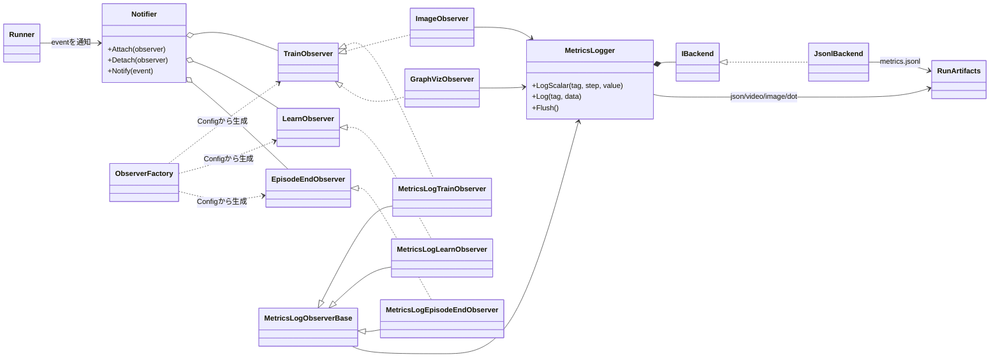
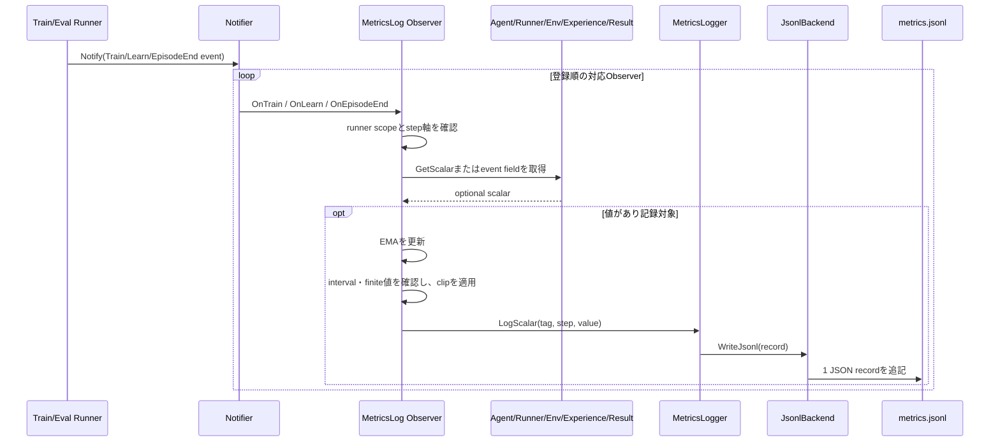
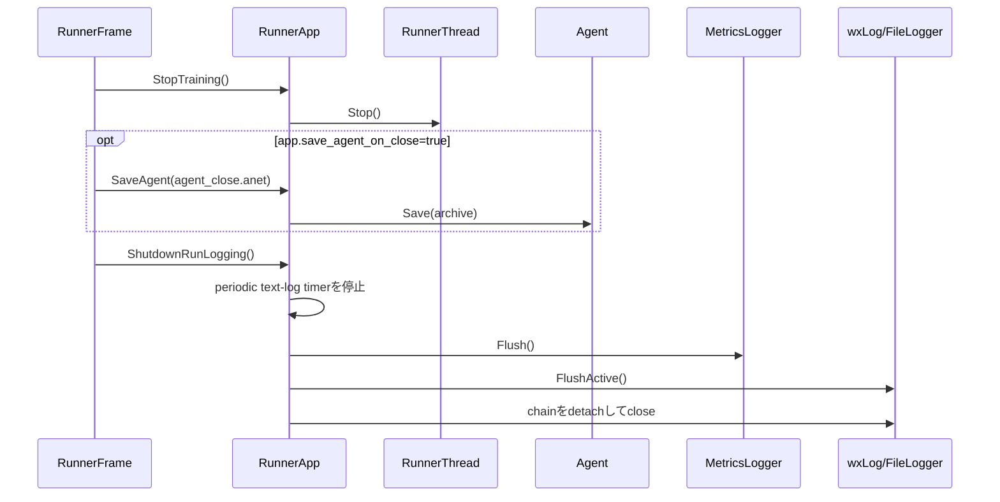

<!-- translated-from: 140_observability.jp.md blob:d4f6e2fdab091ea300ec322a27b996bdad7ac943 date:2026-09-19 progress:done -->
# Observability

> Primary perspective: function (Events, Observers, metrics, logs, profiling, and artifacts)

## 1. Introduction

### 1.1 Purpose

This document explains how ANET transforms runtime events into scalars, traces, images, videos, GraphViz, text logs, and profiling data. It aims to separate measurement from learning itself while preserving traceability of output meaning and step axes.

### 1.2 Audience

- Developers adding or modifying metrics, Observers, or visualization
- Developers tracing creation of `metrics.jsonl` and Run artifacts
- Reviewers of performance and lifetime boundaries for logging, flushing, and profiling

### 1.3 Scope

This document covers current `Notifier`, Observers, `ObserverFactory`, `MetricsLogger`, runner text logging, and profiling macros. See the [Analysis User Guide](030_user_guide_analysis.en.md) for Metrics Viewer UI operations and [Applications and Tools](160_applications_and_tools.en.md) for application structure.

## 2. Component Definitions

| Component | Definition |
|---|---|
| `TrainEvent` | Carries Experience, ActionInfo, Env, Agent, Runner, and counts after an Env step |
| `LearnEvent` | Carries Experience, UpdateResult, Agent, Runner, and counts after a Learner update |
| `EpisodeEndEvent` | Carries the terminating episode group, Agent, Env, Runner, and counts. Return values come from Runner scalars |
| `Notifier` | Run-local hub registering four Observer types and synchronously delivering corresponding events. Shared between Train/Eval by `RunManager` |
| Runner-scoped Observer | Wrapper forwarding only Train or a particular Eval Runner's events to the actual Observer |
| `SessionEndEvent` | Reports finalized aggregation of N adopted configured-Eval episodes, once per session |
| `MetricsLogTraceObserver` | Reads individual values within episode-completion callbacks and records one trace row |
| `ObserverFactory` | Constructs Observers from ConfigData such as `metrics.scalar.*`, `metrics.trace.*`, and `metrics.graph.*` |
| `MetricsLog*Observer` | Retrieves scalars from event-specified sources and applies step selection, interval, EMA, and clipping |
| `EpisodeEvalObserver` | Drives configured Eval sessions synchronously or in the background on Learn events, rethrowing worker exceptions to callers |
| Image/Graph Observer | Generates HeatMap, TimeHistogram, Conv2d, and GraphViz output from Probes or NN outputs |
| `MetricsLogger` | Singleton owning Run name/directory and saving scalars, JSON, images, videos, and DOT in shared formats |
| `IBackend` / `JsonlBackend` | Metric-record persistence boundary; the current backend appends to `metrics.jsonl` |
| `anet::log::Logger` | Lightweight logger creating `WxLogStream` with a prefix fixed at construction |
| `FileLogger` | Copies wxLog to UTF-8 `<run_name>.log`, immediately flushing warnings and above |
| `StandardStreamLogger` | Captures GUI-process stdout/stderr in the Run directory |
| `ProfileRange` and macros | Instrumentation boundary recording functions/phases with stable names in CPU/GPU profilers |

`Notifier` only delivers events; it does not collect values. Observers decide what to record and at which step; `MetricsLogger` and backends decide where to save it.

## 3. Code Map

| Area | Main files |
|---|---|
| Events, Observer interfaces, Notifier | [rl.hpp](../../core/anet-core/include/anet/rl.hpp), [rl.cpp](../../core/anet-core/src/rl.cpp) |
| Concrete Observers, Config parser | [observers.hpp](../../core/anet-core/include/anet/observers.hpp), [observers.cpp](../../core/anet-core/src/observers.cpp) |
| MetricsLogger contracts | [metrics_logger.hpp](../../core/anet-core/include/anet/metrics_logger.hpp) |
| JSONL, image, video, DOT output | [metrics_logger.cpp](../../core/anet-core/src/metrics_logger.cpp) |
| Text logging | [log.hpp](../../core/anet-core/include/anet/log.hpp) |
| stdout/stderr capture | [app_util.hpp](../../core/anet-core/include/anet/app_util.hpp), [app_util.cpp](../../core/anet-core/src/app_util.cpp) |
| Profiling | [profile.hpp](../../core/anet-core/include/anet/profile.hpp), [profile.cpp](../../core/anet-core/src/profile.cpp) |
| Scalar metric configuration examples | [metrics_scalar.txt](../../apps/runner/config/metrics_scalar.txt) |
| Image/graph metric configuration examples | [metrics_image.txt](../../apps/runner/config/metrics_image.txt) |
| Runner initialization/flushing | [RunnerApp.cpp](../../apps/runner/src/RunnerApp.cpp) |

## 4. Static Structure



Observers do not own Runner's domain state; they obtain snapshots through events or explicit Probe/APIs. Each Observer does own state needed for observation/aggregation, such as EMA in `MetricsLogObserverBase` or episode capture in `GraphVizObserver`. Observers requiring runner scope use wrappers to restrict delivery to their target Runner.

## 5. Processing Flows

### 5.1 Recording Scalar Metrics



Observer callbacks execute on the thread calling `Notify()`. Profile expensive rendering, device synchronization, or I/O assuming it enters the Train/Learn critical path. Background evaluation in `EpisodeEvalObserver` is an exception using a dedicated pool; completion exceptions are rethrown to the caller at the next boundary.

Runner aggregates episode returns and episode_steps completed in the latest Step, exposing `mean.episode_return`, `max.episode_return`, `min.episode_return`, `std.episode_return`, and `episode_steps` with the same prefixes. episode_steps counts Env Steps including the terminal one, without multiplying by lane count even for SHARED. The existing train value is `max.episode_return`; configured Eval aggregates the N adopted session episodes. `EvalSessionEnv` subscribes only to the target Eval's `@session_end $env` source keys from resolved metric definitions and snapshots values immediately after episode-completion Steps. Any `nullopt` makes the aggregate `nullopt`; NaNs are excluded. Aggregates with no valid values, and std with one valid value, are NaN. With at least two values, std is population standard deviation.

### 5.2 Finalizing Output at Run Shutdown



The periodic timer flushes only `RunName.log`. Metrics, stdout, and stderr are flushed together at explicit `FlushRunOutputs()` boundaries such as pause, save, and shutdown.

## 6. Metric Configuration Contracts

The basic scalar definition is:

```text
metrics.scalar.[tag] = key [$step_axis] [@event] [$target] [$runner_scope] [$ema] [interval:N] [ema_alpha:A] [clip:C]
```

| Element | Main values | Meaning |
|---|---|---|
| `@event` | `@train`, `@learn`, `@episode_end`, `@session_end` (eval only) | Event invoking the Observer; defaults to `@train` |
| `$step_axis` | `$train_step`, `$learn_step`, `$episode_step`, `$exp_step`, `$update_step`, `$sim_step` | Counter used for JSONL `step` |
| `$target` | `$runner`, `$agent`, `$actor`, `$env`, `$exp`, `$update_result`, `$action_info` | Value source |
| `$runner_scope` | `$train`, `$eval.[name]` | Restricts the originating Runner; also affects whose counter supplies the step |
| `$ema` | - | Computes EMA inside the Observer |
| `ema_alpha:A` | Finite value greater than 0 and at most 1 | Coefficient controlling EMA movement toward new values |
| `interval:N` | Integer at least 1 | Thins events |
| `clip:C` | Finite value at least 0 | Clips values to `[-C, C]` before recording |

Without an explicit step axis, `@train` uses `train_step`; `@learn`, `@episode_end`, and `@session_end` use `exp_step`. Scalar JSON records contain only `type`, `tag`, `step`, and `value`, not the axis name. Do not reuse a tag for a different step axis when changing configuration.

### 6.x Step Coordinate Systems

`StepCounts` belongs to individual Runners; axis names do not identify globally unique coordinates. **A step is identified by the pair of its owning Runner and its axis.** This document calls that pair a [step coordinate system](../../CONTEXT.md).

In Eval scope, the counts depend on the event. `EvalRunner` attaches its own `step_counts_` to `@train` events, but attaches caller-supplied (train runner) `event_counts` to `@episode_end` and `@session_end`. Thus these two definitions use different coordinate systems despite both specifying `$eval.[eval1]` and `$exp_step`.

```text
metrics.scalar.[51_eval1/13_double_suika_created_mean] = $eval.[eval1] @session_end $env $exp_step ...
metrics.scalar.[51_eval1/41_noop_uqe_win_rate]         = $eval.[eval1] @train $exp_step ... $action_info
```

Measured maximum steps were 19,993,856 for the former and 151,185 for the latter, with their ratio drifting monotonically from 0.000039 to 0.0075 during the Run. Constant-factor conversion is invalid. Configuration has no token specifying whose Runner counts are used, so this distinction can only be derived from the combination of `@event` and `$runner_scope`.

To avoid reimplementing that derivation in analysis tools, Runner outputs resolved definitions from constructed Observers as `metrics.scalar.defs` ([ADR 0029](../adr/0029-analysis-metadata-emitted-by-runner.md)). Each tag includes `step_axis`, `runner`, `scope`, `eval_name`, `eval_episodes`, `num_envs`, `event`, `target`, `source_key`, `ema_alpha`, `interval`, and `clip`, written once to the Metrics master as an existing `type: "json"` record. These scalar definitions do not change the Metrics Viewer SQLite schema. `runner` is the eval name only when runner scope is EVAL and event is `train`; otherwise it is `train`.

Each scalar/trace definition stores subscription `scope` (`train` / `eval`), `eval_name`, `eval_episodes`, and `num_envs` separately from coordinate-owner `runner`. `eval_episodes` is the planned adopted count per session; `num_envs` is the constructed eval Env's lane count (`GetBatchSpec().num_envs`). SHARED lanes share one episode, so lane count need not equal parallel episode count; the planned count does not guarantee session completion either. Train scope uses `null` for `eval_name`, `eval_episodes`, and `num_envs`. Eval information is repeated in each metric definition rather than inferred from tag names.

Scalar definitions also store `clip`: `null` if absent, otherwise the symmetric clipping width applied on output. Processing order is value retrieval → EMA update → interval decision → clip → output. Factory supplies resolved subscriptions and clip; RunManager adds actual eval conditions to attached definitions.

`$ema` uses bias-corrected EMA: a zero-initialized internal value and observed-weight sum are updated with the same `ema_alpha`, and the value is normalized by the weight sum. It produces values from the first sample without gaps and continues correcting from accumulated weights even if `ema_alpha` changes.

`interval:N` controls output after value retrieval and EMA state updates. Sparse values such as first Learner priority updates can therefore update EMA from every finite event with `$ema interval:100`, while recording only every 100 steps. Source `NaN` indicates a non-event or unavailable statistic and is not fed into EMA as zero.

`interval:N` fires on bucket crossings: it fires once when the quotient `step / N` exceeds that at the previous firing, rather than waiting for zero remainder. Step increments differ by axis (`train_step`: +1 per round; Observer-visible `learn_step`: `num_envs × replay_ratio / batch`; `exp_step`: `num_envs`). Remainder-based checks stretch the effective interval to `LCM(increment, N)` and can omit firings when the increment does not divide N. Bucket crossing rounds the effective interval to `max(N, increment)` with phase jitter within one event. Shared `IntervalGate` implements this; the first event always fires regardless of `step`. Crossing several buckets in one call still fires only once, without catch-up. See [ADR 0028](../adr/0028-interval-fires-on-bucket-crossing.md).

EMA state updates on every event independently of `interval`. Changing `interval` changes raw recording resolution, not `$ema` values.

Unknown events, step axes, and targets have paths that warn and use defaults; unsupported Eval scope/field combinations fail fast. Scalar Eval scope is limited to `@session_end` or Eval `@train $action_info`. Eval scalar `@episode_end` fails fast with its replacement indicated; train scalar `@session_end` is also rejected.

Keys available through `$agent`, `$actor`, `$action_info`, and `$update_result` depend on the shared interface and concrete Agent's metrics. Unsupported keys are not made to appear equivalent across Agents; Observers handle `std::optional` and `NaN` according to metric definitions. See [DQN Agents](200_dqn_agents.en.md) for Agent-specific keys such as DefaultDQN Train Actor snapshot diagnostics.

`GetScalar()` returning `std::nullopt` means the key is unknown or cannot be handled by a delegate. A known key whose value is unavailable because of current state, timing, configuration, or missing input returns `NaN`. Observers, wrappers, and aggregators distinguish unknown keys from unavailable values, without replacing uninitialized EMA, unfinished episodes, disabled PER, or insufficient batches with zero, previous values, or defaults.

IQN diagnostics do not synchronize devices per metric key. Policy diagnostics pack multiple scalars into a detached Tensor; `DQNActionInfo` materializes them on CPU only at the first key access. Existing Learner IQN diagnostics share priority readback when PER is enabled. With PER disabled, a fixed-length diagnostic pack still uses the existing asynchronous readback path. `metrics.scalar.iqn_search_p0` composes only P0 selections for PER health and throughput without enabling all of `metrics.scalar.full`.

QR/IQN quantile-tail diagnostics use the same synchronization boundary. Five Policy scalars share per-action upper/lower widths, a detached full-quantile alias, and global disagreement/crossing values. On first access only, they gather the final action, select lane-wise nearest-rank p90 of positive crossing depth on device, and cache all five values together on CPU. Action creation and repeated cache access do not sort percentiles; `WithAction()` invalidates only the cache. Learner per-sample upper-tail width joins existing priority readback only with PER enabled, then aggregates into Spearman correlation with clipped raw priority on CPU. With PER disabled, it adds neither a pack nor a wait and returns `NaN`. Tail inputs are detached to float32 and do not feed loss, priority, action, sampling, or RNG.

The current parser converts `interval`, `ema_alpha`, and `clip` with `stoi`/`stof`. After conversion, `EmaFilter` validates finite `0 < ema_alpha <= 1`. Observer construction validates `interval >= 1`, failing fast for zero or negative values. `clip` has no range/finiteness validation, so do not specify a negative value. Invalid numeric strings throw during construction.

### 6.x Trace Channel

```text
metrics.trace.[51_eval1/episode] = $eval.[eval1] @episode_end $env game_score game_len game_frames hns57
```

Trace saves each completed adopted episode as one row without aggregation. Without declarations, neither Observers nor rows are created. Event and target are mandatory: only `@episode_end` / `event:episode_end` is supported; targets are `$env`, `$runner`, `$agent`, or `$actor` (attribute forms are also accepted). Scope defaults to `$train`, and the step axis to `exp_step`.

Bare tokens specify one or more keys. Retrieval and the definition's `keys` array follow declaration order. Duplicate keys, aggregate prefixes, EMA, clip, interval, `key:`, and unknown/invalid controls are rejected at load time. Duplicate event, target, scope, or step-axis controls are rejected regardless of equal/different values or notation; later assignments cannot conceal invalid earlier ones. Existing scalar later-wins, default, and WARN behavior remains unchanged.

```json
{"type":"trace","tag":"51_eval1/episode","step":456,"lane":3,"data":{"game_score":422,"game_len":1242,"game_frames":4968,"hns57":31.2}}
```

Series are identified by `(type, tag)`, allowing scalar and trace to share a tag. `lane` is the event's `env_index` (lane for PER_LANE, -1 for SHARED). `step` uses the same integer coordinates as scalars; multiple episodes may share a step and lane. Records have neither `timestamp` nor top-level `value`, and `data` key order is unspecified. Unknown-key `nullopt` fails fast with tag/key/lane/target; NaN and ±Inf retain the key with a `null` value.

`EvalSessionEnv::LastAdoptedGroups()` returns only adopted groups completed in the immediately preceding Step. EvalRunner notifies immediately after that Step and before the next. SHARED group 0 becomes -1 at notification. Finalized values are read inside callbacks, so individual-value sequences are not accumulated in the decorator. Return aggregation and SessionEnd happen only once at session end. Train uses the same trace Observer.

Only attached definitions are recorded, separately as `metrics.scalar.defs` and `metrics.trace.defs`, excluding dormant eval. Empty definitions are not output. Trace definitions use `{tag: {step_axis, runner, scope, eval_name, eval_episodes, num_envs, event, target, keys}}`; both definition records are mirrored unchanged to `json/<definition tag>.json`. Only scalar definitions are passed to Agent as subscription hints.

The `inspect_run` master/cache paths prefer new `metrics.scalar.defs`, reading old `metrics.defs` only if absent. Both report `def_source=metrics_defs` without a WARN solely for renaming. Old-name compatibility is an exception lasting until the active Run working set uses only the new name; historical artifacts remain unchanged. Configuration derivation when definitions are absent is retained, including `session_end` derivation for selector expansion without caches and for `tags --no-observed`.

Metrics Viewer stores traces in existing `json_lines`, separately from scalars. `inspect_run.py trace-csv` reads and exports rows directly to CSV ([030 Section 6.9](030_user_guide_analysis.en.md#69-extracting-individual-trace-rows-as-csv)). Quantile/threshold aggregation, Metrics Viewer visualization, additional events, `episode_id`, and `model_version` are outside this feature's scope. See [ADR 0037](../adr/0037-metrics-trace-channel-and-session-end-event.md) for rationale.

## 7. Output and Lifetimes

| Output | Producer | Update/flush boundary |
|---|---|---|
| `metrics.jsonl` | `JsonlBackend` | Appended per scalar/metadata record; finalized by explicit flush |
| `config/*.txt` | `MetricsLogger` | Written per tag when Config is logged; Env uses `env.<Env name>.txt` |
| `json/*.json` | `MetricsLogger` | Overwritten or created per step when JSON metadata is logged |
| `videos/<tag>.mkv` | `VideoLogger` | Logger created at the first frame and closed at Run end |
| `images/<tag>/*.png` | `MetricsLogger` | Created per frame when `use_png_dump=true` |
| `dot/**/*.dot` | `MetricsLogger` | Created per GraphViz event |
| `<run_name>.log` | `FileLogger` | Periodic timer, warnings and above, explicit flush |
| `stdout.log` / `stderr.log` | `StandardStreamLogger` | Captured process standard streams; explicit flush/stop |

`MetricsLogger` is a process singleton owning the Run directory under the assumption of one active Run per process. `Reset()` releases it at Run end. Preserve application shutdown order so video loggers and wxLog chains are not destroyed while files are in use.

Concrete Env text logs begin with `<Env name>: `, allowing people to distinguish Train, configured Eval, EvalPanel, and batch lanes. `SingleDiscreteEnvBase` and `BatchEnvBase` hold protected `anet::log::Logger log`; concrete Envs use `log.info()`, `log.verbose()`, `log.warn()`, and `log.error()`. Do not use `LOG::` directly inside Envs or scatter prefix formatting/`GetName()` concatenation across log lines. Factories, free functions, Runners, Agents, and Views outside Env continue using `LOG::`.

Debug logs use `ANET_LOG_DEBUG_PREFIXED(expr)`, delegating to `ANET_LOG_DEBUG(log.prefix() << expr)` and preserving debugger/level guards, source information, and non-evaluation with `ANET_ENABLE_DEBUG_LOG=0`. Env names are opaque display strings and neither replace nor change MetricsLogger tags, JSONL fields, artifact paths, or runner scopes. Views may display them through common Env accessors but must not use them to branch Env behavior or metric identity.

### 7.1 Sparse Scalars and Subscription Information

Sparse known keys without current values return `NaN`; unknown keys return `nullopt`. Observers exclude nonfinite values before EMA updates and before averaging multiple UpdateResults. Later finite values resume normally from the last finite EMA state.

Source key, event, target, interval, runner scope, and eval name are passed to Agent as typed subscriptions from actually attached scalar definitions. Where a metrics row's `interval` is authoritative for expensive measurement cadence, commenting out the definition must stop the computation itself.

### 7.2 Evaluation Session Logs

Configured Eval writes one info-level `eval.[<tag>]: session start` and one `session end` line.
Both lines' learn_step/exp_step are session-start coordinates supplied by Train and correspond to session_end scalars.
The end line's elapsed time runs from before Sync through after SessionEnd notification, in seconds with two decimals; it is not Train's actual background wait time.
In background mode, only when blocked waiting for the previous session, one info-level `waited for previous session` line includes the current trigger's learn_step/exp_step.
That line's elapsed is actual Train-thread wait time in seconds with two decimals. It is absent for foreground execution, shutdown waits, and exceptions during waits.
The end line includes mean.episode_return, max.episode_return, mean.episode_steps, and max.episode_steps matching finalized scalars.
Abnormal termination does not emit a normal end line. Startup scheduled lines include interval, background, episodes, and batch_size.
Generic evaluation episode lengths are available in baseline/full through `21_eval/05_target_ep_steps`–`08_policy_ep_steps_max`.

## 8. Profiling and Performance Considerations

- Use `ANET_PROFILE_FUNC()` for whole functions and `ANET_PROFILE_SCOPE(phase)` for ordinary phases.
- Switch consecutive phases with `ANET_PROFILE_SCOPE_NEXT(...)` to compare within the same visible lifetime.
- Use `ANET_PROFILE_SCOPE_FULL` only when automatic names do not represent the logical operation, such as callbacks or asynchronous workers.
- Expensive Probes, image rendering, GraphViz, and CPU transfers with `interval=1` directly affect training throughput.
- EMA, clipping, and thinning control display/storage volume but do not have the same meaning as original data. Retain configuration for analysis.
- Separate periodic text-log flushing from GUI FPS. Do not increase I/O frequency by flushing metrics/stdout on the same timer.

## 9. Tests and Extension Checks

When changing Observers or output formats, check the following:

1. Event, runner scope, step axis, and target combinations are explicit.
2. Callbacks add no unnecessary clones, device synchronization, or I/O.
3. A tag's type and step axis do not change during a Run.
4. Background exceptions and shutdown waits are preserved.
5. Existing `metrics.jsonl` readers and Metrics Viewer can safely ignore or interpret new records.
6. No file handles, timers, or ffmpeg processes remain after Run close.

Main regression tests belong in [observers_test.cpp](../../core/anet-core/src/observers_test.cpp), [metrics_logger_test.cpp](../../core/anet-core/src/metrics_logger_test.cpp), [log_test.cpp](../../core/anet-core/src/log_test.cpp), and [episode_end_test.cpp](../../core/anet-core/src/episode_end_test.cpp).

## 10. Related Documents

- [Run Execution User Guide](020_user_guide_run.en.md)
- [Run Analysis User Guide](030_user_guide_analysis.en.md)
- [Runtime Infrastructure and Configuration](100_runtime_and_configuration.en.md)
- [Agents and Learning](110_agents_and_learning.en.md)
- [Environments](120_environments.en.md)
- [ReplayBuffer](150_replay_buffer.en.md)
- [Applications and Tools](160_applications_and_tools.en.md)
- [DQN Agents](200_dqn_agents.en.md)
- [DropMerge Optuna Guide](optuna.md)
