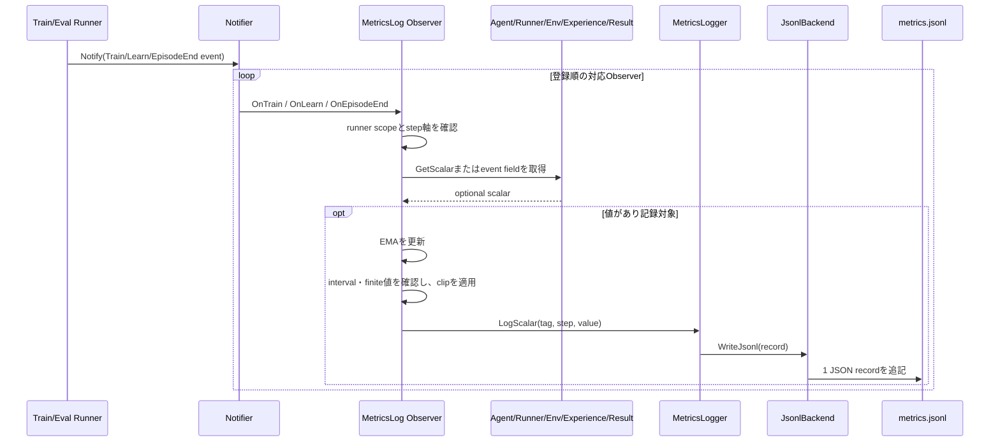
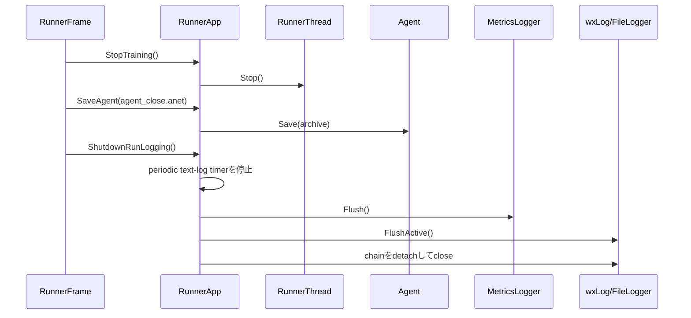

# 可観測性

> 主たる観点: 機能単位（Event、Observer、metrics、log、profile、artifact）

## 1. はじめに

### 1.1 目的

本書は、ANETの実行状態をeventからscalar、trace、画像、動画、GraphViz、text log、profileへ変換する仕組みを説明する。計測処理を学習本体から分離し、出力の意味とstep軸を追跡できることを目的とする。

### 1.2 対象読者

- metric、Observer、可視化を追加・変更する開発者
- `metrics.jsonl`とRun内artifactの生成経路を確認する開発者
- logging、flush、profilingの性能・lifetime境界をレビューする担当者

### 1.3 記載範囲

現行の`Notifier`、Observer群、`ObserverFactory`、`MetricsLogger`、runner text log、profile macroを扱う。Metrics ViewerのUI操作は[分析ユーザーガイド](030_user_guide_analysis.jp.md)、application構造は[アプリケーションとツール](160_applications_and_tools.jp.md)を参照する。

## 2. コンポーネント定義

| コンポーネント | 定義 |
|---|---|
| `TrainEvent` | Env step後のExperience、ActionInfo、Env、Agent、Runner、countsを運ぶevent |
| `LearnEvent` | Learner更新後のExperience、UpdateResult、Agent、Runner、countsを運ぶevent |
| `EpisodeEndEvent` | episode終端group、Agent、Env、Runner、countsを運ぶevent。return値はRunner scalarから取得する |
| `Notifier` | 4種類のObserverを登録し、対応eventを同期的に配信するRun内hub。`RunManager`がTrain/Eval間で共有する |
| Runner-scoped Observer | Trainまたは特定Eval Runnerのeventだけを実Observerへ通すwrapper |
| `SessionEndEvent` | configured Eval の採用 N episode の集約が確定したことを運ぶ event。セッションごとに1回通知する |
| `MetricsLogTraceObserver` | episode 完了 callback 内で個体値を取得し、1行の trace を記録する Observer |
| `ObserverFactory` | `metrics.scalar.*`、`metrics.trace.*`、`metrics.graph.*`などのConfigDataからObserverを組み立てるfactory |
| `MetricsLog*Observer` | event内の指定sourceからscalarを取得し、step選択、interval、EMA、clipを適用するObserver |
| `EpisodeEvalObserver` | Learn eventを契機にconfigured Eval sessionを同期またはbackgroundで駆動し、worker例外を呼出側へ再送出するObserver |
| Image/Graph Observer | ProbeやNN出力からHeatMap、TimeHistogram、Conv2d、GraphVizを生成するObserver |
| `MetricsLogger` | Run名とRun directoryを所有し、scalar、JSON、画像、動画、DOTを共通形式で保存するsingleton |
| `IBackend` / `JsonlBackend` | metric recordの永続化境界。現行backendは`metrics.jsonl`へ追記する |
| `anet::log::Logger` | 構築時に確定したprefixを先頭へ書き込んだ`WxLogStream`を生成する軽量logger |
| `FileLogger` | wxLogをUTF-8の`<run_name>.log`へ複製し、warning以上を即時flushする |
| `StandardStreamLogger` | GUI processのstdout/stderrをRun directoryへ退避する |
| `ProfileRange`とmacro | 関数・処理phaseをCPU/GPU profilerへ安定名で記録する計測境界 |

`Notifier`は値を収集せず、event配送だけを担当する。何をどのstepで記録するかはObserver、どこへ保存するかは`MetricsLogger`とbackendの責務である。

## 3. コードマップ

| 領域 | 主なファイル |
|---|---|
| event、Observer interface、Notifier | [rl.hpp](../../core/anet-core/include/anet/rl.hpp)、[rl.cpp](../../core/anet-core/src/rl.cpp) |
| 具象Observer、Config parser | [observers.hpp](../../core/anet-core/include/anet/observers.hpp)、[observers.cpp](../../core/anet-core/src/observers.cpp) |
| MetricsLogger contract | [metrics_logger.hpp](../../core/anet-core/include/anet/metrics_logger.hpp) |
| JSONL、画像、動画、DOT出力 | [metrics_logger.cpp](../../core/anet-core/src/metrics_logger.cpp) |
| text logging | [log.hpp](../../core/anet-core/include/anet/log.hpp) |
| stdout/stderr capture | [app_util.hpp](../../core/anet-core/include/anet/app_util.hpp)、[app_util.cpp](../../core/anet-core/src/app_util.cpp) |
| profiling | [profile.hpp](../../core/anet-core/include/anet/profile.hpp)、[profile.cpp](../../core/anet-core/src/profile.cpp) |
| scalar metric設定例 | [metrics_scalar.txt](../../apps/runner/config/metrics_scalar.txt) |
| image/graph metric設定例 | [metrics_image.txt](../../apps/runner/config/metrics_image.txt) |
| runner側の初期化・flush | [RunnerApp.cpp](../../apps/runner/src/RunnerApp.cpp) |

## 4. 静的構造


ObserverはRunner本体のdomain stateを所有せず、eventまたは明示されたProbe/APIから断面を取得する。一方、`MetricsLogObserverBase`のEMAや`GraphVizObserver`のepisode captureなど、観測・集約に必要なstateは各Observerが所有する。runner scopeが必要なObserverはwrapperを介して対象Runnerだけへ絞る。

## 5. 処理フロー

### 5.1 scalar metricの記録



Observer callbackは`Notify()`を呼んだthread上で実行される。重いrender、device同期、I/Oを追加する場合はTrain/Learnのcritical pathへ入ることを前提にprofileする。`EpisodeEvalObserver`のbackground evalは専用poolを使う例外であり、完了時の例外は次の境界で呼び出し側へ再送出する。

Runnerは直近Stepで完了したepisode return群を共通集約し、`mean.episode_return`、`max.episode_return`、`min.episode_return`、`std.episode_return`を公開する。trainの従来値は`max.episode_return`、configured Evalはsessionで採用したN本の集約である。`EvalSessionEnv`は解決済みmetric定義のうち対象Evalの`@session_end $env` source keyだけを購読し、episode完了Step直後に値をsnapshotする。`nullopt`が一つでもあれば集約も`nullopt`、NaNは除外する。有効値0件の集約と有効値1件のstdはNaN、2件以上のstdは母集団標準偏差とする。

### 5.2 Run終了時の出力確定



periodic timerは`RunName.log`だけをflushする。metrics、stdout、stderrはpause、save、shutdownなどの明示的な`FlushRunOutputs()`境界でまとめてflushする。

## 6. Metric設定contract

scalar定義の基本形は次である。

```text
metrics.scalar.[tag] = key [$step_axis] [@event] [$target] [$runner_scope] [$ema] [interval:N] [ema_alpha:A] [clip:C]
```

| 要素 | 主な値 | 意味 |
|---|---|---|
| `@event` | `@train`、`@learn`、`@episode_end`、`@session_end`（eval専用） | Observerを呼ぶevent。省略時は`@train` |
| `$step_axis` | `$train_step`、`$learn_step`、`$episode_step`、`$exp_step`、`$update_step`、`$sim_step` | JSONLの`step`へ使うcounter |
| `$target` | `$runner`、`$agent`、`$env`、`$exp`、`$update_result`、`$action_info` | 値を取得するsource |
| `$runner_scope` | `$train`、`$eval.[name]` | eventを発生させたRunnerを限定する。stepがどのRunnerのcounterに載るかも変わる |
| `$ema` | - | Observer内でEMAを計算する |
| `ema_alpha:A` | 0より大きく1以下のfinite値を指定する | EMAが新しい値へ寄る係数を指定する |
| `interval:N` | 1以上の整数を指定する | eventを間引く |
| `clip:C` | 0以上のfinite値を指定する | 記録前に値を`[-C, C]`へclipする |

step軸を省略した場合、`@train`は`train_step`、`@learn`、`@episode_end`、`@session_end`は`exp_step`を使う。scalar JSON recordは`type`、`tag`、`step`、`value`だけを持ち、軸名を保存しない。このため設定変更時は同じtagへ別step軸を流用しない。

### 6.x step座標系

`StepCounts`はRunnerごとのメンバであり、軸名はグローバルに一意な座標を指さない。**stepの同一性は「どのRunnerのcounterか」と「どの軸か」の組で決まる。** 本書ではこの組を[step座標系](../../CONTEXT.md)と呼ぶ。

Eval scopeでは、載るcountsがeventによって変わる。`EvalRunner`は`@train`系eventへ自分の`step_counts_`を載せ、`@episode_end`と`@session_end`へは呼び出し元（train runner）から渡された`event_counts`を載せる。したがって次の2つは、どちらも`$eval.[eval1]`かつ`$exp_step`と書かれていながら別座標系になる。

```text
metrics.scalar.[51_eval1/13_double_suika_created_mean] = $eval.[eval1] @session_end $env $exp_step ...
metrics.scalar.[51_eval1/41_noop_uqe_win_rate]         = $eval.[eval1] @train $exp_step ... $action_info
```

実測では前者の最大stepが19,993,856、後者が151,185で、比はRun中に0.000039から0.0075へ単調にドリフトする。定数倍の換算は成立しない。configには「どのRunnerのcountsか」を書くtokenが無いため、この区別は`@event`と`$runner_scope`の組からしか導けない。

解析側がこの導出を再実装しないよう、Runnerは構築済みobserverの解決済み定義を`metrics.scalar.defs`として出力する（[ADR 0029](../adr/0029-analysis-metadata-emitted-by-runner.md)）。tagごとに`step_axis`、`runner`、`scope`、`eval_name`、`eval_episodes`、`num_envs`、`event`、`target`、`source_key`、`ema_alpha`、`interval`、`clip`を持ち、既存の`type: "json"` recordとしてMetricsマスタへ1回だけ書く。scalar定義は既存のJSON recordであり、Metrics ViewerのSQLite schemaを変更しない。`runner`は「runner scopeがEVALかつeventが`train`のときだけそのeval名、それ以外は`train`」となる。

scalar / trace の各定義には、座標系所有者の `runner` と別に、購読先の `scope`（`train` / `eval`）、`eval_name`、`eval_episodes`、`num_envs` を保存する。`eval_episodes` は1セッションの採用予定数、`num_envs` は構築済み eval Env の lane 数（`GetBatchSpec().num_envs`）である。SHARED では複数 lane が1エピソードを共有するため並列エピソード数とは限らず、採用予定数もセッション完了を保証しない。train scope では `eval_name` / `eval_episodes` / `num_envs` は `null`。eval の情報は各 metric 定義に重複して持たせ、tag 名から推測しない。

scalar 定義には `clip` も保存する。未指定は `null`、指定時は出力時に適用する対称クリップ幅であり、値取得 → EMA 更新 → interval 判定 → clip → 出力の順に適用する。解決済みの購読先と clip は Factory、eval の実条件は RunManager が attach 済み定義に付与する。

`$ema`は、ゼロ初期化した内部値と観測済み重み和を同じ`ema_alpha`で更新し、内部値を重み和で正規化するバイアス補正EMAを使う。初回サンプルから欠損なく値を出力し、途中で`ema_alpha`が変わっても観測済み重み和に基づく補正を継続する。

`interval:N`は出力判定であり、値取得とEMA状態更新の後に適用する。このため初回Learner priority更新のような疎な値も、`$ema interval:100`では各eventのfinite値でEMAを更新し、記録だけを100 step間隔へ抑えられる。sourceが返す`NaN`は非イベントまたは統計未成立を表し、0としてEMAへ投入しない。

`interval:N`の発火判定はbucket-crossingである。`step / N`の商が前回発火時より増えたeventで1回だけ発火し、剰余が0になるstepを待たない。step軸の刻みは軸ごとに異なる（`train_step`はroundあたり+1、Observerが直参照する`learn_step`は`num_envs × replay_ratio / batch`刻み、`exp_step`は`num_envs`刻み）ため、剰余判定では実効周期が`LCM(刻み, N)`へ伸び、刻みがNを割り切らない構成では発火が丸ごと欠落する。bucket-crossingでは実効周期が`max(N, 刻み)`に丸まり、位相ジッタは1 event以内に収まる。判定は共通部品`IntervalGate`が持ち、初回eventは`step`の値によらず必ず発火する。1回の呼び出しで複数bucketを跨いだ場合も発火は1回で、catch-upはしない。詳細は[ADR 0028](../adr/0028-interval-fires-on-bucket-crossing.md)を参照する。

EMA状態は`interval`と無関係に毎event更新する。`interval`を変えても`$ema`系の値は変わらず、生値の記録解像度だけが変わる。

不明なevent、step軸、targetにはWARN後に既定値を使う経路があり、対応しないEval scope/fieldの組み合わせはfail-fastする。scalarのEval scopeは`@session_end`、またはEvalの`@train $action_info`に限定される。eval scalarの`@episode_end`は置換先を示してfail-fastする。train scalarの`@session_end`も拒否する。

`$agent`、`$action_info`、`$update_result`で取得できるkeyは、共通interfaceと具象Agentが公開するmetricの組合せで決まる。対応しないkeyを全Agentで同じ値に見せることはせず、Observer側は`std::optional`や`NaN`の意味をmetric定義ごとに扱う。DefaultDQNのTrain Actor snapshot診断など、Agent固有keyの意味は[DQN系Agent](200_dqn_agents.jp.md)を参照する。

`GetScalar()`の`std::nullopt`は「指定keyを知らない、または委譲先でも処理できない」ことを表す。指定keyが既知だが現在の状態、タイミング、設定、入力不足で値が成立しない場合は`NaN`を返す。Observer、wrapper、aggregatorは`std::nullopt`を未知key、`NaN`を値未成立として扱い、未初期化EMA、episode未確定、PER無効、batch不足などを0、前回値、既定値へ読み替えない。

IQN診断ではdevice同期をmetric keyごとに発生させない。Policy診断は複数scalarをdetached packed Tensorへまとめ、`DQNActionInfo`が最初のkey参照時だけCPUへmaterializeする。Learnerの既存IQN診断はPER有効時にpriority readbackへ同梱し、PER無効時も固定長の診断packだけを既存の非同期readback経路で回収する。`metrics.scalar.iqn_search_p0`は`metrics.scalar.full`全体を有効化せず、PER健全性とthroughputのP0選抜だけを合成するgroupである。

QR / IQNの分位tail診断も同じ同期境界を使う。Policy側5 scalarはper-action上下幅、detached full quantile alias、globalなdisagreement / crossingを共有する。最初の参照時だけ最終actionをgatherし、positive crossing深度のlane別nearest-rank p90をdevice上で選んで、全5値を1本のCPU cacheへまとめる。action生成時とcache再参照時にはpercentile sortを行わず、`WithAction()`後はcacheだけを破棄する。Learner側のsample単位upper-tail幅はPER有効時だけ既存priority readbackへ同梱し、CPU上でclip後raw priorityとのSpearman相関へ集約する。PER無効時は追加packも追加waitも作らず`NaN`を返す。tail入力はfloat32へdetachし、loss、priority、action、sampling、RNGへ接続しない。

現行parserは`interval`、`ema_alpha`、`clip`を`stoi`/`stof`で変換する。`ema_alpha`は変換後に`EmaFilter`がfiniteかつ`0 < ema_alpha <= 1`を検証する。`interval`はObserver構築時に1以上を検証し、0以下はfail-fastする。`clip`は範囲やfinite性を検証しないため、負の`clip`は指定しない。数値文字列の変換失敗は構築中の例外になる。

### 6.x trace チャネル

```text
metrics.trace.[51_eval1/episode] = $eval.[eval1] @episode_end $env game_score game_len game_frames hns57
```

trace は統計を集約せず、完了した採用 episode を1行で保存する。宣言がなければ observer も行も生成しない。event と target は明示必須で、event は `@episode_end` / `event:episode_end` のみ、target は `$env` / `$runner` / `$agent`（属性形も可）。scope の既定は `$train`、step 軸は `exp_step` とする。

裸トークンは1個以上のキーで、取得順と定義の `keys` 配列は宣言順。キー重複、集約 prefix、EMA、clip、interval、`key:`、未知・不正な制御指定を読み込み時に拒否する。event・target・scope・step軸の重複は同値・異値・別表記を問わず拒否し、後続指定による上書きで不正指定を隠せない。scalar の既存の後勝ち・既定値・WARN は変えない。

```json
{"type":"trace","tag":"51_eval1/episode","step":456,"lane":3,"data":{"game_score":422,"game_len":1242,"game_frames":4968,"hns57":31.2}}
```

系列は `(type, tag)` で区別し、scalar と trace の同名 tag を許可する。`lane` はイベントの `env_index`（PER_LANE は lane、SHARED は -1）。`step` は scalar と同じ整数座標で、同一 step・同一 lane に複数 episode が並ぶことも許容する。`timestamp` と top-level `value` は持たず、`data` のキー順は保証しない。未知キーの `nullopt` は tag/key/lane/target 付きで fail-fast、NaN / ±Inf はキーを残して `null` とする。

`EvalSessionEnv::LastAdoptedGroups()` は直前 Step で完了した採用 group のみを返し、EvalRunner は Step 直後・次の Step より前に通知する。SHARED の group 0 は通知時に -1 へ変換する。確定値は callback 内で読むため、個体値列を decorator に蓄積しない。セッション末尾の return 集約と SessionEnd は一度だけ行う。train も同じ trace observer を使う。

attach 済み定義だけを `metrics.scalar.defs` / `metrics.trace.defs` に分けて記録し、dormant eval を除外する。空の定義は出力しない。trace 定義は `{tag: {step_axis, runner, scope, eval_name, eval_episodes, num_envs, event, target, keys}}` で、両定義は同じ内容で `json/<定義tag>.json` にミラーされる。Agent への購読ヒントは scalar 定義だけを渡す。

`inspect_run` の master/cache は新名 `metrics.scalar.defs` を優先し、不在時だけ旧 `metrics.defs` を読む。どちらも `def_source=metrics_defs` で、改名のみを理由とする WARN は出さない。旧名の互換読取りは現用 Run 作業セットがすべて新名になるまでの例外で、過去 artifact は変更しない。定義不在時の設定導出は維持し、cache 未構築時の selector 展開と `tags --no-observed` でも `session_end` を導出する。

Metrics Viewer は trace を既存の `json_lines` に保持し、scalar と混ぜない。trace の可視化・専用 reader、追加イベント、episode_id、model_version は本機能の範囲外。決定の背景は [ADR 0037](../adr/0037-metrics-trace-channel-and-session-end-event.md) を参照する。

## 7. 出力とlifetime

| 出力 | 生成主体 | 更新・flush境界 |
|---|---|---|
| `metrics.jsonl` | `JsonlBackend` | scalar/metadataごとに追記し、明示flushで確定 |
| `config/*.txt` | `MetricsLogger` | ConfigをLogした時点でtag別に書出し。Envは`env.<Env name>.txt` |
| `json/*.json` | `MetricsLogger` | JSON metadataをLogした時点で上書きまたはstep別生成 |
| `videos/<tag>.mkv` | `VideoLogger` | 最初のframeでloggerを作り、Run終了時にclose |
| `images/<tag>/*.png` | `MetricsLogger` | `use_png_dump=true`時にframeごとに生成 |
| `dot/**/*.dot` | `MetricsLogger` | GraphViz eventごとに生成 |
| `<run_name>.log` | `FileLogger` | periodic timer、warning以上、明示flush |
| `stdout.log` / `stderr.log` | `StandardStreamLogger` | process標準streamをcaptureし、明示flush/停止 |

`MetricsLogger`はprocess singletonだが、1 processで1 active Runを前提にRun directoryを所有する。`Reset()`はRun終了時にsingletonを解放する。動画loggerやwxLog chainをfile利用中に破棄しないよう、applicationのshutdown順序を維持する。

具象Env本体のtext logは`<Env name>: `を先頭へ付け、Train、configured Eval、EvalPanelとbatch laneの出力元を人間が識別できるようにする。`SingleDiscreteEnvBase`と`BatchEnvBase`がprotectedな`anet::log::Logger log`を保持し、具象Envは`log.info()`、`log.verbose()`、`log.warn()`、`log.error()`を使う。Env本体で`LOG::`を直接使わず、prefix書式や`GetName()`連結を各ログ行へ分散させない。Env外のfactory、free関数、Runner、Agent、Viewは従来どおり`LOG::`を使用する。

debug logは`ANET_LOG_DEBUG_PREFIXED(expr)`を使用する。このmacroは`ANET_LOG_DEBUG(log.prefix() << expr)`へ委譲し、デバッガ接続・level guard、source情報、`ANET_ENABLE_DEBUG_LOG=0`での式非評価を維持する。Env nameは表示専用の不透明な文字列であり、`MetricsLogger`のtag、JSONL field、artifact path、runner scopeを変更・代替しない。Viewは共通Env accessorから表示に利用できるが、nameをEnv挙動やmetric identityの分岐へ使用しない。

### 7.1 疎なscalarと購読情報

既知keyだが現在値が成立しない疎なscalarは`NaN`、未知keyは`nullopt`とする。Observerは非有限値をEMA更新前、および複数UpdateResultの平均へ加える前に除外する。後続の有限値は直前までの有限なEMA stateから正常に再開する。

scalar定義のsource key、event、target、interval、runner scope、eval名は、実際にattachされた定義から型付き購読情報としてAgentへ渡される。metrics行の`interval`が重い計測のcadenceの正になる機能では、定義のコメントアウトが計算自体の停止まで到達する必要がある。

## 8. Profilingと性能上の注意

- 関数全体は`ANET_PROFILE_FUNC()`、通常phaseは`ANET_PROFILE_SCOPE(phase)`を使う。
- 連続phaseは`ANET_PROFILE_SCOPE_NEXT(...)`で切り替え、同じ可視lifetimeで比較できるようにする。
- callbackやasync workerなど自動名が論理処理名にならない場合だけ`ANET_PROFILE_SCOPE_FULL`を使う。
- `interval=1`の重いProbe、画像render、GraphViz、CPU転送は学習throughputへ直接影響する。
- EMA、clip、間引きは表示・保存量を制御するが、元データと同じ意味ではない。分析側へ設定を残す。
- text logのperiodic flushはGUI FPSから分離する。metrics/stdoutまで同じtimerでflushしてI/O頻度を増やさない。

## 9. テストと拡張時の確認事項

Observerまたは出力形式を変更する場合は次を確認する。

1. event、runner scope、step軸、targetの組み合わせが明示されている。
2. callbackが必要以上のclone、device同期、I/Oを追加していない。
3. 同じtagの型とstep軸をRun途中で変えない。
4. background処理の例外とshutdown待機が失われていない。
5. `metrics.jsonl`の既存readerとMetrics Viewerが新recordを安全に無視または解釈できる。
6. Run close後にfile handle、timer、ffmpeg processが残らない。

主な回帰testは[observers_test.cpp](../../core/anet-core/src/observers_test.cpp)、[metrics_logger_test.cpp](../../core/anet-core/src/metrics_logger_test.cpp)、[log_test.cpp](../../core/anet-core/src/log_test.cpp)、[episode_end_test.cpp](../../core/anet-core/src/episode_end_test.cpp)に置く。

## 10. 関連文書

- [Run実行ユーザーガイド](020_user_guide_run.jp.md)
- [Run分析ユーザーガイド](030_user_guide_analysis.jp.md)
- [実行基盤と設定](100_runtime_and_configuration.jp.md)
- [Agentと学習](110_agents_and_learning.jp.md)
- [環境](120_environments.jp.md)
- [ReplayBuffer](150_replay_buffer.jp.md)
- [アプリケーションとツール](160_applications_and_tools.jp.md)
- [DQN系Agent](200_dqn_agents.jp.md)
- [DropMerge Optuna利用ガイド](../optuna.md)
