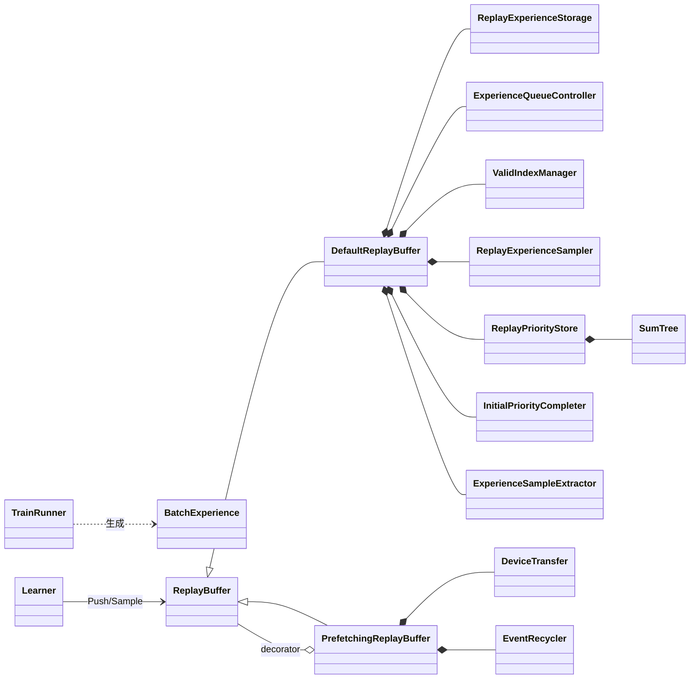
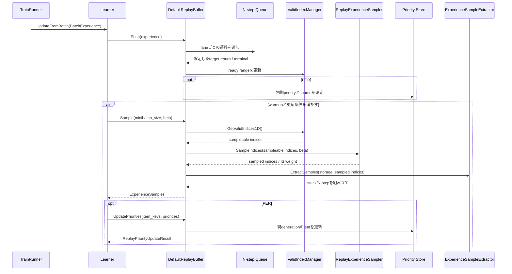
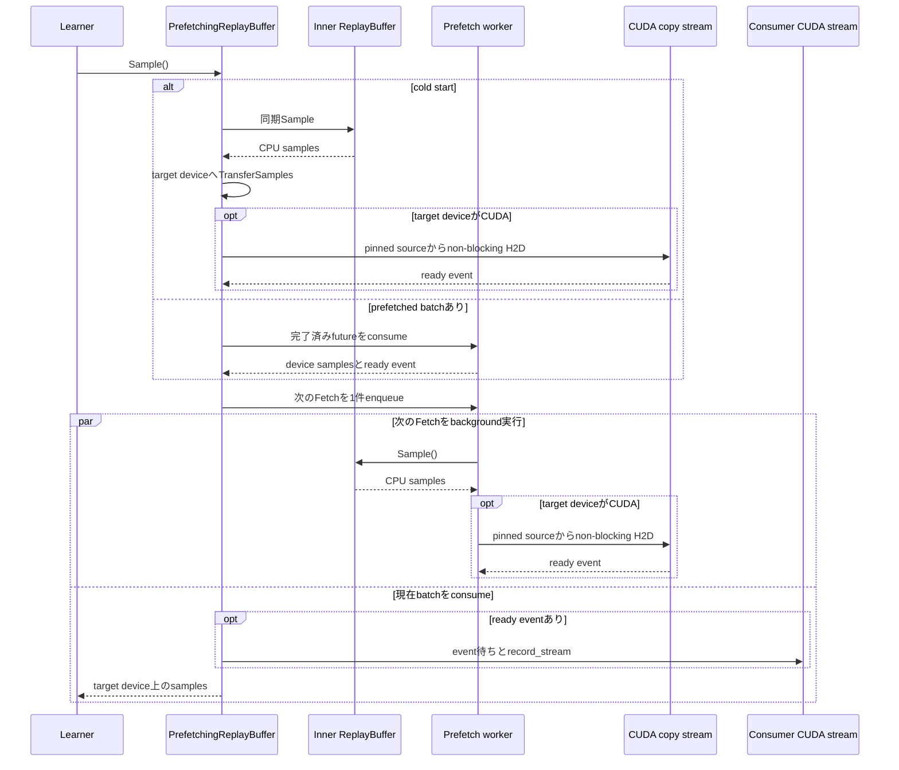

<!-- translated-from: 150_replay_buffer.jp.md blob:019a516ef7155862ad2ba673db5edc684545ce41 date:2026-09-20 progress:done -->
# ReplayBuffer

> Primary perspective: function (ReplayBuffer, with stages from Experience storage to sampling and transfer in chronological order)

## 1. Introduction

### 1.1 Purpose

This document explains the data path from retaining Env Observations as Experiences through ReplayBuffer storage/sampling to delivery on the Learner device.
It clarifies N-step, frame stacking, PER, prefetch, asynchronous H2D boundaries, and storage lifetimes.

### 1.2 Audience

- Developers changing ReplayBuffer, Learner inputs, or device transfers
- Developers improving training throughput or memory usage
- Reviewers of PER, prefetch, and pipeline ordering

### 1.3 Scope

This document covers current `BatchExperience`, `ExperienceSamples`, the `ReplayBuffer` interface, `DefaultReplayBuffer`, `PrefetchingReplayBuffer`, frame stacking, and device transfer.
DQN-specific Q-value schemas and learning formulas, MuZero-specific buffers, and ImageCls datasets/caches are outside this shared ReplayBuffer specification.

## 2. Basic Concepts and External Contracts

### 2.1 Experiences from Runner to Learner

`BatchExperience` represents one batch transition, primarily containing:

- Current `BatchState`
- Actor-generated `BatchActionInfo`
- Per-lane Rewards
- Next `BatchState`, including terminal states

Runner clones State, Reward, and next State at the required boundaries to detach Experiences from storage reused by Env.
`continue_state` advances Runner to its next step and differs from terminal-preserving `next_state` stored in ReplayBuffer.

### 2.2 Public ReplayBuffer Contracts

| Operation | Current contract |
|---|---|
| `Push(batch_exp)` | Accepts one step of Experience with the construction-time `num_envs` lane count. `BatchState::episode_start` must be true only for each lane's first input and the input after a preceding `done || truncated`; all lanes are preflighted before any write. `DefaultReplayBuffer` immediately copies Observation, Action, info, and the history-start flag into preallocated storage and queues lightweight per-lane records for N-step finalization |
| `Sample(out_samples, minibatch_size, beta)` | Requires `Size() >= minibatch_size` and constructs a minibatch from sampleable transitions. Insufficient data stops with an assertion rather than silently reducing batch size |
| `Size()` | Returns sampleable transitions after applying stack history margins to ready ranges and excluding dummy slots, rather than the raw stored-slot count |
| `UpdatePriorities(item_keys, priorities)` | With PER, applies raw priorities to generation-aware keys and returns applied/stale counts. Uniform sampling performs no updates |

ReplayBuffer capacity is specified across all lanes. The current implementation uses `capacity_per_env = capacity / num_envs`, rounding down to `actual_capacity = capacity_per_env * num_envs`, with equal-length ring time series per lane. Generation-key radix and SumTree capacity use this `actual_capacity`.

`ExperienceSamples` contains Observations, Actions, target returns, N-step next states, terminals, N-step lengths, IS weights, and Agent-specific info. Metadata `replay_item_keys` is CPU `int64`; `per_priority_sources` is CPU `int8`. Both remain on CPU after device transfer. Other Tensors are returned on the storage device by `DefaultReplayBuffer`, or the specified target device by `PrefetchingReplayBuffer`.

Keys are `generation * actual_capacity + flat_slot_index`, not physical indices, enabling stale updates after ring overwrite to be identified. The caller owns sample Tensor handles and metadata. Asynchronous CUDA transfers internally retain source payloads until ready events complete and apply `record_stream` to consumer streams to prevent premature reuse.

For each Env lane, `ValidIndexManager` manages ready ranges: logical intervals not overwritten and satisfying future-side N-step/unroll requirements. Uniform sampling, PER, `Size()`, visualization accessors, and `DumpToLog()` share sampleable ranges obtained by applying the post-wrap history margin (`stack_count - 1`) and excluding dummy slots. Before wrap, or with `stack_count == 1`, the history margin is zero. `InitialPriorityCompleter` and eviction statistics use ready ranges because they do not need past stack history.

### 2.3 Frame Stacking

Frame stacking is used in two places:

- Actor-side `StackerActionContext` stacks recent Observations per lane for action selection, refilling lanes receiving `episode_start` with their initial frame.
- ReplayBuffer stores Push-time `BatchState::episode_start` beside the Observation as the history start for each real slot. Truncation dummy slots are never history starts.
- Sample extraction uses time `t` as the latest slot for `obs` and `t + actual_n_steps` for `next_obs`, scanning backward within the stack width. Frames before the first stored history start are padded by copying that start frame. If none is found, the entire stack width is used; `stack_count == 1` performs no scan. Terminals and N-step metadata readiness are not stack boundaries.

History lost through ring overwrite is not an episode boundary and is not padded; `ValidIndexManager` excludes affected transitions from sampleable ranges. A true terminal's `next_obs` value remains outside the learning contract, but is reconstructed deterministically by the same history-start rule.

### 2.4 PER

Prioritized Experience Replay samples indices according to priorities and computes Importance Sampling weights from their probabilities.
Initial sources are `fixed_initial`, `max_initial`, or `actor_initial`; after learning, `learner_updated`; invalid slots use `none`. Sources distinguish zero priority from invalidation. Actor approximation mode carries the starting step's initial-priority hint as an opaque row until N-step finalization, then combines it with a bootstrap hint at the ready boundary. The shared layer does not interpret columns; an injected `InitialPriorityEstimator` validates the schema and estimates priority. True terminals use an empty bootstrap span. Truncation validates the starting hint before falling back to max initialization. Nonfinite hints or estimates fail fast in Debug builds and fall back to max initialization in `NDEBUG` builds. See [DQN Agents](200_dqn_agents.en.md) for DQN's `K = 2` schema and formula.

Learner computes new priorities from TD errors or similar values and calls `UpdatePriorities(item_keys, priorities)` with sampled keys. The entire update batch is preflighted: negative keys, generation 0/future generations, length mismatches, or negative/nonfinite priorities prevent partial application. Only past generations are rejected per element. `ReplayPriorityUpdateResult` returns applied/stale counts and comparison statistics between Actor initial and Learner-updated priorities. Duplicate keys use input-order last-wins semantics.
Uniform samplers do not expose PER-specific metrics.

### 2.5 Applicability by Agent

| Agent | Shared ReplayBuffer described here |
|---|---|
| `DefaultDQNAgent` | Used by inner `dqn::Learner` |
| `RainbowAgent` | Used by inner `dqn::Learner` |
| `MuZeroAgent` | Not used; the prototype has its own `MuZeroReplayBuffer` |
| `ImageClsAgent` | Not used; learns batches directly from Env/dataset |

Concrete Agents decide whether to use the shared interface. ReplayBuffer is not mandatory for all Learners.

## 3. Component Definitions

| Component | Definition |
|---|---|
| `BatchExperience` | Batch transition produced by Runner in one step |
| `ExperienceSamples` | Minibatch extracted from ReplayBuffer for Learner |
| `ReplayBuffer` | Shared interface exposing Push, Sample, Size, priority updates, and visualization accessors |
| `DefaultReplayBuffer` | Facade combining storage, valid indices, sampling, and N-step/PER |
| `ReplayExperienceStorage` | Stores Observations, Actions, info, and real-slot history starts in per-lane rings. Unwritten and dummy slots have a false history start |
| `ExperienceQueueController` | Finalizes N-step targets from per-lane transitions |
| `ValidIndexManager` | Manages ready ranges from write state and future-side N-step/unroll conditions, supplying all consumers with sampleable ranges after post-wrap history margins and dummy exclusion |
| `ReplayExperienceSampler` | Selects uniform or prioritized indices |
| `ReplayPriorityStore` / `SumTree` | Manages priority sources, leaves, totals, and weighted sampling |
| `InitialPriorityCompleter` | Completes fixed, max, or Actor-approximate initial priorities at N-step finalization |
| `ExperienceSampleExtractor` | Builds minibatches of stacks, N-step data, and next states from indices |
| `PrefetchingReplayBuffer` | Decorator prefetching one sample/device transfer ahead |
| `DeviceTransfer` | Transfers CPU samples synchronously or from pinned sources to a CUDA copy stream |
| `EventRecycler` | Retains/reuses CUDAEvents and source payload lifetimes through completion |
| `DictFrameStacker` | Stacks recent Observations per key on the Actor side, independently of ReplayBuffer |

## 4. Code Map

| Area | Main files |
|---|---|
| Experience/Replay interfaces | [rl.hpp](../../core/anet-core/include/anet/rl.hpp) |
| Replay configuration/factory/prefetch | [replay_buffer.hpp](../../core/anet-core/include/anet/replay_buffer.hpp) |
| Replay internals | [replay_buffer_impl.hpp](../../core/anet-core/src/replay_buffer_impl.hpp), [replay_buffer_impl.cpp](../../core/anet-core/src/replay_buffer_impl.cpp) |
| Device transfer | [transfer.hpp](../../core/anet-core/include/anet/transfer.hpp), [transfer.cpp](../../core/anet-core/src/transfer.cpp) |
| Frame stacking | [stacker.hpp](../../core/anet-core/include/anet/stacker.hpp), [stacker.cpp](../../core/anet-core/src/stacker.cpp) |
| Runner Experience creation | [trainer.cpp](../../core/anet-core/src/trainer.cpp) |
| DQN usage | [DQN Agents](200_dqn_agents.en.md) |
| Tests | [replay_buffer_test.cpp](../../core/anet-core/src/replay_buffer_test.cpp) |

## 5. Static Structure

`ReplayPriorityStore`, `SumTree`, and `InitialPriorityCompleter` in the diagram exist only with PER enabled. In current DQN, the inner Learner directly holds ReplayBuffer, and the outer Agent coordinates that Learner's lifetime. See [DQN Agents](200_dqn_agents.en.md) for concrete placement.

## 6. Processing Flows

### 6.1 Push and Sample

### 6.2 One-Deep Prefetch and CUDA Transfer

Before any future starts, `Push` delegates synchronously to the inner buffer. During prefetch, `Push` shallowly retains BatchExperience already stabilized by Runner and performs write-behind on the same worker FIFO. It does not affect the prefetched batch currently consumed but is applied before the next Fetch.
`UpdatePriorities` waits for in-flight Fetch and queued Push operations before delegating, fixing the ordering of sampling and mutation. At most one future exists at a time; worker exceptions are rethrown to the caller by future `get()` or at the next synchronization boundary.

## 7. Configuration, Lifetimes, Errors, and Performance

### 7.1 Main Settings

| Setting | Meaning |
|---|---|
| Replay capacity | Requested total capacity across lanes, rounded down to a multiple of lane count |
| `n_step` / `gamma` | Future horizon and discount factor for target returns |
| Sampler type | Uniform or prioritized |
| `per_alpha` | Strength of priority influence on sampling probability |
| `per_initial_priority` | Initial priority of new transitions |
| `per_initial_priority_mode` | Fixed, max, or Actor approximation through an injected Estimator |
| Stack count / keys | Number of past frames and Observation keys to stack |
| MuZero unroll steps | Additional future steps extracted during sampling |
| Prefetch decorator | One-deep prefetch of sampling and target-device transfer |

Concrete Agent Configs and Run configuration artifacts are authoritative for external keys.

### 7.2 Storage Lifetimes

- Runner clones Experiences away from reused Env storage.
- `DefaultReplayBuffer::Push()` copies Observations, Actions, info, and the `episode_start`-derived history start into the same internal slot, retaining them until ring overwrite.
- Each real/dummy write advances the slot generation, resets its source to `none`, and invalidates its leaf. SumTree capacity and key radix both use rounded `actual_capacity`.
- Asynchronous CUDA transfer retains pinned sources until the ready event completes.
- Tensors used on consumer streams receive `record_stream` to prevent early allocator reuse.
- Shutdown collects prefetch workers and outstanding events before destroying storage.

### 7.3 Errors and Concurrency

- Callers do not start updates until `Size() >= minibatch_size`; ReplayBuffer fails fast on insufficient data.
- Before writing, `DefaultReplayBuffer::Push()` preflights `episode_start` for every lane. Each lane expects true initially and then exactly when the preceding input had `done || truncated`; any mismatch fails fast without writing any lane.
- Validate shapes, lane counts, stack keys, index ranges, and priorities at boundaries.
- Background sampling/transfer exceptions are rethrown by future `get()` or at the next synchronization boundary.
- `DefaultReplayBuffer` protects Push with a unique storage lock, Sample with shared storage and metadata locks, and Size/priority updates with the metadata lock. Preserve lock order and determinism when optimizing concurrency.
- Optimizations changing Push/Sample/priority-update ordering must make reproducibility and stale-batch semantics explicit.
- `ReplayInitialPriorityHint::GetPayloadCpu()` performs synchronous D2H once for packed `float32[B,K]` as one Tensor and caches that CPU Tensor. ReplayBuffer copies each row into a small opaque array and passes non-owning spans to the Estimator. Concrete Agents define column schemas.

### 7.4 Performance

- Current DQN stores Replay data on CPU and overlaps H2D with CUDA learning using pinned memory and a copy stream.
- Prefetch benefits depend on the ratio of sampling/H2D time to GPU learning time. Always compare with profiling.
- Frame stacking, N-step, and MuZero unroll increase sampling reads and memory bandwidth use.
- PipelineTrainRunner and Replay prefetch are separate one-deep overlaps. When combined, measure separately which work each hides.

### 7.5 Observability

As a `Module`, `ReplayBuffer` exposes storage/PER scalar and Tensor accessors; `PrefetchingReplayBuffer` transparently delegates inner values. Main key groups are:

| Key group | Contents |
|---|---|
| `replaybuffer.storage.*` | State, action, target return, next state, terminal, N-step |
| `replaybuffer.per.total` / `values` / `distribution` | Total priority, leaves, distribution |
| `replaybuffer.per.*_initial_mass_ratio` | Mass ratios of initial sources, including fixed, max, and Actor approximation |
| `replaybuffer.per.actor_completion_*` | Actor-approximation completion attempts, successes, fallbacks |
| `replaybuffer.per.priority_update_stale_drop_count` | Cumulative updates rejected for overwritten generations |
| `replaybuffer.per.last_evicted_never_sampled_ratio` | Fraction of ready slots evicted before sampling in the latest Push |

Uniform sampling reports unsupported PER keys as `std::nullopt`, not fabricated zero values. See [Observability](140_observability.en.md) for metric definitions, Events, and step axes.

Eviction statistics use ready ranges. Since evicted slots have already been unsampleable during the history-margin period, `last_evicted_never_sampled_ratio` approximately overcounts slots that had a sampling opportunity but were never selected by the margin amount. Using sampleable ranges would structurally produce zero post-wrap evictions, so this approximation is accepted for monitoring provided the margin is small relative to capacity.

### 7.6 Checkpoints

The current shared ReplayBuffer is not serialized in Agent archives. Loading a DQN checkpoint initializes these as new:

- Storage contents, slot generations, valid indices, N-step queues
- SumTree, priority sources, Actor-hint completion state
- Sampling RNG
- Prefetch futures, queued Push operations, copy streams, EventRecycler

DQN's warmup latch and PER beta are also excluded. Loading therefore restarts warmup as a new Run with an empty ReplayBuffer, without guaranteeing continuity of sample sequences or learning steps from the old Run. See [DQN Agents](200_dqn_agents.en.md) for archived contents.

### 7.7 Uniform Sampling without Replacement for Probes

`SampleUniqueUniform(out, batch_size, random)` returns a unique CPU batch sampled uniformly without replacement from sampleable indices, with IS weights set to 1. The caller owns the RNG; ReplayBuffer stores no probe RNG. If insufficient items exist, it returns `false` without changing output or caller RNG. Requesting all items also consumes no RNG. It does not touch the ordinary sampler, priorities, `MarkSampledOnce`, or eviction statistics.

In DefaultDQN, Agent creates independent `RandomGenerator` Resources from named seeds `plasticity_probe` and `policy_churn_probe`; inner Learner passes non-owning references to sample calls. Policy-churn activation or cadence therefore changes neither ordinary Replay sampling nor plasticity-probe random sequences. Each caller's seed owns reproducibility; ReplayBuffer does not implicitly derive probe sequences from its own seed.

`PrefetchingReplayBuffer` settles accepted Push operations and in-flight prefetch in FIFO order before delegating, without consuming or reordering the ordinary prefetched batch. Probes therefore do not change the ordinary sample sequence.

### 7.8 Probes by Sampling History

`ProbeSamplingHistory(request, random)` partitions sampleable entries from the same storage/metadata snapshot into never-sampled U and sampled S using existing `sampled_once_`. Ordinary Sample, including prefetched samples, moves entries to S; replacement by a new generation on ring Push returns them to U. Dummies and history margins are excluded.

`counts` returns both group populations and mean ages. Age is the difference between the lane's write cursor and retained logical index, measured in Pushes to that lane including episode-end dummies. Dummies themselves do not contribute to the average. Empty groups have NaN mean age. Population-only requests create no candidate Tensors, sampling RNG, or Experience batches.

`unsampled_batch_size` and `sampled_batch_size` are independent optional extraction requests. Only requested groups' candidates are retained and sampled uniformly without replacement. Counts must be positive integers, and extraction requires a caller RNG. Insufficient groups return nullopt without invalidating the other group's result. IS weights are 1; the existing extractor reconstructs frame stacks, N-step data, and generation-aware keys. Ordinary sample sequences, sampling history, and PER priorities remain unchanged.

The Prefetching version uses the same FIFO wait as existing probes, settling accepted Push and prefetch operations before delegation while retaining the next ordinary batch. DefaultDQN's group-extraction RNG comes from the outer Agent-owned named seed `replay_fit_probe` and is created only when a group-extraction subscription becomes necessary.

## 8. Tests and Extension Checks

Current [replay_buffer_test.cpp](../../core/anet-core/src/replay_buffer_test.cpp) contains tests for:

- Multi-Env Push/Sample and valid indices
- N-step, terminals, frame stacks, unroll
- Uniform/PER, IS weights, generation-aware keys, stale priority updates
- Fixed/max/Actor-approximate initial-priority completion and fallback
- Visualization accessors
- Concurrent Push/Sample/UpdatePriorities
- CPU/CUDA device transfer
- Caller-owned probe RNG determinism, isolation between consumers, and no consumption for insufficient/all-item requests
- PrefetchingReplayBuffer determinism, FIFO ordering, synchronization with Push/priority updates, and write-behind payload lifetimes
- History-start fail-fast behavior, capacity boundaries, short episodes, pending/wrapped metadata, and a 384-case non-default integrity assay combining stack, N-step, lane count, capacity, Uniform/PER, and CPU prefetch

Preserve the public `ReplayBuffer` contract when changing it. Check same-seed sample sequences, PER metadata, CPU paths, and asynchronous paths when CUDA is available. Tests changing capacity and lane count must check `actual_capacity`, not just requested capacity. Add dedicated regression tests when changing background exception propagation or shutdown order rather than assuming existing coverage.

The 384-case matrix uses `[.][integrity_assay]`, excluding it from the ordinary suite and `[replay_buffer]`. Run all cases as separate processes with `core/anet-core/testdata/prd078/run_integrity_assay.py`, which records the fixed seed, completion marker, timeout, and exit code per case.

## 9. Related Documents

Use this document for current contracts, ADRs for rationale, and memos for implementation-time requirements and scope.

- [Framework Overview](010_framework_overview.en.md)
- [Runtime Infrastructure and Configuration](100_runtime_and_configuration.en.md)
- [Agents and Learning](110_agents_and_learning.en.md)
- [Neural Networks](130_neural_networks.en.md)
- [Observability](140_observability.en.md)
- [DQN Agents](200_dqn_agents.en.md)
- [Sample Prefetch ADR](../adr/0005-sample-prefetch-stale-per.md)
- [Actor Priority Approximation ADR](../adr/0010-actor-priority-mean-q-approx.md)
- [Generation-Aware Item Key ADR](../adr/0011-generation-aware-replay-item-key.md)
- [Initial-Priority Completion ADR](../adr/0012-replay-initial-priority-hint-completion.md)
- [Sample Prefetch Implementation Plan](../memo/done/013_sample_prefetch_10prd.md)
- [Device Transfer Implementation Plan](../memo/done/020_device_transfer_common_part_10prd.md)
- [PER Priority Transfer Implementation Plan](../memo/done/021_replay_per_priority_transfer_10prd.md)
