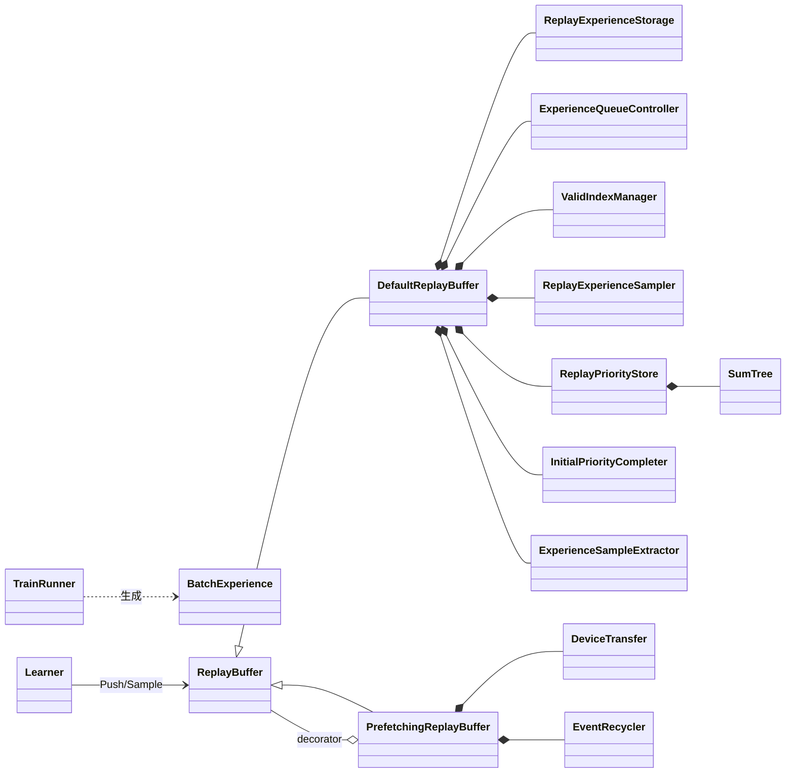
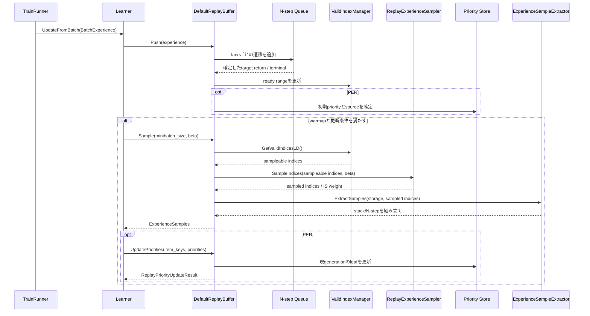
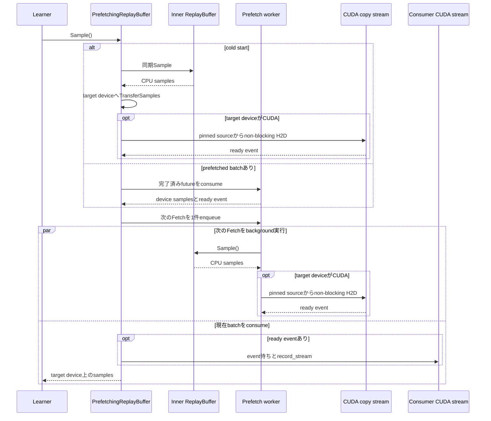

# ReplayBuffer

> 主たる観点: 機能単位（ReplayBuffer。Experienceの蓄積からsample・転送までの処理工程を時系列で併記）

## 1. はじめに

### 1.1 目的

本書は、Envが生成したObservationをExperienceとして保持し、ReplayBufferへ蓄積・sampleし、Learner deviceへ渡すまでのデータ経路を説明する。
N-step、frame stacking、PER、prefetch、非同期H2Dの境界とstorage lifetimeを明確にする。

### 1.2 対象読者

- ReplayBuffer、Learner入力、device転送を変更する開発者
- 学習throughputやmemory使用量を改善する開発者
- PER、prefetch、pipeline実行の順序をレビューする担当者

### 1.3 記載範囲

現行の`BatchExperience`、`ExperienceSamples`、`ReplayBuffer` interface、`DefaultReplayBuffer`、`PrefetchingReplayBuffer`、frame stack、device transferを扱う。
DQN固有のQ値schemaと学習式、MuZero固有buffer、ImageCls dataset/cacheは本書の共通ReplayBuffer仕様へ混在させない。

## 2. 基本概念と外部contract

### 2.1 RunnerからLearnerへ渡すExperience

`BatchExperience`は1回のbatch遷移を表し、概ね次を保持する。

- 現在の`BatchState`
- Actorが生成した`BatchActionInfo`
- laneごとのReward
- 終端を含む次の`BatchState`

RunnerはEnvが再利用するstorageからExperienceを切り離すため、State、Reward、次Stateを必要な境界でcloneする。
`continue_state`はRunnerが次stepへ進むための状態で、ReplayBufferへ保存する終端付き`next_state`とは役割が異なる。

### 2.2 ReplayBuffer公開contract

| 操作 | 現行contract |
|---|---|
| `Push(batch_exp)` | 構築時の`num_envs`と同じlane数を持つ1 step分のExperienceを受け取る。`DefaultReplayBuffer`はObservation、Action、infoを事前確保storageへ即時copyし、N-step確定用の軽量recordをlane別queueへ積む |
| `Sample(out_samples, minibatch_size, beta)` | `Size() >= minibatch_size`を前提に、sample可能transitionからminibatchを作る。不足時はassertで停止し、暗黙に小さいbatchへ変更しない |
| `Size()` | 保存済みraw slot数ではなく、ready rangeへstackのhistory marginを適用し、dummyを除外したsampleable rangeのtransition数を返す |
| `UpdatePriorities(item_keys, priorities)` | PER有効時にgeneration-aware keyへraw priorityを適用し、applied/stale件数を返す。uniform samplerでは更新を行わない |

ReplayBuffer capacityは全laneの合計として指定する。現行実装は`capacity_per_env = capacity / num_envs`とし、`actual_capacity = capacity_per_env * num_envs`へ切り下げ、laneごとに同じ長さのring時間列を持つ。generation keyの基数とSumTree容量には、この`actual_capacity`を使う。

`ExperienceSamples`はObservation、Action、target return、N-step次状態、terminal、N-step長、IS weight、Agent固有infoを持つ。`replay_item_keys`はCPU `int64`、`per_priority_sources`はCPU `int8`のmetadataとしてdevice転送後もCPUへ残す。その他のTensorは`DefaultReplayBuffer`ではstorage device、`PrefetchingReplayBuffer`では指定したtarget device上で返る。

keyは物理indexではなく`generation * actual_capacity + flat_slot_index`であり、ring overwrite後のstale更新を識別する。sample結果のTensor handleとmetadataはcallerが所有する。非同期CUDA転送では転送元payloadをready event完了まで内部で保持し、consumer streamへ`record_stream`して早期再利用を防ぐ。

`ValidIndexManager`はenv laneごとに、未上書きかつN-step/unrollの未来側条件が確定した論理区間をready rangeとして管理する。uniform sampling、PER、`Size()`、可視化accessor、`DumpToLog()`は、ready rangeへring折り返し後のhistory margin（`stack_count - 1`）を適用し、dummy slotを除外したsampleable rangeを共有する。wrap前と`stack_count == 1`ではhistory marginは0である。`InitialPriorityCompleter`とeviction統計は、過去stack履歴を必要としないためready rangeを使う。

### 2.3 Frame stacking

frame stackingには2つの利用箇所がある。

- Actor側の`StackerActionContext`は、行動選択用にlaneごとの直近Observationをstackし、`episode_start`を受けたlaneを初期frameで埋め直す。
- ReplayBufferのsample extractorは、学習用に保存済み時間列からstackを再構成し、起動直後の未書込領域または保存済みterminalによる実episode境界をpaddingする。ring上書きで失われた履歴はepisode境界ではないためpaddingせず、`ValidIndexManager`が該当transitionをsampleable rangeから除外する。

現行`DefaultReplayBuffer::Push`は`BatchState::episode_start`自体を保存・参照しない。このため、直前に`done`/`truncated`を伴わない`episode_start`だけをReplayBufferのstack境界とする動作は、現行production経路の保証に含めない。

### 2.4 PER

Prioritized Experience Replayでは、priorityに応じてindexをsampleし、確率からImportance Sampling weightを計算する。
初期sourceは`fixed_initial`、`max_initial`、`actor_initial`、学習後は`learner_updated`、無効slotは`none`である。priority値0と無効化はsourceで区別する。Actor近似modeでは開始stepの初期priority hintをopaqueな行としてN-step確定まで運び、ready化境界でbootstrap hintと組み合わせる。共通層は列の意味を解釈せず、注入された`InitialPriorityEstimator`がschema検証と推定を行う。true terminalではbootstrap spanを空にし、truncatedは開始hintを検証してからmax初期化へfallbackする。nonfinite hintまたは推定値はDebug buildでfail-fastし、`NDEBUG` buildではmax初期化へfallbackする。DQNの`K = 2` schemaと推定式は[DQN系Agent](200_dqn_agents.jp.md)を参照する。

LearnerはTD error等から新しいpriorityを作り、sample時に返されたkeyへ`UpdatePriorities(item_keys, priorities)`する。更新はbatch全体をpreflightし、負key、generation 0/future、長さ不一致、負またはnonfinite priorityでは部分適用しない。過去generationだけは要素単位で棄却し、戻り値の`ReplayPriorityUpdateResult`がapplied/stale件数とActor初期priority・Learner更新priorityの比較統計を返す。同一keyの重複は入力順のlast-winsである。
uniform samplerではPER固有metricを公開しない。

### 2.5 Agentごとの適用範囲

| Agent | 本書の共通ReplayBuffer |
|---|---|
| `DefaultDQNAgent` | inner `dqn::Learner`が使用する |
| `RainbowAgent` | inner `dqn::Learner`が使用する |
| `MuZeroAgent` | 使用しない。試作実装固有の`MuZeroReplayBuffer`を持つ |
| `ImageClsAgent` | 使用しない。Env/datasetからbatchを直接学習する |

共通interfaceを利用するかどうかは具象Agentが決める。`ReplayBuffer`を全Learnerの必須componentとして扱わない。

## 3. コンポーネント定義

| コンポーネント | 定義 |
|---|---|
| `BatchExperience` | Runnerが1 stepで作るbatch遷移 |
| `ExperienceSamples` | ReplayBufferから抽出しLearnerへ渡すminibatch |
| `ReplayBuffer` | Push、Sample、Size、priority更新と可視化accessorを公開する共通interface |
| `DefaultReplayBuffer` | storage、valid index、sample、N-step/PERを束ねるfacade |
| `ReplayExperienceStorage` | lane別ring storageへObservation、Action、infoを保持する |
| `ExperienceQueueController` | laneごとの遷移からN-step targetを確定する |
| `ValidIndexManager` | 書込状態とN-step/unrollの未来側条件からready rangeを管理し、ring折り返し後のhistory marginとdummy除外を加えたsampleable rangeを全consumerへ提供する |
| `ReplayExperienceSampler` | uniformまたはpriority付きindexを選ぶ |
| `ReplayPriorityStore` / `SumTree` | priority source、leaf、total、weighted sampleを管理する |
| `InitialPriorityCompleter` | N-step確定時にfixed、max、Actor近似の初期priorityを完成させる |
| `ExperienceSampleExtractor` | indexからstack、N-step、next stateをminibatchへ組み立てる |
| `PrefetchingReplayBuffer` | 1-deep sampleとdevice transferを先読みするdecorator |
| `DeviceTransfer` | CPU sampleを同期転送、またはpinned sourceからCUDA copy streamへ転送する |
| `EventRecycler` | CUDAEventと転送元payloadのlifetimeを完了まで保持・再利用する |
| `DictFrameStacker` | ReplayBufferとは独立に、Actor側でkey別の直近Observationをstackする |

## 4. コードマップ

| 領域 | 主なファイル |
|---|---|
| Experience/Replay interface | [rl.hpp](../../core/anet-core/include/anet/rl.hpp) |
| Replay config/factory/prefetch | [replay_buffer.hpp](../../core/anet-core/include/anet/replay_buffer.hpp) |
| Replay内部component | [replay_buffer_impl.hpp](../../core/anet-core/src/replay_buffer_impl.hpp)、[replay_buffer_impl.cpp](../../core/anet-core/src/replay_buffer_impl.cpp) |
| device transfer | [transfer.hpp](../../core/anet-core/include/anet/transfer.hpp)、[transfer.cpp](../../core/anet-core/src/transfer.cpp) |
| frame stack | [stacker.hpp](../../core/anet-core/include/anet/stacker.hpp)、[stacker.cpp](../../core/anet-core/src/stacker.cpp) |
| Runner側Experience生成 | [trainer.cpp](../../core/anet-core/src/trainer.cpp) |
| DQN側利用 | [DQN系Agent](200_dqn_agents.jp.md) |
| test | [replay_buffer_test.cpp](../../core/anet-core/src/replay_buffer_test.cpp) |

## 5. 静的構造

図の`ReplayPriorityStore`、`SumTree`、`InitialPriorityCompleter`はPER有効時だけ構成する。現行DQNではinner LearnerがReplayBufferを直接保持し、外側AgentがそのLearnerのlifetimeを束ねる。具象配置は[DQN系Agent](200_dqn_agents.jp.md)を参照する。

## 6. 処理フロー

### 6.1 PushとSample

### 6.2 1-deep prefetchとCUDA転送

futureを起動する前の`Push`はinnerへ同期委譲する。prefetch中の`Push`はRunner側でstable化済みのBatchExperienceを浅く保持し、同じworker FIFOへwrite-behindするため、現在消費するprefetched batchには反映せず、次のFetchより前に適用する。
`UpdatePriorities`はin-flight fetchとqueued Pushの完了を待ってからinnerへ委譲し、sampleとmutationの順序を固定する。futureは同時に最大1件であり、worker例外はfutureの`get()`または次の同期境界でcallerへ再送出する。

## 7. 設定・lifetime・エラー・性能特性

### 7.1 主な設定

| 設定 | 意味 |
|---|---|
| replay capacity | 全laneを合わせた要求容量。実容量はlane数の倍数へ切り下げる |
| `n_step` / `gamma` | target returnの将来長と割引率 |
| sampler type | uniformまたはprioritized |
| `per_alpha` | priorityをsample確率へ反映する強さ |
| `per_initial_priority` | 新規transitionの初期priority |
| `per_initial_priority_mode` | fixed、max、注入EstimatorによるActor近似の初期化方式 |
| stack count / keys | stackする過去frame数とObservation key |
| MuZero unroll steps | sample時に前方へ取り出す追加step数 |
| prefetch decorator | sampleとtarget device転送の1-deep先読み |

具体的な外部keyは具象Agent ConfigとRun内設定成果物を基準とする。

### 7.2 storage lifetime

- RunnerはEnvの再利用storageからExperienceをcloneして切り離す。
- `DefaultReplayBuffer::Push()`はObservation、Action、infoを内部storageへcopyし、ring overwriteまで保持する。
- real/dummyの各書込みでslot generationを進め、sourceを`none`へ戻してleafを無効化する。SumTree容量とkey基数には丸め後の`actual_capacity`を共通使用する。
- 非同期CUDA転送ではready event完了までpinned sourceを保持する。
- consumer streamで使用するTensorは`record_stream`し、allocatorの早期再利用を防ぐ。
- shutdown時はprefetch workerと未完了eventを回収してからstorageを破棄する。

### 7.3 エラーと並行性

- `Sample()`を呼ぶ側は`Size() >= minibatch_size`を満たすまで更新を開始しない。不足時はReplayBufferがfail-fastする。
- shape、lane数、stack key、index範囲、priority値を境界で検証する。
- background sample/transferの例外はfutureの`get()`または次の同期境界でcallerへ再送出する。
- `DefaultReplayBuffer`はPushをstorageのunique lock、Sampleをshared storage lockとmetadata lock、Sizeとpriority更新をmetadata lockで保護する。並行最適化ではlock順序と決定性を維持する。
- Push、Sample、priority更新の順序を変える最適化では、再現性とstale batchの意味を明示する。
- `ReplayInitialPriorityHint::GetPayloadCpu()`は初回だけpack済み`float32[B,K]`を1本のtensorとして同期D2Hし、同じCPU tensorをcacheする。ReplayBuffer内部は各行を小さなopaque配列へコピーし、Estimatorへ所有権を渡さないspanとして渡す。列schemaは具象Agent側で定義する。

### 7.4 性能

- 現行DQNはReplay storageをCPU上に置き、CUDA学習ではpinned memoryとcopy streamでH2Dを重ねる。
- prefetchの効果はsample/H2D時間とGPU学習時間の比で変わる。必ずprofileで比較する。
- frame stack、N-step、MuZero unrollはsample時の読出し量とmemory帯域を増やす。
- PipelineTrainRunnerとReplay prefetchは別の1-deep overlapであり、同時利用時はどの処理が隠れているかを分けて測る。

### 7.5 可観測性

`ReplayBuffer`は`Module`としてstorageとPERのscalar/Tensor accessorを公開し、`PrefetchingReplayBuffer`はinnerの値を透過的に委譲する。主なkey groupは次のとおりである。

| key group | 内容 |
|---|---|
| `replaybuffer.storage.*` | state、action、target return、next state、terminal、N-step |
| `replaybuffer.per.total` / `values` / `distribution` | priorityの総量、leaf、分布 |
| `replaybuffer.per.*_initial_mass_ratio` | fixed、max、Actor近似を含む初期sourceのmass比率 |
| `replaybuffer.per.actor_completion_*` | Actor近似completionの試行、成功、fallback |
| `replaybuffer.per.priority_update_stale_drop_count` | overwrite済みgenerationとして棄却した累積件数 |
| `replaybuffer.per.last_evicted_never_sampled_ratio` | 直近Pushでsample前にevictされたready slotの比率 |

uniform samplerではPER keyを値0として偽装せず、未対応を`std::nullopt`で表す。metric定義、Event、step軸は[可観測性](140_observability.jp.md)を参照する。

eviction統計はready rangeを基準にする。追い出されるslotはhistory margin期間中すでにsample不可であるため、`last_evicted_never_sampled_ratio`は「sample機会があったのに引かれなかった」件数をmargin分だけ過大に数える近似を含む。sampleable rangeを基準にするとwrap後の追い出しが構造的に0件となるため、margin幅がcapacityに対して十分小さいことを前提に、この近似を監視用途として許容する。

### 7.6 checkpoint

現行の共通ReplayBufferはAgent archiveへserializeされない。DQN系checkpointを読み込んでも、次は新規構築時の状態から始まる。

- storage内容、slot generation、valid index、N-step queue
- SumTree、priority source、Actor hint completion状態
- sampling RNG
- prefetch future、queued Push、copy stream、EventRecycler

加えてDQN側のwarmup latchとPER betaもcheckpoint対象外である。したがって読込後はReplayBufferが空の新しいRunとしてwarmupをやり直し、旧Runと同じsample列や学習stepの連続性を保証しない。DQN archiveの保存対象は[DQN系Agent](200_dqn_agents.jp.md)を参照する。

## 8. テストと拡張時の確認事項

[replay_buffer_test.cpp](../../core/anet-core/src/replay_buffer_test.cpp)には、現行source上で次のtest caseが置かれている。

- multi-envのPush/Sampleとvalid index
- N-step、terminal、frame stack、unroll
- uniform/PER、IS weight、generation-aware key、stale priority更新
- fixed/max/Actor近似の初期priority completionとfallback
- visualization accessor
- concurrent Push/Sample/UpdatePriorities
- CPU/CUDA device transfer
- PrefetchingReplayBufferの決定性、FIFO順序、Push/priority更新との同期、write-behind payloadのlifetime

変更時は公開`ReplayBuffer` contractを保ち、同じseedに対するsample列、PER metadata、CPU path、CUDAが利用可能な場合の非同期pathを確認する。capacityとlane数を変更するtestでは要求容量ではなく`actual_capacity`も確認する。background workerの例外伝播やshutdown順序を変更する場合は、既存test範囲に含まれると仮定せず専用回帰testを追加する。

## 9. 関連文書

現行contractは本書、採用理由はADR、実装時点の要求と作業範囲はmemoを参照する。

- [フレームワーク全体概要](010_framework_overview.jp.md)
- [実行基盤と設定](100_runtime_and_configuration.jp.md)
- [Agentと学習](110_agents_and_learning.jp.md)
- [ニューラルネットワーク](130_neural_networks.jp.md)
- [可観測性](140_observability.jp.md)
- [DQN系Agent](200_dqn_agents.jp.md)
- [sample prefetch ADR](../adr/0005-sample-prefetch-stale-per.md)
- [Actor priority近似 ADR](../adr/0010-actor-priority-mean-q-approx.md)
- [generation-aware item key ADR](../adr/0011-generation-aware-replay-item-key.md)
- [初期priority completion ADR](../adr/0012-replay-initial-priority-hint-completion.md)
- [sample prefetch実装計画](../memo/done/013_sample_prefetch_10prd.md)
- [device transfer実装計画](../memo/done/020_device_transfer_common_part_10prd.md)
- [PER priority transfer実装計画](../memo/done/021_replay_per_priority_transfer_10prd.md)
