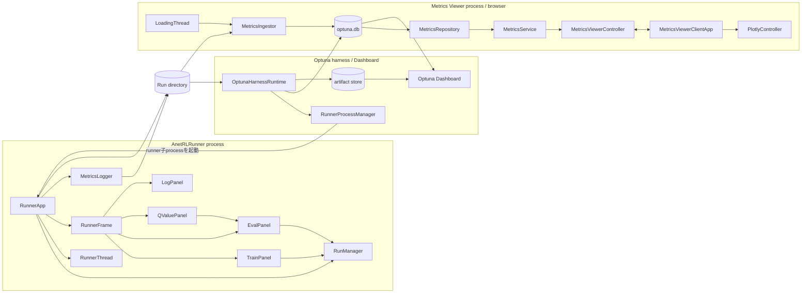
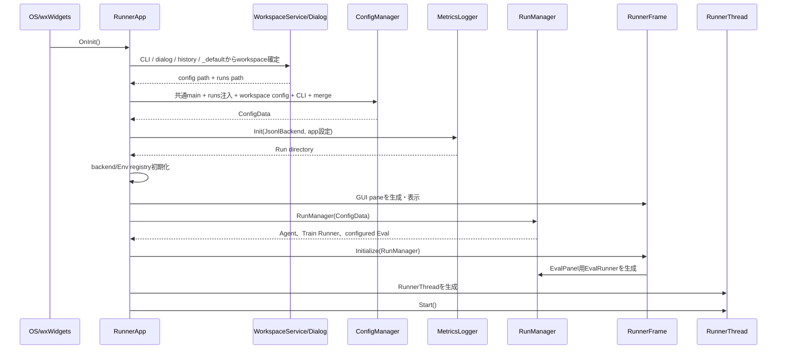
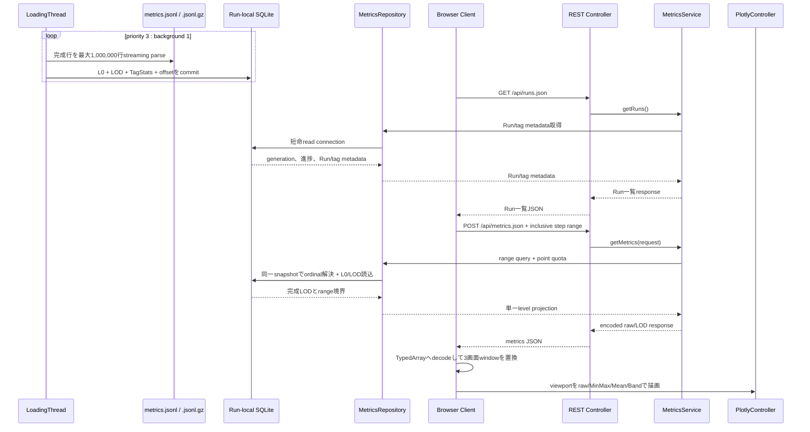
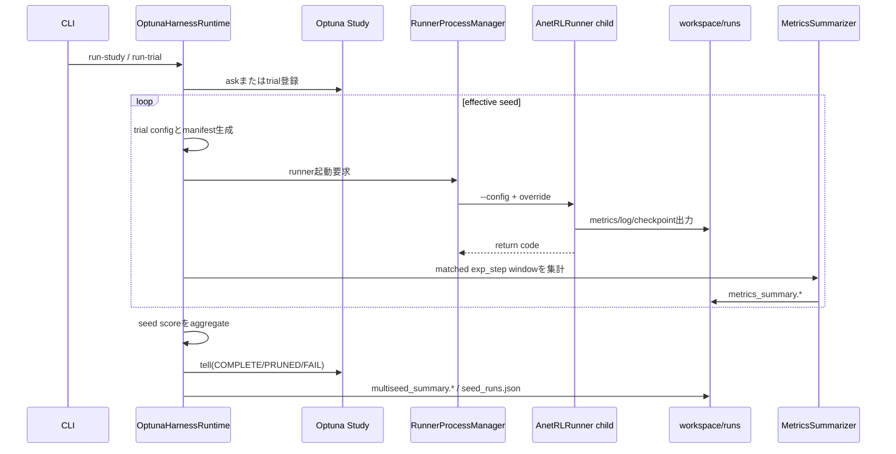

<!-- translated-from: 160_applications_and_tools.jp.md blob:96bf3a422cd1f8baa7c2ab2390af4a732288379f date:2026-09-19 progress:done -->
# Applications and Tools

> Primary perspective: function (Runner GUI, Metrics Viewer, Optuna harness)

## 1. Introduction

### 1.1 Purpose

This document explains the responsibilities, connections, and process boundaries of applications and tools through which people or external processes use ANET's shared runtime. It clarifies how Runner, Metrics Viewer, and Optuna interact loosely through Run directories.

### 1.2 Audience

- Developers changing Runner GUI, analysis tools, or experiment harnesses
- Developers checking lifetimes of UI threads, Trainer threads, background loaders, and runner child processes
- Reviewers of inter-application contracts based on Run artifacts

### 1.3 Scope

This document covers current `apps/runner`, `apps/metrics-viewer`, `apps/runner/tools`, and launchers. See the respective design documents for Agent, Env, learning-loop, and metric-generation internals.
[Metrics Viewer](210_metrics_viewer.en.md) is authoritative for its internal specifications, including cache schema, settings, HTTP APIs, and dependencies; this document covers only process boundaries and connections.

## 2. Component Definitions

### 2.1 ANET RL Runner

| Component | Definition |
|---|---|
| `RunnerApp` | wxWidgets application entry coordinating configuration, RunManager, RunnerThread, GUI, and logging lifecycles. `MetricsLogger` owns the Run directory itself |
| `WorkspaceService` | Shared core application infrastructure managing workspace-path/new-name validation, resolution and creation, MRU, `last_workspace.txt`, configuration composition, and the `app.runs_dir` invariant |
| Workspace selection dialog | Runner-specific GUI selecting history, direct `workspaces/` entries, arbitrary paths, new names, and `workspace.dialog_skip` before startup. Displays WorkspaceService new-name validation immediately below the input and disables OK while invalid |
| `RunnerFrame` | Main window managing menus, status bar, four toolbar panes, and close order. Receives Train-event status snapshots through `UIDataStore` and synchronizes controls/values through `wxUpdateUIEvent`. Base `anet::rl::gui::AuiLayoutFrame` (gui.hpp) absorbs wxAUI constraints: dock-size round trips, transition synchronization, and pane/menu linkage. RunnerFrame owns pane definitions and the 50:50 layout policy. Toggling panes does not resize the window |
| `TrainPanel` | Updates Env-specific Views from Train events and renders snapshots on a GUI timer |
| `EvalPanel` | Drives a dedicated `EvalRunner` by timer or manual Actions and manages cloned-model synchronization |
| `QValuePanel` | Visualizes Eval Actor action candidates and passes selected Actions to `EvalPanel`. Prefers `full_q_quantiles`, then falls back to `q_quantiles` and `q_values` |
| `LogPanel` | Provides on-screen wxLog display and level filtering |
| `DefaultViewFactory` | Creates Train/Eval Views from Env class IDs |
| `ImageProviderManager` | Creates/registers configured image Providers/Observers |
| `RunnerThread` | Separates Train Runner from the UI thread, providing pause/resume/stop |

### 2.2 Metrics Viewer

| Component | Definition |
|---|---|
| `MetricsViewerApplication` | Spring Boot application entry |
| `RunScanner` | Lists Runs directly under the runs directory containing `metrics.jsonl` or `metrics.jsonl.gz` |
| `MetricsCacheDatabase` | Manages per-Run SQLite caches, source fingerprints, generations, and short-lived connections |
| `MetricsIngestor` / `LodIngestWriter` | Streams JSONL/gzip parsing and updates L0, factor-16 LOD, and `TagStats` in one transaction |
| `IngestScheduler` / `LoadingThread` | Allocates one block at a time from actionable Runs to a single writer at priority 3 : background 1, without rechecking terminal/no-op Runs in the same cycle |
| `MetricsRepository` | Builds range resolution, point quotas, and single-LOD projections using short-lived per-Run read snapshots |
| `MetricsService` | Application service providing Run metadata, a range-query semaphore, and priority sets |
| `MetricsViewerController` | REST controller exposing `/api/runs.json`, `/api/metrics.json`, and `/api/runs/prioritize` |
| `MetricsViewerClientApp` | Owns browser Run/tag selection, viewport, Reload, ingestion polling, and rendering generations |
| `DataFetcher` / `DataCache` | Fetches viewport ranges, decodes binary projections, and replaces three-screen windows |
| `PlotlyController` | Renders raw/MinMax/Mean/Band, `TagStats`, signed-log, zoom/pan, and scroll lock |

### 2.3 Optuna Harness and Launchers

| Component | Definition |
|---|---|
| `dropmerge_optuna.py` | Entry script defining the DropMerge domain, CLI, and search parameters |
| `DropMergeDomain` | Domain adapter combining search space, generated configuration, cost, and score tags |
| `OptunaHarnessRuntime` | Shared runtime for dry-run, run-trial, run-study, summary, and cleanup |
| `RunnerProcessManager` | Manages runner child-process startup, timeout, interruption, and termination |
| `MetricsSummarizer` | Aggregates `metrics.jsonl` or `metrics.jsonl.gz` over specified `exp_step` windows |
| Optuna storage/artifact store | Persists trial states/attributes and Dashboard artifacts |
| `compress_workspace_metrics.py` | Inspects completed workspace Runs and migrates each to verified gzip |
| `.bat` launchers | Entry points for Runner, ordinary/Optuna Metrics Viewer, Optuna Dashboard, and workspace metrics compression |

## 3. Code Map

### 3.1 Runner

| Area | Main files |
|---|---|
| Application entry, configuration, logging | [RunnerApp.hpp](../../apps/runner/src/RunnerApp.hpp), [RunnerApp.cpp](../../apps/runner/src/RunnerApp.cpp) |
| Shared workspace infrastructure | [app_util.hpp](../../core/anet-core/include/anet/app_util.hpp), [app_util.cpp](../../core/anet-core/src/app_util.cpp) |
| Workspace selection GUI | [WorkspaceDialog.hpp](../../apps/runner/src/WorkspaceDialog.hpp), [WorkspaceDialog.cpp](../../apps/runner/src/WorkspaceDialog.cpp) |
| Main frame, panes, input operations | [RunnerFrame.hpp](../../apps/runner/src/RunnerFrame.hpp), [RunnerFrame.cpp](../../apps/runner/src/RunnerFrame.cpp) |
| Train View | [TrainPanel.hpp](../../apps/runner/src/TrainPanel.hpp), [TrainPanel.cpp](../../apps/runner/src/TrainPanel.cpp) |
| Eval View, model synchronization | [EvalPanel.hpp](../../apps/runner/src/EvalPanel.hpp), [EvalPanel.cpp](../../apps/runner/src/EvalPanel.cpp) |
| Q values, logs, auxiliary panes | [QValuePanel.cpp](../../apps/runner/src/QValuePanel.cpp), [LogPanel.cpp](../../apps/runner/src/LogPanel.cpp) |
| Runtime integration | [trainer.hpp](../../core/anet-core/include/anet/trainer.hpp), [trainer.cpp](../../core/anet-core/src/trainer.cpp) |
| default config | [apps/runner/config](../../apps/runner/config) |

### 3.2 Metrics Viewer

| Area | Main files |
|---|---|
| Spring entry/config | [MetricsViewerApplication.java](../../apps/metrics-viewer/src/main/java/io/github/kazukin123/anetlab/metricsviewer/MetricsViewerApplication.java), [application.properties](../../apps/metrics-viewer/src/main/resources/application.properties) |
| scan/source identity | [RunScanner.java](../../apps/metrics-viewer/src/main/java/io/github/kazukin123/anetlab/metricsviewer/infra/RunScanner.java), [MetricsSource.java](../../apps/metrics-viewer/src/main/java/io/github/kazukin123/anetlab/metricsviewer/infra/MetricsSource.java) |
| SQLite cache | [MetricsCacheDatabase.java](../../apps/metrics-viewer/src/main/java/io/github/kazukin123/anetlab/metricsviewer/infra/MetricsCacheDatabase.java), [MetricsIngestor.java](../../apps/metrics-viewer/src/main/java/io/github/kazukin123/anetlab/metricsviewer/service/MetricsIngestor.java), [LodIngestWriter.java](../../apps/metrics-viewer/src/main/java/io/github/kazukin123/anetlab/metricsviewer/service/LodIngestWriter.java) |
| scheduling/query | [IngestScheduler.java](../../apps/metrics-viewer/src/main/java/io/github/kazukin123/anetlab/metricsviewer/service/IngestScheduler.java), [LoadingThread.java](../../apps/metrics-viewer/src/main/java/io/github/kazukin123/anetlab/metricsviewer/service/LoadingThread.java), [MetricsRepository.java](../../apps/metrics-viewer/src/main/java/io/github/kazukin123/anetlab/metricsviewer/service/MetricsRepository.java), [MetricsService.java](../../apps/metrics-viewer/src/main/java/io/github/kazukin123/anetlab/metricsviewer/service/MetricsService.java) |
| REST API | [MetricsViewerController.java](../../apps/metrics-viewer/src/main/java/io/github/kazukin123/anetlab/metricsviewer/view/MetricsViewerController.java) |
| browser UI | [index.html](../../apps/metrics-viewer/src/main/resources/static/index.html), [metrics-viewer.js](../../apps/metrics-viewer/src/main/resources/static/metrics-viewer.js), [metrics-viewer.css](../../apps/metrics-viewer/src/main/resources/static/metrics-viewer.css) |

### 3.3 Optuna and Launchers

| Area | Main files |
|---|---|
| DropMerge CLI/domain | [dropmerge_optuna.py](../../apps/runner/tools/dropmerge_optuna.py) |
| Shared harness runtime | [optuna_common.py](../../apps/runner/tools/optuna_common.py) |
| Runner launcher | [10_run.bat](../../apps/10_run.bat) |
| Workspace-aware supporting launchers | [resolve_workspace.bat](../../apps/runner/tools/resolve_workspace.bat), [31_tb_bridge.bat](../../apps/31_tb_bridge.bat), [41_mlflow_bridge.bat](../../apps/41_mlflow_bridge.bat) |
| Metrics Viewer launcher | [22_metrics_viewer_java.bat](../../apps/22_metrics_viewer_java.bat) |
| Dashboard launcher | [23_optuna_dashboard.bat](../../apps/23_optuna_dashboard.bat) |
| Detailed operating specification | [optuna.md](optuna.md) |

## 4. Static Structure

Runner does not connect directly to Viewer or Dashboard. Run directories, Optuna DB, and artifact store form process contracts, allowing another process to inspect appended metrics while training continues.

## 5. Processing Flows

### 5.1 Runner Startup

GUI runs on the main thread; Train Runner runs on `RunnerThread`. TrainPanel updates View data on Train events and obtains rendering snapshots on a GUI timer. EvalPanel drives an independent EvalRunner with an ordinary `BatchEnv` one step at a time on the GUI timer, separate from configured background eval using `EvalSessionEnv`. Forced Actions and existing model synchronization remain on the EvalPanel side. Every Agent explicitly specifies the referenced Eval tag in `app.eval_panel.eval_config_tag`, applying that tag's `run_mode`, `env.*`, and `actor` reference to a separate instance. If `actor` is omitted, the tag name is used. The shared default references tag `eval_panel` and its same-named dedicated Actor: target-net Greedy for DQN (ε=0 for Rainbow), temperature 0 without search noise for MuZero, and highest-score selection for ImageCls. Display Env settings inherit standard evaluation tags and apply Env-specific overrides. They can change independently of periodic evaluation policy. Undefined Eval tags or Actor references fail fast.

RunnerFrame places Run Control, Steps, Run Operations, and Panels toolbars at the top as wxAUI panes; Reset Layout restores Row 0. Grippers use only standard `wxAuiToolBar` rendering enabled by `AddPane()`. After reapplying `ToolbarPane()` during Reset Layout, the pane is restored to `Gripper(false)` to avoid duplicating the built-in gripper. Button background, hover, and checked colors use standard wxWidgets art/system colors. Standard separators follow Train toggle and separate exp/train; step counts use separate selectable, copyable read-only text controls. A 200 ms `wxUpdateUIEvent` rebuilds controls from actual state, allowing shortcuts, automatic pause, menus, and pane closes to converge despite separate paths. Status-snapshot updates bind to RunnerFrame's own update event, separate from Train-toggle enable/check updates. Steps, SPS, and elapsed time form one snapshot inside the Trainer-thread Train Observer callback, passed to the main thread through request-driven `UIDataStore` with forced-update interval 0. The main thread never directly reads mutable TrainRunner counts, EMA, or start time. Detachment retains and specifies the `RunnerScopedTrainObserver` wrapper itself held by Notifier.

Supporting launchers resolve workspace in order from the first argument, `GetAppDataDir()/last_workspace.txt`, then `_default`, passing only the selected `runs/` to DOT/MP4/TensorBoard/MLflow tools. Resolution requires only an existing workspace root and `runs/`, not `config/_main.txt`. Launchers create neither workspace nor `runs/`. MLflow DB resides at `<workspace>/runs/mlflow.db` as the limited exception in ADR 0022.

### 5.2 Metrics Viewer Ingestion and Viewport Range Updates

HTTP requests read SQLite snapshots committed by the background writer, never the Metrics master directly.
Each range is independent of previous responses; the client replaces a three-screen window comprising the viewport and one screen on each side.
Fully validated `ready` / `error` Runs bypass content, fingerprints, and SQLite while source/cache attributes remain unchanged. Cycles without immediately actionable `converting` backlog sleep for 10 seconds.
While any Run is ingesting, metadata polling every four seconds updates only progress. Auto Reload refetches metadata every 30 seconds and updates ranges only for series following the latest step.

### 5.3 Optuna Multi-Seed Trials

`run-study` manages runner children itself rather than spawning a `run-trial` child for each trial. Seeds execute sequentially within one trial; `--n-jobs > 1` advances multiple parameter candidates in parallel.

## 6. Entry Points and Operating Boundaries

| Purpose | Entry point | Default output/URL |
|---|---|---|
| GUI Run | `apps/10_run.bat [--workspace <path>]` | `<workspace>/runs` |
| Ordinary Run visualization | `apps/22_metrics_viewer_java.bat` | `http://localhost:8082` |
| Optuna study/artifacts | `apps/23_optuna_dashboard.bat <workspace_path>` | `<workspace>/optuna`, `http://127.0.0.1:8088` |
| DropMerge search | `.venv\Scripts\python.exe apps\runner\tools\dropmerge_optuna.py run-study --workspace <path> ...` | `<workspace>/runs`, `<workspace>/optuna` |

- Ordinary Runner selects a workspace and accepts experiment differences as trailing `key=value` overrides. `--config` is reserved for self-contained startup without workspaces.
- Viewer defaults to parent directory `apps/runner/workspaces`; its selector changes current workspace. Override the parent with `--metricsviewer.workspaces-dir`.
- Optuna harness preflights an existing workspace and `config/_main.txt`, fixing Runs under `runs/` and SQLite storage, artifacts, and harness logs under `optuna/`. Run-related output overrides are allowed only beneath the selected workspace's `optuna/`.
- Optuna harness uses Python from repository-root `.venv`.
- Viewer frontend has no build step and loads only Plotly from a CDN as an external dependency. Fully offline environments need another asset-delivery method.

## 7. Lifetimes, Errors, and Performance

### 7.1 Runner

- `RunnerApp` holds `RunManager`, `RunnerThread`, and Frame, coordinating logger initialization, flush, and shutdown. `MetricsLogger` owns Run directory and `run_dir_`. `app.show_error_dialog` defaults to `true`; online configuration resolves to `true`, batchrun to `false`. Code does not infer configuration names.
- In batchrun configuration, immediately after resolving `ConfigData`, the default GUI logger switches to app-owned `wxLogStderr`. Output goes to parent stderr before Run creation, `stderr.log` after standard-stream startup, and the existing Run log after regular logger construction. Active targets remain valid during partial initialization and shutdown. Online configuration retains error dialogs.
- Close order remains Train stop, `agent_close.anet` save, log/metrics flush, EvalPanel detach, and AUI destruction. `app.save_agent_on_close=false` skips only saving. Save failures on close are reported through the shared error reporter before continuing cleanup. Save/Open Run Folder failures are non-fatal and do not change Run continuation or process exit status.
- Contract-violation exceptions in GUI callbacks flush English error logs through the shared reporter and end the main loop; Trainer-thread exceptions transfer the current exception to the main thread. Both exception callbacks set a main-thread-owned fatal latch. `RunnerApp::OnRun()` preserves wxWidgets' nonzero result, or returns 1 if the original result was 0 but a fatal error occurred. `OnExit()` performs cleanup only.
- Train-panel FPS controls rendering only; 0 stops its timer while training continues. Eval-panel FPS controls the GUI timer advancing EvalRunner, affecting evaluation speed itself. Runtime FPS selections are not written back to config dumps.
- `DefaultDQNAgent::Save` holds Agent's shared mutex throughout serialization. Runtime Save excludes Learner's unique lock without pausing Train in the UI. `RunnerApp::SaveAgent` reports open, serialization, flush, and close failures as path-bearing exceptions; RunnerFrame decides whether the UI continues. Incomplete files are not automatically deleted.

### 7.2 Metrics Viewer

- `MetricsService` starts LoadingThread at `@PostConstruct` and waits up to 30 seconds for shutdown at `@PreDestroy`.
- `WorkspaceManager` holds current workspace as an epoch-bearing snapshot, leasing it to APIs and ingest cycles. Switching is serialized by the ingest gate; old-snapshot gzip sessions close when their last lease is released.
- Mismatched source kind, size, mtime, or head/pre-commit hashes discard SQLite cache and rebuild with a new generation.
- `TagStats` covers all committed L0 points; LOD consists only of completed sets of 16 children, maintained independently of viewport queries.
- Reload/Auto Reload rebuild Plotly DOM, so client app owns page state such as selected tags, LOD mode, signed-log, and scroll lock.
- Default series budgets, request-wide budgets, LOD page-cache capacity, and query concurrency are configured in `application.properties`.
- Active gzip ingestion retains source streams between blocks, so moving that Run folder is unsupported during ingestion.

### 7.3 Optuna

- To interrupt, send `Ctrl+C` once first, letting the harness stop runners and update trial states.
- SQLite with `--n-jobs > 1` can cause lock contention and GPU performance interference.
- DB records and Run folders have separate lifetimes. Deleting a Run folder leaves its Optuna trial and stale saved paths.
- Summary studies are for browsing and do not modify source studies.

## 8. Tests and Change Checks

- Runner UI changes: check Frame close order, toolbar dock/float/reset, pane/menu/toolbar linkage, Train/Eval inputs, model synchronization, FPS, status snapshots, and SVG replacement on theme changes.
- Metrics Viewer backend changes: run integration tests for SQLite/source identity, ingestion/LOD, range APIs, scheduler, and query concurrency.
- Metrics Viewer UI changes: use `RunListPlaywrightTest`, `TagListPlaywrightTest`, `MetricsPlotPlaywrightTest`, `GraphInteractionPlaywrightTest`, and `SignedLogPlaywrightTest` to check Run/Tag operations, viewport refinement, LOD modes, stale responses, Reload, Plotly state, and mobile gestures by concern.
- Optuna changes: check dry-run, a short run-trial, artifact/DB state, and interrupt cleanup.
- Inter-process contract changes: verify old Run artifacts remain readable, or document explicit migration/non-goals.

## 9. Related Documents

- [Run Execution User Guide](020_user_guide_run.en.md)
- [Run Analysis User Guide](030_user_guide_analysis.en.md)
- [Development Environment](040_development_environment.en.md)
- [Runtime Infrastructure and Configuration](100_runtime_and_configuration.en.md)
- [Agents and Learning](110_agents_and_learning.en.md)
- [Environments](120_environments.en.md)
- [Observability](140_observability.en.md)
- [DQN Agents](200_dqn_agents.en.md)
- [Metrics Viewer](210_metrics_viewer.en.md)
- [DropMerge Optuna Guide](optuna.md)
