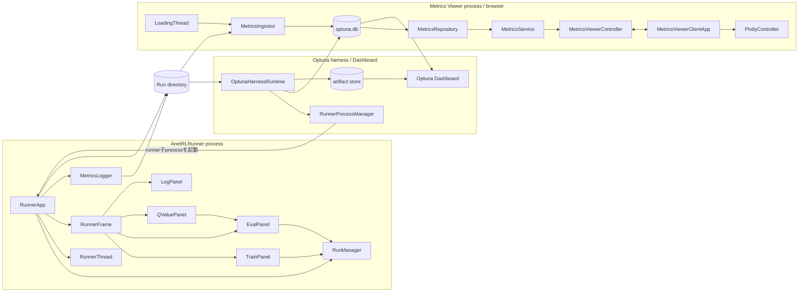
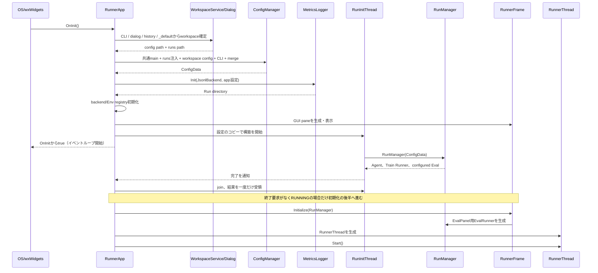
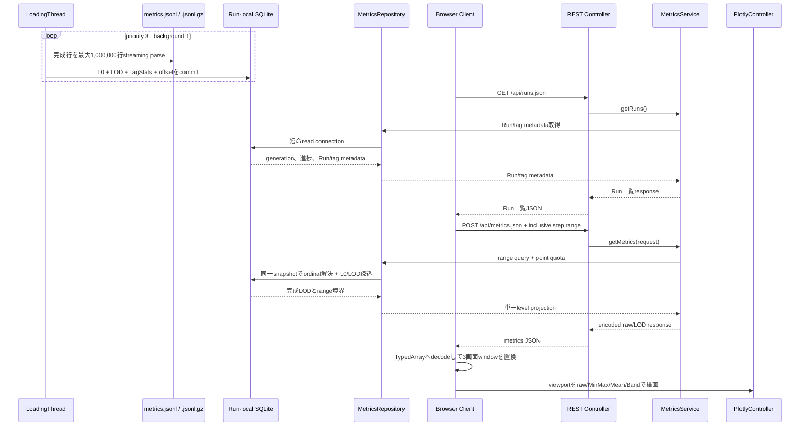
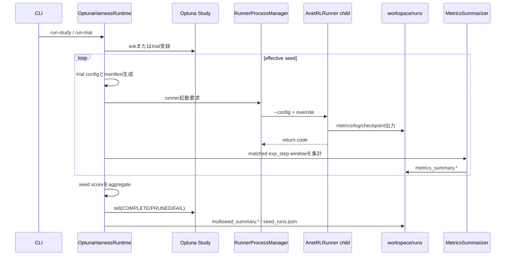

<!-- translated-from: 160_applications_and_tools.jp.md blob:3d5bf542629044a246d551cc448c1a956fe1bb1e date:2026-11-04 progress:done -->
# Applications and Tools

> Primary perspective: function (Runner GUI, Metrics Viewer, Optuna harness)

## 1. Introduction

### 1.1 Purpose

This document explains the responsibilities, connections, and process boundaries of applications and tools through which people or external processes use ANET's shared runtime. It clarifies how Runner, Metrics Viewer, and Optuna interact loosely through Run directories.

### 1.2 Audience

- Developers changing Runner GUI, analysis tools, or experiment harnesses
- Developers checking lifetimes of UI threads, Trainer threads, background loaders, and runner child processes
- Reviewers of inter-application contracts based on Run artifacts

### 1.3 Scope

This document covers current `apps/runner`, `apps/metrics-viewer`, `apps/runner/tools`, and launchers. See the respective design documents for Agent, Env, learning-loop, and metric-generation internals.
[Metrics Viewer](210_metrics_viewer.en.md) is authoritative for its internal specifications, including cache schema, settings, HTTP APIs, and dependencies; this document covers only process boundaries and connections.

## 2. Component Definitions

### 2.1 ANET RL Runner

| Component | Definition |
|---|---|
| `RunnerApp` | wxWidgets application entry coordinating configuration, RunManager, RunnerThread, GUI, and logging lifecycles. `MetricsLogger` owns the Run directory itself |
| `WorkspaceService` | Shared core application infrastructure managing workspace-path/new-name validation, resolution and creation, MRU, `last_workspace.txt`, configuration composition, and the `app.runs_dir` invariant |
| Workspace selection dialog | Runner-specific GUI selecting history, direct `workspaces/` entries, arbitrary paths, new names, and `workspace.dialog_skip` before startup. Displays WorkspaceService new-name validation immediately below the input and disables OK while invalid |
| `RunnerFrame` | Main window managing menus, status bar, four toolbar panes, and close order. Receives Train-event status snapshots through `UIDataStore` and synchronizes controls/values through `wxUpdateUIEvent`. Base `anet::rl::gui::AuiLayoutFrame` (gui.hpp) absorbs wxAUI constraints: dock-size round trips, transition synchronization, and pane/menu linkage. The current Centre pane keeps its role until hidden or floated, when its docked partner takes over. A hidden owner returning docked with Centre information reclaims it; a pane docked at an edge stays there. A Centre main pane and its partner alone in a Left/Right dock divide the main width equally; a Top/Bottom band of the same width as Centre divides their combined height equally. Main-pane placement changes also apply the policy through the 200 ms UPDATE_UI. The Centre main pane's caption ends with `[Centre]`. A shared predicate prevents hiding or pin-floating the last main pane; the existing 200 ms UPDATE_UI applies ownership rules and declares close, pin, and floating flags from state. Unknown paths leaving no docked main pane restore Train to Centre; two Centre panes move Eval aside. Both repairs emit a warning. Toggling panes does not resize the window |
| `anet::rl::gui::Panel` | Shared base for Env Views and other panels. Adds `wxFULL_REPAINT_ON_RESIZE` even to explicit constructor styles, so resizing redraws the entire surface while updates are stopped. Views need no individual flag; separate wxGLCanvas windows retain their own settings |
| `TrainPanel` | Updates Env-specific Views from Train events and renders snapshots on a GUI timer |
| `EvalPanel` | Drives a dedicated `EvalRunner` by timer or forced actions and manages cloned-model synchronization |
| `QValuePanel` | Visualizes Eval Actor action candidates and passes selected Actions to `EvalPanel`. Prefers `full_q_quantiles`, then falls back to `q_quantiles` and `q_values` |
| `LogPanel` | Provides on-screen wxLog display and level filtering. Includes colors for WARN or higher and VERBOSE, subdued timestamps, unviewed WARN/ERROR counts, and controls for Auto-scroll, Wrap, Indent, Copy all, Clear, and search |
| `DefaultViewFactory` | Creates Train/Eval Views from Env class IDs |
| `ImageProviderManager` | Creates/registers configured image Providers/Observers |
| `RunnerThread` | Separates Train Runner from the UI thread, providing pause/resume/stop |

### 2.2 Metrics Viewer

| Component | Definition |
|---|---|
| `MetricsViewerApplication` | Spring Boot application entry |
| `RunScanner` | Lists Runs directly under the runs directory containing `metrics.jsonl` or `metrics.jsonl.gz` |
| `MetricsCacheDatabase` | Manages per-Run SQLite caches, source fingerprints, generations, and short-lived connections |
| `MetricsIngestor` / `LodIngestWriter` | Streams JSONL/gzip parsing and updates L0, factor-16 LOD, and `TagStats` in one transaction |
| `IngestScheduler` / `LoadingThread` | Allocates one block at a time from actionable Runs to a single writer at priority 3 : background 1, without rechecking terminal/no-op Runs in the same cycle |
| `MetricsRepository` | Builds range resolution, point quotas, and single-LOD projections using short-lived per-Run read snapshots |
| `MetricsService` | Application service providing Run metadata, a range-query semaphore, and priority sets |
| `MetricsViewerController` | REST controller exposing `/api/runs.json`, `/api/metrics.json`, and `/api/runs/prioritize` |
| `MetricsViewerClientApp` | Owns browser Run/tag selection, viewport, Reload, ingestion polling, and rendering generations |
| `DataFetcher` / `DataCache` | Fetches viewport ranges, decodes binary projections, and replaces three-screen windows |
| `PlotlyController` | Renders raw/MinMax/Mean/Band, `TagStats`, signed-log, zoom/pan, and scroll lock |

### 2.3 Optuna Harness and Launchers

| Component | Definition |
|---|---|
| `dropmerge_optuna.py` | Entry script defining the DropMerge domain, CLI, and search parameters |
| `DropMergeDomain` | Domain adapter combining search space, generated configuration, cost, and score tags |
| `OptunaHarnessRuntime` | Shared runtime for dry-run, run-trial, run-study, summary, and cleanup |
| `RunnerProcessManager` | Manages runner child-process startup, timeout, interruption, and termination |
| `MetricsSummarizer` | Aggregates `metrics.jsonl` or `metrics.jsonl.gz` over specified `exp_step` windows |
| Optuna storage/artifact store | Persists trial states/attributes and Dashboard artifacts |
| `compress_workspace_metrics.py` | Inspects completed workspace Runs and migrates each to verified gzip |
| `.bat` launchers | Entry points for Runner, ordinary/Optuna Metrics Viewer, Optuna Dashboard, and workspace metrics compression |

## 3. Code Map

### 3.1 Runner

| Area | Main files |
|---|---|
| Application entry, configuration, logging | [RunnerApp.hpp](../../apps/runner/src/RunnerApp.hpp), [RunnerApp.cpp](../../apps/runner/src/RunnerApp.cpp) |
| Shared workspace infrastructure | [app_util.hpp](../../core/anet-core/include/anet/app_util.hpp), [app_util.cpp](../../core/anet-core/src/app_util.cpp) |
| Workspace selection GUI | [WorkspaceDialog.hpp](../../apps/runner/src/WorkspaceDialog.hpp), [WorkspaceDialog.cpp](../../apps/runner/src/WorkspaceDialog.cpp) |
| Main frame, panes, input operations | [RunnerFrame.hpp](../../apps/runner/src/RunnerFrame.hpp), [RunnerFrame.cpp](../../apps/runner/src/RunnerFrame.cpp) |
| Train View | [TrainPanel.hpp](../../apps/runner/src/TrainPanel.hpp), [TrainPanel.cpp](../../apps/runner/src/TrainPanel.cpp) |
| Eval View, model synchronization | [EvalPanel.hpp](../../apps/runner/src/EvalPanel.hpp), [EvalPanel.cpp](../../apps/runner/src/EvalPanel.cpp) |
| Q values, logs, auxiliary panes | [QValuePanel.cpp](../../apps/runner/src/QValuePanel.cpp), [LogPanel.cpp](../../apps/runner/src/LogPanel.cpp) |
| Runtime integration | [trainer.hpp](../../core/anet-core/include/anet/trainer.hpp), [trainer.cpp](../../core/anet-core/src/trainer.cpp) |
| default config | [apps/runner/config](../../apps/runner/config) |

For manual discrete Actions, EvalPanel checks the ActionSpec retained at initialization. Out-of-range input displays the requested value and valid range in English in status field 0 without writing to the Run log. Rejection precedes Live restoration and model synchronization, preserving the environment, step counts, and Trace selection. Both EvalRunner constructors also retain the target environment's ActionSpec; directly supplied out-of-range forced Actions fail fast before Reset, Actor execution, or Step. Validation does not retrieve EnvSpec again.

### 3.2 Metrics Viewer

| Area | Main files |
|---|---|
| Spring entry/config | [MetricsViewerApplication.java](../../apps/metrics-viewer/src/main/java/io/github/kazukin123/anetlab/metricsviewer/MetricsViewerApplication.java), [application.properties](../../apps/metrics-viewer/src/main/resources/application.properties) |
| scan/source identity | [RunScanner.java](../../apps/metrics-viewer/src/main/java/io/github/kazukin123/anetlab/metricsviewer/infra/RunScanner.java), [MetricsSource.java](../../apps/metrics-viewer/src/main/java/io/github/kazukin123/anetlab/metricsviewer/infra/MetricsSource.java) |
| SQLite cache | [MetricsCacheDatabase.java](../../apps/metrics-viewer/src/main/java/io/github/kazukin123/anetlab/metricsviewer/infra/MetricsCacheDatabase.java), [MetricsIngestor.java](../../apps/metrics-viewer/src/main/java/io/github/kazukin123/anetlab/metricsviewer/service/MetricsIngestor.java), [LodIngestWriter.java](../../apps/metrics-viewer/src/main/java/io/github/kazukin123/anetlab/metricsviewer/service/LodIngestWriter.java) |
| scheduling/query | [IngestScheduler.java](../../apps/metrics-viewer/src/main/java/io/github/kazukin123/anetlab/metricsviewer/service/IngestScheduler.java), [LoadingThread.java](../../apps/metrics-viewer/src/main/java/io/github/kazukin123/anetlab/metricsviewer/service/LoadingThread.java), [MetricsRepository.java](../../apps/metrics-viewer/src/main/java/io/github/kazukin123/anetlab/metricsviewer/service/MetricsRepository.java), [MetricsService.java](../../apps/metrics-viewer/src/main/java/io/github/kazukin123/anetlab/metricsviewer/service/MetricsService.java) |
| REST API | [MetricsViewerController.java](../../apps/metrics-viewer/src/main/java/io/github/kazukin123/anetlab/metricsviewer/view/MetricsViewerController.java) |
| browser UI | [index.html](../../apps/metrics-viewer/src/main/resources/static/index.html), [metrics-viewer.js](../../apps/metrics-viewer/src/main/resources/static/metrics-viewer.js), [metrics-viewer.css](../../apps/metrics-viewer/src/main/resources/static/metrics-viewer.css) |

### 3.3 Optuna and Launchers

| Area | Main files |
|---|---|
| DropMerge CLI/domain | [dropmerge_optuna.py](../../apps/runner/tools/dropmerge_optuna.py) |
| Shared harness runtime | [optuna_common.py](../../apps/runner/tools/optuna_common.py) |
| Runner launcher | [10_run.bat](../../apps/10_run.bat) |
| Workspace-aware supporting launchers | [resolve_workspace.bat](../../apps/runner/tools/resolve_workspace.bat), [31_tb_bridge.bat](../../apps/31_tb_bridge.bat), [41_mlflow_bridge.bat](../../apps/41_mlflow_bridge.bat) |
| Metrics Viewer launcher | [22_metrics_viewer_java.bat](../../apps/22_metrics_viewer_java.bat) |
| Dashboard launcher | [23_optuna_dashboard.bat](../../apps/23_optuna_dashboard.bat) |
| Detailed operating specification | [optuna.md](optuna.md) |

### 3.4 Evaluation Trace

`EvalTracePanel` is a single permanent pane in the rightmost column, shown from the View menu or Panels toolbar and hidden by default. Rows default to descending step order, newest at the top; clicking a column header toggles numerical descending/ascending order. Nonzero-reward and terminal rows are colored. `max_rows` defaults to 1000 and `pct_window` to 10000; both require integers of at least 1. While explicitly closed, the subscription remains attached but generation is skipped. Reopening clears history, percentile windows, and diagnostic windows. When another pane is maximized, `IsPaneOpen` consults `savedHiddenState` and treats the temporarily hidden pane as open, continuing Trace and follower-pane snapshot capture, selection, and diagnostics. Menu checks use the same rule; explicit opening/closing during maximization synchronizes restoration flags.

Column widths start from headers and standard padding, then expand by measuring only newly displayed values and newly resolved delayed columns. No full retained-history scan runs on each step, and shorter replacements or removal of old rows do not shrink columns. Manually resized columns stop automatic changes until explicit reopening resets widths and history. Theme, font, and DPI changes are followed. Minimum width is the larger of the entire control bar and the current total width through the first action column, including padding and the vertical scrollbar. Without an action column, only the bar determines it; continuous actions use the first dimension-specific action column. Width/appearance changes update this limit, which docking, floating, and Runner width reduction also respect. Remaining columns scroll horizontally. Normal cells, headers, borders, and selection use system colors. Light green overlays indicate nonzero reward and light orange indicates termination, with termination taking precedence. Selection background and text take precedence over row highlighting. Row selection never highlights column headers, whose system colors remain unchanged between Live and Trace. Coloring has no configuration options.

The control bar contains six icons in order: Play/Pause toggle, Stop, Step back, Step forward, Slower, and Faster, followed by a slider and speed label. It shares 16-DIP symbols and system text colors with the main toolbar; wx handles disabled appearance. Step forward is a right triangle to the right of a vertical bar; step back is a left triangle with a vertical bar to its right. Main Eval Step uses the same forward symbol. In Trace, a 2-DIP red border surrounds the whole bar and persists during playback, pause, and row selection. Border space is always reserved to avoid layout movement, and the border disappears on return to Live. Trace captions and ordinary active/inactive colors remain available.

`TraceFollower` is the shared interface for snapshot creation through `CreateTraceSnapshot`, snapshot display, and return to Live, implemented by EvalPanel's View, QValuePanel, and Conv2d. The interface and playback/display helpers live in core gui.hpp/cpp; row generation depends on the metrics functional group. Alongside immutable snapshots for panes open at the time, history retains Tensor references to the pre-transition state, shared references to action_info and step_result, counts, Runner/Env/Agent names, and notification-time forced status for dumps. Row deletion and pane closure release them. Conv2d retains CPU activations and renders images upon selection. Rows from before a pane was opened show `no data for this step`. SweepHeatMap is not a follower.

Selecting a row enters Trace mode and stops EvalPanel. For row t, Eval View shows the post-transition state, while Q/Conv2d shows decision-time values, with `Trace: step` in the caption. `gui::TracePlayer` controls playback independently of interactive wx operations. `gui::AppendTracePercentile` and `gui::FormatTraceValue` belong to the same functional group. Formatting is computed by a GUI function receiving a column specification, value, and action information, rather than by a method on the column specification. TracePlayer receives row IDs in playback order from the bottom of the table to the top. Playback starts at the bottom in Live or at the selected row in Trace, advances upward, and stops at the top. Only starting while stopped at the top returns to the bottom. Forward/backward stepping stops at either end. Forward from Live enters Trace at the top and shows `Trace: end`. Backward from Live selects the second row from the top and shows `Trace: step back`, or the only row with `Trace: start`. Speeds range from 1/8 to 8 times; 1x is Eval fps×step_per_frame. Speed labels and status notifications use x0.125, x0.25, x0.5, x1, x2, x4, and x8.

Stop, Esc in the table, manual actions, Eval Resume, or explicitly closing Trace through its close button, menu, toolbar, or Reset Layout returns to Live. Returning alone does not resume Eval. Manual actions execute after returning to Live. Empty history disables controls and the slider. At FPS 0, `CanPlay` disables only the play button, reflecting changes at the next UI timer. Already active playback keeps Pause enabled, makes no progress at speed 0, and continues when FPS returns. Operation results appear in English in status field 0 without entering the Run log.

`manager.Update()` runs on entry to Trace, return to Live, follower-pane visibility changes, or when column/appearance changes increase minimum width beyond the actual pane width. Ordinary row additions, selections, and ticks do not relayout for minimum-size handling when that limit is unchanged. Row movement updates captions and requests frame redraw; floating frame titles are also updated directly. Instrumentation separates `EvalTracePanel::ApplySelection.layout` / `ReturnToLive.layout` and `RefreshCaptions`, with minimum-width changes measured by `UpdateMinimumSize`.

Numbers display as integers when integral and otherwise with four significant digits; nonfinite values are blank. When a column resolves, `display:pct` computes and retains `100*(count below + count equal/2)/count` once over the recent finite-value window including itself. All-equal values yield 50%. Immediate columns are processed on row addition; delayed columns when `StepTrace.value_ready` becomes true, including resolution to NaN. Rows already evicted from display update percentile windows only for columns specified by the update notification. Partial updates never insert previously resolved values twice. The GUI does not recognize Agent-specific keys. Default `Q_sa`, `V_s`, and `trunc` headers use configuration `label:` without changing source keys or values. Default order is step, ep_step, action, reward, forced, done, trunc, Q_sa, V_s, prio, prio_pct, keeping action beside reward.

Sorting belongs to `TraceRowSorter` in gui.hpp/cpp and compares numerical display values. Percentile columns use retained percentiles; action columns use action numbers. Pending and nonfinite values always sort to the bottom; ties use descending step order. The default is descending actual step. New and newly resolved rows are reinserted at their sorted positions, but retention always keeps the newest max_rows by step; sorting does not change percentile windows. Selection IDs and playback state are retained, and the selected row is brought into view. Live keeps the top visible. Dragging column widths does not sort; double-clicking a header counts as two sorts. Reopening resets sorting too.

Trace mode is determined by whether TracePlayer has a selection. RunnerFrame routes ↑↓ forwarded by anet Panels to EvalTracePanel row movement and consumes ←→. Movement emits no notification. Arrow keys used by the table, log field, or slider are not intercepted. Forwarded arrows in Live, and numpad keys, QValue clicks, Ctrl, and Space in either mode, retain their behavior. After a successful valid forced step, EvalPanel writes `Forced action: number:name` to status field 0. A Step without an explicit action emits neither this notification nor a Run-log entry. EvalRunner's lane-specific `forced` starts at 0, becomes 1 for a forced step or 0 for an ordinary step, and is finalized before notification.

Double-clicking a row selects it and dumps notification contents. GUI-independent `TraceDumpFormatter` produces one INFO line beginning `Trace dump step=... lane=...:` and one multiline VERBOSE entry. INFO contains all columns in table format (pending for unresolved values), names, every counts field, executed action, forced status, reward, terminal flags, action_info info/aux, and step_result aux. Notification fields are included regardless of column configuration. Single-element Tensors show their value; multi-element and empty Tensors show only shape, dtype, and original device; undefined Tensors show undefined. VERBOSE extends existing state/action-info/Step-result stringification with info and the opaque Replay initial-priority hint. Transfers and stringification occur only on dump, copying GPU contents to the CPU. Follower-pane snapshots are excluded. Existing log-level handling is retained.

The [PRD094 validation resources](../../core/anet-core/testdata/prd094/README.md) define acceptance procedures for pane synchronization, player behavior, speed, and memory. [PRD105 validation assets](../../core/anet-core/testdata/prd105/README.md) cover arrows, forced status, sorting, playback order, dumps, and learning-value comparisons across four Envs.

### 3.5 Logs

`LogPanel` occupies the lower Logs pane with a control bar above a RichEdit (`wxTE_RICH2`) log field. Settings belong to `app.log_panel.*`. The initial display level comes from `app.log_panel.level` and does not affect the Run log file. Auto-scroll, Wrap, and Indent use `app.log_panel.auto_scroll`, `app.log_panel.wrap`, and `app.log_panel.indent` (all `true` in shared configuration), applied at construction through the same paths as button presses. The View menu's Log Level check follows the level read by LogPanel. From left to right, the bar contains unviewed alerts, Auto-scroll, Wrap, Indent, Copy all, unread-line count, an expanding search field, Older/Newer match, and Clear log. Alert and unread fields are hidden at zero. Alerts occupy the left edge and shift the remaining controls left when absent. Unread count sits immediately before search, changing only search width without moving controls such as Auto-scroll. Clear stays at the far right to reduce accidental use; wx has no standard trash icon, so it uses a system-text-colored SVG like playback buttons. Operations do not use the status bar.

`LogPanel::Target` derives from wxLog, filters by display level, and passes the timestamp separately from the body (`[I] message`) to `AppendRecord`. Timestamp formatting matches wx `TimeStampMS` with only its trailing `: ` removed; the panel separates it from the body with one space, without changing Run-log formatting. Debug and Trace use base formatting and go to debug output. The Run log's `wxLogChain` retains this target as its previous target, so it is not replaced. Separator newlines precede the next record, leaving no trailing blank line.

FATAL/ERROR, WARN, and VERBOSE bodies are colored. Regardless of level, each timestamp uses a lighter blue-gray than the body to distinguish records even when wrapped. Light/dark colors follow log-field background brightness. Theme notifications recolor all lines, first colored bodies and then timestamps.

Appending preserves the user's selection. With Auto-scroll (default ON) OFF, it also preserves the first visible character and horizontal position. Turning it ON jumps to the end. This state is not saved.

`+N` counts lines received while Auto-scroll is stopped that have not yet appeared on screen, providing a way to read at the user's pace. Line-start positions are retained oldest first; starts shown through the bottom visible line become read. Lines skipped with the scrollbar are also read and do not become unread again when scrolling back. Read progress updates on append, scroll settlement, jumps, search, `+N`, Wrap/Indent changes, resize, and pane reopening, but not while hidden. Lines reaching a visible position become read immediately. Pressing `+N` brings the next unread line near the top with its three preceding lines and marks only the displayed portion read. Repeated presses advance; later arrivals also join the unread count. Auto-scroll remains OFF even upon displaying the bottom, preventing bursts from pushing lines away before reading. Turning it ON or Clear resets the count to zero. Unlike unread lines, unviewed alerts are not acknowledged merely by appearing on screen.

User scrolling by wheel, keyboard, scrollbar, or selection drag automatically turns Auto-scroll OFF when the bottom leaves view. Notifications precede native handling, and RichEdit may keep scrolling after wheel notifications; therefore the initial bottom visibility is retained for the gesture and the decision waits until the first visible position is unchanged for 100 ms. Before appending, bottom visibility is also checked for scrolling without notifications. While OFF, scrolling back to a bottom that was previously out of view automatically turns it ON. If lines arrive before the decision, it is settled before appending can move the bottom away. A click or key while the bottom was already visible does not re-enable it. Self-generated `SB_BOTTOM` and horizontal notifications are ignored. Resizing keeps the bottom visible while ON. Jumps, search, and `+N` emit no scroll notification and leave it OFF.

Wrap (default ON) changes without recreating the log control, using `EM_SETTARGETDEVICE` on MSW and toggling `wxTE_DONTWRAP` elsewhere. The control is created with `wxHSCROLL` before wrapping so Wrap can later be disabled. Because wx adds `ES_DISABLENOSCROLL` to RICH2, MSW hides the horizontal scrollbar with `EM_SHOWSCROLLBAR` only while wrapped. Indent (default ON) aligns wrapped continuation lines with the body start after timestamp and level. Existing text gets one whole-text paragraph setting; future text gets the same default formatting on each append. wx does not retain hanging indentation when merging defaults, so it must be supplied each time. Width is measured from timestamp/level character counts in the fixed-width font and converted to tenths of a millimeter. Continuation lines following explicit record newlines are separate paragraphs and are not indented. Indent is disabled while unwrapped because it has no effect.

Unviewed alerts count displayed WARN-or-higher records oldest first. The button selects the oldest unviewed record and shows it with three preceding lines. `Mark all as viewed` in the ▾ menu acknowledges all. Mere visibility does not reduce the count; filtered-out and cleared records are excluded. RunnerFrame reads `GetUnviewedAlerts` during Update UI and displays an indicator and count tooltip on Logs in the Panels toolbar. The indicator occupies width only when needed. When its presence changes, toolbar size and pane layout are recalculated outside toolbar idle updates. This layout work and main-pane width adjustment are deferred; if they run after Close has detached pane management, they do nothing while frame destruction is pending.

Search is a case-insensitive substring match. Enter and ▲ search older; Shift+Enter and ▼ search newer. ▲▼ are disabled with an empty query. Searching starts at the selection, or at the end if there is none, and wraps at either end. No match gives the search field a light-red background. Ctrl+F focuses search only while Logs has focus; Esc in search returns focus to the log field. Alert jumps and searches turn Auto-scroll OFF.

Copy all exports all displayed lines with OS line endings. Clear does not change the Run log file.

## 4. Static Structure

```mermaid
flowchart LR
  subgraph RP["AnetRLRunner process"]
    APP[RunnerApp]
    RM[RunManager]
    RT[RunnerThread]
    RF[RunnerFrame]
    TP[TrainPanel]
    EP[EvalPanel]
    QP[QValuePanel]
    LP[LogPanel]
    ML[MetricsLogger]

    APP --> RM
    APP --> RT
    APP --> RF
    APP --> ML
    RF --> TP
    RF --> EP
    RF --> QP
    RF --> LP
    TP --> RM
    EP --> RM
    QP --> EP
  end

  RUN[(Run directory)]
  ML --> RUN
  APP --> RUN

  subgraph VP["Metrics Viewer process / browser"]
    LT[LoadingThread]
    MI[MetricsIngestor]
    DB[(Run-local SQLite cache)]
    MR[MetricsRepository]
    MS[MetricsService]
    MC[MetricsViewerController]
    CA[MetricsViewerClientApp]
    PL[PlotlyController]

    LT --> MI
    MI --> DB
    DB --> MR
    MR --> MS
    MS --> MC
    MC <--> CA
    CA --> PL
  end

  RUN --> MI

  subgraph OP["Optuna harness / Dashboard"]
    OH[OptunaHarnessRuntime]
    PM[RunnerProcessManager]
    DB[(optuna.db)]
    AS[(artifact store)]
    OD[Optuna Dashboard]

    OH --> PM
    OH --> DB
    OH --> AS
    DB --> OD
    AS --> OD
  end

  PM -->|runner子processを起動| APP
  RUN --> OH
```

Runner does not connect directly to Viewer or Dashboard. Run directories, Optuna DB, and artifact store form process contracts, allowing another process to inspect appended metrics while training continues.

## 5. Processing Flows

### 5.1 Runner Startup

```mermaid
sequenceDiagram
    participant OS as OS/wxWidgets
    participant A as RunnerApp
    participant W as WorkspaceService/Dialog
    participant C as ConfigManager
    participant M as MetricsLogger
    participant I as RunInitThread
    participant R as RunManager
    participant F as RunnerFrame
    participant T as RunnerThread

    OS->>A: OnInit()
    A->>W: CLI / dialog / history / _defaultからworkspace確定
    W-->>A: config path + runs path
    A->>C: 共通main + runs注入 + workspace config + CLI + merge
    C-->>A: ConfigData
    A->>M: Init(JsonlBackend, app設定)
    M-->>A: Run directory
    A->>A: backend/Env registry初期化
    A->>F: GUI paneを生成・表示
    A->>I: 設定のコピーで構築を開始
    A-->>OS: OnInitからtrue（イベントループ開始）
    I->>R: RunManager(ConfigData)
    R-->>I: Agent、Train Runner、configured Eval
    I-->>A: 完了を通知
    A->>I: join、結果を一度だけ受領
    Note over A,F: 終了要求がなくRUNNINGの場合だけ初期化の後半へ進む
    A->>F: Initialize(RunManager)
    F->>R: EvalPanel用EvalRunnerを生成
    A->>T: RunnerThreadを生成
    A->>T: Start()
```

GUI runs on the main thread; Train Runner runs on `RunnerThread`. TrainPanel updates View data on Train events and obtains rendering snapshots on a GUI timer. EvalPanel drives an independent EvalRunner with an ordinary `BatchEnv` one step at a time on the GUI timer, separate from configured background eval using `EvalSessionEnv`. Forced Actions and existing model synchronization remain on the EvalPanel side. Every Agent explicitly specifies the referenced Eval tag in `app.eval_panel.eval_config_tag`, applying that tag's `run_mode`, `env.*`, and `actor` reference to a separate instance. If `actor` is omitted, the tag name is used. The shared default references tag `eval_panel` and its same-named dedicated Actor: target-net Greedy for DQN (ε=0 for Rainbow), temperature 0 without search noise for MuZero, and highest-score selection for ImageCls. Display Env settings inherit standard evaluation tags and apply Env-specific overrides. They can change independently of periodic evaluation policy. Undefined Eval tags or Actor references fail fast.

RunnerFrame places Run Control, Steps, Run Operations, and Panels toolbars at the top as wxAUI panes; Reset Layout restores Row 0. Their layer is 30, outside auxiliary columns at layer 20, so they span the full width above Q-Values and auxiliary columns. wx places toolbars dragged to window edges at layer 10; Reset Layout restores layer 30. Grippers use only standard `wxAuiToolBar` rendering enabled by `AddPane()`. After reapplying `ToolbarPane()` during Reset Layout, the pane is restored to `Gripper(false)` to avoid duplicating the built-in gripper. Button background, hover, and checked colors use standard wxWidgets art/system colors. Standard separators follow Train toggle and separate exp/train; step counts use separate selectable, copyable read-only text controls. A 200 ms `wxUpdateUIEvent` rebuilds controls from actual state, allowing shortcuts, automatic pause, menus, and pane closes to converge despite separate paths. Status-snapshot updates bind to RunnerFrame's own update event, separate from Train-toggle enable/check updates. Steps, SPS, and elapsed time form one snapshot inside the Trainer-thread Train Observer callback, passed to the main thread through request-driven `UIDataStore` with forced-update interval 0. The main thread never directly reads mutable `TrainRunner` counts, EMA, or start time. Detachment retains and specifies the `RunnerScopedTrainObserver` wrapper itself held by Notifier.

Supporting launchers resolve workspace in order from the first argument, `GetAppDataDir()/last_workspace.txt`, then `_default`, passing only the selected `runs/` to DOT/MP4/TensorBoard/MLflow tools. Resolution requires only an existing workspace root and `runs/`, not `config/_main.txt`. Launchers create neither workspace nor `runs/`. MLflow DB resides at `<workspace>/runs/mlflow.db` as the limited exception in ADR 0022.

The main event loop continues rendering and writing logs during RunManager construction. Only construction moves to `RunInitThread`; DefaultViewFactory, Trainer observers, ImageProviderManager, Frame Initialize, Notifier lists, and learning-thread creation/start remain on the main thread. `IsRunInitialized()` becomes true only after this latter phase succeeds. INFO logs record startup beginning and completion; completion `elapsed_sec` is real elapsed time from immediately before construction, with two decimals. Status field 0 starts as `Initializing run...`; after the latter phase, it becomes `Training started` or `Run initialized` according to `app.train_auto_start`, or `Run initialization failed` if RunManager is not RUNNING after construction. Only completion-notification handling updates the frame; result collection during forced Close or `OnExit` does not touch it. Construction cancellation and a switch back to synchronous startup are not provided.

### 5.2 Metrics Viewer Ingestion and Viewport Range Updates

```mermaid
sequenceDiagram
    participant L as LoadingThread
    participant F as metrics.jsonl / .jsonl.gz
    participant D as Run-local SQLite
    participant R as MetricsRepository
    participant B as Browser Client
    participant C as REST Controller
    participant S as MetricsService
    participant P as PlotlyController

    loop priority 3 : background 1
        L->>F: 完成行を最大1,000,000行streaming parse
        L->>D: L0 + LOD + TagStats + offsetをcommit
    end

    B->>C: GET /api/runs.json
    C->>S: getRuns()
    S->>R: Run/tag metadata取得
    R->>D: 短命read connection
    D-->>R: generation、進捗、Run/tag metadata
    R-->>S: Run/tag metadata
    S-->>C: Run一覧response
    C-->>B: Run一覧JSON
    B->>C: POST /api/metrics.json + inclusive step range
    C->>S: getMetrics(request)
    S->>R: range query + point quota
    R->>D: 同一snapshotでordinal解決 + L0/LOD読込
    D-->>R: 完成LODとrange境界
    R-->>S: 単一level projection
    S-->>C: encoded raw/LOD response
    C-->>B: metrics JSON
    B->>B: TypedArrayへdecodeして3画面windowを置換
    B->>P: viewportをraw/MinMax/Mean/Bandで描画
```

HTTP requests read SQLite snapshots committed by the background writer, never the Metrics master directly.
Each range is independent of previous responses; the client replaces a three-screen window comprising the viewport and one screen on each side.
Fully validated `ready` / `error` Runs bypass content, fingerprints, and SQLite while source/cache attributes remain unchanged. Cycles without immediately actionable `converting` backlog sleep for 10 seconds.
While any Run is ingesting, metadata polling every four seconds updates only progress. Auto Reload refetches metadata every 30 seconds and updates ranges only for series following the latest step.

### 5.3 Optuna Multi-Seed Trials

```mermaid
sequenceDiagram
    participant U as CLI
    participant H as OptunaHarnessRuntime
    participant O as Optuna Study
    participant P as RunnerProcessManager
    participant X as AnetRLRunner child
    participant R as workspace/runs
    participant S as MetricsSummarizer

    U->>H: run-study / run-trial
    H->>O: askまたはtrial登録
    loop effective seed
        H->>H: trial configとmanifest生成
        H->>P: runner起動要求
        P->>X: --config + override
        X->>R: metrics/log/checkpoint出力
        X-->>P: return code
        H->>S: matched exp_step windowを集計
        S->>R: metrics_summary.*
    end
    H->>H: seed scoreをaggregate
    H->>O: tell(COMPLETE/PRUNED/FAIL)
    H->>R: multiseed_summary.* / seed_runs.json
```

`run-study` manages runner children itself rather than spawning a `run-trial` child for each trial. Seeds execute sequentially within one trial; `--n-jobs > 1` advances multiple parameter candidates in parallel.

## 6. Entry Points and Operating Boundaries

| Purpose | Entry point | Default output/URL |
|---|---|---|
| GUI Run | `apps/10_run.bat [--workspace <path>]` | `<workspace>/runs` |
| Ordinary Run visualization | `apps/22_metrics_viewer_java.bat` | `http://localhost:8082` |
| Optuna study/artifacts | `apps/23_optuna_dashboard.bat <workspace_path>` | `<workspace>/optuna`, `http://127.0.0.1:8088` |
| DropMerge search | `.venv\Scripts\python.exe apps\runner\tools\dropmerge_optuna.py run-study --workspace <path> ...` | `<workspace>/runs`, `<workspace>/optuna` |

- Ordinary Runner selects a workspace and accepts experiment differences as trailing `key=value` overrides. `--config` is reserved for self-contained startup without workspaces.
- Viewer defaults to parent directory `apps/runner/workspaces`; its selector changes current workspace. Override the parent with `--metricsviewer.workspaces-dir`.
- Optuna harness preflights an existing workspace and `config/_main.txt`, fixing Runs under `runs/` and SQLite storage, artifacts, and harness logs under `optuna/`. Run-related output overrides are allowed only beneath the selected workspace's `optuna/`.
- Optuna harness uses Python from repository-root `.venv`.
- Viewer frontend has no build step and loads only Plotly from a CDN as an external dependency. Fully offline environments need another asset-delivery method.

## 7. Lifetimes, Errors, and Performance

### 7.1 Runner

- `RunnerApp` holds `RunManager`, `RunnerThread`, and Frame, coordinating logger initialization, flush, and shutdown. `MetricsLogger` owns Run directory and `run_dir_`. `app.show_error_dialog` defaults to `true`; online configuration resolves to `true`, batchrun to `false`. Code does not infer configuration names.
- In batchrun configuration, immediately after resolving `ConfigData`, the default GUI logger switches to app-owned `wxLogStderr`. Output goes to parent stderr before Run creation, `stderr.log` after standard-stream startup, and the existing Run log after regular logger construction. Active targets remain valid during partial initialization and shutdown. Online configuration retains error dialogs.
- Close order remains Train stop, `agent_close.anet` save, log/metrics flush, EvalPanel detach, and AUI destruction. Saving occurs only when `app.save_agent_on_close=true` and RunManager is RUNNING. Save failures on close are reported through the shared error reporter before continuing cleanup. Save/Open Run Folder failures are non-fatal and do not change Run continuation or process exit status.
- Contract-violation exceptions in GUI callbacks flush English error logs through the shared reporter and end the main loop. Trainer-thread and construction-thread exceptions transfer the current exception to the main thread. Fatal-reporting callbacks set a main-thread-owned fatal latch. `RunnerApp::OnRun()` preserves wxWidgets' nonzero result, or returns 1 if the original result was 0 but a fatal error occurred. It does not touch uncollected construction results or shut down the training Runner of a RunManager that is not RUNNING.
- During initialization, from construction-thread start through result collection, a vetoable Close is remembered once and vetoed. After construction, it closes without the latter initialization phase or training startup. If RUNNING, the pre-training Agent may be saved. Otherwise it reports `Failed to initialize RunManager.` and leaves the window open unless shutdown was requested. HeatMap Update UI and handlers remain disabled until initialization.
- `Close(true)` during initialization waits for construction and then follows the existing close procedure. Construction failure is passed immediately to the existing reporter; the window closes without saving and exits with code 1. RunnerApp handles OS shutdown queries in `OnQueryEndSession`, separately from normal Frame Close; during initialization, they follow the same wait path without veto. After initialization, wx's default processing applies.
- Final OS shutdown notification retains wx's default processing without adding a Close path. In wxWidgets 3.3.3, `CallOnExit()` deletes Frame and child panels without Close, then calls `OnExit()` and passes its result to `exit()`. `OnExit()` waits for any remaining construction thread before cleaning outputs. Unhandled construction failure skips display/save and changes the return value to 1. If LogPanel was deleted first, the log chain detaches its UI reference and drains only to the file. Construction is waited for only during normal completion notification, non-vetoable Close, or OnExit.
- Train-panel FPS controls rendering only; 0 or a hidden Train View stops its timer while training continues. Visibility and selected FPS are retained before initialization; showing the pane resumes at the selected FPS. Visibility changes do not detach the observer. Eval-panel FPS controls the GUI timer advancing EvalRunner, affecting evaluation speed itself. Train menu choices are 0 (Off), 0.1, 0.5, 1, 5, 10, 15, 30, and 60; Eval choices are 0.1, 0.5, 1, 5, 10, 15, 30, 60, and 120. Timer periods are 1000/FPS ms. Runtime FPS selections are not written back to config dumps.
- Startup and Reset Layout use `app.main_view` (`train`, `eval`, or `both`, default `eval`). The frame retains one set of pre-promotion dock coordinates for either main pane and restores them when the hidden owner returns docked with Centre information; Reset clears this memory. A main pane can hide or float only when its partner is open and docked. Both can float when both are docked. wxAUI does not start caption dragging for a Centre pane, so its caption pin button floats it; side panes support both dragging and pin-floating. Main-pane pin buttons use the same predicate as Floatable and close buttons, and the frame consumes pin events that become forbidden before UPDATE_UI catches up. Promotion after a pin action uses the existing 200 ms UPDATE_UI. Logs, Q-Values, Evaluation Trace, HeatMap, and Conv2d also have pin buttons; toolbar panes do not. A pane dropped at an edge stays there, and the last docked main pane has neither a pin nor a close button and cannot be moved. Opening/closing predicates distinguish temporary hiding during maximize. Hiding the maximized pane through a menu restores it first; pin-floating a maximized pane uses wxAUI's restore path. Dock-size round trips remain disabled during maximize.
- With both main panes shown and docked, a Centre pane and its partner alone in a Left/Right dock equally divide the client width remaining after all other visible vertical docks are excluded. Docks are identified by direction, layer, and row; layer and row values do not restrict horizontal splitting. For a partner alone in a Top/Bottom dock, height is split only when every shown Left/Right dock has a greater layer than that band. The height budget is the Centre pane's actual rect height plus the band's actual dock_size. Columns or bands shared with Logs or auxiliary panes, and bands wider than Centre because a Left/Right dock has an equal or smaller layer, are excluded. Horizontal splitting keeps the 200+200 minimum and shrinks auxiliary columns before Q-Values. Vertical splitting clamps to minimum heights when 200+200 does not fit, without shrinking Logs, toolbars, or side columns. Existing transitions and resizing apply the policy; the 200 ms UPDATE_UI also applies it only when a main pane's placement changes (direction, layer, row, position, floating, or shown). Startup and Reset initialize comparison values from current placements; dock_size is excluded. Sash widths and heights remain until the next transition or placement change. Only a shown, docked Centre main pane receives a space and `[Centre]` at the end of its caption, retaining Trace annotations. Floating, side, hidden, and all other panes receive no Centre marker.
- Changes to the Centre marker alone only redraw captions and update floating frame titles, as Trace annotations do; ordinary Trace row movement does not rebuild the AUI layout. On an allowed floating-pane close, the window is detached from its old sizer before wx clears the frame reference, preventing duplicate registration if it is shown again before deferred destruction. Menu hiding and vetoed closes do not perform this release.
- The Panels toolbar preserves the selection outline for a shown pane independently of whether its button is enabled. A disabled last-main-pane button retains a system-highlight outline while keeping standard disabled text and rejecting the operation.
- Centre's dock size describes a stretching area, so shared dock-size synchronization does not write it into `pane.dock_size`. Structured snapshots also retain the live remembered size for Centre panes, preserving the former side-dock width across other pane closes and layout round trips during promotion.
- Q-Values columns are Action, Mean, Max, Min, and Std, with Reset Range at the left of the heatmap control row. Row numbers and Action use measured text widths; numerical columns fit their headers and `-0.000`, with the same 10-DIP padding as wx automatic sizing. Only a column receiving a longer character count is remeasured and expanded; columns never shrink. Vertical scrollbar width is added only when visible rows do not fit. Pane width is table width plus 180 for the heatmap; minimum and default widths at startup, initialization, and Reset Layout are equal and reapplied when table width changes. Floating windows allow direct user sizing: their minimum is table width and header-plus-one-row height, with remaining rows scrollable. wx copies the minimum when floating, so placement changes update pane, panel, and window minima, limiting an all-rows height to the screen. Docking restores minimum=default. Pane minimum and floating height fit the header and all Action rows; `dock_proportion` starts at 1, giving spare height to other panes in the column and filling the column when alone. wx retains sash-adjusted proportions; only startup initialization and Reset Layout restore 1. New top/bottom bands initially reuse remembered `dock_size`, formerly a side-column width. The existing 200 ms UPDATE_UI detects visible Q-Values placement changes (direction, layer, row, position, floating) and resets a band containing only that pane to its minimum height. Shared bands and mere closing/reopening retain sash heights. wx controls width after return to a side column.
- Eval validates `app.eval_panel.step_per_frame` as a positive int at startup. `EvalPanel` keeps a runtime value separate from startup config, changed through Config, fixed values (1, 2, 4, 10, 20, 50, 100), or Custom in `View > Eval Steps per Frame`. Custom starts with the current value and accepts only integers from 1 to 2,147,483,647. Cancel preserves the value and selection; entering a fixed value through Custom retains the Custom selection. Runtime changes affect the next automatic evaluation update and Trace playback rate (current FPS times current steps per frame), while preserving startup config, config dumps, pause/Trace state, and one-step manual operations. Menu changes to Eval FPS or step count log INFO through `EvalPanel::ReportSpeedChange()` and replace status field 0 with the new values only while it still matches EvalPanel's latest resumed message. The setter is also used by startup initialization and tests, so only menu paths call the reporter. Config is initially selected; controls are disabled before initialization.
- `DefaultDQNAgent::Save` holds Agent's shared mutex throughout serialization. Runtime Save excludes Learner's unique lock without pausing Train in the UI. `RunnerApp::SaveAgent` reports open, serialization, flush, and close failures as path-bearing exceptions; RunnerFrame decides whether the UI continues. Incomplete files are not automatically deleted.

### 7.2 Metrics Viewer

- `MetricsService` starts LoadingThread at `@PostConstruct` and waits up to 30 seconds for shutdown at `@PreDestroy`.
- `WorkspaceManager` holds current workspace as an epoch-bearing snapshot, leasing it to APIs and ingest cycles. Switching is serialized by the ingest gate; old-snapshot gzip sessions close when their last lease is released.
- Mismatched source kind, size, mtime, or head/pre-commit hashes discard SQLite cache and rebuild with a new generation.
- `TagStats` covers all committed L0 points; LOD consists only of completed sets of 16 children, maintained independently of viewport queries.
- Reload/Auto Reload rebuild Plotly DOM, so client app owns page state such as selected tags, LOD mode, signed-log, and scroll lock.
- Default series budgets, request-wide budgets, LOD page-cache capacity, and query concurrency are configured in `application.properties`.
- Active gzip ingestion retains source streams between blocks, so moving that Run folder is unsupported during ingestion.

### 7.3 Optuna

- To interrupt, send `Ctrl+C` once first, letting the harness stop runners and update trial states.
- SQLite with `--n-jobs > 1` can cause lock contention and GPU performance interference.
- DB records and Run folders have separate lifetimes. Deleting a Run folder leaves its Optuna trial and stale saved paths.
- Summary studies are for browsing and do not modify source studies.

### 7.4 Wiki and Issue Maintenance

- The wiki summarizes authoritative sources; agents interpret their meaning. [Wiki conventions](../wiki/README.md) define materials, ingestion and records.
- One file per issue under docs/management/issues/ is authoritative. Human work status and management fields are separate from AI judgments. Every new PRD has an index issue and stays directly under docs/memo/.
- reports/tools/wiki_support.py scan reads materials, blobs, links and newly implemented PRDs without writing. maps rebuilds INDEX, file and PRD lists, and marked issue sections only after validating all inputs and markers. Surrounding prose and the wiki log are preserved.
- Lists default to current work. Dependencies inherit WSJF before filtering. Application maps include only issues whose area contains that application's own key. Statistics read issue states and types, and derive current PRD state from index issues while retaining historical folder counts.
- Install PyYAML 6.0.3 from reports/tools/requirements.txt into the repository .venv.

## 8. Tests and Change Checks

- [PRD114 validation](../../core/anet-core/testdata/prd114/README.md): public issue-to-index/map/statistics paths, dependency and WSJF ordering, no writes on invalid input, same-blob implementation detection, isolated skill trials and migration checks.

- [PRD110 validation](../../core/anet-core/testdata/prd110/README.md): initial main panes, Centre promotion and dock restoration, three guarded visibility paths, maximize, Train rendering timer, fallback warnings, and unchanged default-suite failure sets. Caption dragging and actual screen widths require manual confirmation.

- [PRD109 validation assets](../../core/anet-core/testdata/prd109/README.md): timers, logs, and pane operations during construction; Close and OS shutdown queries during initialization; failures and partial construction; early window destruction; default-suite failure sets; and exact equality of every scalar point across four Envs. Actual rendering and OS “not responding” behavior require human checks.

- [PRD105 validation assets](../../core/anet-core/testdata/prd105/README.md): forwarded arrows in Trace, forced-status notification timing, sorting and playback order, dump formatting and actual display time, and numerical equivalence across four Envs.

- [PRD095 validation assets](../../core/anet-core/testdata/prd095/README.md): read-only map/blob/link inspection and ingestion/lint/housekeeping trials.

- [PRD094 validation resources](../../core/anet-core/testdata/prd094/README.md): columns, timing, diagnostics, playback, snapshots, and numerical equivalence across five configurations. For display/operation changes, verify widths, colors, toggles, and the red border with the real wxWidget `AnetRLRunner-gui-test`, distinguishing UI instrumentation from actual Run speed.

- Runner UI changes: check Frame close order, toolbar dock/float/reset, pane/menu/toolbar linkage, Train/Eval inputs, model synchronization, FPS, status snapshots, and SVG replacement on theme changes. Use `AnetRLRunner-gui-test "[eval_steps]"` for step validation and Trace preservation. Run `AnetRLRunner-gui-test "[eval_steps_menu]"` in a separate process for the actual RunnerApp menu, Custom input, cancellation, automatic evaluation, and manual Step; it is excluded from the default suite. Run `AnetRLRunner-gui-test "[runner_close_drain]"` in a separate process to check that Frame close detaches train observers only after draining background evaluation; it is also excluded from the default suite. For Logs, `AnetRLRunner-gui-test "[log_panel]"` checks trailing blank lines, timestamp format/colors, selection and viewport position, unread counts and reading through `+N`, Auto-scroll disengagement/resumption, configured defaults, Wrap, Indent, search, and unviewed alerts. Copy all changes the user's clipboard, so run `"[log_panel_clipboard]"` only when explicitly selected. `"[log_panel_demo]"` opens a window that appends each log level every second without starting a Run, allowing manual interaction until closed; check the Panels toolbar indicator in Runner.
- Metrics Viewer backend changes: run integration tests for SQLite/source identity, ingestion/LOD, range APIs, scheduler, and query concurrency.
- Metrics Viewer UI changes: use `RunListPlaywrightTest`, `TagListPlaywrightTest`, `MetricsPlotPlaywrightTest`, `GraphInteractionPlaywrightTest`, and `SignedLogPlaywrightTest` to check Run/Tag operations, viewport refinement, LOD modes, stale responses, Reload, Plotly state, and mobile gestures by concern.
- Optuna changes: check dry-run, a short run-trial, artifact/DB state, and interrupt cleanup.
- Inter-process contract changes: verify old Run artifacts remain readable, or document explicit migration/non-goals.

## 9. Related Documents

- [Run Execution User Guide](020_user_guide_run.en.md)
- [Run Analysis User Guide](030_user_guide_analysis.en.md)
- [Development Environment](040_development_environment.en.md)
- [Runtime Infrastructure and Configuration](100_runtime_and_configuration.en.md)
- [Agents and Learning](110_agents_and_learning.en.md)
- [Environments](120_environments.en.md)
- [Observability](140_observability.en.md)
- [DQN Agents](200_dqn_agents.en.md)
- [Metrics Viewer](210_metrics_viewer.en.md)
- [DropMerge Optuna Guide](optuna.md)
