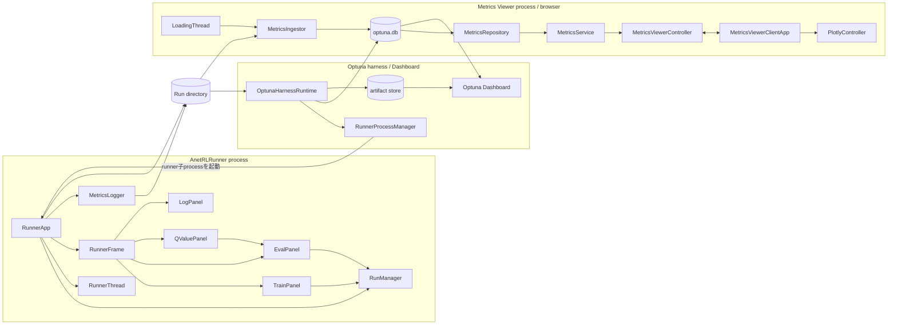
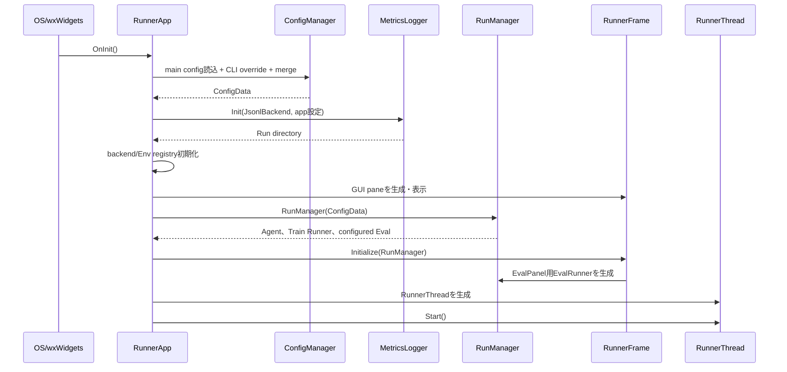
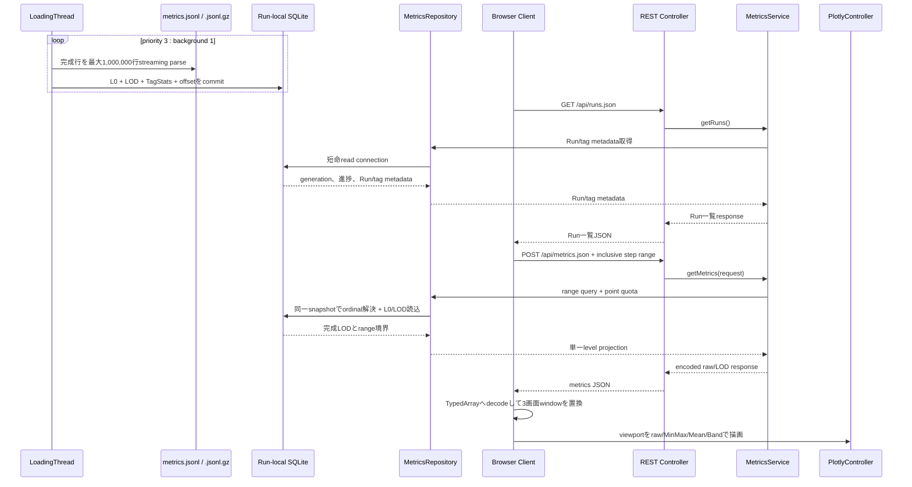
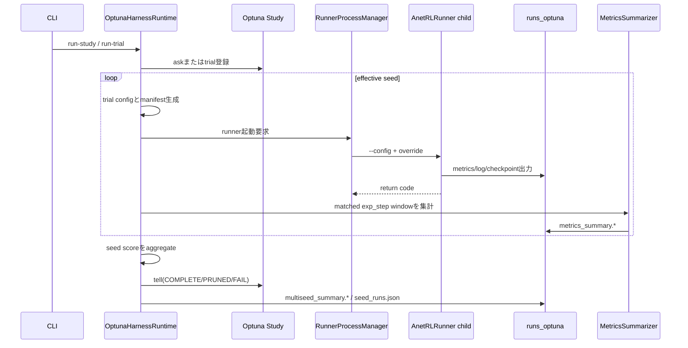

# アプリケーションとツール

> 主たる観点: 機能単位（Runner GUI、Metrics Viewer、Optuna harness）

## 1. はじめに

### 1.1 目的

本書は、ANETの共通runtimeを人間または外部processから利用するapplicationとtoolの責務、接続、process境界を説明する。Runner、Metrics Viewer、OptunaがRun directoryを介して疎結合に連携する構造を明確にする。

### 1.2 対象読者

- Runner GUI、分析tool、実験harnessを変更する開発者
- UI thread、Trainer thread、background loader、runner子processのlifetimeを確認する開発者
- Run artifactを介したapplication間contractをレビューする担当者

### 1.3 記載範囲

現行の`apps/runner`、`apps/metrics-viewer`、`apps/runner/tools`と起動launcherを扱う。Agent、Env、学習loop、metric生成の内部は各設計文書を参照する。
Metrics Viewerの内部仕様（cache schema、設定一覧、HTTP API、依存ライブラリ）は[Metrics Viewer](210_metrics_viewer.jp.md)を正本とし、本書ではprocess境界と接続だけを扱う。

## 2. コンポーネント定義

### 2.1 ANET RL Runner

| コンポーネント | 定義 |
|---|---|
| `RunnerApp` | wxWidgets application entry。config、RunManager、RunnerThread、GUI、loggingのlifecycleを統括する。Run directory自体は`MetricsLogger`が保持する |
| `RunnerFrame` | menu、status bar、wxAUI paneとclose順序を管理するmain window。wxAUIの制約吸収（dockサイズ往復・遷移時同期・pane⇄メニュー連動）は基底`anet::rl::gui::AuiLayoutFrame`（gui.hpp）が担い、本クラスはpane定義とレイアウトポリシー（50:50、frame縮退）を持つ |
| `TrainPanel` | Train eventからEnv固有Viewを更新し、GUI timerで断面を描画する |
| `EvalPanel` | 専用`EvalRunner`をtimerまたは手動Actionで駆動し、clone modelの同期を管理する |
| `QValuePanel` | Eval ActorのAction候補を可視化し、選択Actionを`EvalPanel`へ渡す。`full_q_quantiles`があれば優先し、なければ`q_quantiles`、`q_values`へfallbackする |
| `LogPanel` | wxLogの画面表示とlevel filterを提供する |
| `DefaultViewFactory` | Env class IDからTrain/Eval用Viewを生成する |
| `ImageProviderManager` | configで定義された画像Provider/Observerを生成・登録する |
| `RunnerThread` | Train RunnerをUI threadから分離し、pause、resume、stopを提供する |

### 2.2 Metrics Viewer

| コンポーネント | 定義 |
|---|---|
| `MetricsViewerApplication` | Spring Boot application entry |
| `RunScanner` | runs directory直下から`metrics.jsonl`または`metrics.jsonl.gz`を持つRunを列挙する |
| `MetricsCacheDatabase` | RunごとのSQLite cache、source fingerprint、generation、短命connectionを管理する |
| `MetricsIngestor` / `LodIngestWriter` | JSONL/gzipをstreaming parseし、L0、factor 16 LOD、`TagStats`を同一transactionで更新する |
| `IngestScheduler` / `LoadingThread` | priority 3 : background 1で1 blockずつ単一writerへ配分する |
| `MetricsRepository` | Runごとの短命read snapshotでrange解決、点数quota、単一LOD projectionを組み立てる |
| `MetricsService` | Run metadata、range query semaphore、priority集合を提供するapplication service |
| `MetricsViewerController` | `/api/runs.json`、`/api/metrics.json`、`/api/runs/prioritize`を公開するREST controller |
| `MetricsViewerClientApp` | browser側のRun/tag選択、viewport、Reload、取り込みpoll、描画世代を所有する |
| `DataFetcher` / `DataCache` | viewport単位のrange取得、binary projection decode、3画面window置換を担当する |
| `PlotlyController` | raw/MinMax/Mean/Band、`TagStats`、signed-log、zoom/pan、scroll lockを描画する |

### 2.3 Optuna harnessとlauncher

| コンポーネント | 定義 |
|---|---|
| `dropmerge_optuna.py` | DropMerge domain、CLI、探索parameterを定義するentry script |
| `DropMergeDomain` | 探索空間、generated config、cost、score tagをまとめるdomain adapter |
| `OptunaHarnessRuntime` | dry-run、run-trial、run-study、summary、cleanupを実行する共通runtime |
| `RunnerProcessManager` | runner子processの起動、timeout、中断、終了を管理する |
| `MetricsSummarizer` | `metrics.jsonl`を指定`exp_step` windowで集計する |
| Optuna storage/artifact store | trial state/attributesとDashboard用artifactを永続化する |
| `.bat` launcher | Runner、通常/Optuna Metrics Viewer、Optuna Dashboardの既定pathとportを固定する |

## 3. コードマップ

### 3.1 Runner

| 領域 | 主なファイル |
|---|---|
| application entry、config、logging | [RunnerApp.hpp](../../apps/runner/src/RunnerApp.hpp)、[RunnerApp.cpp](../../apps/runner/src/RunnerApp.cpp) |
| main frame、pane、入力操作 | [RunnerFrame.hpp](../../apps/runner/src/RunnerFrame.hpp)、[RunnerFrame.cpp](../../apps/runner/src/RunnerFrame.cpp) |
| Train View | [TrainPanel.hpp](../../apps/runner/src/TrainPanel.hpp)、[TrainPanel.cpp](../../apps/runner/src/TrainPanel.cpp) |
| Eval View、model同期 | [EvalPanel.hpp](../../apps/runner/src/EvalPanel.hpp)、[EvalPanel.cpp](../../apps/runner/src/EvalPanel.cpp) |
| Q値・ログ・補助pane | [QValuePanel.cpp](../../apps/runner/src/QValuePanel.cpp)、[LogPanel.cpp](../../apps/runner/src/LogPanel.cpp) |
| runtime接続 | [trainer.hpp](../../core/anet-core/include/anet/trainer.hpp)、[trainer.cpp](../../core/anet-core/src/trainer.cpp) |
| default config | [apps/runner/config](../../apps/runner/config) |

### 3.2 Metrics Viewer

| 領域 | 主なファイル |
|---|---|
| Spring entry/config | [MetricsViewerApplication.java](../../apps/metrics-viewer/src/main/java/io/github/kazukin123/anetlab/metricsviewer/MetricsViewerApplication.java)、[application.properties](../../apps/metrics-viewer/src/main/resources/application.properties) |
| scan/source identity | [RunScanner.java](../../apps/metrics-viewer/src/main/java/io/github/kazukin123/anetlab/metricsviewer/infra/RunScanner.java)、[MetricsSource.java](../../apps/metrics-viewer/src/main/java/io/github/kazukin123/anetlab/metricsviewer/infra/MetricsSource.java) |
| SQLite cache | [MetricsCacheDatabase.java](../../apps/metrics-viewer/src/main/java/io/github/kazukin123/anetlab/metricsviewer/infra/MetricsCacheDatabase.java)、[MetricsIngestor.java](../../apps/metrics-viewer/src/main/java/io/github/kazukin123/anetlab/metricsviewer/service/MetricsIngestor.java)、[LodIngestWriter.java](../../apps/metrics-viewer/src/main/java/io/github/kazukin123/anetlab/metricsviewer/service/LodIngestWriter.java) |
| scheduling/query | [IngestScheduler.java](../../apps/metrics-viewer/src/main/java/io/github/kazukin123/anetlab/metricsviewer/service/IngestScheduler.java)、[LoadingThread.java](../../apps/metrics-viewer/src/main/java/io/github/kazukin123/anetlab/metricsviewer/service/LoadingThread.java)、[MetricsRepository.java](../../apps/metrics-viewer/src/main/java/io/github/kazukin123/anetlab/metricsviewer/service/MetricsRepository.java)、[MetricsService.java](../../apps/metrics-viewer/src/main/java/io/github/kazukin123/anetlab/metricsviewer/service/MetricsService.java) |
| REST API | [MetricsViewerController.java](../../apps/metrics-viewer/src/main/java/io/github/kazukin123/anetlab/metricsviewer/view/MetricsViewerController.java) |
| browser UI | [index.html](../../apps/metrics-viewer/src/main/resources/static/index.html)、[metrics-viewer.js](../../apps/metrics-viewer/src/main/resources/static/metrics-viewer.js)、[metrics-viewer.css](../../apps/metrics-viewer/src/main/resources/static/metrics-viewer.css) |

### 3.3 Optunaとlauncher

| 領域 | 主なファイル |
|---|---|
| DropMerge CLI/domain | [dropmerge_optuna.py](../../apps/runner/tools/dropmerge_optuna.py) |
| harness共通runtime | [optuna_common.py](../../apps/runner/tools/optuna_common.py) |
| Runner launcher | [10_run.bat](../../apps/10_run.bat) |
| Metrics Viewer launcher | [22_metrics_viewer_java.bat](../../apps/22_metrics_viewer_java.bat)、[22_metrics_viewer_java_optuna.bat](../../apps/22_metrics_viewer_java_optuna.bat) |
| Dashboard launcher | [23_optuna_dashboard.bat](../../apps/23_optuna_dashboard.bat) |
| 詳細運用仕様 | [optuna.md](../optuna.md) |

## 4. 静的構造

RunnerはviewerやDashboardへ直接接続しない。Run directory、Optuna DB、artifact storeがprocess間contractである。この境界により、学習中でも別processから追記済みmetricsを閲覧できる。

## 5. 処理フロー

### 5.1 Runner起動

GUIはmain thread、Train Runnerは`RunnerThread`で動く。TrainPanelはTrain eventでView dataを更新し、GUI timerで描画断面を取得する。EvalPanelはGUI timer上で独立EvalRunnerを進めるため、configured background evalとは別用途である。ImageClsでは`app.eval_panel.eval_config_tag`で参照するconfigured Eval tagを明示し、その`run_mode`と`env.*`設定を別instanceへ適用する。非ImageClsで同キーを指定した場合はfail-fastする。

### 5.2 Metrics Viewerの取り込みとviewport range更新

HTTP requestはMetricsマスタを直接読まず、background writerがcommitしたSQLite snapshotを読む。
各rangeは前回応答へ依存せず、clientはviewport左右1画面を含む3画面windowを置換する。
取り込み中Runがある間はRun metadataを4秒pollして進捗表示だけを更新し、Auto Reloadは30秒ごとにmetadataを取り直して最新stepへfollow中の系列だけrangeを更新する。

### 5.3 Optunaのmulti-seed trial

`run-study`は各trialで`run-trial`子processを起動せず、自身がrunner子processを管理する。multi-seedは1 trial内で逐次実行され、`--n-jobs > 1`では複数params候補が並列に進む。

## 6. Entry pointと運用境界

| 用途 | Entry point | 既定出力・URL |
|---|---|---|
| GUI Run | `apps/10_run.bat` | `apps/runner/runs` |
| 通常Runの可視化 | `apps/22_metrics_viewer_java.bat` | `http://localhost:8082` |
| Optuna seed runの可視化 | `apps/22_metrics_viewer_java_optuna.bat` | `http://localhost:8083` |
| Optuna study/artifact | `apps/23_optuna_dashboard.bat` | `http://127.0.0.1:8088` |
| DropMerge探索 | `.venv\Scripts\python.exe apps\runner\tools\dropmerge_optuna.py run-study ...` | `apps/runner/runs_optuna` |

- Runnerのmain configは`--config`で差し替え、実験差分は末尾の`key=value` overrideで渡す。
- Viewerのruns directoryは`--metricsviewer.runs-dir`で差し替える。
- Optuna harnessのPythonはrepository rootの`.venv`を使う。
- Viewer frontendはbuild工程を持たず、外部依存はCDNのPlotlyだけを読む。完全offline環境ではasset取得方法を別途用意する必要がある。

## 7. Lifetime・エラー・性能特性

### 7.1 Runner

- `RunnerApp`が`RunManager`、`RunnerThread`、Frameを保持し、loggerの初期化・flush・停止順序を統括する。Run directoryと`run_dir_`は`MetricsLogger`が所有する。
- close時はTrain停止、`agent_close.anet`保存、log/metrics flush、EvalPanel detach、AUI破棄の順序を維持する。
- GUI callbackで発生した例外はErrorDialogへ表示し、Trainer threadの例外はmain threadへ転送する。
- Train/Eval panelのFPSは描画頻度であり、学習step頻度そのものではない。

### 7.2 Metrics Viewer

- `MetricsService`の`@PostConstruct`でLoadingThreadを開始し、`@PreDestroy`で最大30秒待って停止する。
- source kind、size、mtime、先頭/commit直前hashが一致しない場合はSQLite cacheを破棄して新しいgenerationで再構築する。
- `TagStats`はcommit済みL0全点、LODは完成した16子だけから作り、viewport queryから独立して保持する。
- Reload/Auto ReloadはPlotly DOMを再構築するため、選択tag、LOD表示mode、signed-log、scroll lockなどのpage stateはclient appが所有する。
- 既定系列予算、request全体予算、LOD page cache容量、query同時実行数は`application.properties`で制御する。
- activeなgzip取り込み中だけはsource streamをblock間で保持するため、そのRun folderの移動をサポートしない。

### 7.3 Optuna

- 中断時はまず`Ctrl+C`を1回送り、harnessへrunner停止とtrial state更新を行わせる。
- SQLiteで`--n-jobs > 1`を使うとlock競合とGPU性能干渉が起こり得る。
- DB recordとRun folderは別lifetimeである。Run folderを削除してもOptuna trialは残り、保存pathがstaleになる。
- summary studyは閲覧用であり、source studyを変更しない。

## 8. テストと変更時の確認事項

- Runner UI変更: Frame close順序、pane menu連動、Train/Eval入力、model syncを確認する。
- Metrics Viewer backend変更: SQLite/source identity、ingest/LOD、range API、scheduler、query concurrencyの各integration testを実行する。
- Metrics Viewer UI変更: `RunListPlaywrightTest`、`TagListPlaywrightTest`、`MetricsPlotPlaywrightTest`、`GraphInteractionPlaywrightTest`、`SignedLogPlaywrightTest`で、Run/Tag操作、viewport精細化、LOD mode、stale response、Reload、Plotly state、mobile gestureを関心別に確認する。
- Optuna変更: dry-run、短いrun-trial、artifact/DB state、interrupt cleanupを確認する。
- process間contract変更: 旧Run artifactを読めるか、または明示的なmigration/non-goalを記録する。

## 9. 関連文書

- [Run実行ユーザーガイド](020_user_guide_run.jp.md)
- [Run分析ユーザーガイド](030_user_guide_analysis.jp.md)
- [開発環境](040_development_environment.jp.md)
- [実行基盤と設定](100_runtime_and_configuration.jp.md)
- [Agentと学習](110_agents_and_learning.jp.md)
- [環境](120_environments.jp.md)
- [可観測性](140_observability.jp.md)
- [DQN系Agent](200_dqn_agents.jp.md)
- [Metrics Viewer](210_metrics_viewer.jp.md)
- [DropMerge Optuna利用ガイド](../optuna.md)
