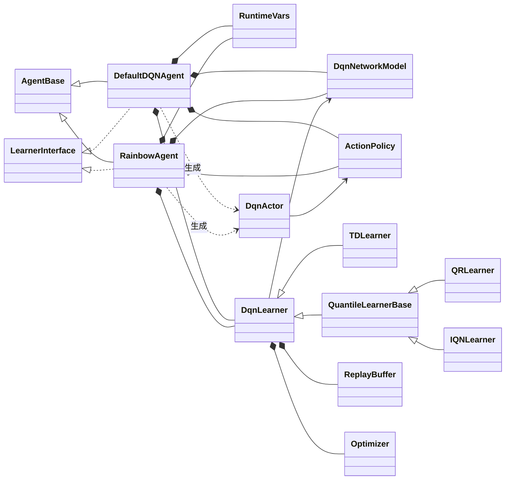
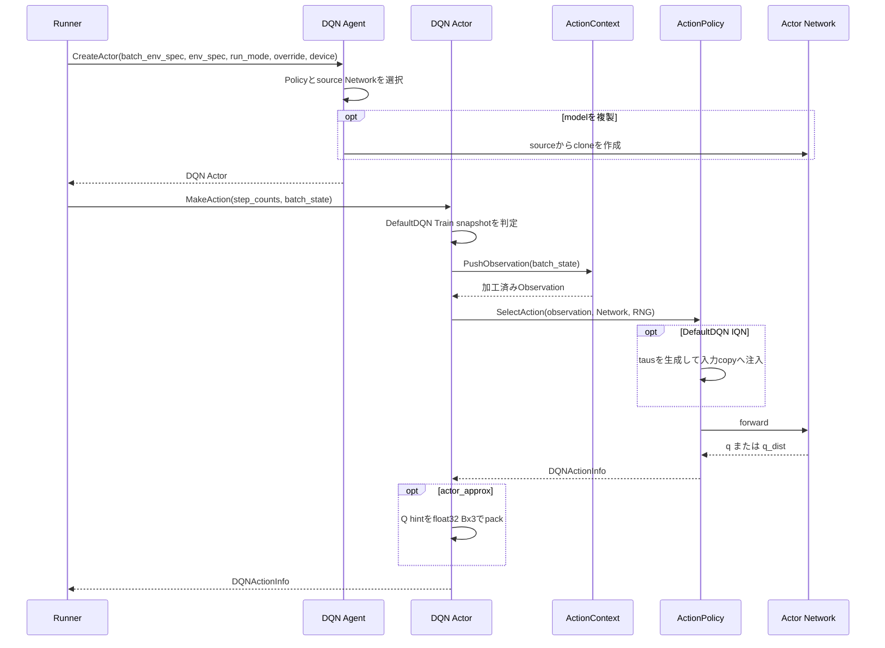
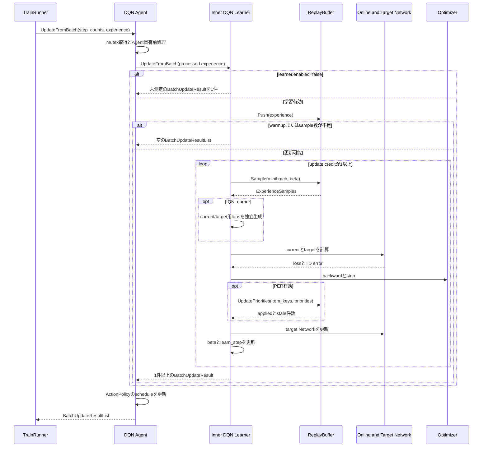
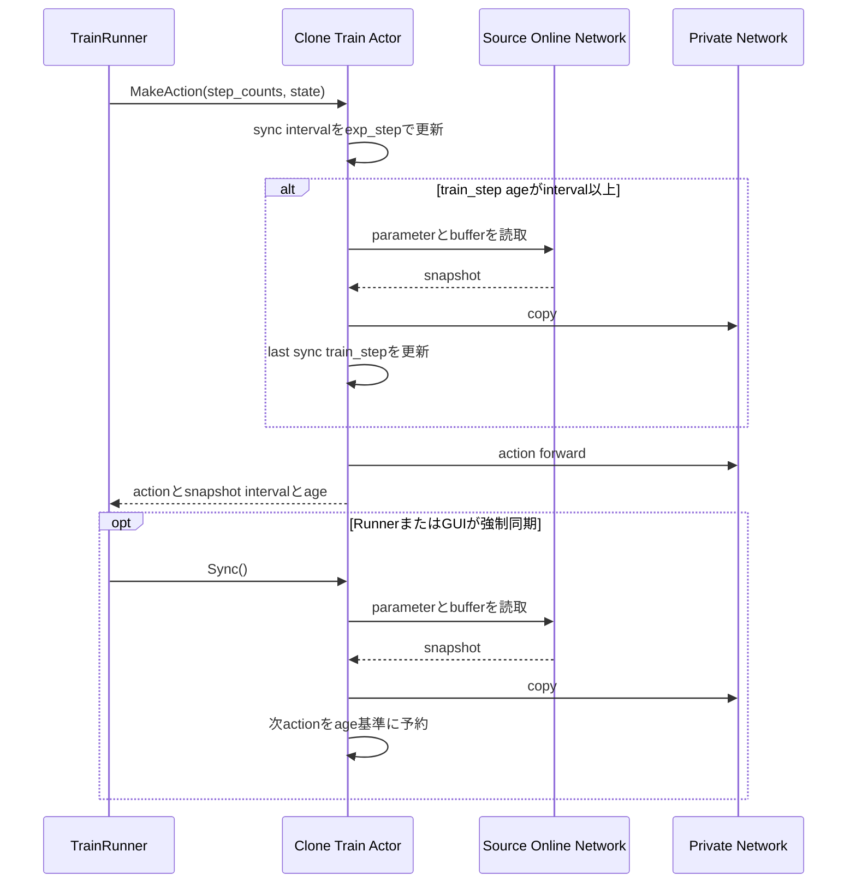

<!-- translated-from: 200_dqn_agents.jp.md blob:27742800eafe9e1213858153de2b95161332b94c date:2026-09-19 progress:done -->
# DQN Agents

> Primary perspective: concrete functionality (DefaultDQN and Rainbow, with action selection, learning, and synchronization in chronological order)

## 1. Introduction

### 1.1 Purpose

This document explains the structure, action selection, learning updates, model synchronization, and persistence contracts of ANET's DQN Agents, `DefaultDQNAgent` and `RainbowAgent`.
It separates shared Agent contracts from DQN-specific implementations and identifies changes needed when adding a DQN Agent or learning method.

### 1.2 Audience

- Developers changing DefaultDQN or Rainbow configuration/implementation
- Developers adding DQN Actors, Policies, Learners, or Network Heads
- Reviewers checking snapshot synchronization, PER, checkpoints, and metrics consistency

### 1.3 Scope

This document covers current `DefaultDQNAgent`, `RainbowAgent`, and their composed internal `anet::rl::dqn` components.
See [Agents and Learning](110_agents_and_learning.en.md) for shared Agent contracts, [ReplayBuffer](150_replay_buffer.en.md) for shared ReplayBuffer internals, and [Neural Networks](130_neural_networks.en.md) for Network modules.

## 2. DQN Overview and Basic Concepts

### 2.1 Implementation Layers

`DefaultDQNAgent` and `RainbowAgent` both implement `AgentBase` and the shared `rl::Learner`. `CreateLearner()` returns the outer Agent itself, which manages shared mutexes and pre/post-processing before delegating updates to an inner `dqn::Learner`.

`dqn_based_agent.*` provides internal components including `NetworkModel`, `ActionPolicy`, `Actor`, `Learner`, `TDLearner`, `QRLearner`, and `IQNLearner`. Both concrete Agents compose these components; neither inherits the inner `dqn::Learner`.

### 2.2 Online and Target Networks

`dqn::NetworkModel` holds online and target Networks. Actor selects actions using the source chosen by its catalog item's `network` setting. Learner computes current values with online and bootstrap values with target. Target updates follow learning according to `soft_update_tau` or `hard_update_interval`.

Heads and Learners combine as follows:

| Configuration | Output | Learner |
|---|---|---|
| Ordinary Q | Per-Action `q` | `TDLearner` |
| QR-DQN | Per-Action/quantile `q_dist` and mean `q` | `QRLearner` |
| IQN | `q_dist` for injected taus and sample-mean `q` | `IQNLearner` |
| Dueling | Q combining value and advantage | Can combine with TD, QR, or IQN |

Learner settings combine Double DQN, N-step, PER, gradient clipping, AMP, and more. Do not infer every combination from the name Rainbow alone; inspect each Run's resolved configuration.

### 2.3 ActionPolicy and DQNActionInfo

`ActionPolicy` performs Network forward and Action selection, combining Actions, Q values, quantiles, and related data into `DQNActionInfo`. Shared implementations include epsilon-greedy, UQE, and Thompson Sampling. DefaultDQN separates Train, Eval, and target Policies; Rainbow configures an action Policy and a greedy learning-target Policy.

For DefaultDQN IQN, each Policy generates taus according to `tau_rule` (`num_taus` and `random|fixed|stratified|systematic|antithetic`), injecting them into a shallow Observation copy before forward. `stratified` independently samples one point per equal-width stratum; `systematic` uses equally spaced points sharing one phase per row; `antithetic` generates pairs mirrored around the range midpoint, with one final independent point for odd counts. `fixed` deterministically uses interval midpoints without consuming RNG. Defaults are random×32 for Train and fixed×32 for Eval/target. UQE uses the decayed effective tau as its lower bound: `uqe_use_tail_mean=true` scores actions by the mean from that bound to 1; `false` fixes all points at the bound and uses `Zτ`. Non-spatial Thompson uses `[0,1]`; spatial Thompson uses per-lane lower bounds. Tau placement mode and `uqe_tau_decay` are separate settings.

IQN+UQE supports optional `full_distribution_query`, disabled by default. When enabled, risk taus and full `[0,1]` taus are concatenated for one forward. `q_values`/`uqe_values`/`q_quantiles` represent risk outputs; `full_q_values`/`full_q_quantiles` represent full outputs. The Head's mean `q` over the combined set is not used. Point-UQE risk queries collapse to one equivalent α. Non-IQN modes retain the enabled setting dormant and ignore it, so changing quantile mode requires no simultaneous change. With IQN enabled, choosing a non-UQE Policy while full queries remain enabled is a configuration error.

Depending on configuration, Actor uses ActionContext for frame stacking and device transfer, then normalizes Observations, invokes Policy, and adds auxiliary information. Policy depends only on Network and RNG for Action selection, never on Learner.

For `DefaultDQNAgent` frame stacks with `use_stacker=true` and `stack_count=S>1`, stacked Observation input specs are constructed as `[S, *original_shape]` rather than multiplying EnvSpec feature dimensions. This aligns dummy-forward, Actor, and Replay-sample axes. Specs outside `stack_keys` remain unchanged; `stack_count==1` adds no Network-spec stack axis. This transformation is DefaultDQN-specific and does not change EnvSpec, ObservationNormalizer, ReplayBuffer, `NetworkBuilder`, or `RainbowAgent` contracts. See [Neural Networks](130_neural_networks.en.md#22-frame-stack-input-axis-contract) for module shape transformations and discrete-Grid one-hot boundaries.

### 2.4 DQN and ReplayBuffer

Inner `dqn::Learner` owns the shared CPU ReplayBuffer, Pushes Experiences, then checks warmup, sampleable count, and update credit. While updates are possible, it samples minibatches, transfers them to the learning device, and computes TD or quantile losses. [ReplayBuffer](150_replay_buffer.en.md) is authoritative for N-step, frame-stack, generation-aware item-key, PER, and prefetch contracts.

Only with initial PER priority mode `actor_approx`, Train Actor builds a DQN-specific `float32[B,3]` hint from the existing forward. Columns are:

| Column | Value |
|---:|---|
| 0 | Action score of the Action actually selected |
| 1 | `max_a` action score when OFF; soft state value with Munchausen ON (h-space with TBO) |
| 2 | Munchausen bonus in real space; 0 when OFF |

Shared ReplayBuffer transports opaque rows; only DQN's `InitialPriorityEstimator` validates and decodes `K = 3`. After N-step finalization, it adds the starting hint's bonus once to finalized returns and estimates pre-Learner raw priority using the bootstrap hint's state value and discount. True terminals retain the bonus and omit only bootstrap. With TBO, state values are converted back to real space for composition, then the completed target is transformed to h-space.

Ordinary Q/QR hints use existing mean Q. IQN+UQE hints use the same risk-biased action score as action selection: upper-tail mean with `uqe_use_tail_mean=true`, or `Zτ` otherwise. Full queries do not substitute the full-distribution mean into Actor Q hints. Munchausen ON adds no forward; it approximates by softening the existing scores. `WithAction` regathers action Q and bonus from aux while retaining state value. `ActorQHintConfig` contains shared `MunchausenConfig` as `munchausen`, plus TBO settings. `munchausen.enabled` controls only Munchausen computation; `emit_actor_q_hint` controls hint output as a whole. Shared `log_policy_mode` is Learner-only and ignored by Actor. Rainbow uses the same K3 transport with Munchausen OFF.

## 3. Component Definitions

| Component | Definition |
|---|---|
| `DefaultDQNAgent` | Configurable DQN Agent combining scalers, multiple Policies, Train Actor snapshots, and more |
| `RainbowAgent` | DQN Agent centered on QR, Dueling, Double DQN, N-step, and PER |
| `RuntimeVars` | Mutable DQN-learning State such as `learn_step` and PER beta |
| `NetworkModel` | Resource combining online/target Networks, target updates, and save/load |
| `DQNActionInfo` | ActionInfo carrying Actions, Q auxiliaries, Replay initial-priority hints, and snapshot diagnostics |
| `ActionPolicy` | Base component selecting Actions from Network outputs |
| `dqn::Actor` | Actor implementation combining ActionContext, normalization, Policy, Network, and synchronization State |
| `dqn::Learner` | Internal Learner combining ReplayBuffer, optimizer, update credit, target synchronization, and PER updates |
| `TDLearner` | Computes scalar TD targets and losses |
| `QuantileLearnerBase` / `QRLearner` / `IQNLearner` | Compute target quantiles and method-specific quantile Huber losses |
| `TauGenerator` | Stateless component generating five IQN tau placement modes on the specified device |
| `RewardScaler` / `ObservationNormalizer` | DefaultDQN Experience preprocessing and Network-input normalization |

## 4. Code Map

| Area | Main files |
|---|---|
| Shared DQN components | [dqn_based_agent.hpp](../../core/anet-core/src/dqn_based_agent.hpp), [dqn_based_agent.cpp](../../core/anet-core/src/dqn_based_agent.cpp) |
| DQN Head | [dqn_based_heads.hpp](../../core/anet-core/src/dqn_based_heads.hpp), [dqn_based_heads.cpp](../../core/anet-core/src/dqn_based_heads.cpp) |
| DefaultDQN | [default_dqn_agent.hpp](../../core/anet-core/include/anet/default_dqn_agent.hpp), [default_dqn_agent.cpp](../../core/anet-core/src/default_dqn_agent.cpp) |
| Rainbow | [rainbow_agent.hpp](../../core/anet-core/include/anet/rainbow_agent.hpp), [rainbow_agent.cpp](../../core/anet-core/src/rainbow_agent.cpp) |
| ReplayBuffer | [replay_buffer.hpp](../../core/anet-core/include/anet/replay_buffer.hpp), [replay_buffer_impl.hpp](../../core/anet-core/src/replay_buffer_impl.hpp), [replay_buffer_impl.cpp](../../core/anet-core/src/replay_buffer_impl.cpp) |
| Runner configuration examples | [apps/runner/config](../../apps/runner/config) |
| DQN test | [dqn_based_agent_test.cpp](../../core/anet-core/src/dqn_based_agent_test.cpp), [dqn_based_test.cpp](../../core/anet-core/src/dqn_based_test.cpp) |


## 5. Static Structure



`LearnerInterface` denotes shared `anet::rl::Learner`; `DqnLearner` denotes internal `anet::rl::dqn::Learner`. The outer Agent is the Run-facing Learner facade, acquiring the shared mutex before invoking inner Learner.

## 6. Main Flows

### 6.1 Actor Creation and Action Selection



Actors using shared Networks invoke Policy under a shared lock to avoid conflicts with Learner updates. Cloned Actors use private Networks and do not access source Networks during forward.

### 6.2 Experience Acceptance and Learning Updates



DefaultDQN scales Rewards and updates ObservationNormalizer statistics in the outer Agent, then passes raw Observations and scaled Rewards inward. Rainbow has no such preprocessing and delegates directly to the same inner Learner contract.

`learner.enabled=false` is for evaluation-only Runs with learning completely stopped; the default is `true`. When false, no ReplayBuffer is constructed, and Push, Sample, forward, backward, and optimizer step are never called. Optimizer remains constructed for checkpoint payload compatibility. **Rather than an empty list, it returns one `BatchUpdateResult` whose diagnostic keys are all unavailable (`NaN`).** LEARN events do not fire for empty `update_results`, and evaluation is driven only by `EpisodeEvalObserver::OnLearn`. This makes one train step equal one learn step, allowing `eval_schedule` intervals to serve directly as train-step periods. Outer-Agent preprocessing (Reward scaling, ObservationNormalizer statistics, and ActionPolicy schedules) still operates; freeze statistics through `obs_norm` and `reward_scaler` settings if needed. `learner.enabled=false` without `auto_load_file` evaluates initial weights, so it warns once rather than causing construction failure.

### 6.3 Munchausen RL

DefaultDQN TD/QR/IQN defaults to `learner.munchausen.enabled=false`, with `log_policy_mode=target`, `alpha=0.9`, `entropy_tau=0.03`, and `clip_value_min=-1`. Modes and ranges are validated even when OFF. Enabling it with Double DQN or a resolved Thompson target is a construction error, checked after Policy copying through `use_optimistic_target`.

| Mode | Current output for bonus | Output for next value/policy |
|---|---|---|
| `target` | First half of a 2B target forward concatenating normalized current/next inputs | Second half of the same forward |
| `online` | Fresh NoGrad/eval online forward after current-train and target-value forwards | B target forward |
| `online_reuse` | Detached existing current-train output | B target forward |

When ON, hard action selection is not called. IQN generates current N taus, target M taus, then fresh-online N taus if required. Target-mode bonuses use M; other modes use N. OFF preserves forward order and RNG consumption. Target-mode plasticity capture validates `[2B,F]` and returns the second B rows corresponding to next states.

Policy, bonus, and soft bootstrap are computed in NoGrad FP32 real space. With TBO, each quantile is inverse-transformed separately. The initial state's clipped bonus is added once to N-step return; the terminal mask applies only to bootstrap. TD uses soft state values; QR/IQN mix all action distributions by policy probabilities, applying h-transform only to the completed target.

When `target_policy->GetRiskScoreSpec()` supplies UQE's current tau and tail-mean setting, `MakeRiskBiasedScore` sorts real-space quantiles to compute policy scores. Other supported Policies use quantile means. QR hard paths share this extraction, but IQN soft uses empirical-quantile approximation from existing taus and does not guarantee exact agreement with hard IQN. The helper accepts next mean Q separately from current/next scores and always computes `soft_gap` relative to mean Q. Policy owns UQE tau-decay State.

`forward_target`, `forward_munchausen_online`, and `munchausen_target` are measured separately; the last covers real-space conversion through target assembly. Initialization logs identify mode and mean/risk score source. Agent profile `@munchausen` enables target mode and disables Double DQN; Atari `run.@munchausen` combines IQN configuration and diagnostic subscriptions.

### 6.4 DefaultDQN Train Actor Snapshots

Actors with `DefaultDQNAgent.actor.[key].clone_model=true` and declared `sync_interval.*` maintain periodic private-Network snapshots. Synchronization-interval profiles advance by `exp_step`; current age is measured in `train_step`. Checks and copying occur immediately before forward in `MakeAction()`, producing the same action boundary for Serial and Pipeline Runners.



Since `Sync()` takes no step, the first action's `train_step` after forced synchronization becomes the age-zero reference. Shared Actors and Actors without `sync_interval.*` declarations have no periodic snapshots.

## 7. DefaultDQN and Rainbow Composition and Configuration

### 7.1 Main Differences

| Aspect | `DefaultDQNAgent` | `RainbowAgent` |
|---|---|---|
| Policy | Actor catalog and Learner target configured separately; epsilon-greedy, UQE, Thompson Sampling | Per-Actor epsilon-greedy and greedy for the Learner target |
| Preprocessing | RewardScaler, ObservationNormalizer, frame stack | Common ActionContext; no dedicated scaler/normalizer configuration |
| Head/Learner | TD/QR/IQN with optional Dueling | TD/QR with optional Dueling |
| Replay extensions | N-step, PER, prefetch, replay ratio, TBO, etc. | N-step and PER; current Config disables prefetch, TBO, and fused optimizer |
| Actor clone | Catalog `clone_model` and optional `sync_interval.*` | Catalog `clone_model`; no periodic snapshot |
| Spatial exploration | Available per Actor | No dedicated configuration |
| Save/load | Custom archive payload and `auto_load_file` | No custom Save/Load override |

### 7.2 Configuration Groups

| Group | Main responsibilities |
|---|---|
| Network/Head | `quantile_mode=none|qr|iqn`, QR quantile count, Dueling, initialization, online/target synchronization |
| ActionPolicy | Policy type, epsilon, UQE tau decay, IQN tau placement mode, Train/Eval/target selection |
| Train Actor | Shared/clone, snapshot synchronization interval |
| Learner | Learning enablement (`enabled`), optimizer, update interval/ratio, AMP, Double DQN, N-step, PER, TBO |
| Replay | Capacity, batch size, warmup, prefetch, priority mode |
| Preprocessing | Frame stack, reward scaling, observation normalization |

The authoritative definitions of all keys and defaults are `DefaultDQNAgentConfig`, `RainbowAgentConfig`, `LearnerConfig`, `ActionPolicyConfig`, and [apps/runner/config](../../apps/runner/config). Rather than duplicating the configuration list here, inspect the resolved results in the Run's `config/config_data.txt` and `config/<tag>.txt`.

DefaultDQN defaults to `quantile_mode=qr` and `qr.num_quantiles=51`. The IQN learner independently configures gradient-side `learner.iqn.current_taus` and target-distribution-side `learner.iqn.target_taus`; both default to random x 64 and allow N≠M. Target action selection uses `target_policy.tau_rule` separately from these two sets. The old DefaultDQN keys `use_qr` and the direct child `num_quantiles` are outside the current contract; Rainbow retains `use_qr` and `num_quantiles`.

The IQN-specific loss sums over current-side N, averages over target-side M, and divides the Huber term by `kappa`. For `N = 1`, it does not use an unbiased variance estimate and explicitly sets `q_std` to 0. With `quantile_mode=none`, there are no quantiles, so `q_std` is unavailable and returns `NaN`, without disguising it as 0.

`per_initial_priority_mode` accepts `fixed`, `max`, and `actor_approx`. `max` and `actor_approx` require PER. Priority, epsilon, clip values, and profile structure are validated during Config construction. Invalid combinations do not silently revert to defaults.

## 8. Lifetime, Synchronization, and Save/Load

### 8.1 Resources and State

- The outer Agent owns the lifetimes of `RuntimeVars`, `NetworkModel`, Policies, the inner Learner, scalers, and RNG Resources for plasticity/policy churn probes.
- The inner Learner references the outer `NetworkModel` and `RuntimeVars` and directly owns the Optimizer and ReplayBuffer.
- A shared Actor references the Agent-owned Network; a clone Actor owns a private Network. Neither references the Learner itself.
- Epsilon and the UQE tau decay schedule are State updated and owned by ActionPolicy; update credit, the warmup latch, and per-update policy churn requests/probes/Q are owned by the inner Learner; snapshot interval and last sync step are owned by the clone Actor. IQN tau placement mode is configuration, while each forward's taus are temporary inputs generated from a Policy- or Learner-owned RNG. Policy churn's fixed midpoint taus consume no randomness and are shared across up to three forwards in the same update.
- The outer Agent's shared mutex serializes Learner updates, shared Actor forwards, and clone/sync copies.

### 8.2 Checkpoints

The current `DefaultDQNAgent::Save()` saves the archive header, Config string, online/target Networks, and inner Learner. The inner `dqn::Learner::Save()` payload contains only the Optimizer. `auto_load_file` reads this payload during Agent construction and restores the Networks and Optimizer.

The current DefaultDQN checkpoint does not save or restore:

- ReplayBuffer contents, generations, priorities, normal sample RNG, or prefetch state
- Plasticity/policy churn probe RNGs and policy churn measurement State during an update
- Learning progress State such as `RuntimeVars`, update credit, warmup latch, and PER beta
- RewardScaler and ObservationNormalizer statistics
- Run StepCounts and metric series
- Actor-private snapshots, synchronization interval runtime, last sync step, or Actor RNGs

Checkpoint loading therefore transfers the Networks and Optimizer into a new Run rather than fully resuming the old Run. The Config string is read from the archive and logged, but does not replace the current Agent Config. Network composition and the Optimizer payload must be compatible.

`RainbowAgent` currently does not override `Save()` / `Load()` and uses the base Agent's no-op. Do not assume it has the same checkpoint support as DefaultDQN.

Network SN u/v are named buffers and are saved/restored with the online/target Networks in DefaultDQN checkpoints. `Clone()` reuses the construction seed to reconstruct the same structure, then fully copies parameters and buffers.

## 9. Observability, Performance, and Errors

### 9.1 Metrics

- `DQNActionInfo` carries the Action, auxiliary Q/quantile information, and an optional replay initial-priority hint.
- `episode_start_action_uqe_margin.[i]` and `episode_start_action_q_margin.[i]` average the difference between action `i` and the best other action over episode-start lanes in the batch. The UQE version uses UQE values; the Q version uses Q-related scores from the network output, remaining in h-space even with TBO. With IQN+UQE, both use the same risk-biased action score, not full-distribution `E[Z]`. Steps without episode-start lanes return `NaN` and skip scalar output.
- DefaultDQN exposes `train_actor_snapshot_interval` and `train_actor_snapshot_age` through ActionInfo. Actors without periodic snapshots return `NaN` for both; a synchronized action has age 0.
- Rainbow does not configure snapshot diagnostics, so retrieving the same keys returns `std::nullopt`.
- `BatchUpdateResult` exposes loss, TD error, Q statistics, gradients, and PER update results. The inner Learner delegates `replaybuffer.*` keys to ReplayBuffer.

IQN exploration diagnostics reuse Tensors already used for action selection and loss calculation. With Policy-side risk quantile count `K` and the top two UQE actions `a1,a2`, `iqn_policy_margin_mc_ratio` is defined below. Standard deviations are unbiased float32 estimates.

```text
s[b,a] = std_k(risk_quantiles[b,a,k]) / sqrt(K)
ratio[b] = (uqe[b,a1] - uqe[b,a2]) / (sqrt(s[b,a1]^2 + s[b,a2]^2) + 1e-6)
```

`iqn_uqe_full_q_argmax_disagreement` is the argmax disagreement rate between UQE and full Q; `action_full_q_margin.[i]` is `mean_b(full_q[b,i] - max_{a != i}(full_q[b,a]))`. Without a full query, full-dependent values are `NaN`; outside IQN+UQE or when `K < 2`, the margin ratio is `NaN`. An invalid action index fails fast with its valid range. Diagnostics are passed to ActionInfo as one detached packed Tensor, materialized on CPU only once across multiple key accesses. No diagnostic forward or tau generation is added.

On the Learner side, with current quantiles `z[b,i]`, target quantiles `y[b,j]`, `delta=y-z`, and counts `N,M`, use:

```text
current_scale[b] = std_i(z[b,i]) / sqrt(N)
target_scale[b]  = std_j(y[b,j]) / sqrt(M)
priority_ratio[b] = abs(mean_i(z[b,i]) - mean_j(y[b,j]))
                    / (sqrt(current_scale[b]^2 + target_scale[b]^2) + 1e-6)
pair_abs_td[b] = mean_ij(abs(delta[b,i,j]))
cancellation[b] = clamp(1 - abs(mean_ij(delta[b,i,j])) / (pair_abs_td[b] + 1e-6), 0, 1)
```

`iqn_current_mc_scale`, `iqn_target_mc_scale`, and `iqn_priority_mc_ratio` are batch means. `iqn_first_*` averages only rows undergoing their first Learner priority update, whose priority source is `fixed_initial|max_initial|actor_initial`; `iqn_first_quantile_loss_norm` divides the current sample loss by `N`. Without first-update rows, `per_sample_initial_count=0` and `iqn_first_*=NaN`. The same first-update contract applies with PER disabled, while general scale/ratio values are still calculated. For `N < 2` or `M < 2`, the corresponding scale and dependent ratio are `NaN`. With TBO, measurements use the same h-space as priorities. Learner diagnostics accompany the existing priority readback; with PER disabled, they are still retrieved in one fixed-length pack.

Tail diagnostics shared by QR / IQN use the tau-ordered quantile sequence `z[0..K-1]` without sorting it again by value. Let `h=floor(K/2)`; the median is `(z[h-1]+z[h])/2` for even K and `z[h]` for odd K. For odd K, exclude the center element from both tails and use these widths in Q-value units:

```text
upper_std = sqrt(mean_{i=K-h..K-1}((z[i] - median)^2))
lower_std = sqrt(mean_{i=0..h-1}((median - z[i])^2))
```

Policy metrics `policy_upper_truncated_std` and `policy_lower_truncated_std` average the final executed action's widths across the batch. `lower_risk_full_q_argmax_disagreement` is the argmax disagreement rate between `mean(z)` and `mean(z)-lower_std`; `quantile_crossing_ratio` is the fraction of adjacent taus with `z[i] > z[i+1]` across all batches and actions. For the final executed action, `policy_selected_crossing_depth_p90_ratio` normalizes `d[i]=max(z[i]-z[i+1],0)` by that action's range, computes nearest-rank p90 over positive crossings per lane, and averages across the batch. A lane without crossings or with zero range contributes `0`. QR uses existing `q_quantiles`; IQN uses only fixed `full_q_quantiles`. The five values retain per-action widths, a detached full-quantile alias, and global diagnostics in a shared payload. The first scalar access gathers the final action and materializes one Tensor on CPU. Percentile sorting also occurs only at this first access. `WithAction()` shares the payload but not the cache, so it follows the replacement action.

Learner metric `upper_tail_priority_spearman` is the average-rank Spearman correlation between per-sample `upper_std` from current quantiles for the experienced action and raw PER priority after clipping but before `per_alpha`. QR uses quantile index order; IQN also applies the ascending `current_taus` permutation to the quantiles. Tail values are appended to the existing priority readback only with PER enabled, preserving the pack prefix, clip counts, Replay update order, and absence of new wait boundaries. It is `NaN` when PER is disabled, batch size is below 2, either rank sequence is constant, or `K < 2`. Policy values are also `NaN` when the required full distribution is absent or `K < 2`. Crossing-depth p90 is dimensionless after range normalization, but with TBO it is calculated in h-space like other tail diagnostics, without inverse transformation to real space. All values use float32 and are detached from the training graph.

Current snapshot metrics are registered in `metrics.scalar.full` in [metrics_scalar.txt](../../apps/runner/config/metrics_scalar.txt), not in baseline. See [Observability](140_observability.en.md) for general Event, step-axis, and target contracts.

### 9.2 Performance

- Major boundaries are Actor forward, Replay sampling and H2D, online/target forward, loss, backward, optimizer, and PER priority readback.
- Shared Actors need no additional Network but contend with the Learner's unique lock. Clone Actors separate forwards at the cost of additional memory and synchronization copies.
- PipelineTrainRunner and Replay prefetch provide different one-deep overlaps. Profile them separately to identify whether Runner, Replay, H2D, or GPU learning work was hidden.
- Compare AMP/BF16, fused optimizer, and prefetch with identical settings/seeds, including device support and reproducibility.
- In IQN, intermediate Tensors from fusion onward and in the Head scale with tau count K. Profile Policy K and Learner N/M separately; do not add an `E[Z]` forward.

### 9.3 Error Boundaries

- If a shared Actor's device differs from the Agent device, enable cloning or specify the same device.
- Validate action count, Observation shape, and sample tensor shape/dtype/device at Agent, Actor, and Learner boundaries.
- `actor_approx` hints must be `float32[B,3]`; schema violations fail fast. All columns are checked for finite values. Nonfinite values fail fast in Debug builds and fall back to max initialization in `NDEBUG` builds.
- Unknown Policies, invalid PER modes, nonfinite or out-of-range configuration, and incompatible checkpoints do not allow processing to continue.
- DefaultDQN fails fast during construction for unknown `quantile_mode`, invalid QR quantile counts, invalid IQN tau counts/placement modes/Huber κ, and nonfinite or out-of-range tau lower bounds used by IQN+UQE/spatial Thompson.
- If either online or target has SN and soft updates are configured (`model.hard_update_interval<=0`), startup fails fast unless `model.soft_update_tau` is finite and in `[0, 0.1]` or equals `1`. Hard-update configurations do not validate the unused tau.

### 9.4 Plasticity Metrics

DQN has two channels. Actual captures a specified branch such as `main_feature` from the train-mode/autocast forwards used for online/target TD calculation, placing features from before target updates in the same `BatchUpdateResult`. Probe takes a uniform sample without replacement from ReplayBuffer, applies existing observation normalization, executes `ForwardOnlineUpTo` in NoGrad/eval mode with the same autocast as the learner, and exposes the Agent's latest values.

Online actual, target actual, and probe enablement and capture cadence are independently determined by the minimum interval of their plasticity scalar subscription rows. Each row's interval is also evaluated using the Observer's bucket rule; only the union of metrics due at that learn step is calculated. This allows a coarser srank cadence while retaining the cadence of dormant and other metrics, and avoids SVD on steps that do not need srank metrics. At the same step, δ=0.01 / 0.05 / 0.20 share one SVD. `feature_key` is required and checked for branch existence only when subscribed; with no subscriptions it is NoCare and no capture/sample/statistics work occurs. A known key not measured at that learn step returns `NaN`; an unknown key returns `nullopt`. Probe never reuses old values on non-capture steps or when samples are insufficient. Probe batch size must always be at least 1. See Section 4.7 of the [Run Analysis User Guide](030_user_guide_analysis.en.md) for interpreting each channel.

For parameters, the online network is partitioned into feature/readout groups by the dependency closure of `feature_key`, producing two raw weight norms, two effective weight norms after SN, and two group maximum sigma values. These are measured before applying the update, at a subscription cadence independent of activation capture, and placed in the same `BatchUpdateResult` as a fixed-length eight-element pack with online/target SN validity sentinels. Only the first access to any of the six public values transfers the entire pack to CPU and caches it within the event. Only an abnormal sentinel triggers another Network walk and fail-fast with online/target identification and full layer names. Groups without SN layers have `NaN` sigma and effective norms equal to raw norms. Without subscriptions, neither parameter enumeration nor D2H occurs.

### 9.5 Policy Churn Metrics

DefaultDQN measures changes in online expected Q and greedy actions caused by one learner update on a uniform ReplayBuffer probe without replacement. Together with online/target differences after the target update, it exposes seven scalars under `35_agent_churn`. Measurement resides in the common `dqn::Learner`, but configuration, subscriptions, and baseline publication are DefaultDQN-only; Rainbow, ImageCls, and NoisyNet are currently outside scope.

The measurement order is fixed:

1. Only when a Q-derived key fires at that `learn_step`, obtain one complete probe batch with the caller-owned `policy_churn_probe` RNG and apply existing Observation normalization.
2. Complete normal training forward, backward, and gradient clipping.
3. Obtain `online-before` immediately before the actual optimizer step and `online-after` immediately after it.
4. Execute the normal hard copy or soft update.
5. If target-related keys are needed, obtain `target-after` and finalize a fixed-length seven-element float32 CPU pack in `BatchUpdateResult`.

Churn forwards use `NoGrad`, eval mode, and FP32 with autocast explicitly disabled; the precision contract remains unchanged even when the outer Learner uses BF16/FP16. TD/QR use the Network's `q`. IQN expands `learner.policy_churn.iqn.num_taus` values of `(i+0.5)/K` across the probe batch, shares the same Tensor across before/after/target, and treats the resulting `q` as expected Q. Differences remain in Network output space without TBO inverse transformation.

The four online metrics are action churn rate, mean absolute Q difference over all states/actions, and the maximum/minimum across actions of state-averaged signed Q differences. The two target metrics are greedy disagreement rate and mean absolute Q difference after target update. `target_sync_age` is `learn_step % hard_update_interval` after a hard update, and `NaN` for soft updates. At hard-sync steps, online/target metrics are exactly 0.

Subscriptions interpret only train-scope `@learn $learn_step $update_result` and use a per-key `IntervalGate`. The online group needs before+after, the target group after+target, and age alone needs no sample/forward. Combined subscriptions share the probe and after result. With no subscriptions, no samples, forwards, aggregation, or payloads are produced. If a complete probe batch is unavailable, do not shrink it; set all six Q-derived values to `NaN`. All seven keys are always known: not due or unavailable means `NaN`, and only unknown keys return `nullopt`.

All seven baseline rows use interval 503. For hard-update interval `C` and metrics interval `I`, if `C / gcd(C, I) == 1`, the observation phase is fixed at `target_sync_age=0`, so warn once per interval. Two or more phases and soft updates are allowed without warnings.

### 9.6 Replay Fit Diagnostics

Explicitly selecting `metrics.scalar.@replay_fit` observes 13 metrics under `46_agent_replay_fit` every 503 learner updates by default. It is not included in default profiles. Per-row IntervalGates combine requests for the current update, distinguishing requests for population counts only, one group only, TD only, loss only, or actual PER only. With PER disabled, actual-PER means and selection ratios are NaN, and requests only for those values do not evaluate groups.

Measurement occurs after existing plasticity/policy churn probes and before `UpdateFromSamples`. Both Networks are evaluated in eval/NoGrad/FP32 mode, restoring modes even on exceptions. It does not touch training capture, normalization statistics, optimizer, or PER updates. IQN uses fixed midpoints; hard UQE tail/point selection follows Policy-owned risk State. Policy diagnostic options also control internal autocast, auxiliary full queries, and policy diagnostics.

Target construction shares `MakeTarget` and per-sample errors share `ComputeElementError` with training. IQN tau generators are called at their original positions, preserving normal RNG consumption order. Diagnostic batch dimensions come from input shapes. TD uses the absolute signed residual; loss uses the method-specific value before IS weighting. TD clipping applies only to TD losses. QR/IQN sum/mean and kappa conventions match training.

Each group's count is configured by `learner.replay_fit.probe.batch_size=1024`, and IQN fixed quantile count by `learner.replay_fit.iqn.num_taus=32`; both must be positive integers. Results are stored in each update's `BatchUpdateResult`. Unsubscribed, non-measurement, insufficient-count, and zero-denominator cases return NaN; only unknown keys return nullopt. Uniform TD is population-weighted, and ratios are ratios of means. Empty groups contribute nothing to the weighted sum; a nonempty group with insufficient samples makes the overall mean NaN.

If learning is enabled and the resolved target Policy is ThompsonSampling, subscription configuration fails fast. With learning disabled, no measurement occurs. See [ADR 0039](../adr/0039-replay-fit-sampling-history-groups-not-holdout.md) and [PRD073](../memo/done/073_replay_fit_metrics_10prd.md) for the rationale and complete metric table.

## 10. Tests and Extension Checklist

Main DQN tests reside in [dqn_based_agent_test.cpp](../../core/anet-core/src/dqn_based_agent_test.cpp) and [dqn_based_test.cpp](../../core/anet-core/src/dqn_based_test.cpp); shared Replay tests are in [replay_buffer_test.cpp](../../core/anet-core/src/replay_buffer_test.cpp).

When adding or modifying a DQN Agent, check at least the following:

1. Explicitly place each responsibility in the outer Agent, common DQN component, or ReplayBuffer layer.
2. If the outer Agent returns itself from `CreateLearner()`, keep mutex acquisition and pre/postprocessing outside the inner Learner call.
3. Test each Actor catalog entry's Policy, source Network, shared/clone behavior, and `Sync()` contract.
4. Validate enabled/disabled combinations of TD/QR/IQN, Dueling, Double DQN, N-step, and PER through both Config and shapes. For IQN, also check N≠M, N=1, and non-mutation of input Observations.
5. Use generation-aware `item_keys` from sampling for PER updates; do not substitute physical indices.
6. Keep the `actor_approx` schema within the DQN layer; do not introduce Q-value semantics into common ReplayBuffer.
7. List saved and unsaved State and test compatible and incompatible checkpoints.
8. Define each added metric's source, step axis, and `nullopt` or `NaN` conditions for unsupported Agents.
9. When modifying policy churn, check zero updates, online differences, hard/soft targets, the FP32 autocast boundary, IQN fixed taus, subscription gates, and non-interference from caller-owned probe RNGs.

## 11. Related Documents

- [Framework Overview](010_framework_overview.en.md)
- [Runtime and Configuration](100_runtime_and_configuration.en.md)
- [Agents and Learning](110_agents_and_learning.en.md)
- [Neural Networks](130_neural_networks.en.md)
- [Observability](140_observability.en.md)
- [ReplayBuffer](150_replay_buffer.en.md)
- [Applications and Tools](160_applications_and_tools.en.md)
- [Agent Implementation Ownership Guidelines](../ownership_guideline.md)
- [Actor Network Resource Policy ADR](../adr/0013-actor-network-resource-policy.md)
- [Actor Priority Approximation ADR](../adr/0010-actor-priority-mean-q-approx.md)
- [Replay Initial-Priority Completion ADR](../adr/0012-replay-initial-priority-hint-completion.md)
- [IQN Bind Product DAG ADR](../adr/0018-iqn-via-bind-product-dag.md)
- [IQN+UQE Score ADR](../adr/0019-iqn-uqe-score-without-extra-forward.md)
