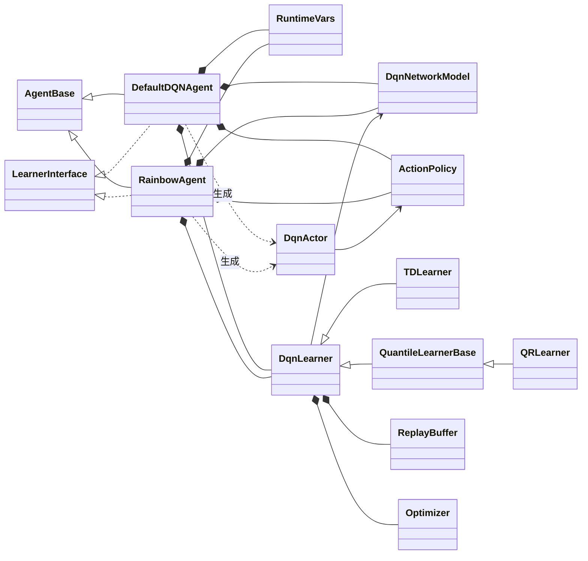
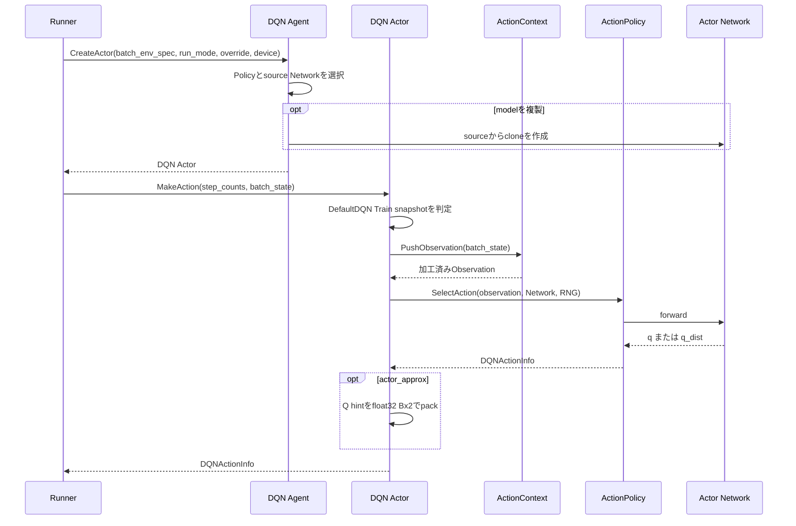
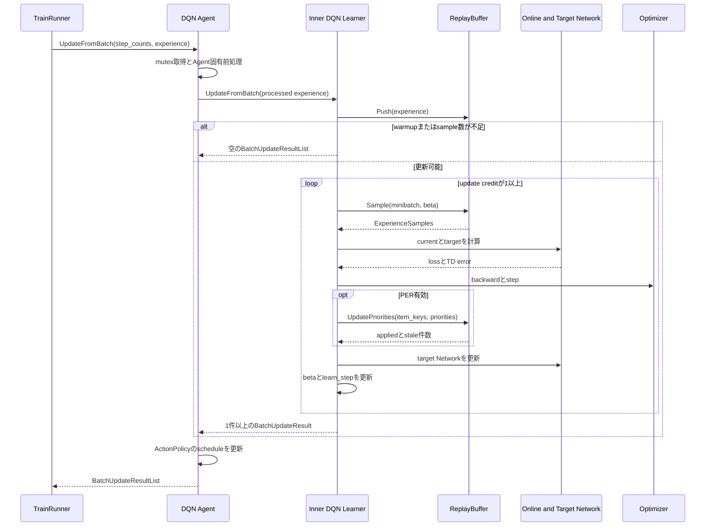
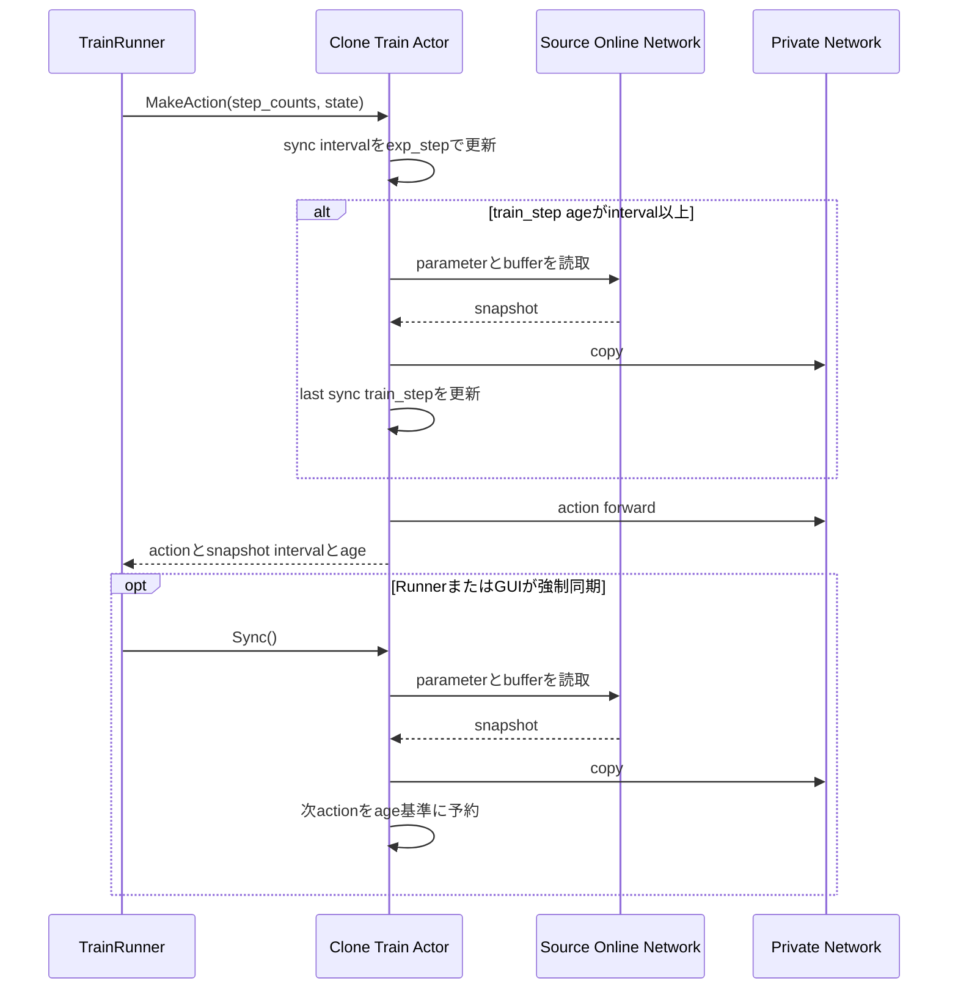

# DQN系Agent

> 主たる観点: 具象機能単位（DefaultDQNとRainbow。行動選択・学習・同期工程を時系列で併記）

## 1. はじめに

### 1.1 目的

本書は、ANETのDQN系Agentである`DefaultDQNAgent`と`RainbowAgent`の構成、行動選択、学習更新、model同期、保存契約を説明する。
共通Agent contractとDQN固有実装の境界を分け、新しいDQN系Agentまたは学習方式を追加するときの変更点を明確にする。

### 1.2 対象読者

- DefaultDQNまたはRainbowの設定・実装を変更する開発者
- DQNのActor、Policy、Learner、Network Headを追加する開発者
- snapshot同期、PER、checkpoint、metricの整合をレビューする担当者

### 1.3 記載範囲

現行の`DefaultDQNAgent`、`RainbowAgent`と、両者が合成する`anet::rl::dqn`内部componentを扱う。
Agent共通contractは[Agentと学習](110_agents_and_learning.jp.md)、ReplayBuffer共通内部は[ReplayBuffer](150_replay_buffer.jp.md)、Network moduleは[ニューラルネットワーク](130_neural_networks.jp.md)を参照する。

## 2. DQN系の概要と基本概念

### 2.1 実装レイヤー

`DefaultDQNAgent`と`RainbowAgent`は、どちらも`AgentBase`と共通`rl::Learner`を実装する具象Agentである。`CreateLearner()`は外側のAgent自身を返し、外側が共有mutexや前後処理を管理したうえで、内側の`dqn::Learner`へ更新を委譲する。

`dqn_based_agent.*`は、`NetworkModel`、`ActionPolicy`、`Actor`、`Learner`、`TDLearner`、`QRLearner`などを提供する内部component群である。両具象Agentはこれらを合成しており、`DefaultDQNAgent`または`RainbowAgent`が内側の`dqn::Learner`を継承する構造ではない。

### 2.2 Online NetworkとTarget Network

`dqn::NetworkModel`はonline Networkとtarget Networkを保持する。ActorはRunModeに応じてonlineまたはtargetをsourceとして行動を選び、Learnerはonlineで現在値を計算し、targetをbootstrap値の計算に使う。targetは`soft_update_tau`または`hard_update_interval`に従って学習後に更新する。

HeadとLearnerは次を組み合わせる。

| 構成 | 出力 | Learner |
|---|---|---|
| 通常Q | Actionごとの`q` | `TDLearner` |
| QR-DQN | Action・quantileごとの`q_dist`と平均`q` | `QRLearner` |
| Dueling | valueとadvantageを合成したQ | TDまたはQRと組合せ可能 |

Double DQN、N-step、PER、勾配clip、AMPなどはLearner設定で組み合わせる。すべての組合せを「Rainbow」という名称だけから暗黙に仮定せず、Runの解決済み設定を確認する。

### 2.3 ActionPolicyとDQNActionInfo

`ActionPolicy`はNetwork forwardとAction選択を担当し、Action、Q値、quantileなどを`DQNActionInfo`へまとめる。現行の共通部品にはepsilon-greedy、UQE、Thompson Samplingがある。DefaultDQNはTrain、Eval、target用Policyを分け、RainbowはAction用Policyと学習target用のgreedy Policyを構成する。

Actorは、構成に応じてActionContextによるframe stackとdevice転送を行い、Observation正規化、Policy呼出し、補助情報の付与へ進む。PolicyはLearnerへ依存せず、NetworkとRNGだけでActionを決定する。

### 2.4 DQNとReplayBuffer

内側の`dqn::Learner`はCPU上の共通ReplayBufferを所有し、ExperienceをPushしてからwarmup、sample可能数、update creditを確認する。更新可能な間はminibatchをsampleし、学習deviceへ移してTDまたはquantile lossを計算する。N-step、frame stack、generation-aware item key、PER、prefetchの共通contractは[ReplayBuffer](150_replay_buffer.jp.md)を正本とする。

PERの初期priority modeが`actor_approx`の場合だけ、Train Actorは既存forwardからDQN固有の`float32[B,2]` hintを作る。列は次の順序である。

| 列 | 値 |
|---:|---|
| 0 | 実際に選択したActionの`Q(s,a)` |
| 1 | `max_a Q(s,a)`で表すActor側state value |

共通ReplayBufferはpayloadをopaqueな行として運び、DQNの`InitialPriorityEstimator`だけが`K = 2`を検証・decodeする。N-step確定後、開始hint、bootstrap hint、確定収益、割引からLearner更新前のraw priorityを推定する。true terminalではbootstrapを使わず、TBO有効時はLearnerと同じ変換空間で計算する。

## 3. コンポーネント定義

| コンポーネント | 定義 |
|---|---|
| `DefaultDQNAgent` | scaler、複数Policy、Train Actor snapshotなどを組み合わせる設定可能なDQN系Agent |
| `RainbowAgent` | QR、Dueling、Double DQN、N-step、PERを中心に構成するDQN系Agent |
| `RuntimeVars` | `learn_step`、PER betaなどDQN学習中に変化するState |
| `NetworkModel` | online/target Network、target更新、保存・読込をまとめるResource |
| `DQNActionInfo` | Action、Q補助情報、Replay初期priority hint、snapshot診断を運ぶActionInfo |
| `ActionPolicy` | Network出力からActionを選択する基底component |
| `dqn::Actor` | ActionContext、正規化、Policy、Network、同期StateをまとめるActor実装 |
| `dqn::Learner` | ReplayBuffer、optimizer、更新credit、target同期、PER更新をまとめる内部Learner |
| `TDLearner` | scalar TD targetとTD lossを計算するLearner |
| `QuantileLearnerBase` / `QRLearner` | target quantileとquantile Huber lossを計算するLearner |
| `RewardScaler` / `ObservationNormalizer` | DefaultDQNのExperience前処理とNetwork入力正規化を担当するcomponent |

## 4. コードマップ

| 領域 | 主なファイル |
|---|---|
| DQN共通component | [dqn_based_agent.hpp](../../core/anet-core/src/dqn_based_agent.hpp)、[dqn_based_agent.cpp](../../core/anet-core/src/dqn_based_agent.cpp) |
| DQN Head | [dqn_based_heads.hpp](../../core/anet-core/src/dqn_based_heads.hpp)、[dqn_based_heads.cpp](../../core/anet-core/src/dqn_based_heads.cpp) |
| DefaultDQN | [default_dqn_agent.hpp](../../core/anet-core/include/anet/default_dqn_agent.hpp)、[default_dqn_agent.cpp](../../core/anet-core/src/default_dqn_agent.cpp) |
| Rainbow | [rainbow_agent.hpp](../../core/anet-core/include/anet/rainbow_agent.hpp)、[rainbow_agent.cpp](../../core/anet-core/src/rainbow_agent.cpp) |
| ReplayBuffer | [replay_buffer.hpp](../../core/anet-core/include/anet/replay_buffer.hpp)、[replay_buffer_impl.hpp](../../core/anet-core/src/replay_buffer_impl.hpp)、[replay_buffer_impl.cpp](../../core/anet-core/src/replay_buffer_impl.cpp) |
| Runner設定例 | [apps/runner/config](../../apps/runner/config) |
| DQN test | [dqn_based_agent_test.cpp](../../core/anet-core/src/dqn_based_agent_test.cpp)、[dqn_based_test.cpp](../../core/anet-core/src/dqn_based_test.cpp) |

## 5. 静的構造

`LearnerInterface`は共通`anet::rl::Learner`、`DqnLearner`は内部`anet::rl::dqn::Learner`を表す。外側AgentはRunから見えるLearner facadeであり、共有mutexを取得してから内側Learnerを呼ぶ。

## 6. 主要フロー

### 6.1 Actor生成と行動選択

共有Networkを使うActorはLearner更新との競合を避けるためshared lock内でPolicyを呼ぶ。clone Actorはprivate Networkを使い、forward中にsource Networkを参照しない。

### 6.2 Experience受入れと学習更新

DefaultDQNは外側AgentでRewardをscaleし、ObservationNormalizerの統計を更新してから生Observationとscale済みRewardを内側へ渡す。Rainbowはこの前処理を持たず、同じinner Learner contractへ直接委譲する。

### 6.3 DefaultDQN Train Actor snapshot

`DefaultDQNAgent.train_actor.clone_model=true`のTrain Actorだけがprivate Networkの定期snapshotを持つ。同期周期profileは`exp_step`で更新し、現在のageは`train_step`で測る。判定とcopyは`MakeAction()`のforward直前に行うため、Serial/Pipeline Runnerのどちらでも同じaction境界になる。

`Sync()`はstepを受け取らないため、強制同期後に最初に呼ばれたactionの`train_step`をage 0の基準にする。shared Train ActorとEval Actorは定期snapshotを持たない。

## 7. DefaultDQNとRainbowの構成・設定

### 7.1 主な相違

| 観点 | `DefaultDQNAgent` | `RainbowAgent` |
|---|---|---|
| Policy | Train、Eval、targetを個別構成。epsilon-greedy、UQE、Thompson Sampling | Action用epsilon-greedyとtarget用greedy |
| 前処理 | RewardScaler、ObservationNormalizer、frame stack | 共通ActionContext。専用scaler/normalizer設定なし |
| Head/Learner | TD/QR、Dueling有無を選択 | TD/QR、Dueling有無を選択 |
| Replay拡張 | N-step、PER、prefetch、replay ratio、TBOなど | N-step、PER。現行Configはprefetch、TBO、fused optimizerを無効化 |
| Actor clone | Train既定を`train_actor.clone_model`で指定し、定期snapshotを構成可能 | override省略時はshared。overrideによるcloneは可能だが定期snapshotなし |
| spatial exploration | Train Policyだけで利用可能 | 専用設定なし |
| 保存・読込 | 独自archive payloadと`auto_load_file`あり | 独自Save/Load overrideなし |

### 7.2 設定グループ

| グループ | 主な責務 |
|---|---|
| Network/Head | TDかQR、quantile数、Dueling、初期化、online/target同期 |
| ActionPolicy | Policy種類、epsilon・tau schedule、Train/Eval/targetの選択 |
| Train Actor | shared/clone、snapshot同期周期 |
| Learner | optimizer、update間隔・比率、AMP、Double DQN、N-step、PER、TBO |
| Replay | capacity、batch size、warmup、prefetch、priority mode |
| 前処理 | frame stack、Reward scale、Observation normalize |

全keyと既定値の正本は`DefaultDQNAgentConfig`、`RainbowAgentConfig`、`LearnerConfig`、`ActionPolicyConfig`と[apps/runner/config](../../apps/runner/config)である。本書へ設定一覧を複製せず、Runの`config.txt`と`config/config_data.txt`で解決結果を確認する。

`per_initial_priority_mode`は`fixed`、`max`、`actor_approx`を受け付ける。`max`と`actor_approx`はPER有効を要求し、priority、epsilon、clip値、profile構造などはConfig構築時に検証する。不正な組合せを暗黙に既定値へ戻さない。

## 8. lifetime・同期・保存読込

### 8.1 ResourceとState

- 外側Agentが`RuntimeVars`、`NetworkModel`、Policy、inner Learner、scaler類のlifetimeを所有する。
- inner Learnerは外側の`NetworkModel`と`RuntimeVars`を参照し、OptimizerとReplayBufferを直接所有する。
- shared ActorはAgent所有Networkを参照し、clone Actorはprivate Networkを所有する。どちらもLearnerそのものは参照しない。
- epsilon/tau scheduleはActionPolicy、update creditとwarmup latchはinner Learner、snapshot intervalとlast sync stepはclone Actorが更新・所有するStateである。
- outer Agentの共有mutexはLearner更新、shared Actor forward、clone/sync copyの境界を直列化する。

### 8.2 checkpoint

現行`DefaultDQNAgent::Save()`はarchive header、Config文字列、online/target Network、inner Learnerを保存する。inner `dqn::Learner::Save()`のpayloadはOptimizerだけである。`auto_load_file`はAgent構築中にこのpayloadを読み、NetworkとOptimizerへ復元する。

次は現行DefaultDQN checkpointへ保存・復元しない。

- ReplayBufferの内容、generation、priority、sample RNG、prefetch状態
- `RuntimeVars`、update credit、warmup latch、PER betaなどの学習進行State
- RewardScalerとObservationNormalizerの統計
- RunのStepCountsとmetric系列
- Actor-private snapshot、同期周期runtime、last sync step、Actor RNG

したがってcheckpoint読込は旧Runの完全再開ではなく、新しいRunへNetworkとOptimizerを引き継ぐ操作である。Config文字列はarchiveから読み取ってlogへ出すが、現在のAgent Configを置換しない。Network構成とOptimizer payloadが互換である必要がある。

`RainbowAgent`は現行コードで独自の`Save()` / `Load()`をoverrideせず、基底Agentのno-opを使う。DefaultDQNと同じcheckpoint対応があると仮定しない。

## 9. 可観測性・性能・エラー

### 9.1 metric

- `DQNActionInfo`はAction、Q値・quantile補助情報、必要に応じてReplay初期priority hintを運ぶ。
- DefaultDQNは`train_actor_snapshot_interval`と`train_actor_snapshot_age`をActionInfoから公開する。定期snapshotがないActorでは両値を`NaN`とし、同期したactionのageは0になる。
- Rainbowはsnapshot診断を設定しないため、同じkeyの取得は`std::nullopt`になる。
- `BatchUpdateResult`はloss、TD error、Q統計、勾配、PER更新結果などを公開し、inner Learnerは`replaybuffer.*` keyをReplayBufferへ委譲する。

現在のsnapshot metricは[metrics_scalar.txt](../../apps/runner/config/metrics_scalar.txt)の`metrics.scalar.full`へ登録し、baselineには含めない。Event、step軸、targetの一般contractは[可観測性](140_observability.jp.md)を参照する。

### 9.2 性能

- 主要境界はActor forward、Replay sampleとH2D、online/target forward、loss、backward、optimizer、PER priority readbackである。
- shared Actorは追加Networkを持たないがLearnerのunique lockと競合する。clone Actorは追加memoryと同期copyを使う代わりにforwardを分離する。
- PipelineTrainRunnerとReplay prefetchは異なる1-deep overlapである。Runner、Replay、H2D、GPU学習のどこが隠れたかをprofileで分けて確認する。
- AMP/BF16、fused optimizer、prefetchはdevice対応と再現性を含めて同じ設定・seedで比較する。

### 9.3 エラー境界

- shared ActorのdeviceがAgent deviceと異なる場合は、cloneを有効にするか同じdeviceを指定する。
- Action数、Observation shape、sample tensorのshape・dtype・deviceをAgent、Actor、Learner境界で検証する。
- `actor_approx`のhintは`float32[B,2]`を要求し、schema違反はfail-fastする。nonfiniteはDebug buildでfail-fastし、`NDEBUG` buildではmax初期化へfallbackする。
- 未知Policy、無効なPER mode、非finiteまたは範囲外設定、互換性のないcheckpointは処理を継続しない。

## 10. テストと拡張時の確認事項

主なDQN testは[dqn_based_agent_test.cpp](../../core/anet-core/src/dqn_based_agent_test.cpp)と[dqn_based_test.cpp](../../core/anet-core/src/dqn_based_test.cpp)、Replay共通testは[replay_buffer_test.cpp](../../core/anet-core/src/replay_buffer_test.cpp)に置く。

DQN系Agentを追加・変更する場合は、少なくとも次を確認する。

1. 外側Agent、共通DQN component、ReplayBufferのどのlayerへ責務を置くかを明示する。
2. outer Agentが`CreateLearner()`で自身を返す場合、mutex取得と前後処理をinner Learner呼出しの外側へ保つ。
3. RunModeごとのPolicy、source Network、shared/clone、`Sync()`契約をtestする。
4. TD/QR、Dueling、Double DQN、N-step、PERの有効・無効組合せをConfigとshapeの両方で検証する。
5. PER更新にはsample時のgeneration-aware `item_keys`を使い、物理indexを代用しない。
6. `actor_approx` schemaをDQN layerに閉じ、共通ReplayBufferへQ値の意味を持ち込まない。
7. 保存対象と非保存Stateを列挙し、互換checkpointと非互換checkpointの結果をtestする。
8. 追加metricのsource、step軸、未対応Agentでの`nullopt`または`NaN`条件を定義する。

## 11. 関連文書

- [フレームワーク全体概要](010_framework_overview.jp.md)
- [実行基盤と設定](100_runtime_and_configuration.jp.md)
- [Agentと学習](110_agents_and_learning.jp.md)
- [ニューラルネットワーク](130_neural_networks.jp.md)
- [可観測性](140_observability.jp.md)
- [ReplayBuffer](150_replay_buffer.jp.md)
- [アプリケーションとツール](160_applications_and_tools.jp.md)
- [Agent実装の所有権ガイドライン](../ownership_guideline.md)
- [Actor Network Resource Policy ADR](../adr/0013-actor-network-resource-policy.md)
- [Actor priority近似 ADR](../adr/0010-actor-priority-mean-q-approx.md)
- [Replay初期priority completion ADR](../adr/0012-replay-initial-priority-hint-completion.md)
