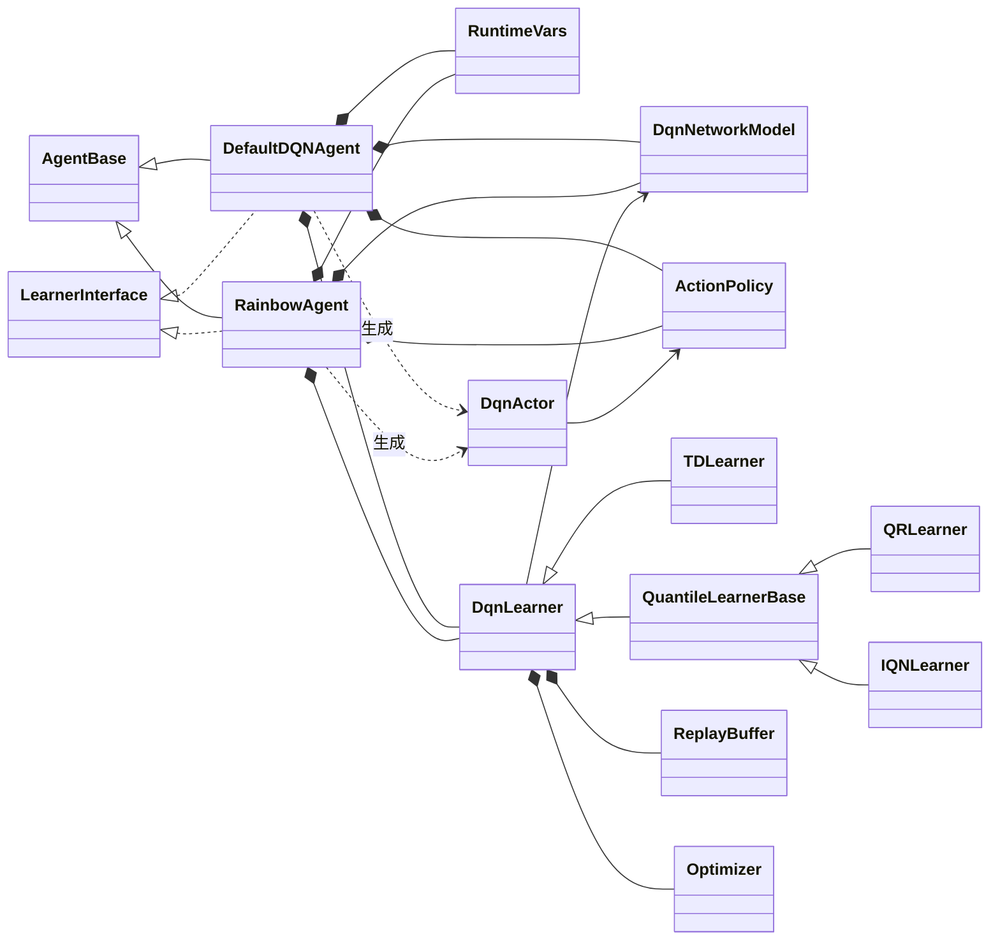
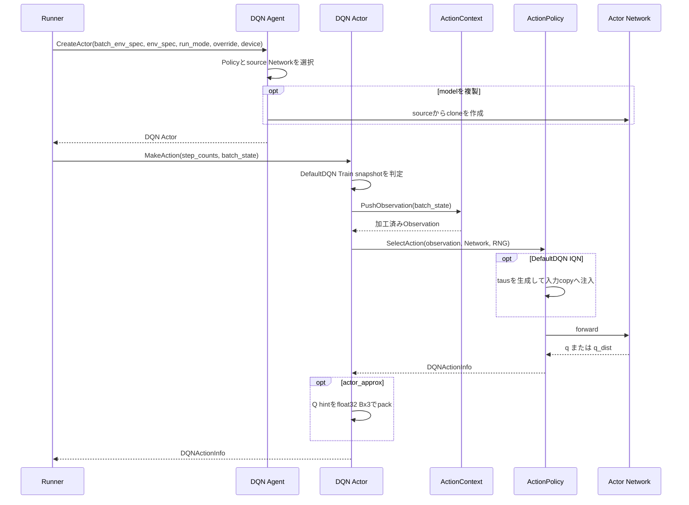
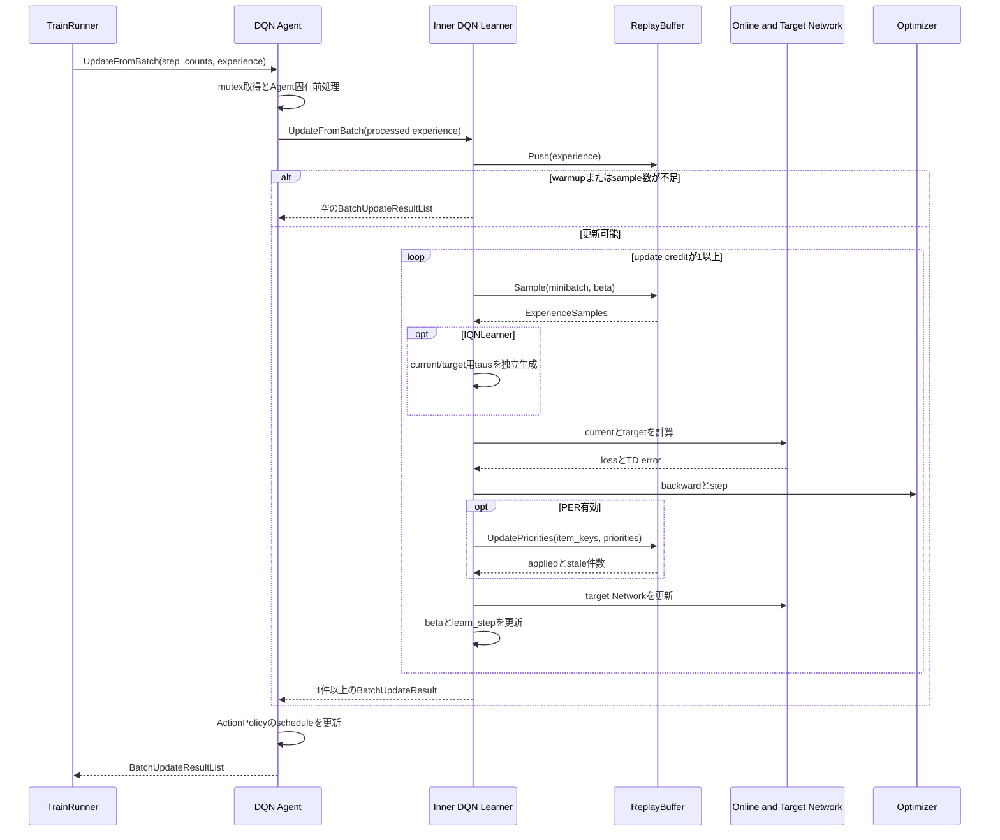
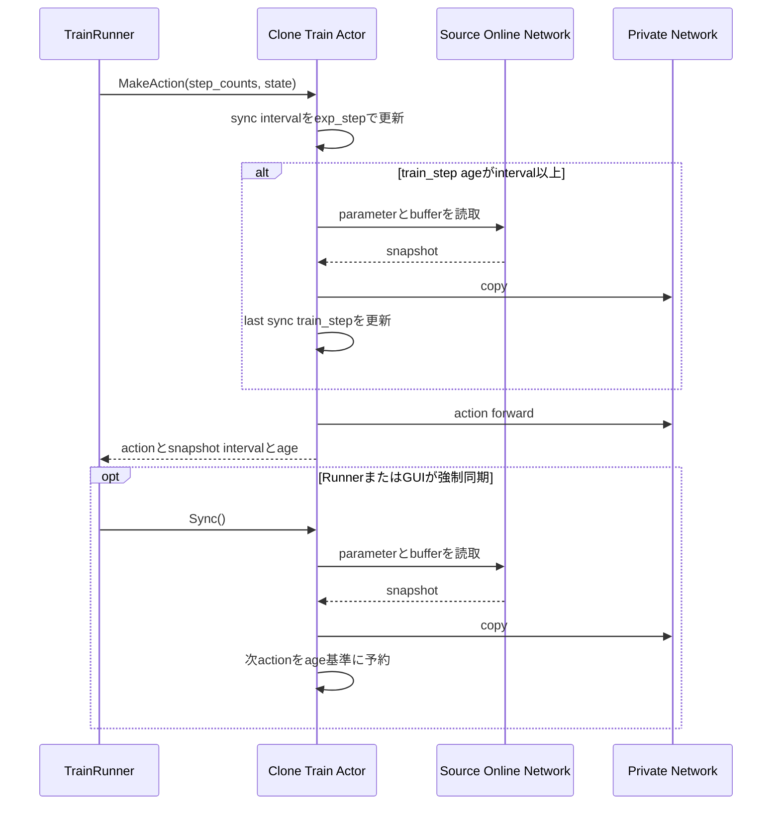

# DQN系Agent

> 主たる観点: 具象機能単位（DefaultDQNとRainbow。行動選択・学習・同期工程を時系列で併記）

## 1. はじめに

### 1.1 目的

本書は、ANETのDQN系Agentである`DefaultDQNAgent`と`RainbowAgent`の構成、行動選択、学習更新、model同期、保存契約を説明する。
共通Agent contractとDQN固有実装の境界を分け、新しいDQN系Agentまたは学習方式を追加するときの変更点を明確にする。

### 1.2 対象読者

- DefaultDQNまたはRainbowの設定・実装を変更する開発者
- DQNのActor、Policy、Learner、Network Headを追加する開発者
- snapshot同期、PER、checkpoint、metricの整合をレビューする担当者

### 1.3 記載範囲

現行の`DefaultDQNAgent`、`RainbowAgent`と、両者が合成する`anet::rl::dqn`内部componentを扱う。
Agent共通contractは[Agentと学習](110_agents_and_learning.jp.md)、ReplayBuffer共通内部は[ReplayBuffer](150_replay_buffer.jp.md)、Network moduleは[ニューラルネットワーク](130_neural_networks.jp.md)を参照する。

## 2. DQN系の概要と基本概念

### 2.1 実装レイヤー

`DefaultDQNAgent`と`RainbowAgent`は、どちらも`AgentBase`と共通`rl::Learner`を実装する具象Agentである。`CreateLearner()`は外側のAgent自身を返し、外側が共有mutexや前後処理を管理したうえで、内側の`dqn::Learner`へ更新を委譲する。

`dqn_based_agent.*`は、`NetworkModel`、`ActionPolicy`、`Actor`、`Learner`、`TDLearner`、`QRLearner`、`IQNLearner`などを提供する内部component群である。両具象Agentはこれらを合成しており、`DefaultDQNAgent`または`RainbowAgent`が内側の`dqn::Learner`を継承する構造ではない。

### 2.2 Online NetworkとTarget Network

`dqn::NetworkModel`はonline Networkとtarget Networkを保持する。ActorはRunModeに応じてonlineまたはtargetをsourceとして行動を選び、Learnerはonlineで現在値を計算し、targetをbootstrap値の計算に使う。targetは`soft_update_tau`または`hard_update_interval`に従って学習後に更新する。

HeadとLearnerは次を組み合わせる。

| 構成 | 出力 | Learner |
|---|---|---|
| 通常Q | Actionごとの`q` | `TDLearner` |
| QR-DQN | Action・quantileごとの`q_dist`と平均`q` | `QRLearner` |
| IQN | 注入したtausごとの`q_dist`と標本平均`q` | `IQNLearner` |
| Dueling | valueとadvantageを合成したQ | TD、QR、IQNと組合せ可能 |

Double DQN、N-step、PER、勾配clip、AMPなどはLearner設定で組み合わせる。すべての組合せを「Rainbow」という名称だけから暗黙に仮定せず、Runの解決済み設定を確認する。

### 2.3 ActionPolicyとDQNActionInfo

`ActionPolicy`はNetwork forwardとAction選択を担当し、Action、Q値、quantileなどを`DQNActionInfo`へまとめる。現行の共通部品にはepsilon-greedy、UQE、Thompson Samplingがある。DefaultDQNはTrain、Eval、target用Policyを分け、RainbowはAction用Policyと学習target用のgreedy Policyを構成する。

DefaultDQNのIQNでは、各Policyが`tau_rule`（`num_taus`と`random|fixed|stratified|systematic|antithetic`）に従ってtausを生成し、受領したObservationのshallow copyへ注入してからforwardする。`stratified`は各等幅層から独立に1点、`systematic`は行ごとに1つの位相を共有した等間隔点、`antithetic`は範囲中点に関する鏡映ペア（奇数本では末尾に独立点）を生成する。`fixed`は各等幅区間の中点へ固定配置する決定論的な方式で、RNGを消費しない。Trainの既定はrandom×32、Eval/targetはfixed×32である。UQEは減衰後の実効tauを下限とし、`uqe_use_tail_mean=true`では下限から1までの平均、`false`では全点を下限へ固定した`Zτ`をaction scoreにする。非spatial Thompsonは`[0,1]`、spatial Thompsonはlaneごとの下限を使う。tau配置方式と`uqe_tau_decay`は別の設定概念である。

IQN+UQEは任意の`full_distribution_query`を持つ。既定はdisabledで、enabled時はrisk tausとfull `[0,1]` tausを連結して1回だけforwardする。`q_values`/`uqe_values`/`q_quantiles`はrisk側、`full_q_values`/`full_q_quantiles`はfull側であり、Headが連結全体から返す平均`q`は使わない。point UQEのrisk側は同値なα 1本に縮約する。非IQN modeではenabled設定を休眠状態のまま保持して無視するため、quantile modeの切替時に同時変更する必要はない。IQNでenabledにしたままUQE以外のPolicyを選ぶ構成は設定エラーになる。

Actorは、構成に応じてActionContextによるframe stackとdevice転送を行い、Observation正規化、Policy呼出し、補助情報の付与へ進む。PolicyはLearnerへ依存せず、NetworkとRNGだけでActionを決定する。

`DefaultDQNAgent`のframe stackでは、`use_stacker=true`かつ`stack_count=S>1`のとき、stack対象ObservationのNetwork入力specをEnvSpecの特徴次元へ乗算せず、`[S, *original_shape]`として構築する。これによりdummy forward、Actor、Replay sampleの入力軸が一致する。`stack_keys`対象外のspecは変更せず、`stack_count==1`では追加のstack軸をNetwork specへ導入しない。このspec変換はDefaultDQN固有であり、EnvSpec、ObservationNormalizer、ReplayBuffer、`NetworkBuilder`、`RainbowAgent`のcontractは変更しない。moduleごとのshape変換と離散Gridのone-hot境界は[ニューラルネットワーク](130_neural_networks.jp.md#22-frame-stack入力の軸contract)を参照する。

### 2.4 DQNとReplayBuffer

内側の`dqn::Learner`はCPU上の共通ReplayBufferを所有し、ExperienceをPushしてからwarmup、sample可能数、update creditを確認する。更新可能な間はminibatchをsampleし、学習deviceへ移してTDまたはquantile lossを計算する。N-step、frame stack、generation-aware item key、PER、prefetchの共通contractは[ReplayBuffer](150_replay_buffer.jp.md)を正本とする。

PERの初期priority modeが`actor_approx`の場合だけ、Train Actorは既存forwardからDQN固有の`float32[B,3]` hintを作る。列は次の順序である。

| 列 | 値 |
|---:|---|
| 0 | 実際に選択したActionのaction score |
| 1 | OFFでは`max_a` action score、Munchausen ONではsoft state value（TBO時はh空間） |
| 2 | Munchausen bonus（実空間）。OFFでは0 |

共通ReplayBufferはpayloadをopaqueな行として運び、DQNの`InitialPriorityEstimator`だけが`K = 3`を検証・decodeする。N-step確定後、確定収益へ開始hintのbonusを1回加え、bootstrap hintのstate valueと割引からLearner更新前のraw priorityを推定する。true terminalでもbonusを残し、bootstrapだけを使わない。TBO有効時はstate valueを実空間へ戻して合成し、完成targetをh空間へ変換する。

通常Q/QRでは既存の平均Q、IQN+UQEでは行動選択と同じrisk-biased action scoreからhintを作る。`uqe_use_tail_mean=true`はupper-tail mean、`false`は`Zτ`であり、full queryを有効にしてもActor Qヒントへfull分布平均は使わない。Munchausen ONでも追加forwardは行わず、この既存scoreのsoft化による近似である。`WithAction`は行動Qとbonusをauxから再gatherし、state valueを維持する。`ActorQHintConfig`は共通の`MunchausenConfig`を`munchausen`として保持し、TBO設定を併せて持つ。`munchausen.enabled`はMunchausen計算だけを制御し、ヒント全体の出力可否は`emit_actor_q_hint`が制御する。共通設定の`log_policy_mode`はLearner専用でActorは参照しない。RainbowはMunchausen OFFのまま同じK3 transportを使う。

## 3. コンポーネント定義

| コンポーネント | 定義 |
|---|---|
| `DefaultDQNAgent` | scaler、複数Policy、Train Actor snapshotなどを組み合わせる設定可能なDQN系Agent |
| `RainbowAgent` | QR、Dueling、Double DQN、N-step、PERを中心に構成するDQN系Agent |
| `RuntimeVars` | `learn_step`、PER betaなどDQN学習中に変化するState |
| `NetworkModel` | online/target Network、target更新、保存・読込をまとめるResource |
| `DQNActionInfo` | Action、Q補助情報、Replay初期priority hint、snapshot診断を運ぶActionInfo |
| `ActionPolicy` | Network出力からActionを選択する基底component |
| `dqn::Actor` | ActionContext、正規化、Policy、Network、同期StateをまとめるActor実装 |
| `dqn::Learner` | ReplayBuffer、optimizer、更新credit、target同期、PER更新をまとめる内部Learner |
| `TDLearner` | scalar TD targetとTD lossを計算するLearner |
| `QuantileLearnerBase` / `QRLearner` / `IQNLearner` | target quantileと方式別のquantile Huber lossを計算するLearner |
| `TauGenerator` | IQNの5種のtau配置方式を指定device上で生成するstateless component |
| `RewardScaler` / `ObservationNormalizer` | DefaultDQNのExperience前処理とNetwork入力正規化を担当するcomponent |

## 4. コードマップ

| 領域 | 主なファイル |
|---|---|
| DQN共通component | [dqn_based_agent.hpp](../../core/anet-core/src/dqn_based_agent.hpp)、[dqn_based_agent.cpp](../../core/anet-core/src/dqn_based_agent.cpp) |
| DQN Head | [dqn_based_heads.hpp](../../core/anet-core/src/dqn_based_heads.hpp)、[dqn_based_heads.cpp](../../core/anet-core/src/dqn_based_heads.cpp) |
| DefaultDQN | [default_dqn_agent.hpp](../../core/anet-core/include/anet/default_dqn_agent.hpp)、[default_dqn_agent.cpp](../../core/anet-core/src/default_dqn_agent.cpp) |
| Rainbow | [rainbow_agent.hpp](../../core/anet-core/include/anet/rainbow_agent.hpp)、[rainbow_agent.cpp](../../core/anet-core/src/rainbow_agent.cpp) |
| ReplayBuffer | [replay_buffer.hpp](../../core/anet-core/include/anet/replay_buffer.hpp)、[replay_buffer_impl.hpp](../../core/anet-core/src/replay_buffer_impl.hpp)、[replay_buffer_impl.cpp](../../core/anet-core/src/replay_buffer_impl.cpp) |
| Runner設定例 | [apps/runner/config](../../apps/runner/config) |
| DQN test | [dqn_based_agent_test.cpp](../../core/anet-core/src/dqn_based_agent_test.cpp)、[dqn_based_test.cpp](../../core/anet-core/src/dqn_based_test.cpp) |

## 5. 静的構造



`LearnerInterface`は共通`anet::rl::Learner`、`DqnLearner`は内部`anet::rl::dqn::Learner`を表す。外側AgentはRunから見えるLearner facadeであり、共有mutexを取得してから内側Learnerを呼ぶ。

## 6. 主要フロー

### 6.1 Actor生成と行動選択



共有Networkを使うActorはLearner更新との競合を避けるためshared lock内でPolicyを呼ぶ。clone Actorはprivate Networkを使い、forward中にsource Networkを参照しない。

### 6.2 Experience受入れと学習更新



DefaultDQNは外側AgentでRewardをscaleし、ObservationNormalizerの統計を更新してから生Observationとscale済みRewardを内側へ渡す。Rainbowはこの前処理を持たず、同じinner Learner contractへ直接委譲する。

### 6.3 Munchausen RL

DefaultDQNのTD / QR / IQNは`learner.munchausen.enabled=false`を既定とする。`log_policy_mode=target`、`alpha=0.9`、`entropy_tau=0.03`、`clip_value_min=-1`が既定値である。OFFでもmodeと値域を検証し、ONとDouble DQNまたは解決後のThompson targetとの併用は構築エラーにする。`use_optimistic_target`によるPolicyコピー後に判定する。

| mode | bonus用current出力 | next価値・方策用出力 |
|---|---|---|
| `target` | 正規化済みcurrent/nextを連結した2B target forwardの前半 | 同じforwardの後半 |
| `online` | current train・target-valueの後のNoGrad / eval fresh online | B target forward |
| `online_reuse` | 既存current train出力をdetach | B target forward |

ONではhard action選択を呼ばない。IQNはcurrent N本、target M本、必要ならfresh online N本の順にtauを生成する。target modeのbonusはM本、他modeはN本を使う。OFFのforward順とRNG消費は維持する。target modeのplasticity captureは`[2B,F]`を検証し、nextに対応する後半B行を返す。

方策・bonus・soft bootstrapはNoGrad・FP32実空間で計算する。TBO時は各分位点を個別に逆変換する。先頭状態のclip済みbonusをN-step returnへ1回加え、終端maskはbootstrapだけへ掛ける。TDはsoft state value、QR/IQNは各行動の全分布を方策確率で混合し、完成したtargetだけをh変換する。

`target_policy->GetRiskScoreSpec()`がUQEの現在tauとtail-mean設定を返す場合、`MakeRiskBiasedScore`で実空間分位点をソートして方策scoreを求める。他の対応Policyは分位点平均を使う。QR hard経路も同じ抽出計算を使うが、IQN softは既存tau集合の経験分位近似であり、hard IQNとの厳密一致は保証しない。helperはcurrent/next scoreと別にnext平均Qを受け取り、`soft_gap`を常に平均Q基準で求める。UQEのtau減衰StateはPolicyが所有する。

`forward_target`、`forward_munchausen_online`、`munchausen_target`を別々に計測する。後者は実空間化からtarget組立までを含む。初期化ログでmodeと平均/risk score源を確認できる。`@munchausen` agent profileはenabledとtarget mode、Double DQN OFFを設定し、Atariの`run.@munchausen`がIQN構成と診断購読を束ねる。

### 6.4 DefaultDQN Train Actor snapshot

`DefaultDQNAgent.train_actor.clone_model=true`のTrain Actorだけがprivate Networkの定期snapshotを持つ。同期周期profileは`exp_step`で更新し、現在のageは`train_step`で測る。判定とcopyは`MakeAction()`のforward直前に行うため、Serial/Pipeline Runnerのどちらでも同じaction境界になる。



`Sync()`はstepを受け取らないため、強制同期後に最初に呼ばれたactionの`train_step`をage 0の基準にする。shared Train ActorとEval Actorは定期snapshotを持たない。

## 7. DefaultDQNとRainbowの構成・設定

### 7.1 主な相違

| 観点 | `DefaultDQNAgent` | `RainbowAgent` |
|---|---|---|
| Policy | Train、Eval、targetを個別構成。epsilon-greedy、UQE、Thompson Sampling | Action用epsilon-greedyとtarget用greedy |
| 前処理 | RewardScaler、ObservationNormalizer、frame stack | 共通ActionContext。専用scaler/normalizer設定なし |
| Head/Learner | TD/QR/IQN、Dueling有無を選択 | TD/QR、Dueling有無を選択 |
| Replay拡張 | N-step、PER、prefetch、replay ratio、TBOなど | N-step、PER。現行Configはprefetch、TBO、fused optimizerを無効化 |
| Actor clone | Train既定を`train_actor.clone_model`で指定し、定期snapshotを構成可能 | override省略時はshared。overrideによるcloneは可能だが定期snapshotなし |
| spatial exploration | Train Policyだけで利用可能 | 専用設定なし |
| 保存・読込 | 独自archive payloadと`auto_load_file`あり | 独自Save/Load overrideなし |

### 7.2 設定グループ

| グループ | 主な責務 |
|---|---|
| Network/Head | `quantile_mode=none|qr|iqn`、QR quantile数、Dueling、初期化、online/target同期 |
| ActionPolicy | Policy種類、epsilon、UQE tau減衰、IQN tau配置方式、Train/Eval/targetの選択 |
| Train Actor | shared/clone、snapshot同期周期 |
| Learner | optimizer、update間隔・比率、AMP、Double DQN、N-step、PER、TBO |
| Replay | capacity、batch size、warmup、prefetch、priority mode |
| 前処理 | frame stack、Reward scale、Observation normalize |

全keyと既定値の正本は`DefaultDQNAgentConfig`、`RainbowAgentConfig`、`LearnerConfig`、`ActionPolicyConfig`と[apps/runner/config](../../apps/runner/config)である。本書へ設定一覧を複製せず、Runの`config/config_data.txt`と`config/<tag>.txt`で解決結果を確認する。

DefaultDQNでは`quantile_mode`の既定が`qr`、`qr.num_quantiles`の既定が51である。IQN learnerは勾配側`learner.iqn.current_taus`とtarget分布側`learner.iqn.target_taus`を独立に持ち、どちらも既定random×64でN≠Mを許す。target action選択はこの2系統とは別に`target_policy.tau_rule`を使う。旧DefaultDQN keyの`use_qr`と直下`num_quantiles`は現行契約に含めず、Rainbowの`use_qr`と`num_quantiles`は維持する。

IQN専用lossはcurrent側Nをsum、target側Mをmeanし、Huber項を`kappa`で除算する。`N = 1`では分散の不偏推定を使わず、`q_std`を明示的に0とする。

`per_initial_priority_mode`は`fixed`、`max`、`actor_approx`を受け付ける。`max`と`actor_approx`はPER有効を要求し、priority、epsilon、clip値、profile構造などはConfig構築時に検証する。不正な組合せを暗黙に既定値へ戻さない。

## 8. lifetime・同期・保存読込

### 8.1 ResourceとState

- 外側Agentが`RuntimeVars`、`NetworkModel`、Policy、inner Learner、scaler類、plasticity/policy churn probe用RNG Resourceのlifetimeを所有する。
- inner Learnerは外側の`NetworkModel`と`RuntimeVars`を参照し、OptimizerとReplayBufferを直接所有する。
- shared ActorはAgent所有Networkを参照し、clone Actorはprivate Networkを所有する。どちらもLearnerそのものは参照しない。
- epsilonとUQE tau減衰scheduleはActionPolicy、update creditとwarmup latch、policy churnのupdate単位request/probe/Qはinner Learner、snapshot intervalとlast sync stepはclone Actorが更新・所有するStateである。IQNのtau配置方式は設定であり、各forwardのtausはPolicyまたはLearnerが所有するRNGから生成する一時入力である。policy churnのfixed midpoint tausは乱数を使わず、同じupdateの最大3 forwardで共有する。
- outer Agentの共有mutexはLearner更新、shared Actor forward、clone/sync copyの境界を直列化する。

### 8.2 checkpoint

現行`DefaultDQNAgent::Save()`はarchive header、Config文字列、online/target Network、inner Learnerを保存する。inner `dqn::Learner::Save()`のpayloadはOptimizerだけである。`auto_load_file`はAgent構築中にこのpayloadを読み、NetworkとOptimizerへ復元する。

次は現行DefaultDQN checkpointへ保存・復元しない。

- ReplayBufferの内容、generation、priority、通常sample RNG、prefetch状態
- plasticity/policy churn probe RNGと、update途中のpolicy churn測定State
- `RuntimeVars`、update credit、warmup latch、PER betaなどの学習進行State
- RewardScalerとObservationNormalizerの統計
- RunのStepCountsとmetric系列
- Actor-private snapshot、同期周期runtime、last sync step、Actor RNG

したがってcheckpoint読込は旧Runの完全再開ではなく、新しいRunへNetworkとOptimizerを引き継ぐ操作である。Config文字列はarchiveから読み取ってlogへ出すが、現在のAgent Configを置換しない。Network構成とOptimizer payloadが互換である必要がある。

`RainbowAgent`は現行コードで独自の`Save()` / `Load()`をoverrideせず、基底Agentのno-opを使う。DefaultDQNと同じcheckpoint対応があると仮定しない。

NetworkのSN u/vはnamed bufferなので、DefaultDQN checkpointのonline/target Networkとともに保存・復元される。`Clone()`は構築seedを再利用して同じ構造を再構築してから、parameterとbufferを完全copyする。

## 9. 可観測性・性能・エラー

### 9.1 metric

- `DQNActionInfo`はAction、Q値・quantile補助情報、必要に応じてReplay初期priority hintを運ぶ。
- `episode_start_action_uqe_margin.[i]`と`episode_start_action_q_margin.[i]`は、episode開始laneだけを対象に、action `i`の値と最良の他actionとの差をbatch内平均する。UQE版はUQE値、Q版はnetwork出力のQ系scoreを使い、TBO有効時もh空間のまま扱う。IQN+UQEでは両者が同じrisk-biased action scoreになり、full-distributionの`E[Z]`ではない。episode開始laneがないstepは`NaN`を返し、scalar出力をskipする。
- DefaultDQNは`train_actor_snapshot_interval`と`train_actor_snapshot_age`をActionInfoから公開する。定期snapshotがないActorでは両値を`NaN`とし、同期したactionのageは0になる。
- Rainbowはsnapshot診断を設定しないため、同じkeyの取得は`std::nullopt`になる。
- `BatchUpdateResult`はloss、TD error、Q統計、勾配、PER更新結果などを公開し、inner Learnerは`replaybuffer.*` keyをReplayBufferへ委譲する。

IQN探索診断は、行動選択とloss計算に既に使ったTensorを再利用する。Policy側でrisk quantile数を`K`、UQE上位2行動を`a1,a2`とすると、`iqn_policy_margin_mc_ratio`は次である。標準偏差はfloat32の不偏標準偏差を使う。

```text
s[b,a] = std_k(risk_quantiles[b,a,k]) / sqrt(K)
ratio[b] = (uqe[b,a1] - uqe[b,a2]) / (sqrt(s[b,a1]^2 + s[b,a2]^2) + 1e-6)
```

`iqn_uqe_full_q_argmax_disagreement`はUQEとfull Qのargmax不一致率、`action_full_q_margin.[i]`は`mean_b(full_q[b,i] - max_{a != i}(full_q[b,a]))`である。full queryがない場合はfull依存値を`NaN`、IQN+UQE以外または`K < 2`ではmargin ratioを`NaN`とする。不正なaction indexは有効範囲を含めてfail-fastする。診断値は1本のdetached packed TensorとしてActionInfoへ渡し、複数keyの取得ではCPU materializeを1回だけ行う。診断用forwardやtau生成は追加しない。

Learner側では`z[b,i]`をcurrent quantile、`y[b,j]`をtarget quantile、`delta=y-z`、本数を`N,M`として次を使う。

```text
current_scale[b] = std_i(z[b,i]) / sqrt(N)
target_scale[b]  = std_j(y[b,j]) / sqrt(M)
priority_ratio[b] = abs(mean_i(z[b,i]) - mean_j(y[b,j]))
                    / (sqrt(current_scale[b]^2 + target_scale[b]^2) + 1e-6)
pair_abs_td[b] = mean_ij(abs(delta[b,i,j]))
cancellation[b] = clamp(1 - abs(mean_ij(delta[b,i,j])) / (pair_abs_td[b] + 1e-6), 0, 1)
```

`iqn_current_mc_scale`、`iqn_target_mc_scale`、`iqn_priority_mc_ratio`はbatch平均である。`iqn_first_*`は優先度sourceが`fixed_initial|max_initial|actor_initial`の初回Learner priority更新行だけを平均し、`iqn_first_quantile_loss_norm`は現行sample lossを`N`で除算する。初回行がない場合は`per_sample_initial_count=0`かつ`iqn_first_*=NaN`、PER無効時も同じ初回契約とする一方、一般scale/ratioは計算する。`N < 2`または`M < 2`では該当scaleと依存ratioを`NaN`にする。TBO有効時はpriorityと同じh空間で計測する。Learner診断は既存priority readbackへ同梱し、PER無効時も固定長pack 1本で回収する。

QR / IQN共通のtail診断は、tau順のquantile列`z[0..K-1]`を値で再sortせず、`h=floor(K/2)`、偶数時のmedianを`(z[h-1]+z[h])/2`、奇数時を`z[h]`とする。奇数時の中央要素は上下tailから除外し、次のQ値単位の幅を使う。

```text
upper_std = sqrt(mean_{i=K-h..K-1}((z[i] - median)^2))
lower_std = sqrt(mean_{i=0..h-1}((median - z[i])^2))
```

Policyの`policy_upper_truncated_std`と`policy_lower_truncated_std`は最終実行actionの幅をbatch平均する。`lower_risk_full_q_argmax_disagreement`は`mean(z)`と`mean(z)-lower_std`のargmax不一致率、`quantile_crossing_ratio`は全batch・action・隣接tauにおける`z[i] > z[i+1]`の割合である。`policy_selected_crossing_depth_p90_ratio`は最終実行actionについて`d[i]=max(z[i]-z[i+1],0)`をaction内rangeで正規化し、positive crossingだけのnearest-rank p90をlaneごとに求めてbatch平均する。crossingなし、またはrangeが0のlaneは`0`とする。QRは既存`q_quantiles`、IQNはfixedな`full_q_quantiles`だけを使う。5値はper-action幅、detached full quantile alias、global診断を共有payloadに保持し、最初のscalar参照時に最終actionをgatherして1本だけCPU materializeする。percentile sortもこの初回参照時だけ行う。`WithAction()`はpayloadを共有するがcacheは共有せず、差替え後actionへ追従する。

Learnerの`upper_tail_priority_spearman`は、経験actionのcurrent quantileから得たsample単位`upper_std`と、clip後かつ`per_alpha`適用前のraw PER priorityの平均順位Spearman相関である。QRはquantile index順、IQNは`current_taus`の昇順permutationをquantileにも適用する。tail値はPER有効時だけ既存priority readbackの末尾へ同梱し、pack先頭、clip件数、Replay更新順序、新しいwait境界なしという契約を維持する。PER無効、batch sizeが2未満、どちらかの順位列が定数、または`K < 2`では`NaN`とする。Policy側も必要なfull distributionがない場合と`K < 2`は`NaN`である。crossing深度p90はrangeで正規化した無次元量だが、TBO有効時は他のtail診断と同じくh空間内で算出し、real-spaceへ逆変換しない。すべてfloat32で学習graphからdetachする。

現在のsnapshot metricは[metrics_scalar.txt](../../apps/runner/config/metrics_scalar.txt)の`metrics.scalar.full`へ登録し、baselineには含めない。Event、step軸、targetの一般contractは[可観測性](140_observability.jp.md)を参照する。

### 9.2 性能

- 主要境界はActor forward、Replay sampleとH2D、online/target forward、loss、backward、optimizer、PER priority readbackである。
- shared Actorは追加Networkを持たないがLearnerのunique lockと競合する。clone Actorは追加memoryと同期copyを使う代わりにforwardを分離する。
- PipelineTrainRunnerとReplay prefetchは異なる1-deep overlapである。Runner、Replay、H2D、GPU学習のどこが隠れたかをprofileで分けて確認する。
- AMP/BF16、fused optimizer、prefetchはdevice対応と再現性を含めて同じ設定・seedで比較する。
- IQNはfusion以降とHeadの中間Tensorがtaus数Kに比例する。Policy用KとLearner用N/Mを分けてprofileし、追加の`E[Z]` forwardは行わない。

### 9.3 エラー境界

- shared ActorのdeviceがAgent deviceと異なる場合は、cloneを有効にするか同じdeviceを指定する。
- Action数、Observation shape、sample tensorのshape・dtype・deviceをAgent、Actor、Learner境界で検証する。
- `actor_approx`のhintは`float32[B,3]`を要求し、schema違反はfail-fastする。全列をfinite検証し、nonfiniteはDebug buildでfail-fastし、`NDEBUG` buildではmax初期化へfallbackする。
- 未知Policy、無効なPER mode、非finiteまたは範囲外設定、互換性のないcheckpointは処理を継続しない。
- DefaultDQNは未知`quantile_mode`、QRのquantile数不正、IQNのtau数・配置方式・Huber κ不正、IQN+UQE/spatial Thompsonで使用するtau下限の非finite・範囲外を構築時にfail-fastする。
- online/targetのどちらかにSNがあり、soft update構成（`model.hard_update_interval<=0`）の場合、`model.soft_update_tau`は有限かつ`[0, 0.1]`または`1`でなければ起動時にfail-fastする。hard update構成では未使用tauを検証しない。

### 9.4 可塑性メトリクス

DQNは2チャネルを持つ。actualはonline/targetのTD計算で使ったtrain-mode/autocast forwardから`main_feature`等の指定branchを捕捉し、target更新前の特徴を同じ`BatchUpdateResult`へ載せる。probeはReplayBufferの一様・非復元sampleを既存obs正規化へ通し、NoGrad・eval mode・learnerと同じautocastで`ForwardOnlineUpTo`を実行してAgent最新値として公開する。

online actual、target actual、probeの有効化とcapture cadenceは、各plasticity scalar購読行の最小intervalで独立に決まる。さらに行ごとのintervalをObserverと同じbucket規則で評価し、そのlearn stepで発火する指標の和集合だけを計算する。このためdormant等のcadenceを維持したままsrank系だけを粗くでき、srank系が不要なstepではSVDを実行しない。同じstepのδ=0.01 / 0.05 / 0.20は1回のSVDを共有する。`feature_key`は購読時だけ必須・branch存在検証し、購読ゼロならNoCareでcapture/sample/statsを行わない。既知だがそのlearn stepで未計測のkeyは`NaN`、未知keyは`nullopt`である。probeは非capture stepやsample不足時に前回値を再利用しない。probe batch sizeは常に1以上を要求する。チャネル別の読み方は[Run分析ユーザーガイド](030_user_guide_analysis.jp.md)4.7節を参照する。

parameter側は、online networkを`feature_key`の依存閉包でfeature/readoutへ分け、生weight norm 2値、SN適用後の実効weight norm 2値、各群の最大sigma 2値を持つ。activation captureとは独立した購読cadenceでupdate適用前に測定し、online/targetのSN validity sentinelとともに固定長8要素packとして同じ`BatchUpdateResult`へ載せる。6公開値のいずれかを初めて読むときだけpack全体をCPUへ移し、同じevent内でcacheする。sentinelが異常を示した場合だけNetworkを再walkし、online/targetと完全layer名を含めてfail-fastする。SN layerがない群のsigmaは`NaN`、実効normは生normと同じである。購読が無ければparameter列挙もD2Hも行わない。

### 9.5 Policy churnメトリクス

DefaultDQNは、ReplayBufferの一様・非復元probe上で1 learner updateによるonline expected Qとgreedy actionの変化を測り、target update後のonline/target差と合わせて`35_agent_churn`へ7 scalarを公開する。測定本体は共通`dqn::Learner`に置くが、config、購読、baseline公開はDefaultDQNだけであり、Rainbow、ImageCls、NoisyNetは現行対象外である。

測定順は次に固定する。

1. Q由来keyがその`learn_step`で発火した場合だけ、caller-owned `policy_churn_probe` RNGで完全なprobe batchを1回取得し、既存Observation正規化を適用する。
2. 通常学習のforward、backward、grad clipを完了する。
3. 実際のoptimizer step直前に`online-before`、直後に`online-after`を取得する。
4. 通常のhard copyまたはsoft updateを実行する。
5. target系keyが必要なら`target-after`を取得し、固定長7要素float32 CPU packを`BatchUpdateResult`へ確定する。

churn forwardは`NoGrad`、eval mode、autocast明示無効のFP32で行い、外側LearnerがBF16/FP16でも精度契約を変えない。TD/QRはNetworkの`q`を使う。IQNは`learner.policy_churn.iqn.num_taus`本の`(i+0.5)/K`をprobe batchへ展開し、同一Tensorをbefore/after/targetで共有して得た`q`をexpected Qとする。TBOの逆変換は行わずNetwork出力空間で差を取る。

online 4指標はaction churn率、全状態・行動のabsolute Q差平均、行動ごとの状態平均signed Q差の最大/最小である。target 2指標はtarget update後のgreedy不一致率とabsolute Q差平均である。`target_sync_age`はhard update後の`learn_step % hard_update_interval`、soft updateでは`NaN`とする。hard sync stepではonline/target指標が厳密に0となる。

購読はtrain scopeの`@learn $learn_step $update_result`だけを解釈し、keyごとの`IntervalGate`で発火を決める。online群はbefore+after、target群はafter+target、ageだけならsample/forwardなしとし、複合購読ではprobeとafterを共有する。購読ゼロではsample、forward、集計、payloadを作らない。完全なprobe batchを取得できない場合は縮小せずQ由来6値を`NaN`にする。7 keyは常に既知として扱い、未発火・未成立は`NaN`、未知keyだけを`nullopt`にする。

baselineは7行ともinterval 503である。hard update intervalを`C`、metrics intervalを`I`としたとき`C / gcd(C, I) == 1`なら、観測位相が`target_sync_age=0`へ固定されるため、intervalごとに1回だけWARNする。位相数2以上とsoft updateは許容し、警告しない。

## 10. テストと拡張時の確認事項

主なDQN testは[dqn_based_agent_test.cpp](../../core/anet-core/src/dqn_based_agent_test.cpp)と[dqn_based_test.cpp](../../core/anet-core/src/dqn_based_test.cpp)、Replay共通testは[replay_buffer_test.cpp](../../core/anet-core/src/replay_buffer_test.cpp)に置く。

DQN系Agentを追加・変更する場合は、少なくとも次を確認する。

1. 外側Agent、共通DQN component、ReplayBufferのどのlayerへ責務を置くかを明示する。
2. outer Agentが`CreateLearner()`で自身を返す場合、mutex取得と前後処理をinner Learner呼出しの外側へ保つ。
3. RunModeごとのPolicy、source Network、shared/clone、`Sync()`契約をtestする。
4. TD/QR/IQN、Dueling、Double DQN、N-step、PERの有効・無効組合せをConfigとshapeの両方で検証する。IQNはN≠M、N=1、入力Observation非汚染も確認する。
5. PER更新にはsample時のgeneration-aware `item_keys`を使い、物理indexを代用しない。
6. `actor_approx` schemaをDQN layerに閉じ、共通ReplayBufferへQ値の意味を持ち込まない。
7. 保存対象と非保存Stateを列挙し、互換checkpointと非互換checkpointの結果をtestする。
8. 追加metricのsource、step軸、未対応Agentでの`nullopt`または`NaN`条件を定義する。
9. policy churnを変更する場合は、zero update、online差分、hard/soft target、FP32 autocast境界、IQN fixed taus、購読ゲート、caller-owned probe RNGの非干渉を確認する。

## 11. 関連文書

- [フレームワーク全体概要](010_framework_overview.jp.md)
- [実行基盤と設定](100_runtime_and_configuration.jp.md)
- [Agentと学習](110_agents_and_learning.jp.md)
- [ニューラルネットワーク](130_neural_networks.jp.md)
- [可観測性](140_observability.jp.md)
- [ReplayBuffer](150_replay_buffer.jp.md)
- [アプリケーションとツール](160_applications_and_tools.jp.md)
- [Agent実装の所有権ガイドライン](../ownership_guideline.md)
- [Actor Network Resource Policy ADR](../adr/0013-actor-network-resource-policy.md)
- [Actor priority近似 ADR](../adr/0010-actor-priority-mean-q-approx.md)
- [Replay初期priority completion ADR](../adr/0012-replay-initial-priority-hint-completion.md)
- [IQN bind積DAG ADR](../adr/0018-iqn-via-bind-product-dag.md)
- [IQN+UQE score ADR](../adr/0019-iqn-uqe-score-without-extra-forward.md)
