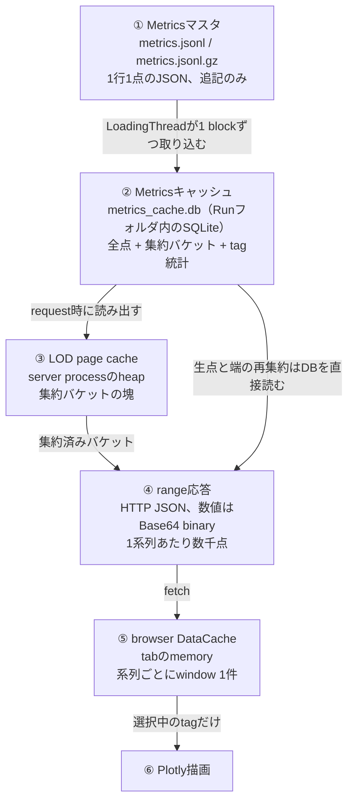
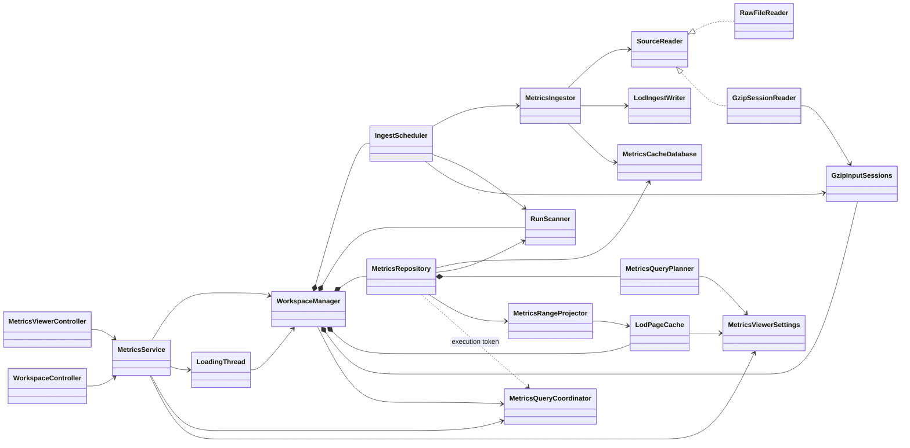
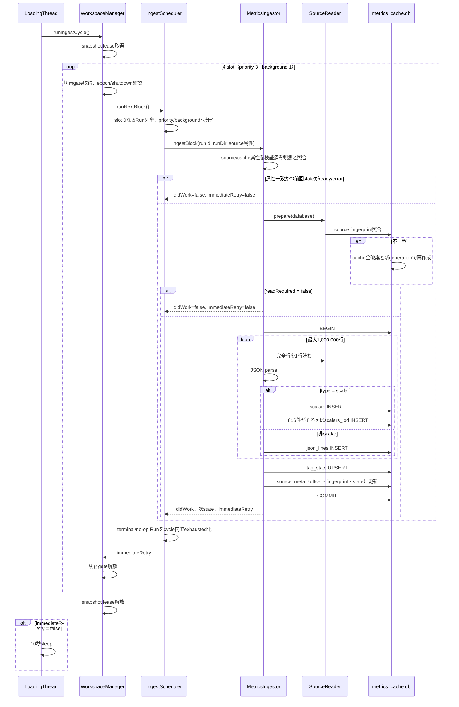
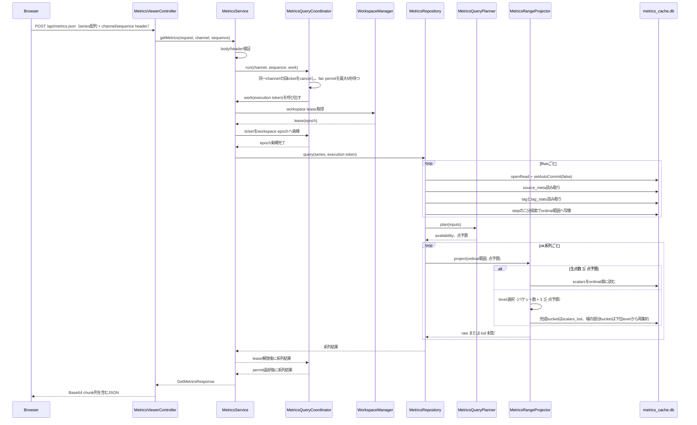
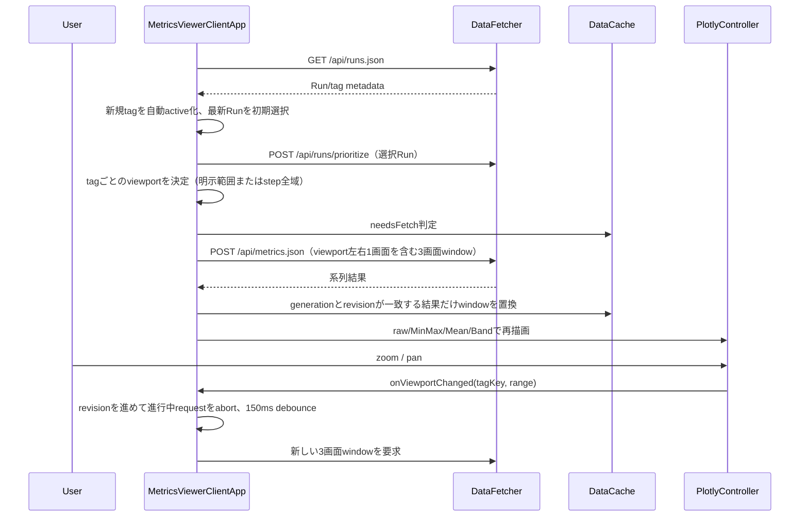

<!-- translated-from: 210_metrics_viewer.jp.md blob:25fd6a013da3405bcd32c3a0164d777c7c5e3799 date:2026-09-19 progress:done -->
# Metrics Viewer

> Primary perspective: concrete application (ingestion, cache DB, range queries, and browser rendering in processing order)

## 1. Introduction

### 1.1 Purpose

This document describes the Java/Spring Boot Metrics Viewer, from ingestion of the Metrics master through the Run-local SQLite cache structure and range query resolution to browser rendering.
It clarifies the boundary with the Runner process, how far the cache can be trusted, and which layer should receive additional responsibilities.

### 1.2 Intended Audience

- Developers modifying the Metrics Viewer server or frontend
- Developers tuning ingestion scheduling, LOD, point budgets, or query concurrency
- Reviewers of cache schema, HTTP API, and interprocess contract compatibility

### 1.3 Scope

This document covers the current `apps/metrics-viewer`. See [Observability](140_observability.en.md) for Runner-side Metrics master generation, Events, and metric registration internals.
[Applications and Tools](160_applications_and_tools.en.md) is authoritative for process boundaries with the Runner GUI and Optuna harness.
See the [Run Analysis Guide](030_user_guide_analysis.en.md) for usage and [Development Environment](040_development_environment.en.md) for build instructions.

Chapter 2 proceeds from the problem to the data flow and terminology definitions, requiring no prior knowledge.
Later chapters use Chapter 2's vocabulary to explain the implementation, so reading Chapter 2 first is recommended.

## 2. Metrics Viewer Overview and Basic Concepts

### 2.1 The Problem

During training, Runner keeps appending numeric values for each **tag**, such as `train/loss`, to files as JSON lines with one point per line.
Each line pairs a **step** (training progress), used on the horizontal axis, with a value. Long Runs can reach millions of points per tag and tens of millions across the Run.

A browser graph, however, is only about 1,000–2,000 pixels wide.
Sending millions of points merely overlaps thousands at each pixel, consuming bandwidth and memory.
Simple thinning, such as keeping one point in every 100, removes isolated spikes—the very events most useful for detecting training anomalies.

Metrics Viewer aims to meet three goals simultaneously:

1. Display an overview immediately, even for Runs with tens of millions of points.
2. Show finer detail when zooming into a range, eventually reaching the raw points themselves.
3. Display the appended portion of a Run continuously while training is still running.

It therefore converts the master file once into a form that avoids repeated full reads, then extracts and sends only the granularity needed for display.
The next section shows this entire flow.

### 2.2 Overall Data Flow

Data flows in one direction through six stages. Upstream data is more precise and heavier; downstream data is coarser and lighter.



Stages 1–5 retain data as follows; stage 6 performs rendering and has no independent data storage.

| Stage | Location | Data unit | Producer | Removal |
|---|---|---|---|---|
| 1. Metrics master | File in the Run folder | One point per line | Runner process | Remains until manually deleted; **the sole source of truth** |
| 2. Metrics cache | File in the Run folder | Ordinal within a tag | Viewer ingestion thread | Fully discarded on inconsistency; rebuildable from stage 1 |
| 3. LOD page cache | Server process heap | Page of 1024 buckets | Range query | Capacity overflow, Run disappearance, generation change |
| 4. Range response | Transport | Three viewport widths | Range query | Consumed per response |
| 5. Browser DataCache | Tab memory | One window per series | Client app | Redraw, generation change, tab reload |

Stages 2–5 can all be regenerated from stage 1. Deleting any of them loses speed, not information.
This one-way relationship is the overall design principle; no path writes upstream from downstream.

The detailed chapters for each stage are:

| Stage | Detailed sections |
|---|---|
| 1→2 ingestion | 6.1 (flow), 8.2–8.3 (storage and rebuild conditions) |
| 2 data structure | 8.2 (table definitions) |
| 2→4 range query | 6.2 (flow), 9.2 (point budgets and availability) |
| 3 LOD page cache | 10.1 (lifetime), 10.4 (performance) |
| 4 transport format | 9.4 (binary encoding) |
| 5–6 client | 6.3 (flow), 7.4 (constants and persistent state) |

Metrics Viewer does not connect directly to the Runner process. Its only inputs are Run folders in the `runs` directory.
Moving folders in or out and renaming them are the only ways to register, unregister, or rename visualization targets (the **Run working set**). The Viewer does not track Runs outside that working set.

The process has only two thread groups, coupled solely through SQLite files:

| Group | Thread | Role |
|---|---|---|
| Ingestion | Single `Metrics-LoadingThread` | Sole writer reading stage 1 block by block and writing stage 2 |
| Responses | Tomcat request threads | Open short-lived read connections to stage 2 and assemble stages 3–4 |

HTTP requests never read stage 1. They see only snapshots committed by the ingestion thread.
This separation keeps HTTP responses flowing while a large master is being read.

### 2.3 Three Different Caches

As shown above, three different entities are called caches. Their lifetimes and invalidation conditions differ, so this document consistently distinguishes them.

| Name | Implementation | Work avoided | Lifetime | Capacity control |
|---|---|---|---|---|
| Metrics cache | Run-local SQLite file | Master reparsing and full scans for range searches | Same as the Run folder; survives processes | None (proportional to the master) |
| LOD page cache | LRU on the server heap | Reading buckets from SQLite | Within the process | `cache-memory-mb` |
| Browser DataCache | Client JavaScript Map | HTTP round trips | Until the tab closes | One window per series |

SQLite also has a fourth cache, its per-connection page cache, but **the application does not depend on it**.
Metrics Viewer keeps connections short-lived: reads per request and writes per ingestion block, discarding connection-local caches each time.
Connections are not kept open because Windows cannot move or delete open files, which would break the operational contract that moving Run folders in/out registers/unregisters visualization targets.
The application-layer LOD page cache compensates for this.

### 2.4 Master/Cache Dependency

`metrics.jsonl` (or `metrics.jsonl.gz` after migration by the workspace metrics compression tool) is the **Metrics master**.
`metrics_cache.db` is a disposable **Metrics cache** derived from the master; it must not become a second master.

This distinction matters when schemas change or files become corrupt.
The cache assumes that it can be deleted at any time and rebuilt with identical content from the master. Schema-format or source-identity inconsistencies can therefore be resolved by full discard/rebuild without migrations.
Storing information available only in the cache would invalidate that assumption and prevent disposal. [ADR 0015](../adr/0015-metrics-cache-disposable-derivative.md) is authoritative on the details.

If both `metrics.jsonl` and `metrics.jsonl.gz` exist in the same Run folder, select `metrics.jsonl` and warn once per Run.

### 2.5 Tags, Steps, and Ordinals

Distinguish three terms:

- **Tag**: A series name, such as `train/loss`; one tag is one graph's time series.
- **Step**: An integer horizontal-axis coordinate representing training progress, assigned to each point by Runner.
- **Ordinal**: Recording order within one tag; a zero-based sequence number assigned by the Viewer during ingestion.

The **ordinal** provides point identity and order; step is stored only as a coordinate column. Step is not a primary key because it is not unique.
Steps are nondecreasing within a tag, but multiple episodes can legitimately have values at the same step. One measured episode-related tag had 240,109 points at a single step.
Making `(tag, step)` UNIQUE would lose legitimate data through REPLACE.

Consequently, step-range searches map step boundaries to ordinals using binary search, then operate on an ordinal interval.
There is no secondary step index. `[fromStep, toStep]` is a closed interval including both endpoints; its ordinal counterpart is the half-open interval `[ordinalFrom, ordinalTo)`.

### 2.6 LOD: Preparing Coarse Views in Advance

**LOD** (Level of Detail) comes from 3D graphics, where distant objects use coarse models.
Here it means drawing a preaggregated coarse series when viewing a wide range.

#### Why Thinning Is Insufficient

A simple approach keeps one point in every 16. It loses any spike among the other 15 points.
For training metrics, isolated outliers—a momentary loss spike or reward drop—are precisely the information of interest, so this approach is unsuitable.

Instead of discarding points, **aggregate each interval**. Group 16 consecutive points and retain their minimum, maximum, last value, count, and mean.
Keeping minimum and maximum ensures that every spike within the interval appears in the graph. Keeping the last value preserves continuity with the next group.

This aggregation unit is an **LOD bucket**.

#### Bucket Width Is Measured in Ordinals

Bucket width is measured in **ordinals**, such as 16 consecutive points, rather than step spans such as every 1000 steps.
Recording frequency differs by tag; step-based buckets could hold tens of thousands of points for dense tags and leave many empty buckets for sparse tags.
Ordinal-based buckets always contain a fixed number of points for every tag.

#### Building a Hierarchy

Required coarseness changes with zoom, so buckets form a hierarchy.
Groups of 16 points are **level 1**, groups of 16 level-1 buckets are **level 2**, and so on, giving width `16^level`.
The raw, unaggregated points are **level 0**, abbreviated **L0**. Hereafter, both the raw-point layer and its storage table are called L0.

| Level | Points covered by one bucket |
|---:|---:|
| 0 (L0) | 1 (raw point) |
| 1 | 16 |
| 2 | 256 |
| 3 | 4,096 |
| 4 | 65,536 |
| 5 | 1,048,576 |

Selecting one level at rendering time handles any zoom ratio.

The hierarchy is append-only. As soon as 16 children are available, write one parent and pass it upward as a child of the next level.
Incomplete buckets therefore do not exist in the DB, and buckets need not be rebuilt whenever points arrive.

#### Three Rendering Points per Bucket

Each bucket yields three rendering candidates: `min`, `max`, and `last`. Thus, the rendered point count at a level is the bucket count times 3.
If the raw point count in the range fits the budget, return raw points directly without LOD. This implements Section 2.1's second goal: eventually reaching the raw points themselves.

#### Statistics Are Not Derived from LOD

Exact per-tag statistics, including mean, variance, minimum, and maximum, are stored separately as **TagStats**.
These are range-independent statistics over all valid committed points, not derived from LOD.
LOD approximates display resolution; reconstructing statistics from it would make results depend on the displayed level and the presence of incomplete buckets.

### 2.7 Point Budgets and Level Selection

The **point budget** is the maximum number of rendering points (vertices) returned by one request.
The server allocates a budget per series and selects the finest level that fits it.

```
生点数 ≦ 点予算            → 生の点をそのまま返す（raw）
それ以外                   → バケット数 × 3 ≦ 点予算 を満たす最小のlevelを選ぶ
```

Budgets are allocated from request `maxPoints` (defaulting to `target-points-per-series`) and the request-wide `max-points-per-request`.
Because one request can contain many series, the server first reserves a minimum for every series and then shares the remainder equally. Section 9.2 describes the allocation procedure.

### 2.8 Viewport and Window

The **viewport** is the step range currently visible on screen. The **window** is the retrieval range the client requests from the server for that viewport.

Rather than requesting only the viewport, the client expands it by one screen on each side, requesting **three screens**.
Small pans then avoid another fetch, reducing time spent with blank graphs.

Only one window is retained per series. A new response replaces it entirely, without incremental merging.
Each range response is self-contained and independent of the previous response, so this simple replacement is sufficient.

### 2.9 Metrics Cache Generation

A Run folder with the same name represents different data if its master is replaced. The **Metrics cache generation** identifies this distinction.

A new UUID is issued for every full rebuild and retained across normal appends.
HTTP responses and browser DataCache compare generations to avoid mixing old-generation responses into new-generation graphs.

Do not confuse this with `PRAGMA user_version`. `user_version` identifies the schema format; generation identifies the cache contents.

### 2.10 Ingestion Progress State

`source_meta.state` indicates ingestion progress. Its string values are both persistent and exposed over HTTP, and must not change incompatibly.

| State | Meaning | Next cycle |
|---|---|---|
| `pending` | Cache just created; no block finalized | Continue reading |
| `converting` | At least one block committed; end not yet reached | Continue reading |
| `ready` | Finalized through the observed source end (stream EOF for gzip) | Resume raw input on append; do not read gzip |
| `error` | Fatal source error detected | Do not read until source size/mtime changes |

A **block** is the group of lines ingested in one transaction.
Reading a huge master in one transaction would make the Run unavailable throughout, so ingestion commits progress in blocks of at most 1,000,000 lines.
This limit preserves steady-state reading efficiency; if a workspace switch is waiting, the block commits early after applying the next complete line.
`converting` represents this partially visible state, shown in the browser with a progress percentage.

## 3. Component Definitions

### 3.1 Server

| Component | Definition |
|---|---|
| `MetricsViewerApplication` | Spring Boot application entry |
| `WorkspaceManager` | Atomically holds the current workspace as an epoch-bearing snapshot; manages API/ingest leases, the switch gate, close-on-zero of old resources, and terminal shutdown |
| `RunScanner` | Enumerates Run folders containing a Metrics master directly under the snapshot's `<workspace>/runs` and resolves Run IDs to Run directories |
| `MetricsSource` | Value describing the selected master file's kind, size, mtime, and SHA-256 fingerprints at its head and immediately before the committed position |
| `MetricsCacheDatabase` | Manages cache validation, discard/rebuild, `source_meta`, and read/write connection lifecycles |
| `SourceReader` | Abstraction reading only complete newline-terminated lines in blocks; implementations are `RawFileReader` and `GzipSessionReader` |
| `GzipInputSessions` | Retains decompressing gzip streams between conversion blocks and releases them per Run |
| `MetricsIngestor` | Finalizes one block's JSONL parsing, L0 writes, LOD appends, `TagStats`, and source position in one transaction |
| `LodIngestWriter` / `LodBucket` | Append-only writer combining each 16 children into a parent in `scalars_lod`, and its bucket value |
| `IngestScheduler` | Scans the Run working set and allocates one block at a time to actionable Runs at priority 3 : background 1; does not recheck terminal/no-op Runs within the same cycle |
| `LoadingThread` | Single writer thread running `WorkspaceManager.runIngestCycle()`; sleeps only when neither immediately actionable backlog nor a workspace switch remains |
| `MetricsQueryCoordinator` | Integrates process-global fair permits, the latest sequence per query channel, live tickets, workspace epochs, and terminal shutdown; stops checkpoints and running SQL when superseded |
| `MetricsRepository` | Opens one read snapshot per Run and resolves Run metadata and series queries |
| `MetricsQueryPlanner` | Determines per-series availability and request-wide point budget allocation |
| `MetricsRangeProjector` | Builds raw and LOD projections, reaggregating only partial buckets from lower levels |
| `LodPageCache` | Heap LRU cache holding only completed buckets in pages of 1024 |
| `MetricsService` | Handles LoadingThread lifecycle, metrics body/header validation, coordinator execution, snapshot lease acquisition, and HTTP error conversion |
| `MetricsViewerController` | Exposes Run, metrics, and priority REST APIs |
| `WorkspaceController` | Exposes workspace listing/switching APIs and converts malformed JSON to 400 `invalid_request` only within this controller |
| `MetricTraceEncoder` | Encodes double/float arrays into little-endian Base64 chunks |
| `RunWarningRegistry` | Suppresses repeated warnings across generations while a Run remains in the working set |
| `HttpAccessLogFilter` | Logs every request's start, end, and elapsed time at INFO |

### 3.2 Browser

| Component | Definition |
|---|---|
| `MetricsViewerClientApp` | Client app owning Run/tag selection, Run colors, viewports, rendering generations (revisions), and poll timers |
| `DataFetcher` | Handles REST calls, page-level query channels/sequences, and cancellation of old requests with AbortController |
| `DataCache` | Holds Run metadata and one window per `(runId, tagKey)` |
| `PlotlyController` | Handles raw/MinMax/Mean/Band rendering, signed-log axes, zoom/pan, scroll lock, and legend state |
| `UIController` | Handles Run/Tag lists, progress display, and static control binding |
| `Toast` | Displays temporary error notifications using CSS `.toast` rules |

### 3.3 UI Control Conventions

Browser controls have only two types: immediate actions and persistent on/off toggles.
Both use `button` elements, distinguished by their label wording.

| Type | Label | State |
|---|---|---|
| Immediate action | Starts with a verb: `Reload`, `Select All`, `Select Latest`, `Recolor`, `Clear All`, `Reset View` | None |
| Toggle | Noun phrase without an initial verb: `Auto Reload`, `Auto Recolor`, `Selected Only`, `Scroll Lock`, `Log`, `p5–p95`, `p1–p99` | Update `.active` and `aria-pressed` together |

In each section heading row, place list operations left-aligned after the label.
Only overflowing controls move to the next row (Runs' `Recolor` / `Auto Recolor`).
Sidebar buttons have the same dimensions whether in heading rows, button rows, or global controls.
When a bulk action such as `Select All` is pressed while filtering, clear the filter and execute the action instead of disabling the button.

Indicate on/off only through pressed colors, not label text. Centralize state updates in `setToggleState()`
to keep visual `.active` and semantic `aria-pressed` consistent. Do not use checkboxes.

Control borders use one level, `--control-border` (`--control-border-hover` on hover),
weaker than container borders such as `.section` using `--container-border`.
ON colors use `--active-background` / `--active-accent` / `--active-text`.

## 4. Code Map

| Area | Main files |
|---|---|
| Entry / configuration | [MetricsViewerApplication.java](../../apps/metrics-viewer/src/main/java/io/github/kazukin123/anetlab/metricsviewer/MetricsViewerApplication.java), [MetricsViewerSettings.java](../../apps/metrics-viewer/src/main/java/io/github/kazukin123/anetlab/metricsviewer/config/MetricsViewerSettings.java), [application.properties](../../apps/metrics-viewer/src/main/resources/application.properties) |
| Scan / source identity | [RunScanner.java](../../apps/metrics-viewer/src/main/java/io/github/kazukin123/anetlab/metricsviewer/infra/RunScanner.java), [MetricsSource.java](../../apps/metrics-viewer/src/main/java/io/github/kazukin123/anetlab/metricsviewer/infra/MetricsSource.java) |
| cache DB | [MetricsCacheDatabase.java](../../apps/metrics-viewer/src/main/java/io/github/kazukin123/anetlab/metricsviewer/infra/MetricsCacheDatabase.java) |
| Source reading | [SourceReader.java](../../apps/metrics-viewer/src/main/java/io/github/kazukin123/anetlab/metricsviewer/service/SourceReader.java), [RawFileReader.java](../../apps/metrics-viewer/src/main/java/io/github/kazukin123/anetlab/metricsviewer/service/RawFileReader.java), [GzipSessionReader.java](../../apps/metrics-viewer/src/main/java/io/github/kazukin123/anetlab/metricsviewer/service/GzipSessionReader.java), [GzipInputSessions.java](../../apps/metrics-viewer/src/main/java/io/github/kazukin123/anetlab/metricsviewer/service/GzipInputSessions.java) |
| Ingestion | [MetricsIngestor.java](../../apps/metrics-viewer/src/main/java/io/github/kazukin123/anetlab/metricsviewer/service/MetricsIngestor.java), [LodIngestWriter.java](../../apps/metrics-viewer/src/main/java/io/github/kazukin123/anetlab/metricsviewer/service/LodIngestWriter.java), [LodBucket.java](../../apps/metrics-viewer/src/main/java/io/github/kazukin123/anetlab/metricsviewer/service/LodBucket.java) |
| workspace / scheduling | [WorkspaceManager.java](../../apps/metrics-viewer/src/main/java/io/github/kazukin123/anetlab/metricsviewer/service/WorkspaceManager.java), [IngestScheduler.java](../../apps/metrics-viewer/src/main/java/io/github/kazukin123/anetlab/metricsviewer/service/IngestScheduler.java), [LoadingThread.java](../../apps/metrics-viewer/src/main/java/io/github/kazukin123/anetlab/metricsviewer/service/LoadingThread.java) |
| query | [MetricsQueryCoordinator.java](../../apps/metrics-viewer/src/main/java/io/github/kazukin123/anetlab/metricsviewer/service/MetricsQueryCoordinator.java), [QueryCancelledException.java](../../apps/metrics-viewer/src/main/java/io/github/kazukin123/anetlab/metricsviewer/service/QueryCancelledException.java), [MetricsRepository.java](../../apps/metrics-viewer/src/main/java/io/github/kazukin123/anetlab/metricsviewer/service/MetricsRepository.java), [MetricsQueryPlanner.java](../../apps/metrics-viewer/src/main/java/io/github/kazukin123/anetlab/metricsviewer/service/MetricsQueryPlanner.java), [MetricsRangeProjector.java](../../apps/metrics-viewer/src/main/java/io/github/kazukin123/anetlab/metricsviewer/service/MetricsRangeProjector.java), [LodPageCache.java](../../apps/metrics-viewer/src/main/java/io/github/kazukin123/anetlab/metricsviewer/service/LodPageCache.java) |
| API | [MetricsService.java](../../apps/metrics-viewer/src/main/java/io/github/kazukin123/anetlab/metricsviewer/service/MetricsService.java), [MetricsViewerController.java](../../apps/metrics-viewer/src/main/java/io/github/kazukin123/anetlab/metricsviewer/view/MetricsViewerController.java), [WorkspaceController.java](../../apps/metrics-viewer/src/main/java/io/github/kazukin123/anetlab/metricsviewer/view/WorkspaceController.java), [view/model](../../apps/metrics-viewer/src/main/java/io/github/kazukin123/anetlab/metricsviewer/view/model), [MetricTraceEncoder.java](../../apps/metrics-viewer/src/main/java/io/github/kazukin123/anetlab/metricsviewer/util/MetricTraceEncoder.java) |
| browser UI | [index.html](../../apps/metrics-viewer/src/main/resources/static/index.html), [metrics-viewer.js](../../apps/metrics-viewer/src/main/resources/static/metrics-viewer.js), [metrics-viewer.css](../../apps/metrics-viewer/src/main/resources/static/metrics-viewer.css) |
| test | [src/test/java](../../apps/metrics-viewer/src/test/java/io/github/kazukin123/anetlab/metricsviewer) |
| build | [pom.xml](../../apps/metrics-viewer/pom.xml), [checkstyle.xml](../../apps/metrics-viewer/checkstyle.xml) |


## 5. Static Structure



`MetricsCacheDatabase` returns separate write and read connections, but they share a lifecycle read-write lock per Run directory.
Only full discard/rebuild takes the write lock; ordinary transactions rely on WAL.

## 6. Main Flows

### 6.1 Block Ingestion



A trailing line without a newline is not exposed outside the block, and the committable offset never advances past the last complete line.
This prevents ingestion of a line while Runner is writing it. For gzip, an unterminated line is considered corrupt and sets `error` only when it remains at stream EOF.

Scalar validation follows the order below. A `null`, nonnumeric, nonfinite, or non-float32-representable value skips only that line and warns once per `(run, tag, reason)`.
If steps regress within a tag, quarantine only that tag as `status='error'`, not the entire master. Continue publishing its pre-quarantine L0, LOD, and `TagStats`; release quarantine only on a full rebuild triggered by source changes.

### 6.2 Range Queries



One read connection per Run is retained from planning through projection completion. The lifecycle read lock excludes full rebuilds, while the SQLite transaction preserves the same snapshot across ordinary ingestion commits.

### 6.3 Client Viewport and Window Replacement



Each range is a complete result independent of previous responses; the client replaces whole windows without incremental merging.
While any Run is being ingested, poll Run metadata every four seconds and update only progress display. Auto Reload refreshes the workspace list and metadata every 30 seconds, updating ranges only for series following the latest step. There is no dedicated workspace-list timer: initial display, workspace selector focus, switch results, manual Reload, and Auto Reload are refresh boundaries.

## 7. Configuration Reference

### 7.1 Metrics Viewer Settings

All settings are supplied through `application.properties` or startup arguments (`--key=value`). Numeric settings are validated by
`MetricsViewerSettings`, and workspace paths/names by the `WorkspaceManager` constructor.
Contract violations abort application startup.

| Key | Default | Valid range | Meaning |
|---|---:|---|---|
| `metricsviewer.workspaces-dir` | `workspaces` | Local path | Parent directory of workspaces; UNC roots are rejected at startup |
| `metricsviewer.initial-workspace` | `_default` | Direct child directory name | Initial current workspace; a valid but missing name starts with a warning and an empty Run list |
| `metricsviewer.target-points-per-series` | `8000` | 3 to `max-points-per-request` | Default vertex budget per series when `maxPoints` is omitted |
| `metricsviewer.max-points-per-request` | `500000` | 3 to 1,000,000 | Total vertices allocatable per request |
| `metricsviewer.cache-memory-mb` | `256` | Nonnegative and at most 50% of maximum heap | Heap limit for completed LOD pages; `0` bypasses page caching and reads individual buckets |
| `metricsviewer.max-concurrent-queries` | `2` | 1 to 4 | Process-global concurrency for `/api/metrics.json`; waits up to five seconds for a coordinator fair permit |

The upper bound for `cache-memory-mb` depends on `Runtime.maxMemory()`. Lowering the startup script's `-Xmx` can cause startup failure solely because of this setting.

### 7.2 Spring / Tomcat / Jackson Settings

| Key | Value | Intent |
|---|---|---|
| `server.port` | `8082` | Default Metrics Viewer port |
| `server.compression.enabled` | `false` | Disable compression by default because response bodies already use Base64 binary |
| `server.compression.mime-types` / `min-response-size` | JSON types / `512` | Targets when compression is enabled |
| `server.tomcat.connection-timeout` | `600000` | Avoid disconnection while generating large range responses |
| `server.tomcat.keep-alive-timeout` | `600000` | Same as above |
| `server.tomcat.max-keep-alive-requests` | `1000` | Avoid reconnecting during repeated polling |
| `spring.mvc.async.request-timeout` | `600000` | Same as above |
| `spring.jackson.mapper.allow-coercion-of-scalars` | `false` | Fail fast on loosely typed input such as `"123"` |
| `spring.jackson.deserialization.accept-float-as-int` | `false` | Fail fast on fractional steps and similar inputs |
| `logging.file.path` | `logs` | Write logs under the startup directory |

Request bodies additionally capture unknown fields with `@JsonAnySetter`; any such field produces `invalid_request`.
`runId` and `tagKey` accept only JSON strings through `StrictStringDeserializer`.

### 7.3 Startup Arguments

| Purpose | Example |
|---|---|
| Visualize default workspaces | `java -Xmx1g -jar target\metrics-viewer.jar --server.port=8082` |
| Visualize other workspaces | `java -Xmx1g -jar target\metrics-viewer.jar --metricsviewer.workspaces-dir=<path> --metricsviewer.initial-workspace=<name>` |

[22_metrics_viewer_java.bat](../../apps/22_metrics_viewer_java.bat) fixes the default path and port. There is no separate Optuna Viewer launcher; it uses the same workspace selector.

### 7.4 Browser Constants and Persistent State

Client constants not supplied by the server are defined at the beginning of [metrics-viewer.js](../../apps/metrics-viewer/src/main/resources/static/metrics-viewer.js).

| Constant | Value | Meaning |
|---|---:|---|
| `AUTO_RELOAD_INTERVAL_MS` | 30,000 | Workspace-list/metadata refresh interval with Auto Reload ON |
| `INGEST_POLL_INTERVAL_MS` | 4,000 | Progress polling interval while any Run is being ingested |
| `VIEWPORT_DEBOUNCE_MS` | 150 | Debounce before a range request after zoom/pan |
| `RUN_SOLO_INTERVAL_MS` | 350 | Threshold treating repeated clicks on the same Run row as solo selection |
| `HOVER_SCROLL_DELAY_MS` | 300 | Delay from hovering a Tag list entry to scrolling to its graph |
| `GRAPH_SCROLL_LOCK_DRAG_THRESHOLD_PX` | 1 | Movement threshold for drag scrolling under scroll lock |
| `RUN_COLOR_MIN_DISTANCE` | 0.16 | Minimum separation for preserving existing Run colors in `Auto Recolor` |

`MetricsViewerClientApp` owns Run colors and resolves them at the start of `refreshLists()`. It first assigns colors from `RUN_COLORS` in order to uncolored Runs sorted by runId, then separates only selected Runs if `Auto Recolor` is ON.
`Recolor` ignores current colors and assigns farthest-point colors in selection order, starting from palette color `#2F7DE1`. `Auto Recolor` reassigns only Runs whose existing colors fail `min(RUN_COLOR_MIN_DISTANCE, best achievable with the current palette)`.
Neither changes unselected Run colors. With more than 20 selected Runs, the palette cycles into another round. Both do nothing with at most one selected Run.

Only the following nine state items are saved to `localStorage`. Viewports, legend visibility, Run selection, and Run colors are not saved. Log and percentile ranges omit the workspace name from their keys and are shared across identically named tags.

| Key | Contents |
|---|---|
| `anet.metricsviewer.workspace` | Last selected workspace; overwritten by server current if absent from the list |
| `anet.metricsviewer.activeTags` | Currently selected tag set |
| `anet.metricsviewer.knownTags` | All tags ever observed; used to automatically activate only unknown tags |
| `anet.metricsviewer.graphScrollLockEnabled` | Scroll Lock on/off |
| `anet.metricsviewer.autoRecolorEnabled` | `Auto Recolor` on/off; defaults to ON, reading only `"false"` as OFF |
| `anet.metricsviewer.lodDisplayMode` | `MinMax` / `Mean` / `Band` |
| `anet.metricsviewer.logScaleTags` | Tags with signed-log enabled; stored as a lexicographically sorted JSON string array |
| `anet.metricsviewer.ignoreOutlierTags` | Tags with p5–p95 enabled; stored as a lexicographically sorted JSON string array |
| `anet.metricsviewer.p1P99Tags` | Tags with p1–p99 enabled; stored as a lexicographically sorted JSON string array |

Log and percentile-range sets are restored independently. p5–p95 and p1–p99 are mutually exclusive for a tag; if both were saved, warn and prefer p1–p99. If a value is not a JSON string array, warn and fall back to an empty set.

## 8. Metrics Cache Database Definition

### 8.1 File Identity and Connection Settings

| Item | Value |
|---|---|
| Filename | `metrics_cache.db` directly under the Run directory (with `-wal` and `-shm` when using WAL) |
| `PRAGMA application_id` | `0x414E4554` (`ANET`) |
| `PRAGMA user_version` | `1` (`SCHEMA_VERSION`) |
| Write connection | `busy_timeout=5000`, `journal_mode=WAL`, `synchronous=NORMAL` |
| Read connection | `busy_timeout=5000`, `query_only=ON` |
| Connection lifetime | Short-lived: reads per request, writes per ingestion block |

Connections are not kept open because Windows cannot move or delete open files, which would break the operational contract that moving Run folders in/out registers/unregisters visualization targets.
The lost page cache is replaced by an application-layer LRU (`LodPageCache`) restricted to completed buckets.

### 8.2 Table Definitions

#### `tags`

| Column | Type | Constraints | Meaning |
|---|---|---|---|
| `id` | INTEGER | PRIMARY KEY | Internal tag ID |
| `key` | TEXT | UNIQUE NOT NULL | Tag string |
| `type` | TEXT | NOT NULL CHECK(`'scalar'`) | Currently scalar only |
| `status` | TEXT | NOT NULL CHECK(`'ok'` / `'error'`) | Whether the tag is quarantined |
| `error_code` | TEXT | | Quarantine reason (currently `tag_step_regression`) |
| `error_message` | TEXT | | Human-readable details |
| `error_source_offset` | INTEGER | | Source offset where regression was detected |
| `error_previous_step` | INTEGER | | Previous step |
| `error_step` | INTEGER | | Regressed step |

#### `scalars` (All L0 Points)

| Column | Type | Constraints | Meaning |
|---|---|---|---|
| `tag_id` | INTEGER | NOT NULL | `tags.id` |
| `ordinal` | INTEGER | NOT NULL | Order within the tag, starting at 0 |
| `step` | INTEGER | NOT NULL | Step as a coordinate |
| `value` | REAL | NOT NULL | Only finite values representable as float32 |

PRIMARY KEY `(tag_id, ordinal)`, `WITHOUT ROWID`.

#### `scalars_lod`

| Column | Type | Meaning |
|---|---|---|
| `tag_id` | INTEGER | `tags.id` |
| `level` | INTEGER | At least 1; bucket width is `16^level` |
| `bucket` | INTEGER | `ordinalFrom / 16^level` |
| `cnt` | INTEGER | Point count in the bucket (always `16^level` for complete buckets) |
| `step_first` / `step_last` | INTEGER | First/last step in the bucket |
| `min_ordinal` / `min_step` / `vmin` | INTEGER / INTEGER / REAL | Point attaining the minimum |
| `max_ordinal` / `max_step` / `vmax` | INTEGER / INTEGER / REAL | Point attaining the maximum |
| `vmean` | REAL | Bucket mean, weighted by child counts |
| `vlast` | REAL | Last value in the bucket |

PRIMARY KEY `(tag_id, level, bucket)`, `WITHOUT ROWID`.
Parents are written only when all 16 children exist, so incomplete tail buckets have no rows. Ties are represented by the point with the smaller ordinal.

#### `tag_stats`

| Column | Type | Meaning |
|---|---|---|
| `tag_id` | INTEGER | PRIMARY KEY |
| `count` | INTEGER | Valid committed point count |
| `mean` | REAL | Welford mean |
| `m2` | REAL | Welford second moment; exposed by the API as `variance = m2 / count` and `stdDev` |
| `min_value` / `max_value` | REAL | Value range |
| `min_step` / `max_step` | INTEGER | Step range |
| `last_value` | REAL | Latest value |

`WITHOUT ROWID`. `TagStats` is not derived from LOD; it is updated in the same transaction as range-independent statistics over all committed L0 points.
LOD approximates display resolution, so deriving statistics from it would make results depend on the display level and incomplete buckets.

#### `json_lines`

| Column | Type | Meaning |
|---|---|---|
| `ordinal` | INTEGER | PRIMARY KEY; insertion order of nonscalar lines, not a line number in the entire source |
| `type` | TEXT | Nonscalar record type, such as `meta` / `json` / `video` |
| `tag` / `step` / `timestamp` | TEXT / INTEGER / TEXT | Indexing values extracted only when present |
| `json` | TEXT | Original JSON line unchanged |

The current HTTP API does not read this table. It preserves configuration dumps and metadata lines for external SQL analysis.

#### `source_meta`

A `WITHOUT ROWID` key-value table with `k TEXT PRIMARY KEY` / `v TEXT NOT NULL`.

| Key | Meaning |
|---|---|
| `generation` | Metrics cache generation UUID, reissued on every full rebuild |
| `source_kind` | `jsonl` or `jsonl.gz` |
| `source_size` | Most recently observed master size in bytes |
| `source_mtime` | Most recently observed master modification time in milliseconds |
| `source_head_sha256` | SHA-256 of the first 64 KiB |
| `source_commit_tail_sha256` | SHA-256 of the 64 KiB immediately preceding the committed offset |
| `committed_offset` | Finalized source offset: uncompressed bytes for raw input, consumed compressed-stream bytes for gzip |
| `state` | `pending` / `converting` / `ready` / `error` |
| `error_code` / `error_message` | Present only with `state=error` |

### 8.3 Discard/Rebuild Decisions

Check the following before and after opening the cache file. If any applies, delete the cache together with WAL/SHM and recreate it with a new generation. Log the reason as a warning.

| Category | Reason codes |
|---|---|
| Format | `application_id_mismatch`, `schema_version_mismatch`, `required_table_missing`, `required_column_missing`, `database_open_failed` |
| Metadata values | `generation_invalid`, `state_invalid`, `source_metadata_invalid` |
| Source identity | `source_kind_changed`, `source_head_changed`, `committed_source_tail_changed`, `source_truncated_below_committed_offset`, `source_truncated_below_previous_size` |
| Gzip-specific | `gzip_conversion_session_missing`, `gzip_source_size_changed`, `gzip_source_mtime_changed` |
| Error recheck | `errored_source_size_changed`, `errored_source_mtime_changed` |

Normal startup does not run `PRAGMA quick_check` / `integrity_check`, whose cost scales with DB size.
It performs only lightweight checks of `application_id`, schema version, required tables/columns, `source_meta`, and source fingerprints,
rebuilding caches found inaccessible or inconsistent.
Corruption in data pages not referenced by these checks is not detected at startup; it is handled as a SQLite error during actual ingestion/querying.
Fingerprint I/O failures are propagated to the caller as `IOException`, not flattened into cache mismatches.

An `error` Run is not reread until its source size or mtime changes. After repairing the source, updating the master in that Run folder triggers an automatic rebuild in the next cycle.

## 9. HTTP API

All APIs are under `/api`; `static/index.html` is served at the root.

### 9.1 Workspace API

`GET /api/workspaces.json` returns the current workspace and available choices. Choices are directories
directly under `metricsviewer.workspaces-dir` containing `runs/` or `config/`, sorted by name.
If current is missing, its name is still returned but is not included in the choices.

```json
{"current":"dm_long","workspaces":["_default","dm_long","dm_opt"]}
```

`POST /api/workspace` uses a closed schema accepting only `{"name":"dm_long"}` and returns
204 No Content on success. The current name returns a 204 no-op before existence checking and does not increment the epoch.
An unknown workspace returns 404 `unknown_workspace`; invalid body types, required fields, or unknown fields return 400
`invalid_request`. Malformed-JSON response conversion is restricted to `WorkspaceController`,
without changing parse-failure formats for metrics or prioritize APIs.

If a workspace is externally renamed or deleted after the selector is displayed and switching returns `unknown_workspace`,
the client removes that choice, returns to the previous workspace, refreshes the workspace list, and displays a Toast.
For switch failures other than 404, it retains the choice and returns to the previous workspace.
If the POST succeeds but refreshing the workspace list, metadata, or data fails, it keeps the switched workspace
and displays `Workspace switched, but data refresh failed.` in a Toast.
If server current itself has disappeared from the list, it does not automatically switch elsewhere;
it displays the current value as a disabled `(missing) <name>` option and shows a Toast once per unchanged missing state.

The client disables the workspace selector only while waiting for `POST /api/workspace`. After the response,
it enables the selector once workspace state and the selector are synchronized, allowing another switch even while
workspace-list, metadata, or data refresh is ongoing. Each switch advances the workspace switch revision. A new switch
aborts older metadata/metrics requests and invalidates all rendering revisions. Older switch generations cannot apply
late list/refresh results, failure displays, or Toasts; only the latest switch generation owns follow-up processing.

Within the gate shared with ingestion cycles, switching creates a new snapshot, atomically swaps current, then retires
the old snapshot. API queries retain their initial snapshot lease until completion, preventing identically named Runs
or caches in different workspaces from mixing during a switch. Old snapshot gzip streams close exactly once when the last lease is released.

### 9.2 `GET /api/runs.json`

Returns metadata for the entire Run working set. Every call scans the runs directory, immediately reflecting folder operations.

```
{ "runs": [ {
    "id": "run_20260612-015116",
    "generation": "0f7c...",              // UUID。cacheが無い間はnull
    "stats": { "maxStep": 2000000 },
    "ingest": { "state": "converting", "percentage": 37,
                "error": { "code": "...", "message": "..." } },   // errorはnullなら省略
    "tags": [ { "key": "train/loss", "type": "scalar", "status": "ok",
                "stats": { "minStep": 0, "maxStep": 2000000, "count": 125000,
                           "lastValue": 0.01, "minValue": 0.0, "maxValue": 1.2,
                           "mean": 0.08, "variance": 0.004, "stdDev": 0.063 } } ]
} ] }
```

- `percentage` is derived from `state`: 0 for `pending`, 100 for `ready`, otherwise `committed_offset / source_size` clamped to 0–99. When `source_size` is 0, it is 0 for `error` and 100 otherwise.
- A Run whose cache cannot yet be opened returns `state=pending`, `generation=null`, and `tags=[]`, without failing the whole request.
- Null `ingest.error`, `tags[].stats`, and `tags[].error` are omitted. `generation` remains null in the response.
- This call also maintains LOD page cache generations, discarding pages for Runs removed from the working set and old pages for Runs whose generation changed.

### 9.3 `POST /api/metrics.json`

Request:

```
{ "series": [ { "runId": "...", "tagKey": "...",
                "fromStep": 0, "toStep": 2000000, "maxPoints": 8000 } ] }
```

Required headers:

| Header | Contract |
|---|---|
| `X-Query-Channel` | Nonblank string of 1–128 characters corresponding to one browser tab; not trimmed |
| `X-Query-Sequence` | Nonnegative JavaScript safe integer increasing with each POST within the channel |

When the page is created, the browser uses `crypto.randomUUID()` for its channel if available. Where the API is undefined, such as insecure remote HTTP, it generates a tab-specific channel of at most 128 characters from the time and multiple random fragments, preserving access via `http://<host>:8082`.

`fromStep` / `toStep` are required endpoints of a closed interval and must fit JavaScript's safe-integer range (±9,007,199,254,740,991). `maxPoints` is optional and defaults to `target-points-per-series`.

Response, per series:

| Field | Meaning |
|---|---|
| `runId` / `tagKey` / `fromStep` / `toStep` | Echoed request values |
| `generation` | Cache generation used for the response; the client discards results not matching the metadata generation |
| `availability` | `ok` / `pending` / `not_found` / `empty` |
| `pointBudget` | Vertices allocated to this series; 0 unless `ok` |
| `level` / `bucketWidth` | `0` / `1` for raw; level and `16^level` for LOD |
| `issues` | Array of `{scope, code, message}`; omitted when empty |
| `projection` | `kind = "raw"` or `"lod"` |

`availability` is determined as follows, distinguishing `pending` from definitive values according to whether ingestion continues.

| Situation | Ingesting | Ingestion complete |
|---|---|---|
| Run absent from working set | `not_found` | `not_found` |
| Cache cannot open / query fails | `pending` | `pending` |
| Tag not yet present | `pending` | `not_found` |
| Tag exists but has zero points | `pending` | `empty` |
| No points in range | `pending` | `empty` |
| Points in range | `ok` | `ok` |

`MetricsQueryPlanner` allocates point budgets:

1. Assign each `ok` series `cap = min(requested maxPoints, raw points in range)`.
2. First reserve `min(50, cap)` for every series. If the total exceeds `max-points-per-request`, return 422 immediately.
3. Distribute the remainder equally, round-robin, up to each `cap`.

Error responses:

| Status | Body | Trigger |
|---|---|---|
| 400 | `{"code":"invalid_request","message":...}` | Invalid body; missing, empty, overlong, malformed, or out-of-range query headers |
| 409 | `{"code":"superseded","message":...}` | Stopped by a newer query in the same channel, workspace switch, shutdown, or late sequence |
| 422 | `{"seriesCount":N,"requiredMinimumPoints":M,"maxPointsPerRequest":K}` | Too many series to allocate even minimum budgets |
| 503 | `{"code":"query_busy","message":...}` + `Retry-After: 2` | Other channels hold all slots and no permit becomes available within five seconds, or a lease cannot be acquired during shutdown |

### 9.4 `POST /api/runs/prioritize`

Accepts `{"runIds": ["...", "..."]}` and replaces the entire ingestion-priority Run set. Success returns 204 No Content.
Nonexistent Run IDs, empty strings, and unknown fields return 400. The client sends this whenever Run selection changes, serializing calls by waiting for the previous send to finish.

### 9.5 Binary Projection Encoding

Numeric sequences are returned as arrays of Base64 strings containing little-endian binary, not JSON numeric arrays. Each chunk contains 250,000 elements, equivalent to 1 MB for floats.

| Series | Element type |
|---|---|
| `steps`, `minSteps`, `maxSteps` | float64 |
| `values`, `mins`, `maxs`, `means` | float32 |

```
raw : { "kind":"raw", "steps":[...], "values":[...] }
lod : { "kind":"lod",
        "minMax":  { "steps":[...], "values":[...] },
        "summary": { "steps":[...], "mins":[...], "maxs":[...],
                     "means":[...], "minSteps":[...], "maxSteps":[...] } }
```

`minMax` contains each bucket's `min` / `max` / `last` points in ordinal order for a polyline; repeated ordinals collapse to one point.
`summary.steps` contains the first step of each bucket and is used for band rendering and bucket-level hover display.

## 10. Lifetime, Concurrency, and Error Boundaries

### 10.1 Lifetime

- `MetricsService` starts `LoadingThread` in `@PostConstruct`. `@PreDestroy` calls `MetricsQueryCoordinator.cancelAll()`, waits up to 30 seconds for `LoadingThread` to stop, then calls `WorkspaceManager.shutdown()`.
- Metrics queries acquire a workspace lease after obtaining a coordinator permit. On completion, they release SQL/connections, the lease, and the permit in that order, closing old resources retired by switching before returning the permit.
- `LoadingThread` is a daemon thread. It sleeps for 10 seconds when no immediate retry is required by a `converting` backlog or workspace switch. Cycles committing small appends through `ready` also sleep. RuntimeExceptions at cycle boundaries are logged, with recovery attempted after 10 seconds.
- `WorkspaceManager.shutdown()` is terminal. Once it begins, new leases and workspace switches immediately fail with `IllegalStateException`; an active cycle stops after safely finishing its current block. Existing leases remain usable, and the last release closes retired resources exactly once.
- For Runs undergoing gzip conversion, `GzipInputSessions` retains decompressed streams between blocks. Moving such a Run folder is unsupported during conversion. Streams are released upon reaching `ready`, failure, or disappearance from the working set.
- `LodPageCache` retains only complete pages and discards them when a Run disappears or its generation changes. Capacity overflow evicts entries by access-order LRU.

### 10.2 Concurrency

| Boundary | Mechanism |
|---|---|
| Full cache discard/rebuild | Per-Run-directory lifecycle write lock |
| Ordinary read/write transactions | Read side of the same lock plus WAL |
| Stable snapshot for one query | One read connection per Run retained with `autoCommit=false` |
| Query concurrency/superseding | `MetricsQueryCoordinator` fair permits (up to five seconds waiting), latest sequence per channel, and identity-bearing live tickets; slot cancellation wakes only waiting threads, while running SQL stops through `Statement.cancel()` and checkpoints |
| Workspace switching and queries | Cancel only the old epoch of `SWITCHED`, after releasing the switch gate; do not cancel `NO_OP` or `UNKNOWN` |
| Ingestion writer | Only one `LoadingThread`; multiple writers are not assumed |
| Workspace switching and ingestion | Release the fair switch gate after every ingestion block; a waiting switch request causes early commit at a complete-line boundary, and no remaining blocks are assigned to the old workspace after POST success |
| Priority-set updates | `AtomicReference`; older scan results do not remove priorities added after scanning began |

### 10.3 Error and Warning Policy

- Fatal source errors (malformed JSON, missing `type`, `tag`, or `value`, invalid steps, corrupt gzip) roll back the transaction and set the Run to `error`. Do not skip the line and continue.
- Single-point anomalies (`null`, nonnumeric, nonfinite, outside float32 range) skip that point and warn once per `(run, tag, reason)`.
- Step regression quarantines only the affected tag, without hiding other tags' committed data.
- Per-Run read failures in `runs.json` become `pending` rather than exceptions, preventing one corrupt Run from removing the whole list.
- `RunWarningRegistry` owns warning suppression and clears it only when the Run leaves the working set. Reintroducing a Run with the same name permits warnings again.

### 10.4 Performance Characteristics

- Ingestion parses streams in blocks of at most 1,000,000 lines, without intermediate Lists. This limit is retained in steady state; only pending workspace switches cause shorter blocks committed at complete-line boundaries. In either case, L0, LOD, `TagStats`, and source position share the same commit boundary.
- Fully validated `ready` / `error` Runs retain source/cache attributes in process memory. Polling unchanged attributes avoids fingerprints, Metrics master contents, and SQLite connections. These observations disappear when a Run leaves, the workspace snapshot is discarded, or the process restarts.
- Range query cost consists of step binary search, bucket reads, and partial-bucket reaggregation. Reaggregation is needed only for buckets whose boundaries do not align with viewport edges and tail buckets lacking all 16 children.
- LOD pages are read in units of 1024 buckets; only complete pages remain on the heap. One page occupies `1024 × 96` bytes (eight long columns plus four double columns).
- Responses use Base64 binary, so HTTP compression is disabled by default to avoid CPU cost.

## 11. Build and Dependencies

### 11.1 Project Coordinates

| Item | Value |
|---|---|
| groupId / artifactId | `io.github.kazukin123.anetlab` / `metrics-viewer` |
| version | `0.1.0-SNAPSHOT` |
| packaging | `jar` (`finalName = metrics-viewer`) |
| Java | 17 (`maven.compiler.release`) |
| encoding | UTF-8 |

### 11.2 Dependencies

| groupId:artifactId | Version | Scope | Purpose |
|---|---|---|---|
| `org.springframework.boot:spring-boot-starter-web` | 3.5.7 | compile | Embedded Tomcat, Spring MVC, Jackson auto-configuration, static resource serving |
| `org.springframework.boot:spring-boot-starter-logging` | 3.5.7 | compile | SLF4J + Logback |
| `com.fasterxml.jackson.core:jackson-databind` | 2.20.1 | compile | Parsing individual JSONL lines and binding API requests/responses |
| `org.xerial:sqlite-jdbc` | 3.53.1.0 | compile | Metrics cache (`jdbc:sqlite:`) |
| `org.projectlombok:lombok` | 1.18.42 | compile (optional) | View model `@Data` / `@Builder` |
| `org.springframework.boot:spring-boot-devtools` | 3.5.7 | compile (optional) | Development only; restart disabled in `spring-devtools.properties` |
| `org.springframework.boot:spring-boot-starter-test` | 3.5.7 | test | JUnit 5, `@SpringBootTest`, MockMvc |
| `com.microsoft.playwright:playwright` | 1.60.0 | test | Browser display tests; also brings `com.google.gson` transitively |

`jackson-databind` and logging also arrive through starters, but are explicitly declared to pin their versions.

### 11.3 Build Plugins

| Plugin | Version | Configuration |
|---|---|---|
| `spring-boot-maven-plugin` | 3.5.7 | `repackage` generates an executable JAR |
| `maven-compiler-plugin` | 3.15.0 | `release=17`, `parameters=true`, `proc=full`, with lombok as annotation processor |

Java coding conventions are defined in [checkstyle.xml](../../apps/metrics-viewer/checkstyle.xml): tab indentation (width 4, continuation 8), maximum line length 120, `FinalLocalVariable`, and standard naming rules. Eclipse settings reside in `.checkstyle` and formatter definitions.

### 11.4 Build and Run

```powershell
cd apps\metrics-viewer
mvn -B test
mvn -B package
java -Xmx1g -jar target\metrics-viewer.jar --server.port=8082
```

### 11.5 Frontend Assets

The frontend has no npm or other build step; `src/main/resources/static` is served directly.
Its only external dependency is Plotly loaded from a CDN (`https://cdn.plot.ly/plotly-2.27.0.min.js`); no framework is used.
A separate asset retrieval arrangement is needed for fully offline environments.

## 12. Tests and Extension Checklist

### 12.1 Test Organization

| Area | Main tests |
|---|---|
| Cache DB format and discard/rebuild | `MetricsCacheDatabaseIntegrationTest`, `MetricsCacheIntegrationTest` |
| Ingestion (blocks, gzip, errors, quarantine) | `MetricsIngestorIntegrationTest` |
| LOD construction and projection | `MetricsLodIntegrationTest`, `LodPageCacheTest` |
| Scheduling / workspace lifetime | `IngestSchedulerTest`, `LoadingThreadTest`, `WorkspaceManagerTest`, `WorkspaceSnapshotIntegrationTest` |
| Query planning and snapshots | `MetricsQueryPlannerTest`, `MetricsRepositorySnapshotIntegrationTest`, `MetricsQueryConcurrencyTest` |
| HTTP API | `MetricsApiIntegrationTest`, `WorkspaceApiIntegrationTest`, `SeriesAvailabilityTest`, `HttpAccessLogFilterTest` |
| Scanning and configuration | `RunScannerTest`, `MetricsViewerSettingsTest` |
| Browser UI | `RunListPlaywrightTest`, `TagListPlaywrightTest`, `MetricsPlotPlaywrightTest`, `GraphInteractionPlaywrightTest`, `SignedLogPlaywrightTest`, `OutlierRangePlaywrightTest`, `WorkspaceSelectorPlaywrightTest` |

Playwright tests launch Microsoft Edge by default. Without Edge, `Assumptions` skips them rather than failing.
Each test opens a fresh context; routes, `localStorage`, and Plotly state are not shared.

### 12.2 Change Checklist

1. Increment `SCHEMA_VERSION` when changing the cache schema. Do not write migrations; test that old caches are discarded and rebuilt with warnings.
2. The externalName values of `IngestState` and `SeriesAvailability` are persistent and exposed over HTTP. Adding values is allowed; renaming or removing existing values is incompatible.
3. Add new ingestion work to the same transaction. Splitting L0, LOD, `TagStats`, and `source_meta` across commits breaks consistency on crashes.
4. When changing LOD, verify both persistence of completed buckets only and reaggregation of partial edge buckets from lower levels.
5. Do not derive statistics from LOD. Build range-independent statistics from all committed L0 points.
6. After changing point-budget allocation, test how the 422 and 503 boundaries change for requests with many series.
7. Keep new client state in the client app so it survives Plotly DOM reconstruction during Reload.
8. For long-running Runs, verify that the same range returns identical results during ingestion (`converting`) and after completion (`ready`).
9. Verify that moving Run folders in/out and renaming them is reflected immediately, and that no file handles remain even for Runs being ingested.

## 13. Related Documents

- [Run Analysis User Guide](030_user_guide_analysis.en.md)
- [Development Environment](040_development_environment.en.md)
- [Observability](140_observability.en.md)
- [Applications and Tools](160_applications_and_tools.en.md)
- [ADR: Metrics Cache as a Disposable Derivative](../adr/0015-metrics-cache-disposable-derivative.md)
- [Domain Glossary](../../CONTEXT.md)
