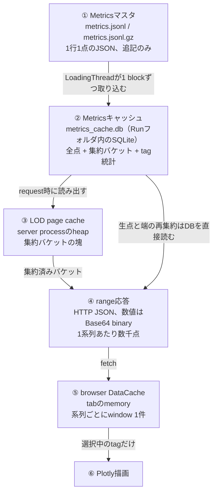
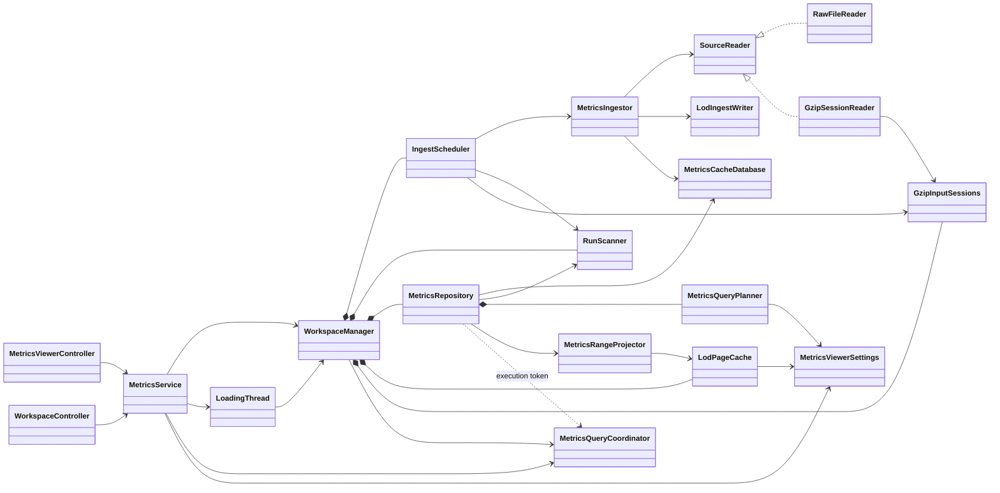
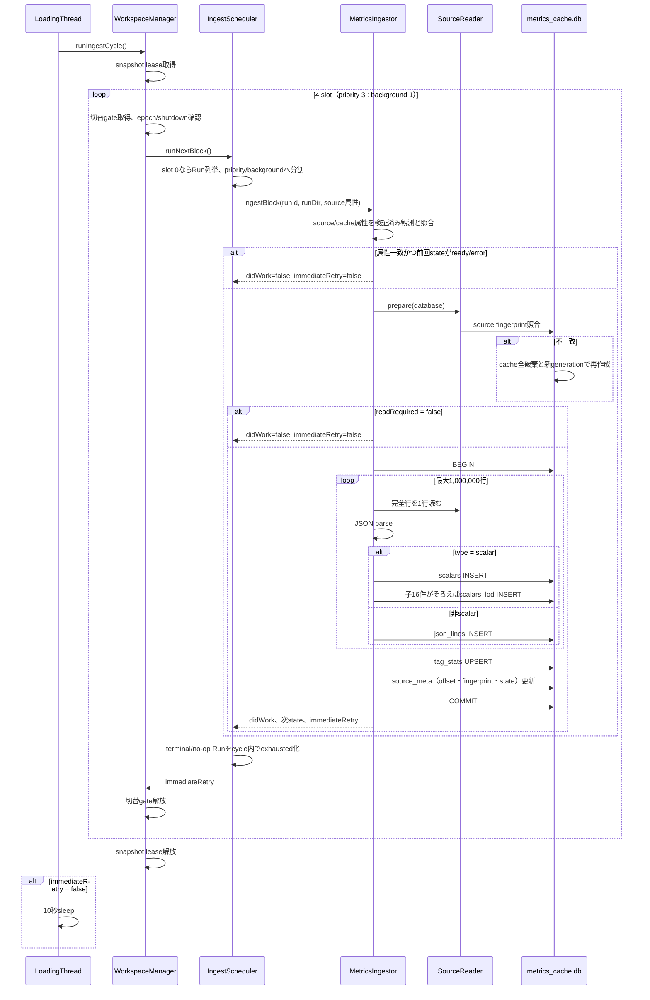
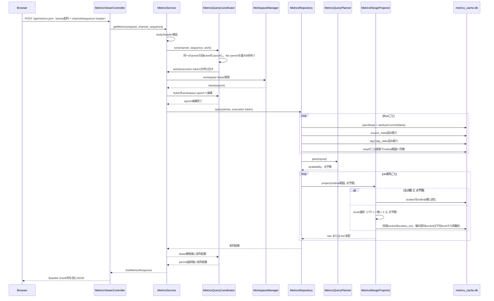
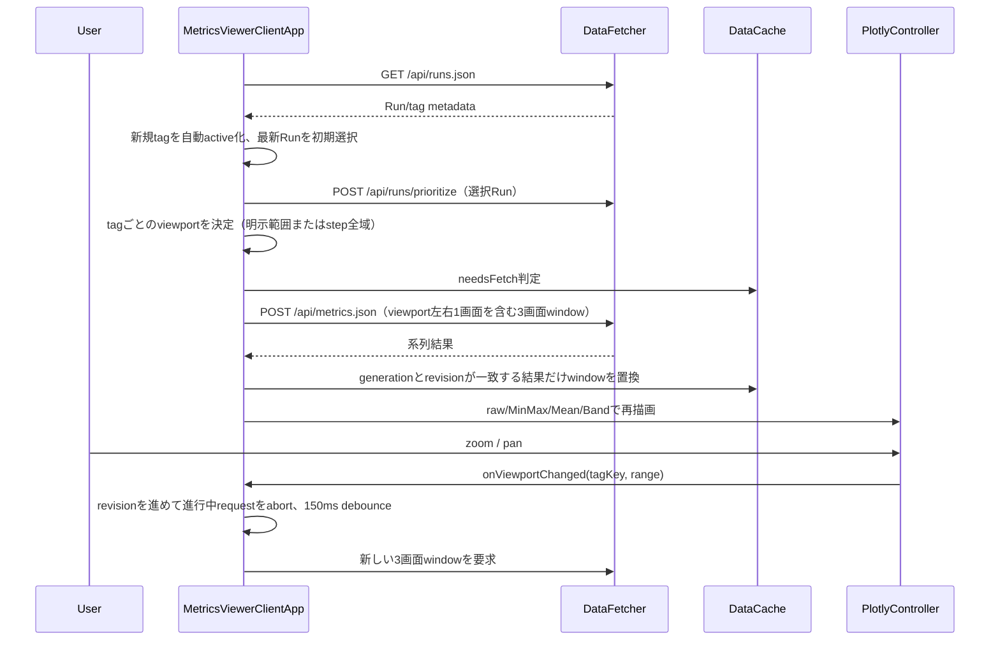

# Metrics Viewer

> 主たる観点: 具象application単位（取り込み、cache DB、range query、browser描画を工程順に併記）

## 1. はじめに

### 1.1 目的

本書は、Java/Spring Boot製のMetrics Viewerについて、Metricsマスタからの取り込み、Run-local SQLite cacheの構造、range queryの解決、browser側の描画までを説明する。
Runner processとの境界、cacheをどこまで信頼してよいか、どの層に責務を追加すべきかを明確にする。

### 1.2 対象読者

- Metrics Viewerのserver・frontendを変更する開発者
- 取り込みscheduling、LOD、点予算、query同時実行を調整する開発者
- cache schema、HTTP API、process間contractの互換性をレビューする担当者

### 1.3 記載範囲

現行の`apps/metrics-viewer`を扱う。Runner側のMetricsマスタ生成、Event、metric登録の内部は[可観測性](140_observability.jp.md)を参照する。
Runner GUI、Optuna harnessとのprocess境界は[アプリケーションとツール](160_applications_and_tools.jp.md)を正本とする。
利用手順は[Run分析ガイド](030_user_guide_analysis.jp.md)、build手順は[開発環境](040_development_environment.jp.md)を参照する。

2章は前提知識なしで読めるように、解きたい問題からデータの流れ、用語の定義までを順に説明する。
3章以降は2章の語彙を使って実装を説明するため、先に2章を通して読むことを勧める。

## 2. Metrics Viewerの概要と基本概念

### 2.1 解きたい問題

Runnerは学習中、`train/loss`のような**tag**ごとの数値を、1行1点のJSON行としてfileへ追記し続ける。
横軸に使う**step**（学習の進行度）と値の組が延々と並ぶ形である。長いRunでは1 tagが数百万点、Run全体で数千万点に達する。

一方、browserのgraphは横幅がせいぜい1,000〜2,000ピクセルしかない。
数百万点をそのまま送っても、1ピクセルへ数千点が重なって潰れるだけで、転送量とmemoryだけを消費する。
かといって「100点に1点だけ残す」ような素朴な間引きをすると、学習の異常検知でいちばん見たい単発のスパイクが消えてしまう。

Metrics Viewerは次の3つを同時に満たすことを目標とする。

1. 数千万点のRunでも、開いた瞬間に全体像が出る。
2. zoomすれば、その範囲だけ細かい形が出る。十分に狭めれば最後は生の点そのものへ到達する。
3. 学習が走っている最中のRunでも、追記済みの範囲を止めずに見られる。

このために、「マスタfileを毎回読み直さずに済む形へ一度変換しておき、表示に必要な粒度だけを切り出して送る」構造を採る。
次節でその流れ全体を示す。

### 2.2 データフロー全体像

データは次の6段を一方向に流れる。上流ほど正確で重く、下流ほど粗くて軽い。



データを保持する①〜⑤の性質は次のとおりである（⑥は描画そのもので、独自のデータ保持を持たない）。

| 段 | 置き場所 | データの単位 | 作る主体 | 消えるとき |
|---|---|---|---|---|
| ① Metricsマスタ | Runフォルダのfile | 1行1点 | Runner process | 手動で消すまで残る。**唯一の正** |
| ② Metricsキャッシュ | Runフォルダのfile | tag内の序数 | Viewerの取り込みthread | 不整合検出時に全破棄。①から再構築できる |
| ③ LOD page cache | server processのheap | 1024バケットのpage | range query | 容量超過、Run消失、世代変更 |
| ④ range応答 | 通信路 | viewport 3画面分 | range query | 応答ごとに使い切り |
| ⑤ browser DataCache | tabのmemory | 系列ごとにwindow 1件 | client app | 再描画、世代変更、tab再読込 |

②〜⑤はすべて①から再生成できる。どこを消しても失われるのは速度だけで、情報は失われない。
この一方向性が全体の設計原則であり、下流から上流へ書き戻す経路は存在しない。

各段を詳しく扱う章は次のとおりである。

| 段 | 詳細を扱う章 |
|---|---|
| ①→② 取り込み | 6.1（フロー）、8.2〜8.3（格納先と再構築条件） |
| ② データ構造 | 8.2（table定義） |
| ②→④ range query | 6.2（フロー）、9.2（点予算とavailability） |
| ③ LOD page cache | 10.1（lifetime）、10.4（性能） |
| ④ 通信形式 | 9.4（binary符号化） |
| ⑤⑥ client | 6.3（フロー）、7.4（定数と永続state） |

なお、Metrics ViewerはRunner processへ直接接続しない。`runs`ディレクトリのRunフォルダだけが入力である。
フォルダを入れる・出す・リネームするというファイル操作だけが、可視化対象（**Run作業セット**）の登録・解除・改名の手段であり、Viewerは作業セット外のRunを追跡しない。

process内のthreadは次の2系統だけで、両者はSQLite fileを介してのみ結合する。

| 系統 | thread | 役割 |
|---|---|---|
| 取り込み | 単一の`Metrics-LoadingThread` | ①を1 blockずつ読み、②へ書く唯一のwriter |
| 応答 | Tomcat request thread | ②へ短命なread connectionを開き、③〜④を組み立てる |

HTTP requestは①を一切読まない。取り込みthreadがcommit済みのsnapshotだけを見る。
この分離により、巨大なマスタを読んでいる最中でもHTTP応答が止まらない。

### 2.3 「キャッシュ」と呼ぶものが3つある

上表のとおり、性質の違う3つを「キャッシュ」と呼ぶ場面がある。寿命と破棄条件が異なるので、本書では常に区別して呼ぶ。

| 呼称 | 実体 | 何を省くためか | 寿命 | 容量制御 |
|---|---|---|---|---|
| Metricsキャッシュ | Run-localのSQLite file | マスタの再parseと、範囲検索のための全走査 | Runフォルダと同じ。processをまたいで残る | なし（マスタに比例） |
| LOD page cache | server heapのLRU | SQLiteからのバケット読み出し | process内 | `cache-memory-mb` |
| browser DataCache | client JavaScriptのMap | HTTPの往復 | tabを閉じるまで | 系列ごと1 windowのみ |

4つ目として、SQLite自身が持つconnection内のpage cacheがあるが、**これには依存しない**。
Metrics Viewerはconnectionを読み＝request単位、書き＝取り込みblock単位の短命に保つため、connection内のcacheは毎回捨てられる。
常時接続にしないのは、Windowsではopen中のfileを移動・削除できず、「Runフォルダの出し入れ＝可視化対象の登録・解除」という運用契約が壊れるためである。
その代わりをapplication層のLOD page cacheが務める。

### 2.4 マスタとキャッシュの従属関係

`metrics.jsonl`（workspace metrics圧縮ツールで移行した後は`metrics.jsonl.gz`）が**Metricsマスタ**である。
`metrics_cache.db`はマスタから従属構築される破棄可能な**Metricsキャッシュ**であり、第2のマスタにはしない。

この区別が効いてくるのは、schemaを変えたときとfileが壊れたときである。
キャッシュは「いつ削除してもマスタから同一内容を再構築できる」ことを前提にするので、schema様式やsourceの同一性に不整合があれば、migrationを書かずに全破棄・再構築で解決してよい。
逆にキャッシュ側にしか無い情報を持たせると、この前提が崩れて破棄できなくなる。詳細は[ADR 0015](../adr/0015-metrics-cache-disposable-derivative.md)を正本とする。

同一Runフォルダに`metrics.jsonl`と`metrics.jsonl.gz`が両方ある場合は`metrics.jsonl`を選び、Runごと1回だけWARNする。

### 2.5 tag、step、序数

3つの語を区別する。

- **tag**: 系列の名前。`train/loss`のような文字列で、1 tag = graph 1本分の時系列である。
- **step**: 横軸の座標値。学習の進行度を表す整数で、Runnerが各点へ付ける。
- **序数**（ordinal）: 1つのtag内での記録の出現順。0始まりの通し番号で、Viewerが取り込み時に振る。

点のidentityと順序は**序数**が持ち、stepは座標値として列に置くだけである。stepを主キーにしない理由は、stepが一意にならないためである。
同一tagのstepは非減少だが、同一stepへ複数episodeの値が正当に載る。実測では1つのepisode系tagに同一stepの点が240,109件あった。
ここで`(tag, step)`をUNIQUEにすると、正当なデータをREPLACEで失う。

この選択の帰結として、step範囲での検索は「二分探索でstep境界を序数へ写像し、以降は序数区間として扱う」形になる。
step用の補助indexは持たない。`[fromStep, toStep]`は両端を含む閉区間で、対応する序数区間は`[ordinalFrom, ordinalTo)`の半開区間になる。

### 2.6 LOD ― 粗い絵をあらかじめ作っておく

**LOD**（Level of Detail、詳細度）は、3Dグラフィクス由来の考え方で、「遠くのものは粗いモデルで描く」ことを指す。
ここでは「広い範囲を見るときは、あらかじめ集約しておいた粗い系列を描く」という意味で使う。

#### なぜ間引きではだめか

素朴な案は「16点に1点だけ残す」である。しかしこれは、残らなかった15点にスパイクがあると消してしまう。
学習metricsでは、lossが一瞬跳ねた・報酬が一度だけ落ちたという単発の外れ値こそ見たい情報なので、この方式は採れない。

そこで、点を捨てるのではなく**区間ごとに畳み込む**。連続する16点を1つの単位にまとめ、その中の最小値・最大値・最終値・件数・平均を保存しておく。
最小値と最大値が残るので、区間内にスパイクがあれば必ず絵に出る。最終値が残るので、隣の単位との繋がりも保たれる。

この集約単位を**LODバケット**と呼ぶ。

#### バケットの幅は序数で数える

バケットの幅は「連続する16点」のように**序数**で数え、「step 1000ごと」のようにstep幅では数えない。
tagごとに記録頻度が違うため、step幅で切ると、密なtagでは1バケットに数万点が入り、疎なtagでは空バケットが大量に並ぶ。
序数で切れば、どのtagでも1バケットの中身が常に一定件数になる。

#### 階層にする

zoomの倍率に応じて必要な粗さが変わるので、バケットを階層にする。
16点ずつまとめたものを**level 1**、level 1のバケットを16個まとめたものを**level 2**、というように、幅は`16^level`になる。
集約前の生の点そのものは**level 0**、略して**L0**と呼ぶ。以降、生の点の層とそれを格納するtableを「L0」と書く。

| level | 1バケットが覆う点数 |
|---:|---:|
| 0（L0） | 1（生の点） |
| 1 | 16 |
| 2 | 256 |
| 3 | 4,096 |
| 4 | 65,536 |
| 5 | 1,048,576 |

描画時はこの中からlevelを1つ選ぶだけで、任意のzoom率に対応できる。

階層は追記だけで作れる。子が16個そろった瞬間に親を1個書き、その親をさらに上のlevelの子として渡す。
したがって未完成のバケットはDBに存在せず、点が増えるたびに作り直す必要もない。

#### 1バケットから描画に使う点は3つ

1バケットから取り出す描画候補は`min`、`max`、`last`の3点である。したがって「バケット数 × 3」がそのlevelでの描画点数になる。
range内の生点数が予算以下まで絞り込めた場合は、LODを使わず生の点をそのまま返す。これが2.1の目標2にある「最後は生の点そのものへ到達する」の実装である。

#### 統計はLODから作らない

tagごとの平均・分散・最小最大などの正確な統計は、**TagStats**として別に保持する。
これはcommit済みの有効な全点に対する範囲非依存の統計であり、LODからは導出しない。
LODは表示解像度のための近似なので、そこから統計を復元すると、表示中のlevelや未完成バケットの有無で結果が変わってしまうためである。

### 2.7 点予算とlevelの選び方

1回のrequestで返してよい描画点数（vertex数）の上限を**点予算**と呼ぶ。
serverは系列ごとに点予算を配り、その予算に収まる最も細かいlevelを選ぶ。

```
生点数 ≦ 点予算            → 生の点をそのまま返す（raw）
それ以外                   → バケット数 × 3 ≦ 点予算 を満たす最小のlevelを選ぶ
```

予算そのものは、requestの`maxPoints`（既定は`target-points-per-series`）と、request全体の`max-points-per-request`から配分する。
1 requestに多数の系列が乗るため、全系列へ最低限を確保してから残余を均等割りする。配分手順は9.2で述べる。

### 2.8 viewportとwindow

**viewport**は、いま画面に映っているstep範囲である。**window**は、そのviewportに対してclientがserverへ要求する取得範囲である。

clientはviewportそのものではなく、左右へ1画面ずつ広げた**3画面分**をwindowとして要求する。
こうすると、少しpanしただけでは再取得が起きず、graphが空白になる時間を減らせる。

windowは系列ごとに1件だけ保持し、新しい応答が来たら差分mergeせず丸ごと置き換える。
各range応答はそれ単体で完結しており、前回の応答へ依存しないため、この単純な置換で足りる。

### 2.9 Metricsキャッシュ世代

同じ名前のRunフォルダでも、中身のマスタが差し替われば別物である。これを識別するのが**Metricsキャッシュ世代**である。

全再構築のたびに新しいUUIDを発行し、通常の追記では維持する。
HTTP応答とbrowser DataCacheはこの世代を突き合わせ、古い世代の応答を新しい世代の絵へ混ぜない。

`PRAGMA user_version`と混同しないこと。`user_version`はschemaの様式版であり、世代はキャッシュ内容の同一性である。

### 2.10 取り込みの進行state

`source_meta.state`はキャッシュの取り込みがどこまで進んだかを表す。文字列値は永続値かつHTTP公開値であり、互換性なく変更しない。

| state | 意味 | 次のcycleの扱い |
|---|---|---|
| `pending` | キャッシュを作った直後で1 blockも確定していない | 続けて読む |
| `converting` | 1 block以上をcommit済みで、まだ末尾に達していない | 続けて読む |
| `ready` | 取得時点のsource末尾（gzipはstream EOF）まで確定した | rawは追記があれば再開、gzipは読まない |
| `error` | source側の致命的な不正を検出した | sourceのsize/mtimeが変わるまで読まない |

ここでいう**block**は、1回のtransactionで取り込む行のまとまりである。
巨大なマスタを1回のtransactionで読み切ると、その間ずっとRunが表示できないため、最大1,000,000行ずつに区切って途中経過をcommitする。
1,000,000行は定常時の読み込み効率を保つ上限であり、workspace切替要求が待機中なら次の完全行を反映した時点でblockを早期commitする。
`converting`はこの「途中まで見えている」状態を表し、browserは進捗率つきで表示する。

## 3. コンポーネント定義

### 3.1 server

| コンポーネント | 定義 |
|---|---|
| `MetricsViewerApplication` | Spring Boot application entry |
| `WorkspaceManager` | current workspaceをepoch付きsnapshotとしてatomicに保持し、API/ingest lease、切替gate、旧resourceのclose-on-zero、terminalなshutdownを管理する |
| `RunScanner` | snapshotの`<workspace>/runs`直下からMetricsマスタを持つRunフォルダを列挙し、Run idをRun directoryへ解決する |
| `MetricsSource` | 選択したマスタfileのkind、size、mtime、先頭・commit直前のSHA-256 fingerprintを表すvalue |
| `MetricsCacheDatabase` | cache fileの検証、破棄・再構築、`source_meta`、read/write connectionのlifecycleを管理する |
| `SourceReader` | 改行終端済みの完全行だけをblock単位で読み出す抽象。`RawFileReader`と`GzipSessionReader`を持つ |
| `GzipInputSessions` | convert中のgzip展開streamをblock間で保持し、Run単位で解放する |
| `MetricsIngestor` | 1 blockのJSONL parse、L0書込み、LOD追記、`TagStats`、source位置を同一transactionで確定する |
| `LodIngestWriter` / `LodBucket` | 子16件がそろうたびに親bucketを合成して`scalars_lod`へ書く追記専用writerとbucket値 |
| `IngestScheduler` | Run作業セットを走査し、actionableなRunへpriority 3 : background 1で1 blockずつ配分する。terminal/no-op Runは同一cycleで再検査しない |
| `LoadingThread` | `WorkspaceManager.runIngestCycle()`を回す単一writer thread。即時処理可能なbacklogもworkspace切替も残らないときだけidle sleepする |
| `MetricsQueryCoordinator` | process-globalなfair permit、query channelごとの最新sequence、live ticket、workspace epoch、terminal shutdownを一体管理し、supersede時にcheckpointと実行中SQLを停止する |
| `MetricsRepository` | Runごとに1本のread snapshotを開き、Run metadataとseries queryを解決する |
| `MetricsQueryPlanner` | 系列ごとのavailability判定と、request全体の点予算配分を決める |
| `MetricsRangeProjector` | raw射影とLOD射影を組み立て、部分bucketだけ下位levelから再集約する |
| `LodPageCache` | 完成済みbucketだけを1024件単位のpageとしてheapへ持つLRU cache |
| `MetricsService` | LoadingThreadのlifecycle、metrics body/header検証、coordinator実行、snapshot lease取得、HTTP error変換を担う |
| `MetricsViewerController` | Run、metrics、priorityのREST APIを公開する |
| `WorkspaceController` | workspace一覧・切替APIを公開し、同Controllerの不正JSONだけを400 `invalid_request`へ変換する |
| `MetricTraceEncoder` | double/float配列をlittle-endian Base64 chunk列へ符号化する |
| `RunWarningRegistry` | Run作業セットに存在する間、世代をまたいで同じWARNを抑止する |
| `HttpAccessLogFilter` | 全requestの開始・終了・所要時間をINFOで記録する |

### 3.2 browser

| コンポーネント | 定義 |
|---|---|
| `MetricsViewerClientApp` | Run/tag選択、viewport、描画世代（revision）、poll timerを所有するclient app |
| `DataFetcher` | REST呼出し、ページ単位のquery channelとsequence、AbortControllerによる旧request打ち切りを担当する |
| `DataCache` | Run metadataと、`(runId, tagKey)`ごとのwindow 1件を保持する |
| `PlotlyController` | raw/MinMax/Mean/Band描画、signed-log軸、zoom/pan、scroll lock、凡例状態を扱う |
| `UIController` | Run list、Tag list、進捗表示、静的controlのbindを担当する |
| `Toast` | CSSの`.toast`表示規則を使って一時的なerror通知を表示する |

## 4. コードマップ

| 領域 | 主なファイル |
|---|---|
| entry / 設定 | [MetricsViewerApplication.java](../../apps/metrics-viewer/src/main/java/io/github/kazukin123/anetlab/metricsviewer/MetricsViewerApplication.java)、[MetricsViewerSettings.java](../../apps/metrics-viewer/src/main/java/io/github/kazukin123/anetlab/metricsviewer/config/MetricsViewerSettings.java)、[application.properties](../../apps/metrics-viewer/src/main/resources/application.properties) |
| scan / source同一性 | [RunScanner.java](../../apps/metrics-viewer/src/main/java/io/github/kazukin123/anetlab/metricsviewer/infra/RunScanner.java)、[MetricsSource.java](../../apps/metrics-viewer/src/main/java/io/github/kazukin123/anetlab/metricsviewer/infra/MetricsSource.java) |
| cache DB | [MetricsCacheDatabase.java](../../apps/metrics-viewer/src/main/java/io/github/kazukin123/anetlab/metricsviewer/infra/MetricsCacheDatabase.java) |
| source読み出し | [SourceReader.java](../../apps/metrics-viewer/src/main/java/io/github/kazukin123/anetlab/metricsviewer/service/SourceReader.java)、[RawFileReader.java](../../apps/metrics-viewer/src/main/java/io/github/kazukin123/anetlab/metricsviewer/service/RawFileReader.java)、[GzipSessionReader.java](../../apps/metrics-viewer/src/main/java/io/github/kazukin123/anetlab/metricsviewer/service/GzipSessionReader.java)、[GzipInputSessions.java](../../apps/metrics-viewer/src/main/java/io/github/kazukin123/anetlab/metricsviewer/service/GzipInputSessions.java) |
| 取り込み | [MetricsIngestor.java](../../apps/metrics-viewer/src/main/java/io/github/kazukin123/anetlab/metricsviewer/service/MetricsIngestor.java)、[LodIngestWriter.java](../../apps/metrics-viewer/src/main/java/io/github/kazukin123/anetlab/metricsviewer/service/LodIngestWriter.java)、[LodBucket.java](../../apps/metrics-viewer/src/main/java/io/github/kazukin123/anetlab/metricsviewer/service/LodBucket.java) |
| workspace / scheduling | [WorkspaceManager.java](../../apps/metrics-viewer/src/main/java/io/github/kazukin123/anetlab/metricsviewer/service/WorkspaceManager.java)、[IngestScheduler.java](../../apps/metrics-viewer/src/main/java/io/github/kazukin123/anetlab/metricsviewer/service/IngestScheduler.java)、[LoadingThread.java](../../apps/metrics-viewer/src/main/java/io/github/kazukin123/anetlab/metricsviewer/service/LoadingThread.java) |
| query | [MetricsQueryCoordinator.java](../../apps/metrics-viewer/src/main/java/io/github/kazukin123/anetlab/metricsviewer/service/MetricsQueryCoordinator.java)、[QueryCancelledException.java](../../apps/metrics-viewer/src/main/java/io/github/kazukin123/anetlab/metricsviewer/service/QueryCancelledException.java)、[MetricsRepository.java](../../apps/metrics-viewer/src/main/java/io/github/kazukin123/anetlab/metricsviewer/service/MetricsRepository.java)、[MetricsQueryPlanner.java](../../apps/metrics-viewer/src/main/java/io/github/kazukin123/anetlab/metricsviewer/service/MetricsQueryPlanner.java)、[MetricsRangeProjector.java](../../apps/metrics-viewer/src/main/java/io/github/kazukin123/anetlab/metricsviewer/service/MetricsRangeProjector.java)、[LodPageCache.java](../../apps/metrics-viewer/src/main/java/io/github/kazukin123/anetlab/metricsviewer/service/LodPageCache.java) |
| API | [MetricsService.java](../../apps/metrics-viewer/src/main/java/io/github/kazukin123/anetlab/metricsviewer/service/MetricsService.java)、[MetricsViewerController.java](../../apps/metrics-viewer/src/main/java/io/github/kazukin123/anetlab/metricsviewer/view/MetricsViewerController.java)、[WorkspaceController.java](../../apps/metrics-viewer/src/main/java/io/github/kazukin123/anetlab/metricsviewer/view/WorkspaceController.java)、[view/model](../../apps/metrics-viewer/src/main/java/io/github/kazukin123/anetlab/metricsviewer/view/model)、[MetricTraceEncoder.java](../../apps/metrics-viewer/src/main/java/io/github/kazukin123/anetlab/metricsviewer/util/MetricTraceEncoder.java) |
| browser UI | [index.html](../../apps/metrics-viewer/src/main/resources/static/index.html)、[metrics-viewer.js](../../apps/metrics-viewer/src/main/resources/static/metrics-viewer.js)、[metrics-viewer.css](../../apps/metrics-viewer/src/main/resources/static/metrics-viewer.css) |
| test | [src/test/java](../../apps/metrics-viewer/src/test/java/io/github/kazukin123/anetlab/metricsviewer) |
| build | [pom.xml](../../apps/metrics-viewer/pom.xml)、[checkstyle.xml](../../apps/metrics-viewer/checkstyle.xml) |

## 5. 静的構造



`MetricsCacheDatabase`はwriteとreadで別connectionを返すが、Run directory単位のlifecycle read-write lockを共有する。
全破棄・再構築だけがwrite lockを取り、通常のtransaction同士はWALへ委ねる。

## 6. 主要フロー

### 6.1 block取り込み



改行で終端していない末尾行はblock外へ公開せず、commit可能offsetも最後の完全行より先へ進めない。
これによりRunnerが書き込み途中の行を取り込まない。gzipではstream EOFに未終端行が残った場合だけcorruptとして`error`にする。

scalar値の検証は次の順序で行い、`null`・非数値・非finite・float32へ収まらない値はその行だけskipして`(run, tag, 理由)`ごとに1回WARNする。
同一tag内でstepが逆行した場合は、マスタ全体ではなくそのtagだけを`status='error'`へ隔離する。隔離前のL0、LOD、`TagStats`は公開し続け、隔離解除はsource変更による全再構築時だけ行う。

### 6.2 range query



Runごとのread connectionは、計画から射影完了まで1本を保持する。lifecycle read lockが全再構築を排他し、SQLite transactionにより取り込み側の通常commitをまたいでも同じsnapshotを参照する。

### 6.3 client viewportとwindow置換



各rangeは前回応答へ依存しない完結した結果であり、clientは差分mergeを行わずwindowごと置換する。
取り込み中Runがある間はRun metadataを4秒間隔でpollし、進捗表示だけを更新する。Auto Reloadは30秒間隔でworkspace一覧とmetadataを取り直し、最新stepへ追従中の系列だけrangeを更新する。workspace一覧専用のtimerは持たず、初期表示、workspace selectorへのfocus、切替結果、手動Reload、Auto Reloadを再取得境界とする。

## 7. 設定一覧

### 7.1 Metrics Viewer固有設定

すべて`application.properties`または起動引数（`--key=value`）で与える。数値設定は
`MetricsViewerSettings`、workspace path/nameは`WorkspaceManager`のconstructorで検証し、
契約違反はapplication起動を中止する。

| key | 既定 | 有効範囲 | 意味 |
|---|---:|---|---|
| `metricsviewer.workspaces-dir` | `workspaces` | local path | workspace群の親directory。UNC rootは起動時に拒否する |
| `metricsviewer.initial-workspace` | `_default` | 直下directory名 | 起動時のcurrent workspace。妥当だが不在ならWARNと空のRun一覧で起動する |
| `metricsviewer.target-points-per-series` | `8000` | 3 〜 `max-points-per-request` | requestが`maxPoints`を省略したときの1系列あたり既定vertex予算 |
| `metricsviewer.max-points-per-request` | `500000` | 3 〜 1,000,000 | 1 requestで配分できるvertex総数 |
| `metricsviewer.cache-memory-mb` | `256` | 0以上、かつ最大heapの50%以下 | 完成済みLOD pageのheap上限。`0`でpage cacheを使わずbucket単位で読む |
| `metricsviewer.max-concurrent-queries` | `2` | 1 〜 4 | `/api/metrics.json`のprocess-globalな同時実行数。coordinatorのfair permitを最大5秒待つ |

`cache-memory-mb`の上限判定は`Runtime.maxMemory()`に依存する。起動scriptの`-Xmx`を下げるとこの設定だけで起動に失敗しうる。

### 7.2 Spring / Tomcat / Jackson設定

| key | 設定値 | 意図 |
|---|---|---|
| `server.port` | `8082` | Metrics Viewerの既定port |
| `server.compression.enabled` | `false` | 応答本体は既にBase64 binaryのため、圧縮を既定で無効にする |
| `server.compression.mime-types` / `min-response-size` | JSON系 / `512` | 圧縮を有効化した場合の対象 |
| `server.tomcat.connection-timeout` | `600000` | 大きなrange応答の生成待ちで切断させない |
| `server.tomcat.keep-alive-timeout` | `600000` | 同上 |
| `server.tomcat.max-keep-alive-requests` | `1000` | 連続pollでconnectionを再確立させない |
| `spring.mvc.async.request-timeout` | `600000` | 同上 |
| `spring.jackson.mapper.allow-coercion-of-scalars` | `false` | `"123"`のような型の緩い入力をfail-fastさせる |
| `spring.jackson.deserialization.accept-float-as-int` | `false` | step等へ小数を渡した場合にfail-fastさせる |
| `logging.file.path` | `logs` | 起動ディレクトリ配下へlogを出す |

request bodyは上記に加えて、`@JsonAnySetter`で未知fieldを捕捉し、1つでもあれば`invalid_request`にする。
`runId`と`tagKey`は`StrictStringDeserializer`によりJSON stringだけを受け付ける。

### 7.3 起動引数

| 用途 | 例 |
|---|---|
| 既定workspace群の可視化 | `java -Xmx1g -jar target\metrics-viewer.jar --server.port=8082` |
| 別のworkspace群の可視化 | `java -Xmx1g -jar target\metrics-viewer.jar --metricsviewer.workspaces-dir=<path> --metricsviewer.initial-workspace=<name>` |

既定pathとportは[22_metrics_viewer_java.bat](../../apps/22_metrics_viewer_java.bat)が固定する。Optuna用の別Viewer launcherは持たず、同じworkspace selectorを使う。

### 7.4 browser側の定数と永続state

serverから配布しないclient定数は[metrics-viewer.js](../../apps/metrics-viewer/src/main/resources/static/metrics-viewer.js)の先頭で定義する。

| 定数 | 値 | 意味 |
|---|---:|---|
| `AUTO_RELOAD_INTERVAL_MS` | 30,000 | Auto Reload ONのときのworkspace一覧・metadata再取得間隔 |
| `INGEST_POLL_INTERVAL_MS` | 4,000 | 取り込み中Runがある間の進捗poll間隔 |
| `VIEWPORT_DEBOUNCE_MS` | 150 | zoom/pan後にrange requestを出すまでのdebounce |
| `RUN_SOLO_INTERVAL_MS` | 350 | 同じRun行の連続clickをsolo選択とみなす閾値 |
| `HOVER_SCROLL_DELAY_MS` | 300 | Tag list hoverから該当graphへscrollするまでの待ち |
| `GRAPH_SCROLL_LOCK_DRAG_THRESHOLD_PX` | 1 | scroll lock中にdrag scrollへ切り替える移動量 |

`localStorage`へ保存するstateは次の8件だけである。viewport、凡例の表示状態、Run選択は保存しない。Logとpercentile範囲はworkspace名をkeyへ含めず、同名tagで共有する。

| key | 内容 |
|---|---|
| `anet.metricsviewer.workspace` | 最後に選択したworkspace。列挙に無ければserver currentで上書きする |
| `anet.metricsviewer.activeTags` | 現在選択中のtag集合 |
| `anet.metricsviewer.knownTags` | 一度でも観測したtag集合。未知tagだけを自動でactiveにするために使う |
| `anet.metricsviewer.graphScrollLockEnabled` | Scroll Lockのon/off |
| `anet.metricsviewer.lodDisplayMode` | `MinMax` / `Mean` / `Band` |
| `anet.metricsviewer.logScaleTags` | signed-logを有効にしたtag集合。文字列JSON配列を辞書順で保存する |
| `anet.metricsviewer.ignoreOutlierTags` | p5–p95を有効にしたtag集合。文字列JSON配列を辞書順で保存する |
| `anet.metricsviewer.p1P99Tags` | p1–p99を有効にしたtag集合。文字列JSON配列を辞書順で保存する |

Logとpercentile範囲の集合は独立して復元する。p5–p95とp1–p99は同一tagで排他とし、両方が保存されていた場合は警告してp1–p99を優先する。値が文字列JSON配列でなければ警告して空集合へフォールバックする。

## 8. Metricsキャッシュのデータベース定義

### 8.1 file identityとconnection設定

| 項目 | 値 |
|---|---|
| file名 | Run directory直下の`metrics_cache.db`（WAL使用時は`-wal`、`-shm`を伴う） |
| `PRAGMA application_id` | `0x414E4554`（`ANET`） |
| `PRAGMA user_version` | `1`（`SCHEMA_VERSION`） |
| write connection | `busy_timeout=5000`、`journal_mode=WAL`、`synchronous=NORMAL` |
| read connection | `busy_timeout=5000`、`query_only=ON` |
| connectionの寿命 | 読み＝request単位、書き＝取り込みblock単位の短命 |

常時接続にしないのは、Windowsでopen中のfileを移動・削除できず、「Runフォルダの出し入れ＝可視化対象の登録・解除」という運用契約を壊すためである。
失われるpage cacheは、完成済みbucketに限定したapplication層のLRU（`LodPageCache`）で代替する。

### 8.2 table定義

#### `tags`

| column | 型 | 制約 | 意味 |
|---|---|---|---|
| `id` | INTEGER | PRIMARY KEY | tagの内部id |
| `key` | TEXT | UNIQUE NOT NULL | tag文字列 |
| `type` | TEXT | NOT NULL CHECK(`'scalar'`) | 現行はscalarのみ |
| `status` | TEXT | NOT NULL CHECK(`'ok'` / `'error'`) | tag隔離の有無 |
| `error_code` | TEXT | | 隔離理由（現行は`tag_step_regression`） |
| `error_message` | TEXT | | 人間向けの補足 |
| `error_source_offset` | INTEGER | | 逆行を検出したsource offset |
| `error_previous_step` | INTEGER | | 直前のstep |
| `error_step` | INTEGER | | 逆行したstep |

#### `scalars`（L0全点）

| column | 型 | 制約 | 意味 |
|---|---|---|---|
| `tag_id` | INTEGER | NOT NULL | `tags.id` |
| `ordinal` | INTEGER | NOT NULL | tag内の出現順（0始まり） |
| `step` | INTEGER | NOT NULL | 座標値としてのstep |
| `value` | REAL | NOT NULL | finiteかつfloat32へ収まる値だけを格納する |

PRIMARY KEY `(tag_id, ordinal)`、`WITHOUT ROWID`。

#### `scalars_lod`

| column | 型 | 意味 |
|---|---|---|
| `tag_id` | INTEGER | `tags.id` |
| `level` | INTEGER | 1以上。bucket幅は`16^level` |
| `bucket` | INTEGER | `ordinalFrom / 16^level` |
| `cnt` | INTEGER | bucket内の点数（完成bucketは常に`16^level`） |
| `step_first` / `step_last` | INTEGER | bucket先頭・末尾のstep |
| `min_ordinal` / `min_step` / `vmin` | INTEGER / INTEGER / REAL | 最小値をとった点 |
| `max_ordinal` / `max_step` / `vmax` | INTEGER / INTEGER / REAL | 最大値をとった点 |
| `vmean` | REAL | bucket内平均（子の件数重み付き） |
| `vlast` | REAL | bucket末尾の値 |

PRIMARY KEY `(tag_id, level, bucket)`、`WITHOUT ROWID`。
子16件がそろった時点でのみ親を書くため、末尾の未完成bucketは行として存在しない。同値が並ぶ場合は序数が小さい点を代表にする。

#### `tag_stats`

| column | 型 | 意味 |
|---|---|---|
| `tag_id` | INTEGER | PRIMARY KEY |
| `count` | INTEGER | commit済みの有効点数 |
| `mean` | REAL | Welford法の平均 |
| `m2` | REAL | Welford法の二次モーメント。APIでは`variance = m2 / count`と`stdDev`へ変換して公開する |
| `min_value` / `max_value` | REAL | 値域 |
| `min_step` / `max_step` | INTEGER | step範囲 |
| `last_value` | REAL | 最新値 |

`WITHOUT ROWID`。`TagStats`はLODから導出せず、commit済みL0全点に対する範囲非依存の統計として同じtransactionで更新する。
LODは表示解像度のための近似であり、そこから統計を復元すると表示levelや未完成bucketに結果が依存するためである。

#### `json_lines`

| column | 型 | 意味 |
|---|---|---|
| `ordinal` | INTEGER | PRIMARY KEY。非scalar行の挿入順であり、source全体の行番号ではない |
| `type` | TEXT | `meta` / `json` / `video`など、scalar以外のrecord種別 |
| `tag` / `step` / `timestamp` | TEXT / INTEGER / TEXT | 存在する場合だけ取り出した索引用の値 |
| `json` | TEXT | 元のJSON行そのまま |

現行のHTTP APIはこのtableを読まない。config dumpやmeta行を保全し、外部からSQLで解析できるようにするための領域である。

#### `source_meta`

`k TEXT PRIMARY KEY` / `v TEXT NOT NULL`の`WITHOUT ROWID`なkey-value table。

| key | 意味 |
|---|---|
| `generation` | Metricsキャッシュ世代のUUID。全再構築ごとに再発行する |
| `source_kind` | `jsonl` または `jsonl.gz` |
| `source_size` | 直近に観測したマスタのbyte数 |
| `source_mtime` | 直近に観測したマスタの更新時刻（ミリ秒） |
| `source_head_sha256` | 先頭64 KiBのSHA-256 |
| `source_commit_tail_sha256` | commit済みoffset直前64 KiBのSHA-256 |
| `committed_offset` | 確定済みのsource offset。rawは非圧縮byte、gzipは圧縮stream消費byte |
| `state` | `pending` / `converting` / `ready` / `error` |
| `error_code` / `error_message` | `state=error`のときだけ存在する |

### 8.3 破棄・再構築の判定

cache fileを開く前後で次を判定し、いずれかに該当したらWAL/SHMごと削除して新しい世代で作り直す。判定理由はWARNに残す。

| 分類 | 理由code |
|---|---|
| 様式 | `application_id_mismatch`、`schema_version_mismatch`、`required_table_missing`、`required_column_missing`、`database_open_failed` |
| メタ値 | `generation_invalid`、`state_invalid`、`source_metadata_invalid` |
| source同一性 | `source_kind_changed`、`source_head_changed`、`committed_source_tail_changed`、`source_truncated_below_committed_offset`、`source_truncated_below_previous_size` |
| gzip固有 | `gzip_conversion_session_missing`、`gzip_source_size_changed`、`gzip_source_mtime_changed` |
| error再検査 | `errored_source_size_changed`、`errored_source_mtime_changed` |

通常起動ではDBサイズに比例する`PRAGMA quick_check` / `integrity_check`を実行しない。
`application_id`、schema version、必須table/column、`source_meta`、source fingerprintの軽量検査だけを行い、
検査で接続不能または不整合を検出したcacheを再構築する。
軽量検査が参照しないdata pageの破損は起動時には検出せず、実際のingest/queryでSQLiteエラーとして扱う。
fingerprint計算のI/O失敗はcache不一致へ丸めず、`IOException`として呼び出し元へ伝播する。

`error`状態のRunは、sourceのsizeとmtimeが変わるまで再読込しない。sourceを直したら、そのRun folderのマスタを更新すれば次cycleで自動的に再構築される。

## 9. HTTP API

すべて`/api`配下で、`static/index.html`をrootとして配信する。

### 9.1 workspace API

`GET /api/workspaces.json`はcurrent workspaceと選択肢を返す。選択肢は
`metricsviewer.workspaces-dir`直下で`runs/`または`config/`を持つdirectoryの名前昇順である。
currentが不在でもcurrent名は返し、選択肢には含めない。

```json
{"current":"dm_long","workspaces":["_default","dm_long","dm_opt"]}
```

`POST /api/workspace`は`{"name":"dm_long"}`だけを受け付ける閉じたschemaで、成功時は
204 No Contentを返す。同じcurrent名は存在確認より先に204 no-opとし、epochを増やさない。
未知workspaceは404 `unknown_workspace`、bodyの型・必須field・未知field違反は400
`invalid_request`とする。不正JSONの応答変換は`WorkspaceController`内に限定し、
metrics・prioritize APIのparse失敗形式へ影響させない。

clientがselector表示後に外部でrename・削除されたworkspaceへ切り替え、`unknown_workspace`を受けた場合は、
その選択肢を除去して切替前のworkspaceへ戻し、workspace一覧を再取得してToastで通知する。
404以外の切替失敗では選択肢を除去せず、切替前のworkspaceへ戻す。
POST成功後のworkspace一覧・metadata・data再取得に失敗した場合は切替済みworkspaceを維持し、
`Workspace switched, but data refresh failed.`をToastで通知する。
一方、server current自体が一覧から消えている場合は自動的に別workspaceへ切り替えず、
`(missing) <name>`のdisabled optionとして現在値を表示し、同じmissing状態につき1回だけToastで通知する。

clientは`POST /api/workspace`の応答を待つ間だけworkspace selectorをdisabledにする。応答後に
workspace状態とselectorを同期した時点で再び操作可能にし、workspace一覧・metadata・dataのrefresh中でも
次の切替を許可する。切替ごとにworkspace switch revisionを進め、新しい切替は古いmetadata/metrics requestを
abortして各描画revisionを無効化する。古い切替世代は遅着した一覧・refresh結果、失敗表示、Toastを反映せず、
最新の切替世代だけが後処理を所有する。

切替はingest cycleと共通のgate内で、新snapshotを作ってcurrentへatomic swapしてから旧snapshotを
retireする。API queryは開始時に取得したsnapshot leaseを処理終了まで使うため、切替中も異なる
workspaceの同名Runやcacheが混ざらない。旧snapshotのgzip streamは最終lease解放時に1回だけ閉じる。

### 9.2 `GET /api/runs.json`

Run作業セット全体のmetadataを返す。呼び出しのたびにruns directoryを走査するため、フォルダ操作が即座に反映される。

```
{ "runs": [ {
    "id": "run_20260612-015116",
    "generation": "0f7c...",              // UUID。cacheが無い間はnull
    "stats": { "maxStep": 2000000 },
    "ingest": { "state": "converting", "percentage": 37,
                "error": { "code": "...", "message": "..." } },   // errorはnullなら省略
    "tags": [ { "key": "train/loss", "type": "scalar", "status": "ok",
                "stats": { "minStep": 0, "maxStep": 2000000, "count": 125000,
                           "lastValue": 0.01, "minValue": 0.0, "maxValue": 1.2,
                           "mean": 0.08, "variance": 0.004, "stdDev": 0.063 } } ]
} ] }
```

- `percentage`は`state`から導く。`pending`は0、`ready`は100、それ以外は`committed_offset / source_size`を0〜99へclampする（`source_size`が0のときは`error`が0、それ以外は100）。
- cacheをまだ開けないRunは`state=pending`、`generation=null`、`tags=[]`として返し、request全体は失敗させない。
- `ingest.error`、`tags[].stats`、`tags[].error`はnullなら省略する。`generation`はnullのまま返す。
- この呼び出しはLOD page cacheの世代整理も行う。作業セットから消えたRunのpageと、世代が変わったRunの旧pageを破棄する。

### 9.3 `POST /api/metrics.json`

request:

```
{ "series": [ { "runId": "...", "tagKey": "...",
                "fromStep": 0, "toStep": 2000000, "maxPoints": 8000 } ] }
```

必須header:

| header | 契約 |
|---|---|
| `X-Query-Channel` | 1つのブラウザタブに対応する1〜128文字の非blank文字列。値はtrimしない |
| `X-Query-Sequence` | channel内でPOSTごとに増える0以上のJavaScript safe integer |

browserはページ生成時に`crypto.randomUUID()`が利用可能ならその値をchannelに使う。非secureなリモートHTTPなどで同APIが未定義の場合は、時刻と複数の乱数片から128文字以内のtab固有channelを生成するため、`http://<host>:8082`での閲覧も維持する。

`fromStep` / `toStep`は必須の閉区間で、JavaScriptのsafe integer範囲（±9,007,199,254,740,991）に収める。`maxPoints`は省略可で、既定は`target-points-per-series`である。

response（系列ごと）:

| field | 意味 |
|---|---|
| `runId` / `tagKey` / `fromStep` / `toStep` | requestの反映値 |
| `generation` | 応答を作ったcache世代。clientはmetadataの世代と一致しない結果を捨てる |
| `availability` | `ok` / `pending` / `not_found` / `empty` |
| `pointBudget` | この系列へ配分したvertex数。`ok`以外は0 |
| `level` / `bucketWidth` | rawなら`0` / `1`、LODならlevelと`16^level` |
| `issues` | `{scope, code, message}`の配列。空なら省略 |
| `projection` | `kind = "raw"` または `"lod"` |

`availability`の決まり方は次のとおりで、取り込み継続中かどうかで`pending`と確定値を分ける。

| 状況 | 取り込み中 | 取り込み完了 |
|---|---|---|
| Runが作業セットに無い | `not_found` | `not_found` |
| cacheを開けない / query失敗 | `pending` | `pending` |
| tagがまだ無い | `pending` | `not_found` |
| tagはあるが点が0 | `pending` | `empty` |
| range内に点が無い | `pending` | `empty` |
| range内に点がある | `ok` | `ok` |

点予算の配分は`MetricsQueryPlanner`が行う。

1. `ok`の各系列へ`cap = min(要求maxPoints, range内の生点数)`を与える。
2. まず全系列へ`min(50, cap)`を確保する。合計が`max-points-per-request`を超えるなら、この時点で422を返す。
3. 残余を`cap`まで均等割りでround-robin配分する。

error応答:

| status | body | 契機 |
|---|---|---|
| 400 | `{"code":"invalid_request","message":...}` | body違反、query headerの欠落・空・長さ超過・形式/範囲違反 |
| 409 | `{"code":"superseded","message":...}` | 同一channelの新query、workspace切替、shutdown、遅着sequenceにより停止された |
| 422 | `{"seriesCount":N,"requiredMinimumPoints":M,"maxPointsPerRequest":K}` | 系列数が多すぎて最低予算すら配れない |
| 503 | `{"code":"query_busy","message":...}` + `Retry-After: 2` | 別channelが枠を占有して5秒以内にpermitを取得できない、またはshutdown中にleaseを取得できない |

### 9.4 `POST /api/runs/prioritize`

`{"runIds": ["...", "..."]}`を受け取り、取り込み優先Run集合を丸ごと置換する。成功時は204 No Contentである。
存在しないRun id、空文字、未知fieldは400にする。clientはRun選択が変わるたびに送り、前回の送信完了を待って直列化する。

### 9.5 binary projectionの符号化

数値列はJSON配列ではなく、little-endianのbinaryをBase64化した文字列の配列として返す。1 chunkは250,000要素で、float換算1 MBである。

| 系列 | 要素型 |
|---|---|
| `steps`、`minSteps`、`maxSteps` | float64 |
| `values`、`mins`、`maxs`、`means` | float32 |

```
raw : { "kind":"raw", "steps":[...], "values":[...] }
lod : { "kind":"lod",
        "minMax":  { "steps":[...], "values":[...] },
        "summary": { "steps":[...], "mins":[...], "maxs":[...],
                     "means":[...], "minSteps":[...], "maxSteps":[...] } }
```

`minMax`は各bucketの`min` / `max` / `last`を序数順に並べた折れ線用の点列で、同一序数が重なる場合は1点へ畳む。
`summary.steps`はbucket先頭のstepであり、band描画とbucket単位のhover表示に使う。

## 10. lifetime・並行制御・エラー境界

### 10.1 lifetime

- `MetricsService`の`@PostConstruct`で`LoadingThread`を開始する。`@PreDestroy`は`MetricsQueryCoordinator.cancelAll()`、`LoadingThread`の最大30秒停止待ち、`WorkspaceManager.shutdown()`の順で実行する。
- metrics queryはcoordinatorのpermit取得後にworkspace leaseを取得する。終了時はSQL/connection、lease、permitの順に解放し、切替でretireされた旧resourceをpermit返却前に閉じる。
- `LoadingThread`はdaemon threadで、`converting` backlogまたはworkspace切替による即時再試行が不要なとき10秒sleepする。小さなappendを`ready`までcommitしたcycleもsleepし、cycle境界のRuntimeExceptionは記録して10秒後に回復を試みる。
- `WorkspaceManager.shutdown()`はterminalである。開始後の新規leaseとworkspace切替は`IllegalStateException`で即時終了し、進行中cycleは現在blockの安全な終了後に停止する。取得済みleaseは利用を継続でき、最後のreleaseがretire済みresourceを1回だけ閉じる。
- gzip変換中のRunは展開済みstreamを`GzipInputSessions`がblock間で保持する。この間はそのRun folderの移動をサポートしない。`ready`到達、失敗、作業セットからの消失で解放する。
- `LodPageCache`は完成pageだけを保持し、Run消失と世代変更で破棄する。容量超過時はアクセス順のLRUで追い出す。

### 10.2 並行制御

| 境界 | 機構 |
|---|---|
| cacheの全破棄・再構築 | Run directory単位のlifecycle write lock |
| 通常のread/write transaction | 同lockのread lock + WAL |
| query 1本のsnapshot固定 | Runごとに1本のread connectionを`autoCommit=false`で保持 |
| query同時実行・supersede | `MetricsQueryCoordinator`のfair permit（取得待ち最大5秒）、channel別最新sequence、identity付きlive ticket。枠待ちは待機threadだけを起こし、実行中SQLは`Statement.cancel()`とcheckpointで止める |
| workspace切替とquery | `SWITCHED`の旧epochだけを切替gate解放後にcancelする。`NO_OP`と`UNKNOWN`はcancelしない |
| 取り込みwriter | `LoadingThread` 1本のみ。writerの多重化を前提にしない |
| workspace切替と取り込み | fairな切替gateを取り込みblockごとに解放する。待機中の切替要求は現在blockを完全行境界で早期commitさせ、POST成功後は旧workspaceへ残りblockを割り当てない |
| priority集合の更新 | `AtomicReference`。scan開始後に追加されたpriorityを古いscan結果で削除しない |

### 10.3 エラーとWARNの方針

- source側の致命的な不正（不正JSON、`type`欠落、`tag`欠落、`value`欠落、不正step、gzip corrupt）はtransactionをrollbackし、Runを`error`にする。行を読み飛ばして先へ進めない。
- 1点だけの異常（`null`、非数値、非finite、float32外）はその点をskipし、`(run, tag, 理由)`ごとに1回WARNする。
- step逆行は該当tagだけを隔離し、他tagのcommit済みデータを隠さない。
- `runs.json`のRun単位読み取り失敗は例外を投げず`pending`へ丸め、1 Runの破損で一覧全体を失わせない。
- WARN抑止は`RunWarningRegistry`が持ち、Runが作業セットから消えたときにだけ解除する。同名Runを再投入すると再度WARNする。

### 10.4 性能特性

- 取り込みは1 block最大1,000,000行のstreaming parseで、中間Listを作らない。上限は定常時に維持し、workspace切替要求時だけ完全行境界で短いblockとして確定する。L0、LOD、`TagStats`、source位置はどちらも同一commit境界で確定する。
- 完全検証済みの`ready` / `error` Runはprocess memoryにsource/cache属性を保持し、属性不変のpollではfingerprint、Metricsマスタ本文、SQLite connectionへ入らない。観測はRun消失、workspace snapshot破棄、process restartで失われる。
- range queryのコストはstep二分探索、bucket読み出し、部分bucketの再集約に分かれる。再集約が必要なのは、viewport端がbucket境界と揃わないbucketと、まだ子16件がそろっていない末尾bucketだけである。
- LOD pageは1024 bucket単位で読み、完成pageだけheapに残す。1 pageは`1024 × 96` byte（long 8列 + double 4列）である。
- 応答はBase64 binaryのため、HTTP圧縮は既定で無効にしてCPUを使わない。

## 11. ビルドと依存ライブラリ

### 11.1 プロジェクト座標

| 項目 | 値 |
|---|---|
| groupId / artifactId | `io.github.kazukin123.anetlab` / `metrics-viewer` |
| version | `0.1.0-SNAPSHOT` |
| packaging | `jar`（`finalName = metrics-viewer`） |
| Java | 17（`maven.compiler.release`） |
| encoding | UTF-8 |

### 11.2 依存ライブラリ

| groupId:artifactId | version | scope | 用途 |
|---|---|---|---|
| `org.springframework.boot:spring-boot-starter-web` | 3.5.7 | compile | 組み込みTomcat、Spring MVC、Jackson auto-config、静的resource配信 |
| `org.springframework.boot:spring-boot-starter-logging` | 3.5.7 | compile | SLF4J + Logback |
| `com.fasterxml.jackson.core:jackson-databind` | 2.20.1 | compile | JSONL 1行のparseとAPI request/responseのbind |
| `org.xerial:sqlite-jdbc` | 3.53.1.0 | compile | Metricsキャッシュ（`jdbc:sqlite:`） |
| `org.projectlombok:lombok` | 1.18.42 | compile（optional） | view modelの`@Data` / `@Builder` |
| `org.springframework.boot:spring-boot-devtools` | 3.5.7 | compile（optional） | 開発時のみ。`spring-devtools.properties`でrestartは無効化済み |
| `org.springframework.boot:spring-boot-starter-test` | 3.5.7 | test | JUnit 5、`@SpringBootTest`、MockMvc |
| `com.microsoft.playwright:playwright` | 1.60.0 | test | browser表示テスト。`com.google.gson`も本依存から推移的に入る |

`jackson-databind`とloggingはstarterからも入るが、版を固定するため明示宣言している。

### 11.3 build plugin

| plugin | version | 設定 |
|---|---|---|
| `spring-boot-maven-plugin` | 3.5.7 | `repackage`実行可能JARを生成する |
| `maven-compiler-plugin` | 3.15.0 | `release=17`、`parameters=true`、`proc=full`、annotation processorにlombokを指定 |

Java側のコード規約は[checkstyle.xml](../../apps/metrics-viewer/checkstyle.xml)で定義する。行頭indentはtab（tab幅4、継続行8）、行長上限120、`FinalLocalVariable`と標準の命名規則を要求する。Eclipse用の設定は`.checkstyle`とformatter定義に置く。

### 11.4 build・実行

```powershell
cd apps\metrics-viewer
mvn -B test
mvn -B package
java -Xmx1g -jar target\metrics-viewer.jar --server.port=8082
```

### 11.5 frontend asset

frontendはnpm等のbuild工程を持たず、`src/main/resources/static`をそのまま配信する。
外部依存はCDNから読むPlotly（`https://cdn.plot.ly/plotly-2.27.0.min.js`）だけで、frameworkは使わない。
完全offline環境で使う場合はasset取得方法を別途用意する必要がある。

## 12. テストと拡張時の確認事項

### 12.1 テストの構成

| 領域 | 主なテスト |
|---|---|
| cache DBの様式・破棄再構築 | `MetricsCacheDatabaseIntegrationTest`、`MetricsCacheIntegrationTest` |
| 取り込み（block、gzip、error、隔離） | `MetricsIngestorIntegrationTest` |
| LODの構築と射影 | `MetricsLodIntegrationTest`、`LodPageCacheTest` |
| scheduling / workspace lifetime | `IngestSchedulerTest`、`LoadingThreadTest`、`WorkspaceManagerTest`、`WorkspaceSnapshotIntegrationTest` |
| query計画とsnapshot | `MetricsQueryPlannerTest`、`MetricsRepositorySnapshotIntegrationTest`、`MetricsQueryConcurrencyTest` |
| HTTP API | `MetricsApiIntegrationTest`、`WorkspaceApiIntegrationTest`、`SeriesAvailabilityTest`、`HttpAccessLogFilterTest` |
| 走査・設定 | `RunScannerTest`、`MetricsViewerSettingsTest` |
| browser UI | `RunListPlaywrightTest`、`TagListPlaywrightTest`、`MetricsPlotPlaywrightTest`、`GraphInteractionPlaywrightTest`、`SignedLogPlaywrightTest`、`OutlierRangePlaywrightTest`、`WorkspaceSelectorPlaywrightTest` |

Playwrightテストは既定でMicrosoft Edgeを起動する。Edgeが無い環境では`Assumptions`によりskipされ、失敗にはならない。
テストごとにcontextを開き直し、route、`localStorage`、Plotly stateを共有しない。

### 12.2 変更時の確認事項

1. cache schemaを変えるときは`SCHEMA_VERSION`を上げる。migrationは書かず、旧cacheが警告つきで破棄・再構築されることをtestする。
2. `IngestState`と`SeriesAvailability`のexternalNameは永続値かつHTTP公開値である。値の追加は可、既存値の改名・削除は非互換とみなす。
3. 取り込みの新しい処理は同一transactionへ入れる。L0、LOD、`TagStats`、`source_meta`が別commitへ分かれるとcrash時に整合が壊れる。
4. LODを触るときは、完成bucketだけ永続化する契約と、端の部分bucketを下位levelから再集約する経路の両方を検証する。
5. 統計をLODから導出しない。範囲非依存の統計はcommit済みL0全点から作る。
6. 点予算の配分を変えたら、系列数が多いrequestで422と503の境界がどう動くかをtestする。
7. clientへ新しい状態を足すときは、Reload時にPlotly DOMを再構築しても保たれるようclient app側に持たせる。
8. 長時間実行のRunに対しては、追記中（`converting`）と完了後（`ready`）の両方で同じrangeが同じ結果を返すことを確認する。
9. Runフォルダの出し入れ・リネームが即座に反映されること、取り込み中のRunでもfile handleが残らないことを確認する。

## 13. 関連文書

- [Run分析ユーザーガイド](030_user_guide_analysis.jp.md)
- [開発環境](040_development_environment.jp.md)
- [可観測性](140_observability.jp.md)
- [アプリケーションとツール](160_applications_and_tools.jp.md)
- [Metricsキャッシュを破棄可能な従属導出物とするADR](../adr/0015-metrics-cache-disposable-derivative.md)
- [ドメイン用語集](../../CONTEXT.md)
