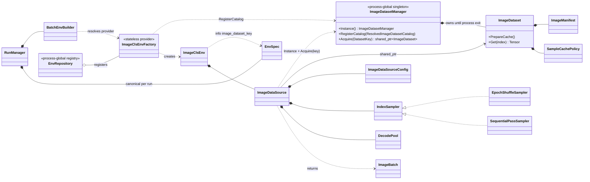
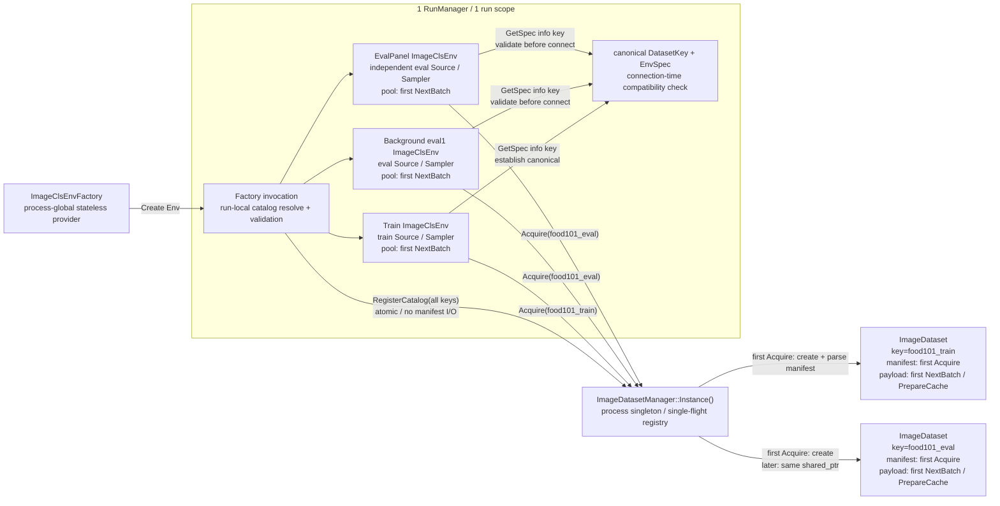

# ImageCls 専用 batch 入力コンポーネント / BatchEnv adapter

> 文書状態: 設計レビュー中。本書だけで外部設定、実行時契約、責務、所有権、未決事項、実装範囲を確認できることを目的とする。
> 記載区分: **確定**＝実装仕様、**基準案**＝現在の推奨設計、**未決**＝実装開始前の判断対象。
> 既存 runner / observer / GUI との接続は、当面 `BatchEnv` interface を使う adapter として維持する。

## 1. 目的・対象読者・変更概要

### 1.1 対象読者

- 設定を作成・レビューする実験利用者
- ImageCls の Dataset / sampling / eval 契約をレビューする設計者
- Phase 0～2を実装する開発者
- 性能、再現性、互換性を検証するテスト担当者

### 1.2 背景

現行 ImageCls は `SingleDiscreteEnv` をN個生成し、`VectorizedDiscreteBatchEnv`または`ThreadPoolDiscreteEnv`でまとめている。各single envがtrain/evalの`ImageDataSource`を2本持ち、画像を1枚ずつdecodeしてからframework側でcollateするため、分類問題として不要なfan-out、manifest重複、decodeオーバーヘッドがある。configured evalもB=1かつランダム復元抽出で、評価件数と評価対象が分かりにくい。

本PRDの目的は、ImageClsをbatch-nativeな`BatchEnv`へ置き換え、次を実現することである。

- Dataset定義を`DatasetKey`で参照し、同一process内でmanifestとpre-augment cacheを共有する。
- mutableなsampler、RNG、augment、collate、decode poolはenv-localな`ImageDataSource`へ分離する。
- `ImageClsEnv`をreward / done / metricsに集中した薄いRL adapterにする。
- train/evalのsample列、augment、batch組立を明示的かつ再現可能な契約にする。
- evalを固定Bのbatchで駆動し、1評価点の対象件数と終端を設定から読めるようにする。

### 1.3 維持する外部contract

- [`037_env_instance_name_10prd.md`](037_env_instance_name_10prd.md)を本PRDより先に実装し、その完了状態をPhase 0開始時のbaselineとする。
- PRD 037で追加する人間向けの必須`name`、pure interfaceの`SingleDiscreteEnv::GetName()`、`BatchEnv::GetName()`、`BatchEnv::GetEnvName(lane_index)`と、`SingleDiscreteEnvBase`／`BatchEnvBase`による共通実装を、Builder改名、configured Eval移行、batch-native化の前後で維持する。
- PRD 037で追加する同一Run内のBatchEnv name一意性、reserved name preflight、生成成功済みnameのrun-local registry、重複時の`ANET_SYSTEM_ERROR`を、全Phaseで`RunManager`責務として維持する。
- observationは`grid[3,H,W] uint8`と`vector[1] int64`。batch化後は`grid[B,3,H,W]`と`vector[B,1]`。
- network境界の`float32 / 255`は変更しない。
- trainの`max_steps` episode、`episode_start`、既存Conv2d表示のcadenceを維持する。
- ImageCls actor / learner / network / checkpoint形式は変更しない。
- background evalのnetwork snapshot順序は本PRDで解決せず、[`999_background_eval_snapshot_ordering_10prd.md`](999_background_eval_snapshot_ordering_10prd.md)で扱う。

### 1.4 変更の全体像

| 領域 | Before | After |
|---|---|---|
| Dataset設定 | `ImageClsEnv`直下にtrain/eval pathを混在 | `ImageDataset.[DatasetKey].*` catalog |
| Dataset実体 | single envごとにtrain/evalを生成 | process singleton `ImageDatasetManager`がkey単位で共有 |
| sampling | single envごとのランダム復元抽出 | env-local `IndexSampler`によるdataset cycle / eval window cursor |
| batch生成 | N envの結果をframeworkでcollate | `ImageDataSource::NextBatch`がfresh batchを生成 |
| cache | 無し | Dataset所有の`none / auto / full_ram` strategy |
| eval | B=1、`max_steps`件 | `eval_batch_size`とeval sampling設定によるpass |
| Env責務 | manifest、decode、augment、RL状態 | reward、done、metrics中心の薄いadapter |

## 2. 設定外部仕様

### 2.1 設定の解決単位

設定は次の3層へ分ける。

1. **Dataset catalog**: immutable data、resize、cache policyを`DatasetKey`ごとに定義する。
2. **env-local DataSource設定**: 使用する`DatasetKey`、augment、eval samplingを定義する。
3. **trainer / eval設定**: train/evalのB、起動頻度、background、actor cloneなどを定義する。

Datasetのpath、shape、cache policyをeval env prefixから直接上書きしない。eval envが変えられるのは参照する`dataset_key`とenv-localなSource設定だけである。同じデータを異なるcache policyで扱う場合は別`DatasetKey`を明示する。

### 2.2 ImageDataset設定

`ImageDataset.<field>`を全Dataset共通default、`ImageDataset.[<DatasetKey>].<field>`をkey固有overrideとして解決する。

| 状態 | 設定キー | 所有クラス | 適用範囲 | 既定値 | 必須条件 | validation | 実行時効果 | 旧設定からの変更 |
|---|---|---|---|---|---|---|---|---|
| 新規・移動 | `ImageDataset.root_dir` | `ImageDatasetConfig` | catalog共通default | なし | resolved値必須 | 空文字禁止。参照Dataset生成時にpathを診断可能な形へ正規化 | manifest相対pathのroot | `ImageClsEnv.root_dir`から移動 |
| 新規・移動 | `ImageDataset.list_txt_path` | `ImageDatasetConfig` | catalog共通defaultまたはkey固有 | なし | resolved値必須 | file open失敗はDatasetKeyとpath付きerror | 1 Datasetのsample list | train/eval別キーを1項目へ統合 |
| 新規・移動 | `ImageDataset.classes_txt_path` | `ImageDatasetConfig` | catalog共通default | なし | resolved値必須 | file open失敗、空class list、重複classをerror | class IDと`value_labels` | `ImageClsEnv.classes_txt_path`から移動 |
| 新規・移動 | `ImageDataset.suffix` | `ImageDatasetConfig` | catalog共通default | `.jpg` | 必須 | path組立後にdecode失敗をpath/index付きerror | list entryへ付けるsuffix | `ImageClsEnv.suffix`から移動 |
| 新規・移動 | `ImageDataset.image_width` | `ImageDatasetConfig` | Dataset shape | なし | 必須 | `>0`。非正値はerror | decode後のW、keyに紐づくimmutable contract | `ImageClsEnv.image_width`から移動。`-1`廃止 |
| 新規・移動 | `ImageDataset.image_height` | `ImageDatasetConfig` | Dataset shape | なし | 必須 | `>0`。非正値はerror | decode後のH、keyに紐づくimmutable contract | `ImageClsEnv.image_height`から移動。`-1`廃止 |
| 新規 | `ImageDataset.cache.mode` | `ImageDatasetConfig` | Dataset単位 | `auto` | 必須 | `auto / none / full_ram`以外error | pre-augment cache strategy | 旧PRDのEnv直下案からDatasetへ移動 |
| 新規・未決 | `ImageDataset.cache.max_bytes` | `ImageDatasetConfig` | Dataset単位 | 候補`4294967296` | `auto/full_ram`で必須 | positive `uint64_t`、size積のoverflowをerror | full payload上限 | 正確な既定値は[D9](#decision-d9)で決定 |
| 新規 | `ImageDataset.[<DatasetKey>].*` | factoryのcatalog resolver / `ImageDatasetManager` | run-localなkey固有override兼key宣言 / process registry | 共通defaultを継承 | keyごとに1項目以上を明示 | unknown/empty keyは現在runのavailable keys付きerror。登録済み同名keyとのconfig差はfield付きerror | run-localに解決し、process identityとして登録するresolved config | 旧path比較による暗黙identityを廃止 |

`DatasetKey`はcase-sensitiveなopaque identifierとする。同一process・同一key・同一resolved `ImageDatasetConfig`は常に同じ`ImageDataset`を表し、異なるkeyはresolved configが同一でも統合しない。同一processで既存keyへ異なるresolved configを要求した場合は、既存値と要求値の差分を含めてfail-fastする。`ImageDataset.[key].*`が1項目以上存在することをkeyの明示宣言とし、共通`ImageDataset.*`だけから任意の未宣言keyを作ることはできない。

### 2.3 ImageDataSource / ImageClsEnv設定

共有しないSourceの設定は`ImageClsEnv.data_source.*`へ埋め込む（[D1](#decision-d1)で決定済み）。named `ImageDataSource.[key]` catalogは、複数Env種別で同一Source profileを再利用する具体例が出た時点で再検討する。

| 状態 | 設定キー | 所有クラス | 適用範囲 | 既定値 | 必須条件 | validation | 実行時効果 | 旧設定からの変更 |
|---|---|---|---|---|---|---|---|---|
| 新規・確定 | `ImageClsEnv.data_source.dataset_key` | `ImageDataSourceConfig` | env instance | なし | 必須 | 空/unknown keyはerror | Managerから取得するDatasetを選択 | train/eval list path指定をkey参照へ変更 |
| 移動・確定 | `ImageClsEnv.data_source.augment.enabled` | `ImageDataSourceConfig` | train Sourceのみ | `false` | 任意 | bool parse失敗をerror | train augment有効化 | `ImageClsEnv.augment.enabled`から移動 |
| 移動・確定 | `ImageClsEnv.data_source.augment.hflip_p` | `ImageDataSourceConfig` | train Sourceのみ | `0.5` | 任意 | `[0,1]` | horizontal flip確率 | 同名旧項目をSource配下へ移動 |
| 移動・確定 | `ImageClsEnv.data_source.augment.rrc_scale_min/max` | `ImageDataSourceConfig` | train Sourceのみ | `0.7 / 1.0` | 任意 | `0 < min <= max <= 1` | RandomResizedCrop面積比 | 同名旧項目をSource配下へ移動 |
| 移動・確定 | `ImageClsEnv.data_source.augment.rrc_ratio_min/max` | `ImageDataSourceConfig` | train Sourceのみ | `0.75 / 1.3333333` | 任意 | `0 < min <= max` | crop aspect ratio | 同名旧項目をSource配下へ移動 |
| 新規・未決 | `ImageClsEnv.data_source.eval_sample_mode` | `ImageDataSourceConfig` | eval Sourceのみ | class default候補`full` | enabled configured evalはoverlayで明示 | 候補`full / rotating_subset` | eval windowのsample選択方式 | [D5](#decision-d5)でsentinel分離を判断 |
| 新規・未決 | `ImageClsEnv.data_source.eval_samples` | `ImageDataSourceConfig` | `rotating_subset`のみ | なし | subset時必須、full時指定禁止 | 推奨`1 <= N <= eval_size` | 1 eval windowのvalid sample数 | B単位切上げ案との比較は[D5](#decision-d5) |
| 既存・意味明確化 | `ImageClsEnv.max_steps` | `ImageClsEnvConfig` | trainのみ | `100` | 必須 | `>0` | train episode / 可視化 / log cadence | eval終端には使用しない |

### 2.4 trainer、eval、backendの関連設定

| 状態 | 設定キー | 所有クラス | 適用範囲 | 既定値 | 必須条件 | validation | 実行時効果 | 旧設定からの変更 |
|---|---|---|---|---|---|---|---|---|
| 既存・意味明確化 | `train.seed` | `RunManager` | run全体 | `0` | run間再現では固定非0必須 | parse失敗error。0は既存どおりauto seed | resolved master seedを介したsampler/augment seedの起点 | [D10](#decision-d10)でdomainと実seed logを決定 |
| 既存・意味変更 | `train.num_envs` | `BatchEnvBuilder` | main train | code既定`1`、ImageCls実値`128` | `>0` | 非正値error | native ImageClsのtrain batch size B | N single env数からnative Bへ変わる |
| 既存・意味拡張 | `env.worker_threads` | `WorkerThreadResolver` | native decode pool | `-1` | 必須 | 正数または定義済みauto値のみ | decode worker数 | single wrapperに加えSourceでも利用 |
| 既存・未決 | `env.worker_type` | `BatchEnvBuilder` / Source | native decode方式 | `0` (`AUTO`) | 必須 | `AUTO / SINGLE_THREAD / THREAD_POOL` | 同期decodeかpoolか | native ImageClsへの適用は[D8](#decision-d8) |
| 既存・未決 | `env.device_type/index` | `BatchEnvBuilder` | Env Tensor device | `0 (CPU) / -1` | 必須 | `device_type`は既存`0=CPU / 1=CUDA`。ImageClsは0のみ許可する案 | native Envのdevice | 非CPU時の扱いは[D8](#decision-d8) |
| 新規 | `train.eval.[tag].eval_batch_size` | `RunManager` | 当該eval env | core既定`1` | `>0` | 非正値error | eval batch size B | B=1 hard-codeを設定化 |
| 既存・validation追加 | `train.eval.[tag].interval` | `EpisodeEvalObserver` | eval trigger | `100`、ImageCls eval1実値`50` | `0`はdisable | `<0`はerror | learn step単位のtrigger | native ImageClsのdisabled Env生成は[D4](#decision-d4) |
| 既存 | `train.eval.[tag].run_mode` | `RunManager` | eval actor/env | `eval1` | 有効なRunMode | unknown値error | actorのnetwork種別等 | Env生成時にも利用（[D3](#decision-d3)決定済み） |
| 既存 | `train.eval.[tag].use_background` | `EpisodeEvalObserver` | eval実行方式 | `true` | 任意 | bool parse失敗error | foreground/background | 意味不変 |
| 既存・変更なし | `train.eval.[tag].clone_model` | agent / eval actor | network参照 | `true`、ImageCls eval1実値`false` | 任意 | bool parse失敗error | clone/live network | 034では変更しない |
| 既存・意味明確化 | `train.eval.[tag].env.data_source.dataset_key` | Env config overlay | enabled ImageCls eval | なし | `interval > 0`では明示必須 | empty/unknown keyはerror | eval Datasetを明示選択 | train keyの暗黙継承を禁止 |
| 既存 | `train.eval.[tag].env.*` | Env config overlay | eval env | なし | fieldごと | fieldごと | sampling等を上書き | Dataset定義そのものは上書き禁止 |
| 既存・変更なし | `train.eval_device_type/index` | eval actor | actor forward | common=`cuda/0` | 任意 | device validation | network forward device | env deviceとは別 |
| 既存・変更なし | `backend.deterministic_algorithms` | backend init | ATen演算 | 現行設定による | 任意 | 既存validation | deterministic algorithm選択 | 034では変更しない |
| 既存・変更なし | `backend.cudnn_deterministic` | backend init | cuDNN | 現行設定による | 任意 | 既存validation | cuDNN決定性 | 034では変更しない |
| 新規・確定 | `app.eval_panel.eval_config_tag` | `EvalPanelConfig` | native ImageClsのmanual EvalPanel Env | なし | ImageCls EvalPanel利用時必須 | tag存在、明示ImageCls dataset key/modeを検証。非ImageClsで明示時はfail-fast（[D7](#decision-d7)決定済み） | 使用する`train.eval.[tag]`を明示選択 | RunModeからtagを推測しない |
| 既存・関連 | `app.eval_panel.model_sync.mode` | `EvalPanel` | manual eval actor sync | `time` | 任意 | `shared / frame / time / episode` | model sync契機 | episodeは[D7](#decision-d7)で決定したeval window終端へ追従 |
| 既存・関連 | `app.eval_panel.model_sync.frame_interval` | `EvalPanel` | mode=`frame` | `30` | frame modeで`>0` | 非正値error | manual step数でsync | 意味不変 |
| 既存・関連 | `app.eval_panel.model_sync.time_interval_ms` | `EvalPanel` | mode=`time` | `10000` | time modeで`>0` | 非正値error | wall clockでsync | 意味不変 |
| 既存・関連 | `app.eval_panel.model_sync.episode_interval` | `EvalPanel` | mode=`episode` | `1` | episode modeで`>0` | 非正値error | eval window数でsync | [D7](#decision-d7)で決定したwindow終端に追従 |

`env.worker_threads`の既存値域は、正数=明示worker数、`-1`=`min(B, logical_cores-2)`、`-2`=B、`-3`=`logical_cores-2`、`-4`=`logical_cores`である。明示正数はBへclampせず指定を尊重する。`0`および未定義負数はfail-fastへ統一する。

### 2.5 旧設定からの移行

| 旧キー | 新キー | 移行規則 |
|---|---|---|
| `ImageClsEnv.root_dir` | `ImageDataset.root_dir`または`ImageDataset.[key].root_dir` | Dataset catalogへ移動 |
| `ImageClsEnv.train_list_txt_path` | `ImageDataset.[train-key].list_txt_path` | train用DatasetKeyを作る |
| `ImageClsEnv.eval_list_txt_path` | `ImageDataset.[eval-key].list_txt_path` | eval用DatasetKeyを作る |
| `ImageClsEnv.classes_txt_path` | `ImageDataset.classes_txt_path`またはkey固有値 | Dataset catalogへ移動 |
| `ImageClsEnv.suffix` | `ImageDataset.suffix`またはkey固有値 | Dataset定義へ移動 |
| `ImageClsEnv.image_width/height` | `ImageDataset.image_width/height`またはkey固有値 | Dataset shapeへ移動 |
| `ImageClsEnv.augment.*` | `ImageClsEnv.data_source.augment.*` | Source ownershipへ合わせる（[D1](#decision-d1)決定済み） |
| 旧PRDの`ImageClsEnv.cache.*` | `ImageDataset.cache.*` | 共有資源の設定へ移動 |
| 旧PRDの`eval_samples=all/N` | `eval_sample_mode`＋`eval_samples` | [D5](#decision-d5)で最終決定 |
| train用DatasetKey作成後 | `ImageClsEnv.data_source.dataset_key = <train-key>` | main train Sourceから明示参照する |
| eval用DatasetKey作成後 | `train.eval.[tag].env.data_source.dataset_key = <eval-key>` | enabled eval tagごとに明示参照する |

旧キーと新キーの同時指定、または旧キーだけを使うsilent compatibility fallbackは設けない。Phase 2で`ImageCls.txt`を一括移行し、unknown/obsolete keyを診断可能にする。

### 2.6 設定解決順序

1. `ConfigManager`がinclude、`.$` AutoMerge、CLI overrideを既存どおり展開する。
2. ImageCls factoryがrun-local catalogとして`ImageDataset.[key].*` tagを列挙し、key宣言、既知field、型、enum、required resolved値をI/O無しで検証する。各keyのresolved configはC++ default → `ImageDataset.*` → `ImageDataset.[key].*`の独立chainで作る。
3. factoryは全key/configを`ImageDatasetManager::RegisterCatalog(resolved_catalog)`へI/O無しで一括登録する。Managerは全entryをpreflightし、同一keyの登録済みconfigと異なる場合はDatasetが未使用でもfail-fastする。conflict時は新規keyを1件も追加せず、全件同値またはconflict無しの場合だけatomic commitする。同一configの再登録はno-opとする。
4. Env生成時にSource configをC++ default → `ImageClsEnv.*` → configured evalの`train.eval.[tag].env.*`という別chainで解決する。
5. enabled ImageCls evalでは、overlay内の`data_source.dataset_key`とeval sample modeを明示指定させ、train base値の暗黙継承を禁止する。
6. Source constructorがresolved `dataset_key`をManagerの`Acquire(key)`へ渡す。Managerは登録済みconfigからDatasetを生成し、この時点でpath openとmanifest I/Oを行う。
7. Env prefixからDataset fieldを直接上書きしない。decode I/Oはそのindexの最初の`Get`まで遅延する。

手順6～7のmanifest / decode I/OのLazy境界は[D4](#decision-d4)で確定する。

上記Source config chainとキー名は[D1](#decision-d1)で確定した（option 1採用）。

`ConfigData::Read`は現行、型変換失敗時にWARN後defaultへ戻り得るため、本機能の明示設定では「キーが存在するのに型変換へ失敗した」場合を`ANET_SYSTEM_ERROR`にするvalidated readが必要である。

unknown / obsolete key監査は次のscopeへ分ける。

- ImageCls factoryのrun-local catalog resolverは`ImageDataset.*`と`ImageDataset.[key].*`の既知fieldを監査し、unknown DatasetKeyの診断にはprocess登録履歴ではなく現在runのavailable keysを使う。
- Env configは実際に解決するbase `ImageClsEnv.*`と選択eval prefixについて旧Dataset fieldの指定を検出し、旧新混在をerrorにする。
- AutoMerge後も残る未選択profile/templateはruntimeのactive config監査対象にせず、Phase 2のrepository全文検索で旧fieldを`ImageCls.txt`から除去する。

### 2.7 Food101完全設定例

以下は[D1](#decision-d1)で確定したSource設定と[D7](#decision-d7)で確定したEvalPanel routingに、[D5](#decision-d5)のeval件数案、[D8](#decision-d8)のworker/device案を組み合わせた基準例である。`cache.max_bytes`は[D9](#decision-d9)、実eval mode / N / Bは[D6](#decision-d6)で最終決定する。

```ini
# Dataset catalog defaults
ImageDataset.root_dir = C:\dev\food-101\images
ImageDataset.classes_txt_path = C:\dev\food-101\meta\classes.txt
ImageDataset.suffix = .jpg
ImageDataset.image_width = 224
ImageDataset.image_height = 224
ImageDataset.cache.mode = auto
ImageDataset.cache.max_bytes = 4294967296

# DatasetKey definitions: 定義だけではmanifest/cacheを生成しない
ImageDataset.[food101_train].list_txt_path = C:\dev\food-101\meta\train.txt
ImageDataset.[food101_eval].list_txt_path = C:\dev\food-101\meta\test.txt

# Main train env / env-local Source
ImageClsEnv.data_source.dataset_key = food101_train
ImageClsEnv.data_source.augment.enabled = true
ImageClsEnv.data_source.augment.hflip_p = 0.5
ImageClsEnv.data_source.augment.rrc_scale_min = 0.5
ImageClsEnv.data_source.augment.rrc_scale_max = 1.0
ImageClsEnv.data_source.augment.rrc_ratio_min = 0.75
ImageClsEnv.data_source.augment.rrc_ratio_max = 1.3333333
ImageClsEnv.max_steps = 100

train.seed = 1
train.num_envs = 128
env.worker_type = 0
env.worker_threads = -1
env.device_type = 0
env.device_index = -1
train.eval_device_type = cuda
train.eval_device_index = 0

# Configured eval1: full案
train.eval.[eval1].interval = 50
train.eval.[eval1].run_mode = eval1
train.eval.[eval1].use_background = true
train.eval.[eval1].clone_model = false
train.eval.[eval1].eval_batch_size = 128
train.eval.[eval1].env.data_source.dataset_key = food101_eval
train.eval.[eval1].env.data_source.eval_sample_mode = full

# rotating subset案を採る場合は上のmodeを置換する
# train.eval.[eval1].env.data_source.eval_sample_mode = rotating_subset
# train.eval.[eval1].env.data_source.eval_samples = 1000

# EvalPanel（D7決定済み。選択tagのrun_mode/env overlayを使用し、Bは1固定）
app.eval_panel.eval_config_tag = eval1
app.eval_panel.model_sync.mode = time
app.eval_panel.model_sync.time_interval_ms = 10000
```

### 2.8 metrics設定

```ini
metrics.scalar.[42_env/04_accuracy_mean]     = $env accuracy @train $exp_step
metrics.scalar.[42_env/05_accuracy_mean_ema] = $env accuracy @train $exp_step $ema ema_alpha:0.001
metrics.scalar.[42_env/07_epoch_count]       = $env epoch_count @train $exp_step interval:100
metrics.scalar.[51_eval1/03_accuracy]        = $eval.[eval1] $env accuracy @episode_end
metrics.scalar.[51_eval1/04_accuracy_ema]    = $eval.[eval1] $env accuracy @episode_end $ema ema_alpha:0.01
```

- trainの`accuracy`は直近に確定したepochの正解率。初回epoch完了前はNaN。
- evalの`accuracy`は直近eval windowの正解率。fullなら全件、subsetならそのwindowのvalid sampleを対象とする。
- `epoch_count`はtrainでは採点完了したdataset cycle数。[D5](#decision-d5)の基準案ではfull eval window完了、またはsubset dataset cycle完了で増加する。
- `21_eval/01,02`の`$runner eps_total_reward`は削除する。代表lane方式では部分値となるためである。
- `20_eps/10,11`の`$runner train_episode_reward`は維持する。
- コメントアウト中の`42_env/02,03`（`mean.reward_sum`）はstreamキー廃止に合わせて削除する。

## 3. 外部動作仕様

### 3.1 Dataset catalogと共有

Dataset / manifest / payload / decode poolの生成時点は[D4](#decision-d4)の判断対象であり、以下は現在の推奨境界である。

- catalogへDatasetを定義しただけではmanifest I/Oもcache allocationも行わない。
- factoryは全宣言keyとresolved `ImageDatasetConfig`をI/O無しの`RegisterCatalog`でsingleton Managerへatomic登録する。1件でも既存keyとのconfig conflictがあれば新規keyを残さない。Sourceが`Acquire(DatasetKey)`した時点で、同一process内の同一key/configに対する単一の`ImageDataset`を取得する。
- 同一keyへ異なるresolved configを要求した場合は、先行instanceを再利用せずfail-fastする。
- train、background eval、EvalPanelが異なるkeyを使えば別Dataset。同じeval keyを使えば同じmanifest/cacheを共有する。
- 同じkeyの同時初回要求はsingle-flightとし、partial objectを公開しない。
- 生成済みDataset/cacheはeviction/resetせずprocess終了まで保持する。既存keyに対応するconfigまたはDataset実ファイルをin-place変更した場合はprocessを再起動する。同一process中に更新版を併用する場合は、新directoryと新DatasetKeyで別Datasetとして登録する。
- ManagerとDatasetはthread-safe、Sourceはenv-local single-caller contractとする。

native ImageClsの`ImageClsEnv::GetSpec()`は、既存のgeneric metadata seamである`EnvSpec.info`へ`image_dataset_key=<DatasetKey>`を格納する。`RunManager`はmain train Envの`EnvSpec`とこのkeyをrun-localなcanonical `(DatasetKey, EnvSpec)`として保持し、configured eval / EvalPanelをAgent・runnerへ接続する前に次を一致させる。この検証stateはsingleton Managerへ持たせず、production codeでImageCls型への`dynamic_cast`を行わない。

- `class_names`の件数、文字列、順序
- gridのchannel数、H/W、dtype
- vectorのshape/dtype/class数
- action countと`value_labels`

native ImageClsなのに`EnvSpec.info["image_dataset_key"]`が無いか空の場合、およびeval/EvalPanel EnvSpecに不一致がある場合は、canonical key、requested key、最初に異なるfield/値を含めて接続前にfail-fastする。異なるDatasetKeyを使うこと自体は許可するが、同一Agent/networkへ接続できるspecでなければならない。非ImageCls Envはこのinfo keyを要求せず、従来のgeneric EnvSpec処理を維持する。

### 3.2 batch outputとstorage lifetime

- Sourceは固定Bの`grid[B,3,H,W] uint8`と`targets[B] int64`を生成する。
- Envはtargetsをcurrent batchの採点用に保持し、observation vectorへ`[B,1]`として公開する。
- `NextBatch`呼出しごとにgrid / targetsのfresh storageを生成し、返却後はimmutableとする。
- 後続Stepが過去のstate storageを上書きしない。
- `next_state`と`continue_state`は同じfresh observationを共有し、done / truncated / episode_startのflagだけを分けてよい。
- batch内の重複indexはdecode/cache lookupの重複作業を減らすためdedupeする。共有cacheの排他責任はDatasetにある。

### 3.3 train

- `EpochShuffleSampler`が全indexをpermutationし、StepごとにB件をconsumeする。
- epoch末尾の端数は次epoch先頭でwrap-fillする。sampleを捨てず、`data_size < B`でもBを維持する。
- [D10](#decision-d10)で確定したSource root seedからsampler streamとaugment streamを分離し、augment seedは`(augment_seed, epoch_tag, dataset_index)`からslot単位で導出する。
- episodeとepochは独立する。`max_steps`は可視化・ログ・EpisodeEndEventのcadenceであり、sampler cursorをresetしない。
- `accuracy`は最後に採点完了したepochのsnapshot。初回完了前はNaN。
- `epoch_count`はsampleを先読みした時点ではなく、そのepoch最後のsampleを採点した時点で増加させる。

### 3.4 eval

以下の`full / rotating_subset`、exact N、padding、window終端は[D5](#decision-d5)推奨案を採った場合の基準仕様であり、[D5](#decision-d5)決定前の確定contractではない。

- evalは`max_steps`を使わず、eval windowのtarget件数を採点したStepで終端する。
- window終了Stepでは代表lane 0だけ`done=true`にし、`EpisodeEndEvent`を1個だけ発火する。
- `RunEvaluationEpisode`は既存どおり`LastStepHadEpisodeEnd()`で停止できる。
- `accuracy`は1 eval windowのcorrect / valid totalをsnapshotする。
- fullの末尾または正確なsubset N案の末尾はvalid-prefix paddingとし、pad laneをaccuracyと`n_transitions`から除外する。
- window終了Stepの`continue_state`は次eval windowの先頭batchを保持できる。cursor会計はcurrent batchのmetadataで行う。
- evalの`epoch_count`初期値は0。fullは全件windowを採点完了するごとに1増加し、rotating subsetはdataset streamの全indexを採点完了した時点で1増加する。
- subset windowがdataset cycle境界を跨ぐ場合、current batchの採点によるcycle完了を反映してからwindow終了時のscalarを公開する。次window用`continue_state`の先読みでは増加させない。

### 3.5 reward、done、episode_start

- valid laneの`reward[i] = (action[i] == target[i]) ? 1.0f : 0.0f`。
- eval padding laneのrewardは[D5](#decision-d5)推奨案では0とする。
- train episode境界ではterminal `next_state.episode_start=false`、auto-reset後`continue_state.episode_start=true`を維持する。
- trainの全B laneが同じ`max_steps`境界でdoneになる。evalは代表laneのみdone。
- eval window境界のterminal `next_state.done`はlane 0だけtrue、`truncated`と`episode_start`は全lane falseとする基準案。
- evalの`continue_state.done/truncated`は全lane false、`continue_state.episode_start`はlane 0だけtrueとする。他laneはepisode entityではなくbatch slotとして継続する。
- eval window終了Stepの`n_episode_end`は1。`n_transitions`はそのStepの`valid_count`とする。

### 3.6 cacheとdecode

- `NoCachePolicy`は毎回decodeし、同一indexについて値の同一性を保証するがstorage identityは保証しない。
- `FullRamCachePolicy`はDataset単位に`[N,3,H,W] uint8` payloadを持ち、pre-augment Tensorだけを保存する。
- `ImageDataSource::NextBatch`はdecode/cache taskをenqueueする前に、caller thread上で`ImageDataset::PrepareCache()`を同期呼出しする。呼出し時点は[D4](#decision-d4)、allocation失敗時の`auto` fallback有無は[D9](#decision-d9)で決める。`none`ではno-op、`auto/full_ram`ではDataset-level single-flightによりpayload allocationを1回だけ確定する。
- 同一indexの初回同時fillはper-index one-time publishで1件だけ公開し、他callerは完了を待つ。
- publish後のentryはimmutable。
- cache entryは`Empty / Loading / Ready / Failed`相当のterminal stateを持つ。decode失敗時は全waiterを起こし、そのprocess lifetimeは同じindexへの後続要求へ同じ失敗を再送出して自動retryしない。
- wxImage handlerはrun/Datasetごとではなくprocess-wide `once`で、parallel decode開始前に初期化する。
- Sourceが投入する各decode taskはworker境界で例外を捕捉し、最初の`exception_ptr`とDatasetKey/index/path contextを保存し、成功失敗にかかわらずcompletion bookkeepingを完了する。
- `WaitAll`後にSource callerの`NextBatch`が保存例外を再送出する。一般`PinnedThreadPool`の例外機構は変更しないが、新worker内例外が握り潰されたり待機hangになったりせずAP停止へ到達することを034の契約とする。

### 3.7 再現性

- [D10](#decision-d10)で確定したdomainを前提に、同一Dataset内容、同一resolved master seed、同一resolved configでsample列、epoch tag、augment、batch組立がrun間一致する。literal `train.seed=0`はauto seedのためrun間一致の前提にしない。
- sampler RNGとaugment RNGは別streamとし、augment ON/OFFでsample順を変えない。
- train、configured eval tag、EvalPanel間のroot seed domainと、EvalPanelをconfigured evalから独立させるかは[D10](#decision-d10)で確定する。どの案でもconstruction orderやworker順をseedへ含めない。
- decode taskのworker割当や完了順は結果へ影響させない。
- 旧N個single envのRNG列とのbit一致は保証しない。
- network演算の決定性はADR 0006、eval snapshotの時間的順序は999 PRDの責務である。

### 3.8 profiling

- `ImageClsEnv::Step`: `reward` / `next_batch` / `build_result`。
- `ImageDataSource::NextBatch`: `sample` / `decode_cache` / `augment` / `collate`。
- `ImageDataset::Get`: `cache_lookup` / `cache_fill` / `decode`。
- Dataset初回Ready / cache prepare時にDatasetKey、requested/effective cache mode、registered/ready Dataset数、process retained payload bytesをlogする。
- 通常フェーズは`ANET_PROFILE_SCOPE` / `ANET_PROFILE_SCOPE_NEXT`を使う。
- async decode workerだけは`ANET_PROFILE_SCOPE_FULL`で`ImageDataSource::NextBatch.decode`に準じるstableな完全名を使う。
- 軽量getterやper-element内側loopへscopeを置かない。

## 4. クラス別責務・所有権

### 4.1 一覧

| 要素 | 種別 | lifetime / scope | 所有するもの | 所有しないもの・禁止事項 |
|---|---|---|---|---|
| `DatasetKey` | Value Object | run-local catalogで宣言・解決 / 登録後はprocess identity | case-sensitive identity | path比較による暗黙coalesce、別runでの同名key/異config再利用 |
| `ImageDatasetConfig` | immutable config | `RegisterCatalog`後はprocess lifetime | resolved path、shape、cache policy | sampler、augment、env override |
| `ImageDatasetManager` | process singleton Manager | process lifetime | key/config registry、single-flight、生成済みDataset | sampler、RNG、augment、episode、run-local EnvSpec |
| `ImageDataset` | shared Entity | process内で共有 / process lifetime | manifest、decode、cache | cursor、epoch、augment RNG |
| `ImageManifest` | immutable Value | Dataset lifetime | paths、targets、class_names | decode、RNG |
| `SampleCachePolicy` | Strategy | Dataset lifetime | cache storage / lookup / publish | sampler、augment |
| `ImageDataSourceConfig` | immutable config | Env / Source | dataset key、augment、eval sampling | Dataset path/cache field |
| `ImageDataSource` | env-local Controller | 1 Env | sampler、RNG、augment、collate、decode pool | shared cache、RL metrics |
| `ImageBatch` | immutable result value | Reset/Step間 | grid、targets、epoch tags、valid metadata | mutable cursor |
| `IndexSampler` | env-local Controller | 1 Source | cursor、cycle、RNG | decode、cache、reward |
| `ImageClsEnv` | RL adapter | 1 runner Env | current batch、reward/done、metrics snapshot | manifest、cache、sampling algorithm |
| factory / RunManager | construction / run state | factoryはstateless、RunManagerは1 run | Env生成、run-local EnvSpec互換検証 | Dataset registry、cache ownership |

### 4.2 DatasetKey

- 外部設定のrun-local catalogで明示・解決するnon-empty string。`RegisterCatalog`後はprocess registryのidentityになる。
- case-sensitiveで、同一process内の同じkeyだけが同一identityとなる。別runでも同名keyへ異なるconfigを割り当てられない。
- 異なるkeyは同じpath、shape、cache設定でも別Dataset/cacheとして扱う。
- Dataset定義をprocess中にreloadしない。

### 4.3 ImageDatasetConfig

- C++ default、`ImageDataset.*`、`ImageDataset.[key].*`を順に解決したimmutable config。
- root、list、classes、suffix、W/H、cache mode/max bytesを持つ。
- config同値判定には全fieldを使い、augment、sampler、worker、seed等のSource-local設定を含めない。
- pathはabsolute化、separator統一、lexical normalizationを行い、Windowsではcase-insensitiveに比較する。I/O無しの`RegisterCatalog`を維持するためsymlink/junctionの実体解決は行わず、別aliasは異configとしてfail-fastしてよい。
- config parseとrequired field validationをDataset生成前に完了する。
- Env-specific prefixを受け取らない。

### 4.4 ImageDatasetManager

- Meyers singletonの`ImageDatasetManager::Instance()`としてprocess-globalに1個だけ生成する。
- `Instance()`はImageCls factory / Source経路だけから初回利用され、他Envでは生成・登録されない。ImageClsを使わないprocessの実質的なresource消費はない。
- APIは`RegisterCatalog(const ResolvedImageDatasetCatalog&)`と`Acquire(DatasetKey) -> shared_ptr<ImageDataset>`とする。
- `RegisterCatalog`はglobal mutex下で全entryをpreflightし、typed resolved configをfield-by-field比較する。path正規化後の同値ならno-op、最初の相違fieldがあればkey、登録値、要求値を含めてfail-fastする。hashだけで同値判定しない。
- preflight成功後だけ全新規entryをatomic commitする。manifest I/Oやcache確保は行わず、entryを`Registered`状態にするだけとする。
- entryはresolved configと`Registered / Loading / Ready / Failed`相当のstate、Datasetまたは`exception_ptr`を持つ。
- mutex下でkeyをlookupし、同一keyの初回生成をsingle-flightにする。manifest I/Oはglobal registry mutex外で行い、異なるkeyは並行生成できる。
- 成功時はprocess終了までstrong referenceを保持し、途中eviction/reset/reloadを行わない。
- 初期化失敗時はpartial instanceを公開しない。そのprocess/key/configのterminal failureとして保持し、同時waiterと後続`Acquire`へ同じ失敗を再送出する。自動retryはしない。
- catalogに存在するが未要求のkeyはDataset化せず、manifestをparseしない。このLazy境界は[D4](#decision-d4)で確定する。
- run-local catalog resolverが全keyのschema/typeを検証してManagerへ登録するが、未要求keyのDataset生成、file open、manifest parseは行わない。
- 未登録keyへの`Acquire`はprogramming/config errorとしてfail-fastする。available keysの利用者向け診断はrun-local catalog側で行う。

### 4.5 ImageDataset

- [D4](#decision-d4)の生成時点と[D9](#decision-d9)のcache contractに従い、immutable manifestとcache policyをconstructorで確定する。
- `PrepareCache()`はSource callerからworker task enqueue前に呼ばれ、Dataset-level payload allocationとpolicy確定をsingle-flightで行うthread-safe APIとする。呼出し時点は[D4](#decision-d4)、allocation失敗時の動作は[D9](#decision-d9)に従う。
- `Get(index)`は複数Sourceから同時に呼べるthread-safe APIとする。
- 同一key/indexに対して同じpre-augment値を返す。
- cache hit時に返すTensorはread-only。Sourceはfresh batchへcopyしてからaugmentする。
- manifestと画像fileの内容がprocess中に変更されないことを値の一貫性と再現性の前提とする。
- disk変更の自動検出や全画像hash検証は行わない。`none`の再decodeと`full_ram`の未fill entryへ新bytesが混ざるため、in-place更新は禁止する。

### 4.6 ImageManifest

- `classes.txt`と単一の`list.txt`をparseする。
- `paths`、per-image `targets`、per-class `class_names`を保持する。
- malformed line、class separator欠落、unknown class、空sample list、空/重複classをfail-fastする。
- errorにはDatasetKey、list行番号、class名、pathを可能な範囲で含める。
- `class_names`はEnvSpecの`value_labels`供給元になる。

### 4.7 SampleCachePolicy

- `NoCachePolicy`と`FullRamCachePolicy`を実装する。
- `auto`はDataset生成時にpayload推定値から候補strategyを決め、最初のDataset-level prepareで上記いずれかへ一度だけ確定するmodeであり、独立policy classである必要はない。allocation失敗を`none`へfallbackするかerrorにするかは[D9](#decision-d9)の選択に従う。
- Dataset-level prepareは`Unprepared / Preparing / Ready / Failed`相当のsingle-flight stateを持つ。異なるindexへの同時初回`Get`もallocation/fallback完了を待ち、Failedはprocess lifetimeでterminalとする。
- cache keyはDataset内index。augment済み画像を保存しない。
- bounded LRUは非復元epoch samplingでhit率が低く、再現可能な復元も複雑なため不採用。
- `MmapCachePolicy` / `PreprocessedFileCachePolicy`はfuture seamのみ。

### 4.8 ImageDataSourceConfig

- `ImageClsEnv.data_source.*`から構築する（[D1](#decision-d1)で決定済み）。
- DatasetKey、augment config、eval sampling configを持つ。
- batch size、生成時RunMode（[D3](#decision-d3)決定済み）、[D10](#decision-d10)で決めるSource root seed、[D8](#decision-d8)で扱いを決めるworker configはconstruction contextから受け取る。
- Dataset path、shape、cache policyは持たない。

### 4.9 ImageDataSource

- 1 Envに1 instanceを所有し、同一Sourceへの並行`NextBatch`はサポートしない。
- run-local catalogで検証済みのDatasetKeyを`ImageDatasetManager::Instance().Acquire(key)`へ渡してDatasetを取得し、`shared_ptr`を保持する。
- batch sizeとroleはconstruction時に固定し、APIは`NextBatch()`とする（[D3](#decision-d3)決定済み。旧案`NextBatch(B, mode)`は廃止）。
- Source自身が専有するSamplerからindex/epoch metadataを取得する。
- Source root seedからsampler / augmentの独立streamを作り、mutable RNG stateを他Sourceと共有しない。
- [D4](#decision-d4) / [D9](#decision-d9)の契約に従い、最初のdecode/cache taskをenqueueする前にcaller threadからDatasetの`PrepareCache()`を同期呼出しし、完了後にだけworkerへ`Get(index)`を投入する。
- batch内dedupe後にunique indexをdecode/cache lookupし、slotごとにaugmentしてfresh Tensorへcollateする。
- [D4](#decision-d4) / [D8](#decision-d8)の選択に従ってpoolをlazy生成し、`Shutdown`とdestructorのStop/joinをidempotentにする。同期decodeを選ぶ場合はpoolを生成しない。
- construction時の`Acquire`後はManagerを保持せず、取得したDatasetの`shared_ptr`だけを保持する。
- decode taskをSource-local wrapperで囲み、例外保存とcompletion通知を保証する。`NextBatch`はworker失敗をcaller threadへ再送出する。

### 4.10 ImageBatch

[D5](#decision-d5)のexact-N / padding案では、`NextBatch`の戻り値にgrid/targetsだけではepoch accuracy、padding、eval終端を実装できないため、次のmetadataを持つ内部valueを基準案とする。

| field | shape / type | 用途 |
|---|---|---|
| `grid` | `[B,3,H,W] uint8` | observation |
| `targets` | `[B] int64` | reward、vector observation |
| `epoch_tags` | B件 | slotが属するdataset cycle |
| `valid_count` | `0 < n <= B` | valid-prefix、`n_transitions` |
| `window_end` | bool | Bで割り切れる場合を含むeval window終端 |

`dataset_indices[B]`はdedupeとaugment seedに必要だが、Envへ公開せずSource内部metadataに留めてもよい。EnvはResetで取得したcurrent batchのtargets/metadataをStepまで保持し、current actionを採点してからnext batchを取得する。

### 4.11 IndexSampler各実装

- `IndexSampler`はindex、epoch tag、valid metadataを返すinterface。
- `EpochShuffleSampler`はtrainとrotating subsetで使用し、permutation、cursor、cycle、RNGを持つ。
- `SequentialPassSampler`はfull evalでindex 0から順に返し、末尾をvalid-prefix paddingする。
- data sizeよりBが大きい場合、1 batch内に複数cycleが入り得るため、単一`wrapped` boolではなくslot単位epoch tagを使う。
- sampler stateを異なるEnv/Source間で共有しない。

### 4.12 ImageClsEnv

- `BatchEnvBase`を直接継承して`BatchEnv` interfaceを実装し、`DiscreteBatchEnvBase`のN env fan-outを使わない。
- Sourceからbatchを受け、BatchStateへ変換する。
- `GetSpec()`の`info["image_dataset_key"]`へSourceが参照するDatasetKeyを格納し、generic interfaceだけでrun-local互換検証できるようにする。
- current targets/metadata、train episode counter、accuracy accumulator/snapshot、epoch_countを持つ。
- `GetScalar`はglobal `accuracy`と`epoch_count`だけを返す。不明キーとprefix付きglobalキーは`ANET_SYSTEM_ERROR`。
- `GetTensor` / `GetTensorVector`は`nullopt`。
- Source/Dataset/cacheの詳細をmetrics APIへ漏らさない。

### 4.13 factory / RunManager

- `ImageClsEnvFactory`は登録用のstateless providerとして扱い、Dataset registryを兼務しない。
- factoryはresolved Env/Source config、B、[D10](#decision-d10)で確定するSource seed、生成時RunMode（[D3](#decision-d3)決定済み）を使ってEnvを生成する。
- factoryはrun-local catalogを`ImageDatasetManager::Instance().RegisterCatalog(...)`し、`ImageDataSource`はkeyだけで`Acquire(...)`する。Manager注入用session/contextは設けない。
- main train Envの`EnvSpec.info["image_dataset_key"]`とEnvSpec本体をcanonicalとして`RunManager`に保持し、後続eval/EvalPanelを接続する前にrun単位で互換性を検証する。非ImageClsへこのinfo keyを要求しない。
- run shutdownでは全train/eval/EvalPanel Sourceのpoolをstop/joinしてEnvを解放する。ManagerとDataset/cacheは解放せずprocess終了まで保持する。

## 5. クラス図

> Manager singletonは[D2](#decision-d2)、Env生成時のRunMode伝達は[D3](#decision-d3)で決定済みである。



factoryはrun-localにresolveした全Dataset configをsingleton Managerへ`RegisterCatalog`でatomic登録する。Sourceはconstructor中に`Acquire(key)`を1回だけ行い、その後はDatasetの`shared_ptr`だけを保持する。run-localなのはcatalog解決、canonical `(DatasetKey, EnvSpec)`互換検証、Source、Sampler、RNG、episode stateであり、Dataset registry/cacheではない。

## 6. コミュニケーション図

> Manager singleton（[D2](#decision-d2)）、Env生成時RunMode（[D3](#decision-d3)）、EvalPanelのconfig tag選択（[D7](#decision-d7)）は決定済みである。



- 基準案ではtrainとevalは異なるDatasetKeyなので別Dataset/cacheを持つ。
- [D7](#decision-d7)の決定により、background evalとEvalPanelは明示的に同じconfig tagのeval keyを選べ、その場合Dataset/cacheを共有する。
- 3つのSource、Sampler、cursor、RNGはそれぞれ別instanceであり、decode poolの生成有無と時点は[D4](#decision-d4) / [D8](#decision-d8)に従う。
- [D4](#decision-d4)の基準案では、catalogに定義されてもAcquireされないDatasetKeyを生成しない。
- Managerと生成済みDataset/cacheはrun scopeの外にあり、process終了まで保持する。同一keyへ異なるresolved configを要求するとfail-fastする。

## 7. 詳細設計・現行コード制約

### 7.1 現行コードで確認済みの事実とPhase 0 baseline

> 行番号は本PRDレビュー時のworking tree基準。以下のコード参照はPRD 037実装前の事実なので、旧名`DefaultBatchEnvFactory`等をそのまま記す。一方、本PRDの実装はPRD 037完了後をbaselineとし、そこで追加済みのname契約を既存仕様として扱う。

#### seam / factory / config

- `EnvRepository`は`unordered_map<string, shared_ptr<SingleDiscreteEnvFactory>>`を持つprocess-global registryである（[`env.hpp:92`](../../core/anet-core/include/anet/env.hpp:92)、[`env.cpp:640`](../../core/anet-core/src/env.cpp:640)）。
- PRD 037実装前の`DefaultBatchEnvFactory`はclass_idでsingle factoryを取得し、N個のsingle envをVectorizedまたはThreadPool wrapperへ入れる（[`env.cpp:599`](../../core/anet-core/src/env.cpp:599)）。specialized batch分岐とconfig prefixはない。PRD 034 Phase 0のbaselineでは旧top-level `BatchEnvFactory::CreateBatchEnv(name, seed, num_envs)`としてnameを受け取る。
- 現行`BatchEnvFactory` interfaceの実装は`DefaultBatchEnvFactory`だけで、trainerはconcrete `unique_ptr<DefaultBatchEnvFactory>`を保持している（[`rl.hpp:644`](../../core/anet-core/include/anet/rl.hpp:644)、[`trainer.hpp:230`](../../core/anet-core/include/anet/trainer.hpp:230)）。
- configured evalは`single_env_factory`を取り出し、B=1の`VectorizedDiscreteBatchEnv`を直接生成する。env override prefixは`train.eval.[tag].env`（[`trainer.cpp:793`](../../core/anet-core/src/trainer.cpp:793)、[`trainer.cpp:817-818`](../../core/anet-core/src/trainer.cpp:817)）。PRD 037でこのdirect経路へ`name=tag`を追加済みであることをPhase 0 baselineとする。
- `RunManager::CreateEvalRunner`が作るEvalPanel用EnvはB=1、config prefix無し（[`trainer.cpp:867-874`](../../core/anet-core/src/trainer.cpp:867)）。PRD 037完了後は生成呼び出しに`name=EvalPanel`を渡す。
- `RunnerFrame`はEvalPanel runnerのRunModeを`Eval1`へ固定し、clone有無を`model_sync`設定から渡す（[`RunnerFrame.cpp:259-260`](../../apps/runner/src/RunnerFrame.cpp:259)）。[D7](#decision-d7)の決定によりconfig tagを導入し、この`Eval1`固定は撤去してselected tagの`run_mode`と二重管理しない。
- env登録の実経路は`Init*()`だが、GridMaze / LunarLander / CartPole / DropMergeは`ANET_REGISTER_ENV_FACTORY`によるstatic登録も持ち、同一class_idへ二重登録される。現行registryは上書きするため顕在化していない。
- `ResolveWorkerThreads`のinstance状態依存は`config_.worker_threads`のみで、`GetLogicalCores`は無状態（[`env.cpp:558-591`](../../core/anet-core/src/env.cpp:558)）。
- `Config`はdefault prefixを読んだ後にoverride prefixで上書きできる（[`config.hpp:151-183`](../../core/anet-core/include/anet/config.hpp:151)）。
- `ConfigManager::AutoMerge`は`.$`を展開してから利用側へ`ConfigData`を渡す（[`config.cpp:617-682`](../../core/anet-core/src/config.cpp:617)）。
- `ConfigData::MakeSubConfigData`はtag配下だけを切り出し、`ImageDataset.*`の共通defaultを自動mergeしない（[`config.cpp:319-349`](../../core/anet-core/src/config.cpp:319)）。Dataset config解決にはfull `ConfigData`とdefault/override prefixを使う必要がある。
- generic `EnvSpec`は`map<string, string> info`を既に持つ（[`rl.hpp:280-284`](../../core/anet-core/include/anet/rl.hpp:280)）。native ImageClsのDatasetKeyを共通interface越しに運ぶため、この既存metadata seamを使える。

#### learner / runner / storage lifetime

- `ImageClsLearner::UpdateFromBatch`は`experiences.state.obs`のgridとvector/targetsだけを使用し、rewardとnext stateを学習へ使わない（[`image_cls_agent.cpp:316`](../../core/anet-core/src/image_cls_agent.cpp:316)、[`image_cls_agent.cpp:329,348`](../../core/anet-core/src/image_cls_agent.cpp:329)）。
- `PipelineTrainRunner`はDoStep冒頭で前回learnを待ち、次learnを1-thread poolへenqueueした後、learnの裏でenv.Stepを実行する（[`trainer.cpp:546`](../../core/anet-core/src/trainer.cpp:546)、[`trainer.cpp:587`](../../core/anet-core/src/trainer.cpp:587)、[`trainer.cpp:625-633`](../../core/anet-core/src/trainer.cpp:625)）。critical pathは概ね`max(decode, learn)`となる。
- `prev_exp_`はenv.Step後にstateとnext stateをcloneし、その後stateをcontinue stateへ進める（[`trainer.cpp:642-654`](../../core/anet-core/src/trainer.cpp:642)）。Sourceが返却済みstorageを再利用しないfresh Tensor契約なら、このclone timingへ依存せず安全である。
- wrapperの`getStepResult()`は毎Step resultを新規確保しており、現行ではcontinue stateのbuffer aliasingは起きない（[`env.cpp:196`](../../core/anet-core/src/env.cpp:196)）。
- `AccumulateAndNotifyEpisodeEnd`は`done | truncated`をlaneごとに調べ、終了laneごとに`EpisodeEndEvent`を発火する（[`trainer.cpp:111-166`](../../core/anet-core/src/trainer.cpp:111)）。
- `PinnedThreadPool`は`Enqueue(worker_id, fn)`と`WaitAll()`を持ち、現行`ThreadPoolDiscreteEnv`でper-env並列に使われている（[`thread.hpp:64`](../../core/anet-core/include/anet/thread.hpp:64)、[`env.cpp:475`](../../core/anet-core/src/env.cpp:475)）。

#### eval driving / metrics

- `EpisodeEvalObserver::OnLearn`がintervalごとにevalを起動する（[`observers.cpp:539`](../../core/anet-core/src/observers.cpp:539)）。
- `RunEvaluationEpisode`は`Sync()`後、`LastStepHadEpisodeEnd()`がtrueになるまでDoStepを繰り返す（[`observers.cpp:514-519`](../../core/anet-core/src/observers.cpp:514)）。1 laneでも終端すればeval windowが終了する。
- background evalは前回jobが残っていれば次triggerで完了を待つため、nominal intervalが同じでもwindow時間は実際の記録間隔とtraining throughputへ影響し得る（[`observers.cpp:531-557`](../../core/anet-core/src/observers.cpp:531)）。
- `MetricsLogEpisodeEndObserver`はEpisodeEndEventごとにenv全体のscalarを記録するため、1 windowでB eventを出すと同じaccuracyとEMAがB回前進する。evalで代表laneだけdoneにする理由である。
- ImageClsのagent側にはupdateごとのtrain `accuracy @learn`が既にある。env側accuracyは直近epoch snapshotとして意味を分ける。
- 全既存configのwrapper env scalar参照はprefix付きで、`DiscreteBatchEnvBase::GetScalar`の無prefix WARN+mean fallbackの使用実績はない。

#### ImageCls data / view / tests

- 現行`ImageDataSource`は`torch::data::datasets::Dataset`を継承するがDataLoader利用箇所はなく、`get()`をEnvが直接呼ぶ（[`ImageData.hpp:19`](../../core/envs/imagecls1/src/ImageData.hpp:19)、[`ImageClsEnv.cpp:100`](../../core/envs/imagecls1/src/ImageClsEnv.cpp:100)）。
- classes/list parseはmalformed lineとunknown classをsilent skipする。`labels_`はper-image class ID、`classes_`はper-class nameである（[`ImageData.hpp:56-87`](../../core/envs/imagecls1/src/ImageData.hpp:56)）。
- 現行samplingは`RandUint64() % size`によるランダム復元抽出で、epochはない（[`ImageClsEnv.cpp:99`](../../core/envs/imagecls1/src/ImageClsEnv.cpp:99)）。
- augmentはEnv内でtrainだけに適用される（[`ImageClsEnv.cpp:105-107`](../../core/envs/imagecls1/src/ImageClsEnv.cpp:105)）。
- 現行Env constructorはtrain/eval Sourceを常に2本生成し、N single envで2N本になる（[`ImageClsEnv.cpp:41-52`](../../core/envs/imagecls1/src/ImageClsEnv.cpp:41)）。
- `ImageClsView`はexperienceのbatch[0]を表示し、class labelはEnvSpecの`value_labels`を使う（[`ImageClsView.cpp:245-260`](../../core/envs/imagecls1/src/ImageClsView.cpp:245)）。
- ImageClsはAuxDataを表示・学習・metricsで消費しておらず、`GetAuxDataList`を使う既存実装はLunarLander / DropMergeである。native ImageClsは空auxのPlain batch resultを利用できる。
- 既存testはterminal `next_state.episode_start=false`、auto-reset後`continue_state.episode_start=true`を要求する（[`ImageClsEnv_test.cpp:182`](../../core/envs/imagecls1/src/ImageClsEnv_test.cpp:182)）。
- ImageClsの既存testはconcrete Env / specを直接生成し、EnvRepositoryの登録状態へ依存しない。
- Food101 active configは224x224、train 75,750件、eval 25,250件、train B=128、eval interval=50である。

### 7.2 C0: Factory seam / repository / Manager singleton

#### 確定しているseam

- `EnvRepository`は1本のまま、値を`std::variant<shared_ptr<SingleDiscreteEnvFactory>, shared_ptr<BatchEnvFactory>>`にする。
- class_idごとにsingle XOR batchを排他登録し、二重登録はkeyと型を含むWARN後にthrowする。
- fail-fast導入前に`ANET_REGISTER_ENV_FACTORY`の使用4箇所と使用ゼロになるmacro定義を削除し、`Init*()`登録へ一本化する。
- 現行の単一実装`BatchEnvFactory` interfaceを削除し、`DefaultBatchEnvFactory`をconcrete `BatchEnvBuilder`へ改名する。
- 空いた`BatchEnvFactory`名はper-class batch factory interfaceとして再利用する。
- PRD 037の必須`name`を旧top-level factoryからBuilderと新per-class factoryの両方へ引き継ぐ。`name`と生成時`RunMode`（[D3](#decision-d3)決定済み）の両方を必須引数とする。
- BatchEnv nameの一意性検証と`name -> owner説明` registryは`RunManager`に残す。Builder、新旧factory、single wrapper、batch-native Envへregistryまたはowner情報を持たせない。
- `PlainBatchResetResult` / `PlainBatchStepResult`を、空`GetAuxDataList`を返す最小concrete resultとして追加する。
- eval Env生成もBuilder経由にし、config prefixと`eval_batch_size`を渡す。

#### Manager singletonとEnv生成API

`ImageDatasetManager`は[D2](#decision-d2)でprocess singletonと決定した。登録済み`ImageClsEnvFactory`はstateless providerのまま、Env生成時にrun-local catalogをresolve/validateしてsingletonへ全key/configを`RegisterCatalog`でatomic登録する。Manager注入用session/contextは追加しない。Env生成APIへは`name`と生成時`RunMode`を渡す（[D3](#decision-d3)決定済み）。

Phase 0は、旧top-level `BatchEnvFactory::CreateBatchEnv(name, seed, num_envs)`を維持したまま`DefaultBatchEnvFactory`を`BatchEnvBuilder`へ改名する。改名直後のAPIは次とする。

```cpp
BatchEnvBuilder::CreateBatchEnv(
    const std::string& name,
    std::optional<seed_t> seed,
    int num_envs);
```

Phase 1では、Builderと新per-class factoryの両seamへ必須`name`と生成時`RunMode`を通す（[D3](#decision-d3)決定済み）。概念APIは次のとおりである。

```cpp
BatchEnvBuilder::CreateBatchEnv(
    const std::string& name,
    std::optional<seed_t> seed,
    int num_envs,
    RunMode run_mode,
    const std::string& config_prefix);

BatchEnvFactory::CreateBatchEnv(
    const ConfigData& config_data,
    const torch::Device& device,
    const std::string& name,
    std::optional<seed_t> seed,
    int num_envs,
    RunMode run_mode,
    const std::string& config_prefix);
```

Builderは`name`を加工・解析せず、single factory経路ではwrapperへ、batch-native経路ではper-class `BatchEnvFactory`へそのまま転送する。single wrapperだけが`<name>[lane_index]`を完成させ、batch-native Envは受け取ったnameを共通`BatchEnv`基底へ渡す。configured Evalは`name=tag`と`config_prefix=train.eval.[tag].env`を別引数として渡す。EvalPanelは`name=EvalPanel`を維持し、[D7](#decision-d7)で選ぶconfigured Eval tag、その`RunMode`、config prefixとは分離する。

[D3](#decision-d3)の決定により、Envの役割は生成時に固定し、`BatchEnv::Reset` / `Step`および`SingleDiscreteEnv::Reset` / `Step`から実行時`RunMode`引数を撤去する。`SingleDiscreteEnvBase` / `BatchEnvBase`が`name`と同じパターンで生成時RunModeを保持して`GetRunMode()`を公開し、`SingleDiscreteEnvFactory::CreateSingleEnv`にもRunModeを追加する。既存Envの実行時mode分岐はCartPoleのeval初期状態固定のみで、保持RunMode参照へ置換して挙動を変えない。EvalRunnerの`Reset(run_mode_)` / `Step(action_info, run_mode_)`は無引数呼出しへ簡素化する（actor network選択用の`run_mode_`保持は継続）。これにより誤modeでのReset/Stepというバグクラスは、実行時検証ではなく引数の不存在によって構造的に消滅する。

PRD 037完了後の`RunManager`は、固定名`train`、全configured Eval tag、固定名`EvalPanel`を最初のBatchEnv構築前にcase-sensitiveで一括検証する。生成成功済みnameはrun-local registryへ登録し、`CreateEvalRunner(name, ...)`を含む重複要求を第二のEnv構築前に`ANET_SYSTEM_ERROR`とする。本PRDのconfigured Eval Builder移行後も検証順、error contract、既存runnerを上書きしない契約を変えず、Builder呼び出しは検証済みnameを受け取るだけとする。

#### クラス命名

| Before | After / 基準案 | 種別 | 概要 |
|---|---|---|---|
| `BatchEnvFactory`（旧top-level IF） | 削除 | 削除 | concrete保持される単一実装の死んだ抽象 |
| `DefaultBatchEnvFactory` | `BatchEnvBuilder` | 改名 | config、EnvRepository lookup、wrap strategyでBatchEnvを組む上位層。name registryは持たない |
| `SingleDiscreteEnvFactory` | 同左 | 温存 | per-class single factory |
| 旧名の空き | `BatchEnvFactory` | 新規IF | per-class batch factory |
| なし | `WorkerThreadResolver` | 新規mixin | worker数の既存heuristicを共有 |
| `ImageClsEnv`（Single） | `ImageClsEnv`（Batch） | 作り替え | native batch Env |
| `ImageClsEnvFactory`（Single） | `ImageClsEnvFactory`（Batch provider） | 作り替え | catalog validation / singleton登録 / Env生成 |
| `ImageClsResetResult` / `ImageClsStepResult` | 削除 | 削除 | aux未使用の旧single result |

### 7.3 C1: Dataset catalog / Manager / Source

- `ImageClsEnvFactory`はrun-local Dataset catalogをresolve/validateし、全key/configをsingletonへ登録する。
- `ImageDatasetManager`はprocess-wide config/instance registryを担当する独立singletonとする。
- Managerは同一key/configへrunを跨いで同じ`shared_ptr<ImageDataset>`を返し、同一key/異configはfail-fastする。
- `ImageDataset`はimmutable manifest、decode、pre-augment cacheを所有する。
- `ImageDataSource`はenv-localで、共有Dataset、専有Sampler、augment、collate、decode poolを組み合わせる。
- `ImageManifest`は単一listとclassesをparseし、`paths / targets / class_names`へ名称を統一する。
- `torch::data::datasets::Dataset`基底は撤去する。
- `DecodeResizedImage`はRNGを持たないfree functionとする。
- `ApplyTrainAugment`はseedを明示引数に持つfree functionへ移す。
- Source configの形は[D1](#decision-d1)、Source API（`NextBatch()`）とRunModeの生成時固定は[D3](#decision-d3)で確定済み。

### 7.4 C2+C3: parallel decode / cache / fresh Tensor

- prefetch queueは作らない。`NextBatch`はEnv.Step内で実行し、既存PipelineTrainRunnerのlearn overlapへ乗せる。
- SamplerがB slot分のindex/epoch tagを確定し、同一batch内の重複indexをdedupeする。
- [D4](#decision-d4) / [D9](#decision-d9)の基準案では、`NextBatch` callerがDatasetの`PrepareCache()`を同期実行し、payload allocation / `auto` fallbackの確定後にだけdecode/cache taskをworkerへenqueueする。worker task自身はFull RAM payloadを確保しない。
- unique indexをdecode/cache lookupした後、slotごとにaugmentしてfresh outputへcollateする。
- `data_size < B`またはcycle境界で同じindexが異なるepoch tagを持つ場合、raw decodeは共有できてもaugment結果は別になり得る。
- `FullRamCachePolicy`はDatasetごとにpayloadを1本持ち、per-index one-time publishで異なるEnvからの同時fillを保護する。
- [D9](#decision-d9)の基準案では`auto`だけが`full_ram / none`を自動選択し、明示`full_ram`をcap超過で黙ってnoneへ変えない。
- Food101 224x224 uint8 payloadはtrain約10.6GiB、eval約3.5GiB。ImageNet-1K trainは約180GiB、valは約7GiBの目安である。
- outputは毎回fresh Tensorとし、double-buffer / ping-pong storageは使わない。
- profilingは3.8のstable name contractへ従う。

### 7.5 C4: ImageClsEnv

- `BatchEnv`を直接実装し、N個の`SingleDiscreteEnv`を内包しない。
- 生成時に受け取った`name`とBを`BatchEnvBase`へ渡し、Baseが`final override`する`GetName()` / `GetEnvName(lane_index)`を使用する。`GetName()`は生成時name、`GetEnvName(i)`は全`0 <= i < B`で`<name>[i]`となり、範囲外はfail-fastする。`ImageClsEnv`はlane name accessorを独自実装しない。
- GetSpec / GetBatchSpec / GetDeviceは従来のobs/action semanticsをbatchへ拡張する。
- `GetSpec()`は`info["image_dataset_key"]`へcase-sensitive DatasetKeyを格納する。`RunManager`は共通`BatchEnv::GetSpec()`だけでkeyを取得し、ImageCls型への`dynamic_cast`を行わない。
- ResetはSourceからcurrent batchを取得する。
- Stepはcurrent targetsとactionを採点し、accuracy/cycle会計を更新してからnext batchを取得する。
- trainではglobal step counterが`max_steps`へ達したStepで全laneをdoneにする。cursorは継続する。
- evalではeval window完了時にlane 0だけdoneにする。
- `GetScalar("accuracy")`は直近確定cycle/window snapshot、`GetScalar("epoch_count")`は完了cycle数を返す。
- 上記以外のglobal key、`mean.accuracy`等のprefix付きglobal keyは`ANET_SYSTEM_ERROR`。
- wrapper向け`DiscreteBatchEnvBase::GetScalar`の無prefix WARN+mean fallbackもPhase 0で`ANET_SYSTEM_ERROR`へ変更する。既存利用がないため挙動不変の整理とする。

### 7.6 C5: batched eval

- full evalは`SequentialPassSampler`で毎window index 0から全件を評価する。
- subsetはeval専用seedを持つ`EpochShuffleSampler`のcursorをeval呼出し間で継続する。
- fixed subsetは同じ画像だけを評価し続けるため採用しない。
- 1 eval windowで1個だけEpisodeEndEventを出し、`$env accuracy`を1回記録する。
- `$runner eps_total_reward`は代表laneの部分値となるためeval metricから外す。
- exact N / B切上げ、cycle跨ぎ、paddingは[D5](#decision-d5)で確定し、旧B単位切上げ案を規範仕様として扱わない。
- eval triggerのnetwork versionは本PRDの対象外だが、sample scheduleとbatch assemblyは同一seed/configで固定する。

### 7.7 C6: config / metrics

- 規範となる設定一覧は第2章とし、この詳細設計で別名を作らない。
- Dataset path/shape/cacheは`ImageDataset.*`へ移動する。
- Env prefixは`data_source.dataset_key`とSource-local設定だけをoverrideする。
- Dataset catalogはrun-localに解決して`RegisterCatalog`へ渡すが、登録済みDatasetKey/configのidentityはprocess-globalである。同じprocessの後続runは同名keyへ異なるconfigを割り当てられない。
- `eval_batch_size`はtop-level `train.eval.[tag]`からtrainerが読む。
- `max_steps`をeval件数として使わない。
- metricsは2.8のglobal `accuracy / epoch_count`へ移行する。
- config migrationはPhase 2と同時に行い、旧キーfallbackは設けない。

### 7.8 C7: RNG / reproducibility

- Source root seedのrole/tag domainは[D10](#decision-d10)で確定し、そこから`SeedMaker`でsampler streamとaugment streamを分ける。
- epoch permutationは`(sampler_seed, epoch)`から決定できるようにする。
- augmentは`(augment_seed, epoch_tag, dataset_index)`からthread-local RNGを構成する。
- unique indexのdecode task割当順や完了順をsample/augment順へ反映しない。
- 同一seed/config/Dataset bytesでsample列、epoch tag、augment、batch結果の一致をtestする。

### 7.9 C8: B=1移行とGUI互換

- 旧single `ImageClsEnv`のtestをnative BatchEnv B=1へ移行する。
- B=1でshape、label、reward、train episode_start contractを維持する。
- `GetScalar`の旧stream keyは互換対象外。
- eval samplingとepisode終端は旧ランダム100件から新eval windowへ変わるため、B=1の「完全な旧同挙動」とは表現しない。
- `ImageClsView`は従来どおりbatch[0]を表示する。
- EvalPanelのconfig prefixと終端は[D7](#decision-d7)で確定済み（明示タグ参照、eval window終端）。

### 7.10 影響ファイル

| ファイル | 変更 | Phase |
|---|---|---|
| `core/anet-core/include/anet/rl.hpp` | PRD 037の共通BatchEnv name APIを維持しつつ、旧top-level `BatchEnvFactory`削除、新per-class factory seam、Plain batch results、`Reset`/`Step`の実行時RunMode引数撤去と`CreateSingleEnv`へのRunMode追加（[D3](#decision-d3)）。既存`EnvSpec.info`をDatasetKey metadata seamとして使用 | 0 / 1 / 2 |
| `core/anet-core/include/anet/env.hpp` | `name`引数を維持した`BatchEnvBuilder`改名、WorkerThreadResolver、registry variant、static macro削除、`SingleDiscreteEnvBase`/`BatchEnvBase`の生成時RunMode保持＋`GetRunMode()` | 0 / 1 |
| `core/anet-core/src/env.cpp` | nameの無加工転送、Builder改名、worker解決、GetScalar fail-fast、registry dispatch、wrapper Reset/Stepの無mode転送 | 0 / 1 |
| `core/anet-core/include/anet/trainer.hpp` | PRD 037のrun-local Env name registry維持、EvalPanel用runner生成API、run-local canonical `(DatasetKey, EnvSpec)`保持 | 0 / 1 / 2 |
| `core/anet-core/src/trainer.cpp` | Env name preflight / registry維持、Builder型追従、eval routing、eval B / prefix / RunMode、Phase 2のImageCls EnvSpec互換検証 | 0 / 1 / 2 |
| `core/envs/{gridmaze1,lunarlander1,cartpole2,dropmerge1}/src/*Env.cpp` | `ANET_REGISTER_ENV_FACTORY`使用行削除（0）、Reset/Step無mode化。CartPoleのeval初期状態固定は保持RunMode参照へ（1） | 0 / 1 |
| `core/envs/imagecls1/src/ImageData.{hpp,cpp}` | DatasetKey/config、Manager、Dataset、Manifest、Source、Sampler、cache、augment、profiling | 2 |
| `core/envs/imagecls1/src/ImageClsEnv.{hpp,cpp}` | native BatchEnv、Source config、metrics snapshot、fresh observation、`EnvSpec.info["image_dataset_key"]` | 2 |
| `core/envs/imagecls1/src/ImageCls.cpp` | batch factory登録、catalog resolve / singleton登録 | 2 |
| `core/envs/imagecls1/src/ImageClsEnv_test.cpp` | config/Manager/Dataset/Source/Env/eval tests | 2 |
| `core/envs/imagecls1/CMakeLists.txt` | `ImageData.cpp`等の追加 | 2 |
| `apps/runner/src/EvalPanel.hpp` | `eval_config_tag`設定保持（[D7](#decision-d7)決定済み） | 1 |
| `apps/runner/src/RunnerApp.cpp` | EvalPanel tag設定のread / validation | 1 |
| `apps/runner/src/RunnerFrame.cpp` | 選択tagを`CreateEvalRunner`へ渡し、RunMode固定を撤去 | 1 |
| `apps/runner/config/ImageCls.txt` | Dataset catalog、Source key、eval B/mode、EvalPanel tag、metrics移行 | 2 |

[`../adr/0009-imagecls-batch-env-seam.md`](../adr/0009-imagecls-batch-env-seam.md)の元の決定と理由は維持する。PRD 037先行によるname伝播とRun内一意性をfollow-upとして同ADRへ追記し、Builderと新per-class factoryの両seamが必須`name`を持つこと、および一意性registryを`RunManager`だけが所有することを記録する。[D2](#decision-d2)のsingleton決定は既存seamと両立する。[D3](#decision-d3)は同follow-upの規範シグネチャどおり生成時RunModeを渡す形で決定した。あわせて確定した`Reset`/`Step`の実行時RunMode引数撤去とBase保持RunModeは、同ADRのfollow-upへ追記済みである。

## 8. 検証・受け入れ基準

### 8.1 実装受け入れ基準

未決事項を参照する項目は、該当Dの決定後に選択案へ書き換えてから実装gateとして使う。以下で「基準案では」とした内容は現時点の比較用期待値であり、未決のまま実装へ入ることを許可するものではない。

1. 各Phase末でx64-Debug buildと既存testが成功する。Phase 0/1ではCartPole / LunarLander / DropMerge / GridMaze / 現行ImageCls single経路が不変動作する。
2. [D2](#decision-d2)のsingleton決定と[D3](#decision-d3)のseam決定に従い、`class_id="ImageClsEnv"`がnative batch factoryを選び、他Envは従来のsingle wrapperを使う。同一class_id二重登録はfail-fastする。全Envの`Reset`/`Step`は実行時RunMode引数を持たず、生成時RunMode（`GetRunMode()`）で挙動し、既存train/eval挙動（CartPoleのeval初期状態固定を含む）が不変である。
3. `ImageDatasetManager`は別RunManagerでも同一process/key/resolved configへ同じinstanceを返す。同一key/異configは最初の相違field付きでfail-fastし、異なるkeyは同じconfigでも別instanceとする。[D4](#decision-d4)の基準案では未要求keyのmanifest I/Oを行わない。
4. 複数run/threadからの並行`RegisterCatalog` / `Acquire`でもcatalog commitはatomic、Dataset生成はkeyごとに1回とし、全callerが同じinstanceまたは同じ失敗を観測する。catalog後半keyのconflict時に先行新規keyを残さない。Acquire失敗後はprocess終了までretryせず同じterminal failureを再送出する。
5. Dataset config chain（C++ default→`ImageDataset.*`→key override）をSource configから独立に解決し、eval overlayがDataset fieldを書き換えない。全宣言keyをI/O無しの`RegisterCatalog`でatomic登録し、同config再登録はno-op、異config再登録は全新規keyをcommitせずfail-fastする。Source chainはC++ default→`ImageClsEnv.*`→selected eval overlayとする（[D1](#decision-d1)決定済み）。unknown/undeclared key、不正型、required欠落、旧新キー混在をfail-fastする。
6. Reset/Stepは`grid[B,3,H,W] uint8`と`vector[B,1] int64`を返し、valid laneのrewardがaction/target一致と等しい。
7. B=1でshape、label、reward、train terminal/reset `episode_start`が旧contractと一致する。eval終端は[D7](#decision-d7)で決定したeval window終端に一致する。
8. 連続する`NextBatch`が別storageを返し、後続Stepが過去stateを書き換えない。next/continue stateは同じfresh observationを共有してよい。
9. train samplerが非復元で全件を覆い、wrap端数、`data_size < B`、1 batch複数cycle、epoch tag、採点時`epoch_count`を正しく処理する。
10. [D5](#decision-d5)のexact N基準案を採る場合、full window内`n_transitions`合計が`eval_size`、subsetが正確にNとなる。`N < B`、`N % B == 0`、dataset cycle跨ぎを検証し、跨ぎ時の異cycle間同一index再登場を許容する。pad rewardは0。
11. [D5](#decision-d5)のwindow基準案を採る場合、1 eval windowで`EpisodeEndEvent`とaccuracy記録が各1回、`n_episode_end=1`となる。next/continue stateのdone/truncated/episode_startが3.5のlane contractと一致する。
12. [D4](#decision-d4) / [D9](#decision-d9)の契約に従い、別RunManagerを含む複数Sourceの同時初回`NextBatch`でもcaller-side `PrepareCache()`がDataset単位で1回だけpayloadを確定し、worker taskはpayload allocationを行わない。同一indexの複数Env同時fillもrace-freeで、失敗時は全waiterへ同じprocess-lifetime failure、成功時はimmutable entryを公開する。
13. `auto` / `none` / `full_ram`が[D9](#decision-d9)のcap・allocation契約どおり動く。
14. malformed manifest、unknown/duplicate class、空dataset、decode失敗がDatasetKey、行、class、path、index等を含む診断でfail-fastする。decode worker例外はcompletionを阻害せず`NextBatch` callerへ再送出され、process-wide wxImage初期化がconcurrent runでも1回だけ行われる。
15. [D10](#decision-d10)で確定したrole/tag domainを使い、同一Dataset bytes / resolved master seed / configでsample列、epoch tag、augment、batch組立がthread順・Source construction順に依存せず一致する。tag追加で既存tagの列を変えず、master seedとSource domain seedをlog / metricsから確認できる。literal `train.seed=0`同士のrun間一致は要求しない。
16. `accuracy`と`epoch_count`だけがglobal Env scalarとして利用でき、旧stream keyとprefix付きglobal keyを拒否する。
17. profiling名が3.8のstable nameで取得できる。
18. [D6](#decision-d6)の出荷設定を選ぶため、Food101でhost RAM、`exp_step_per_sec`、eval時間、eval accuracyを測り、旧single比の性能・精度影響を記録する。
19. native ImageClsのtrain/eval/EvalPanel EnvSpecが`info["image_dataset_key"]`へ非空のDatasetKeyを持つ。`RunManager`はmain train `(DatasetKey, EnvSpec)`をcanonicalとして、eval/EvalPanelをAgent・runnerへ接続する前にclass names/order、grid shape/dtype、vector/action specを照合し、欠落または不一致を両DatasetKeyとfield付きでfail-fastする。非ImageClsにはこのinfo keyを要求しない。
20. [D7](#decision-d7)の決定に従い、EvalPanelは明示config tagの`run_mode`と`env.*`を使用し、Dataset instanceをconfigured evalと共有しつつSource/Sampler/cursorを共有しない。B=1固定で同じfull/N window件数、metrics、state flagを使い、tagのinterval/use_background/clone_modelを誤適用しない。[D10](#decision-d10)基準案ではsample列も独立domainにする。
21. [D8](#decision-d8)決定後、選択したworker_type各分岐、worker数、env device contractをSource / Builder testへ反映し、unsupported値をsilent ignoreしない。
22. [D4](#decision-d4)決定後、native ImageClsの`interval=0` tagについてEnv/manifest生成有無と、そのtagを参照するmetricsの成功またはfail-fastを選択contractどおり検証する。Phase 1と非ImageClsのgeneric routingは従来挙動を維持する。
23. 1つのrun終了でsingleton Dataset/cacheが破棄されず後続runから再利用でき、別runが使用中でも影響を受けない。manifest/imageのin-place変更とproduction `Reset/Clear`は非対応とし、更新時は新directory＋新DatasetKeyまたはprocess restartを要求する。
24. Phase 0の改名前後で、main Train、configured Eval、EvalPanelの`BatchEnv::GetName()`と全laneの`GetEnvName(lane_index)`が不変である。
25. Phase 1のBuilder移行後もconfigured Evalは`name=tag`、`config_prefix=train.eval.[tag].env`を別引数で受け、EvalPanelは`name=EvalPanel`をselected tag、RunMode、config prefixから独立して維持する。
26. Phase 2のnative `ImageClsEnv`は`BatchEnvBase`を継承し、B>1でも`GetName()`が生成時nameを返し、全`0 <= i < B`で`GetEnvName(i)`が`<name>[i]`を返し、範囲外はfail-fastする。これらは`BatchEnvBase`の実装を使い、独自のname accessor実装を持たない。
27. `name`だけを変更してもDatasetKey、Source選択、Dataset/cache identity、seed、RNG domain、sample列、augment、batch結果が変化しない。
28. Phase 0/1/2の各時点で、configured Eval tag `train`または`EvalPanel`が最初のBatchEnv構築前に`ANET_SYSTEM_ERROR`となる。相異なるtagは正常に生成できる。
29. main Train、configured Eval、EvalPanel、既存の動的Evalと同名の`CreateEvalRunner(name, ...)`は第二のEnv構築前に失敗し、既存runnerを上書きしない。生成失敗したnameはregistryへ残らず、生成成功済みnameはRun終了まで再利用できない。
30. name一意性registryは`RunManager`だけが所有し、Builder、per-class Factory、native `ImageClsEnv`は検証済みnameを無加工で伝播する。別RunManagerでは同じnameを使用できる。

性能は本PRDでは観測・設定選択項目とし、事前の数値gateを設けない。[D6](#decision-d6)の実設定を確定する際に測定結果をレビューし、必要なら別途target値を追加する。機能受け入れを、未測定の恣意的なthroughput閾値では失敗させない。

### 8.2 テスト観点

- Config: defaults/override、unknown key、旧新混在、不正enum/数値、path diagnostics。
- Manager ([D2](#decision-d2) / [D4](#decision-d4)): atomic `RegisterCatalog`、conflict時no partial commit、same-config no-op、same-key cross-run sharing、different-key isolation、concurrent Acquire、process lifetime。
- Manifest:件数、class mapping、malformed/unknown/duplicate/empty。
- Dataset/cache ([D4](#decision-d4) / [D9](#decision-d9)): decode shape/value、hit/miss、auto fallback、full cap error、cross-run concurrent prepare、same-index concurrent fill/failed waiter、run終了後の再利用。
- Source ([D4](#decision-d4) / [D8](#decision-d8) / [D9](#decision-d9)): sampler、dedupe、augment、fresh storage、pool lifecycle、worker exception rethrow、ImageBatch metadata。
- Env: Reset/Step（無mode引数、生成時RunMode固定＝`GetRunMode()`）、reward、episode_start、accuracy snapshot、epoch_count、B=1、`EnvSpec.info`のDatasetKey。
- Factory/name: Phase 0改名前後、Phase 1 Builder移行前後で`GetName()` / `GetEnvName(lane_index)`が不変。Phase 2 native B>1では`GetName()==name`、全laneの`GetEnvName(i)==<name>[i]`、範囲外fail-fastを検証する。nameだけを変えた比較でDatasetKey、Source、cache、seed、RNG列が不変。全Phaseでreserved name衝突、動的name重複、生成失敗時の非登録、別RunManagerでの再利用を検証する。
- Eval ([D5](#decision-d5) / [D7](#decision-d7)): full/subset、N<B、N%B==0、cycle跨ぎ、padding、representative lane、state flag、event/metric 1回、explicit EvalPanel tag routing、接続前のcanonical `(DatasetKey, EnvSpec)`互換検証。
- Reproducibility: 同じresolved master seedでworker数・Source construction順を変えてもsample/augment/batchが一致し、eval tag追加で既存tagの列が変わらない。seed 0の実seed記録と、[D10](#decision-d10)選択案に応じたconfigured eval / EvalPanel初期列の一致または独立を検証する。

singletonを使うunit testはtestごとに固有DatasetKeyを使い、process lifetime stateへ依存する順序不定testにしない。production向け`Reset/Clear` APIをtest都合で追加せず、singleton lifetime自体は専用integration testで確認する。

### 8.3 検証コマンド

```powershell
cmd /s /c 'call "C:\Program Files\Microsoft Visual Studio\2022\Community\Common7\Tools\VsDevCmd.bat" -arch=x64 -host_arch=x64 && cmake --build --preset x64-Debug'
core\envs\imagecls1\bin\Debug\ImageClsEnv-test.exe
core\anet-core\bin\Debug\anet-core-test.exe
git diff --check
```

full Debug buildでRunner appの[D7](#decision-d7) API変更もcompileし、`ImageClsEnv-test`でPhase 2のDataset / Source / native Env testを実行する。target buildへ分ける場合も`ImageClsEnv-test`、`anet-core-test`、runner executableの3系統を省略しない。

runner online確認では、batch obs shape、DatasetKeyごとのinstance/cache数、eval windowの件数、accuracy記録回数、train epoch accuracyの階段更新、profile range、host RAMを確認する。性能・精度は複数seedの終盤平均で評価する。

### 8.4 PRD自体のレビュー条件

- 設定一覧とFood101例に現れる全キーが相互に対応している。
- 旧Datasetキーが現行の有効キーとして記載されず、設定一覧の変更説明、移行表、決定経緯だけに現れる。
- DatasetKey、Manager scope、Sampler専有、cache共有、Lazy境界が本文と図で一致する。
- 未決事項は規範仕様へ紛れ込まず、判断材料、選択肢、推奨、影響、期限を持つ。
- 未決事項章は決定経緯の後にある最終章とし、第2～12章の条件付き記載から未決[D4](#decision-d4)～[D10](#decision-d10)へ遷移できる。解決済み[D1](#decision-d1)～[D3](#decision-d3)は決定経緯へ置く。
- リスクと決定経緯が別章になっている。
- double-buffer、ping-pong、Phase 3が現行仕様として復活していない。

## 9. 実装フェーズ

> PRD 037完了状態からPhase 0を開始し、各Phaseは独立してbuild/testをgreenにする。[D2](#decision-d2)（process singleton）、[D3](#decision-d3)（生成時RunMode固定）、[D7](#decision-d7)（EvalPanel明示タグ参照）は決定済み。その他の実装必須判断はPhase 2前に確定する。

### Phase 0: framework refactor（挙動不変）

- 旧top-level`BatchEnvFactory` interfaceを削除し、`CreateBatchEnv(name, seed, num_envs)`を維持したまま`DefaultBatchEnvFactory`を`BatchEnvBuilder`へ改名する。
- PRD 037のreserved name preflightとrun-local name registryを`RunManager`に維持し、改名先Builderへ移さない。
- `WorkerThreadResolver`を抽出する。
- `ANET_REGISTER_ENV_FACTORY`使用4箇所とmacro定義を削除し、`Init*()`登録へ一本化する。
- `DiscreteBatchEnvBase::GetScalar`の無prefix fallbackを`ANET_SYSTEM_ERROR`へ変更する。
- trainerの型追従を行う。

検証: 全既存Envとtestが従来経路でgreen。改名前後でmain Train、configured Eval、EvalPanelのnameとlane name、および重複時の`ANET_SYSTEM_ERROR`が不変。

### Phase 1: per-class batch seam / eval routing

着手gate: なし。[D3](#decision-d3)（12.5節）と[D7](#decision-d7)（12.6節）は決定済み。[D2](#decision-d2)のManager singletonも決定済みであり、このPhaseにsession/context seamを追加しない。

- 必須`name`を受け取る新per-class`BatchEnvFactory`を追加する。
- `EnvRepository`をsingle/batch factory variantへ変更し、二重登録をfail-fastする。
- `PlainBatchResetResult` / `PlainBatchStepResult`を追加する。
- `BatchEnvBuilder::CreateBatchEnv`へ必須`name`、config prefix、eval B、生成時RunModeを追加し、`CreateBatchEnv(name, seed, num_envs, RunMode, config_prefix)`とする（[D3](#decision-d3)決定済み）。
- `BatchEnv` / `SingleDiscreteEnv`の`Reset` / `Step`から実行時RunMode引数を撤去し、`SingleDiscreteEnvBase` / `BatchEnvBase`が生成時RunModeを保持して`GetRunMode()`を公開する。`SingleDiscreteEnvFactory::CreateSingleEnv`へRunModeを追加し、CartPoleのeval初期状態固定は保持RunMode参照へ置換する（挙動不変）。EvalRunnerのReset/Step呼出しを無引数化する。
- configured evalとEvalPanelをBuilder経由へ統一し、EvalPanel APIが明示config tagをnameとは別に運べるseamを追加する。configured Evalは`name=tag`を渡す。EvalPanelは`CreateEvalRunner` seamで`name=EvalPanel`とselected tagを分離する。selected tagから解決するRunModeとconfig prefixの利用方法は[D7](#decision-d7)の決定に従い、RunModeは生成時にBuilderへ渡す（[D3](#decision-d3)決定済み）。ただし既存single Envへoverlayを適用せず、Phase 1ではrouting挙動を変えない。
- configured EvalのBuilder移行後も、nameの一意性検証・成功後登録・既存runner保護は`RunManager`で一度だけ行う。Builderまたはper-class Factoryで再検証・予約しない。
- ImageClsはこのPhase末では旧single factoryのままでもよい。

検証: existing single Envのtrain/evalとEvalPanel routingが不変。Builder移行前後でname、lane name、reserved name衝突、動的name重複の結果が不変。

### Phase 2: ImageCls Dataset / Source / native Env / config移行

着手gate: [D4](#decision-d4)、[D5](#decision-d5)、[D8](#decision-d8)、[D9](#decision-d9)、[D10](#decision-d10)を確定し、[D6](#decision-d6)の出荷config値を決める。[D1](#decision-d1)はSource設定埋め込みとして決定済み。[D7](#decision-d7)のImageCls固有overlay / 終端contractは決定済み（12.6節）で、受け入れ基準7/20どおり実装する。

- `ImageDatasetConfig`、`DatasetKey`、process singleton `ImageDatasetManager`、`ImageManifest`、`ImageDataset`を実装する。
- factoryのatomic `RegisterCatalog`、cross-run Acquire共有、config mismatch fail-fast、process-lifetime保持を実装する。
- `SampleCachePolicy`、`NoCachePolicy`、`FullRamCachePolicy`とsafe publishを実装する。
- `ImageDataSourceConfig`、Sampler各実装、`ImageBatch`、decode/augment/collate、lazy poolを実装する。
- Source-local worker wrapperでcompletionと例外再送出を保証し、process-wide wxImage initializationを追加する。
- `ImageClsEnv`をnative `BatchEnvBase`継承へ作り替え、factory登録をbatch版へ切り替える。受け取ったnameとBは`BatchEnvBase`へ渡すだけとし、`GetName()` / `GetEnvName(lane_index)`を独自実装しない。`GetSpec().info["image_dataset_key"]`へ参照keyを格納する。
- native `ImageClsEnv`と`ImageClsEnvFactory`はname registryまたはowner情報を持たず、RunManagerで検証済みのnameだけを受け取る。
- `RunManager`にmain trainのcanonical `(DatasetKey, EnvSpec)`を保持し、configured eval / EvalPanelを接続する前にImageCls Dataset specをrun単位で検証する。非ImageClsのgeneric経路は変更しない。
- eval window、representative lane done、accuracy/epoch snapshotを実装する。
- `ImageCls.txt`をDataset catalog / Source key / eval B/mode / metricsへ一括移行する。
- `app.eval_panel.eval_config_tag`を[D7](#decision-d7)の決定どおり実装し、native ImageClsで初めてselected eval overlayと新window終端を適用する。
- 旧single result、旧Dataset継承、旧config fieldsを削除する。
- profiling contractを追加する。

検証: 第8章を満たし、native ImageClsのB>1でも`GetName()==name`、全laneの`GetEnvName(i)==<name>[i]`、範囲外fail-fastを`BatchEnvBase`から確認できる。single wrapper経路と同じRunManager name衝突contractを満たし、Phase 3を設けずこのPhase末でbuild/testをgreenにする。

## 10. 非対象

- supervised runnerの全面導入。
- 全Env向け汎用DataLoader抽象。
- `SingleDiscreteEnvFactory`の改名。
- `MmapCachePolicy` / `PreprocessedFileCachePolicy`の実装。
- eval末尾の可変B。fixed `BatchEnvSpec.num_envs`を維持する。
- MixUp / CutMix可視化、mean/std normalize、新Dataset format汎用化。
- 旧runと新central batch RNGのbit一致。
- background evalのnetwork snapshot確定順序。999 PRDで扱う。
- `PinnedThreadPool` worker例外伝播の一般修正。034が追加するdecode taskのSource-local捕捉・caller再送出は対象内。
- `clone_model`、backend deterministic設定の変更。
- process内全Datasetを合算するaggregate cache cap。

将来候補:

1. ImageNet train向けmmap/preprocessed cache。
2. `images + labels`をlearnerへ直接渡すsupervised runner。
3. 複数Env種別でSource profileを共有する要件が出た場合のnamed `ImageDataSource` catalog。

## 11. リスク

- **singleton key/config衝突**: [D2](#decision-d2)のprocess registryでfirst-run configを黙って採用すると誤共有になる。全keyをI/O無しの`RegisterCatalog`でpreflightし、typed resolved configのfield差をfail-fastしてpartial commitを防ぐ。
- **process lifetime RAM**: Managerは生成済みDataset/cacheをprocess終了までstrong保持し、aggregate process capを設けない。複数runで異なるkeyを使うとRAM high-waterが累積するため、Dataset数・requested/effective cache mode・retained bytesをlog/profileし、必要ならprocessを再起動する。
- **Dataset fileのin-place変更**: `none`では再decode、`full_ram`では未fill indexから新bytesが混ざる。manifest/classes/imagesはprocess中immutableとし、更新時は新directory＋新DatasetKeyまたはprocess restartを要求する。
- **設定indirection**: Source設定（[D1](#decision-d1)で確定）とeval env overlayの対応を誤るとtrain dataでevalする可能性がある。起動logへrun mode、env tag、DatasetKey、resolved manifest、cache policyを出す。
- **EvalPanel tag / RunMode二重管理**: selected tagのoverlayとRunnerFrame固定RunModeがずれると、actorとEnvのroleが不一致になる。[D7](#decision-d7)の決定どおりtagをauthoritativeにし、使用・無視するfieldをrouting testで固定する。
- **Lazy境界とfail-fastの衝突**: [D4](#decision-d4)で遅延しすぎるとmanifest errorが最初のStepまで潜伏する。GetSpecに必要なmanifestは参照Env生成時に検証する基準案とする。
- **同期episode burst**: trainの全B laneが同時に`max_steps`へ達しEpisodeEndEventがB件発火する。現行N envでも同じcadenceだが、Conv2d/video observerへの影響を確認する。
- **共有cache fill race**: batch内dedupeだけでは別Sourceからの同一index fillを保護できない。Dataset自身のone-time publishをstress testする。
- **fresh batch allocation**: 毎`NextBatch`の新規grid/targetsはstorage lifetimeを単純化する一方、allocator churn、collate copy、同時生存batchによるhost RAMを増やし得る。`ImageDataSource::NextBatch.collate`とhost peakを計測し、bottleneckなら所有権を壊さない別PRDのpoolingを検討する。
- **wxImage parallel decode**: handler登録を並列化するとraceし得る。process-wide onceでparallel decode開始前に初期化する。
- **worker例外によるwait hang**: generic poolはtask exceptionを安全に回収しない。Source-local wrapperが必ずcompletionを通知し、`NextBatch` callerへ例外を再送出することをtestする。
- **Full RAM cap**: [D9](#decision-d9)の4GiB候補はFood101 evalを載せるがtrainはnoneになる。マシン差、allocation failure、process lifetimeで累積する複数Datasetの合計RAMをprofile/logで確認する。
- **eval padding metadata**: [D5](#decision-d5)のvalid_count / window_end / current batch会計を誤るとaccuracyと`n_transitions`が汚れる。Bで割り切れる場合とN<Bを含めtestする。
- **subset抽選ノイズ**: [D5](#decision-d5)のrotating subsetはevalごとに対象chunkが変わる。scheduleは決定的でもintervalを変えると同learn stepのchunkが変わる。
- **background eval負荷**: [D6](#decision-d6)でfull evalを選ぶとB=128でも約198 Stepあり、network lock/GPU競合と次trigger待機を通じてtraining throughputへ影響し得る。
- **新RNG契約**: [D10](#decision-d10)で決める新contractは旧N single env runとbit一致しない。新contract内の再現性と複数seedの学習曲線で評価する。`train.seed=0`はauto seedなので、run間一致ではなく実resolved seedの記録を保証する。
- **seed domain drift**: Source生成順やeval tag列挙順をseedへ混ぜると、無関係なtag追加で既存sample列が変わる。[D10](#decision-d10)でstable named domainを決め、tag追加・並べ替えtestを行う。
- **fail-fast移行**: 旧config、unknown DatasetKey、旧scalar keyを残すと起動時または最初のmetrics読出しで停止する。Phase 2でconfigとcodeを同時移行する。
- **decode律速**: 軽量model/高速GPUではdecodeがlearnを隠しきれない。profile結果によりfuture mmap/preprocessed cacheを判断する。

## 12. 決定経緯

### 12.1 レビュー履歴

- 初期設計は`grill-with-docs`でC0～C8へ分類した。
- 第1レビューでbuffer ownership、cache fill race、eval metrics重複、cache fail-fast、episode_start、eval config path、manifest validationを追加した。
- 第2レビューでenv登録の一本化、GetScalar global 2キー化、stream key廃止、eval rotation、metrics snapshotを追加した。
- 第3レビューでDataset/Sampler分離、共有cache safe publish、fresh Tensor、Phase 2/3統合、profiling、background eval snapshot別PRD化を追加した。
- 第4レビューで、判断ログ中心の構成から外部設定中心の人間レビュー可能な構成へ再編し、`ImageDatasetManager`、設定catalog、クラス図、コミュニケーション図、未決事項ナビを追加した。

### 12.2 維持された主要判断

- EnvRepositoryは1本とし、single/batch factoryをclass_idごとに排他登録する案C-newを採用した。seam判断は`docs/adr/0009-imagecls-batch-env-seam.md`にも記録されている。
- top-levelの単一実装はFactoryではなくBuilderと呼び、per-class abstract factoryへ`BatchEnvFactory`名を使う。
- ImageClsはnative `BatchEnv`へ移行し、旧名`ImageClsEnv` / `ImageClsEnvFactory`を継続する。
- prefetch queueは作らず、既存PipelineTrainRunnerの1-deep learn overlapを利用する。
- episodeとepochを分離し、train episodeは可視化/ログcadence、epochはDataset cycleとする。
- fixed subsetは採用せず、[D5](#decision-d5)ではcursorを継続するrotating subsetの件数・padding契約を判断する。
- `accuracy`と`epoch_count`をglobal Env scalarとし、[D5](#decision-d5)でeval window / cycleの更新契約を確定して旧per-episode stream scalarを廃止する。
- 無印`accuracy`はstream key廃止後にglobal名として採用した。`batch_accuracy`は「batch=B件」と「採点window」の意味が衝突するため採用しなかった。

<a id="decision-d2"></a>

### 12.3 D2解決: ImageDatasetManagerをprocess singletonとする

- `ImageDatasetManager::Instance()`をMeyers singletonとしてprocessに1個だけ持つ。
- ImageCls factoryはrun-localにDataset catalogをresolve/validateし、全keyとtyped resolved `ImageDatasetConfig`をI/O無しの`RegisterCatalog`でatomic登録する。
- `RegisterCatalog`は全entryをpreflightしてからcommitし、後半keyのconflictで先行新規keyをprocess registryへ残さない。
- Sourceは`Acquire(DatasetKey)`だけを行う。同一process・同一key・同一configはrunを跨いで同じDataset/cacheを共有し、同一key・異configはfield差付きでfail-fastする。異なるkeyはconfigが同じでも統合しない。
- ManagerはDataset/cacheをprocess終了までstrong保持し、production `Reset/Clear`、eviction、reloadを設けない。resource消費は許容し、aggregate process capは本PRDの非対象とする。
- Sampler、cursor、RNG、augment、decode pool、episode stateはSource/Envごとに専有し、singletonへ移さない。
- run-local Dataset catalogとcanonical EnvSpec検証はFactory/RunManagerに残し、Manager注入用`ImageClsRunContext`やfactory sessionは追加しない。
- manifest/classes/imagesはprocess中immutableとし、更新時は新directory＋新DatasetKeyまたはprocess restartを要求する。
- 既存の`EnvRepository`（[`env.hpp:92-108`](../../core/anet-core/include/anet/env.hpp:92)）、`AgentRepository`（[`agent.hpp:212-227`](../../core/anet-core/include/anet/agent.hpp:212)）、`ViewRepository`（[`gui.hpp:219-233`](../../core/anet-core/include/anet/gui.hpp:219)）もprocess singletonだが主にfactory registryである。本Managerはruntime payloadも保持するため、config衝突、process lifetime、sticky failureを追加contractとして明示する。

<a id="decision-d1"></a>

### 12.4 D1解決: Source設定は`ImageClsEnv.data_source.*`へ埋め込む

- env-localなSource設定はnamed catalogにせず、`ImageClsEnv.data_source.*`へ埋め込む（13章旧D1のoption 1を採用）。
- 根拠: catalog key（`[key]`記法）はprocess内で共有されるidentityのための機構である。Sourceはsampler、RNG、cursorというmutable stateを持つenv専有objectであり、identityを与える関心が存在しない。`[key]`記法がDatasetでは「共有実体」、Sourceでは「設定テンプレ」という2つの意味を持つことも避ける。
- 既存`Config`基底のdefault prefix＋override prefix機構がnested keyへそのまま適用でき、新しい設定解決機構を追加しない。evalは`train.eval.[tag].env.data_source.*`で項目単位に差し替える。
- 検討した再利用シナリオはいずれもSource catalogを要求しない。train/evalはそもそも設定内容が異なる（augment対eval sampling）。EvalPanelは[D7](#decision-d7)の`eval_config_tag`でevalタグごと参照する。項目差分のバリエーション（例: `eval_samples`だけ違うeval tag）はoverlayの1行差分で表現でき、catalog案では丸ごと別profile定義になりかえって冗長になる。
- named `ImageDataSource.[key]` catalogは、複数Env種別で同一Source profileを再利用する具体例が出た時点で追加を再検討する。その際の移行は`ImageCls.txt`と`ImageDataSourceConfig`構築経路に閉じ、可逆である。

<a id="decision-d3"></a>

### 12.5 D3解決: RunModeはEnv生成時に固定し、Reset/Stepの実行時引数を撤去する

- Envの役割（RunMode）は生成時に確定する（13章旧D3のoption 1）。さらにoption 1のfail-fast検証条項を越えて、`BatchEnv` / `SingleDiscreteEnv`の`Reset` / `Step`から実行時`RunMode`引数そのものを撤去する。誤modeでのReset/Stepは実行時検証で弾くのではなく、引数の不存在により構造的に不可能とする。
- `SingleDiscreteEnvBase` / `BatchEnvBase`がPRD 037の`name`と同じパターンで生成時RunModeを保持し、`GetRunMode()`を公開する。`BatchEnvBuilder::CreateBatchEnv`、per-class `BatchEnvFactory::CreateBatchEnv`、`SingleDiscreteEnvFactory::CreateSingleEnv`がRunModeを運ぶ。
- 根拠1: 全生成サイトで役割は生成時に既知である。main train Envはtrain固定、configured evalは`CreateBatchEnv`呼出し箇所で`run_mode`が既にスコープ内、EvalPanelは`RunMode::Eval1`を明示して生成する。実行時にmodeを切り替えるインスタンスは存在しない（EvalRunnerは保持`run_mode_`のみで駆動、train系runnerはデフォルトTrainのみ）。
- 根拠2: 主流フレームワークとの一致。Gym系env APIに実行時modeは存在せず、SB3（`eval_env`別インスタンス）、Tianshou（train_envs/test_envs）、DI-engine（collector/evaluator env＋構築configの`is_train`）、RLlib（`evaluation_config` override）、PyTorch DataLoader（train/val別loader＋別sampler）のいずれも「役割特化インスタンスを構築時に確定」する型である。呼出し毎切替（旧ImageClsの2 source保持）と初回呼出しbindに主流の前例はない。
- ImageClsでは役割が挙動ではなく構造（Sampler族の選択、train episode / eval window終端契約）を決めるため、Sampler 1:1をEnv生成時から保証する。GetSpecはReset前に呼ばれるが、生成時に役割・Dataset・Samplerが確定しているため曖昧さがない。
- 既存Envへの影響: 実行時modeを読む既存分岐はCartPoleのeval初期状態固定のみで、保持RunMode参照へ置換して挙動不変。GridMaze / LunarLander / DropMergeは引数削除のみ。EvalRunnerの`Reset(run_mode_)` / `Step(action_info, run_mode_)`は無引数へ簡素化し、actor network選択用の`run_mode_`保持は継続する。
- ADR 0009 follow-upの規範シグネチャ（RunMode入りcreation API）と整合し、Reset/Step撤去とBase保持は同follow-upへ追記した。実施はPhase 1とする（生成時RunModeを届けるseamと同時でなければ挙動不変に移行できないため）。

<a id="decision-d7"></a>

### 12.6 D7解決: EvalPanelは`app.eval_panel.eval_config_tag`の明示タグ参照とする

- EvalPanel用Envの設定源は、`app.eval_panel.eval_config_tag`で明示したconfigured eval tagとする（13章旧D7のoption 1）。`RunMode::Eval1`とタグ名`eval1`は別概念で、複数タグが同じrun_modeを持てるためRunModeからoverlayを逆引きしない。RunnerFrameの`Eval1`固定は撤去し、selected tagの`run_mode`を生成時に渡す（[D3](#decision-d3)整合）。
- 再利用contract: selected tagの`run_mode`と`env.*` overlay（DatasetKey、sample mode、N）をauthoritativeに再利用する。`eval_batch_size`は再利用せずB=1固定。`interval` / `use_background`は無視する（interval=0の寝タグも参照可）。`clone_model`は再利用せず、`app.eval_panel.model_sync.*`を唯一の設定源とする。
- タグの役割整理（レビューで確定）: タグ=**configured evalの宣言と識別子**であり、1タグ=1常設インスタンス（タグ文字列がEnv name）、`interval=0`なら定義のみの寝タグ。EvalPanelはタグの内容subset（run_mode＋env.*）を**鏡写し参照する別の独立インスタンス**（name=`EvalPanel`、metrics laneなし、独立Source/Sampler/cursor）であり、第二のタグインスタンスにはならない。軸の分離: インスタンス軸=Env name、内容軸=タグ参照、データ軸=DatasetKey。
- EvalPanel独自の`app.eval_panel.env.*` overlayを設けて`.$`合成で共有する代案は、「configured evalと同じ内容」という意図が機械検証不能になりdriftし得るため不採用。GUIでmetrics evalと異なるデータを見たい場合は、定義専用の寝タグを1個宣言して参照する。
- `eval_config_tag`はnative ImageCls専用とし、ImageCls利用時は必須（EvalPanel Envは起動時eager生成のため起動時に検証）。非ImageClsは未指定なら従来挙動（`Eval1`既定・prefix無し）を維持し、明示された場合はsilent ignoreせずfail-fastする。
- episode終端は選択tagのeval windowとする。旧ランダム復元抽出＋`max_steps=100`終端は互換対象外で、`model_sync.mode=episode`はwindow単位の同期になる（既定のtimeモードは無影響）。
- Phase 1ではtag搬送seam（`CreateEvalRunner`がselected tagを運ぶ）だけを追加し、ImageCls固有overlayの適用と終端変更はPhase 2のnative切替時に有効化する。

### 12.7 更新・撤回された案

- **double-buffer / ping-pong**: 当初はallocation削減のため提案したが、storage lifetimeと浅参照保持の複雑性を避けるため撤回した。現行仕様は毎回fresh Tensorである。
- **Source単位cache**: 当初はtrain/eval Sourceごとに持つ案だったが、同一Datasetを使うEnv間でmanifest/cacheを共有する方針へ更新した。
- **batch内dedupeだけでcache raceを防ぐ案**: 別Envのconcurrent fillを防げないため撤回し、Dataset内per-index safe publishへ更新した。
- **Phase 2=Source、Phase 3=Env/eval**: atomicなbuild-green移行が難しいため1つのPhase 2へ統合した。
- **`eval_samples=all/N`とB単位切上げ**: Nとcycle計算が矛盾するため規範仕様から外し、[D5](#decision-d5)のmode分離・正確なN案として再レビューする。
- **Dataset identityをpath/config比較で導出**: 利用者が明示するcase-sensitive `DatasetKey`をidentityとする基準案へ更新した。
- **run-scoped Manager注入**: 当初案はfactory session/contextがManagerを所有したが撤回した。[D2](#decision-d2)で独立`ImageDatasetManager`をprocess singletonとし、Factoryはcatalog登録、SourceはAcquireだけを行う形へ更新した。
- **Env直下のpath/cache設定**: Dataset catalogと、Source配下の`dataset_key`参照（[D1](#decision-d1)で確定）へ更新した。

### 12.8 別PRD・非対象へ分離した事項

- background evalがどのnetwork versionを評価するかという時間的順序は既存潜在問題であり、999 PRDへ分離した。
- `PinnedThreadPool` worker例外のframework一般契約は034で変更しない。worker例外が最終的にAPを停止させるべきかという問題は別件として扱う。
- `clone_model`とbackend deterministic設定は現状を維持する。

### 12.9 用語と後続

- `targets`はper-image class ID、`class_names`はper-class label、epochはDataset cycle、episodeはRLのmetrics/window境界とする。
- `accuracy`は直近に確定した採点cycle/windowのsnapshotを意味する。
- `CONTEXT.md`にはこれらの用語を追記済みという既存記録を維持する。実装時に現状と差があれば別途整合する。

## 13. 未決事項一覧

### 13.1 レビュー用サマリ

| ID | 判断対象 | 現在の推奨 | 主な影響 | 決定期限 |
|---|---|---|---|---|
| [D4](#decision-d4) | Lazy生成の境界 | Datasetは参照Env生成時、cache/poolはfirst use | fail-fast、unused memory、GetSpec | Phase 2着手前 |
| [D5](#decision-d5) | eval samplingと正確な件数 | mode分離＋正確なN＋pad | metric意味、cycle、metadata | Phase 2着手前 |
| [D6](#decision-d6) | ImageClsの実eval mode / N / B | class default full、実値は要判断、B候補128 | 精度、GPU時間、trigger待機 | config移行前 |
| [D8](#decision-d8) | native ImageClsのworker_type / device | worker_typeを尊重、CPU以外fail-fast | 性能、明示設定 | Phase 2着手前 |
| [D9](#decision-d9) | cache capとallocation失敗 | 4GiB候補、autoのみnone fallback | メモリ、fail-fast | Phase 2着手前 |
| [D10](#decision-d10) | train / eval tag / EvalPanelのSource seed domain | roleとconfig tagによるstable named domain | run間再現性、sample列の独立性 | Phase 2着手前 |

「推奨」「基準案」はレビュー対象であり、決定済み仕様ではない。第2～12章に置いた[D5](#decision-d5) / [D7](#decision-d7)等の推奨案は、外部仕様と影響を比較できるように置いた条件付きの設計案である。各決定期限までに採否を記録し、採用しない場合は参照先の設定、クラス、受け入れ基準を実装前に更新する。解決済みの[D2](#decision-d2)（process singleton）、[D1](#decision-d1)（Source設定埋め込み）、[D3](#decision-d3)（生成時RunMode固定＋Reset/Step無mode化）、[D7](#decision-d7)（EvalPanel明示タグ参照）は本一覧から除外し、第12.3～12.6節へ記録した。

<a id="decision-d4"></a>

### 13.2 D4: Lazy生成の境界

**判断対象**: Dataset定義、manifest、cache payload、entry、decode poolをいつ生成するか。

**現行コードと既決事項**:

- `RunManager`はReset前に`env_->GetSpec()`を呼び、ImageClsの`value_labels`にはclasses manifestが必要である。
- Full RAM payloadがFood101 train約10.6GiB、eval約3.5GiBと大きく、Env生成時確保は避ける必要がある。

**選択肢と推奨境界**:

| 段階 | 推奨タイミング | 理由 |
|---|---|---|
| catalog定義、schema/type検証、singleton `RegisterCatalog` | ImageCls factoryによるrun-local catalog resolve時 | 全keyをI/O無しでpreflight・atomic登録し、typoとprocess内config衝突を早期検出。conflict時にpartial entryを残さない |
| Dataset / manifest | そのkeyを参照するEnvのSource constructor内`Acquire` | `GetSpec()`とpath/manifestの早期validationに必要 |
| Full RAM payload | Sourceの最初の`NextBatch`で、decode/cache task enqueue前にcaller threadが`PrepareCache()` | 大容量未使用確保を避けつつ、allocation失敗をworker例外と分離する |
| per-index entry | そのindexの最初の`Get` | lazy fill |
| decode pool | Sourceの最初の`NextBatch` | interval=0等の未使用Sourceでthreadを作らない |

**残る判断**: `interval=0`のnative ImageCls eval tagについてrunner/env自体を作らないか、envは作るがSource/poolを使わないか。前者はunused Datasetも読まないが、disabled tagを参照するmetricsの扱いを変更する。

`interval=0`には次の2案がある。

1. 現行互換を優先し、EvalRunner / Env / Sourceを構築してDataset manifestまで読む。実行、pool、cache payloadだけを無効化する。
2. disabled tagのschema/typeとDatasetKey宣言だけをI/O無しで検証し、EvalRunner / Env / Sourceを構築しない。そのtagを参照するmetricsは「disabled eval tag」としてfail-fastする。

**推奨案**: 2をnative ImageClsに限ってPhase 2で適用する。未使用Dataset定義でmanifest I/Oもcache確保も行わない契約と一致し、disabled tagが有効なmetricを提供するように見える曖昧さをなくす。Phase 1のgeneric eval routingと非ImageCls Envは従来挙動を維持する。全Env共通でdisabled tagをregistryから除く変更は034の範囲を越えるため、必要なら別PRDで扱う。metrics参照の現行互換を優先する場合は1を選ぶ。

**性能・互換性・保守性**: option 2はstartup I/Oとmemoryを最小化するが、interval 0 tagをmetricsから名前解決できた現行挙動を変更する。option 1はrouting互換性が高い一方、Lazy契約の例外を増やす。

**影響する仕様**: 2.4 `interval`、2.6 config validation、native ImageClsのManager tests、GetSpec、eval tag構築、受け入れ基準3/5/22、memory acceptance。Phase 2開始前に決定必須。Dataset / manifest、payload、entry、poolの基本境界は実装開始前に固定し、lock等の内部表現だけは実装中に確定可能。

<a id="decision-d5"></a>

### 13.3 D5: eval sample mode、N、cycle、padding

**判断対象**: `eval_samples=N`が設定値N件を意味するか、固定Bへ切り上げた件数を意味するか。

**現行コードと既決事項**:

- 現行ImageCls evalはB=1、ランダム復元抽出で`max_steps=100`件を1 episodeとしている。
- 新native Envは固定Bの`BatchEnvSpec`を維持し、eval末尾だけ可変Bにする案は非対象である。
- dataset cycleとeval windowは別概念として扱い、padding sampleを有効sampleとして数えない案を比較対象にする。

**問題**: 旧案は1 evalで`ceil(N/B) * B`件を採点する一方、cycle計算を`ceil(eval_size/N)`としており矛盾する。例としてN=100、B=128では設定値100に対して128件を消費する。

**選択肢**:

1. Nを正確なvalid sample数とする。最終batchをBまでpadし、paddingはcursorを進めず、accuracy / reward / `n_transitions`から除外する。
2. Nを最小目標としB単位へ切り上げる。実件数を別metric/config名で明示する必要がある。

**推奨案**:

- `eval_sample_mode = full | rotating_subset`を導入する。
- `full`は毎回全件をsequentialに評価するwindow。
- `rotating_subset`では`eval_samples=N`を正確なvalid件数とする。
- `1 <= N <= eval_size`。sentinel `all`、`<=0 -> all`、`>size -> clamp`を廃止する。
- `full`で`eval_samples`を明示した場合、subsetでNを省略した場合、unknown modeはfail-fastする。
- class defaultは`full`とする候補だが、`interval > 0`のconfigured ImageCls evalではmodeをtag overlayへ明示させる。
- final batchはvalid prefixとし、pad slotは最後のvalid sample等を決定的に複製するが、採点対象外とする。
- subset windowがdataset cycle境界を跨いでもN件を維持する。異なるcycle間で同じindexが1 window内に再登場する可能性は許容する。
- dataset cycleは「全indexを一度消費した区間」、eval windowは「accuracy 1点を作る区間」として用語を分ける。

**性能・互換性・保守性**: exact N案は最終batchのpad laneをforwardする計算コストがあるが、設定値、`n_transitions`、accuracyの意味が一致する。B単位切上げ案は実装が単純でも、設定Nと評価件数の差を継続的に説明・計測する必要がある。可変Bはframework contract変更が大きいため本PRDでは選択肢にしない。

**影響する仕様**: `eval_sample_mode` / `eval_samples`、`ImageBatch.valid_count/window_end/epoch_tags`、Sampler、accuracy、`epoch_count`、受け入れ基準10/11、tests、metrics説明。Phase 2開始前に決定必須で、実装中への持越し不可。

<a id="decision-d6"></a>

### 13.4 D6: ImageClsの実eval mode、N、eval_batch_size

**判断対象**: class defaultとは別に、`ImageCls.txt`のeval1を何件・何Bで実行するか。

**現行コードと判断材料**:

- Food101 evalは約25,250件。
- B=128のfull windowは約198 Step。
- 現行evalはB=1、`max_steps=100`件。
- backgroundでも前回evalが未完了なら次triggerで待機し、同じGPUを使えば学習throughputにも影響する。「window長は点間隔へ影響しない」とは言えない。

**選択肢**:

| 案 | 1点の意味 | コスト | ノイズ |
|---|---|---|---|
| full、B=128 | 全25,250件exact | 約198 batched Step | 最小 |
| rotating subset、N=128、B=128 | 1 batch | 最小 | 大きい |
| rotating subset、N=1024、B=128 | 8 batch | 中 | fullより大きい |

**現在の推奨**: class defaultは`full`、coreのeval B defaultは互換のため`1`。ImageCls eval1のmode/N/Bは、実測可能な設定として明示し、最終値はユーザー判断とする。Bの第一候補はtrain Bと同じ128。

**性能・互換性・保守性**: fullは評価点の比較可能性が最も高いが、GPU/lock競合と次trigger待機が長い。subsetは短い一方、点ごとの対象sampleが変わるためノイズが増える。Bを大きくするとStep overheadは下がるが、forward memoryとpadding計算量は増える。

**影響する仕様**: `ImageCls.txt`の`eval_sample_mode` / `eval_samples` / `eval_batch_size`、`ImageDataSourceConfig`、eval Source / Runner、Food101例、受け入れ基準18、eval metrics。config移行前に実測とユーザー判断で決定必須。Samplerやpaddingの実装方針とは分離できるが、出荷config値は実装中に暗黙決定しない。

<a id="decision-d8"></a>

### 13.5 D8: native ImageClsのworker_typeとenv device

**判断対象**: single env wrapper向けの既存設定をnative batch Envでどう解釈するか。

**現行コードと既決事項**:

- `env.worker_type` / `env.worker_threads`は現在、single envをまとめるwrapperの実行方式を制御する。
- native ImageClsではEnv fan-outを廃止する一方、Source内decodeを並列化するため同じ設定の新しい適用先が生じる。
- ImageCls observationはCPU uint8 TensorとしてEnvから返し、actor側device転送は別責務である。

**選択肢**:

1. 既存worker_typeをSource decodeへ意味拡張し、env deviceはCPUだけ許可する。
2. native ImageClsではworker_type/deviceを無視し、Source固有の新設定を追加する。
3. worker_type/deviceをnative ImageClsで全面禁止し、固定実装にする。

**推奨案**:

- `env.worker_type=SINGLE_THREAD`: decode poolを作らずcaller threadで同期decode。
- `AUTO`: B=1は同期、B>1はpool。
- `THREAD_POOL`: poolを使用。
- worker数は`env.worker_threads`を既存`WorkerThreadResolver`で解決し、明示正数を尊重する。
- native ImageClsはCPU Tensor contractとし、`env.device_type != cpu`は黙って無視せずfail-fast。
- `train.eval_device_type/index`はactor forward deviceなので上記と独立。

**性能・互換性・保守性**: option 1は既存tuning knobを保ち、新設定を増やさない。Source decodeとEnv fan-outで同じ名前の意味が少し変わるため設定表とprofileで明示する必要がある。option 2/3は意味が明快でも既存ImageCls configの移行項目が増える。

**影響する仕様**: `env.worker_type` / `env.worker_threads` / env device、Source pool生成、Builder config、device validation、受け入れ基準21、profile/perf tests。Phase 2開始前に決定必須。pool内部実装は実装中に確定可能だが、設定の意味と非CPU時の動作は持越し不可。

<a id="decision-d9"></a>

### 13.6 D9: cache capと実allocation失敗

**判断対象**: `cache.max_bytes`の正確な既定値と、推定sizeがcap内でもallocationに失敗した場合の動作。

**現行コードと既決事項**:

- 現行ImageClsには共有pre-augment cacheがなく、本PRDでDataset所有の`none / auto / full_ram`を新設する。
- cacheは同一DatasetKeyのSource間で共有し、augment済みTensorとfresh batch outputは保存しない。
- Full RAM payloadの確保はdecode workerではなく`NextBatch` caller-side `PrepareCache()`で行う。

**選択肢**:

1. `auto`だけWARN付き`NoCachePolicy`へfallbackし、明示`full_ram`はerror。
2. modeに関係なくallocation失敗はerror。

**推奨案**: `4294967296` bytes（4GiB）をDataset単位の既定capとし、1を採る。`auto`はもともと実行可能strategyの自動選択であり、明示`full_ram`だけを厳格な要求として扱う。allocationはworker内ではなくcaller側のpolicy prepareで行い、worker例外問題と混ぜない。

**共通contract**:

- cap対象は`N * 3 * H * W`のuint8 payload。metadata / lock overheadは含めない。
- size積はchecked `uint64_t`。
- aggregate process capは設けない。異なるDatasetKeyは各自のcapで判定し、生成済みpayloadはprocess終了まで累積し得る。
- `auto`のcap超過は一度だけWARNし、process中policyを変更しない。
- 明示`full_ram`のcap超過・allocation失敗はDatasetKey、必要bytes、capを含むerror。
- payload prepareはDataset単位のsingle-flightとする。複数Sourceが同時に最初の`NextBatch`から`PrepareCache()`へ到達しても、allocationと`auto` fallback判定を1回だけ行い、他callerは確定したpolicyを観測する。

**性能・互換性・保守性**: 大きな連続payloadはlookupとlocalityに有利だが、allocation失敗とprocess lifetimeで累積する複数Datasetの合計RAMを事前には保証できない。`auto`だけをfallback可能にすると明示指定を尊重しつつ実用性を保てる。Dataset-level prepare stateは同期実装を増やすが、worker例外とallocation policyを分離できる。

**影響する仕様**: `ImageDataset.cache.*`、`ImageDatasetConfig`、`SampleCachePolicy`、`PrepareCache()`、受け入れ基準12/13、cache tests、memory risk。Phase 2開始前に既定capとfallback契約を決定必須。allocatorやlockの内部実装だけは実装中に確定可能。

<a id="decision-d10"></a>

### 13.7 D10: Source seedのdomain分離

**判断対象**: resolved run master seedからtrain、configured eval各tag、EvalPanelのSource root seedをどう導出し、同じDatasetを参照するSource間でsample列を共有するか独立させるか。

**現行コードと既決事項**:

- 現行`RunManager`はmaster seedからtrain Env用`"env"`、EvalPanel用`"eval_env"`、configured eval用`"eval_obs"`を生成する（[`trainer.cpp:729-737`](../../core/anet-core/src/trainer.cpp:729)）。
- literal `train.seed=0`では`MasterSeedManager`がauto seedを生成する（[`trainer.cpp:722-727`](../../core/anet-core/src/trainer.cpp:722)）。したがってdomain導出の起点はconfig値0ではなく、`GetMasterSeed()`で確定したresolved master seedでなければならない。
- configured evalの全tagは同じ`eval_obs_seed`を受け、EvalPanelは別の`eval_env_seed_`を受ける（[`trainer.cpp:787-820`](../../core/anet-core/src/trainer.cpp:787)、[`trainer.cpp:867-874`](../../core/anet-core/src/trainer.cpp:867)）。
- 新SourceはSampler cursorとRNGを長期間保持し、Sampler streamとaugment streamを分離する。object生成順に依存するindexed seedではconfig tag追加時に既存tagの列が変わり得る。

**選択肢**:

1. resolved run master seedを起点にroleとconfig tagからstable named Source domainを作る。EvalPanelは選択tagとDatasetを共有しても別domainにする。
2. configured evalとEvalPanelが同じtagを選んだ場合、同じSource root seedを使う。instance cursorは別だが初期sample列は一致する。
3. 全configured evalで1つのseed、EvalPanelで1つのseedを使う現行形を維持する。

**推奨案**: 1。resolved run master seedから、概念domainを`imagecls/source/train`、`imagecls/source/eval/<tag>`、`imagecls/source/eval_panel/<tag>`のようなstable名で分け、そのrootから`SeedMaker`で`sampler`と`augment`を分ける。EvalPanelはDataset/cacheだけを共有し、sample列はconfigured evalから独立させる。hash入力の正確な文字列は実装時に定数化し、construction orderやpointer値を含めない。literal `train.seed=0`はrunごとにresolved master seedが変わるためrun間再現保証外とし、実際のmaster seedと各Source domain seedを起動log / metricsへ記録する。再現runでは記録されたmaster seedを明示`train.seed`として指定する。

**性能・互換性・保守性**: seed導出の実行コストは無視できる。option 1はtag追加やEnv生成順変更で既存列がずれず、障害解析が容易。現行RNG列とのbit互換はないが、本PRDは新central batch contract内の再現性を保証対象とする。option 2はGUIとbackground evalの比較に便利だが、manual操作によるcursor差で「同じseedなら常に同じ対象」という誤解を招く。

**影響する仕様**: `train.seed`、resolved seed log、Source construction context、`ImageDataSource`、`IndexSampler`、3.7、C7、受け入れ基準15/20、reproducibility tests。Phase 2着手前にdomain identityとEvalPanel独立性を決定必須。named hashの関数選択は既存`SeedMaker`契約の範囲で実装中に確定可能。
