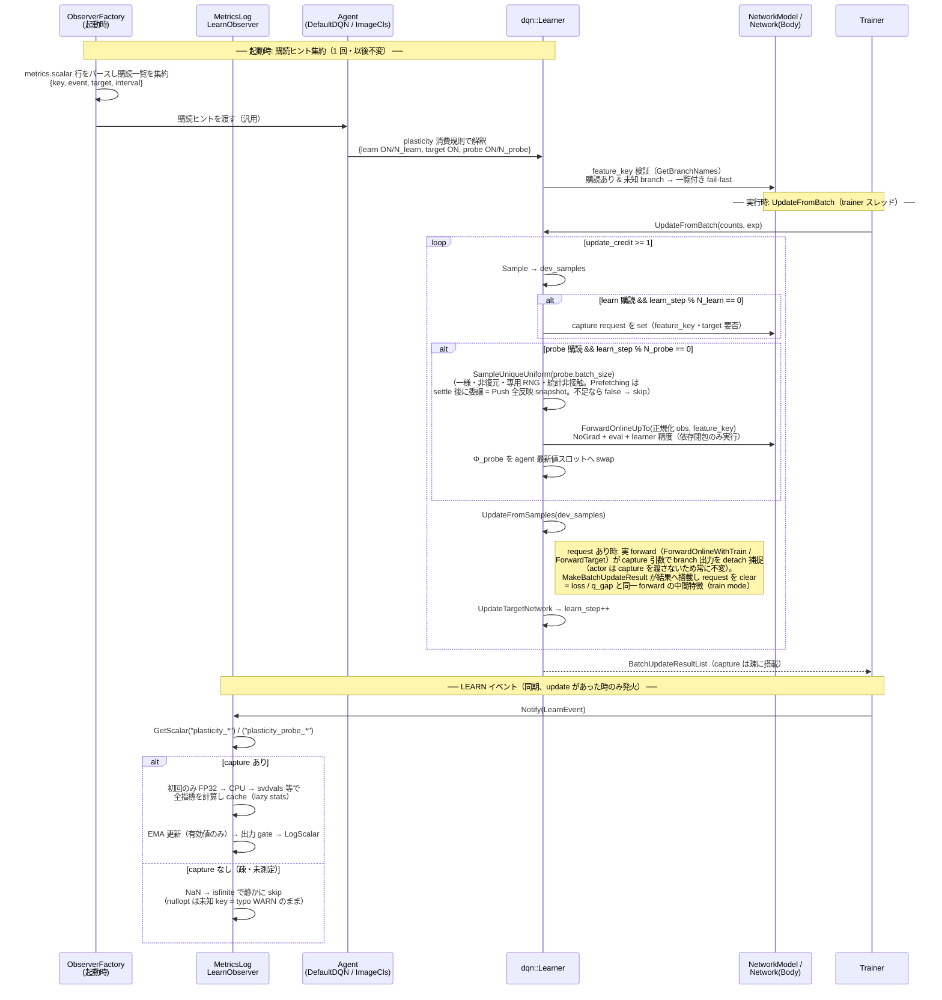

# 可塑性メトリクス（srank / dormant unit 率）PRD

> 起点: 2026-08-25〜26、「多くのメトリクスが 5-6M 付近まで向上→急落→緩回復」の機序分析。
> 2026-08-26〜27 の `replay_ratio` ラダー（8 / 4 / 2 / 1）で機序側はほぼ決着したため、本 PRD の位置づけは
> 「仮説の検証手段」から **「代理指標が尽きた後の唯一の測定器」** へ移っている（§なぜ今か）。
> さらに 2026-08-27 のグリルで**普遍メトリクス（全 ENV・既定 ON の常設測定器）**として確定した。
> 裁定: 2026-08-27 グリルで D1〜D11 全決定、同日レビュー 4 ラウンド（F/G/P 指摘）を反映して配線を最終化（§決定事項）。実装: Codex。
> 関連: `../adr/0031-plasticity-metrics-out-of-band-partial-forward.md`（本 PRD の決定記録）、
> `../experiments/default-dqn/atari/2026-08-17_baseline.md`（探索ブロック 15 / 20 / 21 / 23 / 24、知見 26）、
> `frozen/999_nn_embedding_tsne_10prd.md`（特徴取得の口 = 部分 forward を将来共用）、
> `940_target_update_step_axis_10prd.md`（RR ラダーに乗る `soft_update_tau` の交絡。§測定上の注意）、
> `911_metrics_record_channel_10prd.md`（独立。本 PRD は既存 scalar 経路だけで完結する。§7 の TraceCallback 常時 ON 問題は購読ヒントの将来流用先）、
> 将来: Spectral Norm（BTR）/ shrink-and-perturb・ReDo（BBF/Sokar）導入 PRD。

## Context（背景・目的）

### 機序はどこまで決着したか

数値の正本は探索記録（探索ブロック 21 / 23 / 24）。要点だけ再掲する。

`replay_ratio` 以外を完全に固定した 100M の単変数ペア／トリプルで、`q_gap` の前半の落ち込みは次のようになった。

| | 過渡ピーク | 深さ | 100M 時点の `q_gap` |
|---|---|---|---|
| RR8（探索ブロック 15）※ | 86k grad | **−62%**（崩壊、回復せず） | — |
| RR4 | 86k grad（5.5M exp） | **−31.5%** | 0.0571 |
| RR2 | 145k grad（18.5M exp） | **−11.8%** | 0.0798 |
| RR1 | **前半の過渡なし**（80M まで単調上昇） | **—** | 0.0734 |

※ RR8 のみ**別世代構成**（ラダー無し・`per_beta_step` 5M・10M 予算）で、単変数トリプルは RR4 / RR2 / RR1 の 3 本。
RR8 は形の参考として並記している（単変数比較には含めない）。

**当初の H2「過渡の位置は固定 grad step で決まる」は棄却された**（ピークが 86k 対 145k grad と 1.69 倍ずれ、
exp 軸では 3.36 倍ずれる。どちらの軸にも揃わない）。生き残ったのは弱い形である。

> **損傷は勾配 step あたりで蓄積し、修復は新規サンプルの流入で進む。破綻点はその比 = `replay_ratio` で決まる。**

`replay_ratio` は「収集した遷移が平均何回サンプルされるか」（`U = N·RR/B` より exp_step あたりの抽出数 = RR。
`core/anet-core/src/dqn_based_agent.cpp:1804-1812`）なので、**RR = 1 は各サンプルを 1 回だけ使う点**にあたり、そこで過渡が消える。
これは Kumar 2021 / Sokar 2023 / Nikishin 2022 の "updates per datum" と同型で、
**文献の枠組みが本コードベースで再現された**ことになる。

### なぜ今か（本 PRD の価値が上がった理由）

**代理指標が尽きた。** これまで可塑性の代理に使ってきた 2 つが、どちらもスコアの予測子でないと分かった。

| 指標 | 95-100M の値（RR1 / RR2 / RR4） | スコア順（RR1 > RR2 > RR4）との関係 |
|---|---|---|
| `q_gap`（定常値） | 0.0734 / **0.0798** / 0.0571 | **単調でない**（RR2 が最大） |
| BF16 の ULP 余裕 | **1.48** / 1.66 / 1.25 | **単調でない**（RR1 が最小なのに最良） |

`q_gap` について使えるのは**過渡の深さ**だけであって定常のレベルではない、というのが探索ブロック 24 の結論である
（探索ブロック 23 で「定常での識別性が高いほど良い」と読める書き方をしたのは RR1 が反証した）。
ULP 余裕は探索ブロック 19 以来 6 例目の反例で、監視対象から外してよい段階にある。

つまり **いま何かを触っても、表現が健康になったのか壊れたのかを測る量が存在しない**。
保護機構（Spectral Norm / reset）を入れるにも、NN 容量を上げるにも、先に測定器が要る。

もう 1 つ、決着していない観測がある。**後期の `grad_norm` / `loss` / `td_mean` の上昇が RR 依存である**
（RR4 は 45-50M を底に +27% / +14% / +11%、RR2 / RR1 は平坦）。探索ブロック 22 では β スケジュールに帰属させたが、
両 Run の `per_beta_step` が同じ 50M であることから探索ブロック 23 で反証された。
**「RR4 の後期の働きは学習ではなく損傷への対処」という読みは、本 PRD の 2 指標があれば直接検証できる。**

### 文献との対応

| 文献 | 主張 | 本記録との対応 |
|---|---|---|
| Kumar et al. 2021 (arXiv:2010.14498) "Implicit Under-Parameterization" | bootstrap 更新を重ねるほど penultimate 特徴の実効ランク（srank）が低下。データあたり更新回数が多いほど悪化 | 「損傷は勾配 step、修復は新規データ」の弱い H2 と一致 |
| Sokar et al. 2023 (arXiv:2302.12902) "Dormant Neuron Phenomenon" | dormant ニューロン率は学習とともに単調増加し、**replay ratio が高いほど速く増えて性能崩壊と同期**。ReDo（dormant の再初期化）で高 RR が回復 | **RR ラダー 4 点（−62% / −31.5% / −11.8% / なし）が単調で、この予言と形が一致する。最も直接的な対応** |
| Nikishin et al. 2022 (arXiv:2205.07802) "Primacy Bias" / reset | 更新過多で早期経験に過適合。定期 reset で回復 | 過渡が「同じデータを繰り返し当てること」で生じる、という読みと整合 |
| BBF (Schwarzer et al. 2023) / BTR (2411.03820) | γ=0.997 を reset / Spectral Norm とセットで運用 | 本コードベースは両機構とも未実装（grep ヒットゼロ。探索ブロック 15） |

測定条件の差に注意: **Kumar らは buffer / training data から i.i.d.（一様）サンプルで srank を測り、
Sokar らの RR 比較は target update period を RR に応じて調整**している。本 PRD の probe 系（一様サンプル）は前者に対応するが、
τ の正規化（940）は本 PRD ではやらない。数値・図の詳細は記憶ベースのため、実装時に原典を引き直すこと。

## 計測の定義

対象は **`feature_key` で明示した branch の出力 = penultimate 特徴**。全 env config が慣習名 `main_feature` を
使っており（`Atari.txt:511-522` / `CartPole.txt:28` / `LunarLander.txt:178` / `GridMaze.txt:137` /
`DropMerge.txt:61-64` / `ImageCls.txt:20`）、Atari では `AtariLinear512 > ReLU` の出力（512 次元、
`apps/runner/config/Atari.txt:410-412, 511-522`）にあたる。
IQN では fusion（`main_feature * tau_embedding`）の**前**で測る — τ 変調前の共有表現が「健康状態」の対象。
fusion は config の bind 積として body 内で実行される（`Atari.txt:543-549`、ADR-0018）ため、
fusion 手前で打ち切る部分 forward（§実装仕様 1）が必要になる。
測定対象のネットワークは **learner の online net**（train actor snapshot ではない）。target net 側は @learn 系の
コメントアウト行の uncomment で発動する（§実装仕様 7）。

### 2 つの測定チャネル

| | **@learn 系**（`01〜05` / `12,13` / `21〜25`） | **$agent probe 系**（`41〜45`） |
|---|---|---|
| 意味 | **学習 forward が実際に生成した中間特徴そのもの**。同じ UpdateResult の loss / q_gap と**同一 forward（update 適用前の重み・同一バッチ）** | **NN × RB の状態スナップショット**。学習の抽出とは独立 |
| 実行モード | **train mode**（学習 forward から capture 引数で捕捉。Dropout/DropPath mask・BN バッチ統計の効果込み = 構成依存。追加 forward なし = capture の GPU コストゼロ） | **eval mode**（決定的。Dropout 無効・BN は running stats。部分 forward による別測定） |
| サンプル | update バッチそのもの（PER priority^α バイアス込み、N = 測定バッチの行数 = DQN 系は `replay_batch_size`） | RB からの**一様・非復元サンプル**（N = `probe.batch_size` 既定 512 ≥ D、index は常に一意） |
| srank 上限 | min(N, D)（Atari は 256 = **天井あり**） | min(N, D) = D（**天井解消**。非復元なので序盤含め厳密に成立） |
| 運搬 | UpdateResult に疎に搭載（測定 learn_step に正確に点が乗る） | agent 最新値（$agent idiom。値の鮮度 ≤ probe cadence） |
| 対象 agent | DefaultDQN 系 + ImageCls | **DQN 系のみ**（ImageCls は RB を持たない） |

役割分担: @learn 系は「学習が見ている表現」の生の観測（train mode ノイズ込み。現行 Atari 既定 = Nature/Impala は
Dropout/BN を持たないため eval 測定と一致する）、**決定的な健康測定と RR 比較の主読みは probe 系**が担う。

### srank_δ（実効ランク）

バッチ N 件の特徴行列 Φ ∈ R^{N×D}（D = 特徴次元）の特異値 σ₁ ≥ … ≥ σ_{min(N,D)} に対し

```
srank_δ(Φ) = min{ k : (σ₁+…+σ_k) / (σ₁+…+σ_{min(N,D)}) ≥ 1−δ }      δ = 0.01（Kumar et al. 慣例）
```

**上限は min(N, D)**（σ は min(N,D) 本しか存在しない）。学習初期の健康な表現は上限近くに張り付き、
ランク崩壊で下がる、という読み方をする。エッジ: Φ が全ゼロ（Σσ = 0）のときのみ srank = 0 と定義する。
実装は δ ∈ {0.01, 0.05, 0.20} の 3 本を同一の特異値ベクトルから算出する（同一 step なら SVD は 1 回。
無印 key = δ0.01 = 既存 Run 互換。0.05 / 0.20 は裾でなく上位方向へのエネルギー集中を見る感度読み）。
注意（censoring）: @learn 系（Atari N=256 < D=512）は天井が D の半分で、健康な期間は張り付きで差が見えない可能性がある。
**天井の無い読みは probe 系（N ≥ D）で行う**。@learn 系は崩壊（大幅低下）の検出と RR 間比較用で、天井付近の微差は読まない。

最終層は Q(s,a) = w_a·φ(s) の線形読み出しなので、φ が低ランク部分空間に潰れると行動間の差 (w_a−w_b)·φ(s) はその部分空間への射影しか使えない。**q_max 単調上昇 + q_gap 侵食はランク崩壊の署名**であり、srank はそれを表現側で直接測る。

### dormant unit 率

ニューロン i（i = 1..D）の正規化活性スコア

```
s_i = E_x[|h_i(x)|] / ( (1/D) Σ_k E_x[|h_k(x)|] )
```

に対し s_i ≤ τ なら dormant。τ = 0（厳密な死。ReLU では勾配が流れない）と τ = 0.025（Sokar らの実用値）の 2 本を出す。
エッジ: 分母（全ユニット平均活性）が 0 のときは全ユニット dormant（dormant_ratio = dead_ratio = 1.0）と定義する。

### 出力スカラー（確定）

| tag | スカラーキー（経路） | 内容 |
|---|---|---|
番号は decade がチャネル（`0x` actual / `2x` target / `4x` probe）、下 1 桁が統計種。
下 1 桁は 3 チャネル共通で、`x1`-`x5` が既定 ON・`x6`-`x9` が既定 OFF。

| tag（下 1 桁） | source key | 内容 |
|---|---|---|
| `x1_dormant_ratio` | `plasticity_[probe_|target_]dormant_ratio` | τ=0.025 の dormant 率 |
| `x2_dead_ratio` | 同上 `dead_ratio` | τ=0 の dormant 率 |
| `x3_feature_norm` | 同上 `feature_norm` | E[‖φ‖₂]（値スケール成長の随伴観測） |
| `x4_srank` | 同上 `srank` | srank_0.01（0〜min(N,D) の整数値） |
| `x5_srank_ratio` | 同上 `srank_ratio` | srank / min(N, D)。**1.0 = 測定上限**（N < D なら batch 律速の上限、N ≥ D なら真のフルランク） |
| `x6`〜`x9`（δ 感度） | 同上 `srank(_ratio)_delta_005/020` | δ=0.05 / 0.20 の srank / srank_ratio。**全チャネル既定コメントアウト** |

actual 系は `$update_result`、probe 系は **`$agent`** 経路。target 系（`2x`）は**チャネルごとコメントアウト待機**
（uncomment だけで capture も発動）。probe 系（`4x`）は**既定 ON**。

群番号 34 は scalar / image 両空間の全 config 走査で確認した空き（空きは 34 / 35 / 46-50）。当初案の 43 は
`43_agent_img`（CartPole / LunarLander で現用）と番号が重なり、Viewer ツリーで同じ番号が 2 つの別物を指すため回避した。
名称は `plasticity` フル表記（切り詰め形は辞書で引けず不採用）。
δ / τ は**固定定数**（config 化しない。値を変えると過去 Run と比較不能になるため）。δ は実装時に
{0.01, 0.05, 0.20} の 3 本へ拡張した（固定定数のまま本数だけ追加。無印 key = δ0.01 で既存 Run 互換を保つ）。

## 決定事項（2026-08-27 グリル + レビュー 4 ラウンド）

| # | 論点 | 裁定 |
|---|---|---|
| D1 | タップ機構 | **2 方式の併用**。**@learn 系 = 学習 forward からの branch capture**（`Network::Forward` / `NetworkBody::Forward` に**既定 nullptr の optional capture 引数**を追加し、body forward 末尾で内部 state から対象 branch を detach して返す。追加 forward なし・capture コストゼロ。hot path 変更は body forward 末尾の分岐 1 個のみで、**capture を渡さない既存呼び出し（actor 含む）は購読 ON でも完全不変**。branch 出力を既存 TraceCallback へ無条件 emit する案は、actor が常時 callback を渡しているため購読 OFF でも波及して契約違反 — 不採用）。**probe 系 = 部分 forward** `NetworkBody::ForwardUpTo(input, branch_key)` = トポロジカルソート済み branch 列から**対象 branch の依存閉包だけ**を実行し、**実行済み state 全体（TensorDict）を返す**（将来 t-SNE もこの口を共用）。`GetTensorDictFunction` は触らない。旧 3 案（A: 既存 forward 相乗り / B: 予約 key で body 出力 / C: learner 内直接計算）は、**IQN 構成では測定対象 branch が body 出力に出ない**事実（§事実 1）により不成立（QR / nature では出るが、構成依存の口は普遍メトリクスの土台にならない）。**@learn を eval mode の再 forward で測る旧案は「この update が見た表現」という定義と矛盾**し（train mode の Dropout/BN 効果が再現されない）、追加 forward コストも伴うため branch capture へ置き換えた |
| D2 | 測定頻度 | learn_step 軸。**cadence の正 = metrics 行の `interval:N`**（購読ヒント経由で learner へ届く。@learn 系・probe 系それぞれ該当行の最小値）。learner 側に interval キーは持たない。@baseline の metrics 行（interval:100）が「全 ENV 既定 ON」を構成する。@learn 系は capture コストゼロ（forward への capture 引数）のため律速は CPU stats のみで、**interval を下げる余地がある**（既定 100 は据え置き） |
| D3 | 測定バッチ | **2 チャネル**。@learn 系 = learner の現行 update バッチ（実 forward の入力そのもの。PER priority^α バイアス込み、レビュー F1/F3 の指摘は §測定上の注意）。probe 系 = **RB からの一様・非復元サンプル**（N=512 ≥ D、index 一意。天井と PER バイアスを解消。F1/F3 の一様プローブがここで実装される） |
| D4 | 測定点 | `feature_key`（branch 名）で**明示必須**。既定値は @baseline の `main_feature`（全 env config の慣習名）。branch 出力は **rank-2 (N, D) 契約**、違反は shape 入りで fail-fast |
| D5 | 精度 | **@learn 系 = 実 forward の精度そのもの**（capture 引数による実 forward 捕捉なので必然的に learner の Autocast 構成。bf16 構成では BF16 の表現）。**probe 系 = learner と同じ Autocast 構成を eval forward に再現**（数値レジームを揃える）。**stats は FP32 cast → CPU 固定**（`svdvals` が BF16 非対応のため強制。D6 と一体）。bf16 ON/OFF の Run 間では指標に精度差が乗る（§測定上の注意） |
| D6 | 決定論 | 統計計算は **CPU 固定**（`svdvals` 含む）。CUDA の deterministic 検証課題を構造で回避。前例 = Spearman 相関の CPU 計算（`dqn_based_agent.cpp:641-680`） |
| D7 | タグ構成 | 群 `34_agent_plasticity`: @learn 系 5 本（既定 ON）+ target 5 本（コメントアウト）+ probe 系 5 本（既定 ON）。decade = チャネル、下 1 桁 = 統計種。EMA 行は作らない（生系列で読めるうえ、既定 α が interval に対して過平滑） |
| D8 | 対象 agent | **DefaultDQN 系 + ImageCls の 2 系統**。タップは共有 `dqn::Learner` ループで TD/QR/IQN 自動対応。計算部は共有ヘルパ。**Rainbow は配線見送り**（`RainbowAgent.net.*` が全 env config に無く実行 smoke 不能。将来必要時に数行）。MuZero はスコープ外（@baseline チェーン不使用） |
| D9 | τ と δ | δ={0.01, 0.05, 0.20} / τ={0, 0.025} を**固定定数**とする。config 化しない。無印 srank key は δ=0.01（既存 Run 互換）、δ0.05 / 0.20 は `*_delta_005/020` キーで全チャネルに用意し**行は既定コメントアウト**（2026-08-28 実装時拡張。同一 step の 3δ は 1 回の SVD を共有） |
| D10 | target net 側 | コードは対応、**発動は `plasticity_target_*` 行の uncomment**（購読ヒントが検出して capture 開始。専用 config キーは持たない）。測るのは「この update の TD 計算が使った target」（UpdateTargetNetwork 前） |
| D11 | 受入 | **smoke + 実測**（§受入基準の 5 項目）。RR ラダーの科学検証は受入外の §検証計画、結果は実験記録側へ |
| 配線 | 全体構成 | **capture（GPU）/ stats（CPU・GetScalar 時 lazy）分離** + **購読ヒント駆動**。@learn 系の capture = **実 forward への capture 引数**（ループは capture request を立てるだけ）、probe 系の capture = ループ内の eval 部分 forward（RB の `SampleUniqueUniform` 公開 API 経由。§5）。@learn 系は UpdateResult に疎搭載、probe 系は agent 最新値。**疎・未測定は NaN**（既知 key の「値なし」表現。nullopt は未知 key = typo 検出 WARN のまま）。GetScalar でのその場 forward は**しない** |

## 実装仕様

### 1. 部分 forward（NetworkBody::ForwardUpTo — probe 系 / 将来 t-SNE 用）

`NetworkBody::Forward`（`core/anet-core/src/nn_impl.cpp:990-1012`）の変種として追加する。**@learn 系はこれを使わない**
（実 forward への capture 引数で捕捉。§3）。

```cpp
// nn.hpp / nn_impl.cpp（NetworkBody）
anet::TensorDict ForwardUpTo(const anet::TensorDict& input, const std::string& branch_key);
std::vector<std::string> GetBranchNames() const;   // 起動時検証・診断用（エラーへ一覧を含めるため。bool 版は持たない）
// Network にも両方の委譲 wrapper を追加（body_ は private のため。nn.hpp:137）
```

- 契約: `preprocessor_.Format(input)` 後、`branches_`（**ビルド時に Kahn 法でトポロジカルソート済み**。
  `nn_impl.cpp:1257-1280`、循環は構築時に検出済み）を走査し、**対象 branch の依存閉包（bind を逆向きに辿った
  ancestors + 対象自身）に含まれる branch だけ**を順に `Execute`、対象を実行し終えた時点で
  **実行済み state 全体（TensorDict）を返す**（= Format 済み入力 + 閉包 branch の出力）。
  `output_keys_` マップ（`:1003-1010`）は通らない。TraceCallback は渡さない。
- `branch_key` が未知なら `ANET_SYSTEM_ERROR`（指定名 + 利用可能 branch 名一覧を含める）。
- **閉包フィルタは契約の一部**（省略不可）: トポロジカル順が保証するのは「依存が従属より先」だけで、
  **独立 branch 同士の順序は保証されない**（現構成で `main_feature` が `tau_embedding` より先に来るのは、
  初期キュー投入（`nn_impl.cpp:1259-1261`）が map の辞書順で回る偶然）。素朴な「先頭から対象まで実行」だと、
  `taus` を要する branch が辞書順で先に並ぶ構成で taus 欠如エラーになる。閉包フィルタにより、IQN 構成でも
  `main_feature` の閉包に `tau_embedding` / `iqn_fusion` が含まれず、**`taus` 入力なし・無関係 branch の
  計算ゼロ**が機構的に保証される。RNG も消費しない。
- 閉包の計算元: 各 branch は `GetName()` / `GetBindTerms()` を公開している（`nn_impl.hpp:167-168`）ので、
  NetworkBody は保持済みの `branches_` だけから bind グラフを再構成できる。依存解決は現行 builder と同じく
  **input key を同名 branch より優先**し、factor が input spec に存在すれば終端入力として扱う。それ以外で
  factor が branch 名なら再帰する。閉包集合は呼び出し毎に作っても branch_key ごとにキャッシュしてもよい。
- `NetworkModel` に probe 用 wrapper を追加: `ForwardOnlineWithTrain`（`dqn_based_agent.cpp:405-409`）の並びに
  `ForwardOnlineUpTo` を置き、内部で `torch::NoGradGuard` + `anet::TrainingModeGuard(net, false)` を張る。
  **追加 forward である probe は eval mode 固定が必須** — RNG を消費せず running stats も汚さないことで、
  probe の有無・頻度が学習の数値系列を一切変えない。これは将来対策ではなく現在の必須要件: ViT プロファイルは既に
  `net.block.[TransEnc].tf.hidden_dropout_rate = 0.1` / `.tf.droppath_rate = 0.1` を持ち
  （`apps/runner/config/nn.txt:181, 183`）、train mode の追加 forward は RNG を消費して
  同 seed 比較（§検証計画の「RR 以外同一構成」前提）を壊す。（@learn 系は追加 forward 自体が無いので、この論点は生じない。）
- 精度: wrapper 自身は dtype を触らない。呼び出し側（§3）が learner と同じ `anet::Autocast` 構成を張る（D5）。

### 2. 購読ヒント（汎用機構）

**今回固有ではなく、今後の同種ケースや他 Agent 実装で流用できる汎用機構として実装する**（ユーザー裁定）。

- ObserverFactory（`observers.cpp:1186-`）が scalar metrics のパース時に、**全行の {key, event, target, interval}
  を購読一覧として集約**する。この内容は既存の **metrics 定義レコード**（CONTEXT.md 用語。Runner が Metrics マスタへ
  書き出す解決済み定義）と同源であり、実装は同じ構築情報を流用してよい。
- 観測構成の確定後・学習開始前に 1 回、その一覧を agent へ渡す（汎用インターフェース。渡し口の具体形 —
  `Agent` の setter か構築引数か — は実装裁量。以後不変）。
- **消費側が自分の関心キーを filter して解釈する。** 可塑性の消費規則:
  - `plasticity_*`（$update_result 系、`plasticity_probe_*` を除く）の購読 ≥1 → **@learn capture ON**。
    cadence N_learn = 該当行の `interval:N` の最小値。
  - `plasticity_target_*` の購読あり → **target capture も ON**（コメントアウト行の uncomment 1 箇所で発動）。
  - `plasticity_probe_*`（$agent 系）の購読 ≥1 → **probe capture ON**。cadence N_probe = 該当行の最小値。
  - 購読ゼロ → 完全不活性（forward もサンプルも一切走らない）。
- 「metrics 側が測りたいタイミングを事前に伝える」は standing な予約として実装する
  （interval は静的 config なので、毎回のシグナルと等価）。
- 将来の流用候補: TraceCallback の常時 ON 問題（`911_metrics_record_channel_10prd.md` §7）等。

### 3. 測定タップ（2 チャネル・DQN 系）

ゲート判定は `dqn::Learner::UpdateFromBatch` の update ループ内（`dqn_based_agent.cpp:2339-2374`）。trainer スレッド。

1. **@learn capture = 実 forward への capture 引数**（`購読あり && vars_.learn_step % N_learn == 0`）:
   - ループは `UpdateFromSamples` 呼び出し前に **capture request（feature_key・target 要否）を NetworkModel へ立てるだけ**。
     追加 forward・obs 再正規化は不要（実 forward の入力そのものを測る）。
   - forward に **既定 nullptr の optional capture 引数**を追加する（TraceCallback は触らない）:

     ```cpp
     // nn.hpp（構造体名・引数名は実装裁量）
     struct NetworkBranchCapture {
         std::string branch_key;   // in : 対象 branch（= feature_key）
         torch::Tensor output;     // out: detach 済み branch 出力
     };
     TensorDict Network::Forward(const TensorDict& input, const TraceCallback& callback = {},
                                 NetworkBranchCapture* capture = nullptr);
     // NetworkBody::Forward も同形。処理は branch ループ後・output_keys マップ前に 1 回だけ:
     //   if (capture) { state.Get(branch_key) → 無ければ GetBranchNames() 一覧付き fail-fast
     //                  → detach して capture->output へ }
     ```

   - **capture を渡さない既存呼び出しは完全不変**（既定引数のため呼び出し側の変更もゼロ）。actor は capture を
     渡さないので、**購読 ON でも actor の処理・nn_trace は一切変わらない**（契約。単体テスト対象）。
     per-branch の追加分岐も無く、hot path 変更は body forward 末尾の `if (capture)` 1 個のみ。
   - `ForwardOnlineWithTrain`（`dqn_based_agent.cpp:405-409`）は request がある時だけ capture を
     `Network::Forward` へ渡し、branch 出力を detach 保持する。target 購読時は
     `ForwardTarget`（`:411-414`）も同様に捕捉（= この update の TD 計算が使った target forward の特徴）。
     **TD / QR / IQN の呼び出し 3 箇所は無改修**。
   - 全 learner 共通の `MakeBatchUpdateResult`（非 const 段階。TD `:2727` / QR `:2865` / IQN `:3063` が経由）が
     捕捉分を**この update の結果へ搭載して request を clear** する。`UpdateFromSamples` の戻り値は
     `shared_ptr<const BatchUpdateResult>`（`dqn_based_agent.hpp:656`）でループからは変更不能のため、
     非 const 段階で焼き込むこの形が唯一の自然な境界（§事実 10）。捕捉特徴の rank ≠ 2 は shape 入り fail-fast（D4）。
   - **意味論: plasticity_* は同じ結果の loss / q_gap と同一 forward の中間特徴そのもの**（train mode。
     update 適用前の重み・同一バッチ）。capture の GPU コストはゼロ（detach 参照保持 ~512KB のみ）。
     learn_step 0 の点はランダム初期重みの基準点。
2. **probe capture = eval 部分 forward**（`購読あり && vars_.learn_step % N_probe == 0`）:
   `replay_buffer_->SampleUniqueUniform(samples, probe.batch_size)`（§5。false なら skip）で抽出 → device 転送 →
   `NormalizeSampleObservations`（`:2603-2605` と同じヘルパ）→ learner と同じ `anet::Autocast` 構成 +
   `ForwardOnlineUpTo(obs, feature_key)`（NoGrad + eval mode）→ Φ_probe を detach →
   **learner 保持の最新値スロット**へ（atomic swap または軽い排他。lazy stats キャッシュごと差し替え）。
3. どちらの capture も `ANET_PROFILE_SCOPE` を入れる（AGENTS.md の ProfileRange ルール。throughput 帰属確認用）。

**ImageCls**: `ImageClsLearner`（`image_cls_agent.hpp:197`）は @learn 系のみ（probe 系は RB が無いため対象外）。
学習 forward `network_->Forward(obs)`（`image_cls_agent.cpp:360`、autocast ブロック `:355-360` 内）に request 時だけ
capture 引数を渡して捕捉する（= **ApplyMix 後（`:350`）の入力・train mode・自身の autocast 構成での実 forward 特徴**）。
結果は `ImageClsUpdateResult`（`image_cls_agent.hpp:117-`）へ直接搭載（自前構築なので const 制約なし）。
ゲートは `StepCounts.learn_step`。

### 4. 統計計算とスカラー公開（lazy stats + NaN 契約）

共有ヘルパ（nn 機能グループ同居、名前付き namespace `anet::nn` を推奨）:

```cpp
struct PlasticityMetrics {
    float srank;          // 整数値（scalar 経路に合わせ float）
    float srank_ratio;    // srank / min(N, D)
    float dormant_ratio;  // τ = kPlasticityDormantTau
    float dead_ratio;     // τ = 0
    float feature_norm;   // E[‖φ‖₂]
};
inline constexpr float kPlasticitySrankDelta = 0.01f;
inline constexpr float kPlasticityDormantTau = 0.025f;
PlasticityMetrics ComputePlasticityMetrics(const torch::Tensor& features);  // rank-2 (N, D) 前提
```

- 手順: `features`（capture 済み・detach 済み）→ FP32 cast → `.cpu()` 転送 → `torch::linalg_svdvals`（CPU）で σ →
  srank / ratio、平均絶対活性から dormant / dead、行ノルム平均で feature_norm。エッジ定義は §計測の定義。
- **lazy + cache**: `BatchUpdateResult::GetScalar("plasticity_*")` / agent の probe 系 GetScalar は、
  **初回呼び出し時に capture から全指標を計算して cache** する（既存の遅延 CPU 転送 idiom
  `dqn_based_agent.hpp:165-196` と同型。mutable cache）。2 回目以降は cache を返す。
- **NaN 契約**: 既知 key だが値が無い場合 — @learn 系で capture の無い update（疎）、probe 系で初回測定前・
  RB サイズ不足 — は **NaN を返す**（`std::nullopt` は未知 key 専用のまま = "value not found" WARN による
  typo 検出を無傷で残す）。先例 = env scalar `accuracy`（初回 wrap 前は NaN）。NaN は観測側の
  `isfinite` チェック（`observers.cpp:1006`）で**機構無変更のまま静かに skip** される。
- **同梱の機構側ガード 2 行**（NaN 先例 + `$ema` の組合せが現状でも壊れる潜在バグの堅牢化を兼ねる）:
  1. EMA 更新（`observers.cpp:987`。isfinite チェックより前にある）に非有限スキップを追加
     （NaN が `$ema` を恒久汚染するのを防ぐ）。
  2. 非 LEARN 軸の平均化分岐（`observers.cpp:846-`）で非有限値を「値なし」として除外。
- **GetScalar でのその場 forward はしない**（両チャネルとも。計算ゲートは §2/§3 のヒント + ループ内のみ）。

### 5. RB 一様・非復元読み出し API（新規・probe 用）

現行の ReplayBuffer 公開 API は `Push` / `Sample` / `Size` / `UpdatePriorities`（+ GetScalar 系）のみで、
valid index・sampler・extractor・lock は `DefaultReplayBuffer` の private 部品（§事実 15-16）。probe 用に
**公開 virtual API を 1 本追加**し、実装責任を次のとおり分担する。

**(1) 公開 API（ReplayBuffer 抽象へ pure virtual で追加）**

```cpp
/// 一様・非復元の読み出し（測定用）。優先度・IS 重み・sampled/eviction 統計に一切影響しない。
/// out_samples は CPU で返す（装飾の有無に依らず）。
/// sampleable 数 < batch_size なら false を返し、out_samples・専用 RNG のいずれも変更しない（不足判定は抽選より前）。
virtual bool SampleUniqueUniform(ExperienceSamples& out_samples, int64_t batch_size) const = 0;
```

現用実装（`DefaultReplayBuffer` / `PrefetchingReplayBuffer` / テスト double）は**同一変更内で全て実装**する
（クリーンブレーク方針。基底に黙って throw する既定実装は置かない）。

**(2) DefaultReplayBuffer の実装責任**

- 既存 `Sample` と同じ lock 境界の中で: sampleable な valid index の具現化（050 の ready / sampleable 分離を順守）→
  `UniqueUniformSampler::SampleIndices` による非復元抽選 → 既存 extractor で ExperienceSamples 生成。
- `MarkSampledOnce`（`replay_buffer_impl.cpp:1335`）・優先度木・β / IS 重み・eviction 統計
  （`replaybuffer.per.last_evicted_never_sampled_ratio` 等）を**呼ばない・触らない**。IS 重み列は 1.0 固定で返す。
- **`UniqueUniformSampler`**（~25 行）は既存 `UniformSampler`（`:808-835`）の隣に置き、抽選 interface
  `ReplayExperienceSampler::SampleIndices(batch, valid_indices_1d, beta)`（`:818`）に準拠 — 新規なのは index の
  選び方だけ。`torch::randint` で引き重複を除外、不足分だけ再抽選（n ≪ m で期待 1〜2 周）。
  **サイズ不足の判定（false 返し・RNG 非接触）は抽選より前に行う**ため、sampler に入るのは
  `valid_count >= batch` のみ。`valid_count == batch` は全件をそのまま返す（決定的・RNG 非消費）。
  **返す index は常に一意** — 「N ≥ D で srank 天井解消」が序盤（RB が小さい間）も含め厳密に成立する。

**(3) PrefetchingReplayBuffer の実装責任 — 明示的な同期境界**

- **素通しの単純委譲は不可**: worker の進行状況によって queued `Push` の反映前後どちらを読むかがスレッド実行順序に
  依存し、probe の決定性契約（同 seed で同じものを見る）が崩れる。`SampleUniqueUniform` は委譲の前に
  **decorator の同期境界で状態を確定**させる: `state_->mutex` の下で、**呼び出し時点までに受理済みの
  write-behind `Push` と in-flight prefetch を worker FIFO の規定順で settle（排水）してから**
  `inner_->SampleUniqueUniform(...)` を呼ぶ（worker FIFO へ task として積み結果を待つ実装でも等価。実装裁量）。
- **可視性契約: probe は「呼び出し時点までに `Push()` された全遷移が反映された snapshot」を読む。**
  decorator の有無に依らず同一の可視性（`DefaultReplayBuffer` 直と同じ）になり、probe が見る valid index 集合は
  learner スレッドの呼び出し順だけで決まる — **同 seed で probe 対象集合・抽選列とも決定的**。
- settle は「元々 FIFO 順で起きる処理を待つだけ」で、並べ替えも追加 Sample も行わない — 通常 `Sample` の順序・
  prefetched batch の内容・学習側 RNG・学習結果は**不変**（受入 5 の ON/OFF 等価性と整合）。追加コストは
  待ち時間のみ（≤ in-flight Fetch 1 本、probe cadence ごと）。`Push → next SampleIndices → UpdatePriorities` の
  順序固定契約（`:102-107`）も不変（probe は優先度非接触）。
- 戻りは CPU の ExperienceSamples（prefetch の H2D 経路は使わない。device 転送は learner 側 = §3-2）。

**(4) 専用 RNG の所有と seed 導出**

- **`DefaultReplayBuffer` が probe 用 sampler を所有**する（通常 `sampler_` と同じ持ち方。生成箇所 `:2122` の並び）。
- seed は RB が受け取る seed からの固定派生（salt 加算等、実装裁量）で、**通常 sampling の RNG と独立**。
  probe の有無・頻度が学習のサンプル列を変えず（同 seed 再現の保護）、同 seed なら probe 抽選列も決定的。
- API は const（進むのは probe 専用 RNG の内部状態のみ。通常 `Sample` と同じ扱い）。

sampleable 数 < `probe.batch_size` の間は `SampleUniqueUniform` が false を返し probe skip（値は NaN のまま。
out_samples と専用 RNG は不変なので、skip の有無・回数が以後の probe 抽選列を変えない）。

### 6. config 契約

```
# agent.txt（@baseline 層）
DefaultDQNAgent.@baseline.learner.plasticity.feature_key      = main_feature   # 測定 branch 名。購読があるとき必須
DefaultDQNAgent.@baseline.learner.plasticity.probe.batch_size = 512            # probe 系の一様サンプル数（≥ D 推奨）

# ImageCls.txt
ImageClsAgent.plasticity.feature_key = main_feature
```

- **interval 系・measure_target のキーは持たない**（頻度と ON/OFF と target 発動の正 = metrics 行。§2）。
- 検証規則（Fail-Fast 原則）: plasticity 系の購読があるのに `feature_key` 未指定、または `GetBranchNames()` に
  含まれない branch 名 → ヒント確定後の最初の自然な境界で `ANET_SYSTEM_ERROR`
  （キー・指定値・`GetBranchNames()` による利用可能 branch 名一覧を含める）。
  購読ゼロ → `feature_key` は NoCare（意図された休止）。`probe.batch_size < 1` はエラー。
- plasticity 行に `interval` 無指定（metrics 側既定 1）の場合は毎 update 計算がそのまま起きる
  （「設定に書いたことがそのまま起きる」。エラーにしない）。

### 7. metrics 配線（最終形）

```
# metrics_scalar.txt（@baseline 追加分）
# --- @learn 系: この update が見た表現（$target 省略 = 既定 $update_result。interval:N が計算 cadence の正）---
metrics.scalar.@baseline.[34_agent_plasticity/01_dormant_ratio] = plasticity_dormant_ratio @learn $learn_step interval:500
metrics.scalar.@baseline.[34_agent_plasticity/02_dead_ratio] = plasticity_dead_ratio @learn $learn_step interval:500
metrics.scalar.@baseline.[34_agent_plasticity/03_feature_norm] = plasticity_feature_norm @learn $learn_step interval:500
metrics.scalar.@baseline.[34_agent_plasticity/04_srank] = plasticity_srank @learn $learn_step interval:500
metrics.scalar.@baseline.[34_agent_plasticity/05_srank_ratio] = plasticity_srank_ratio @learn $learn_step interval:500
# --- target 側（uncomment だけで target capture が発動する）---
#metrics.scalar.@baseline.[34_agent_plasticity/21_target_dormant_ratio] = plasticity_target_dormant_ratio @learn $learn_step interval:500
#metrics.scalar.@baseline.[34_agent_plasticity/22_target_dead_ratio] = plasticity_target_dead_ratio @learn $learn_step interval:500
#metrics.scalar.@baseline.[34_agent_plasticity/23_target_feature_norm] = plasticity_target_feature_norm @learn $learn_step interval:500
#metrics.scalar.@baseline.[34_agent_plasticity/24_target_srank] = plasticity_target_srank @learn $learn_step interval:500
#metrics.scalar.@baseline.[34_agent_plasticity/25_target_srank_ratio] = plasticity_target_srank_ratio @learn $learn_step interval:500
# --- $agent probe 系: RB 一様サンプルの状態スナップショット（不要ならコメントアウトで完全 OFF）---
metrics.scalar.@baseline.[34_agent_plasticity/41_probe_dormant_ratio] = $agent plasticity_probe_dormant_ratio @learn $learn_step interval:500
metrics.scalar.@baseline.[34_agent_plasticity/42_probe_dead_ratio] = $agent plasticity_probe_dead_ratio @learn $learn_step interval:500
metrics.scalar.@baseline.[34_agent_plasticity/43_probe_feature_norm] = $agent plasticity_probe_feature_norm @learn $learn_step interval:500
metrics.scalar.@baseline.[34_agent_plasticity/44_probe_srank] = $agent plasticity_probe_srank @learn $learn_step interval:500
metrics.scalar.@baseline.[34_agent_plasticity/45_probe_srank_ratio] = $agent plasticity_probe_srank_ratio @learn $learn_step interval:500
```

- DQN 系 env（Atari / LunarLander / CartPole / DropMerge / GridMaze）は `metrics.scalar.$` チェーンが
  `@baseline` を含むため追記不要。`@min` / `@full` セットには足さない（@min 選択 = 自動 OFF）。
- ImageCls は @baseline チェーンを使っていない（`ImageCls.txt:499` コメントアウト）ので、
  **@learn 系 5 本のみ**をフラットな `metrics.scalar.[34_agent_plasticity/...]` 行として追加
  （probe 系は書かない = ImageCls に RB が無いため）。
- @learn 系の点は測定 learn_step に正確に乗る（疎 + NaN skip）。EMA は有効値の点でのみ更新されるため
  **測定点単位の時定数**（α=0.01 ≈ 100 測定点）で、RR 依存の密度問題はない。
- probe 系は $agent の最新値 idiom（点は LEARN イベントごと、`interval:100` で間引き。値の鮮度 ≤ N_probe）。
- `dqn::BatchUpdateResult` / `ImageClsUpdateResult` へ capture + lazy cache を持たせ、`GetScalar` に
  `plasticity_*` キーを追加。probe 系は `DefaultDQNAgent::GetScalar`（`default_dqn_agent.cpp:376-405` の
  if 連鎖）から learner の最新値スロットへ委譲。

### 8. シーケンス図



### 9. 単体テスト項目

- `ForwardUpTo`: **依存閉包だけが実行される**（閉包外 branch の出力が state に無いことをキー集合で確認）/
  未知 branch 名で `ANET_SYSTEM_ERROR` / IQN 構成（bind 積）で `taus` なしでも `main_feature` が取れ、
  `tau_embedding` / `iqn_fusion` が未実行であること。
- `ComputePlasticityMetrics`: 既知の小行列で srank を検算（単位行列・ランク 1 行列など解析解のあるケース）/
  dormant・dead の検算 / 全ゼロ行列エッジ（srank=0 / srank_ratio=0 / dormant_ratio=dead_ratio=1.0 /
  feature_norm=0）/ BF16 入力の FP32 経路。
- 購読ヒント: 集約の正しさ（key/event/target/interval）/ cadence = 最小 interval / target 行・probe 行の検出 /
  購読ゼロで capture・probe とも完全不活性（コード不到達）。
- @learn branch capture: request を立てた update だけ捕捉される / feature_key の branch 出力 tensor が
  `MakeBatchUpdateResult` で搭載され request が clear される / **capture 引数を渡さない呼び出し（actor 経路含む）の
  forward 出力・nn_trace が plasticity 購読の有無に依らず不変**であること / 測定 update の結果だけに値が立ち他は NaN /
  lazy stats が 1 回だけ計算され cache されること / target 購読時に `ForwardTarget` 側も捕捉されること /
  capture 指定 branch が未知なら `GetBranchNames()` 一覧付きで fail-fast。
- NaN 契約と機構ガード: 既知 key 未測定 → NaN（WARN が出ない）/ EMA が非有限値で更新されない /
  非 LEARN 軸平均が非有限値を除外する。
- `SampleUniqueUniform`: **index の一意性**（batch 内に重複なし）/ 専用 RNG の決定性（同 seed 同列）/
  `valid_count == batch` の全件ショートカット（RNG 非消費）/ **`valid_count < batch` で false を返し
  out_samples・RNG 状態とも不変** / `MarkSampledOnce`・優先度・IS 重み・eviction 統計の非接触
  （probe 実行前後で `per.last_evicted_never_sampled_ratio` 系が不変）/ sampleable 窓の境界 /
  **`PrefetchingReplayBuffer` 越し**: settle 後に委譲され「呼び出し時点までに Push 済みの全遷移」を読むこと
  （queued Push を仕込んで検証）/ prefetch 進行中でも安全 / **同 seed で probe 内容が決定的** /
  probe の有無で通常 `Sample` の系列が不変 / 戻りが CPU であること。
- config 検証: 購読あり + `feature_key` 欠如 / 未知 branch → エラー（`GetBranchNames()` の一覧を含む）/ 購読ゼロ → NoCare。

## 現行コードで確定している事実（実装の下地）

1. **IQN 構成では測定対象 branch が body 出力に出ない。** `NetworkBody::Forward` は `net.body.output` にマップされた
   branch しか外に出さない（`nn_impl.cpp:1003-1010`）。現行 Atari 構成の body 出力は 3 本 — dueling の
   `value_feature` / `adv_feature`（`Atari.txt:525-526`）と `features = main_feature`（`:531`）。ただし IQN では
   `net.@iqn : body.output.[features] = iqn_fusion`（`:549`）が上書きするため `main_feature` が出ない
   （IQNHead が rank-3 の fusion 後を要求するため）。fusion（`main_feature * tau_embedding`）自体も config の
   bind 積として body 内で実行される（`Atari.txt:543-549`、積の実体は `nn_impl.cpp:900`、ADR-0018）。
   **これが D1 を部分 forward に決めた根拠** — QR / nature では `features` 経由で取れるが、構成によって
   取れたり取れなかったりする口は普遍メトリクスの土台にならない。
   t-SNE PRD の「予約 key で body 出力を返す 6 行」案も IQN 構成では同じ理由で不成立
   （t-SNE 側とは今後 `ForwardUpTo` という口を共用し、予約 key は t-SNE 着手時にこの口へ乗せる）。
2. **IQN 構成の素の body forward は `taus` 入力を要求する**（全 branch 実行のため。learner は
   `current_input.Set(kKey_Taus, ...)` で注入している。`dqn_based_agent.cpp:2925-2927`）。部分 forward なら不要（§実装仕様 1）。
3. **learner は毎 update でバッチ forward 済み**。`ForwardOnlineWithTrain`（呼び出し 3 箇所 = TD `:2624` / QR `:2791` /
   IQN `:2929`）が replay バッチ（`replay_batch_size` = 256）を流している。バッチ統計の前例は `MakeQuantileMetrics`
   （`:2449-2482`）と `BatchUpdateResult::GetScalar`（`dqn_based_agent.hpp:138-`、遅延 CPU 転送 `:165-196`）。
4. update ループの合流点は `dqn::Learner::UpdateFromBatch`（`:2339-2374`。Sample `:2346` → UpdateFromSamples `:2364` →
   UpdateTargetNetwork `:2368` → learn_step++ `:2372`）。周期処理の既存 idiom は `model.hard_update_interval`
   （`:431-442`、`learn_step % interval == 0`）。
5. metrics 文法の正本は `metrics_scalar.txt:8-11`。`$target` 省略の既定は `$update_result`（`$result` というトークンは無い）。
   EMA は `$ema [ema_alpha:A]` トークン、α 既定 0.01。
6. **過去 Run から遡って計算することはできない**。Run が残す重みは `agent_close.anet`（終了時 1 点）だけで、
   途中の checkpoint は無い。**検証には再 Run が要る**（§検証計画）。
7. **spatial exploration 下では replay バッファが ε 混合**になる（`CreateSpatialLaneTensor`、`dqn_based_agent.cpp:1086-1091`）。
   replay バッチ・一様プローブとも「バッファに入っている状態の質」を含む（知見 26 と同じ論点。§測定上の注意）。
8. determinism のコード既定は true（`core/anet-core/include/anet/init.hpp:19`、適用は `init.cpp:133-134`）だが、
   **Atari の既定構成は `backend.$ = backend.@non-deterministic` を明示選択**している（`Atari.txt:165-166`、
   +11% コストの回避）。他 env や同 seed 再現 Run では ON になりうるため、CPU 計算固定（D6）は防御として正しい。
   本コードベースに linalg 系の使用は現状ゼロ。CPU 計算の前例は Spearman 相関（`dqn_based_agent.cpp:641-680`）。
9. **観測機構は「`GetScalar` を interval gate の前に毎件呼び、nullopt には毎回 "value not found" WARN を出す」**
   （`observers.cpp:979-1001`、WARN は `:996`。gate `:1001` は出力間引き）。疎な値は nullopt では表現できず、
   **既知 key の「値なし」= NaN** で表現する（先例 = env scalar `accuracy` の「初回 wrap 前は NaN」。
   NaN は `:1006` の isfinite チェックで静かに落ちる）。EMA 更新（`:987`）は isfinite チェックより前にあるため
   非有限ガードの同梱修正が要る（§実装仕様 4）。
10. **`UpdateFromSamples` の戻りは `shared_ptr<const BatchUpdateResult>`**（`dqn_based_agent.hpp:656`、リストも const 要素
    `rl.hpp:710`）。非 const で触れる共通構築点は `MakeBatchUpdateResult`（`dqn_based_agent.cpp:2217-2258`。
    TD `:2727` / QR `:2865` / IQN `:3063` 全経由）だけ — capture request / 搭載をこの境界に置く根拠。
11. **LEARN イベントは `update_results` が空だと発火しない**（`trainer.cpp:532`）。通知は trainer スレッドの同期呼び出し
    （`:536`）。warmup 中に plasticity タグの GetScalar が呼ばれることはない。
12. **ImageCls には MixUp/CutMix が実在**（`ApplyMix`、`image_cls_agent.cpp:350`。forward 直前に batch 単位適用）、
    autocast ブロックは `:355-360`。update result は `ImageClsUpdateResult`（`image_cls_agent.hpp:117-`、
    lazy CPU 同期の GetScalar 実装あり）。
13. **Rainbow は現行 config では実行できない**（factory が `RainbowAgent.net.*` を読むが `rainbow_agent.cpp:264`、
    どの env config にも定義が無い）— D8 で配線見送りの根拠。
14. **TraceCallback は forward 経路に既設だが、@learn capture の経路には使えない**。`Network::Forward` → body →
    `NetworkBranch::Execute(state, callback)` と通り、現状は Conv2d 可視化可能な block だけが emit される
    （`nn_impl.cpp:747-750`、branch 名 prefix は `:959-965`）。**actor は `MakeAction` で常に callback を渡す**
    （`dqn_based_agent.cpp:1730-1731`、`MakeActionTraceCallback` は callback ごとに env0 slice → FP32 → clone →
    nn_trace 格納）。そのため「callback があれば branch 出力も emit」という無条件 emit は、**plasticity 購読ゼロの
    構成でも actor の毎 forward に GPU 処理と nn_trace 増加を波及させ**、「購読ゼロ完全不活性・既存 actor trace 不変」
    の契約と矛盾する — capture は TraceCallback と独立の **optional capture 引数**（§実装仕様 3-1）で行う。
15. **ReplayBuffer の公開 API は `Push` / `Sample` / `Size` / `UpdatePriorities`（+ GetScalar 系）のみ**で、
    valid index・sampler・extractor・lock は `DefaultReplayBuffer` の private 部品。Atari では
    `PrefetchingReplayBuffer`（1-deep 先読み decorator、`core/anet-core/include/anet/replay_buffer.hpp:88-125`）が
    RB を包む。**`Push` は future 起動中 write-behind queue され、消費中の prefetched batch には反映されない**
    （`:96-101`）。`UpdatePriorities` は in-flight future を wait して `Push → next SampleIndices → UpdatePriorities`
    の順序を固定する（`:102-107`）— **素通し委譲の probe はこの worker 進行に対して非決定になる**ため、
    probe 用 API は decorator 側で settle してから読む（§実装仕様 5-(3)）。
16. **一様 sampler は既設だが復元抽出**。`UniformSampler`（`replay_buffer_impl.cpp:808-835`）は `torch::randint`（`:823`）で
    index 重複がありうる。抽選 interface `SampleIndices(batch, valid_indices_1d, beta)`（`:818`）は sampleable 窓の
    具現化を外から受け取る形で、**窓・抽出と抽選が分離済み** — probe の `UniqueUniformSampler` はこの interface に乗る。
    `MarkSampledOnce`（`:1335`）は eviction 統計（never_sampled 系）の元で、probe 経路はこれを呼ばない。

## 予測（この計測が付けば何が判定できるか）

RR ラダーの過渡の深さ（RR8 −62% / RR4 −31.5% / RR2 −11.8% / RR1 なし）が**既知の答え合わせ用データ**になる。
判定は**方向性・単調性の一致**に限定する — 絶対値や微小差を根拠にしない（@learn 系の天井と PER バイアス、
および「構成比較はブレ幅基準」の既存規約による。ブレ幅の物差しは §検証計画の RR4 ×2 で取る）。
**主読みは probe 系**（一様・天井なし）、@learn 系は「学習が見た表現」の従読みとする。

| 観測 | 判定 |
|---|---|
| srank 低下・dormant 増加の**大きさが RR に単調**で、RR1 では起きない | **弱い H2 への強い支持**（整合）。確定には `soft_update_tau` 交絡の正規化（940）後の追試が要る |
| 表現は健康（srank 平坦・dormant 微増）なまま `q_gap` だけ振動 | 可塑性説の棄却。値の再配分であって容量損耗ではない |
| RR4 の後期（45M〜）で dormant が増え続け、RR1 では平坦 | **「RR4 の後期の `grad_norm` / `loss` / `td_mean` 上昇は損傷への対処」の確認**（探索ブロック 23 の未特定事項） |
| 劣化位置が grad 軸にも exp 軸にも揃わず、深さだけが RR に従う | `q_gap` で観測された形の再現。代理指標と直接指標が同じ絵を描く（相互検証） |
| e04（谷 −20%）と baseline（−54%）で dormant 増分が谷の深さと共変 | 「被覆の良い探索が表現を守る」**関連を示唆する探索的な相関**（探索ブロック 20 と接続）。ε 構成をまたぐため入力分布の交絡があり、**因果判定には使えない**（§測定上の注意の制約） |

将来の Spectral Norm / ReDo / reset 導入時は、この 2 指標がそのまま**効果測定器**になる（ReDo は dormant 率がトリガー指標そのもの）。

## 検証計画（受入外）

過去 Run からは計算できない（§事実 6）ので、実装後に短い再 Run が要る。過渡は RR4 で 5.5M、RR2 で 18.5M exp に出るので
**25M 予算**で全域を覆える。受入（D11）には含めず、実施結果は実験記録
（`docs/experiments/default-dqn/atari/`）側へ書く。

| 腕 | 予算 | 所要（実測 throughput から） | 見るもの |
|---|---|---|---|
| RR4 ×2（seed 違い） | 25M ×2 | 約 5.4h | 深い過渡（−31.5%）が srank / dormant に出るか + **同一設定ブレ幅の物差し** |
| RR2 | 25M | 約 1.5h | 中間（−11.8%）。深さが単調か |
| RR1 | 25M | 約 1.0h | 過渡なし。srank / dormant も平坦か |

合計約 7.9h。**RR4 ×2 と RR1 の 3 本（6.4h）でも判定の中核は取れる**（単調性の中間点は RR2 で確認）。
`replay_ratio` 以外は探索ブロック 23・24 と同一構成にすること。

- **判定はブレ幅基準**: 「srank 低下・dormant 増加」がノイズを超えたかは、事前宣言の閾値ではなく
  **RR4 ×2（同一設定 seed 違い）のブレ幅を物差し**にして判定する（構成比較はブレ幅基準、の既存規約に従う）。
- **初期値の読み方**: srank は「重みと入力多様性の積」なので、warmup（20k exp）直後の相関したバッファでは
  最初から低く出る可能性がある。読みは絶対値でなく**初期 → 過渡域の相対変化**と RR 間の単調性で行う。

## 測定上の注意

- **@learn 系には PER のサンプリングバイアスが乗る。** 測定バッチ = learner の現行 update バッチ（D3）なので、分布は
  一様 replay ではなく priority^α に比例し、優先度分布は学習とともにドリフトする。しかも**このバイアスは RR と
  独立でない**（同一サンプルの被引回数・優先度の陳腐化が RR で変わる）ため、RR ラダー比較にも交絡として乗る。
  **probe 系（一様サンプル）はこのバイアスと srank 天井の両方を解消する** — RR 比較の主読みは probe 系で行い、
  @learn 系は「学習が見た表現」の従読みに使う。原典の測り方（Kumar = i.i.d. サンプル）に対応するのも probe 系。
- **ε ラダー設定をまたぐ比較は不成立**（知見 26、`2026-08-17_baseline.md:55`）。バッファ構成が変わるため、測っている
  対象が「表現の健康」ではなく「バッファに入っている状態の質」へずれる。これは probe 系（一様）でも同じ
  （バッファ自体が ε 混合のため）。RR ラダー（ε 構成同一）は成立する。
- **`soft_update_tau` の交絡が RR ラダーに乗る。** τ は更新あたりなので RR を半分にすると target network の遅れが
  exp 軸で 2 倍になる（RR4 64k / RR2 128k / RR1 256k exp step）。Sokar らの RR 比較が target period を RR に応じて
  調整しているのはこのため。可塑性指標の RR 依存性を読むときも同じ交絡が入るので、
  **勾配 step 軸での比較を主に読む**か、`940_target_update_step_axis_10prd.md` の正規化を先に入れる。
- **測定は learn_step 軸ゲート（D2）なので、exp 軸上では RR が低いほど点が疎になる**（eval と同じ現象。
  interval:100 で RR4 は 6.4k exp おき、RR1 は 25.6k exp おき）。主読みが勾配 step 軸（等間隔）なので実害は小さい。
- **bf16 構成の capture は BF16 の表現を測る**（D5 = learner と同じ精度）。bf16 ON/OFF の Run 間では指標に
  精度差が乗るため、厳密比較は同一精度構成どうしで行う。
- **@learn 系は train mode の実 forward 特徴**（D1/D5）。Dropout / DropPath 構成では mask の偶発ゼロが
  dormant / srank に乗り、BN 構成（ImageCls）ではバッチ統計での特徴になる。これは「学習が見ている表現」の
  定義そのものであり、**決定的な健康測定（mask ノイズ抜き）は probe 系で読む**。現行 Atari 既定
  （Nature / Impala。Dropout / BN 無し）では両者は一致する。

## スコープ外

- **保護機構そのもの**（Spectral Norm / shrink-and-perturb / ReDo）。本 PRD は計測のみ。導入判断はこの計測の結果を見てから別 PRD。
- **t-SNE / 埋め込み可視化**（frozen/999_nn_embedding_tsne）。`ForwardUpTo` という口を共用するだけで、可視化側の凍結状態は
  変えない（同 PRD の「予約 key 6 行」案が現構成で不成立になった事実の反映は、再開時に同 PRD 側で行う）。
- **record チャネル**（911_metrics_record_channel）。本 PRD の出力は集約済みスカラーなので既存 scalar 経路で完結する
  （購読ヒントは同 PRD §7 の TraceCallback 常時 ON 問題への将来流用候補）。
- **`soft_update_tau` の正規化**（940_target_update_step_axis）。本 PRD は交絡を注記するだけで、修正はしない。
- **Rainbow の配線**（D8。実行 smoke 不能のため見送り。将来は購読ヒント + feature_key の配線数行）/ **MuZero 系**。
- **固定プローブ集合**（分布ドリフトゼロ、run 間比較最強）。probe 系のさらに先の拡張（集合の選定・保存・ロード機構が要る）。
- **probe 系の target 測定・EMA**。target は online の EMA であり状態分析目的では online で足りる。
- 重みノルム・層別勾配などの追加指標。欲しくなったら同じタップに足せる。

## 受入基準（確定・D11）

1. smoke Run（DefaultDQN 系いずれか + ImageCls）で新タグが `inspect_run.py tags` で `status=ok`・`count>0`
   （DQN 系は @learn 系 + probe 系、ImageCls は @learn 系のみ）。DQN 系が「いずれか」で足りるのは、タップが共有
   `dqn::Learner::UpdateFromBatch` ループの 1 箇所にあり、learner 実装（TD/QR/IQN）に依存しないため。
2. 購読ゼロ（plasticity 行なし）で完全不活性（capture・probe・一様サンプルともコード不到達）。
3. `backend.@deterministic` を**明示選択した構成**の smoke でエラーなく走る（Atari 既定は
   `@non-deterministic`（`Atari.txt:165-166`）のため、既定構成の smoke では determinism 検証にならない）。
4. **throughput 実測報告**: probe 系 ON の @baseline 構成（interval:100 / probe.batch_size 512）で、
   Atari + 軽量 env（LunarLander 等）を Run 間ブレ幅（±3%）と比較して劣化を定量報告する。
   超える場合は interval / probe.batch_size の調整案を添える（既定値の変更はユーザー判断）。
5. **ON/OFF 等価性**: `@deterministic` 明示構成・同 seed で「plasticity 行あり」vs「行なし」の短 Run 2 本を取り、
   loss / td_mean 等の学習系列と保存重み（`agent_close.anet`）が一致すること（= 測定の有無が学習に影響しない構造保証の実証）。
