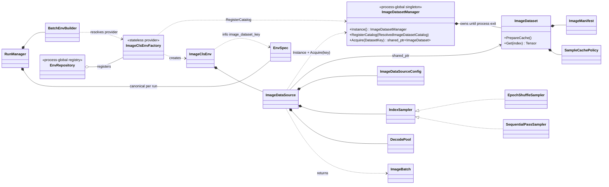
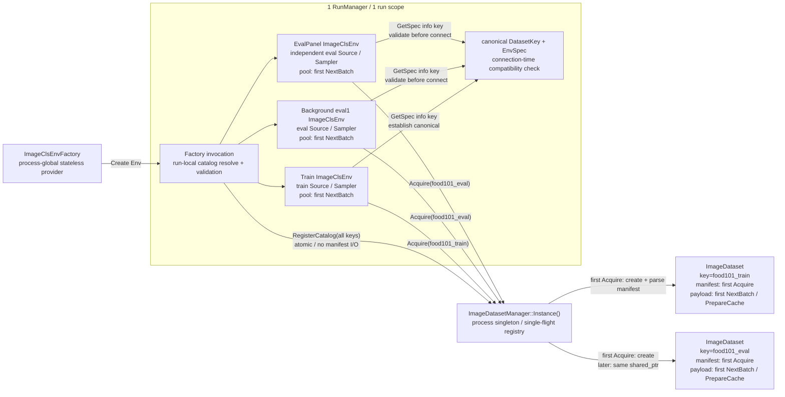

# ImageCls 専用 batch 入力コンポーネント / BatchEnv adapter

> 文書状態: 全判断確定（D1～D10解決済み、第12章決定経緯参照）・実装待ち。本書だけで外部設定、実行時契約、責務、所有権、決定経緯、実装範囲を確認できることを目的とする。
> 記載区分: **確定**＝実装仕様。旧区分の**基準案**（推奨設計）と**未決**（判断対象）は全D解決に伴い確定へ遷移済み。
> 既存 runner / observer / GUI との接続は、当面 `BatchEnv` interface を使う adapter として維持する。

## 1. 目的・対象読者・変更概要

### 1.1 対象読者

- 設定を作成・レビューする実験利用者
- ImageCls の Dataset / sampling / eval 契約をレビューする設計者
- Phase 0～2を実装する開発者
- 性能、再現性、互換性を検証するテスト担当者

### 1.2 背景

現行 ImageCls は `SingleDiscreteEnv` をN個生成し、`VectorizedDiscreteBatchEnv`または`ThreadPoolDiscreteEnv`でまとめている。各single envがtrain/evalの`ImageDataSource`を2本持ち、画像を1枚ずつdecodeしてからframework側でcollateするため、分類問題として不要なfan-out、manifest重複、decodeオーバーヘッドがある。configured evalもB=1かつランダム復元抽出で、評価件数と評価対象が分かりにくい。

本PRDの目的は、ImageClsをbatch-nativeな`BatchEnv`へ置き換え、次を実現することである。

- Dataset定義を`DatasetKey`で参照し、同一process内でmanifestとpre-augment cacheを共有する。
- mutableなsampler、RNG、augment、collate、decode poolはenv-localな`ImageDataSource`へ分離する。
- `ImageClsEnv`をreward / done / metricsに集中した薄いRL adapterにする。
- train/evalのsample列、augment、batch組立を明示的かつ再現可能な契約にする。
- evalを固定Bのbatchで駆動し、1評価点の対象件数と終端を設定から読めるようにする。

### 1.3 維持する外部contract

- [`037_env_instance_name_10prd.md`](037_env_instance_name_10prd.md)を本PRDより先に実装し、その完了状態をPhase 0開始時のbaselineとする。
- PRD 037で追加する人間向けの必須`name`、pure interfaceの`SingleDiscreteEnv::GetName()`、`BatchEnv::GetName()`、`BatchEnv::GetEnvName(lane_index)`と、`SingleDiscreteEnvBase`／`BatchEnvBase`による共通実装を、Builder改名、configured Eval移行、batch-native化の前後で維持する。
- PRD 037で追加する同一Run内のBatchEnv name一意性、reserved name preflight、生成成功済みnameのrun-local registry、重複時の`ANET_SYSTEM_ERROR`を、全Phaseで`RunManager`責務として維持する。
- observationは`grid[3,H,W] uint8`と`vector[1] int64`。batch化後は`grid[B,3,H,W]`と`vector[B,1]`。
- network境界の`float32 / 255`は変更しない。
- trainの`max_steps` episode、`episode_start`、既存Conv2d表示のcadenceを維持する。
- ImageCls actor / learner / network / checkpoint形式は変更しない。
- background evalのnetwork snapshot順序は本PRDで解決せず、[`999_background_eval_snapshot_ordering_10prd.md`](../999_background_eval_snapshot_ordering_10prd.md)で扱う。

### 1.4 変更の全体像

| 領域 | Before | After |
|---|---|---|
| Dataset設定 | `ImageClsEnv`直下にtrain/eval pathを混在 | `ImageDataset.[DatasetKey].*` catalog |
| Dataset実体 | single envごとにtrain/evalを生成 | process singleton `ImageDatasetManager`がkey単位で共有 |
| sampling | single envごとのランダム復元抽出 | env-local `IndexSampler`によるdataset cycle / eval window cursor |
| batch生成 | N envの結果をframeworkでcollate | `ImageDataSource::NextBatch`がfresh batchを生成 |
| cache | 無し | Dataset所有の`none / auto / full_ram` strategy |
| eval | B=1、`max_steps`件 | `eval_batch_size`とeval sampling設定によるpass |
| Env責務 | manifest、decode、augment、RL状態 | reward、done、metrics中心の薄いadapter |

## 2. 設定外部仕様

### 2.1 設定の解決単位

設定は次の3層へ分ける。

1. **Dataset catalog**: immutable data、resize、cache policyを`DatasetKey`ごとに定義する。
2. **env-local DataSource設定**: 使用する`DatasetKey`、augment、eval samplingを定義する。
3. **trainer / eval設定**: train/evalのB、起動頻度、background、actor cloneなどを定義する。

Datasetのpath、shape、cache policyをeval env prefixから直接上書きしない。eval envが変えられるのは参照する`dataset_key`とenv-localなSource設定だけである。同じデータを異なるcache policyで扱う場合は別`DatasetKey`を明示する。

### 2.2 ImageDataset設定

`ImageDataset.<field>`を全Dataset共通default、`ImageDataset.[<DatasetKey>].<field>`をkey固有overrideとして解決する。

| 状態 | 設定キー | 所有クラス | 適用範囲 | 既定値 | 必須条件 | validation | 実行時効果 | 旧設定からの変更 |
|---|---|---|---|---|---|---|---|---|
| 新規・移動 | `ImageDataset.root_dir` | `ImageDatasetConfig` | catalog共通default | なし | resolved値必須 | 空文字禁止。参照Dataset生成時にpathを診断可能な形へ正規化 | manifest相対pathのroot | `ImageClsEnv.root_dir`から移動 |
| 新規・移動 | `ImageDataset.list_txt_path` | `ImageDatasetConfig` | catalog共通defaultまたはkey固有 | なし | resolved値必須 | file open失敗はDatasetKeyとpath付きerror | 1 Datasetのsample list | train/eval別キーを1項目へ統合 |
| 新規・移動 | `ImageDataset.classes_txt_path` | `ImageDatasetConfig` | catalog共通default | なし | resolved値必須 | file open失敗、空class list、重複classをerror | class IDと`value_labels` | `ImageClsEnv.classes_txt_path`から移動 |
| 新規・移動 | `ImageDataset.suffix` | `ImageDatasetConfig` | catalog共通default | `.jpg` | 必須 | path組立後にdecode失敗をpath/index付きerror | list entryへ付けるsuffix | `ImageClsEnv.suffix`から移動 |
| 新規・移動 | `ImageDataset.image_width` | `ImageDatasetConfig` | Dataset shape | なし | 必須 | `>0`。非正値はerror | decode後のW、keyに紐づくimmutable contract | `ImageClsEnv.image_width`から移動。`-1`廃止 |
| 新規・移動 | `ImageDataset.image_height` | `ImageDatasetConfig` | Dataset shape | なし | 必須 | `>0`。非正値はerror | decode後のH、keyに紐づくimmutable contract | `ImageClsEnv.image_height`から移動。`-1`廃止 |
| 新規 | `ImageDataset.cache.mode` | `ImageDatasetConfig` | Dataset単位 | `auto` | 必須 | `auto / none / full_ram`以外error | pre-augment cache strategy | 旧PRDのEnv直下案からDatasetへ移動 |
| 新規・確定 | `ImageDataset.cache.max_bytes` | `ImageDatasetConfig` | Dataset単位 | `4294967296`（4GiB） | `auto/full_ram`で必須 | positive `uint64_t`、size積のoverflowをerror | full payload上限。`auto`のcap超過/alloc失敗はWARN 1回+none、明示`full_ram`はerror（[D9](#decision-d9)決定済み） | 小さいdatasetは自動cache、大きいdatasetは明示同意 |
| 新規 | `ImageDataset.[<DatasetKey>].*` | factoryのcatalog resolver / `ImageDatasetManager` | run-localなkey固有override兼key宣言 / process registry | 共通defaultを継承 | keyごとに1項目以上を明示 | unknown/empty keyは現在runのavailable keys付きerror。登録済み同名keyとのconfig差はfield付きerror | run-localに解決し、process identityとして登録するresolved config | 旧path比較による暗黙identityを廃止 |

`DatasetKey`はcase-sensitiveなopaque identifierとする。同一process・同一key・同一resolved `ImageDatasetConfig`は常に同じ`ImageDataset`を表し、異なるkeyはresolved configが同一でも統合しない。同一processで既存keyへ異なるresolved configを要求した場合は、既存値と要求値の差分を含めてfail-fastする。`ImageDataset.[key].*`が1項目以上存在することをkeyの明示宣言とし、共通`ImageDataset.*`だけから任意の未宣言keyを作ることはできない。

### 2.3 ImageDataSource / ImageClsEnv設定

共有しないSourceの設定は`ImageClsEnv.data_source.*`へ埋め込む（[D1](#decision-d1)で決定済み）。named `ImageDataSource.[key]` catalogは、複数Env種別で同一Source profileを再利用する具体例が出た時点で再検討する。

| 状態 | 設定キー | 所有クラス | 適用範囲 | 既定値 | 必須条件 | validation | 実行時効果 | 旧設定からの変更 |
|---|---|---|---|---|---|---|---|---|
| 新規・確定 | `ImageClsEnv.data_source.dataset_key` | `ImageDataSourceConfig` | env instance | なし | 必須 | 空/unknown keyはerror | Managerから取得するDatasetを選択 | train/eval list path指定をkey参照へ変更 |
| 移動・確定 | `ImageClsEnv.data_source.augment.enabled` | `ImageDataSourceConfig` | train Sourceのみ | `false` | 任意 | bool parse失敗をerror | train augment有効化 | `ImageClsEnv.augment.enabled`から移動 |
| 移動・確定 | `ImageClsEnv.data_source.augment.hflip_p` | `ImageDataSourceConfig` | train Sourceのみ | `0.5` | 任意 | `[0,1]` | horizontal flip確率 | 同名旧項目をSource配下へ移動 |
| 移動・確定 | `ImageClsEnv.data_source.augment.rrc_scale_min/max` | `ImageDataSourceConfig` | train Sourceのみ | `0.7 / 1.0` | 任意 | `0 < min <= max <= 1` | RandomResizedCrop面積比 | 同名旧項目をSource配下へ移動 |
| 移動・確定 | `ImageClsEnv.data_source.augment.rrc_ratio_min/max` | `ImageDataSourceConfig` | train Sourceのみ | `0.75 / 1.3333333` | 任意 | `0 < min <= max` | crop aspect ratio | 同名旧項目をSource配下へ移動 |
| 新規・確定 | `ImageClsEnv.data_source.eval_window.mode` | `ImageDataSourceConfig` | eval Sourceのみ | class default `full` | enabled configured evalはoverlayで明示 | `full / rotating`以外error。`full`で`size`指定はerror | eval windowの構成方式 | 旧案`eval_sample_mode`を改名。sentinel全廃（[D5](#decision-d5)決定済み） |
| 新規・確定 | `ImageClsEnv.data_source.eval_window.size` | `ImageDataSourceConfig` | `rotating`のみ | なし | rotating時必須、full時指定禁止 | `1 <= size <= eval_size`外はerror | 1 eval windowの正確なvalid sample数 | 旧案`eval_samples`を改名。B単位切上げ案は廃止（[D5](#decision-d5)決定済み） |
| 既存・意味明確化 | `ImageClsEnv.max_steps` | `ImageClsEnvConfig` | trainのみ | `100` | 必須 | `>0` | train episode / 可視化 / log cadence | eval終端には使用しない |

### 2.4 trainer、eval、backendの関連設定

| 状態 | 設定キー | 所有クラス | 適用範囲 | 既定値 | 必須条件 | validation | 実行時効果 | 旧設定からの変更 |
|---|---|---|---|---|---|---|---|---|
| 既存・意味明確化 | `train.seed` | `RunManager` | run全体 | `0` | run間再現では固定非0必須 | parse失敗error。0は既存どおりauto seed | resolved master seedを介したsampler/augment seedの起点。実seedと各domain seedを起動logへ記録（[D10](#decision-d10)決定済み） | stable named domain採用 |
| 既存・意味変更 | `train.num_envs` | `BatchEnvBuilder` | main train | code既定`1`、ImageCls実値`128` | `>0` | 非正値error | native ImageClsのtrain batch size B | N single env数からnative Bへ変わる |
| 既存・意味拡張 | `env.worker_threads` | `WorkerThreadResolver` | native decode pool | `-1` | 必須 | 正数または定義済みauto値のみ | decode worker数 | single wrapperに加えSourceでも利用 |
| 既存・意味拡張 | `env.worker_type` | `BatchEnvBuilder` / Source | native decode方式 | `0` (`AUTO`) | 必須 | `AUTO / SINGLE_THREAD / THREAD_POOL` | `AUTO`=B=1同期/B>1pool、`SINGLE_THREAD`=同期decode、`THREAD_POOL`=pool（[D8](#decision-d8)決定済み） | Source decodeへ意味拡張 |
| 既存・validation追加 | `env.device_type/index` | `BatchEnvBuilder` | Env Tensor device | `0 (CPU) / -1` | 必須 | native ImageClsは`0=CPU`のみ許可、非CPUはfail-fast（[D8](#decision-d8)決定済み） | native EnvのCPU uint8 obs contract | silent ignoreしない |
| 新規 | `train.eval.[tag].eval_batch_size` | `RunManager` | 当該eval env | core既定`1`、ImageCls eval1実値`128` | `>0` | 非正値error | eval batch size B | B=1 hard-codeを設定化（実値は[D6](#decision-d6)決定済み） |
| 既存・意味明確化 | `train.eval.[tag].interval` | `EpisodeEvalObserver` | eval trigger | `100`、ImageCls eval1実値`50` | `0`はdormant（宣言のみ） | `<0`はerror | learn step単位のtrigger。`0`は全Envで宣言検証+name予約のみ行い、runner/Env/actor/observerを生成しない（[D4](#decision-d4)決定済み） | disabled tagの無条件Env生成を廃止 |
| 既存 | `train.eval.[tag].run_mode` | `RunManager` | eval actor/env | `eval1` | 有効なRunMode | unknown値error | actorのnetwork種別等 | Env生成時にも利用（[D3](#decision-d3)決定済み） |
| 既存 | `train.eval.[tag].use_background` | `EpisodeEvalObserver` | eval実行方式 | `true` | 任意 | bool parse失敗error | foreground/background | 意味不変 |
| 既存・変更なし | `train.eval.[tag].clone_model` | agent / eval actor | network参照 | `true`、ImageCls eval1実値`false` | 任意 | bool parse失敗error | clone/live network | 034では変更しない |
| 既存・意味明確化 | `train.eval.[tag].env.data_source.dataset_key` | Env config overlay | enabled ImageCls eval | なし | `interval > 0`では明示必須 | empty/unknown keyはerror | eval Datasetを明示選択 | train keyの暗黙継承を禁止 |
| 既存 | `train.eval.[tag].env.*` | Env config overlay | eval env | なし | fieldごと | fieldごと | sampling等を上書き | Dataset定義そのものは上書き禁止 |
| 既存・変更なし | `train.eval_device_type/index` | eval actor | actor forward | common=`cuda/0` | 任意 | device validation | network forward device | env deviceとは別 |
| 既存・変更なし | `backend.deterministic_algorithms` | backend init | ATen演算 | 現行設定による | 任意 | 既存validation | deterministic algorithm選択 | 034では変更しない |
| 既存・変更なし | `backend.cudnn_deterministic` | backend init | cuDNN | 現行設定による | 任意 | 既存validation | cuDNN決定性 | 034では変更しない |
| 新規・確定 | `app.eval_panel.eval_config_tag` | `EvalPanelConfig` | native ImageClsのmanual EvalPanel Env | なし | ImageCls EvalPanel利用時必須 | tag存在、明示ImageCls dataset key/modeを検証。非ImageClsで明示時はfail-fast（[D7](#decision-d7)決定済み） | 使用する`train.eval.[tag]`を明示選択 | RunModeからtagを推測しない |
| 既存・関連 | `app.eval_panel.model_sync.mode` | `EvalPanel` | manual eval actor sync | `time` | 任意 | `shared / frame / time / episode` | model sync契機 | episodeは[D7](#decision-d7)で決定したeval window終端へ追従 |
| 既存・関連 | `app.eval_panel.model_sync.frame_interval` | `EvalPanel` | mode=`frame` | `30` | frame modeで`>0` | 非正値error | manual step数でsync | 意味不変 |
| 既存・関連 | `app.eval_panel.model_sync.time_interval_ms` | `EvalPanel` | mode=`time` | `10000` | time modeで`>0` | 非正値error | wall clockでsync | 意味不変 |
| 既存・関連 | `app.eval_panel.model_sync.episode_interval` | `EvalPanel` | mode=`episode` | `1` | episode modeで`>0` | 非正値error | eval window数でsync | [D7](#decision-d7)で決定したwindow終端に追従 |

`env.worker_threads`の既存値域は、正数=明示worker数、`-1`=`min(B, logical_cores-2)`、`-2`=B、`-3`=`logical_cores-2`、`-4`=`logical_cores`である。明示正数はBへclampせず指定を尊重する。`0`および未定義負数はfail-fastへ統一する。

### 2.5 旧設定からの移行

| 旧キー | 新キー | 移行規則 |
|---|---|---|
| `ImageClsEnv.root_dir` | `ImageDataset.root_dir`または`ImageDataset.[key].root_dir` | Dataset catalogへ移動 |
| `ImageClsEnv.train_list_txt_path` | `ImageDataset.[train-key].list_txt_path` | train用DatasetKeyを作る |
| `ImageClsEnv.eval_list_txt_path` | `ImageDataset.[eval-key].list_txt_path` | eval用DatasetKeyを作る |
| `ImageClsEnv.classes_txt_path` | `ImageDataset.classes_txt_path`またはkey固有値 | Dataset catalogへ移動 |
| `ImageClsEnv.suffix` | `ImageDataset.suffix`またはkey固有値 | Dataset定義へ移動 |
| `ImageClsEnv.image_width/height` | `ImageDataset.image_width/height`またはkey固有値 | Dataset shapeへ移動 |
| `ImageClsEnv.augment.*` | `ImageClsEnv.data_source.augment.*` | Source ownershipへ合わせる（[D1](#decision-d1)決定済み） |
| 旧PRDの`ImageClsEnv.cache.*` | `ImageDataset.cache.*` | 共有資源の設定へ移動 |
| 旧PRDの`eval_samples=all/N` | `eval_window.mode`＋`eval_window.size` | [D5](#decision-d5)で決定済み |
| train用DatasetKey作成後 | `ImageClsEnv.data_source.dataset_key = <train-key>` | main train Sourceから明示参照する |
| eval用DatasetKey作成後 | `train.eval.[tag].env.data_source.dataset_key = <eval-key>` | enabled eval tagごとに明示参照する |

旧キーと新キーの同時指定、または旧キーだけを使うsilent compatibility fallbackは設けない。Phase 2で`ImageCls.txt`を一括移行し、unknown/obsolete keyを診断可能にする。

### 2.6 設定解決順序

1. `ConfigManager`がinclude、`.$` AutoMerge、CLI overrideを既存どおり展開する。
2. ImageCls factoryがrun-local catalogとして`ImageDataset.[key].*` tagを列挙し、key宣言、既知field、型、enum、required resolved値をI/O無しで検証する。各keyのresolved configはC++ default → `ImageDataset.*` → `ImageDataset.[key].*`の独立chainで作る。
3. factoryは全key/configを`ImageDatasetManager::RegisterCatalog(resolved_catalog)`へI/O無しで一括登録する。Managerは全entryをpreflightし、同一keyの登録済みconfigと異なる場合はDatasetが未使用でもfail-fastする。conflict時は新規keyを1件も追加せず、全件同値またはconflict無しの場合だけatomic commitする。同一configの再登録はno-opとする。
4. Env生成時にSource configをC++ default → `ImageClsEnv.*` → configured evalの`train.eval.[tag].env.*`という別chainで解決する。
5. enabled ImageCls evalでは、overlay内の`data_source.dataset_key`とeval sample modeを明示指定させ、train base値の暗黙継承を禁止する。
6. Source constructorがresolved `dataset_key`をManagerの`Acquire(key)`へ渡す。Managerは登録済みconfigからDatasetを生成し、この時点でpath openとmanifest I/Oを行う。
7. Env prefixからDataset fieldを直接上書きしない。decode I/Oはそのindexの最初の`Get`まで遅延する。

手順6～7のmanifest / decode I/OのLazy境界は[D4](#decision-d4)で確定済みである。

上記Source config chainとキー名は[D1](#decision-d1)で確定した（option 1採用）。

`ConfigData::Read`は現行、型変換失敗時にWARN後defaultへ戻り得るため、本機能の明示設定では「キーが存在するのに型変換へ失敗した」場合を`ANET_SYSTEM_ERROR`にするvalidated readが必要である。

unknown / obsolete key監査は次のscopeへ分ける。

- ImageCls factoryのrun-local catalog resolverは`ImageDataset.*`と`ImageDataset.[key].*`の既知fieldを監査し、unknown DatasetKeyの診断にはprocess登録履歴ではなく現在runのavailable keysを使う。
- Env configは実際に解決するbase `ImageClsEnv.*`と選択eval prefixについて旧Dataset fieldの指定を検出し、旧新混在をerrorにする。
- AutoMerge後も残る未選択profile/templateはruntimeのactive config監査対象にせず、Phase 2のrepository全文検索で旧fieldを`ImageCls.txt`から除去する。

### 2.7 Food101完全設定例

以下は[D1](#decision-d1)のSource設定、[D5](#decision-d5)のeval window契約、[D7](#decision-d7)のEvalPanel routing、[D8](#decision-d8)のworker/device解釈（いずれも確定済み）を組み合わせた基準例である。`cache.max_bytes`は[D9](#decision-d9)で決定済み（既定4GiB＋train opt-in）。実eval mode / size / Bは[D6](#decision-d6)で決定済み（rotating 1024 / B=128）。

```ini
# Dataset catalog defaults
ImageDataset.root_dir = C:\dev\food-101\images
ImageDataset.classes_txt_path = C:\dev\food-101\meta\classes.txt
ImageDataset.suffix = .jpg
ImageDataset.image_width = 224
ImageDataset.image_height = 224
ImageDataset.cache.mode = auto
ImageDataset.cache.max_bytes = 4294967296

# DatasetKey definitions: 定義だけではmanifest/cacheを生成しない
ImageDataset.[food101_train].list_txt_path = C:\dev\food-101\meta\train.txt
ImageDataset.[food101_eval].list_txt_path = C:\dev\food-101\meta\test.txt

# train cache opt-in（D9決定済み）: train payload約10.6GiBを明示許可する。
# 2 epoch目以降のdecodeが消える代わりにhost RAMへ常駐する（eval約3.5GiBと合わせ約14GiB）。
# RAMが厳しいマシンではこの行を外す。既定4GiB capのままautoがWARN 1回でnoneへfallbackし、毎epoch再decodeになる。
ImageDataset.[food101_train].cache.max_bytes = 12884901888

# Main train env / env-local Source
ImageClsEnv.data_source.dataset_key = food101_train
ImageClsEnv.data_source.augment.enabled = true
ImageClsEnv.data_source.augment.hflip_p = 0.5
ImageClsEnv.data_source.augment.rrc_scale_min = 0.5
ImageClsEnv.data_source.augment.rrc_scale_max = 1.0
ImageClsEnv.data_source.augment.rrc_ratio_min = 0.75
ImageClsEnv.data_source.augment.rrc_ratio_max = 1.3333333
ImageClsEnv.max_steps = 100

train.seed = 1
train.num_envs = 128
env.worker_type = 0
env.worker_threads = -1
env.device_type = 0
env.device_index = -1
train.eval_device_type = cuda
train.eval_device_index = 0

# Configured eval1: 常用（D6決定: rotating 1024 / B=128）
train.eval.[eval1].interval = 50
train.eval.[eval1].run_mode = eval1
train.eval.[eval1].use_background = true
train.eval.[eval1].clone_model = false
train.eval.[eval1].eval_batch_size = 128
train.eval.[eval1].env.data_source.dataset_key = food101_eval
train.eval.[eval1].env.data_source.eval_window.mode = rotating
train.eval.[eval1].env.data_source.eval_window.size = 1024

# 節目用の厳密full評価。普段はdormant（D4により非生成・コストゼロ）、使う時だけintervalを正値へ
train.eval.[eval_full].interval = 0
train.eval.[eval_full].run_mode = eval1
train.eval.[eval_full].eval_batch_size = 128
train.eval.[eval_full].env.data_source.dataset_key = food101_eval
train.eval.[eval_full].env.data_source.eval_window.mode = full

# EvalPanel（D7決定済み。選択tagのrun_mode/env overlayを使用し、Bは1固定）
app.eval_panel.eval_config_tag = eval1
app.eval_panel.model_sync.mode = time
app.eval_panel.model_sync.time_interval_ms = 10000
```

### 2.8 metrics設定

```ini
metrics.scalar.[42_env/04_accuracy_mean]     = $env accuracy @train $exp_step
metrics.scalar.[42_env/05_accuracy_mean_ema] = $env accuracy @train $exp_step $ema ema_alpha:0.001
metrics.scalar.[42_env/07_epoch_count]       = $env epoch_count @train $exp_step interval:100
metrics.scalar.[51_eval1/03_accuracy]        = $eval.[eval1] $env accuracy @episode_end
metrics.scalar.[51_eval1/04_accuracy_ema]    = $eval.[eval1] $env accuracy @episode_end $ema ema_alpha:0.01
```

- trainの`accuracy`は直近に確定したepochの正解率。初回epoch完了前はNaN。
- evalの`accuracy`は直近eval windowの正解率。fullなら全件、subsetならそのwindowのvalid sampleを対象とする。
- `epoch_count`はtrainでは採点完了したdataset cycle数。evalではfull window完了、またはrotatingのdataset cycle完了で増加する（[D5](#decision-d5)決定済み）。
- `21_eval/01,02`の`$runner eps_total_reward`は削除する。代表lane方式では部分値となるためである。
- `20_eps/10,11`の`$runner train_episode_reward`は維持する。
- コメントアウト中の`42_env/02,03`（`mean.reward_sum`）はstreamキー廃止に合わせて削除する。

## 3. 外部動作仕様

### 3.1 Dataset catalogと共有

Dataset / manifest / payload / decode poolの生成時点は[D4](#decision-d4)で確定済みであり、以下がその境界である。

- catalogへDatasetを定義しただけではmanifest I/Oもcache allocationも行わない。
- factoryは全宣言keyとresolved `ImageDatasetConfig`をI/O無しの`RegisterCatalog`でsingleton Managerへatomic登録する。1件でも既存keyとのconfig conflictがあれば新規keyを残さない。Sourceが`Acquire(DatasetKey)`した時点で、同一process内の同一key/configに対する単一の`ImageDataset`を取得する。
- 同一keyへ異なるresolved configを要求した場合は、先行instanceを再利用せずfail-fastする。
- train、background eval、EvalPanelが異なるkeyを使えば別Dataset。同じeval keyを使えば同じmanifest/cacheを共有する。
- 同じkeyの同時初回要求はsingle-flightとし、partial objectを公開しない。
- 生成済みDataset/cacheはeviction/resetせずprocess終了まで保持する。既存keyに対応するconfigまたはDataset実ファイルをin-place変更した場合はprocessを再起動する。同一process中に更新版を併用する場合は、新directoryと新DatasetKeyで別Datasetとして登録する。
- ManagerとDatasetはthread-safe、Sourceはenv-local single-caller contractとする。

native ImageClsの`ImageClsEnv::GetSpec()`は、既存のgeneric metadata seamである`EnvSpec.info`へ`image_dataset_key=<DatasetKey>`を格納する。`RunManager`はmain train Envの`EnvSpec`とこのkeyをrun-localなcanonical `(DatasetKey, EnvSpec)`として保持し、configured eval / EvalPanelをAgent・runnerへ接続する前に次を一致させる。この検証stateはsingleton Managerへ持たせず、production codeでImageCls型への`dynamic_cast`を行わない。

- `class_names`の件数、文字列、順序
- gridのchannel数、H/W、dtype
- vectorのshape/dtype/class数
- action countと`value_labels`

native ImageClsなのに`EnvSpec.info["image_dataset_key"]`が無いか空の場合、およびeval/EvalPanel EnvSpecに不一致がある場合は、canonical key、requested key、最初に異なるfield/値を含めて接続前にfail-fastする。異なるDatasetKeyを使うこと自体は許可するが、同一Agent/networkへ接続できるspecでなければならない。非ImageCls Envはこのinfo keyを要求せず、従来のgeneric EnvSpec処理を維持する。

### 3.2 batch outputとstorage lifetime

- Sourceは固定Bの`grid[B,3,H,W] uint8`と`targets[B] int64`を生成する。
- Envはtargetsをcurrent batchの採点用に保持し、observation vectorへ`[B,1]`として公開する。
- `NextBatch`呼出しごとにgrid / targetsのfresh storageを生成し、返却後はimmutableとする。
- 後続Stepが過去のstate storageを上書きしない。
- `next_state`と`continue_state`は同じfresh observationを共有し、done / truncated / episode_startのflagだけを分けてよい。
- batch内の重複indexはdecode/cache lookupの重複作業を減らすためdedupeする。共有cacheの排他責任はDatasetにある。

### 3.3 train

- `EpochShuffleSampler`が全indexをpermutationし、StepごとにB件をconsumeする。
- epoch末尾の端数は次epoch先頭でwrap-fillする。sampleを捨てず、`data_size < B`でもBを維持する。
- [D10](#decision-d10)で確定したSource root seedからsampler streamとaugment streamを分離し、augment seedは`(augment_seed, epoch_tag, dataset_index)`からslot単位で導出する。
- episodeとepochは独立する。`max_steps`は可視化・ログ・EpisodeEndEventのcadenceであり、sampler cursorをresetしない。
- `accuracy`は最後に採点完了したepochのsnapshot。初回完了前はNaN。
- `epoch_count`はsampleを先読みした時点ではなく、そのepoch最後のsampleを採点した時点で増加させる。

### 3.4 eval

以下の`full / rotating`、exact size、padding、window終端は[D5](#decision-d5)で確定したcontractである。

- evalは`max_steps`を使わず、eval windowのtarget件数を採点したStepで終端する。
- window終了Stepでは代表lane 0だけ`done=true`にし、`EpisodeEndEvent`を1個だけ発火する。
- `RunEvaluationEpisode`は既存どおり`LastStepHadEpisodeEnd()`で停止できる。
- `accuracy`は1 eval windowのcorrect / valid totalをsnapshotする。
- fullまたはrotating windowの末尾はvalid-prefix paddingとし、pad laneをaccuracyと`n_transitions`から除外する。
- window終了Stepの`continue_state`は次eval windowの先頭batchを保持できる。cursor会計はcurrent batchのmetadataで行う。
- evalの`epoch_count`初期値は0。fullは全件windowを採点完了するごとに1増加し、rotatingはdataset streamの全indexを採点完了した時点で1増加する。
- rotating windowがdataset cycle境界を跨ぐ場合、current batchの採点によるcycle完了を反映してからwindow終了時のscalarを公開する。次window用`continue_state`の先読みでは増加させない。

### 3.5 reward、done、episode_start

- valid laneの`reward[i] = (action[i] == target[i]) ? 1.0f : 0.0f`。
- eval padding laneのrewardは0とする（[D5](#decision-d5)決定済み）。
- train episode境界ではterminal `next_state.episode_start=false`、auto-reset後`continue_state.episode_start=true`を維持する。
- trainの全B laneが同じ`max_steps`境界でdoneになる。evalは代表laneのみdone。
- eval window境界のterminal `next_state.done`はlane 0だけtrue、`truncated`と`episode_start`は全lane falseとする基準案。
- evalの`continue_state.done/truncated`は全lane false、`continue_state.episode_start`はlane 0だけtrueとする。他laneはepisode entityではなくbatch slotとして継続する。
- eval window終了Stepの`n_episode_end`は1。`n_transitions`はそのStepの`valid_count`とする。

### 3.6 cacheとdecode

- `NoCachePolicy`は毎回decodeし、同一indexについて値の同一性を保証するがstorage identityは保証しない。
- `FullRamCachePolicy`はDataset単位に`[N,3,H,W] uint8` payloadを持ち、pre-augment Tensorだけを保存する。
- `ImageDataSource::NextBatch`はdecode/cache taskをenqueueする前に、caller thread上で`ImageDataset::PrepareCache()`を同期呼出しする。呼出し時点は[D4](#decision-d4)、allocation失敗時の挙動（`auto`のみWARN 1回+none fallback）は[D9](#decision-d9)で確定済み。`none`ではno-op、`auto/full_ram`ではDataset-level single-flightによりpayload allocationを1回だけ確定する。
- 同一indexの初回同時fillはper-index one-time publishで1件だけ公開し、他callerは完了を待つ。
- publish後のentryはimmutable。
- cache entryは`Empty / Loading / Ready / Failed`相当のterminal stateを持つ。decode失敗時は全waiterを起こし、そのprocess lifetimeは同じindexへの後続要求へ同じ失敗を再送出して自動retryしない。
- wxImage handlerはrun/Datasetごとではなくprocess-wide `once`で、parallel decode開始前に初期化する。
- Sourceが投入する各decode taskはworker境界で例外を捕捉し、最初の`exception_ptr`とDatasetKey/index/path contextを保存し、成功失敗にかかわらずcompletion bookkeepingを完了する。
- `WaitAll`後にSource callerの`NextBatch`が保存例外を再送出する。一般`PinnedThreadPool`の例外機構は変更しないが、新worker内例外が握り潰されたり待機hangになったりせずAP停止へ到達することを034の契約とする。

### 3.7 再現性

- [D10](#decision-d10)で確定したdomainを前提に、同一Dataset内容、同一resolved master seed、同一resolved configでsample列、epoch tag、augment、batch組立がrun間一致する。literal `train.seed=0`はauto seedのためrun間一致の前提にしない。
- sampler RNGとaugment RNGは別streamとし、augment ON/OFFでsample順を変えない。
- train、configured eval tag、EvalPanelのroot seed domainは`imagecls/source/train`、`imagecls/source/eval/<tag>`、`imagecls/source/eval_panel/<tag>`のstable名で分離し、EvalPanelはconfigured evalから独立させる（[D10](#decision-d10)決定済み）。construction orderやworker順をseedへ含めない。
- decode taskのworker割当や完了順は結果へ影響させない。
- 旧N個single envのRNG列とのbit一致は保証しない。
- network演算の決定性はADR 0006、eval snapshotの時間的順序は999 PRDの責務である。

### 3.8 profiling

- `ImageClsEnv::Step`: `reward` / `next_batch` / `build_result`。
- `ImageDataSource::NextBatch`: `sample` / `decode_cache` / `augment` / `collate`。
- `ImageDataset::Get`: `cache_lookup` / `cache_fill` / `decode`。
- Dataset初回Ready / cache prepare時にDatasetKey、requested/effective cache mode、registered/ready Dataset数、process retained payload bytesをlogする。
- 通常フェーズは`ANET_PROFILE_SCOPE` / `ANET_PROFILE_SCOPE_NEXT`を使う。
- async decode workerだけは`ANET_PROFILE_SCOPE_FULL`で`ImageDataSource::NextBatch.decode`に準じるstableな完全名を使う。
- 軽量getterやper-element内側loopへscopeを置かない。

## 4. クラス別責務・所有権

### 4.1 一覧

| 要素 | 種別 | lifetime / scope | 所有するもの | 所有しないもの・禁止事項 |
|---|---|---|---|---|
| `DatasetKey` | Value Object | run-local catalogで宣言・解決 / 登録後はprocess identity | case-sensitive identity | path比較による暗黙coalesce、別runでの同名key/異config再利用 |
| `ImageDatasetConfig` | immutable config | `RegisterCatalog`後はprocess lifetime | resolved path、shape、cache policy | sampler、augment、env override |
| `ImageDatasetManager` | process singleton Manager | process lifetime | key/config registry、single-flight、生成済みDataset | sampler、RNG、augment、episode、run-local EnvSpec |
| `ImageDataset` | shared Entity | process内で共有 / process lifetime | manifest、decode、cache | cursor、epoch、augment RNG |
| `ImageManifest` | immutable Value | Dataset lifetime | paths、targets、class_names | decode、RNG |
| `SampleCachePolicy` | Strategy | Dataset lifetime | cache storage / lookup / publish | sampler、augment |
| `ImageDataSourceConfig` | immutable config | Env / Source | dataset key、augment、eval sampling | Dataset path/cache field |
| `ImageDataSource` | env-local Controller | 1 Env | sampler、RNG、augment、collate、decode pool | shared cache、RL metrics |
| `ImageBatch` | immutable result value | Reset/Step間 | grid、targets、epoch tags、valid metadata | mutable cursor |
| `IndexSampler` | env-local Controller | 1 Source | cursor、cycle、RNG | decode、cache、reward |
| `ImageClsEnv` | RL adapter | 1 runner Env | current batch、reward/done、metrics snapshot | manifest、cache、sampling algorithm |
| factory / RunManager | construction / run state | factoryはstateless、RunManagerは1 run | Env生成、run-local EnvSpec互換検証 | Dataset registry、cache ownership |

### 4.2 DatasetKey

- 外部設定のrun-local catalogで明示・解決するnon-empty string。`RegisterCatalog`後はprocess registryのidentityになる。
- case-sensitiveで、同一process内の同じkeyだけが同一identityとなる。別runでも同名keyへ異なるconfigを割り当てられない。
- 異なるkeyは同じpath、shape、cache設定でも別Dataset/cacheとして扱う。
- Dataset定義をprocess中にreloadしない。

### 4.3 ImageDatasetConfig

- C++ default、`ImageDataset.*`、`ImageDataset.[key].*`を順に解決したimmutable config。
- root、list、classes、suffix、W/H、cache mode/max bytesを持つ。
- config同値判定には全fieldを使い、augment、sampler、worker、seed等のSource-local設定を含めない。
- pathはabsolute化、separator統一、lexical normalizationを行い、Windowsではcase-insensitiveに比較する。I/O無しの`RegisterCatalog`を維持するためsymlink/junctionの実体解決は行わず、別aliasは異configとしてfail-fastしてよい。
- config parseとrequired field validationをDataset生成前に完了する。
- Env-specific prefixを受け取らない。

### 4.4 ImageDatasetManager

- Meyers singletonの`ImageDatasetManager::Instance()`としてprocess-globalに1個だけ生成する。
- `Instance()`はImageCls factory / Source経路だけから初回利用され、他Envでは生成・登録されない。ImageClsを使わないprocessの実質的なresource消費はない。
- APIは`RegisterCatalog(const ResolvedImageDatasetCatalog&)`と`Acquire(DatasetKey) -> shared_ptr<ImageDataset>`とする。
- `RegisterCatalog`はglobal mutex下で全entryをpreflightし、typed resolved configをfield-by-field比較する。path正規化後の同値ならno-op、最初の相違fieldがあればkey、登録値、要求値を含めてfail-fastする。hashだけで同値判定しない。
- preflight成功後だけ全新規entryをatomic commitする。manifest I/Oやcache確保は行わず、entryを`Registered`状態にするだけとする。
- entryはresolved configと`Registered / Loading / Ready / Failed`相当のstate、Datasetまたは`exception_ptr`を持つ。
- mutex下でkeyをlookupし、同一keyの初回生成をsingle-flightにする。manifest I/Oはglobal registry mutex外で行い、異なるkeyは並行生成できる。
- 成功時はprocess終了までstrong referenceを保持し、途中eviction/reset/reloadを行わない。
- 初期化失敗時はpartial instanceを公開しない。そのprocess/key/configのterminal failureとして保持し、同時waiterと後続`Acquire`へ同じ失敗を再送出する。自動retryはしない。
- catalogに存在するが未要求のkeyはDataset化せず、manifestをparseしない（[D4](#decision-d4)決定済み）。
- run-local catalog resolverが全keyのschema/typeを検証してManagerへ登録するが、未要求keyのDataset生成、file open、manifest parseは行わない。
- 未登録keyへの`Acquire`はprogramming/config errorとしてfail-fastする。available keysの利用者向け診断はrun-local catalog側で行う。

### 4.5 ImageDataset

- [D4](#decision-d4)で確定した生成時点と[D9](#decision-d9)で確定したcache contractに従い、immutable manifestとcache policyをconstructorで確定する。
- `PrepareCache()`はSource callerからworker task enqueue前に呼ばれ、Dataset-level payload allocationとpolicy確定をsingle-flightで行うthread-safe APIとする。呼出し時点は[D4](#decision-d4)、allocation失敗時の動作は[D9](#decision-d9)で確定済み。
- `Get(index)`は複数Sourceから同時に呼べるthread-safe APIとする。
- 同一key/indexに対して同じpre-augment値を返す。
- cache hit時に返すTensorはread-only。Sourceはfresh batchへcopyしてからaugmentする。
- manifestと画像fileの内容がprocess中に変更されないことを値の一貫性と再現性の前提とする。
- disk変更の自動検出や全画像hash検証は行わない。`none`の再decodeと`full_ram`の未fill entryへ新bytesが混ざるため、in-place更新は禁止する。

### 4.6 ImageManifest

- `classes.txt`と単一の`list.txt`をparseする。
- `paths`、per-image `targets`、per-class `class_names`を保持する。
- malformed line、class separator欠落、unknown class、空sample list、空/重複classをfail-fastする。
- errorにはDatasetKey、list行番号、class名、pathを可能な範囲で含める。
- `class_names`はEnvSpecの`value_labels`供給元になる。

### 4.7 SampleCachePolicy

- `NoCachePolicy`と`FullRamCachePolicy`を実装する。
- `auto`はDataset生成時にpayload推定値から候補strategyを決め、最初のDataset-level prepareで上記いずれかへ一度だけ確定するmodeであり、独立policy classである必要はない。allocation失敗時は`auto`のみWARN 1回で`none`へfallbackし、明示`full_ram`はerrorとする（[D9](#decision-d9)決定済み）。
- Dataset-level prepareは`Unprepared / Preparing / Ready / Failed`相当のsingle-flight stateを持つ。異なるindexへの同時初回`Get`もallocation/fallback完了を待ち、Failedはprocess lifetimeでterminalとする。
- cache keyはDataset内index。augment済み画像を保存しない。
- bounded LRUは非復元epoch samplingでhit率が低く、再現可能な復元も複雑なため不採用。
- `MmapCachePolicy` / `PreprocessedFileCachePolicy`はfuture seamのみ。

### 4.8 ImageDataSourceConfig

- `ImageClsEnv.data_source.*`から構築する（[D1](#decision-d1)で決定済み）。
- DatasetKey、augment config、eval sampling configを持つ。
- batch size、生成時RunMode（[D3](#decision-d3)決定済み）、Source root seed（[D10](#decision-d10)決定済み）、worker config（[D8](#decision-d8)決定済み）はconstruction contextから受け取る。
- Dataset path、shape、cache policyは持たない。

### 4.9 ImageDataSource

- 1 Envに1 instanceを所有し、同一Sourceへの並行`NextBatch`はサポートしない。
- run-local catalogで検証済みのDatasetKeyを`ImageDatasetManager::Instance().Acquire(key)`へ渡してDatasetを取得し、`shared_ptr`を保持する。
- batch sizeとroleはconstruction時に固定し、APIは`NextBatch()`とする（[D3](#decision-d3)決定済み。旧案`NextBatch(B, mode)`は廃止）。
- Source自身が専有するSamplerからindex/epoch metadataを取得する。
- Source root seedからsampler / augmentの独立streamを作り、mutable RNG stateを他Sourceと共有しない。
- [D4](#decision-d4)で確定した契約と[D9](#decision-d9)に従い、最初のdecode/cache taskをenqueueする前にcaller threadからDatasetの`PrepareCache()`を同期呼出しし、完了後にだけworkerへ`Get(index)`を投入する。
- batch内dedupe後にunique indexをdecode/cache lookupし、slotごとにaugmentしてfresh Tensorへcollateする。
- [D4](#decision-d4)で確定した最初の`NextBatch`時点で、[D8](#decision-d8)で決定したworker_type解釈（AUTO=B=1同期/B>1pool）に従いpoolをlazy生成し、`Shutdown`とdestructorのStop/joinをidempotentにする。同期decodeではpoolを生成しない。
- construction時の`Acquire`後はManagerを保持せず、取得したDatasetの`shared_ptr`だけを保持する。
- decode taskをSource-local wrapperで囲み、例外保存とcompletion通知を保証する。`NextBatch`はworker失敗をcaller threadへ再送出する。

### 4.10 ImageBatch

[D5](#decision-d5)で確定したexact size / padding契約では、`NextBatch`の戻り値にgrid/targetsだけではepoch accuracy、padding、eval終端を実装できないため、次のmetadataを持つ内部valueとする。

| field | shape / type | 用途 |
|---|---|---|
| `grid` | `[B,3,H,W] uint8` | observation |
| `targets` | `[B] int64` | reward、vector observation |
| `epoch_tags` | B件 | slotが属するdataset cycle |
| `valid_count` | `0 < n <= B` | valid-prefix、`n_transitions` |
| `window_end` | bool | Bで割り切れる場合を含むeval window終端 |

`dataset_indices[B]`はdedupeとaugment seedに必要だが、Envへ公開せずSource内部metadataに留めてもよい。EnvはResetで取得したcurrent batchのtargets/metadataをStepまで保持し、current actionを採点してからnext batchを取得する。

### 4.11 IndexSampler各実装

- `IndexSampler`はindex、epoch tag、valid metadataを返すinterface。
- `EpochShuffleSampler`はtrainとrotating windowで使用し、permutation、cursor、cycle、RNGを持つ。
- `SequentialPassSampler`はfull evalでindex 0から順に返し、末尾をvalid-prefix paddingする。
- data sizeよりBが大きい場合、1 batch内に複数cycleが入り得るため、単一`wrapped` boolではなくslot単位epoch tagを使う。
- sampler stateを異なるEnv/Source間で共有しない。

### 4.12 ImageClsEnv

- `BatchEnvBase`を直接継承して`BatchEnv` interfaceを実装し、`DiscreteBatchEnvBase`のN env fan-outを使わない。
- Sourceからbatchを受け、BatchStateへ変換する。
- `GetSpec()`の`info["image_dataset_key"]`へSourceが参照するDatasetKeyを格納し、generic interfaceだけでrun-local互換検証できるようにする。
- current targets/metadata、train episode counter、accuracy accumulator/snapshot、epoch_countを持つ。
- `GetScalar`はglobal `accuracy`と`epoch_count`だけを返す。不明キーとprefix付きglobalキーは`ANET_SYSTEM_ERROR`。
- `GetTensor` / `GetTensorVector`は`nullopt`。
- Source/Dataset/cacheの詳細をmetrics APIへ漏らさない。

### 4.13 factory / RunManager

- `ImageClsEnvFactory`は登録用のstateless providerとして扱い、Dataset registryを兼務しない。
- factoryはresolved Env/Source config、B、Source seed（[D10](#decision-d10)決定済み）、生成時RunMode（[D3](#decision-d3)決定済み）を使ってEnvを生成する。
- factoryはrun-local catalogを`ImageDatasetManager::Instance().RegisterCatalog(...)`し、`ImageDataSource`はkeyだけで`Acquire(...)`する。Manager注入用session/contextは設けない。
- main train Envの`EnvSpec.info["image_dataset_key"]`とEnvSpec本体をcanonicalとして`RunManager`に保持し、後続eval/EvalPanelを接続する前にrun単位で互換性を検証する。非ImageClsへこのinfo keyを要求しない。
- run shutdownでは全train/eval/EvalPanel Sourceのpoolをstop/joinしてEnvを解放する。ManagerとDataset/cacheは解放せずprocess終了まで保持する。

## 5. クラス図

> Manager singletonは[D2](#decision-d2)、Env生成時のRunMode伝達は[D3](#decision-d3)で決定済みである。



factoryはrun-localにresolveした全Dataset configをsingleton Managerへ`RegisterCatalog`でatomic登録する。Sourceはconstructor中に`Acquire(key)`を1回だけ行い、その後はDatasetの`shared_ptr`だけを保持する。run-localなのはcatalog解決、canonical `(DatasetKey, EnvSpec)`互換検証、Source、Sampler、RNG、episode stateであり、Dataset registry/cacheではない。

## 6. コミュニケーション図

> Manager singleton（[D2](#decision-d2)）、Env生成時RunMode（[D3](#decision-d3)）、EvalPanelのconfig tag選択（[D7](#decision-d7)）は決定済みである。



- 基準案ではtrainとevalは異なるDatasetKeyなので別Dataset/cacheを持つ。
- [D7](#decision-d7)の決定により、background evalとEvalPanelは明示的に同じconfig tagのeval keyを選べ、その場合Dataset/cacheを共有する。
- 3つのSource、Sampler、cursor、RNGはそれぞれ別instanceであり、decode poolは最初の`NextBatch`で生成する（[D4](#decision-d4)決定済み。方式は[D8](#decision-d8)で決定したworker_type解釈に従う）。
- catalogに定義されてもAcquireされないDatasetKeyは生成しない（[D4](#decision-d4)決定済み）。
- Managerと生成済みDataset/cacheはrun scopeの外にあり、process終了まで保持する。同一keyへ異なるresolved configを要求するとfail-fastする。

## 7. 詳細設計・現行コード制約

### 7.1 現行コードで確認済みの事実とPhase 0 baseline

> 行番号は本PRDレビュー時のworking tree基準。以下のコード参照はPRD 037実装前の事実なので、旧名`DefaultBatchEnvFactory`等をそのまま記す。一方、本PRDの実装はPRD 037完了後をbaselineとし、そこで追加済みのname契約を既存仕様として扱う。

#### seam / factory / config

- `EnvRepository`は`unordered_map<string, shared_ptr<SingleDiscreteEnvFactory>>`を持つprocess-global registryである（[`env.hpp:92`](../../../core/anet-core/include/anet/env.hpp:92)、[`env.cpp:640`](../../../core/anet-core/src/env.cpp:640)）。
- PRD 037実装前の`DefaultBatchEnvFactory`はclass_idでsingle factoryを取得し、N個のsingle envをVectorizedまたはThreadPool wrapperへ入れる（[`env.cpp:599`](../../../core/anet-core/src/env.cpp:599)）。specialized batch分岐とconfig prefixはない。PRD 034 Phase 0のbaselineでは旧top-level `BatchEnvFactory::CreateBatchEnv(name, seed, num_envs)`としてnameを受け取る。
- 現行`BatchEnvFactory` interfaceの実装は`DefaultBatchEnvFactory`だけで、trainerはconcrete `unique_ptr<DefaultBatchEnvFactory>`を保持している（[`rl.hpp:644`](../../../core/anet-core/include/anet/rl.hpp:644)、[`trainer.hpp:230`](../../../core/anet-core/include/anet/trainer.hpp:230)）。
- configured evalは`single_env_factory`を取り出し、B=1の`VectorizedDiscreteBatchEnv`を直接生成する。env override prefixは`train.eval.[tag].env`（[`trainer.cpp:793`](../../../core/anet-core/src/trainer.cpp:793)、[`trainer.cpp:817-818`](../../../core/anet-core/src/trainer.cpp:817)）。PRD 037でこのdirect経路へ`name=tag`を追加済みであることをPhase 0 baselineとする。
- `RunManager::CreateEvalRunner`が作るEvalPanel用EnvはB=1、config prefix無し（[`trainer.cpp:867-874`](../../../core/anet-core/src/trainer.cpp:867)）。PRD 037完了後は生成呼び出しに`name=EvalPanel`を渡す。
- `RunnerFrame`はEvalPanel runnerのRunModeを`Eval1`へ固定し、clone有無を`model_sync`設定から渡す（[`RunnerFrame.cpp:259-260`](../../../apps/runner/src/RunnerFrame.cpp:259)）。[D7](#decision-d7)の決定によりconfig tagを導入し、この`Eval1`固定は撤去してselected tagの`run_mode`と二重管理しない。
- env登録の実経路は`Init*()`だが、GridMaze / LunarLander / CartPole / DropMergeは`ANET_REGISTER_ENV_FACTORY`によるstatic登録も持ち、同一class_idへ二重登録される。現行registryは上書きするため顕在化していない。
- `ResolveWorkerThreads`のinstance状態依存は`config_.worker_threads`のみで、`GetLogicalCores`は無状態（[`env.cpp:558-591`](../../../core/anet-core/src/env.cpp:558)）。
- `Config`はdefault prefixを読んだ後にoverride prefixで上書きできる（[`config.hpp:151-183`](../../../core/anet-core/include/anet/config.hpp:151)）。
- `ConfigManager::AutoMerge`は`.$`を展開してから利用側へ`ConfigData`を渡す（[`config.cpp:617-682`](../../../core/anet-core/src/config.cpp:617)）。
- `ConfigData::MakeSubConfigData`はtag配下だけを切り出し、`ImageDataset.*`の共通defaultを自動mergeしない（[`config.cpp:319-349`](../../../core/anet-core/src/config.cpp:319)）。Dataset config解決にはfull `ConfigData`とdefault/override prefixを使う必要がある。
- generic `EnvSpec`は`map<string, string> info`を既に持つ（[`rl.hpp:280-284`](../../../core/anet-core/include/anet/rl.hpp:280)）。native ImageClsのDatasetKeyを共通interface越しに運ぶため、この既存metadata seamを使える。

#### learner / runner / storage lifetime

- `ImageClsLearner::UpdateFromBatch`は`experiences.state.obs`のgridとvector/targetsだけを使用し、rewardとnext stateを学習へ使わない（[`image_cls_agent.cpp:316`](../../../core/anet-core/src/image_cls_agent.cpp:316)、[`image_cls_agent.cpp:329,348`](../../../core/anet-core/src/image_cls_agent.cpp:329)）。
- `PipelineTrainRunner`はDoStep冒頭で前回learnを待ち、次learnを1-thread poolへenqueueした後、learnの裏でenv.Stepを実行する（[`trainer.cpp:546`](../../../core/anet-core/src/trainer.cpp:546)、[`trainer.cpp:587`](../../../core/anet-core/src/trainer.cpp:587)、[`trainer.cpp:625-633`](../../../core/anet-core/src/trainer.cpp:625)）。critical pathは概ね`max(decode, learn)`となる。
- `prev_exp_`はenv.Step後にstateとnext stateをcloneし、その後stateをcontinue stateへ進める（[`trainer.cpp:642-654`](../../../core/anet-core/src/trainer.cpp:642)）。Sourceが返却済みstorageを再利用しないfresh Tensor契約なら、このclone timingへ依存せず安全である。
- wrapperの`getStepResult()`は毎Step resultを新規確保しており、現行ではcontinue stateのbuffer aliasingは起きない（[`env.cpp:196`](../../../core/anet-core/src/env.cpp:196)）。
- `AccumulateAndNotifyEpisodeEnd`は`done | truncated`をlaneごとに調べ、終了laneごとに`EpisodeEndEvent`を発火する（[`trainer.cpp:111-166`](../../../core/anet-core/src/trainer.cpp:111)）。
- `PinnedThreadPool`は`Enqueue(worker_id, fn)`と`WaitAll()`を持ち、現行`ThreadPoolDiscreteEnv`でper-env並列に使われている（[`thread.hpp:64`](../../../core/anet-core/include/anet/thread.hpp:64)、[`env.cpp:475`](../../../core/anet-core/src/env.cpp:475)）。

#### eval driving / metrics

- `EpisodeEvalObserver::OnLearn`がintervalごとにevalを起動する（[`observers.cpp:539`](../../../core/anet-core/src/observers.cpp:539)）。
- `RunEvaluationEpisode`は`Sync()`後、`LastStepHadEpisodeEnd()`がtrueになるまでDoStepを繰り返す（[`observers.cpp:514-519`](../../../core/anet-core/src/observers.cpp:514)）。1 laneでも終端すればeval windowが終了する。
- background evalは前回jobが残っていれば次triggerで完了を待つため、nominal intervalが同じでもwindow時間は実際の記録間隔とtraining throughputへ影響し得る（[`observers.cpp:531-557`](../../../core/anet-core/src/observers.cpp:531)）。
- `MetricsLogEpisodeEndObserver`はEpisodeEndEventごとにenv全体のscalarを記録するため、1 windowでB eventを出すと同じaccuracyとEMAがB回前進する。evalで代表laneだけdoneにする理由である。
- ImageClsのagent側にはupdateごとのtrain `accuracy @learn`が既にある。env側accuracyは直近epoch snapshotとして意味を分ける。
- 全既存configのwrapper env scalar参照はprefix付きで、`DiscreteBatchEnvBase::GetScalar`の無prefix WARN+mean fallbackの使用実績はない。

#### ImageCls data / view / tests

- 現行`ImageDataSource`は`torch::data::datasets::Dataset`を継承するがDataLoader利用箇所はなく、`get()`をEnvが直接呼ぶ（[`ImageData.hpp:19`](../../../core/envs/imagecls1/src/ImageData.hpp:19)、[`ImageClsEnv.cpp:100`](../../../core/envs/imagecls1/src/ImageClsEnv.cpp:100)）。
- classes/list parseはmalformed lineとunknown classをsilent skipする。`labels_`はper-image class ID、`classes_`はper-class nameである（[`ImageData.hpp:56-87`](../../../core/envs/imagecls1/src/ImageData.hpp:56)）。
- 現行samplingは`RandUint64() % size`によるランダム復元抽出で、epochはない（[`ImageClsEnv.cpp:99`](../../../core/envs/imagecls1/src/ImageClsEnv.cpp:99)）。
- augmentはEnv内でtrainだけに適用される（[`ImageClsEnv.cpp:105-107`](../../../core/envs/imagecls1/src/ImageClsEnv.cpp:105)）。
- 現行Env constructorはtrain/eval Sourceを常に2本生成し、N single envで2N本になる（[`ImageClsEnv.cpp:41-52`](../../../core/envs/imagecls1/src/ImageClsEnv.cpp:41)）。
- `ImageClsView`はexperienceのbatch[0]を表示し、class labelはEnvSpecの`value_labels`を使う（[`ImageClsView.cpp:245-260`](../../../core/envs/imagecls1/src/ImageClsView.cpp:245)）。
- ImageClsはAuxDataを表示・学習・metricsで消費しておらず、`GetAuxDataList`を使う既存実装はLunarLander / DropMergeである。native ImageClsは空auxのPlain batch resultを利用できる。
- 既存testはterminal `next_state.episode_start=false`、auto-reset後`continue_state.episode_start=true`を要求する（[`ImageClsEnv_test.cpp:182`](../../../core/envs/imagecls1/src/ImageClsEnv_test.cpp:182)）。
- ImageClsの既存testはconcrete Env / specを直接生成し、EnvRepositoryの登録状態へ依存しない。
- Food101 active configは224x224、train 75,750件、eval 25,250件、train B=128、eval interval=50である。

### 7.2 C0: Factory seam / repository / Manager singleton

#### 確定しているseam

- `EnvRepository`は1本のまま、値を`std::variant<shared_ptr<SingleDiscreteEnvFactory>, shared_ptr<BatchEnvFactory>>`にする。
- class_idごとにsingle XOR batchを排他登録し、二重登録はkeyと型を含むWARN後にthrowする。
- fail-fast導入前に`ANET_REGISTER_ENV_FACTORY`の使用4箇所と使用ゼロになるmacro定義を削除し、`Init*()`登録へ一本化する。
- 現行の単一実装`BatchEnvFactory` interfaceを削除し、`DefaultBatchEnvFactory`をconcrete `BatchEnvBuilder`へ改名する。
- 空いた`BatchEnvFactory`名はper-class batch factory interfaceとして再利用する。
- PRD 037の必須`name`を旧top-level factoryからBuilderと新per-class factoryの両方へ引き継ぐ。`name`と生成時`RunMode`（[D3](#decision-d3)決定済み）の両方を必須引数とする。
- BatchEnv nameの一意性検証と`name -> owner説明` registryは`RunManager`に残す。Builder、新旧factory、single wrapper、batch-native Envへregistryまたはowner情報を持たせない。
- `PlainBatchResetResult` / `PlainBatchStepResult`を、空`GetAuxDataList`を返す最小concrete resultとして追加する。
- eval Env生成もBuilder経由にし、config prefixと`eval_batch_size`を渡す。

#### Manager singletonとEnv生成API

`ImageDatasetManager`は[D2](#decision-d2)でprocess singletonと決定した。登録済み`ImageClsEnvFactory`はstateless providerのまま、Env生成時にrun-local catalogをresolve/validateしてsingletonへ全key/configを`RegisterCatalog`でatomic登録する。Manager注入用session/contextは追加しない。Env生成APIへは`name`と生成時`RunMode`を渡す（[D3](#decision-d3)決定済み）。

Phase 0は、旧top-level `BatchEnvFactory::CreateBatchEnv(name, seed, num_envs)`を維持したまま`DefaultBatchEnvFactory`を`BatchEnvBuilder`へ改名する。改名直後のAPIは次とする。

```cpp
BatchEnvBuilder::CreateBatchEnv(
    const std::string& name,
    std::optional<seed_t> seed,
    int num_envs);
```

Phase 1では、Builderと新per-class factoryの両seamへ必須`name`と生成時`RunMode`を通す（[D3](#decision-d3)決定済み）。概念APIは次のとおりである。

```cpp
BatchEnvBuilder::CreateBatchEnv(
    const std::string& name,
    std::optional<seed_t> seed,
    int num_envs,
    RunMode run_mode,
    const std::string& config_prefix);

BatchEnvFactory::CreateBatchEnv(
    const ConfigData& config_data,
    const torch::Device& device,
    const std::string& name,
    std::optional<seed_t> seed,
    int num_envs,
    RunMode run_mode,
    const std::string& config_prefix);
```

Builderは`name`を加工・解析せず、single factory経路ではwrapperへ、batch-native経路ではper-class `BatchEnvFactory`へそのまま転送する。single wrapperだけが`<name>[lane_index]`を完成させ、batch-native Envは受け取ったnameを共通`BatchEnv`基底へ渡す。configured Evalは`name=tag`と`config_prefix=train.eval.[tag].env`を別引数として渡す。EvalPanelは`name=EvalPanel`を維持し、[D7](#decision-d7)で選ぶconfigured Eval tag、その`RunMode`、config prefixとは分離する。

[D3](#decision-d3)の決定により、Envの役割は生成時に固定し、`BatchEnv::Reset` / `Step`および`SingleDiscreteEnv::Reset` / `Step`から実行時`RunMode`引数を撤去する。`SingleDiscreteEnvBase` / `BatchEnvBase`が`name`と同じパターンで生成時RunModeを保持して`GetRunMode()`を公開し、`SingleDiscreteEnvFactory::CreateSingleEnv`にもRunModeを追加する。既存Envの実行時mode分岐はCartPoleのeval初期状態固定のみで、保持RunMode参照へ置換して挙動を変えない。EvalRunnerの`Reset(run_mode_)` / `Step(action_info, run_mode_)`は無引数呼出しへ簡素化する（actor network選択用の`run_mode_`保持は継続）。これにより誤modeでのReset/Stepというバグクラスは、実行時検証ではなく引数の不存在によって構造的に消滅する。

PRD 037完了後の`RunManager`は、固定名`train`、全configured Eval tag、固定名`EvalPanel`を最初のBatchEnv構築前にcase-sensitiveで一括検証する。生成成功済みnameはrun-local registryへ登録し、`CreateEvalRunner(name, ...)`を含む重複要求を第二のEnv構築前に`ANET_SYSTEM_ERROR`とする。本PRDのconfigured Eval Builder移行後も検証順、error contract、既存runnerを上書きしない契約を変えず、Builder呼び出しは検証済みnameを受け取るだけとする。

#### クラス命名

| Before | After / 基準案 | 種別 | 概要 |
|---|---|---|---|
| `BatchEnvFactory`（旧top-level IF） | 削除 | 削除 | concrete保持される単一実装の死んだ抽象 |
| `DefaultBatchEnvFactory` | `BatchEnvBuilder` | 改名 | config、EnvRepository lookup、wrap strategyでBatchEnvを組む上位層。name registryは持たない |
| `SingleDiscreteEnvFactory` | 同左 | 温存 | per-class single factory |
| 旧名の空き | `BatchEnvFactory` | 新規IF | per-class batch factory |
| なし | `WorkerThreadResolver` | 新規mixin | worker数の既存heuristicを共有 |
| `ImageClsEnv`（Single） | `ImageClsEnv`（Batch） | 作り替え | native batch Env |
| `ImageClsEnvFactory`（Single） | `ImageClsEnvFactory`（Batch provider） | 作り替え | catalog validation / singleton登録 / Env生成 |
| `ImageClsResetResult` / `ImageClsStepResult` | 削除 | 削除 | aux未使用の旧single result |

### 7.3 C1: Dataset catalog / Manager / Source

- `ImageClsEnvFactory`はrun-local Dataset catalogをresolve/validateし、全key/configをsingletonへ登録する。
- `ImageDatasetManager`はprocess-wide config/instance registryを担当する独立singletonとする。
- Managerは同一key/configへrunを跨いで同じ`shared_ptr<ImageDataset>`を返し、同一key/異configはfail-fastする。
- `ImageDataset`はimmutable manifest、decode、pre-augment cacheを所有する。
- `ImageDataSource`はenv-localで、共有Dataset、専有Sampler、augment、collate、decode poolを組み合わせる。
- `ImageManifest`は単一listとclassesをparseし、`paths / targets / class_names`へ名称を統一する。
- `torch::data::datasets::Dataset`基底は撤去する。
- `DecodeResizedImage`はRNGを持たないfree functionとする。
- `ApplyTrainAugment`はseedを明示引数に持つfree functionへ移す。
- Source configの形は[D1](#decision-d1)、Source API（`NextBatch()`）とRunModeの生成時固定は[D3](#decision-d3)で確定済み。

### 7.4 C2+C3: parallel decode / cache / fresh Tensor

- prefetch queueは作らない。`NextBatch`はEnv.Step内で実行し、既存PipelineTrainRunnerのlearn overlapへ乗せる。
- SamplerがB slot分のindex/epoch tagを確定し、同一batch内の重複indexをdedupeする。
- [D4](#decision-d4)で確定した境界では、`NextBatch` callerがDatasetの`PrepareCache()`を同期実行し、payload allocation / `auto` fallback（[D9](#decision-d9)）の確定後にだけdecode/cache taskをworkerへenqueueする。worker task自身はFull RAM payloadを確保しない。
- unique indexをdecode/cache lookupした後、slotごとにaugmentしてfresh outputへcollateする。
- `data_size < B`またはcycle境界で同じindexが異なるepoch tagを持つ場合、raw decodeは共有できてもaugment結果は別になり得る。
- `FullRamCachePolicy`はDatasetごとにpayloadを1本持ち、per-index one-time publishで異なるEnvからの同時fillを保護する。
- [D9](#decision-d9)の決定どおり、`auto`だけが`full_ram / none`を自動選択し、明示`full_ram`をcap超過で黙ってnoneへ変えない。
- Food101 224x224 uint8 payloadはtrain約10.6GiB、eval約3.5GiB。ImageNet-1K trainは約180GiB、valは約7GiBの目安である。
- outputは毎回fresh Tensorとし、double-buffer / ping-pong storageは使わない。
- profilingは3.8のstable name contractへ従う。

### 7.5 C4: ImageClsEnv

- `BatchEnv`を直接実装し、N個の`SingleDiscreteEnv`を内包しない。
- 生成時に受け取った`name`とBを`BatchEnvBase`へ渡し、Baseが`final override`する`GetName()` / `GetEnvName(lane_index)`を使用する。`GetName()`は生成時name、`GetEnvName(i)`は全`0 <= i < B`で`<name>[i]`となり、範囲外はfail-fastする。`ImageClsEnv`はlane name accessorを独自実装しない。
- GetSpec / GetBatchSpec / GetDeviceは従来のobs/action semanticsをbatchへ拡張する。
- `GetSpec()`は`info["image_dataset_key"]`へcase-sensitive DatasetKeyを格納する。`RunManager`は共通`BatchEnv::GetSpec()`だけでkeyを取得し、ImageCls型への`dynamic_cast`を行わない。
- ResetはSourceからcurrent batchを取得する。
- Stepはcurrent targetsとactionを採点し、accuracy/cycle会計を更新してからnext batchを取得する。
- trainではglobal step counterが`max_steps`へ達したStepで全laneをdoneにする。cursorは継続する。
- evalではeval window完了時にlane 0だけdoneにする。
- `GetScalar("accuracy")`は直近確定cycle/window snapshot、`GetScalar("epoch_count")`は完了cycle数を返す。
- 上記以外のglobal key、`mean.accuracy`等のprefix付きglobal keyは`ANET_SYSTEM_ERROR`。
- wrapper向け`DiscreteBatchEnvBase::GetScalar`の無prefix WARN+mean fallbackもPhase 0で`ANET_SYSTEM_ERROR`へ変更する。既存利用がないため挙動不変の整理とする。

### 7.6 C5: batched eval

- full evalは`SequentialPassSampler`で毎window index 0から全件を評価する。
- subsetはeval専用seedを持つ`EpochShuffleSampler`のcursorをeval呼出し間で継続する。
- fixed subsetは同じ画像だけを評価し続けるため採用しない。
- 1 eval windowで1個だけEpisodeEndEventを出し、`$env accuracy`を1回記録する。
- `$runner eps_total_reward`は代表laneの部分値となるためeval metricから外す。
- exact size＋padding、cycle跨ぎ許容は[D5](#decision-d5)で確定済みであり、旧B単位切上げ案を規範仕様として扱わない。
- eval triggerのnetwork versionは本PRDの対象外だが、sample scheduleとbatch assemblyは同一seed/configで固定する。

### 7.7 C6: config / metrics

- 規範となる設定一覧は第2章とし、この詳細設計で別名を作らない。
- Dataset path/shape/cacheは`ImageDataset.*`へ移動する。
- Env prefixは`data_source.dataset_key`とSource-local設定だけをoverrideする。
- Dataset catalogはrun-localに解決して`RegisterCatalog`へ渡すが、登録済みDatasetKey/configのidentityはprocess-globalである。同じprocessの後続runは同名keyへ異なるconfigを割り当てられない。
- `eval_batch_size`はtop-level `train.eval.[tag]`からtrainerが読む。
- `max_steps`をeval件数として使わない。
- metricsは2.8のglobal `accuracy / epoch_count`へ移行する。
- config migrationはPhase 2と同時に行い、旧キーfallbackは設けない。

### 7.8 C7: RNG / reproducibility

- Source root seedのrole/tag domainは[D10](#decision-d10)で確定済みであり、そこから`SeedMaker`でsampler streamとaugment streamを分ける。
- epoch permutationは`(sampler_seed, epoch)`から決定できるようにする。
- augmentは`(augment_seed, epoch_tag, dataset_index)`からthread-local RNGを構成する。
- unique indexのdecode task割当順や完了順をsample/augment順へ反映しない。
- 同一seed/config/Dataset bytesでsample列、epoch tag、augment、batch結果の一致をtestする。

### 7.9 C8: B=1移行とGUI互換

- 旧single `ImageClsEnv`のtestをnative BatchEnv B=1へ移行する。
- B=1でshape、label、reward、train episode_start contractを維持する。
- `GetScalar`の旧stream keyは互換対象外。
- eval samplingとepisode終端は旧ランダム100件から新eval windowへ変わるため、B=1の「完全な旧同挙動」とは表現しない。
- `ImageClsView`は従来どおりbatch[0]を表示する。
- EvalPanelのconfig prefixと終端は[D7](#decision-d7)で確定済み（明示タグ参照、eval window終端）。

### 7.10 影響ファイル

| ファイル | 変更 | Phase |
|---|---|---|
| `core/anet-core/include/anet/rl.hpp` | PRD 037の共通BatchEnv name APIを維持しつつ、旧top-level `BatchEnvFactory`削除、新per-class factory seam、Plain batch results、`Reset`/`Step`の実行時RunMode引数撤去と`CreateSingleEnv`へのRunMode追加（[D3](#decision-d3)）。既存`EnvSpec.info`をDatasetKey metadata seamとして使用 | 0 / 1 / 2 |
| `core/anet-core/include/anet/env.hpp` | `name`引数を維持した`BatchEnvBuilder`改名、WorkerThreadResolver、registry variant、static macro削除、`SingleDiscreteEnvBase`/`BatchEnvBase`の生成時RunMode保持＋`GetRunMode()` | 0 / 1 |
| `core/anet-core/src/env.cpp` | nameの無加工転送、Builder改名、worker解決、GetScalar fail-fast、registry dispatch、wrapper Reset/Stepの無mode転送 | 0 / 1 |
| `core/anet-core/include/anet/trainer.hpp` | PRD 037のrun-local Env name registry維持、EvalPanel用runner生成API、run-local canonical `(DatasetKey, EnvSpec)`保持 | 0 / 1 / 2 |
| `core/anet-core/src/trainer.cpp` | Env name preflight / registry維持、Builder型追従、eval routing、eval B / prefix / RunMode、dormant tag非生成とmetrics dormant-skip WARN（[D4](#decision-d4)）、Phase 2のImageCls EnvSpec互換検証 | 0 / 1 / 2 |
| `core/envs/{gridmaze1,lunarlander1,cartpole2,dropmerge1}/src/*Env.cpp` | `ANET_REGISTER_ENV_FACTORY`使用行削除（0）、Reset/Step無mode化。CartPoleのeval初期状態固定は保持RunMode参照へ（1） | 0 / 1 |
| `core/envs/imagecls1/src/ImageData.{hpp,cpp}` | DatasetKey/config、Manager、Dataset、Manifest、Source、Sampler、cache、augment、profiling | 2 |
| `core/envs/imagecls1/src/ImageClsEnv.{hpp,cpp}` | native BatchEnv、Source config、metrics snapshot、fresh observation、`EnvSpec.info["image_dataset_key"]` | 2 |
| `core/envs/imagecls1/src/ImageCls.cpp` | batch factory登録、catalog resolve / singleton登録 | 2 |
| `core/envs/imagecls1/src/ImageClsEnv_test.cpp` | config/Manager/Dataset/Source/Env/eval tests | 2 |
| `core/envs/imagecls1/CMakeLists.txt` | `ImageData.cpp`等の追加 | 2 |
| `apps/runner/src/EvalPanel.hpp` | `eval_config_tag`設定保持（[D7](#decision-d7)決定済み） | 1 |
| `apps/runner/src/RunnerApp.cpp` | EvalPanel tag設定のread / validation | 1 |
| `apps/runner/src/RunnerFrame.cpp` | 選択tagを`CreateEvalRunner`へ渡し、RunMode固定を撤去 | 1 |
| `apps/runner/config/ImageCls.txt` | Dataset catalog、Source key、eval B/mode、EvalPanel tag、metrics移行 | 2 |

[`../adr/0009-imagecls-batch-env-seam.md`](../../adr/0009-imagecls-batch-env-seam.md)の元の決定と理由は維持する。PRD 037先行によるname伝播とRun内一意性をfollow-upとして同ADRへ追記し、Builderと新per-class factoryの両seamが必須`name`を持つこと、および一意性registryを`RunManager`だけが所有することを記録する。[D2](#decision-d2)のsingleton決定は既存seamと両立する。[D3](#decision-d3)は同follow-upの規範シグネチャどおり生成時RunModeを渡す形で決定した。あわせて確定した`Reset`/`Step`の実行時RunMode引数撤去とBase保持RunModeは、同ADRのfollow-upへ追記済みである。

## 8. 検証・受け入れ基準

### 8.1 実装受け入れ基準

未決事項を参照する項目は、該当Dの決定後に選択案へ書き換えてから実装gateとして使う。以下で「基準案では」とした内容は現時点の比較用期待値であり、未決のまま実装へ入ることを許可するものではない。

1. 各Phase末でx64-Debug buildと既存testが成功する。Phase 0/1ではCartPole / LunarLander / DropMerge / GridMaze / 現行ImageCls single経路が不変動作する（例外は[D4](#decision-d4)で決定したdormant tagの非生成とmetrics dormant-skip WARNのみ）。
2. [D2](#decision-d2)のsingleton決定と[D3](#decision-d3)のseam決定に従い、`class_id="ImageClsEnv"`がnative batch factoryを選び、他Envは従来のsingle wrapperを使う。同一class_id二重登録はfail-fastする。全Envの`Reset`/`Step`は実行時RunMode引数を持たず、生成時RunMode（`GetRunMode()`）で挙動し、既存train/eval挙動（CartPoleのeval初期状態固定を含む）が不変である。
3. `ImageDatasetManager`は別RunManagerでも同一process/key/resolved configへ同じinstanceを返す。同一key/異configは最初の相違field付きでfail-fastし、異なるkeyは同じconfigでも別instanceとする。未要求keyのmanifest I/Oを行わない（[D4](#decision-d4)決定済み）。
4. 複数run/threadからの並行`RegisterCatalog` / `Acquire`でもcatalog commitはatomic、Dataset生成はkeyごとに1回とし、全callerが同じinstanceまたは同じ失敗を観測する。catalog後半keyのconflict時に先行新規keyを残さない。Acquire失敗後はprocess終了までretryせず同じterminal failureを再送出する。
5. Dataset config chain（C++ default→`ImageDataset.*`→key override）をSource configから独立に解決し、eval overlayがDataset fieldを書き換えない。全宣言keyをI/O無しの`RegisterCatalog`でatomic登録し、同config再登録はno-op、異config再登録は全新規keyをcommitせずfail-fastする。Source chainはC++ default→`ImageClsEnv.*`→selected eval overlayとする（[D1](#decision-d1)決定済み）。unknown/undeclared key、不正型、required欠落、旧新キー混在をfail-fastする。
6. Reset/Stepは`grid[B,3,H,W] uint8`と`vector[B,1] int64`を返し、valid laneのrewardがaction/target一致と等しい。
7. B=1でshape、label、reward、train terminal/reset `episode_start`が旧contractと一致する。eval終端は[D7](#decision-d7)で決定したeval window終端に一致する。
8. 連続する`NextBatch`が別storageを返し、後続Stepが過去stateを書き換えない。next/continue stateは同じfresh observationを共有してよい。
9. train samplerが非復元で全件を覆い、wrap端数、`data_size < B`、1 batch複数cycle、epoch tag、採点時`epoch_count`を正しく処理する。
10. [D5](#decision-d5)の決定に従い、full window内`n_transitions`合計が`eval_size`、rotatingが正確に`eval_window.size`となる。`size < B`、`size % B == 0`、dataset cycle跨ぎを検証し、跨ぎ時の異cycle間同一index再登場を許容する。pad rewardは0。
11. [D5](#decision-d5)の決定に従い、1 eval windowで`EpisodeEndEvent`とaccuracy記録が各1回、`n_episode_end=1`となる。next/continue stateのdone/truncated/episode_startが3.5のlane contractと一致する。
12. [D4](#decision-d4)と[D9](#decision-d9)で確定した契約に従い、別RunManagerを含む複数Sourceの同時初回`NextBatch`でもcaller-side `PrepareCache()`がDataset単位で1回だけpayloadを確定し、worker taskはpayload allocationを行わない。同一indexの複数Env同時fillもrace-freeで、失敗時は全waiterへ同じprocess-lifetime failure、成功時はimmutable entryを公開する。
13. `auto` / `none` / `full_ram`が[D9](#decision-d9)で確定したcap・allocation契約（既定4GiB、autoのみWARN 1回+none fallback、明示full_ramはDatasetKey/必要bytes/cap付きerror）どおり動く。
14. malformed manifest、unknown/duplicate class、空dataset、decode失敗がDatasetKey、行、class、path、index等を含む診断でfail-fastする。decode worker例外はcompletionを阻害せず`NextBatch` callerへ再送出され、process-wide wxImage初期化がconcurrent runでも1回だけ行われる。
15. [D10](#decision-d10)で決定したrole/tag stable named domainを使い、同一Dataset bytes / resolved master seed / configでsample列、epoch tag、augment、batch組立がthread順・Source construction順に依存せず一致する。tag追加で既存tagの列を変えず、master seedとSource domain seedをlog / metricsから確認できる。literal `train.seed=0`同士のrun間一致は要求しない。
16. `accuracy`と`epoch_count`だけがglobal Env scalarとして利用でき、旧stream keyとprefix付きglobal keyを拒否する。
17. profiling名が3.8のstable nameで取得できる。
18. [D6](#decision-d6)で決定した出荷設定（rotating 1024 / B=128）を確認するため、Food101でhost RAM、`exp_step_per_sec`、eval時間、eval accuracyを測り、旧single比の性能・精度影響を記録する。問題があれば`eval_window.size`だけをmode決定を変えずに調整する。
19. native ImageClsのtrain/eval/EvalPanel EnvSpecが`info["image_dataset_key"]`へ非空のDatasetKeyを持つ。`RunManager`はmain train `(DatasetKey, EnvSpec)`をcanonicalとして、eval/EvalPanelをAgent・runnerへ接続する前にclass names/order、grid shape/dtype、vector/action specを照合し、欠落または不一致を両DatasetKeyとfield付きでfail-fastする。非ImageClsにはこのinfo keyを要求しない。
20. [D7](#decision-d7)の決定に従い、EvalPanelは明示config tagの`run_mode`と`env.*`を使用し、Dataset instanceをconfigured evalと共有しつつSource/Sampler/cursorを共有しない。B=1固定で同じfull/N window件数、metrics、state flagを使い、tagのinterval/use_background/clone_modelを誤適用しない。[D10](#decision-d10)の決定どおりsample列も独立domainにする。
21. [D8](#decision-d8)の決定に従い、worker_type各分岐（AUTO=B=1同期/B>1pool、SINGLE_THREAD、THREAD_POOL）、`WorkerThreadResolver`によるworker数解決、非CPU deviceのfail-fastをSource / Builder testへ反映し、unsupported値をsilent ignoreしない。
22. [D4](#decision-d4)の決定に従い、全Envの`interval=0`（dormant）tagについて、schema/type/DatasetKey宣言の検証とname予約だけを行い、EvalRunner / Env / actor / observer / poolを生成しないことを検証する。宣言済みdormant tagを参照するactive metricsはerrorにせず、tagごと1回のLOG::warn（skipしたmetricキー列挙付き）でobserver生成をskipする。未宣言tagの参照は従来どおりerrorとする。dormant tagのDatasetはmanifest I/Oされない（EvalPanel等の別インスタンスが同じ定義を参照する場合を除く）。
23. 1つのrun終了でsingleton Dataset/cacheが破棄されず後続runから再利用でき、別runが使用中でも影響を受けない。manifest/imageのin-place変更とproduction `Reset/Clear`は非対応とし、更新時は新directory＋新DatasetKeyまたはprocess restartを要求する。
24. Phase 0の改名前後で、main Train、configured Eval、EvalPanelの`BatchEnv::GetName()`と全laneの`GetEnvName(lane_index)`が不変である。
25. Phase 1のBuilder移行後もconfigured Evalは`name=tag`、`config_prefix=train.eval.[tag].env`を別引数で受け、EvalPanelは`name=EvalPanel`をselected tag、RunMode、config prefixから独立して維持する。
26. Phase 2のnative `ImageClsEnv`は`BatchEnvBase`を継承し、B>1でも`GetName()`が生成時nameを返し、全`0 <= i < B`で`GetEnvName(i)`が`<name>[i]`を返し、範囲外はfail-fastする。これらは`BatchEnvBase`の実装を使い、独自のname accessor実装を持たない。
27. `name`だけを変更してもDatasetKey、Source選択、Dataset/cache identity、seed、RNG domain、sample列、augment、batch結果が変化しない。
28. Phase 0/1/2の各時点で、configured Eval tag `train`または`EvalPanel`が最初のBatchEnv構築前に`ANET_SYSTEM_ERROR`となる。相異なるtagは正常に生成できる。
29. main Train、configured Eval、EvalPanel、既存の動的Evalと同名の`CreateEvalRunner(name, ...)`は第二のEnv構築前に失敗し、既存runnerを上書きしない。生成失敗したnameはregistryへ残らず、生成成功済みnameはRun終了まで再利用できない。
30. name一意性registryは`RunManager`だけが所有し、Builder、per-class Factory、native `ImageClsEnv`は検証済みnameを無加工で伝播する。別RunManagerでは同じnameを使用できる。

性能は本PRDでは観測・設定選択項目とし、事前の数値gateを設けない。[D6](#decision-d6)で決定した実設定は基準18の測定結果でレビューし、必要なら`eval_window.size`の調整または別途target値の追加を行う。機能受け入れを、未測定の恣意的なthroughput閾値では失敗させない。

### 8.2 テスト観点

- Config: defaults/override、unknown key、旧新混在、不正enum/数値、path diagnostics。
- Manager ([D2](#decision-d2) / [D4](#decision-d4)): atomic `RegisterCatalog`、conflict時no partial commit、same-config no-op、same-key cross-run sharing、different-key isolation、concurrent Acquire、process lifetime。
- Manifest:件数、class mapping、malformed/unknown/duplicate/empty。
- Dataset/cache ([D4](#decision-d4) / [D9](#decision-d9)): decode shape/value、hit/miss、auto fallback、full cap error、cross-run concurrent prepare、same-index concurrent fill/failed waiter、run終了後の再利用。
- Source ([D4](#decision-d4) / [D8](#decision-d8) / [D9](#decision-d9)): sampler、dedupe、augment、fresh storage、pool lifecycle、worker exception rethrow、ImageBatch metadata。
- Env: Reset/Step（無mode引数、生成時RunMode固定＝`GetRunMode()`）、reward、episode_start、accuracy snapshot、epoch_count、B=1、`EnvSpec.info`のDatasetKey。
- Factory/name: Phase 0改名前後、Phase 1 Builder移行前後で`GetName()` / `GetEnvName(lane_index)`が不変。Phase 2 native B>1では`GetName()==name`、全laneの`GetEnvName(i)==<name>[i]`、範囲外fail-fastを検証する。nameだけを変えた比較でDatasetKey、Source、cache、seed、RNG列が不変。全Phaseでreserved name衝突、動的name重複、生成失敗時の非登録、別RunManagerでの再利用を検証する。
- Eval ([D5](#decision-d5) / [D7](#decision-d7)): full/rotating、size<B、size%B==0、cycle跨ぎ、padding、representative lane、state flag、event/metric 1回、explicit EvalPanel tag routing、接続前のcanonical `(DatasetKey, EnvSpec)`互換検証。
- Reproducibility: 同じresolved master seedでworker数・Source construction順を変えてもsample/augment/batchが一致し、eval tag追加で既存tagの列が変わらない。seed 0の実seed記録と、configured eval / EvalPanel初期列の独立（[D10](#decision-d10)決定済み）を検証する。

singletonを使うunit testはtestごとに固有DatasetKeyを使い、process lifetime stateへ依存する順序不定testにしない。production向け`Reset/Clear` APIをtest都合で追加せず、singleton lifetime自体は専用integration testで確認する。

### 8.3 検証コマンド

```powershell
cmd /s /c 'call "C:\Program Files\Microsoft Visual Studio\2022\Community\Common7\Tools\VsDevCmd.bat" -arch=x64 -host_arch=x64 && cmake --build --preset x64-Debug'
core\envs\imagecls1\bin\Debug\ImageClsEnv-test.exe
core\anet-core\bin\Debug\anet-core-test.exe
git diff --check
```

full Debug buildでRunner appの[D7](#decision-d7) API変更もcompileし、`ImageClsEnv-test`でPhase 2のDataset / Source / native Env testを実行する。target buildへ分ける場合も`ImageClsEnv-test`、`anet-core-test`、runner executableの3系統を省略しない。

runner online確認では、batch obs shape、DatasetKeyごとのinstance/cache数、eval windowの件数、accuracy記録回数、train epoch accuracyの階段更新、profile range、host RAMを確認する。性能・精度は複数seedの終盤平均で評価する。

### 8.4 PRD自体のレビュー条件

- 設定一覧とFood101例に現れる全キーが相互に対応している。
- 旧Datasetキーが現行の有効キーとして記載されず、設定一覧の変更説明、移行表、決定経緯だけに現れる。
- DatasetKey、Manager scope、Sampler専有、cache共有、Lazy境界が本文と図で一致する。
- 未決事項は規範仕様へ紛れ込まず、判断材料、選択肢、推奨、影響、期限を持つ。
- 全D判断（D1～D10）は解決済みであり、第12章決定経緯（12.3～12.12節）へ記録する。第13章は解決済みであることを示すstubとして残し、`#decision-dN` anchorは決定経緯側でリンクを維持する。
- リスクと決定経緯が別章になっている。
- double-buffer、ping-pong、Phase 3が現行仕様として復活していない。

## 9. 実装フェーズ

> PRD 037完了状態からPhase 0を開始し、各Phaseは独立してbuild/testをgreenにする。全D判断（[D1](#decision-d1)～[D10](#decision-d10)）は決定済みであり、第12章決定経緯を規範とする。

### Phase 0: framework refactor（挙動不変）

- 旧top-level`BatchEnvFactory` interfaceを削除し、`CreateBatchEnv(name, seed, num_envs)`を維持したまま`DefaultBatchEnvFactory`を`BatchEnvBuilder`へ改名する。
- PRD 037のreserved name preflightとrun-local name registryを`RunManager`に維持し、改名先Builderへ移さない。
- `WorkerThreadResolver`を抽出する。
- `ANET_REGISTER_ENV_FACTORY`使用4箇所とmacro定義を削除し、`Init*()`登録へ一本化する。
- `DiscreteBatchEnvBase::GetScalar`の無prefix fallbackを`ANET_SYSTEM_ERROR`へ変更する。
- trainerの型追従を行う。

検証: 全既存Envとtestが従来経路でgreen。改名前後でmain Train、configured Eval、EvalPanelのnameとlane name、および重複時の`ANET_SYSTEM_ERROR`が不変。

### Phase 1: per-class batch seam / eval routing

着手gate: なし。[D3](#decision-d3)（12.5節）と[D7](#decision-d7)（12.6節）は決定済み。[D2](#decision-d2)のManager singletonも決定済みであり、このPhaseにsession/context seamを追加しない。

- 必須`name`を受け取る新per-class`BatchEnvFactory`を追加する。
- `EnvRepository`をsingle/batch factory variantへ変更し、二重登録をfail-fastする。
- `PlainBatchResetResult` / `PlainBatchStepResult`を追加する。
- `BatchEnvBuilder::CreateBatchEnv`へ必須`name`、config prefix、eval B、生成時RunModeを追加し、`CreateBatchEnv(name, seed, num_envs, RunMode, config_prefix)`とする（[D3](#decision-d3)決定済み）。
- `BatchEnv` / `SingleDiscreteEnv`の`Reset` / `Step`から実行時RunMode引数を撤去し、`SingleDiscreteEnvBase` / `BatchEnvBase`が生成時RunModeを保持して`GetRunMode()`を公開する。`SingleDiscreteEnvFactory::CreateSingleEnv`へRunModeを追加し、CartPoleのeval初期状態固定は保持RunMode参照へ置換する（挙動不変）。EvalRunnerのReset/Step呼出しを無引数化する。
- configured evalとEvalPanelをBuilder経由へ統一し、EvalPanel APIが明示config tagをnameとは別に運べるseamを追加する。configured Evalは`name=tag`を渡す。EvalPanelは`CreateEvalRunner` seamで`name=EvalPanel`とselected tagを分離する。selected tagから解決するRunModeとconfig prefixの利用方法は[D7](#decision-d7)の決定に従い、RunModeは生成時にBuilderへ渡す（[D3](#decision-d3)決定済み）。ただし既存single Envへoverlayを適用せず、Phase 1ではrouting挙動を変えない。
- configured EvalのBuilder移行後も、nameの一意性検証・成功後登録・既存runner保護は`RunManager`で一度だけ行う。Builderまたはper-class Factoryで再検証・予約しない。
- `interval=0`のdormant tagは全Env共通で宣言検証+name予約のみとし、EvalRunner / Env / actor / observer / poolを生成しない（[D4](#decision-d4)決定済み）。宣言済みdormant tagを参照するactive metricsはtagごと1回のLOG::warn（skipキー列挙）でobserver生成をskipし、未宣言tag参照は従来どおりerrorとする。
- ImageClsはこのPhase末では旧single factoryのままでもよい。

検証: existing single Envのtrain/evalとEvalPanel routingが不変（例外は[D4](#decision-d4)のdormant tag非生成とmetrics dormant-skip WARNのみ）。Builder移行前後でname、lane name、reserved name衝突、動的name重複の結果が不変。

### Phase 2: ImageCls Dataset / Source / native Env / config移行

着手gate: なし。全D判断（[D1](#decision-d1)～[D10](#decision-d10)）は決定済みであり、第12章決定経緯（12.3～12.12節）を規範とする。[D7](#decision-d7)のImageCls固有overlay / 終端contractは決定済み（12.6節）で、受け入れ基準7/20どおり実装する。

- `ImageDatasetConfig`、`DatasetKey`、process singleton `ImageDatasetManager`、`ImageManifest`、`ImageDataset`を実装する。
- factoryのatomic `RegisterCatalog`、cross-run Acquire共有、config mismatch fail-fast、process-lifetime保持を実装する。
- `SampleCachePolicy`、`NoCachePolicy`、`FullRamCachePolicy`とsafe publishを実装する。
- `ImageDataSourceConfig`、Sampler各実装、`ImageBatch`、decode/augment/collate、lazy poolを実装する。
- Source-local worker wrapperでcompletionと例外再送出を保証し、process-wide wxImage initializationを追加する。
- `ImageClsEnv`をnative `BatchEnvBase`継承へ作り替え、factory登録をbatch版へ切り替える。受け取ったnameとBは`BatchEnvBase`へ渡すだけとし、`GetName()` / `GetEnvName(lane_index)`を独自実装しない。`GetSpec().info["image_dataset_key"]`へ参照keyを格納する。
- native `ImageClsEnv`と`ImageClsEnvFactory`はname registryまたはowner情報を持たず、RunManagerで検証済みのnameだけを受け取る。
- `RunManager`にmain trainのcanonical `(DatasetKey, EnvSpec)`を保持し、configured eval / EvalPanelを接続する前にImageCls Dataset specをrun単位で検証する。非ImageClsのgeneric経路は変更しない。
- eval window、representative lane done、accuracy/epoch snapshotを実装する。
- `ImageCls.txt`をDataset catalog / Source key / eval B/mode / metricsへ一括移行する。
- `app.eval_panel.eval_config_tag`を[D7](#decision-d7)の決定どおり実装し、native ImageClsで初めてselected eval overlayと新window終端を適用する。
- 旧single result、旧Dataset継承、旧config fieldsを削除する。
- profiling contractを追加する。

検証: 第8章を満たし、native ImageClsのB>1でも`GetName()==name`、全laneの`GetEnvName(i)==<name>[i]`、範囲外fail-fastを`BatchEnvBase`から確認できる。single wrapper経路と同じRunManager name衝突contractを満たし、Phase 3を設けずこのPhase末でbuild/testをgreenにする。

## 10. 非対象

- supervised runnerの全面導入。
- 全Env向け汎用DataLoader抽象。
- `SingleDiscreteEnvFactory`の改名。
- `MmapCachePolicy` / `PreprocessedFileCachePolicy`の実装。
- eval末尾の可変B。fixed `BatchEnvSpec.num_envs`を維持する。
- MixUp / CutMix可視化、mean/std normalize、新Dataset format汎用化。
- 旧runと新central batch RNGのbit一致。
- background evalのnetwork snapshot確定順序。999 PRDで扱う。
- `PinnedThreadPool` worker例外伝播の一般修正。034が追加するdecode taskのSource-local捕捉・caller再送出は対象内。
- `clone_model`、backend deterministic設定の変更。
- process内全Datasetを合算するaggregate cache cap。

将来候補:

1. ImageNet train向けmmap/preprocessed cache。
2. `images + labels`をlearnerへ直接渡すsupervised runner。
3. 複数Env種別でSource profileを共有する要件が出た場合のnamed `ImageDataSource` catalog。

## 11. リスク

- **singleton key/config衝突**: [D2](#decision-d2)のprocess registryでfirst-run configを黙って採用すると誤共有になる。全keyをI/O無しの`RegisterCatalog`でpreflightし、typed resolved configのfield差をfail-fastしてpartial commitを防ぐ。
- **process lifetime RAM**: Managerは生成済みDataset/cacheをprocess終了までstrong保持し、aggregate process capを設けない。複数runで異なるkeyを使うとRAM high-waterが累積するため、Dataset数・requested/effective cache mode・retained bytesをlog/profileし、必要ならprocessを再起動する。
- **Dataset fileのin-place変更**: `none`では再decode、`full_ram`では未fill indexから新bytesが混ざる。manifest/classes/imagesはprocess中immutableとし、更新時は新directory＋新DatasetKeyまたはprocess restartを要求する。
- **設定indirection**: Source設定（[D1](#decision-d1)で確定）とeval env overlayの対応を誤るとtrain dataでevalする可能性がある。起動logへrun mode、env tag、DatasetKey、resolved manifest、cache policyを出す。
- **EvalPanel tag / RunMode二重管理**: selected tagのoverlayとRunnerFrame固定RunModeがずれると、actorとEnvのroleが不一致になる。[D7](#decision-d7)の決定どおりtagをauthoritativeにし、使用・無視するfieldをrouting testで固定する。
- **Lazy境界とfail-fastの衝突**: 遅延しすぎるとmanifest errorが最初のStepまで潜伏する。[D4](#decision-d4)の決定どおり、GetSpecに必要なmanifestは参照Env生成時に検証する。
- **同期episode burst**: trainの全B laneが同時に`max_steps`へ達しEpisodeEndEventがB件発火する。現行N envでも同じcadenceだが、Conv2d/video observerへの影響を確認する。
- **共有cache fill race**: batch内dedupeだけでは別Sourceからの同一index fillを保護できない。Dataset自身のone-time publishをstress testする。
- **fresh batch allocation**: 毎`NextBatch`の新規grid/targetsはstorage lifetimeを単純化する一方、allocator churn、collate copy、同時生存batchによるhost RAMを増やし得る。`ImageDataSource::NextBatch.collate`とhost peakを計測し、bottleneckなら所有権を壊さない別PRDのpoolingを検討する。
- **wxImage parallel decode**: handler登録を並列化するとraceし得る。process-wide onceでparallel decode開始前に初期化する。
- **worker例外によるwait hang**: generic poolはtask exceptionを安全に回収しない。Source-local wrapperが必ずcompletionを通知し、`NextBatch` callerへ例外を再送出することをtestする。
- **Full RAM cap**: [D9](#decision-d9)の既定4GiBはFood101 evalを自動で載せ、trainはkey固有`max_bytes`のopt-in（出荷例は12GiB、外せばnone fallback）。マシン差、allocation failure、process lifetimeで累積する複数Datasetの合計RAM（Food101でtrain+eval約14GiB）をprofile/logで確認する。
- **eval padding metadata**: [D5](#decision-d5)のvalid_count / window_end / current batch会計を誤るとaccuracyと`n_transitions`が汚れる。Bで割り切れる場合とN<Bを含めtestする。
- **subset抽選ノイズ**: [D5](#decision-d5)のrotating subsetはevalごとに対象chunkが変わる。scheduleは決定的でもintervalを変えると同learn stepのchunkが変わる。
- **background eval負荷**: full evalはB=128でも約198 Stepあり、network lock/GPU競合と次trigger待機を通じてtraining throughputへ影響し得る。[D6](#decision-d6)は常用をrotating 1024（8 Step/点）とし、fullはdormantな`[eval_full]`タグの節目利用に限定してこのリスクを避ける。
- **新RNG契約**: [D10](#decision-d10)で決定した新contractは旧N single env runとbit一致しない。新contract内の再現性と複数seedの学習曲線で評価する。`train.seed=0`はauto seedなので、run間一致ではなく実resolved seedの記録を保証する。
- **seed domain drift**: Source生成順やeval tag列挙順をseedへ混ぜると、無関係なtag追加で既存sample列が変わる。[D10](#decision-d10)で決定したstable named domainに従い、tag追加・並べ替えtestを行う。
- **fail-fast移行**: 旧config、unknown DatasetKey、旧scalar keyを残すと起動時または最初のmetrics読出しで停止する。Phase 2でconfigとcodeを同時移行する。
- **decode律速**: 軽量model/高速GPUではdecodeがlearnを隠しきれない。profile結果によりfuture mmap/preprocessed cacheを判断する。

## 12. 決定経緯

### 12.1 レビュー履歴

- 初期設計は`grill-with-docs`でC0～C8へ分類した。
- 第1レビューでbuffer ownership、cache fill race、eval metrics重複、cache fail-fast、episode_start、eval config path、manifest validationを追加した。
- 第2レビューでenv登録の一本化、GetScalar global 2キー化、stream key廃止、eval rotation、metrics snapshotを追加した。
- 第3レビューでDataset/Sampler分離、共有cache safe publish、fresh Tensor、Phase 2/3統合、profiling、background eval snapshot別PRD化を追加した。
- 第4レビューで、判断ログ中心の構成から外部設定中心の人間レビュー可能な構成へ再編し、`ImageDatasetManager`、設定catalog、クラス図、コミュニケーション図、未決事項ナビを追加した。

### 12.2 維持された主要判断

- EnvRepositoryは1本とし、single/batch factoryをclass_idごとに排他登録する案C-newを採用した。seam判断は`docs/adr/0009-imagecls-batch-env-seam.md`にも記録されている。
- top-levelの単一実装はFactoryではなくBuilderと呼び、per-class abstract factoryへ`BatchEnvFactory`名を使う。
- ImageClsはnative `BatchEnv`へ移行し、旧名`ImageClsEnv` / `ImageClsEnvFactory`を継続する。
- prefetch queueは作らず、既存PipelineTrainRunnerの1-deep learn overlapを利用する。
- episodeとepochを分離し、train episodeは可視化/ログcadence、epochはDataset cycleとする。
- fixed subsetは採用せず、[D5](#decision-d5)ではcursorを継続するrotating subsetの件数・padding契約を判断する。
- `accuracy`と`epoch_count`をglobal Env scalarとし、[D5](#decision-d5)でeval window / cycleの更新契約を確定して旧per-episode stream scalarを廃止する。
- 無印`accuracy`はstream key廃止後にglobal名として採用した。`batch_accuracy`は「batch=B件」と「採点window」の意味が衝突するため採用しなかった。

<a id="decision-d2"></a>

### 12.3 D2解決: ImageDatasetManagerをprocess singletonとする

- `ImageDatasetManager::Instance()`をMeyers singletonとしてprocessに1個だけ持つ。
- ImageCls factoryはrun-localにDataset catalogをresolve/validateし、全keyとtyped resolved `ImageDatasetConfig`をI/O無しの`RegisterCatalog`でatomic登録する。
- `RegisterCatalog`は全entryをpreflightしてからcommitし、後半keyのconflictで先行新規keyをprocess registryへ残さない。
- Sourceは`Acquire(DatasetKey)`だけを行う。同一process・同一key・同一configはrunを跨いで同じDataset/cacheを共有し、同一key・異configはfield差付きでfail-fastする。異なるkeyはconfigが同じでも統合しない。
- ManagerはDataset/cacheをprocess終了までstrong保持し、production `Reset/Clear`、eviction、reloadを設けない。resource消費は許容し、aggregate process capは本PRDの非対象とする。
- Sampler、cursor、RNG、augment、decode pool、episode stateはSource/Envごとに専有し、singletonへ移さない。
- run-local Dataset catalogとcanonical EnvSpec検証はFactory/RunManagerに残し、Manager注入用`ImageClsRunContext`やfactory sessionは追加しない。
- manifest/classes/imagesはprocess中immutableとし、更新時は新directory＋新DatasetKeyまたはprocess restartを要求する。
- 既存の`EnvRepository`（[`env.hpp:92-108`](../../../core/anet-core/include/anet/env.hpp:92)）、`AgentRepository`（[`agent.hpp:212-227`](../../../core/anet-core/include/anet/agent.hpp:212)）、`ViewRepository`（[`gui.hpp:219-233`](../../../core/anet-core/include/anet/gui.hpp:219)）もprocess singletonだが主にfactory registryである。本Managerはruntime payloadも保持するため、config衝突、process lifetime、sticky failureを追加contractとして明示する。

<a id="decision-d1"></a>

### 12.4 D1解決: Source設定は`ImageClsEnv.data_source.*`へ埋め込む

- env-localなSource設定はnamed catalogにせず、`ImageClsEnv.data_source.*`へ埋め込む（13章旧D1のoption 1を採用）。
- 根拠: catalog key（`[key]`記法）はprocess内で共有されるidentityのための機構である。Sourceはsampler、RNG、cursorというmutable stateを持つenv専有objectであり、identityを与える関心が存在しない。`[key]`記法がDatasetでは「共有実体」、Sourceでは「設定テンプレ」という2つの意味を持つことも避ける。
- 既存`Config`基底のdefault prefix＋override prefix機構がnested keyへそのまま適用でき、新しい設定解決機構を追加しない。evalは`train.eval.[tag].env.data_source.*`で項目単位に差し替える。
- 検討した再利用シナリオはいずれもSource catalogを要求しない。train/evalはそもそも設定内容が異なる（augment対eval sampling）。EvalPanelは[D7](#decision-d7)の`eval_config_tag`でevalタグごと参照する。項目差分のバリエーション（例: `eval_window.size`だけ違うeval tag）はoverlayの1行差分で表現でき、catalog案では丸ごと別profile定義になりかえって冗長になる。
- named `ImageDataSource.[key]` catalogは、複数Env種別で同一Source profileを再利用する具体例が出た時点で追加を再検討する。その際の移行は`ImageCls.txt`と`ImageDataSourceConfig`構築経路に閉じ、可逆である。

<a id="decision-d3"></a>

### 12.5 D3解決: RunModeはEnv生成時に固定し、Reset/Stepの実行時引数を撤去する

- Envの役割（RunMode）は生成時に確定する（13章旧D3のoption 1）。さらにoption 1のfail-fast検証条項を越えて、`BatchEnv` / `SingleDiscreteEnv`の`Reset` / `Step`から実行時`RunMode`引数そのものを撤去する。誤modeでのReset/Stepは実行時検証で弾くのではなく、引数の不存在により構造的に不可能とする。
- `SingleDiscreteEnvBase` / `BatchEnvBase`がPRD 037の`name`と同じパターンで生成時RunModeを保持し、`GetRunMode()`を公開する。`BatchEnvBuilder::CreateBatchEnv`、per-class `BatchEnvFactory::CreateBatchEnv`、`SingleDiscreteEnvFactory::CreateSingleEnv`がRunModeを運ぶ。
- 根拠1: 全生成サイトで役割は生成時に既知である。main train Envはtrain固定、configured evalは`CreateBatchEnv`呼出し箇所で`run_mode`が既にスコープ内、EvalPanelは`RunMode::Eval1`を明示して生成する。実行時にmodeを切り替えるインスタンスは存在しない（EvalRunnerは保持`run_mode_`のみで駆動、train系runnerはデフォルトTrainのみ）。
- 根拠2: 主流フレームワークとの一致。Gym系env APIに実行時modeは存在せず、SB3（`eval_env`別インスタンス）、Tianshou（train_envs/test_envs）、DI-engine（collector/evaluator env＋構築configの`is_train`）、RLlib（`evaluation_config` override）、PyTorch DataLoader（train/val別loader＋別sampler）のいずれも「役割特化インスタンスを構築時に確定」する型である。呼出し毎切替（旧ImageClsの2 source保持）と初回呼出しbindに主流の前例はない。
- ImageClsでは役割が挙動ではなく構造（Sampler族の選択、train episode / eval window終端契約）を決めるため、Sampler 1:1をEnv生成時から保証する。GetSpecはReset前に呼ばれるが、生成時に役割・Dataset・Samplerが確定しているため曖昧さがない。
- 既存Envへの影響: 実行時modeを読む既存分岐はCartPoleのeval初期状態固定のみで、保持RunMode参照へ置換して挙動不変。GridMaze / LunarLander / DropMergeは引数削除のみ。EvalRunnerの`Reset(run_mode_)` / `Step(action_info, run_mode_)`は無引数へ簡素化し、actor network選択用の`run_mode_`保持は継続する。
- ADR 0009 follow-upの規範シグネチャ（RunMode入りcreation API）と整合し、Reset/Step撤去とBase保持は同follow-upへ追記した。実施はPhase 1とする（生成時RunModeを届けるseamと同時でなければ挙動不変に移行できないため）。

<a id="decision-d7"></a>

### 12.6 D7解決: EvalPanelは`app.eval_panel.eval_config_tag`の明示タグ参照とする

- EvalPanel用Envの設定源は、`app.eval_panel.eval_config_tag`で明示したconfigured eval tagとする（13章旧D7のoption 1）。`RunMode::Eval1`とタグ名`eval1`は別概念で、複数タグが同じrun_modeを持てるためRunModeからoverlayを逆引きしない。RunnerFrameの`Eval1`固定は撤去し、selected tagの`run_mode`を生成時に渡す（[D3](#decision-d3)整合）。
- 再利用contract: selected tagの`run_mode`と`env.*` overlay（DatasetKey、eval window mode/size）をauthoritativeに再利用する。`eval_batch_size`は再利用せずB=1固定。`interval` / `use_background`は無視する（interval=0の寝タグも参照可）。`clone_model`は再利用せず、`app.eval_panel.model_sync.*`を唯一の設定源とする。
- タグの役割整理（レビューで確定）: タグ=**configured evalの宣言と識別子**であり、1タグ=1常設インスタンス（タグ文字列がEnv name）、`interval=0`なら定義のみの寝タグ。EvalPanelはタグの内容subset（run_mode＋env.*）を**鏡写し参照する別の独立インスタンス**（name=`EvalPanel`、metrics laneなし、独立Source/Sampler/cursor）であり、第二のタグインスタンスにはならない。軸の分離: インスタンス軸=Env name、内容軸=タグ参照、データ軸=DatasetKey。
- EvalPanel独自の`app.eval_panel.env.*` overlayを設けて`.$`合成で共有する代案は、「configured evalと同じ内容」という意図が機械検証不能になりdriftし得るため不採用。GUIでmetrics evalと異なるデータを見たい場合は、定義専用の寝タグを1個宣言して参照する。
- `eval_config_tag`はnative ImageCls専用とし、ImageCls利用時は必須（EvalPanel Envは起動時eager生成のため起動時に検証）。非ImageClsは未指定なら従来挙動（`Eval1`既定・prefix無し）を維持し、明示された場合はsilent ignoreせずfail-fastする。
- episode終端は選択tagのeval windowとする。旧ランダム復元抽出＋`max_steps=100`終端は互換対象外で、`model_sync.mode=episode`はwindow単位の同期になる（既定のtimeモードは無影響）。
- Phase 1ではtag搬送seam（`CreateEvalRunner`がselected tagを運ぶ）だけを追加し、ImageCls固有overlayの適用と終端変更はPhase 2のnative切替時に有効化する。

<a id="decision-d4"></a>

### 12.7 D4解決: Lazyラダー確定、dormant tagは全Env共通で非生成

生成境界は次の5段で確定した。全段が`core/envs/imagecls1`モジュール内に閉じ、フレームワーク（anet-core）はdataset/manifest/cacheの語彙を持たない。

| 段階 | 生成タイミング | 理由 |
|---|---|---|
| catalog定義・検証・`RegisterCatalog` | factory resolve時（I/O無し） | typo・key衝突の起動時全数検出。宣言はタダ |
| Dataset / manifest | 参照EnvのSource constructor（`Acquire`） | `GetSpec()`の`value_labels`とeval runner構築時のactor生成に必要（実質強制）。pathエラーを起動時に検出 |
| Full RAM payload | 最初の`NextBatch`のcaller-side `PrepareCache()` | Food101 train 10.6GiBの未使用確保を回避。失敗をworker例外と分離 |
| per-index entry | そのindexの最初の`Get` | lazy fill |
| decode pool | 最初の`NextBatch` | 未使用Sourceにthreadを作らない |

要点は「manifestは早く（fail-fastのため）、payloadは遅く（容量のため）」の非対称である。

`interval=0`のtagは**dormant（意図された休止状態）**と定義し、**全Env共通**のフレームワークルールとして次を適用する。

- dormant tagはschema/type/DatasetKey宣言の検証とname予約のみ行い、EvalRunner / Env / actor clone / observer / background poolを生成しない。参照されないDatasetのmanifest I/Oも行わない。
- **dormantは意図された状態であり、fail-fastの「fail」に該当しない**。宣言済みdormant tagを参照するactive metricsはerrorにせず、tagごと1回の`LOG::warn`（skipしたmetricキー列挙付き）でobserver生成をskipする。未宣言tag（typo）の参照は従来どおりerror＝こちらは意図しない状態である。
- 適用範囲を「native ImageCls限定」にしなかった理由: creation loopはRunManager（フレームワーク）にあり、限定するには class_id 比較（禁止）か「batch-native variantか」のenv種別分岐が必要で、いずれも染み出しになる。全Env共通ルールなら条件分岐ゼロ。全configの実測で、dormant tagを参照するactive metricsは現存せず（LunarLander test1/test2参照metricsは既にコメントアウト＝運用習慣と一致）、互換コストはゼロと確認した。
- 旧挙動（dormant tagでもEnv＋manifest＋actor clone＋background poolを無条件生成し、参照metricsは黙って空laneになる）は、未使用リソースと「evalが動いていると誤認して長時間runを無駄にする」footgunの両方を持つため廃止する。
- dormant tagの定義はEvalPanel等の別インスタンスから参照可能（[D7](#decision-d7)の定義専用寝タグ運用）。その場合manifestを読むのは参照側インスタンスのAcquireである。
- 実施はPhase 1（creation loopのBuilder統一と同時）。Phase 0/1の「既存Env不変」受け入れ基準はdormant非生成とmetrics dormant-skip WARNのみを例外とする。

<a id="decision-d5"></a>

### 12.8 D5解決: eval windowはEnvがepisodeへ翻訳、exact size＋padding、`eval_window.mode/size`

- **終了判定の責務**: Envは「設定された採点区間（eval window）をepisode抽象へ翻訳して報告する」係、Runnerは「episodeが終わるまでStepし、episodeを数える」汎用の係とする。driver側でsample数をカウントして止める案は、境界整形（padding）が物理的にSource側必須（eval_size % B ≠ 0）でロジックが二重化し、汎用EvalRunnerがvalid件数というdataset語彙を持つことになるため不採用。SB3/DI-engineの層割り（driver=episode数、env=episode終端）とも一致する。将来のdriver側protocol knob「1評価あたりepisode数」（n_eval_episodes相当、現在は1固定）は本決定と直交して追加可能。
- **per-lane flagsとbatch-level境界の不整合（既知の妥協として明記）**: per-laneのdone/episode_startはB本の独立episodeストリーム用の語彙であり、「1本の論理ストリームをB幅に刻んだ採点window境界」とは本質的に別物である。lane 0代表はこれを既存episode配管（EpisodeEndEvent / n_episode_end / metrics @episode_end / runner停止条件）へ無改修で載せるエンコーディング上の妥協。**再訪トリガー**: batch-level境界を持つ第二のEnv（マルチエージェントleagueのmatch境界等）が現れた時点で、per-lane flagsと分離したbatch-level boundary channelへの昇格を検討する。
- **lane 0代表の根拠**: 各laneはepisodeストリームでstart/doneが同一lane上でペアになる会計則を持つ。eval windowはlane 0だけをepisode entityとし（start/doneともlane 0、他laneはbatch slot）、ペア則を守る。境界lane（最終validのlane）案はstartなしdoneを生み、運ぶ固有情報もない（境界位置は`valid_count`/`n_transitions`が既に運ぶ。accuracyはglobal snapshotでlane非依存）。
- **exact size＋padding**: `eval_window.size`は正確なvalid件数。最終batchはvalid-prefix＋決定的pad（最後のvalid複製等）とし、padはforwardには乗るが採点外（reward 0、accuracy / `n_transitions` / cursorから除外）。B単位切上げ案はNとcycle計算の矛盾（N=100, B=128で128件採点）により棄却済み。
- **mode分離とsentinel全廃**: `eval_window.mode = full | rotating`。`full`=毎回全件sequentialで1点、`rotating`=`eval_window.size`件ずつcursor継続（size/eval_size回で全件一巡→epoch_count+1→reshuffle継続）。固定subsetは「同じ画像だけ」になるため不採用（既決）。`all` / `<=0でall` / clamp等のmagic値解釈は全廃し、fullでsize指定・rotatingでsize省略・範囲外size・unknown modeはfail-fast。
- **命名**: 旧案`eval_sample_mode` / `eval_samples` / `rotating_subset`を`eval_window.mode` / `eval_window.size` / `rotating`へ改名。`cache.mode`＋`cache.max_bytes`の既存流儀（`<group>.mode`＋`<group>.<param>`）に揃え、用語「eval window」と設定キーを直結させる。`data_source.`配下は実体どおり（windowを物理的に作るのはSampler/Source。`ANET_READ_CONFIG`のキー=C++メンバパス規約とも一致）。Env自体に残る設定は`max_steps`のみ。
- 機械的帰結: window終了Stepは代表lane 0のみdone、`EpisodeEndEvent`1回、`n_episode_end=1`、`n_transitions`=valid数。rotating windowのcycle跨ぎはsizeを維持し異cycle間の同一index再登場を許容。cycle=全index一巡、window=accuracy 1点の区間として用語分離。`ImageBatch`が`valid_count` / `window_end` / `epoch_tags`を運ぶ。

<a id="decision-d6"></a>

### 12.9 D6解決: 出荷値はrotating 1024 / B=128、fullはdormantタグの節目利用

- `ImageCls.txt`のeval1出荷値は`eval_window.mode = rotating`、`eval_window.size = 1024`、`eval_batch_size = 128`（train Bと同値）、`interval = 50`据置とする。class defaultは`full`、coreの`eval_batch_size`既定は互換のため`1`を維持する。
- 根拠: ユーザーの構成比較は終盤eval accuracy EMA（α=0.01）のブレ幅基準であり、評価軸は「EMAに入る情報量/コスト」。現行（B=1で100回unbatched forward）はoverhead支配のため、rotating 1024（8 batched forward/点）は**同等以下のコストで1点10倍のサンプル・EMA精度約3倍・件数会計正確**となる。約25点（1,250 learn step）で全件一巡し`epoch_count`で被覆を監視できる。
- fullを常用にしない根拠: interval=50のままでは198 batch/点が学習GPUと競合し、次trigger待機で点間隔が乱れる。fullの厳密さが要る節目には、dormantな`[eval_full]`タグ（interval=0、mode=full、同じ`food101_eval` key）を宣言しておき、使う時だけintervalを正値にする。dormant中は[D4](#decision-d4)により非生成・コストゼロで、Dataset/cacheはeval1と共有される。
- 最終確認は受け入れ基準18の実測（host RAM / `exp_step_per_sec` / eval時間 / accuracy、旧single比）をゲートとし、問題があれば`eval_window.size`だけをmode決定を変えずに調整する。

<a id="decision-d8"></a>

### 12.10 D8解決: worker_type/threadsをSource decodeへ意味拡張、env deviceはCPU限定

- `env.worker_type` / `env.worker_threads`は「env側ワークのホスト並列度」という従来の意図のまま、適用先をsingle env fan-outからSource内並列decodeへ意味拡張する（13章旧D8のoption 1）。同じ関心には同じknobを使い、新キー・config移行を発生させない。
- 解釈: `AUTO`（既定）=B=1は同期decode・B>1はpool（EvalPanelは自動で同期、train/configured evalはpool）。`SINGLE_THREAD`=poolを作らずcaller threadで同期decode。`THREAD_POOL`=pool使用。worker数は既存`WorkerThreadResolver`で解決し、明示正数を尊重、`-1`=min(B, logical_cores-2)等の既存値域を維持する。
- native ImageClsのobs契約はCPU uint8 Tensor（`float32/255`変換とdevice転送はactor責務、`train.eval_device_type/index`は独立）であり、`env.device_type != CPU`は黙って無視せずfail-fastする。dormant（意図された休止=WARN）と異なり、非CPU deviceは「サポートされない状態」なのでerrorが正しい。将来のGPU decode（nvJPEG等）は新しい判断として別途開く。
- 許容するトレードオフ: Sourceごとにpoolを持つため、background eval実行中はtrainとevalのpoolが一時的にCPUを取り合う。[D6](#decision-d6)でeval windowを8バッチ/点に抑えたため競合は短時間・有界であり、必要なら`worker_threads`明示値で制御する。

<a id="decision-d9"></a>

### 12.11 D9解決: cap既定4GiB、autoのみWARN fallback、Food101 trainはopt-in

- `cache.max_bytes`の既定は`4294967296`（4GiB、Dataset単位）とする。線引きの意味は「**小さいdatasetは黙ってタダでcache、大きいdatasetはRAM予算の明示宣言が必要**」。Food101ではeval（約3.5GiB）が自動でfull_ram化し、train（約10.6GiB）はkey固有`max_bytes`のopt-inとする。出荷`ImageCls.txt`にはコメント付きでtrain opt-in行（12GiB）を含める——2 epoch目以降のdecode消滅と引き換えにhost RAM常駐約14GiB（train+eval）で、RAMが厳しいマシンでは行を外せばWARN 1回でnoneへfallbackする。
- allocation失敗（cap超過、およびcap内でのalloc失敗）: `auto`は**WARN 1回＋`NoCachePolicy`へfallback**しprocess中はpolicy固定。明示`full_ram`は**DatasetKey・必要bytes・cap付きerror**。D4（dormant=意図された休止→WARN）/D8（非CPU=unsupported→error）と同じ原則の3例目: `auto`のfallbackは意図された適応挙動、明示`full_ram`の不履行は宣言違反である。
- **bounded LRU不採用の定量根拠**: epochシャッフルは「使った直後のitemは次のepochまで再来しない」という逆向きの局所性を持ち、recencyベースevictionの病的ケースになる。再利用距離は平均約0.75Nで、容量K=N/2を割いてもLRU hit率は約15%。同容量なら「固定K件のピン留め」（hit率=K/N=50%）が常に勝ち、evictionはどう転んでも不要。主流も同型: PyTorch DataLoader=キャッシュ無し＋並列decode、tf.data `.cache()`=全量、規模が超えたらオフライン前処理＋mmapでOS page cacheに委譲（本PRDの`MmapCachePolicy` / `PreprocessedFileCachePolicy` future seamが該当）。ランタイムbounded LRU decode cacheは主流に存在しない。
- 部分ピン留めcache（固定K件のみ保持）は将来`SampleCachePolicy`のstrategy追加で対応可能な席として残す。まず基準18の実測（`exp_step_per_sec`）でdecode律速かを確認し、必要なら`max_bytes`1行で全量化する運用を優先する。
- cap対象は`N*3*H*W`のuint8 payloadのみ（metadata/lock除外）、size積はchecked `uint64_t`、aggregate process capは設けない、payload prepareはDataset単位single-flight——という共通contractは13章旧D9のとおり維持する。

<a id="decision-d10"></a>

### 12.12 D10解決: Source seedはrole/tagのstable named domainで分離、EvalPanelは独立

- resolved run master seedを起点に、`imagecls/source/train`、`imagecls/source/eval/<tag>`、`imagecls/source/eval_panel/<tag>`のstable named domainでSource root seedを導出する（13章旧D10のoption 1）。各rootから`SeedMaker`で`sampler` / `augment`の2 streamへ分岐する。既存`MasterSeedManager::GetGroupSeed(name)`の named群パターンの粒度拡張であり、新機構ではない。
- hash入力は定数文字列とconfig識別子（role＋タグ）のみとし、construction order、pointer値、タグ列挙indexを含めない。これによりタグ追加・生成順変更で既存tagのsample列が変わらない。正確なhash入力文字列は既存`SeedMaker`契約の範囲で実装時に定数化する。
- 現行の「全configured evalタグが単一`eval_obs_seed`を共有」する形（全タグ同一シャッフル列＝相関eval）を廃止し、タグごと独立domainにする。
- **EvalPanelはconfigured evalからseed独立**とする（option 2棄却）。同一タグ参照時に初期列を揃えても、GUI操作（自動step / pause / 手動step）でcursorが即座にズレて整列は維持不能であり、「同じseedだから同じ対象を見ている」という偽アフォーダンスだけが残る。[D7](#decision-d7)の3軸分離のとおり、タグ鏡写しは内容定義の共有であってstream整列ではない。EvalPanelが共有するのはDataset/cacheのみ。
- PRD 037のEnv name契約との整合: ADR 0009 follow-upは「nameをseed/RNG domainの決定に使用しない」を既に契約している。domainはEnv nameではなくconfig識別子（role＋タグ）から作る。configured evalではname==タグ文字列だが、意味論上は設定上のタグidentityを使う。
- literal `train.seed=0`はauto seedでありrun間再現の保証外。resolved master seedと各Source domain seedを起動logへ記録し、再現runでは記録されたmaster seedを明示`train.seed`として指定する。
- 旧N single env runとのbit互換はなく、本PRDは新central batch contract内の再現性（同一Dataset bytes・resolved master seed・configでsample列/epoch tag/augment/batch組立が一致、worker数・生成順非依存）を保証対象とする。

### 12.13 更新・撤回された案

- **後続レビューの優先順位**: 本節へ追記する後続決定は、D1～D10および本文中の旧キー・旧lazy境界と矛盾する範囲で優先する。全参照箇所の機械的な書換えは後続実装計画で行う。
- **標準Train/Eval Sourceを必須の組として定義**: `ImageClsEnv`設定は、固定RunModeにかかわらず標準Train/Evalの両ImageDataSource設定を必須とする。設定キーとC++メンバを一致させ、`ImageClsEnv.train.dataset_key` / `ImageClsEnv.train.augment.*` / `ImageClsEnv.eval.dataset_key` / `ImageClsEnv.eval.eval_window.*`を正式形とする。`data_source` / `common`層は設けない。両側へ同じdataset keyを明示することは許容する。
- **標準Eval Sourceはtag無しEvalにも使用**: ImageClsのEval Envはeval tag無しなら`ImageClsEnv.eval.*`の標準Eval Sourceを使用し、tag指定時だけconfigured evalのoverlayを適用する。ImageClsを理由にeval tagを必須化する案と、RunnerFrameがEnv種別に応じてtagの必須・禁止を判定する案を撤回する。ad-hoc evalとconfigured-eval参照が混在する`CreateEvalRunner` interface全体の再設計は別件へ延期し、今回はImageCls固有判定の除去に留める。
- **Config型は通常型に限定**: config-facingなdataset keyは`std::string`とし、DatasetKey専用C++型、`std::optional`、`std::variant`、未設定sentinelを導入しない。`ImageDataSource`はTrain/Eval別Configを受けるconstructor overloadで役割を確定し、RunModeを受け取らない。
- **eval windowの方式別完全設定**: `ImageClsEnv.eval.eval_window.rotating.size`を常に正数で保持し、`mode=full`でも非選択中のrotating方式設定として維持する。これによりoptional/null/overlay解除を不要にし、旧`fullでsize指定禁止`契約と`eval_window.size`キーを撤回する。
- **標準Dataset pairのmanifestはeager**: factoryはcatalog登録後、標準Train/Evalが参照する2キーを起動時にAcquireし、両manifestをそれぞれ検証する。同一keyなら同一Dataset instanceを共有する。Train/Eval間の入力shapeやclass_names順序をImageCls側で一律一致させず、接続可否は対象`EnvSpec`を受け取るAgentが判断する。標準pair以外の未参照catalog entry、画像decode、payload/cache確保は従来どおり遅延する。
- **Actor接続可否はAgentが判断**: `RunManager::ValidateEnvCompatibility`によるImageCls判定とcanonical DatasetKey/EnvSpec比較を撤回する。`Agent::CreateActor`は既存順序を維持して`BatchEnvSpec`を先、追加する`EnvSpec`を後に受け取り、Train時に構築されたAgentが対象specを受理できるかをAgent実装自身で判断する。`EnvSpec`にはstate/actionが同一contractかを診断付きで検査する`CheckSameStateActionSpec`相当の汎用helperを設け、常時有効な`ANET_CHECK_*`で不一致を例外化する。helperは自動適用せず、異なるspecを扱えるAgentを妨げない。`num_classes`は`TensorSpec`の通常fieldとして比較し、`StateSpec.info` / `ActionSpec.info` / `EnvSpec.info`は参考metadataなので比較しない。RunManagerはspecの意味を解釈しない。
- **適用済み設定はModuleの共通自己記述情報**: DatasetKeyだけを`EnvSpec.info`へ格納する案、`CreateBatchEnv`の戻り値へ設定sidecarを追加する案、Env constructorから個別に`MetricsLogger`へdumpする案を撤回する。共通interface `Module::GetConfigData()`は`std::optional<ConfigData>`を返し、`nullopt`を取得未対応、値ありの空`ConfigData`を対応済み・設定項目なしとして区別する。`Module`はpure interfaceを原則とするが、今回は既存Module全体への波及を避ける段階導入として、このメソッドだけdefaultで`nullopt`を返し、全Module対応時にpure virtual化を再検討する。
- **Module Configの内容とmerge契約**: 返すのはinclude・継承・override解決後にそのModuleへ注入された構築後不変の設定であり、runtimeの実動情報（Property）やoverride provenanceは含めない。複合Moduleは子を含む実効設定を返す。複数childは注入scope付きkeyで区別し、同一scope/keyの同値は統合、異値は契約違反としてfail-fastする。configured evalはtag固有scopeへ最終値を配置する。Env設定のtxt dumpと将来のGUI設定ブラウザは同じinterfaceを利用する。
- **今回のEnv設定参照対応範囲**: `SingleDiscreteEnvBase` / `BatchEnvBase`がimmutableな設定snapshotを保持して`GetConfigData()`をoverrideし、`DiscreteBatchEnvBase`がlane設定をmergeする。`CartPoleEnv`、`GridMazeEnv`、`DropMergeEnv`、`LunarLanderEnv`は既存typed configをSingle baseへ供給する。`ImageClsEnv`は`env.*`、`ImageClsEnv.*`、標準Train/Eval Source、両者が参照する`ImageDataset.[key].*`をmergeしてBatch baseへ供給する。`VectorizedDiscreteBatchEnv` / `ThreadPoolDiscreteEnv`は共通base実装を継承する。Agent、Runner、ReplayBuffer、NN、ImageDataSource、ImageDataset、各factoryは今回`GetConfigData()`をoverrideしない。RunManagerは生成済みBatchEnvから設定を取得し、Env name単位で共通dumpする。対象Envが`nullopt`を返した場合は意図された段階的未対応として、Env nameごとに1回だけWARNしてdumpをskipし、run自体は継続する。artifactは`config/env.<Env name>.txt`とし、filesystem向け変換後の名前が別Envと衝突する場合は上書きせずfail-fastする。
- **Run直下`config.txt`を廃止**: Env設定は`config/env.<Env name>.txt`の個別fileだけへ出し、集約fileへ追記しない。`MetricsLogger::Log(tag, Config)`からRun直下`config.txt`への追記を削除し、非Envを含む既存呼出しは`config/<tag>.txt`、`json/<tag>.json`、JSONL出力を維持する。Run全体の展開済み入力設定は`config/config_data.txt`を正本とする。Optunaの`trial/config.txt`など別用途の同名fileと過去memoは対象外とする。
- **Source seedのImageCls分岐をframeworkから除去**: `RunManager`は既存の全Env共通domain（main Train=`env`、configured Eval=`eval_env/<tag>`、EvalPanel=`eval_panel/<identity>`）だけからEnv seedを導出し、`env.class_id == ImageClsEnv`による文字列分岐を持たない。ImageClsは受け取ったEnv seedから`sampler` / `augment`を内部でnamed派生し、Source固有語彙をImageClsモジュール内へ閉じる。D10の`imagecls/source/...` root domainは撤回する。
- **double-buffer / ping-pong**: 当初はallocation削減のため提案したが、storage lifetimeと浅参照保持の複雑性を避けるため撤回した。現行仕様は毎回fresh Tensorである。
- **Source単位cache**: 当初はtrain/eval Sourceごとに持つ案だったが、同一Datasetを使うEnv間でmanifest/cacheを共有する方針へ更新した。
- **batch内dedupeだけでcache raceを防ぐ案**: 別Envのconcurrent fillを防げないため撤回し、Dataset内per-index safe publishへ更新した。
- **Phase 2=Source、Phase 3=Env/eval**: atomicなbuild-green移行が難しいため1つのPhase 2へ統合した。
- **`eval_samples=all/N`とB単位切上げ**: Nとcycle計算が矛盾するため規範仕様から外し、[D5](#decision-d5)でmode分離（`eval_window.mode/size`）＋exact sizeとして確定した。
- **Dataset identityをpath/config比較で導出**: 利用者が明示するcase-sensitive `DatasetKey`をidentityとする基準案へ更新した。
- **run-scoped Manager注入**: 当初案はfactory session/contextがManagerを所有したが撤回した。[D2](#decision-d2)で独立`ImageDatasetManager`をprocess singletonとし、Factoryはcatalog登録、SourceはAcquireだけを行う形へ更新した。
- **Env直下のpath/cache設定**: Dataset catalogと、Source配下の`dataset_key`参照（[D1](#decision-d1)で確定）へ更新した。

### 12.14 別PRD・非対象へ分離した事項

- background evalがどのnetwork versionを評価するかという時間的順序は既存潜在問題であり、999 PRDへ分離した。
- `PinnedThreadPool` worker例外のframework一般契約は034で変更しない。worker例外が最終的にAPを停止させるべきかという問題は別件として扱う。
- `clone_model`とbackend deterministic設定は現状を維持する。

### 12.15 用語と後続

- `targets`はper-image class ID、`class_names`はper-class label、epochはDataset cycle、episodeはRLのmetrics/window境界とする。
- `accuracy`は直近に確定した採点cycle/windowのsnapshotを意味する。
- `CONTEXT.md`にはこれらの用語を追記済みという既存記録を維持する。実装時に現状と差があれば別途整合する。

## 13. 未決事項一覧

全10件の判断（D1～D10）は解決済みである。決定内容と経緯は第12章（12.3～12.12節）を参照。各`#decision-dN` anchorは決定経緯側へ移設済みで、本文からのリンクは維持されている。
